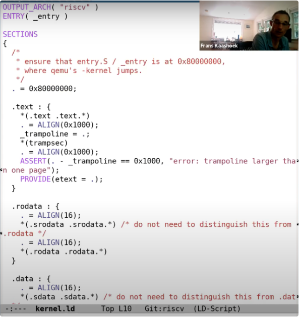
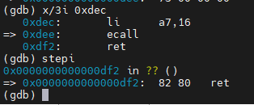

# Lesson 1

操作系统的目的

- 抽象和管理硬件。
- 在多个应用程序之间共用硬件资源，实现硬件的多路复用。
- 隔离
- 共享
- 权限控制
- 高性能，多用途。

对操作系统的大致认知：

- 首先，会有类似于Shell，echo，find或者任何你实现的工具程序，这些程序运行在操作系统之上。

- 而操作系统又抽象了一些硬件资源，例如磁盘，CPU。

- 通常来说操作系统和应用程序之前的接口被称为系统调用接口（System call interface），我们这门课程看到的接口都是Unix风格的接口。基于这些Unix接口，你们在lab1中，完成了不同的应用程序。

- 

# Lec03 组织结构 & 系统调用

### ==Q：为什么不将操作系统封装成一个库？==

> 操作系统的主要作用之一是并发执行各种用户程序，这要求操作系统对每个程序实现资源的时间共享（即对于同一个资源，同一个时间点的每个程序的获取优先级应当是一样的）。
>
> 而封装成库的前提是 **使用操作系统的所有程序之间是非恶意的、可信的**（因为调用库时 **应用程序可以直接与硬件交互**），这样，各程序主动周期性的放弃 CPU 才可以实现一种基于合作的时间共享策略。但是，bug 是不可避免的，所以封装成库会导致单个程序的崩溃影响其他程序的运行。
>
> 即，**隔离性** 不够强。

### 操作系统的三大需求

- 复用
- 隔离性
  - 设计操作系统组织结构的驱动力。
  - **实现手段：**
    - 内核模式和用户模式：隔离操作系统内核和用户应用程序。
    - 系统调用：用户程序转换到内核执行的基本方法。
- 交互（进程间的交互）

## 3.1 组织结构

操作系统抽象了一系列的硬件资源，类似于 shell、echo 等工具在操作系统之上，这些工具通过系统调用与内核交互。用户可以通过这些工具间接调用内核管理的资源。

## 3.2 隔离性

- 不同用户程序之间需要有强隔离性。（包括内存）

- 用户程序和内核之间需要有强隔离性。

### ==Q：如果没有操作系统==

如果没有操作系统（用户程序和硬件资源之间的一个额外的抽象层），用户程序将直接与硬件交互，即，用户程序可以直接看到 CPU 的多核、磁盘、内存等。

- **复用**

  由于使用操作系统的一个目的是为了 **同时运行多个应用程序**，所以 CPU 会时不时地从一个应用程序切换到另一个应用程序。我们假设硬件资源里只有一个 CPU 核，并且我们现在在这个 CPU 核上运行 Shell。但是时不时地也需要让其他的应用程序也可以运行。现在我们没有操作系统来帮我们完成切换，所以 Shell 就需要时不时的释放 CPU 资源。为了不变成一个恶意程序，Shell 在发现自己运行了一段时间之后，需要让别的程序也有机会能运行（协同调度，Cooperative Scheduling）。但是这里的场景并没有很好的隔离性，比如说 Shell 中的某个函数有一个死循环，那么 Shell 永远也不会释放 CPU，进而其他的应用程序也不能够运行，甚至都不能运行一个第三方的程序来停止或者杀死 Shell 程序。所以这种场景下，我们基本上得不到真正的 multiplexing（CPU 在多进程同分时复用）。

  **Q：当应用程序表现的恶意或者就是在一个死循环中，内核是如何夺回控制权限的？**

  > 内核会通过硬件设置一个定时器，定时器到期之后会将控制权限从用户空间转移到内核空间，之后内核就有了控制能力并可以重新调度 CPU 到另一个进程中。我们接下来会看一些更加详细的细节。

- **内存隔离**

  从 **内存的角度** 来说，如果应用程序直接运行在硬件资源之上，那么每个应用程序的文本，代码和数据都直接保存在物理内存中。物理内存中的一部分被 Shell 使用，另一部分被 echo 使用。即使在这么简单的例子中，因为两个应用程序的内存之间没有边界，如果 echo 程序将数据存储在属于 Shell 的一个内存地址中，那么 echo 就会覆盖 Shell 程序内存中的内容。这是非常不想看到的场景，因为 echo 现在渗透到了 Shell 中来，并且这类的问题是非常难定位的。所以这里也没有为我们提供好的隔离性。我们**希望不同应用程序之间的内存是隔离的**，这样一个应用程序就不会覆盖另一个应用程序的内存。

所以，将操作系统设计成一个库，并不是一种常见的设计。你或许可以在一些实时操作系统中看到这样的设计，因为在这些实时操作系统中，应用程序之间彼此相互信任。但是在大部分的其他操作系统中，都会强制实现硬件资源的隔离。

## 3.3 隔离性的实现

操作系统需要能够应对恶意的应用程序，一种设计原则是内核必须要将用户应用程序或者进程当做是恶意的。

应用程序不能够打破对它的隔离。

### a. 内核模式和用户模式

为了支持 user/kernel mode，处理器会有两种操作模式，第一种是 **user mode**，第二种是 **kernel mode**。当运行在 kernel mode 时，CPU 可以运行特定权限的指令（privileged instructions）；当运行在 user mode 时，CPU只能运行普通权限的指令（unprivileged instructions）。

特殊权限指令主要是一些直接操纵硬件的指令和设置保护的指令，例如设置 page table 寄存器、关闭时钟中断。在处理器上有各种各样的状态，操作系统会使用这些状态，但是只能通过特殊权限指令来变更这些状态。

举个例子，当一个应用程序尝试执行一条特殊权限指令，因为不允许在 user mode 执行特殊权限指令，处理器会拒绝执行这条指令。通常来说，这时会将控制权限从 user mode 切换到 kernel mode，当操作系统拿到控制权之后，或许会杀掉进程，因为应用程序执行了不该执行的指令。

实际上 RISC-V 还有第三种模式称为 **machine mode**，它拥有完整的特权，一般负责计算机的配置。应当尽快从 machine mode 转换到 kernel mode。

#### Q：如何判断 kernel mode 和 user mode？

> 在处理器里面有一个 flag。在处理器的一个 bit，当它为 1 的时候是 user mode，当它为 0 时是 kernel mode。当处理器在解析指令时，如果指令是特殊权限指令，并且该 bit 被设置为1，处理器会拒绝执行这条指令。
>

#### RISC-V 中的模式切换

在 RISC-V 中，有一个专门的指令用来实现这个功能，叫做 ECALL。ECALL 接收一个数字参数，当一个用户程序想要将程序执行的控制权转移到内核，它只需要执行 ECALL 指令，并传入一个数字，数字代表了应用程序想要调用的 System Call。

ECALL 会跳转到内核中一个特定，由内核控制的位置。XV6 中存在一个唯一的系统调用接入点，每一次应用程序执行 ECALL 指令，应用程序都会通过这个接入点进入到内核中。

### b. 虚拟内存

处理器包含了 page table，而 page table 将虚拟内存地址与物理内存地址做了映射。

每一个进程都会有自己独立的 page table，每一个进程只能访问出现在自己 page table 中的物理内存。操作系统会设置 page table，使得每一个进程都有不重合的物理内存，这样一个进程就不能访问其他进程的物理内存。

## 3.6 宏内核 & 微内核（内核结构）

### a. 宏内核

所有的操作系统服务都在 kernel mode 中。在一个宏内核中，任何一个操作系统的 Bug 都有可能成为漏洞。宏内核的优势在于，因为这些文件系统，虚拟内存，进程管理等子模块现在都位于同一个程序中，它们可以紧密的集成在一起，这样的集成提供很好的性能。

### b. 微内核

微内核的目的在于将大部分的操作系统运行在内核之外，以减少内核中的代码。所以，我们会将原来在内核中的其他部分，作为普通的用户程序来运行。因为在内核中的代码的数量较小，更少的代码意味着更少的 Bug。但对于任何文件系统的交互，都需要分别完成 **2 次用户空间<->内核空间的跳转**。与宏内核对比，在宏内核中如果一个应用程序需要与文件系统交互，只需要完成 1 次用户空间<->内核空间的跳转，所以微内核的的跳转是宏内核的两倍。通常微内核的挑战在于性能更差，这里有两个方面需要考虑：①在 user / kernel mode 反复跳转带来的性能损耗。②在一个类似宏内核的紧耦合系统，各个组成部分，例如文件系统和虚拟内存系统，可以很容易的共享page cache。而在微内核中，每个部分之间都很好的隔离开了，这种共享更难实现。进而导致更难在微内核中得到更高的性能。

## 3.7 编译运行 kernel

### a. XV6 结构

- kernel

  因为 XV6 是一个宏内核结构，这里所有的文件会被编译成一个叫做 kernel 的二进制文件，然后这个二进制文件会被运行在 kernle mode 中。

  

- user

  这基本上是运行在 user mode 的程序。

- mkfs

  它会创建一个空的文件镜像，我们会将这个镜像存在磁盘上，这样我们就可以直接使用一个空的文件系统。

### b. XV6 编译

首先，Makefile（XV6目录下的文件）会读取一个 C 文件，例如 **proc.c**；之后调用 gcc 编译器，生成一个文件叫做 **proc.s**，这是 RISC-V 汇编语言文件；之后再走到汇编解释器，生成 **proc.o**，这是汇编语言的二进制格式。

Makefile 会为所有内核文件做相同的操作。之后，系统加载器（Loader）会收集所有的 .o 文件，将它们 **链接** 在一起，并生成内核文件。

这里生成的内核文件就是将在 QEMU 中运行的文件。同时，为了方便，Makefile 还会创建 kernel.asm，这里包含了内核的完整汇编语言，可以查看它来定位究竟是哪个指令导致了 Bug。

#### 举个例子

查看 kernel.asm 文件，我们可以看到用汇编指令描述的内核：

可以看到，第一个指令位于地址 0x80000000，对应的是一个 RISC-V 指令：auipc 指令。其中第二列，例如 0x0000a117、0x83010113、0x6505，是汇编指令的 16 进制表现形式，比如，0x0000a117 就是 auipc。

## 3.8 QEMU

QEMU 表现的就像一个真正的计算机一样，它表示的是一个真正的主板。当你通过QEMU 来运行你的内核时，你应该认为你的内核是运行在这样一个主板之上。主板有一个开关，一个 RISC-V 处理器，有支持外设的空间，比如说一个接口是连接网线的，一个是 PCI-E 插槽，主板上还有一些内存芯片，这是一个你可以在上面编程的物理硬件，而 XV6 操作系统管理这样一块主板。

直观来看，QEMU 是一个大型的开源 C 程序，但是在内部，在 QEMU 的主循环中，只在做一件事情：

- 读取 4 字节或者 8 字节的 RISC-V 指令。

- 解析 RISC-V 指令，并找出对应的操作码（op code）。我们之前在看 kernel.asm 的时候，看过一些操作码的二进制版本。通过解析，或许可以知道这是一个 ADD 指令，或者是一个 SUB 指令。
- 之后，在软件中执行相应的指令。

这基本上就是 QEMU 的全部工作了，对于每个 CPU 核，QEMU 都会运行这么一个循环。

为了完成这里的工作，QEMU 的主循环需要维护寄存器的状态。所以 QEMU 会有以 C 语言声明的类似于 X0，X1 寄存器等等。

除了仿真所有的普通权限指令之外，QEMU 还会仿真所有的特殊权限指令。

## 3.9 XV6 启动过程

首先，我会启动 QEMU，并打开 gdb。本质上来说 QEMU 内部有一个 gdb server，当我们启动之后，QEMU 会等待 gdb 客户端连接。

我会在我的计算机上再启动一个 gdb 客户端，这里是一个 RISC-V 64 位 Linux 的 gdb。

在连接上之后，我会在程序的入口处设置一个端点，因为我们知道这是 QEMU 会跳转到的第一个指令。

设置完断点之后，我运行程序，可以发现代码并没有停在 0x8000000（见 3.7 kernel.asm 中，0x80000000 是程序的起始位置），而是停在了 0x8000000a（之前是一些设置指令）。

我们可以看到，在地址 0x8000000a 读取了控制系统寄存器（Control System Register）mhartid，并将结果加载到了 a1 寄存器。所以 QEMU 会模拟执行这条指令，之后执行下一条指令。

地址 0x80000000 是一个被 QEMU 认可的地址。也就是说如果你想使用 QEMU，那么第一个指令地址必须是它。所以，我们会让内核加载器从那个位置开始加载内核。如果我们查看 kernel.ld，我们可以看到，这个文件定义了内核是如何被加载的，从这里也可以看到，内核使用的起始地址就是 QEMU 指定的 0x80000000 这个地址。这就是我们操作系统最初运行的步骤。

XV6 从 entry.s 开始启动，这个时候没有内存分页，没有隔离性，并且运行在 M-mode（machine mode）。XV6 会尽可能快的跳转到 kernel mode 或者说是 supervisor mode。我们在 main 函数设置一个断点，main 函数已经运行在 supervisor mode 了。接下来我运行程序，代码会在断点，也就是 main 函数的第一条指令停住。

接下来，我想运行在 gdb 的 layout split 模式：

从这个视图可以看出 gdb 要执行的下一条指令是什么，断点具体在什么位置。

接下来是一些初始化代码：

- consoleinit：设置 console
- kinit：设置好页表分配器（page allocator）
- kvminit：设置好虚拟内存，这是下节课的内容
- kvminithart：打开页表，也是下节课的内容
- processinit：设置好初始进程或者说设置好进程表单
- trapinit/trapinithart：设置好 user/kernel mode 转换代码
- plicinit/plicinithart：设置好中断控制器 PLIC（Platform Level Interrupt Controller），我们后面在介绍中断的时候会详细的介绍这部分，这是我们用来与磁盘和 console 交互方式
- binit：分配 buffer cache
- iinit：初始化 inode缓存
- fileinit：初始化文件系统
- virtio_disk_init：初始化磁盘
- userinit：最后当所有的设置都完成了，操作系统也运行起来了，会通过 userinit 运行第一个进程，这里有点意思，接下来我们看一下 userinit。

我们总是需要有一个用户进程在运行，这样才能实现与操作系统的交互，所以这里需要一个小程序来初始化第一个用户进程。这个小程序定义在 initcode 中。这里直接是程序的二进制形式，它会链接或者在内核中直接静态定义。实际上，这段代码对应了下面的汇编程序。

这个汇编程序中，它首先将 init 中的地址加载到 a0（la a0, init），argv 中的地址加载到 a1（la a1, argv），exec 系统调用对应的数字加载到 a7（li a7, SYS_exec），最后调用 ECALL。所以这里执行了 3 条指令，之后在第 4 条指令将控制权交给了操作系统。

如果我在 syscall 中设置一个断点，可以到达 syscall 查看。

*num = p->trapframe->a7* 会读取使用的系统调用对应的整数。如果我们查看 syscall.h，可以看到 7 对应的是 exec 系统调用。所以，这里本质上是告诉内核，某个用户应用程序执行了 ECALL 指令，并且想要调用 exec 系统调用。

*p->trapframe->a0 = syscall[num] ()* 这一行是实际执行系统调用。这里可以看出，num用来索引一个数组，这个数组是一个函数指针数组，可以预期的是 syscall[7] 对应了 exec 的入口函数。我们跳到这个函数中去，可以看到，我们现在在 sys_exec 函数中。

sys_exec 中的第一件事情是从用户空间读取参数，它会读取 path，也就是要执行程序的文件名。这里首先会为参数分配空间，然后从用户空间将参数拷贝到内核空间。之后我们打印 path，可以看到传入的就是 init 程序。所以，综合来看，initcode 完成了通过 exec 调用 init 程序。

我们来看看 init 程序，init 会为用户空间设置好一些东西，比如配置好 console，调用fork，并在 fork 出的子进程中执行 shell。

最终的效果就是 Shell 运行起来了。如果我再次运行代码，我还会陷入到 syscall 中的断点，并且同样也是调用 exec 系统调用，只是这次是通过 exec 运行 Shell。当 Shell 运行起来之后，我们可以从 QEMU 看到 Shell。

# Lec04 页表

## 4.1 页表（实现地址空间）

页表实现了地址空间，即，**在一个物理内存上创建不同虚拟地址空间**。换句话说，页表提供了一层从虚拟地址到物理地址的映射抽象。

页表记录了 **虚拟地址和物理地址的映射关系**。页表保存在 **内存** 中。**内存管理单元（MMU）**通过访问内存中的页表实现地址翻译。

多核计算机中，每个 CPU 可访问的物理内存是不同的。因此，每个 CPU 都需要有寄存器保存页表的物理内存地址。$\color{brown}（RISC-V\ 中的\ satp\ 寄存器）$

为保证进程之间的隔离性，**每个进程都应当有自己的页表**，并且该页表记录了应用程序的地址空间。当操作系统将 CPU 从一个进程切换到另一个进程时，同时也需要 **切换 satp 寄存器中的内容**，从而指向新的进程保存在物理内存中的页表。每个进程对应的 **satp 值是由内核保存的**，写 satp 寄存器是一条特殊权限指令。所以，用户程序不能通过更新这个寄存器来切换页表。

一个虚拟地址创建一条条目是不现实的（消耗内存），通常为每一页（连续的 4096 byte）创建一条条目（虚拟地址中保存了页中的偏移量），因此称为页表。

## 4.2 RISC-V 中的页表实现

- 虚拟地址是 **64 位** 的，高 25 位并没有被使用。在剩下的 39 位中，**27 位被用来当作 index（页表索引）**，**12 位被用来当作 offset（物理页中的偏移）**。offset 必须是 12 位，因为对应了一个 page 的 4096 个字节。

- **一个进程的页表最多有 $2^{27}$ 个条目**（PTE，Page Table Entry），因为虚拟地址有 27 位被用来当作 index。一个条目长 8 个字节，64位，包含 **44 位的物理 page 号**（PPN，Physical Page Number）** 和 **10 位的标志位**。

- 物理内存地址是 **56 位**，其中 **44 位是物理 page 号**（PPN，Physical Page Number），剩下 **12 位是 offset** ，完全继承自虚拟内存地址。

- **27 位的 index 指向一条条目，条目中的 44 位 PPN 就是物理页号，再加上 12 位的 offset，就是实际的物理地址。**

  

- 如果每个进程都使用这么大的页表，进程需要为页表消耗大量的内存，并且很快物理内存就会耗尽。所以硬件并不是按照这里的方式来存储页表。**实际中，页表是一个三级的结构。**

- 虚拟内存地址中的 27 位的 index 是由 **3 个 9 位** 的数字组成**（L2，L1，L0）**。前 9 位被用来索引最高级的 page directory。所以实际上，**SATP 寄存器** 会指向最高一级的 page directory 的物理内存地址，之后用虚拟内存中 index 的高 9 位用来索引最高一级的 page directory (注，$2^9 = 512$，正好可以索引到一条 PTE)，这样我们就能得到一个 PPN，也就是物理 page 号。这个 PPN 指向了中间级的 page directory。当我们在使用中间级的 page directory 时，我们通过虚拟内存地址中的 L1 部分完成索引。接下来会走到最低级的 page directory，我们通过虚拟内存地址中的 L0 部分完成索引。在最低级的 page directory 中，我们可以得到对应于虚拟内存地址的物理内存地址。

  

  这种方式的主要优点是，只要三张 $2^9$ 的页表就可以替代一张 $2^{27}$ 的页表。

- 每个 PTE 的低 10 位是标志位：

  - 第一个标志位是 Valid。为1，表明这是一条合法的 PTE，你可以用它来做地址翻译，否则你不能使用这条 PTE。
  - 下两个标志位分别是 Readable 和 Writable。表明你是否可以读/写这个 page。
  - Executable 表明你可以从这个 page 执行指令。
  - User 表明这个 page 可以被运行在用户空间的进程访问。若该标志位未被设置，则该页表只能在 supervisor mode 中使用。

  

## 4.3 XV6 内核中的页表

- 右半部分（物理内存 DRAM + I/O 设备）结构完全由硬件设计者决定。

  - 如果得到的物理地址大于 0x80000000 会走向 DRAM 芯片，如果得到的物理地址低于 0x80000000 会走向不同的 I/O 设备。

  - 地址 0 保留。
  - 地址 0x1000 是 boot ROM 的物理地址，**当你对主板上电，主板做的第一件事情就是运行存储在 boot ROM 中的代码，当 boot 完成之后，会跳转到地址 0x80000000 启动操作系统。**
  - 地址 0x10090000 对应以太网。
  - 地址 0x80000000 对应内存。
  - PLIC 是中断控制器（Platform-Level Interrupt Controller）
  - CLINT（Core Local Interruptor）也是中断的一部分。多个设备都能产生中断，需要中断控制器来将这些中断路由到合适的处理函数。地址 0x02000000 对应 CLINT，当你向这个地址执行读写指令，你是向实现了 CLINT 的芯片执行读写。
  - UART0（Universal Asynchronous Receiver/Transmitter）负责与 Console 和显示器交互。
  - VIRTIO disk，与磁盘进行交互。

- 左半部分（内核虚拟地址空间）。**当机器刚刚启动时，还没有可用的 page，XV6 操作系统会设置好内核使用的虚拟地址空间，也就是这张图左边的地址分布。**
  - 因为我们想让 XV6 尽可能的简单易懂，所以这里的虚拟地址到物理地址的映射，大部分是相等的关系。比如说内核会按照这种方式设置页表，虚拟地址 0x02000000 对应物理地址 0x02000000。这意味着左侧低于 PHYSTOP 的虚拟地址，与右侧使用的物理地址是一样的。
  - 第一件事情是，有一些 page 在虚拟内存中的地址很靠后，比如 kernel stack 在虚拟内存中的地址就很靠后。这是因为在它之下有一个未被映射的 **Guard page**，这个 Guard page 对应的 PTE 的Valid 标志位没有设置，这样，**如果 kernel stack 耗尽了，它会溢出到 Guard page，但是因为Guard page 的 PTE 中 Valid 标志位未设置，会导致立即触发 page fault**，这样的结果好过内存越界之后造成的数据混乱。立即触发一个 panic（也就是 page fault），你就知道kernel stack出错了。同时我们也又不想浪费物理内存给 Guard page，所以 **Guard page 不会映射到任何物理内存，它只是占据了虚拟地址空间的一段靠后的地址。**同时，**kernel stack 被映射了两次**，==在靠后的虚拟地址映射了一次，在 PHYSTOP 下的 Kernel data 中又映射了一次，但是实际使用的时候用的是上面的部分，因为有Guard page会更加安全。==你可以向同一个物理地址映射两个虚拟地址，你可以不将一个虚拟地址映射到物理地址。可以是一对一的映射，一对多映射，多对一映射。
  - 第二件事情是权限。例如 Kernel text page 被标位 R-X，意味着你可以读它，也可以在这个地址段执行指令，但是你不能向 Kernel text 写数据。通过设置权限我们可以尽早发现 Bug 从而避免 Bug。对于 Kernel data 需要能被写入，所以它的标志位是 RW-，但是你不能在这个地址段运行指令，所以它的 X 标志位未被设置。（注，所以，kernel text 用来存代码，代码可以读，可以运行，但是不能篡改，kernel data 用来存数据，数据可以读写，但是不能通过数据伪装代码在 kernel 中运行）

- **每个用户进程都有一个对应的 kernel stack。**
- 在 **内核页表** 中，有一段 Free Memory，它对应了物理内存中的一段地址。**$\color{brown}XV6\ 使用这段\ free memory\ 来存放用户进程的\ page table，text\ 和\ data。$**如果我们运行了非常多的用户进程，某个时间点我们会耗尽这段内存，这个时候 fork 或者 exec 会返回错误。
- 当内核创建了一个进程，针对这个进程的页表会从 Free memory 中分配出来。内核会为用户进程的页表分配 page，并填入 PTE。**在某个时间点，当内核运行了这个进程，内核会将进程的根页表的地址加载到 SATP 中。**从那个时间点开始，处理器会使用内核为那个进程构建的虚拟地址空间。

### XV6 中一个用户进程的虚拟空间

虽然用户进程的页表是在内核的 Free Memory 中分配的，但是用户进程的虚拟地址空间大小和内核是一样的。

## 4.4 页表缓存 TLB（在 CPU 核中，而非内存中）

当处理器从内存加载或者存储数据时，基本上都要做 **3 次访存**（第一次在最高级的 page directory，第二次在中间级的 page directory，最后一次在最低级的 page directory），这里代价有点高。

所以实际中，几乎所有的处理器都会对于最近使用过的虚拟地址的翻译结果有缓存。这个缓存被称为：**Translation Lookside Buffer（TLB，页表缓存）**，即，PTE 的缓存。

当处理器第一次查找一个虚拟地址时，硬件通过 3 级页表得到最终的 PPN，TLB 会保存虚拟地址到物理地址的映射关系。这样下一次当你访问同一个虚拟地址时，处理器可以查看 TLB，TLB 会直接返回物理地址，而不需要通过页表得到结果。

如果你切换了页表，操作系统需要告诉处理器当前正在切换页表，**处理器会清空 TLB**。因为本质上来说，如果你切换了页表，TLB 中的缓存将不再有用，它们需要被清空，否则地址翻译可能会出错。$\color{brown}在 RISC-V 中，清空 TLB 的指令是 sfence\_vma。$

## 4.4 XV6 中页表的工作

#### ==Q：为什么 OS 中需要有函数 walk 模拟 MMU 的功能？==

### a. kvminit - 创建内核虚拟空间

### b. kvminithart - 设置 satp 寄存器，之后 MMU 开始地址翻译

### c. walk - 返回最终 PTE 地址

# Lec05 Calling conventions and stack frames RISC-V

## 5.1 RISC-V & x86

RISC：精简指令集（Reduced Instruction Set Computer），RISC-V、ARM。

CISC：复杂指令集（Complex Instruction Set Computer），x86。

## 5.2 gdb和汇编代码执行

### 汇编指令中的 .session 、.global、 .text

- .global：表示你可以在其他文件中调用这个函数
- .text：下面是代码

### gdb 中指令

- tui enable：打开源代码展示窗口。
- layout asm：在 tui 窗口看到所有的汇编指令。
- layout reg：在 tui 窗口看到所有的寄存器信息。
- layout src：在 tui 窗口看到源代码。
- info breakpoints：查看设置的端点。
- info reg：查看寄存器信息。
- i frame：打印 stack frame。

- gdb 窗口的右上角是程序计数器。如果代码出现了问题，在gdb中看到的地址，你可以直接在kernel.asm找到具体的行，分析问题的原因，然后再向相应的地址设置断点。

## 5.3 栈

- 这是一个非常简单的栈的结构图，其中每一个区域都是一个 Stack Frame，每执行一次函数调用就会产生一个 Stack Frame。函数通过移动 Stack Pointer 来完成 Stack Frame 的空间分配。

- 一个函数的 Stack Frame 包含了保存的寄存器，本地变量，并且，如果函数的参数多于8个，额外的参数会出现在 Stack 中。所以 Stack Frame 大小并不总是一样，即使在这个图里面看起来是一样大的。
- 对于 Stack 来说，是从高地址开始向低地址使用。所以栈总是 **向下增长**。当我们想要创建一个新的 Stack Frame 的时候，总是对当前的 Stack Pointer 做减法。
- 有关 Stack Frame 有两件事情是确定的：
  - Return address 总是会出现在 Stack Frame 的第一位
  - 指向前一个 Stack Frame 的指针也会出现在栈中的固定位置。
- 有两个重要的寄存器：
  - 第一个是 SP（Stack Pointer），它指向 Stack 的底部并代表了当前 Stack Frame 的位置。第二个是 FP（Frame Pointer），它指向当前 Stack Frame 的顶部。因为 Return address 和指向前一个 Stack Frame 的的指针都在当前 Stack Frame 的固定位置，所以可以通过当前的 FP 寄存器寻址到这两个数据。当前函数返回时，我们可以将前一个 Frame Pointer 存储到 FP 寄存器中。所以我们使用 Frame Pointer 来操纵我们的 Stack Frames，并确保我们总是指向正确的函数。

# Lec06 Trap

## 6.1 Trap 机制（要尽量简单，隔离性 + 透明）

### a. trap 触发条件：

- 程序执行系统调用
- 程序出现了类似 page fault、运算时除以 0 的 exception
- 一个设备触发了中断使得当前程序运行需要响应内核设备驱动

### b. trap 流程

- 首先，我们需要保存 32 个用户寄存器的内容。因为很显然我们需要恢复用户应用程序的执行，尤其是当用户程序随机的被设备中断所打断时。我们希望内核能够响应中断，之后在用户程序完全无感知的情况下再恢复用户代码的执行。但是这些寄存器又要被内核代码所使用，所以在 trap 之前，必须先在某处（trapframe）保存这 32 个用户寄存器。（为了安全和隔离性，trap 机制不应当依赖于任何用户空间的东西，用户在寄存器中存储的数据可能是恶意的，所以，XV6 的 trap 机制不会查看这些寄存器，而只是将它们保存起来。）32 个寄存器包括：

  - stack pointer（也叫做堆栈寄存器 stack register）。

  - 程序计数器（Program Counter Register）。
  - 表明当前 supervisor mode / user mode 的标志位（必须在 supervisor mode 中修改）。
    - s**upervisor mode 可以读写控制寄存器**。比如： SATP 寄存器（page table 的指针）、STVEC（处理 trap 的内核指令地址、SEPC（保存当发生 trap 时的程序计数器）、SSCRATCH 等。
    - **upervisor mode 可以使用 PTE_U 标志位为 0 的 PTE**。当 PTE_U 标志位为 1 的时候，表明用户代码可以使用这个页表；如果这个标志位为 0，则只有 supervisor mode 可以使用这个页表。
    - 需要特别指出的是，**supervisor mode 中的代码并不能读写任意物理地址**。supervisor mode 也需要通过 page table 来访问内存。如果一个虚拟地址并不在当前由 SATP 指向的 page table 中，又或者 SATP 指向的 page table 中 PTE_U=1，那么 supervisor mode 不能使用那个地址。所以，即使我们在 supervisor mode，我们还是受限于当前 page table 设置的虚拟地址。
  - 控制 CPU 工作方式的寄存器，比如 SATP（Supervisor Address Translation and Protection）寄存器，它包含了指向 page table 的物理内存地址。
  - STVEC（Supervisor Trap Vector Base Address Register）寄存器，它指向了内核中处理 trap 的指令的起始地址。
  - SEPC（Supervisor Exception Program Counter）寄存器，在 trap 的过程中保存程序计数器的值。
  - SSRATCH（Supervisor Scratch Register）寄存器，这也是个非常重要的寄存器（详见6.5）。

- 然后，产生 trap 的程序计数器也需要在某个地方保存，因为我们需要能够在用户程序运行中断的位置继续执行用户程序。

- 然后，将 mode 改成 supervisor mode，因为我们想要使用内核中的各种各样的特权指令。

- 现在，SATP 寄存器指向 user page table，而 user page table 并没有包含整个内核数据的内存映射。所以在运行内核代码之前，我们需要将 SATP 指向 kernel page table。

- 我们需要将堆栈寄存器指向位于内核的一个地址，因为我们需要一个堆栈来调用内核的 C 函数。

- 一旦我们设置好了，并且所有的硬件状态都适合在内核中使用， 我们需要跳入内核的 C 代码。

## 6.2 Trap 代码执行流程 - write

write 通过执行 ECALL 指令来执行系统调用。ECALL 指令会切换到具有 supervisor mode 的内核中。

- 内核中执行的第一个指令是一个由汇编语言写的函数，叫做 uservec。这个函数是内核代码 trampoline.s 文件的一部分。
- 之后，在这个汇编函数中，代码执行跳转到了由 C 语言实现的函数 usertrap 中，这个函数在 trap.c 中。
- usertrap 这个C函数执行了一个叫做 syscall 的函数。这个函数会在一个表单中，根据传入的代表系统调用的数字进行查找，并在内核中执行具体实现了系统调用功能的函数。比如，sys_write。
- sys_write 会将要显示数据输出到 console 上，当它完成了之后，它会返回给 syscall 函数。
- 在 syscall 函数中，会调用一个函数叫做 usertrapret，它也位于 trap.c 中，这个函数完成了部分方便在 C 代码中实现的返回到用户空间的工作。
- 除此之外，最终还有一些工作只能在汇编语言中完成。这部分工作通过汇编语言实现，并且存在于trampoline.s 文件中的 userret 函数中。
- 最终，在这个汇编函数中会调用机器指令返回到用户空间，并且恢复 ECALL 之后的用户程序的执行。

### Q：执行系统调用时，为什么不直接返回一个页表的地址，指向系统调用的实现？

read 和 write 系统调用，相比内存的读写，他们的代价都高的多，因为它们需要切换模式，并来回捣腾。有没有可能当你执行打开一个文件的系统调用时， 直接得到一个 page table 映射，而不是返回一个文件描述符？这样只需要向对应于设备的特定的地址写数据，程序就能通过 page table 访问特定的设备。这样就不用像系统调用一样在用户空间和内核空间来回捣腾了。

> A：实际上很多操作系统都提供这种叫做内存映射文件（Memory-mapped file access）的机制，通过 page table，可以将用户空间的虚拟地址空间，对应到文件内容，这样就可以通过内存地址直接读写文件。实际上，你们将在mmap 实验中完成这个机制。对于许多程序来说，这个机制的确会比直接调用read/write系统调用要快的多。

## 6.3 ECALL 指令之前的状态

gdb 跟踪 write 系统调用：

查看 sh.asm，获取 ecall 指令地址为 0xdee：

在 gdb 中，在 ecall 处设置断点：

查看寄存器，a0，a1，a2 是 Shell 传递给 write 系统调用的参数。所以 a0 是文件描述符 2；a1 是 Shell 想要写入字符串的指针；a2 是想要写入的字符数。

查看 satp 寄存器中的页表信息：

从 qemu 界面，输入 ctrl a + c 进入 qemu 的控制台，打印页表信息，这是用户程序 Shell 的 page table：

后面两条页表分别是 trapframe page 和 trampoline page。（用户不能访问没有设置 u 的页表）

执行 ecall 指令：

## 6.4 ECALL 指令之后的状态

**由于 ecall 不会切换页表，所以 trap 处理代码必须可以从 user page table 中获知，也就是 trampoline page**。

**在之前，内核就已经将 trampoline page 的地址存储在了 STVEC 寄存器中，所以 ecall 指令可以根据 STVEC 寄存器跳入 trampoline page。**

执行完 ecall 指令后，进入内核。打印程序计数器查看当前地址，发现当前在 trampoline page（0x3ffffff000） 的最开始。（**此时已进入内核但仍然只能访问 user page table，因为 satp 寄存器还未被修改**）

查看将要执行的指令，也就是 trampoline.S 的内容：

（csrrw 指令互换 sscratch 和 a0 的值。）

### ecall 执行的三件事情

- 第一，ecall 将代码从 user mode 改到 supervisor mode。

- 第二，ecall 将用户进程时的程序计数器的值保存在了 SEPC 寄存器（用户进程执行系统调用的指令的地址）。然后将程序计数器的值修改为 STVEC 寄存器中的地址（trampoline page）。
- 第三，ecall 会跳转到 STVEC 寄存器指向的地址（trampoline page）。在执行 ecall 后，程序计数器的值已经变成了当前在 trampoline page 中的地址。

### 还需要实现的工作

- 保存 32 个用户寄存器的内容，这样当我们想要恢复用户代码执行时，我们才能恢复这些寄存器的内容。
- 切换到 kernel page table。
- 创建或者找到一个 kernel stack，并将 Stack Pointer 寄存器的内容指向那个 kernel stack 。这样才能给 C 代码提供栈。

## 6.5 uservec 函数

现在程序位于 trampoline page 的起始，也是 uservec 函数的起始。

XV6 在每个用户页表中设计了 trapframe page（0x3ffffffe000），用来存储用户进程的信息，比如，32 个寄存器的值。在进入到 user space 之前，**内核会将 trapframe page 的地址保存在 SSCRATCH 寄存器中。**

### uservec 的任务

- 将寄存器保存到 trapframe page 中
- sp = kernek_sp（内核栈地址，之前就设置好的）
- 

查看 trampoline.S 代码：

这里实现的是将每个寄存器保存在 trapframe 的不同偏移位置。（csrrw 互换两个寄存器的值，因此 a0 当前的值是 trapframe page 的首地址）。

然后将 a0 指向的内存地址往后数的第 8 个字节开始的数据 kernel_sp 加载到 Stack Pointer 寄存器。trapframe 中的 kernel_sp 是由 kernel 在进入用户空间之前就设置好的，它的值是这个进程的 kernel stack。所以这条指令的作用是初始化 Stack Pointer 指向这个进程的 kernel stack 的最顶端。

这条指令是向 t0 寄存器写入数据。这里写入的是我们将要执行的第一个 C 函数的指针，也就是函数 usertrap 的指针。我们在后面会使用这个指针。

下一条指令是向 t1 寄存器写入数据。这里写入的是 kernel page table 的地址。严格来说，t1 的内容并不是kernel page table 的地址，它包含了 kernel page table 的地址，但是移位了（注，详见4.3），并且包含了各种标志位。

下一条指令是交换 SATP 和 t1 寄存器。这条指令执行完成之后，当前程序会从 user page table 切换到 kernel page table 。在 QEMU 中打印 page table，可以看出与之前的 page table 完全不一样。

### Q：为什么切换到 kernel page table 后 trampoline 中的程序还能正常执行？

毕竟我们在内存中的某个位置执行代码，程序计数器保存的是虚拟地址，如果我们切换了page table，为什么同一个虚拟地址不会通过新的 page table 寻址走到一些无关的 page 中？

> A：因为我们还在 trampoline 代码中，而 trampoline 代码在用户空间和内核空间都映射到了同一个地址。

之所以叫 trampoline page，是因为你某种程度在它上面“弹跳”了一下，然后从用户空间走到了内核空间。

最后一条指令是 *jr t0*。执行了这条指令，就跳转到了 usertrap 函数。

## 6.6 usertrap 函数

usertrap 某种程度上存储并恢复硬件状态，但是它也需要检查触发 trap 的原因，以确定相应的处理方式。

在内核中执行任何操作之前，usertrap 中先将 STVEC 指向了 kernelvec 变量，这是内核空间 trap 处理代码的位置，而不是用户空间 trap 处理代码的位置。

然后获取当前进程。

接下来保存用户程序计数器，它仍然保存在 SEPC 寄存器中，但是可能发生这种情况：当程序还在内核中执行时，我们可能切换到另一个进程，并进入到那个程序的用户空间，然后那个进程可能再调用一个系统调用进而导致 SEPC 寄存器的内容被覆盖。所以，我们需要 **保存当前进程的 SEPC 寄存器到一个与该进程关联的内存中**，这样这个数据才不会被覆盖。这里我们使用 trapframe 来保存这个程序计数器。

接下来我们需要找出触发 trap 的原因，RISC-V 的 SCAUSE 寄存器保存了原因。数字 8 表明当前 trap 是因为系统调用。

当我们恢复用户程序时，我们希望在下一条指令恢复，也就是 ecall 之后的一条指令。所以对于系统调用，我们对于保存的用户程序计数器加 4，这样我们会在 ecall 的下一条指令恢复。

XV6 在处理系统调用是允许中断，因为系统调用可能耗时很长，所以显式的打开中断。

然后调用 syscall 函数。syscall 函数根据系统调用的编号查找相应的系统调用函数 sys_write。**syscall 函数直接通过 trapframe 来获取系统调用参数**。

从 syscall 函数返回之后，我们回到了 trap.c 中的 usertrap 函数。最后，usertrap 调用了一个函数 usertrapret。

## 6.7 usertrapret 函数 - 准备返回用户空间

usertrapret 函数设置在返回到用户空间之前内核要做的工作（C 能实现的部分）。

首先关闭中断。现在我们要将 STVEC 更新到指向用户空间的 trap 处理程序（trampoline page），当我们将 STVEC 更新到指向用户空间的 trap 处理代码时，我们仍然在内核中执行代码。如果这时发生了一个中断，那么程序执行会走向用户空间的 trap 处理代码，即便我们现在仍然在内核中，出于各种各样具体细节的原因，这会导致内核出错。

然后更新 STVEC 指向 trampoline page。那里最终会执行 sret 指令返回到用户空间。位于 trampoline 代码最后的 sret 指令会重新打开中断。

接下来的几行填入了 trapframe 的内容，这些内容对于下次执行 trampoline 代码非常有用。

- 存储了 kernel page table 的指针
- 存储了当前用户进程的 kernel stack
- 存储了 usertrap 函数的指针。
- 从 tp 寄存器中读取当前的CPU核编号，并存储在 trapframe 中。

接下来设置 SSTATUS 寄存器，这是一个控制寄存器。这个寄存器的 SPP bit 控制了 sret 指令的行为，该 bit 为 0 表示下次执行 sret 的时候，我们想要返回 user mode 而不是 supervisor mode。这个寄存器的 SPIE bit 控制在执行完 sret 之后，是否打开中断。修改完这些 bit 位之后，我们会把新的值写回到 SSTATUS 寄存器。

我们在 trampoline 代码的最后执行了 sret 指令。这条指令会将程序计数器设置成 SEPC 寄存器的值，所以现在我们将 SEPC 寄存器的值设置成之前保存的用户程序计数器的值。

接下来，我们根据 user page table 地址生成相应的 SATP 值（仅仅是虚拟地址），这样我们在返回到用户空间的时候才能完成 page table 的切换。实际上，我们会在汇编代码 trampoline 中完成 page table 的切换，并且也 **只能在 trampoline 中完成切换**，因为只有 trampoline 中代码是同时在用户和内核空间中映射。将这个指针作为第二个参数传递给汇编代码，这个参数会出现在 a1 寄存器。

计算出我们将要跳转到汇编代码的地址。我们期望跳转的地址是 tampoline 中的 userret 函数，这个函数包含了所有能将我们带回到用户空间的指令。

将 fn 指针作为一个函数指针，执行相应的函数（也就是 userret 函数）并传入两个参数，两个参数存储在 a0，a1 寄存器中。

## 6.8 userret函数

现在程序执行又到了 trampoline 代码的 userret 函数中。

第一步是切换 page table。因为 user page table 也映射了 trampoline page，所以程序还能继续执行而不是崩溃。

在 uservec 函数中，第一件事情就是交换 SSRATCH和a0寄存器。而这里，我们将SSCRATCH寄存器恢复成保存好的用户的a0寄存器。在这里a0是trapframe的地址，因为C代码usertrapret函数中将trapframe地址作为第一个参数传递过来了。112是a0寄存器在trapframe中的位置。（注，这里有点绕，本质就是通过当前的a0寄存器找出存在trapframe中的a0寄存器）我们先将这个地址里的数值保存在t0寄存器中，之后再将t0寄存器的数值保存在SSCRATCH寄存器中。

为止目前，所有的寄存器内容还是属于内核。

接下来的这些指令将a0寄存器指向的trapframe中，之前保存的寄存器的值加载到对应的各个寄存器中。之后，我们离能真正运行用户代码就很近了。

> 学生提问：现在trapframe中的a0寄存器是我们执行系统调用的返回值吗？
>
> Robert教授：是的，系统调用的返回值覆盖了我们保存在trapframe中的a0寄存器的值（详见6.6）。我们希望用户程序Shell在a0寄存器中看到系统调用的返回值。所以，trapframe中的a0寄存器现在是系统调用的返回值2。相应的SSCRATCH寄存器中的数值也应该是2，可以通过打印寄存器的值来验证。

现在我们打印所有的寄存器，

我不确定你们是否还记得，但是这些寄存器的值就是我们在最最开始看到的用户寄存器的值。例如SP寄存器保存的是user stack地址，这是一个在较小的内存地址；a1寄存器是我们传递给write的buffer指针，a2是我们传递给write函数的写入字节数。

a0寄存器现在还是个例外，它现在仍然是指向trapframe的指针，而不是保存了的用户数据。

接下来，在我们即将返回到用户空间之前，我们交换SSCRATCH寄存器和a0寄存器的值。前面我们看过了SSCRATCH现在的值是系统调用的返回值2，a0寄存器是trapframe的地址。交换完成之后，a0持有的是系统调用的返回值，SSCRATCH持有的是trapframe的地址。之后trapframe的地址会一直保存在SSCRATCH中，直到用户程序执行了另一次trap。现在我们还在kernel中。

sret是我们在kernel中的最后一条指令，当我执行完这条指令：

- 

  程序会切换回user mode

- 

  SEPC寄存器的数值会被拷贝到PC寄存器（程序计数器）

- 

  重新打开中断

现在我们回到了用户空间。打印PC寄存器，

这是一个较小的指令地址，非常像是在用户内存中。如果我们查看sh.asm，可以看到这个地址是write函数的ret指令地址。

所以，现在我们回到了用户空间，执行完ret指令之后我们就可以从write系统调用返回到Shell中了。或者更严格的说，是从触发了系统调用的write库函数中返回到Shell中。

> 学生提问：你可以再重复一下在sret过程中，中断会发生什么吗？
>
> Robert教授：sret打开了中断。所以在supervisor mode中的最后一个指令，我们会重新打开中断。用户程序可能会运行很长时间，最好是能在这段时间响应例如磁盘中断。

最后总结一下，系统调用被刻意设计的看起来像是函数调用，但是背后的user/kernel转换比函数调用要复杂的多。之所以这么复杂，很大一部分原因是要保持user/kernel之间的隔离性，内核不能信任来自用户空间的任何内容。

另一方面，XV6实现trap的方式比较特殊，XV6并不关心性能。但是通常来说，操作系统的设计人员和CPU设计人员非常关心如何提升trap的效率和速度。必然还有跟我们这里不一样的方式来实现trap，当你在实现的时候，可以从以下几个问题出发：

- 

  硬件和软件需要协同工作，你可能需要重新设计XV6，重新设计RISC-V来使得这里的处理流程更加简单，更加快速。

- 

  另一个需要时刻记住的问题是，恶意软件是否能滥用这里的机制来打破隔离性。

# Lec08 Page faults

## 8.1 Page Fault Basics

### a. 虚拟内存的优点

1. 隔离性（Isolation）。虚拟内存使得操作系统可以为每个应用程序提供属于它们自己的地址空间。所以一个应用程序不可能有意或者无意的修改另一个应用程序的内存数据。虚拟内存同时也提供了用户空间和内核空间的隔离性。
2. 提供了一层抽象（level of indirection）。处理器和所有的指令都可以使用虚拟地址，而内核会定义从虚拟地址到物理地址的映射关系。

### b. page fault 三要素

- 出错的虚拟地址。当出现 page fault 的时候，XV6 内核会打印出错的虚拟地址，并且这个地址会被保存在 **STVAL 寄存器** 中，page fault 使用与 trap 相同的机制，将程序运行切换到内核，同时也会将出错的地址存放在 STVAL 寄存器中。
- 出错的原因。存储在 **SCAUSE 寄存器** 中，以便对不同场景的 page fault 产生不同的响应。比如，13 表示是因为 load 引起的 page fault；15 表示是因为 store 引起的 page fault；12 表示是因为指令执行引起的 page fault。
- 触发 page fault 的指令的地址。存储在 **SEPC 寄存器** 中，并 ==同时会保存在 trapframe->epc 中（？）==。

## 8.2 Lazy page allocation

### a. allocation 内存 - sbrk

sbrk 是 XV6 提供的系统调用，它使得用户应用程序能扩大/缩减自己的 heap。当一个应用程序启动的时候，**sbrk 指向的是 heap 的最底端，同时也是 stack 的最顶端**。这个位置通过代表进程的数据结构中的 $\color{brown}p->sz$ 表示。

当 sbrk 实际发生或者被调用的时候，内核会分配一些物理内存，并将这些内存映射到用户应用程序的地址空间，然后将内存内容初始化为 0，再返回 sbrk 系统调用。

在 XV6 中，sbrk 的实现默认是 eager allocation。这表示了，**一旦调用了 sbrk，内核会立即分配应用程序所需要的物理内存**。但是实际上，对于应用程序来说很难预测自己需要多少内存，所以通常来说，应用程序倾向于申请多于自己所需要的内存。

这意味着，进程的内存消耗会增加许多，但是有部分内存永远也不会被应用程序所使用到。

### b. lazy allocation

#### 核心思想

- sbrk 仅提升 *p->sz*，内核在这个时间点不分配任何物理内存。
- 之后在某个时间点，应用程序使用到了新申请的那部分内存时触发 page fault，即，如果我们解析一个大于旧的 *p->sz*（stack 顶），但是又小于新的 *p->sz（注，也就是旧的 p->sz + n）*的虚拟地址，我们希望内核能够通过 kalloc 函数分配一个内存 page，初始化这个 page 内容为 0，将这个内存 page 映射到user page table 中，最后重新执行指令。

#### Q：应用程序怎么才能知道当前已经没有物理内存可用了

在 eager allocation 的场景，一个进程可能消耗了太多的内存进而耗尽了物理内存资源。如果我们不使用eager allocation，而是使用 lazy allocation，应用程序怎么才能知道当前已经没有物理内存可用了？

> A：从应用程序的角度来看，会有一个错觉：存在无限多可用的物理内存。但是在某个时间点，应用程序可能会用光了物理内存，之后如果应用程序再访问一个未被分配的 page，但这时又没有物理内存，这时内核可以有两个选择，我稍后会介绍更复杂的那个。你们在lazy lab中要做的是，返回一个错误并杀掉进程。因为现在已经 OOM（Out Of Memory）了。
>

#### 代码实现

首先修改 sys_sbrk 函数，让它只对 p->sz 加 n，并不执行增加内存的操作。

修改完之后启动 XV6，并且执行 “echo hi”，我们会得到一个 page fault。（因为 shell 先 fork 了一个子进程，然后子进程调用 exec 执行 echo。在这个过程中，Shell 会申请一些内存，所以 Shell 会调用 sys_sbrk ，然后就出错了）

这里输出的内容包含了一些有趣的信息：

- 这里输出了 SCAUSE 寄存器内容， 15 表明这是一个store page fault。
- 进程的 pid 是 3，这极可能是 Shell 的 pid。
- SEPC 寄存器的是 0x12a4。
- 出错的虚拟内存地址，也就是 STVAL 寄存器的内容，是 0x4008。

查看 Shell 的汇编代码，搜索 SEPC 对应的地址，可以看到这的确是一个 store 指令。这看起来就是我们出现 page fault 的位置。

向前看看汇编代码，我们可以看到 page fault 是出现在 malloc 的实现代码中。这也非常合理，在 malloc 的实现中，我们使用 sbrk 系统调用来获得一些内存，之后会初始化我们刚刚获取到的内存，在 0x12a4 位置，刚刚获取的内存中写入数据，但是实际上我们在向未被分配的内存写入数据。

## 8.3 Zero Fill On Demand

一个用户程序的地址空间存在 text 区域，data 区域，还有一个 BSS 区域（注，BSS 区域包含了未被初始化或者初始化为 0 的全局或者静态变量）。当编译器在生成二进制文件时，编译器会填入这三个区域。text 区域是程序的指令，data 区域存放的是初始化了的全局变量，BSS 包含了未被初始化或者初始化为 0 的全局变量。

例如在 C 语言中定义了一个大的矩阵作为全局变量，它的元素初始值都是 0，那么其实只需要记住这个矩阵的内容是 0就行，不需要为其分配一段全 0 的内存。

在物理内存中，我只需要分配一个 page，这个 page 的内容全是 0。然后将所有虚拟地址空间的全 0 的page 都 map 到这一个物理 page 上，并且这个物理页应当是只读的。这样至少在程序启动的时候能节省大量的物理内存分配。

之后在某个时间点，应用程序尝试写 BSS 中的一个 page 时，我们会得到page fault，此时再为 BSS 创建一个新的物理页，并初始化，然后重新执行指令。

# 8.4 Copy On Write Fork （COW fork）

当 Shell 处理指令时，它会通过 fork 创建一个子进程。fork 会创建一个 Shell 进程的拷贝，所以这时我们有一个父进程（原来的 Shell ）和一个子进程。Shell 的子进程执行的第一件事情就是调用 exec 运行其他程序。现在的情况是，fork 创建了 Shell 地址空间的一个完整的拷贝，而 exec 做的第一件事情就是丢弃这个地址空间，取而代之的是一个包含了 echo 的地址空间。这里看起来有点浪费。

所以，我们最开始有了一个父进程的虚拟地址空间，然后我们有了子进程的虚拟地址空间。在物理内存中，XV6 中的 Shell 通常会有4个page，$\color{brown}当调用\ fork\ 时，基本上就是创建了\ 4\ 个新的\ page ，并将父进程\ page\ 的内容拷贝到子进程的\ 4\ 个新的\ page\ 中$。但是之后，一旦调用了 exec，我们又会释放这些 page，并分配新的 page 来包含 echo 相关的内容。所以对于这个特定场景有一个非常有效的优化：**当我们创建子进程时，与其创建，分配并拷贝内容到新的物理内存，其实我们可以直接共享父进程的物理内存 page。所以这里，我们可以设置子进程的 PTE 指向父进程对应的物理内存 page。**为了确保进程间的隔离性，我们可以将这里的 **父进程和子进程的 PTE 的标志位都设置成只读的**。

在某个时间点，当我们需要更改内存的内容时，我们会得到 page fault。因为父进程和子进程都会继续运行，而父进程或者子进程都可能会执行 store 指令来更新一些全局变量，这时就会触发 page fault，因为现在在向一个只读的 PTE 写数据。

在得到 page fault 之后，我们需要拷贝相应的物理 page。假设现在是子进程在执行 store 指令，那么我们会 **分配一个新的物理内存 page**，然后将 page fault相关 的物理内存 page **拷贝** 到新分配的物理内存 page中，并将新分配的物理内存 page **映射** 到子进程，将相应的 PTE 设置成可读写，并且我们可以重新执行 store 指令。实际上，**对于触发刚刚 page fault 的物理 page，因为现在只对父进程可见，相应的 PTE 对于父进程也变成可读写的了。**

所以现在，我们拷贝了一个 page，将新的 page 映射到相应的用户地址空间，并重新执行用户指令。**重新执行用户指令是指调用 userret 函数**（注，详见6.8）。

### Q：内核如何能分辨现在是一个 copy-on-write fork 的场景，而不是应用程序在向一个正常的只读地址写数据。

当发生 page fault 时，我们其实是在向一个只读的地址执行写操作。内核如何能分辨现在是一个 copy-on-write fork 的场景，而不是应用程序在向一个正常的只读地址写数据。是不是说默认情况下，用户程序的 PTE 都是可读写的，除非在 copy-on-write fork 的场景下才可能出现只读的 PTE？

> A：内核必须要能够识别这是一个copy-on-write场景。几乎所有的page table硬件都支持了这一点。我们之前并没有提到相关的内容，下图是一个常见的多级page table。对于PTE的标志位，我之前介绍过第0bit到第7bit，但是没有介绍最后两位RSW。这两位保留给supervisor software使用，supervisor softeware指的就是内核。内核可以随意使用这两个bit位。所以可以做的一件事情就是，将bit8标识为当前是一个copy-on-write page。
>

在copy-on-write lab中，还有个细节需要注意。目前在XV6中，除了trampoline page外，一个物理内存page只属于一个用户进程。trampoline page永远也不会释放，所以也不是什么大问题。但是对于这里的物理内存page，现在有多个用户进程或者说多个地址空间都指向了相同的物理内存page，举个例子，当父进程退出时我们需要更加的小心，因为我们要判断是否能立即释放相应的物理page。如果有子进程还在使用这些物理page，而内核又释放了这些物理page，我们将会出问题。那么现在释放内存page的依据是什么呢？

我们需要对于每一个物理内存page的引用进行计数，当我们释放虚拟page时，我们将物理内存page的引用数减1，如果引用数等于0，那么我们就能释放物理内存page。所以在copy-on-write lab中，你们需要引入一些额外的数据结构或者元数据信息来完成引用计数。

> 学生提问：我们应该在哪存储这些引用计数呢？因为如果我们需要对每个物理内存page的引用计数的话，这些计数可能会有很多。
>
> Frans教授：对于每个物理内存page，我们都需要做引用计数，也就是说对于每4096个字节，我们都需要维护一个引用计数（似乎并没有回答问题）。
>

# 进程抽象了 CPU

进程本身不是CPU，但是它们对应了CPU，它们使得你可以在CPU上运行计算任务。所以你懂的，应用程序不能直接与CPU交互，只能与进程交互。操作系统内核会完成不同进程在CPU上的切换。所以，操作系统不是直接将CPU提供给应用程序，而是向应用程序提供“进程”，进程抽象了CPU，这样操作系统才能在多个应用程序之间复用一个或者多个CPU。

# exec 抽象了内存（内存隔离）

我们可以认为exec抽象了内存。当我们在执行exec系统调用的时候，我们会传入一个文件名，而这个文件名对应了一个应用程序的内存镜像。内存镜像里面包括了程序对应的指令，全局的数据。应用程序可以逐渐扩展自己的内存，但是应用程序并没有直接访问物理内存的权限，例如应用程序不能直接访问物理内存的1000-2000这段地址。不能直接访问的原因是，操作系统会提供内存隔离并控制内存，操作系统会在应用程序和硬件资源之间提供一个中间层。exec是这样一种系统调用，它表明了应用程序不能直接访问物理内存。

# 文件抽象了磁盘（用户之间的文件隔离）

files基本上来说抽象了磁盘。应用程序不会直接读写挂在计算机上的磁盘本身，并且在Unix中这也是不被允许的。在Unix中，与存储系统交互的唯一方式就是通过files。Files提供了非常方便的磁盘抽象，你可以对文件命名，读写文件等等。之后，操作系统会决定如何将文件与磁盘中的块对应，确保一个磁盘块只出现在一个文件中，并且确保用户A不能操作用户B的文件。通过files的抽象，可以实现不同用户之间和同一个用户的不同进程之间的文件强隔离。