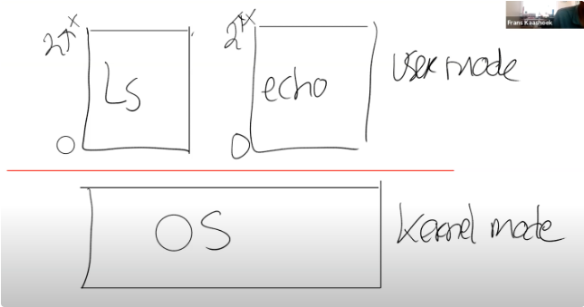
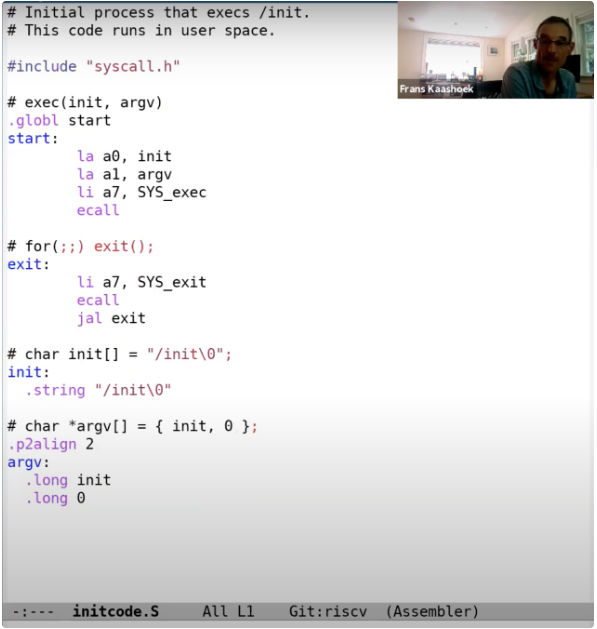

# Lesson 1

操作系统的目的

- 抽象和管理硬件。
- 在多个应用程序之间共用硬件资源，实现硬件的多路复用。
- 隔离
- 共享
- 权限控制
- 高性能，多用途。

对操作系统的大致认知：

- 首先，会有类似于Shell，echo，find或者任何你实现的工具程序，这些程序运行在操作系统之上。

- 而操作系统又抽象了一些硬件资源，例如磁盘，CPU。

- 通常来说操作系统和应用程序之前的接口被称为系统调用接口（System call interface），我们这门课程看到的接口都是Unix风格的接口。基于这些Unix接口，你们在lab1中，完成了不同的应用程序。

- 

# Lesson 3

# A. Isolation 隔离性

隔离性是设计操作系统组织结构的驱动力。

multiplexing

内存隔离

## B. Kernel & User mode 内核态和用户态

隔离操作系统内核和用户应用程序。

## C. System call 系统调用

系统调用是你的应用程序能够转换到内核执行的基本方法，这样你的用户态应用程序才能使用内核服务。

## D. XV6 实现

# Lec03 组织结构 & 系统调用

**1. 隔离性**

设计操作系统组织结构的驱动力。

**2. 内核模式和用户模式**

隔离操作系统内核和用户应用程序。

**3. 系统调用**

用户程序转换到内核执行的基本方法。

## 3.1 组织结构

操作系统抽象了一系列的硬件资源，类似于 shell、echo 等工具在操作系统之上，这些工具通过系统调用与内核交互。用户可以通过这些工具间接调用内核管理的资源。

## 3.2 隔离性

- 不同用户程序之间需要有强隔离性。（包括内存）

- 用户程序和内核之间需要有强隔离性。

### 如果没有操作系统（multiplexing 和 内存隔离）

如果没有操作系统（用户程序和硬件资源之间的一个额外的抽象层），用户程序将直接与硬件交互，即，用户程序可以直接看到 CPU 的多核、磁盘、内存等。

- **复用**

  由于使用操作系统的一个目的是为了 **同时运行多个应用程序**，所以 CPU 会时不时地从一个应用程序切换到另一个应用程序。我们假设硬件资源里只有一个 CPU 核，并且我们现在在这个 CPU 核上运行 Shell。但是时不时地也需要让其他的应用程序也可以运行。现在我们没有操作系统来帮我们完成切换，所以 Shell 就需要时不时的释放 CPU 资源。为了不变成一个恶意程序，Shell 在发现自己运行了一段时间之后，需要让别的程序也有机会能运行（协同调度，Cooperative Scheduling）。但是这里的场景并没有很好的隔离性，比如说 Shell 中的某个函数有一个死循环，那么 Shell 永远也不会释放 CPU，进而其他的应用程序也不能够运行，甚至都不能运行一个第三方的程序来停止或者杀死 Shell 程序。所以这种场景下，我们基本上得不到真正的 multiplexing（CPU 在多进程同分时复用）。

  <!--学生提问：当应用程序表现的恶意或者就是在一个死循环中，内核是如何夺回控制权限的？-->

  <!--Frans教授：内核会通过硬件设置一个定时器，定时器到期之后会将控制权限从用户空间转移到内核空间，之后内核就有了控制能力并可以重新调度CPU到另一个进程中。我们接下来会看一些更加详细的细节。-->

- **内存隔离**

  从 **内存的角度** 来说，如果应用程序直接运行在硬件资源之上，那么每个应用程序的文本，代码和数据都直接保存在物理内存中。物理内存中的一部分被 Shell 使用，另一部分被 echo 使用。即使在这么简单的例子中，因为两个应用程序的内存之间没有边界，如果 echo 程序将数据存储在属于 Shell 的一个内存地址中，那么 echo 就会覆盖 Shell 程序内存中的内容。这是非常不想看到的场景，因为 echo 现在渗透到了 Shell 中来，并且这类的问题是非常难定位的。所以这里也没有为我们提供好的隔离性。我们**希望不同应用程序之间的内存是隔离的**，这样一个应用程序就不会覆盖另一个应用程序的内存。

所以，将操作系统设计成一个库，并不是一种常见的设计。你或许可以在一些实时操作系统中看到这样的设计，因为在这些实时操作系统中，应用程序之间彼此相互信任。但是在大部分的其他操作系统中，都会强制实现硬件资源的隔离。

## 3.3 防御性 -》用户和内核之间的强隔离性

操作系统需要能够应对恶意的应用程序。应用程序不能够打破对它的隔离。内核必须要将用户应用程序或者进程当做是恶意的。

### 内核模式和用户模式

为了支持user/kernel mode，处理器会有两种操作模式，第一种是user mode，第二种是kernel mode。当运行在kernel mode时，CPU可以运行特定权限的指令（privileged instructions）；当运行在user mode时，CPU只能运行普通权限的指令（unprivileged instructions）。

特殊权限指令主要是一些直接操纵硬件的指令和设置保护的指令，例如设置page table寄存器、关闭时钟中断。在处理器上有各种各样的状态，操作系统会使用这些状态，但是只能通过特殊权限指令来变更这些状态。

举个例子，当一个应用程序尝试执行一条特殊权限指令，因为不允许在user mode执行特殊权限指令，处理器会拒绝执行这条指令。通常来说，这时会将控制权限从user mode切换到kernel mode，当操作系统拿到控制权之后，或许会杀掉进程，因为应用程序执行了不该执行的指令。

<!--学生提问：如果kernel mode允许一些指令的执行，user mode不允许一些指令的执行，那么是谁在检查当前的mode并实际运行这些指令，并且怎么知道当前是不是kernel mode？是有什么标志位吗？-->

<!--Frans教授：是的，在处理器里面有一个flag。在处理器的一个bit，当它为1的时候是user mode，当它为0时是kernel mode。当处理器在解析指令时，如果指令是特殊权限指令，并且该bit被设置为1，处理器会拒绝执行这条指令，就像在运算时不能除以0一样。-->

<!--同一个学生继续问：所以，唯一的控制方式就是通过某种方式更新了那个bit？-->

<!--Frans教授：你认为是什么指令更新了那个bit位？是特殊权限指令还是普通权限指令？（等了一会，那个学生没有回答）。很明显，设置那个bit位的指令必须是特殊权限指令，因为应用程序不应该能够设置那个bit到kernel mode，否则的话应用程序就可以运行各种特殊权限指令了。所以那个bit是被保护的，这样回答了你的问题吗？-->

实际上RISC-V还有第三种模式称为machine mode。在大多数场景下，我们会忽略这种模式，所以我也不太会介绍这种模式。 所以实际上我们有三级权限（user/kernel/machine），而不是两级(user/kernel)。

#### 模式切换

在RISC-V中，有一个专门的指令用来实现这个功能，叫做ECALL。ECALL接收一个数字参数，当一个用户程序想要将程序执行的控制权转移到内核，它只需要执行ECALL指令，并传入一个数字。这里的数字参数代表了应用程序想要调用的System Call。

ECALL会跳转到内核中一个特定，由内核控制的位置。我们在这节课的最后可以看到在XV6中存在一个唯一的系统调用接入点，每一次应用程序执行ECALL指令，应用程序都会通过这个接入点进入到内核中。举个例子，不论是Shell还是其他的应用程序，当它在用户空间执行fork时，它并不是直接调用操作系统中对应的函数，而是调用ECALL指令，并将fork对应的数字作为参数传给ECALL。之后再通过ECALL跳转到内核。

### 虚拟内存

处理器包含了page table，而page table将虚拟内存地址与物理内存地址做了对应。

每一个进程都会有自己独立的page table，这样的话，每一个进程只能访问出现在自己page table中的物理内存。操作系统会设置page table，使得每一个进程都有不重合的物理内存，这样一个进程就不能访问其他进程的物理内存，因为其他进程的物理内存都不在它的page table中。一个进程甚至都不能随意编造一个内存地址，然后通过这个内存地址来访问其他进程的物理内存。这样就给了我们内存的强隔离性。

## 3.6 宏内核 & 微内核

宏内核

所有的操作系统服务都在kernel mode中。在一个宏内核中，任何一个操作系统的Bug都有可能成为漏洞。宏内核的优势在于，因为这些文件系统，虚拟内存，进程管理等子模块现在都位于同一个程序中，它们可以紧密的集成在一起，这样的集成提供很好的性能。

微内核

减少内核中的代码。微内核的目的在于将大部分的操作系统运行在内核之外。所以，我们还是会有user mode以及user/kernel mode的边界。但是我们现在会将原来在内核中的其他部分，作为普通的用户程序来运行。因为在内核中的代码的数量较小，更少的代码意味着更少的Bug。对于任何文件系统的交互，都需要分别完成2次用户空间<->内核空间的跳转。与宏内核对比，在宏内核中如果一个应用程序需要与文件系统交互，只需要完成1次用户空间<->内核空间的跳转，所以微内核的的跳转是宏内核的两倍。通常微内核的挑战在于性能更差，这里有两个方面需要考虑：

1. 1.

   在user/kernel mode反复跳转带来的性能损耗。

2. 2.

   在一个类似宏内核的紧耦合系统，各个组成部分，例如文件系统和虚拟内存系统，可以很容易的共享page cache。而在微内核中，每个部分之间都很好的隔离开了，这种共享更难实现。进而导致更难在微内核中得到更高的性能。

## 3.7 编译运行 kernel

### a. XV6 结构

- kernel

  因为 XV6 是一个宏内核结构，这里所有的文件会被编译成一个叫做 kernel 的二进制文件，然后这个二进制文件会被运行在 kernle mode 中。

  

- user

  这基本上是运行在 user mode 的程序。

- mkfs

  它会创建一个空的文件镜像，我们会将这个镜像存在磁盘上，这样我们就可以直接使用一个空的文件系统。

### b. XV6 编译

首先，Makefile（XV6目录下的文件）会读取一个 C 文件，例如 **proc.c**；之后调用 gcc 编译器，生成一个文件叫做 **proc.s**，这是 RISC-V 汇编语言文件；之后再走到汇编解释器，生成 **proc.o**，这是汇编语言的二进制格式。

Makefile 会为所有内核文件做相同的操作。之后，系统加载器（Loader）会收集所有的 .o 文件，将它们 **链接** 在一起，并生成内核文件。

这里生成的内核文件就是将在 QEMU 中运行的文件。同时，为了方便，Makefile 还会创建 kernel.asm，这里包含了内核的完整汇编语言，可以查看它来定位究竟是哪个指令导致了 Bug。

#### 举个例子

查看 kernel.asm 文件，我们可以看到用汇编指令描述的内核：

可以看到，第一个指令位于地址 0x80000000，对应的是一个 RISC-V 指令：auipc 指令。其中第二列，例如 0x0000a117、0x83010113、0x6505，是汇编指令的 16 进制表现形式，比如，0x0000a117 就是 auipc。

## 3.8 QEMU

QEMU 表现的就像一个真正的计算机一样，它表示的是一个真正的主板。当你通过QEMU 来运行你的内核时，你应该认为你的内核是运行在这样一个主板之上。主板有一个开关，一个 RISC-V 处理器，有支持外设的空间，比如说一个接口是连接网线的，一个是 PCI-E 插槽，主板上还有一些内存芯片，这是一个你可以在上面编程的物理硬件，而 XV6 操作系统管理这样一块主板。

直观来看，QEMU 是一个大型的开源 C 程序，但是在内部，在 QEMU 的主循环中，只在做一件事情：

- 读取 4 字节或者 8 字节的 RISC-V 指令。

- 解析 RISC-V 指令，并找出对应的操作码（op code）。我们之前在看 kernel.asm 的时候，看过一些操作码的二进制版本。通过解析，或许可以知道这是一个 ADD 指令，或者是一个 SUB 指令。
- 之后，在软件中执行相应的指令。

这基本上就是 QEMU 的全部工作了，对于每个 CPU 核，QEMU 都会运行这么一个循环。

为了完成这里的工作，QEMU 的主循环需要维护寄存器的状态。所以 QEMU 会有以 C 语言声明的类似于 X0，X1 寄存器等等。

除了仿真所有的普通权限指令之外，QEMU 还会仿真所有的特殊权限指令。

## 3.9 XV6 启动过程

首先，我会启动 QEMU，并打开 gdb。本质上来说 QEMU 内部有一个 gdb server，当我们启动之后，QEMU 会等待 gdb 客户端连接。

我会在我的计算机上再启动一个 gdb 客户端，这里是一个 RISC-V 64 位 Linux 的 gdb。

在连接上之后，我会在程序的入口处设置一个端点，因为我们知道这是 QEMU 会跳转到的第一个指令。

设置完断点之后，我运行程序，可以发现代码并没有停在 0x8000000（见 3.7 kernel.asm 中，0x80000000 是程序的起始位置），而是停在了 0x8000000a（之前是一些设置指令）。

我们可以看到，在地址 0x8000000a 读取了控制系统寄存器（Control System Register）mhartid，并将结果加载到了 a1 寄存器。所以 QEMU 会模拟执行这条指令，之后执行下一条指令。

地址 0x80000000 是一个被 QEMU 认可的地址。也就是说如果你想使用 QEMU，那么第一个指令地址必须是它。所以，我们会让内核加载器从那个位置开始加载内核。如果我们查看 kernel.ld，我们可以看到，这个文件定义了内核是如何被加载的，从这里也可以看到，内核使用的起始地址就是 QEMU 指定的 0x80000000 这个地址。这就是我们操作系统最初运行的步骤。

XV6 从 entry.s 开始启动，这个时候没有内存分页，没有隔离性，并且运行在 M-mode（machine mode）。XV6 会尽可能快的跳转到 kernel mode 或者说是 supervisor mode。我们在 main 函数设置一个断点，main 函数已经运行在 supervisor mode 了。接下来我运行程序，代码会在断点，也就是 main 函数的第一条指令停住。

接下来，我想运行在 gdb 的 layout split 模式：

从这个视图可以看出 gdb 要执行的下一条指令是什么，断点具体在什么位置。

接下来是一些初始化代码：

- console：设置 console
- kinit：设置好页表分配器（page allocator）
- kvminit：设置好虚拟内存，这是下节课的内容
- kvminithart：打开页表，也是下节课的内容
- processinit：设置好初始进程或者说设置好进程表单
- trapinit/trapinithart：设置好 user/kernel mode 转换代码
- plicinit/plicinithart：设置好中断控制器 PLIC（Platform Level Interrupt Controller），我们后面在介绍中断的时候会详细的介绍这部分，这是我们用来与磁盘和 console 交互方式
- binit：分配 buffer cache
- iinit：初始化 inode缓存
- fileinit：初始化文件系统
- virtio_disk_init：初始化磁盘
- userinit：最后当所有的设置都完成了，操作系统也运行起来了，会通过 userinit 运行第一个进程，这里有点意思，接下来我们看一下 userinit。

我们总是需要有一个用户进程在运行，这样才能实现与操作系统的交互，所以这里需要一个小程序来初始化第一个用户进程。这个小程序定义在 initcode 中。这里直接是程序的二进制形式，它会链接或者在内核中直接静态定义。实际上，这段代码对应了下面的汇编程序。

这个汇编程序中，它首先将 init 中的地址加载到 a0（la a0, init），argv 中的地址加载到 a1（la a1, argv），exec 系统调用对应的数字加载到 a7（li a7, SYS_exec），最后调用 ECALL。所以这里执行了 3 条指令，之后在第 4 条指令将控制权交给了操作系统。

如果我在 syscall 中设置一个断点，可以到达 syscall 查看。

*num = p->trapframe->a7* 会读取使用的系统调用对应的整数。如果我们查看 syscall.h，可以看到 7 对应的是 exec 系统调用。所以，这里本质上是告诉内核，某个用户应用程序执行了 ECALL 指令，并且想要调用 exec 系统调用。

*p->trapframe->a0 = syscall[num] ()* 这一行是实际执行系统调用。这里可以看出，num用来索引一个数组，这个数组是一个函数指针数组，可以预期的是 syscall[7] 对应了 exec 的入口函数。我们跳到这个函数中去，可以看到，我们现在在 sys_exec 函数中。

sys_exec 中的第一件事情是从用户空间读取参数，它会读取 path，也就是要执行程序的文件名。这里首先会为参数分配空间，然后从用户空间将参数拷贝到内核空间。之后我们打印 path，可以看到传入的就是 init 程序。所以，综合来看，initcode 完成了通过 exec 调用 init 程序。

我们来看看 init 程序，init 会为用户空间设置好一些东西，比如配置好 console，调用fork，并在 fork 出的子进程中执行 shell。

最终的效果就是 Shell 运行起来了。如果我再次运行代码，我还会陷入到 syscall 中的断点，并且同样也是调用 exec 系统调用，只是这次是通过 exec 运行 Shell。当 Shell 运行起来之后，我们可以从 QEMU 看到 Shell。

# Lec04 页表

## 4.1 页表

实现地址空间，即，在一个物理内存上创建不同地址空间。page table提供了一层抽象（[level of indirection](https://en.wikipedia.org/wiki/Indirection)）。我这里说的抽象就是指从虚拟地址到物理地址的映射。这里的映射关系完全由操作系统控制。

虚拟内存地址在内存管理单元（MMU）中被翻译为物理地址，**MMU 在内存中存储了记录虚拟地址和物理地址的映射的页表**。因此，CPU 中需要有寄存器保存页表的物理内存地址。（RISC-V 中的 satp 寄存器）

每个进程都应当有自己的页表，并且该页表定义了应用程序的地址空间。当操作系统将 CPU 从一个应用程序切换到另一个应用程序时，同时也需要切换 satp 寄存器中的内容，从而指向新的进程保存在物理内存中的地址对应页表。每个进程对应的 satp 值是由内核保存的，写 satp 寄存器是一条特殊权限指令。所以，用户程序不能通过更新这个寄存器来切换页表。

一个虚拟地址创建一条条目是不现实的，通常为每一页（连续的 4096 byte）创建一条条目（虚拟地址中保存了页中的偏移量），因此称为页表。

## 4.2 RISC-V 中的页表实现

- 为每一页创建一条条目

- 首先对于虚拟内存地址，我们将它划分为两个部分，index和offset，index用来查找page，offset对应的是一个page中的哪个字节。

- 高25bit并没有被使用。在剩下的39bit中，有27bit被用来当做index，12bit被用来当做offset。offset必须是12bit，因为对应了一个page的4096个字节。

- 物理内存地址是56bit，其中44bit是物理page号（PPN，Physical Page Number），剩下12bit是offset完全继承自虚拟内存地址。

- 有27bit被用来当做index，因此一个进程的页表最多有2^27个条目，

- 如果每个进程都使用这么大的page table，进程需要为page table消耗大量的内存，并且很快物理内存就会耗尽。所以实际上，硬件并不是按照这里的方式来存储page table。实际中，page table是一个多级的结构。

- 虚拟内存地址中的27bit的index，实际上是由3个9bit的数字组成（L2，L1，L0）。前9个bit被用来索引最高级的page directory（注：通常page directory是用来索引page table或者其他page directory物理地址的表单，但是在课程中，page table，page directory， page directory table区分并不明显，可以都认为是有相同结构的地址对应表单）。

- 所以实际上，SATP寄存器会指向最高一级的page directory的物理内存地址，之后我们用虚拟内存中index的高9bit用来索引最高一级的page directory(注，2^9 = 512，正好可以索引到一条 PTE)，这样我们就能得到一个PPN，也就是物理page号。这个PPN指向了中间级的page directory。

  当我们在使用中间级的page directory时，我们通过虚拟内存地址中的L1部分完成索引。接下来会走到最低级的page directory，我们通过虚拟内存地址中的L0部分完成索引。在最低级的page directory中，我们可以得到对应于虚拟内存地址的物理内存地址。

  这种方式的主要优点是，如果地址空间中大部分地址都没有使用，你不必为每一个index准备一个条目。举个例子，如果你的地址空间只使用了一个page，4096Bytes。除此之外，你没有使用任何其他的地址。现在，你需要多少个page table entry，或者page table directory来映射这一个page？

  在最高级，你需要一个page directory。在这个page directory中，你需要一个数字是0的PTE，指向中间级page directory。所以在中间级，你也需要一个page directory，里面也是一个数字0的PTE，指向最低级page directory。所以这里总共需要3个page directory（也就是3 * 512个条目）。而在前一个方案中，虽然我们只使用了一个page，还是需要2^27个PTE（注，约 1GB 内存）。这个方案中，我们只需要3 * 512个PTE（注，12KB 内存）。所需的空间大大减少了。这是实际上硬件采用这种层次化的3级page directory结构的主要原因。这里有什么问题吗？这部分还是很重要的。

- 每个PTE的低10bit是一堆标志位：

  第一个标志位是Valid。如果Valid bit位为1，那么表明这是一条合法的PTE，你可以用它来做地址翻译。对于刚刚举得那个小例子（注，应用程序只用了1个page的例子），我们只使用了3个page directory，每个page directory中只有第0个PTE被使用了，所以只有第0个PTE的Valid bit位会被设置成1，其他的511个PTE的Valid bit为0。这个标志位告诉MMU，你不能使用这条PTE，因为这条PTE并不包含有用的信息。

  

  下两个标志位分别是Readable和Writable。表明你是否可以读/写这个page。

  Executable表明你可以从这个page执行指令。

  User表明这个page可以被运行在用户空间的进程访问。

  其他标志位并不是那么重要，他们偶尔会出现，前面5个是重要的标志位。

## ==4.3 页表缓存==

如果我们回想一下page table的结构，你可以发现，当处理器从内存加载或者存储数据时，基本上都要做3次内存查找，第一次在最高级的page directory，第二次在中间级的page directory，最后一次在最低级的page directory。所以对于一个虚拟内存地址的寻址，需要读三次内存，这里代价有点高。所以实际中，几乎所有的处理器都会对于最近使用过的虚拟地址的翻译结果有缓存。这个缓存被称为：Translation Lookside Buffer（通常翻译成页表缓存）。你会经常看到它的缩写TLB。基本上来说，这就是Page Table Entry的缓存，也就是PTE的缓存。

当处理器第一次查找一个虚拟地址时，硬件通过3级page table得到最终的PPN，TLB会保存虚拟地址到物理地址的映射关系。这样下一次当你访问同一个虚拟地址时，处理器可以查看TLB，TLB会直接返回物理地址，而不需要通过page table得到结果。

如果你切换了page table，操作系统需要告诉处理器当前正在切换page table，处理器会清空TLB。因为本质上来说，如果你切换了page table，TLB中的缓存将不再有用，它们需要被清空，否则地址翻译可能会出错。所以操作系统知道TLB是存在的，但只会时不时的告诉操作系统，现在的TLB不能用了，因为要切换page table了。在RISC-V中，清空TLB的指令是sfence_vma。

## 4.4 XV6 中页表的工作

## 4.5

## 4.6

## 4.7

# Lec08 Page faults

## 8.1 Page Fault Basics

### 虚拟内存的优点

1. 隔离性（Isolation）。虚拟内存使得操作系统可以为每个应用程序提供属于它们自己的地址空间。所以一个应用程序不可能有意或者无意的修改另一个应用程序的内存数据。虚拟内存同时也提供了用户空间和内核空间的隔离性。
2. 提供了一层抽象（level of indirection）。处理器和所有的指令都可以使用虚拟地址，而内核会定义从虚拟地址到物理地址的映射关系。

### page fault 三要素

- 出错的虚拟地址。*当出现 page fault 的时候，XV6 内核会打印出错的虚拟地址，并且这个地址会被保存在 STVAL 寄存器中，page fault会使用与Robert教授上节课介绍的相同的trap机制，将程序运行切换到内核，同时也会将出错的地址存放在STVAL寄存器中。。
- 出错的原因，存储在 scause 寄存器中。对不同场景的 page fault 产生不同的响应。在SCAUSE（注，Supervisor cause寄存器，保存了trap机制中进入到supervisor mode的原因）寄存器的介绍中，有多个与page fault相关的原因。比如，13表示是因为load引起的page fault；15表示是因为store引起的page fault；12表示是因为指令执行引起的page fault。
- 触发 page fault 的指令的地址，存储在 sepc 中，并同时会保存在trapframe->epc中。我们之所以关心触发page fault时的程序计数器值，是因为在page fault handler中我们或许想要修复page table，并重新执行对应的指令。理想情况下，修复完page table之后，指令就可以无错误的运行了。所以，能够恢复因为page fault中断的指令运行是很重要的。

## 8.2 Lazy page allocation

### allocation 内存 - sbrk

sbrk是XV6提供的系统调用，它使得用户应用程序能扩大自己的heap。当一个应用程序启动的时候，sbrk指向的是heap的最底端，同时也是stack的最顶端。这个位置通过代表进程的数据结构中的sz字段表示，这里以*p->sz表示*。

当调用sbrk时，它的参数是整数，代表了你想要申请的page数量（注，原视频说的是page，但是根据Linux [man page](https://man7.org/linux/man-pages/man2/sbrk.2.html)，实际中sbrk的参数是字节数）。sbrk会扩展heap的上边界（也就是会扩大heap）。

这意味着，当sbrk实际发生或者被调用的时候，内核会分配一些物理内存，并将这些内存映射到用户应用程序的地址空间，然后将内存内容初始化为0，再返回sbrk系统调用。这样，应用程序可以通过多次sbrk系统调用来增加它所需要的内存。类似的，应用程序还可以通过给sbrk传入负数作为参数，来减少或者压缩它的地址空间。不过在这节课我们只关注增加内存的场景。

在XV6中，sbrk的实现默认是eager allocation。这表示了，一旦调用了sbrk，内核会立即分配应用程序所需要的物理内存。但是实际上，对于应用程序来说很难预测自己需要多少内存，所以通常来说，应用程序倾向于申请多于自己所需要的内存。这意味着，进程的内存消耗会增加许多，但是有部分内存永远也不会被应用程序所使用到。

### lazy allocation

核心思想非常简单，sbrk系统调基本上不做任何事情，唯一需要做的事情就是提升*p->sz*，将*p->sz*增加n，其中n是需要新分配的内存page数量。但是内核在这个时间点并不会分配任何物理内存。之后在某个时间点，应用程序使用到了新申请的那部分内存，这时会触发page fault，因为我们还没有将新的内存映射到page table。所以，如果我们解析一个大于旧的*p->sz*，但是又小于新的*p->sz（注，也就是旧的p->sz + n）*的虚拟地址，我们希望内核能够分配一个内存page，并且重新执行指令。

所以，当我们看到了一个page fault，相应的虚拟地址小于当前*p->sz*，同时大于stack，那么我们就知道这是一个来自于heap的地址，但是内核还没有分配任何物理内存。所以对于这个page fault的响应也理所当然的直接明了：在page fault handler中，通过kalloc函数分配一个内存page；初始化这个page内容为0；将这个内存page映射到user page table中；最后重新执行指令。

提问：在eager allocation的场景，一个进程可能消耗了太多的内存进而耗尽了物理内存资源。如果我们不使用eager allocation，而是使用lazy allocation，**应用程序怎么才能知道当前已经没有物理内存可用了？**

Frans教授：这是个非常好的问题。从应用程序的角度来看，会有一个错觉：存在无限多可用的物理内存。但是在某个时间点，应用程序可能会用光了物理内存，之后如果应用程序再访问一个未被分配的page，但这时又没有物理内存，这时内核可以有两个选择，我稍后会介绍更复杂的那个。你们在lazy lab中要做的是，返回一个错误并杀掉进程。因为现在已经OOM（Out Of Memory）了，内核也无能为力，所以在这个时间点可以杀掉进程。

学生提问：**如何判断一个地址是新分配的内存还是一个无效的地址？**

Frans教授：在地址空间中，我们有stack，data和text。通常来说我们将*p->sz*设置成一个更大的数，新分配的内存位于旧的*p->sz*和新的*p->sz*之间，但是这部分内存还没有实际在物理内存上进行分配。如果使用的地址低于*p->sz*，那么这是一个用户空间的有效地址。如果大于*p->sz*，对应的就是一个程序错误，这意味着用户应用程序在尝试解析一个自己不拥有的内存地址。希望这回答了你的问题。

我们首先要修改的是sys_sbrk函数，sys_sbrk会完成实际增加应用程序的地址空间，分配内存等等一系列相关的操作。这里我们要修改这个函数，让它只对p->sz加n，并不执行增加内存的操作。

修改完之后启动XV6，并且执行“echo hi”，我们会得到一个page fault。

之所以会得到一个page fault是因为，在Shell中执行程序，Shell会先fork一个子进程，子进程会通过exec执行echo（注，详见1.9）。在这个过程中，Shell会申请一些内存，所以Shell会调用sys_sbrk，然后就出错了（注，因为前面修改了代码，调用sys_sbrk不会实际分配所需要的内存）。

这里输出的内容包含了一些有趣的信息：

- 这里输出了SCAUSE寄存器内容，我们可以看到它的值是15，表明这是一个store page fault（详见8.1）。
- 我们可以看到进程的pid是3，这极可能是Shell的pid。
- 我们还可以看到SEPC寄存器的值，是0x12a4。
- 最后还可以看到出错的虚拟内存地址，也就是STVAL寄存器的内容，是0x4008。

我们可以查看Shell的汇编代码，这是由Makefile创建的。我们搜索SEPC对应的地址，可以看到这的确是一个store指令。这看起来就是我们出现page fault的位置。

如果我们向前看看汇编代码，我们可以看到page fault是出现在malloc的实现代码中。这也非常合理，在malloc的实现中，我们使用sbrk系统调用来获得一些内存，之后会初始化我们刚刚获取到的内存，在0x12a4位置，刚刚获取的内存中写入数据，但是实际上我们在向未被分配的内存写入数据。

另一个可以证明内存还没有分配的地方是，XV6中Shell通常是有4个page，包含了text和data。出错的地址在4个page之外，也就是第5个page，实际上我们在4个page之外8个字节。这也合理，因为在0x12a4对应的指令中，a0持有的是0x4000，而8相对a0的偏移量。偏移之后的地址就是我们想要使用的地址（注，也就是出错的地址）。

以上就是page fault的信息。我们接下来看看如何能够聪明的处理这里的page fault。

首先查看trap.c中的usertrap函数，usertrap在lec06中有介绍。在usertrap中根据不同的SCAUSE完成不同的操作。

在lec06中，我们是因为SCAUSE == 8进入的trap，这是我们处理普通系统调用的代码。如果SCAUSE不等于8，接下来会检查是否有任何的设备中断，如果有的话处理相关的设备中断。如果两个条件都不满足，这里会打印一些信息，并且杀掉进程。

现在我们需要增加一个检查，判断SCAUSE == 15，如果符合条件，我们需要一些定制化的处理。我们这里想要做什么样的定制化处理呢？

在上面增加的代码中，首先打印一些调试信息。之后分配一个物理内存page，如果ka等于0，表明没有物理内存我们现在OOM了，我们会杀掉进程。如果有物理内存，首先会将内存内容设置为0，之后将物理内存page指向用户地址空间中合适的虚拟内存地址。具体来说，我们首先将虚拟地址向下取整，这里引起page fault的虚拟地址是0x4008，向下取整之后是0x4000。之后我们将物理内存地址跟取整之后的虚拟内存地址的关系加到page table中。对应的PTE需要设置常用的权限标志位，在这里是u，w，r bit位。

接下来运行一些这部分代码。先重新编译XV6，再执行“echo hi”，我们或许可以乐观的认为现在可以正常工作了。

但是实际上并没有正常工作。我们这里有两个page fault，第一个对应的虚拟内存地址是0x4008，但是很明显在处理这个page fault时，我们又有了另一个page fault 0x13f48。现在唯一的问题是，uvmunmap在报错，一些它尝试unmap的page并不存在。这里unmap的是之前lazy allocated，但是又还没有用到的地址。所以对于这个内存，并没有对应的物理内存。所以在uvmunmap函数中，当PTE的v标志位为0并且没有对应的mapping，这并不是一个实际的panic，这是我们预期的行为。

实际上，对于这个page我们并不用做任何事情，我们可以直接continue跳到下一个page。

学生提问：我并不能理解为什么在uvmunmap中可以直接改成continue？

Frans教授：之前的panic表明，我们尝试在释放一个并没有map的page。怎么会发生这种情况呢？唯一的原因是sbrk增加了p->sz，但是应用程序还没有使用那部分内存。因为对应的物理内存还没有分配，所以这部分新增加的内存的确没有映射关系。我们现在是lazy allocation，我们只会为需要的内存分配物理内存page。如果我们不需要这部分内存，那么就不会存在map关系，这非常的合理。相应的，我们对于这部分内存也不能释放，因为没有实际的物理内存可以释放，所以这里最好的处理方式就是continue，跳过并处理下一个page。

学生提问：在uvmunmap中，我认为之前的panic存在是有理由的，我们是不是应该判断一下，然后对于特定的场景还是panic？

Frans教授：为什么之前的panic会存在？对于未修改的XV6，永远也不会出现用户内存未map的情况，所以一旦出现这种情况需要panic。但是现在我们更改了XV6，所以我们需要去掉这里的panic，因为之前的不可能变成了可能。

接下来，我们再重新编译XV6，并执行“echo hi”。现在我们可以看到2个page fault，但是echo hi正常工作了。现在，我们一定程度上有了最基本最简单的lazy allocation。这里有什么问题吗？

## 8.3 Zero Fill On Demand

当你查看一个用户程序的地址空间时，存在text区域，data区域，同时还有一个BSS区域（注，BSS区域包含了未被初始化或者初始化为0的全局或者静态变量）。当编译器在生成二进制文件时，编译器会填入这三个区域。text区域是程序的指令，data区域存放的是初始化了的全局变量，BSS包含了未被初始化或者初始化为0的全局变量。

之所以这些变量要单独列出来，是因为例如你在C语言中定义了一个大的矩阵作为全局变量，它的元素初始值都是0，为什么要为这个矩阵分配内存呢？其实只需要记住这个矩阵的内容是0就行。在物理内存中，我只需要分配一个page，这个page的内容全是0。然后将所有虚拟地址空间的全0的page都map到这一个物理page上。这样至少在程序启动的时候能节省大量的物理内存分配。

当然这里的mapping需要非常的小心，我们不能允许对于这个page执行写操作，因为所有的虚拟地址空间page都期望page的内容是全0，所以这里的PTE都是只读的。之后在某个时间点，应用程序尝试写BSS中的一个page时，比如说需要更改一两个变量的值，我们会得到page fault。那么，对于这个特定场景中的page fault我们该做什么呢？

> 应该创建一个新的page，将其内容设置为0，并重新执行指令。

是的，完全正确。假设store指令发生在BSS最顶端的page中。我们想要做的是，在物理内存中申请一个新的内存page，将其内容设置为0，因为我们预期这个内存的内容为0。之后我们需要更新这个page的mapping关系，首先PTE要设置成可读可写，然后将其指向新的物理page。这里相当于更新了PTE，之后我们可以重新执行指令。

为什么这是一个好的优化？或者说为什么操作系统要这么做？

> 学生回答：这样节省一部分内存。你可以在需要的时候才申请内存。

是的，这里类似于lazy allocation。假设程序申请了一个大的数组，来保存可能的最大的输入，并且这个数组是全局变量且初始为0。但是最后或许只有一小部分内容会被使用。

第二个好处是在exec中需要做的工作变少了。程序可以启动的更快，这样你可以获得更好的交互体验，因为你只需要分配一个内容全是0的物理page。所有的虚拟page都可以映射到这一个物理page上。

学生提问：但是因为每次都会触发一个page fault，update和write会变得更慢吧？

Frans教授：是的，这是个很好的观点，所以这里是实际上我们将一些操作推迟到了page fault再去执行。并且我们期望并不是所有的page都被使用了。如果一个page是4096字节，我们只需要对每4096个字节消耗一次page fault即可。但是这里是个好的观点，我们的确增加了一些由page fault带来的代价。

page fault的代价是多少呢？我们该如何看待它？这是一个与store指令相当的代价，还是说代价要高的多？

> 学生回答：代价要高的多。store指令可能需要消耗一些时间来访问RAM，但是page fault需要走到内核。

是的，在lec06中你们已经看到了，仅仅是在trap处理代码中，就有至少有100个store指令用来存储当前的寄存器。除此之外，还有从用户空间转到内核空间的额外开销。所以，page fault并不是没有代价的，之前问的那个问题是一个非常好的问题。

# 8.4 Copy On Write Fork （COW fork）

当Shell处理指令时，它会通过fork创建一个子进程。fork会创建一个Shell进程的拷贝，所以这时我们有一个父进程（原来的Shell）和一个子进程。Shell的子进程执行的第一件事情就是调用exec运行一些其他程序，比如运行echo。现在的情况是，fork创建了Shell地址空间的一个完整的拷贝，而exec做的第一件事情就是丢弃这个地址空间，取而代之的是一个包含了echo的地址空间。这里看起来有点浪费。

所以，我们最开始有了一个父进程的虚拟地址空间，然后我们有了子进程的虚拟地址空间。在物理内存中，XV6中的Shell通常会有4个page，当调用fork时，基本上就是创建了4个新的page，并将父进程page的内容拷贝到4个新的子进程的page中。

但是之后，一旦调用了exec，我们又会释放这些page，并分配新的page来包含echo相关的内容。所以对于这个特定场景有一个非常有效的优化：当我们创建子进程时，与其创建，分配并拷贝内容到新的物理内存，其实我们可以直接共享父进程的物理内存page。所以这里，我们可以设置子进程的PTE指向父进程对应的物理内存page。

当然，再次要提及的是，我们这里需要非常小心。因为一旦子进程想要修改这些内存的内容，相应的更新应该对父进程不可见，因为我们希望在父进程和子进程之间有强隔离性，所以这里我们需要更加小心一些。为了确保进程间的隔离性，我们可以将这里的父进程和子进程的PTE的标志位都设置成只读的。

所以现在，我们拷贝了一个page，将新的page映射到相应的用户地址空间，并重新执行用户指令。重新执行用户指令是指调用userret函数（注，详见6.8），也即是lec06中介绍的返回到用户空间的方法。

学生提问：我们如何发现父进程写了这部分内存地址？是与子进程相同的方法吗？

Frans教授：是的，因为子进程的地址空间来自于父进程的地址空间的拷贝。如果我们使用了特定的虚拟地址，因为地址空间是相同的，不论是父进程还是子进程，都会有相同的处理方式。

学生提问：对于一些没有父进程的进程，比如系统启动的第一个进程，它会对于自己的PTE设置成只读的吗？还是设置成可读写的，然后在fork的时候再修改成只读的？

Frans教授：这取决于你。实际上在lazy lab之后，会有一个copy-on-write lab。在这个lab中，你自己可以选择实现方式。当然最简单的方式就是将PTE设置成只读的，当你要写这些page时，你会得到一个page fault，之后你可以再按照上面的流程进行处理。

学生提问：因为我们经常会拷贝用户进程对应的page，内存硬件有没有实现特定的指令来完成拷贝，因为通常来说内存会有一些读写指令，但是因为我们现在有了从page a拷贝到page b的需求，会有相应的拷贝指令吗？

Frans教授：x86有硬件指令可以用来拷贝一段内存。但是RISC-V并没有这样的指令。当然在一个高性能的实现中，所有这些读写操作都会流水线化，并且按照内存的带宽速度来运行。

在我们这个例子中，我们只需要拷贝1个page，对于一个未修改的XV6系统，我们需要拷贝4个page。所以这里的方法明显更好，因为内存消耗的更少，并且性能会更高，fork会执行的更快。

学生提问：当发生page fault时，我们其实是在向一个只读的地址执行写操作。内核如何能分辨现在是一个copy-on-write fork的场景，而不是应用程序在向一个正常的只读地址写数据。是不是说默认情况下，用户程序的PTE都是可读写的，除非在copy-on-write fork的场景下才可能出现只读的PTE？

Frans教授：内核必须要能够识别这是一个copy-on-write场景。几乎所有的page table硬件都支持了这一点。我们之前并没有提到相关的内容，下图是一个常见的多级page table。对于PTE的标志位，我之前介绍过第0bit到第7bit，但是没有介绍最后两位RSW。这两位保留给supervisor software使用，supervisor softeware指的就是内核。内核可以随意使用这两个bit位。所以可以做的一件事情就是，将bit8标识为当前是一个copy-on-write page。

当内核在管理这些page table时，对于copy-on-write相关的page，内核可以设置相应的bit位，这样当发生page fault时，我们可以发现如果copy-on-write bit位设置了，我们就可以执行相应的操作了。否则的话，比如说lazy allocation，我们就做一些其他的处理操作。

在copy-on-write lab中，你们会使用RSW在PTE中设置一个copy-on-write标志位。

在copy-on-write lab中，还有个细节需要注意。目前在XV6中，除了trampoline page外，一个物理内存page只属于一个用户进程。trampoline page永远也不会释放，所以也不是什么大问题。但是对于这里的物理内存page，现在有多个用户进程或者说多个地址空间都指向了相同的物理内存page，举个例子，当父进程退出时我们需要更加的小心，因为我们要判断是否能立即释放相应的物理page。如果有子进程还在使用这些物理page，而内核又释放了这些物理page，我们将会出问题。那么现在释放内存page的依据是什么呢？

我们需要对于每一个物理内存page的引用进行计数，当我们释放虚拟page时，我们将物理内存page的引用数减1，如果引用数等于0，那么我们就能释放物理内存page。所以在copy-on-write lab中，你们需要引入一些额外的数据结构或者元数据信息来完成引用计数。

> 学生提问：我们应该在哪存储这些引用计数呢？因为如果我们需要对每个物理内存page的引用计数的话，这些计数可能会有很多。
>
> Frans教授：对于每个物理内存page，我们都需要做引用计数，也就是说对于每4096个字节，我们都需要维护一个引用计数（似乎并没有回答问题）。
>
> 学生提问：我们可以将引用计数存在RSW对应的2个bit中吗？并且限制不超过4个引用。
>
> Frans教授：讲道理，如果引用超过了4次，那么将会是一个问题。因为一个内存引用超过了4次，你将不能再使用这里的优化了。但是这里的实现方式是自由的。
>
> 学生提问：真的有必要额外增加一位来表示当前的page是copy-on-write吗？因为内核可以维护有关进程的一些信息...
>
> Frans教授：是的，你可以在管理用户地址空间时维护一些其他的元数据信息，这样你就知道这部分虚拟内存地址如果发生了page fault，那么必然是copy-on-write场景。实际上，在后面的一个实验中，你们需要出于相同的原因扩展XV6管理的元数据。在你们完成这些实验时，具体的实现是很自由的。

# 进程抽象了 CPU

进程本身不是CPU，但是它们对应了CPU，它们使得你可以在CPU上运行计算任务。所以你懂的，应用程序不能直接与CPU交互，只能与进程交互。操作系统内核会完成不同进程在CPU上的切换。所以，操作系统不是直接将CPU提供给应用程序，而是向应用程序提供“进程”，进程抽象了CPU，这样操作系统才能在多个应用程序之间复用一个或者多个CPU。

# exec 抽象了内存（内存隔离）

我们可以认为exec抽象了内存。当我们在执行exec系统调用的时候，我们会传入一个文件名，而这个文件名对应了一个应用程序的内存镜像。内存镜像里面包括了程序对应的指令，全局的数据。应用程序可以逐渐扩展自己的内存，但是应用程序并没有直接访问物理内存的权限，例如应用程序不能直接访问物理内存的1000-2000这段地址。不能直接访问的原因是，操作系统会提供内存隔离并控制内存，操作系统会在应用程序和硬件资源之间提供一个中间层。exec是这样一种系统调用，它表明了应用程序不能直接访问物理内存。

# 文件抽象了磁盘（用户之间的文件隔离）

files基本上来说抽象了磁盘。应用程序不会直接读写挂在计算机上的磁盘本身，并且在Unix中这也是不被允许的。在Unix中，与存储系统交互的唯一方式就是通过files。Files提供了非常方便的磁盘抽象，你可以对文件命名，读写文件等等。之后，操作系统会决定如何将文件与磁盘中的块对应，确保一个磁盘块只出现在一个文件中，并且确保用户A不能操作用户B的文件。通过files的抽象，可以实现不同用户之间和同一个用户的不同进程之间的文件强隔离。