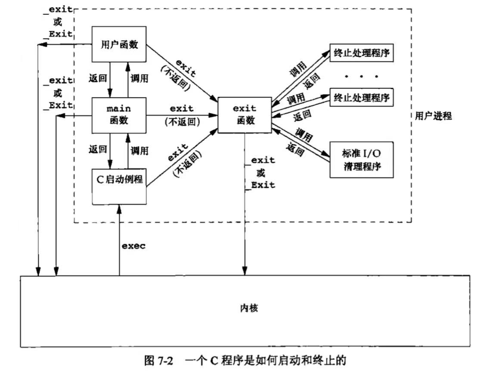
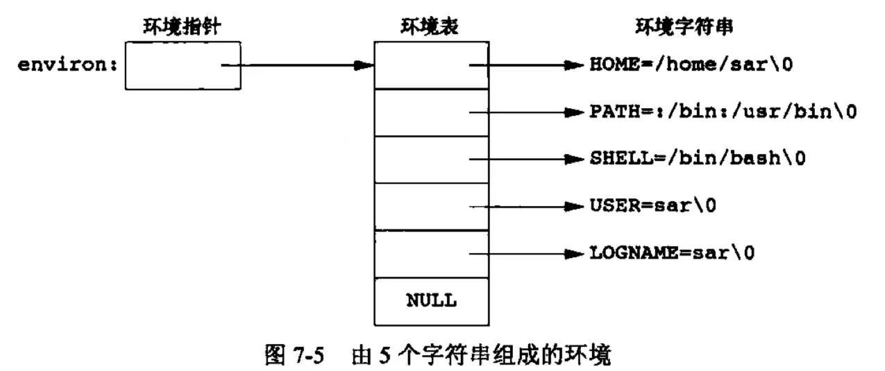
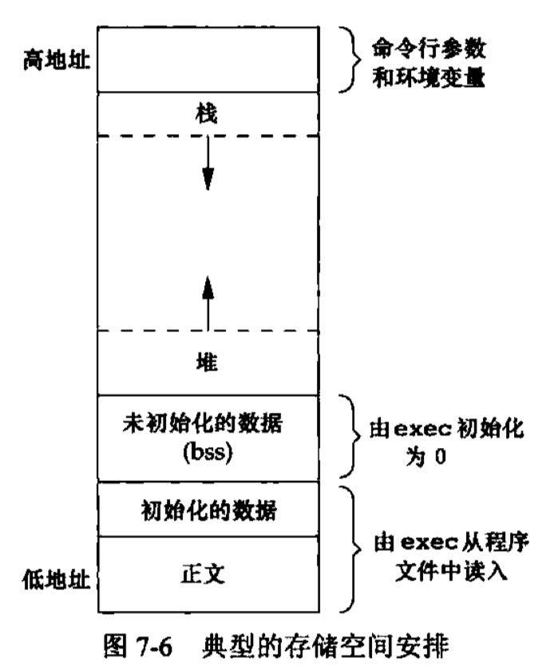

# 进程环境

## main 函数

```c++
int main(int argc, char *argv[]);
```

其中，`argc` 表示命令行参数的数量，`argv[] `表示指向各参数的指针所构成的数组。

- ==当内核执行 $C$ 程序时（调用 `exec` 系列函数），首先调用一个特殊的启动例程，再调用 `main` 函数。可执行程序文件会将此启动例程指定为程序的起始地址（由连接编辑器设置，连接编辑器由 `C` 编译器调用）。启动例程会从内核中获取命令行参数和环境变量值，为调用 `main` 函数做好准备。==

- **内核执行程序** 的唯一方法：调用 `exec` 函数。

- **进程自愿终止** 的唯一方法：显式/隐式（通过 `exit`）调用 `_exit` 或 `_Exit`。


## 进程终止

有 $8$ 中方式使进程终止，包括 $5$ 种 **正常终止** 和 $3$ 种 **异常终止**。

### 正常终止

1. 从 `main` 返回
2. 调用 `exit`
3. 调用 `_exit` 或 `_Exit`
4. ==最后一个线程从其启动例程返回==
5. ===从最后一个线程调用 `pthread_exit`==

### 异常终止

1. 调用 `abort`
2. 接到相应信号
3. ==最后一个线程对取消请求做出响应==


#### 1. 退出函数

`_exit` 和 _Exit **立即进入内核**，  ==`exit` **先执行一些清理处理，再返回内核**（历史原因）== 。

三个退出函数都带一个整型参数，称为 **终止状态**（exit status）。


##### 进程终止状态未定义的原因

a. 调用退出函数不带终止状态

b. `main` 执行了一个无返回值的 `return` 语句

c. `main` 没有声明返回类型为整型


##### `main` 函数返回一个整型值与用该值调用 `exit` 是等价的

即：

```c++
int main(int argc, char *argv[])
{
	return 0;
}
// 等价于
int main(int argc, char *argv[])
{
	exit(0);
}
```


##### 打印终止状态命令

```shell
echo $?
```


#### 2. `atexit` 函数

根据 $ISO C$ 规定，一个进程可以等级最多 $32$ 个函数，这些函数由 `exit` 自动调用，称之为 **终止处理程序**（exit handler），并调用 `atexit` 函数来 **登记** 这些函数。

- `atexit` 函数的参数是一个函数地址，指向要登记的函数。

- `exit` 函数调用这些函数的顺序与 `atexit` 的登记顺序 **相反**。

- 若一个函数被多次登记，他也会被 **多次** 调用。

- 根据 $ISO C$ 和 $POSIX.1$，`exit` 函数会先调用各终止处理程序，再（通过 `fclose`）关闭所有打开流。

- 若程序调用 exec 系列函数，则将请出所有已安装的终止处理程序。

  

## 命令行参数

当执行一个程序时，调用 `exec` 的进程可以 **将命令行参数传递给该新程序**。


## 环境表

- 每个程序都会接收一张环境表。与参数表一样，环境表也是一个 **字符指针数组**，其中每个指针包含一个以 `null ('\n')` 结束的 $C$ 字符串的地址。

- 全局变量 `environ` 包含了该指针数组的地址。

- 称 `environ` 为 **环境指针**（$environment$ $pointer$），称指针数组为 **环境表**，称数组内各指针指向的字符串为 **环境字符串**。

- 用 `environ` 指针查看整个环境表，用 `getenv` 和 `putenv` 访问特定的环境变量。
- 大多数预定义名完全由大写字母组成，但这只是一个惯例。



## C 程序的存储空间布局

- 正文段。$CPU$ 执行的机器指令部分。通常是 **可共享并且只读 **的。
- 初始化数据段，又称数据段。==包含了程序中需要明确赋初值的变量，比如全局变量。==
- 未初始化数据段，又称 $bss$ 段。==在程序执行前，内核将此段中的数据初始化为 0 或空指针，比如 `int nums[100]`。==
- 栈。存放调用的函数的返回地址和调用者的环境信息。==递归函数调用自己时，会生成一个新的栈帧。==
- 堆。==动态存储分配。==



注意：需要存储在磁盘程序文件中的只有正文段和初始化数据段。

## 共享库

共享库使得可执行文件中不再需要包含公用的库函数，而只需要 **在所有进程都可引用的存储区中** 保存这种库例程的一个 **副本**。程序第一次执行或第一次调用某个库函数的时候，会用 **动态链接** 的方法与共享库函数相连接。

- 共享库可以减少每个可执行文件的长度，但是由于第一次调用时需要建立动态链接，所以会增加一些运行时间开销。
- 只要接口不变，可以迭代更新库函数。


## 存储空间分配

主要有三个函数，这三个函数的返回值都是 `void *`，因此当把函数返回值赋值给一个不同类型的指针时，**不需要进行显式的强制类型转换**。

这三个分配函数都是通过 **`sbrk(2)` 系统调用 **实现的，该系统调用扩充或缩小进程的堆。

1. `malloc` 函数

```c++
#include <stdlib.h>
void *malloc(size_t size);
```

分配指定字节数的存储区，存储区中的初始值不确定。

2. `calloc` 函数

```c++
#include <stdlib.h>
void *calloc(size_t nobj, size_t size);
```

为指定数量指定长度的对象分配存储空间，每一位（bit）都初始化为 0。

3. `realloc` 函数

```c++
#include <stdlib.h>
void *realloc(void *ptr, size_t newsize); 	// newsize 表示存储区的新长度
```

增加或减少以前分配区的长度，新增区域的初始值不确定。

4. free 函数

```c++
#include <stdlib.h>
void free(void *ptr);
```

释放分配的存储空间。被释放的空间通常被送入可用存储区池，以供下次分配。

## ==P186==

## 环境变量


# 进程控制

## 进程标识

- 每个进程都有一个非负整型表示的唯一进程 ID，虽然是唯一的，但是进程 ID 是可复用的（==延迟复用算法==，防止将新锦成误认为是使用同一 ID 的某个已经终止的先前进程）。
- ID 为 0 的进程通常是调度进程，常被称为交换进程（$swapper$）。


## 函数 exec

- 当进程调用 `exec` 系列函数时，该进程执行的程序会被完全替换，然后从新程序的 `main` 函数开始执行。
- 调用 `exec` 不会改变进程 $ID$，因为没有创建新的进程。
- 本质上是用磁盘上的一个新程序代替了当前进程的正文段、数据段、堆段和栈段。

```c++
#include <unistd.h>

int execl(const char *pathname, const char *arg0, ... /* (char *) 0 */);
int execv(const char *pathname, char *const argv[]);
int execle(const char *pathname, const char *arg0, ... /* (char *) 0, char *const envp[] */);
int execve(const char *pathname, char *const argv[], char *const envp[]);
int execlp(const char *filename, const char *arg0, ... /* (char *) 0 */);
int execvp(const char *filename, char *const argv[]);
int fexecve(int fd, char *const argv[], char *const envp[]);
```

