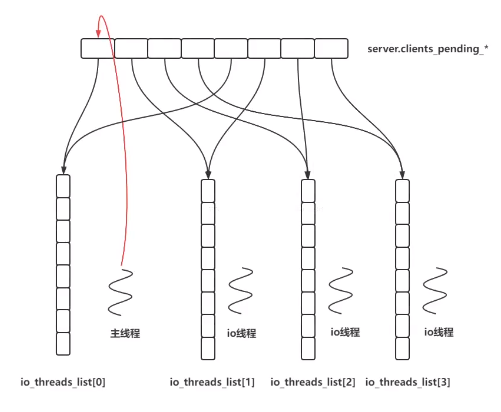

# 语言

- 生命周期
- 资源回收
- 标准库
- 错误与异常处理
- 日志分析
- 面向对象的理解
- 设计模式？（高内聚低耦合）
- gdb使用，断点调试


**void\*是一种特殊的指针类型**

可用于存放任意对象的地址。一个void*指针存放着一个地址,这一点和其他指针类似。

## C++17

### 结构化绑定

- 可以从复杂数据结构（`pair`、`map`） / **函数** 中获取多个实体（静态成员除外）。
- 在结构化绑定的实现过程中，里面暗藏了一个隐藏的匿名对象。而结构化绑定时指定的变量实际上就是通过这个隐藏的匿名对象进行赋值的。
- 若在 `[]` 前加 `&`，则获取的是实体的引用，可以修改值。否则是值拷贝。

```c
struct MyStruct
{
    int i = 0;
    std::string s;
 
};
  
MyStruct ms{100, "hhhh"};
 
int main()
{
	auto [id, name] = ms;
    // 等价于
    /* 
    * auto tmp = ms;
    * id = ms.i;
    * name = ms.s;
    */
	std::cout << id << ", " << name << std::endl;
}
```

### `try... catch...`


### extern

- 声明外部变量或函数，表示该变量或函数在其他文件中定义。
- 常在头文件中声明，在源文件中定义，以便其他源文件通过 `#include` 头文件来访问这些变量或函数。

```c
// file1.h
void myFunction();

// file1.cpp
void myFunction()
{
    // 函数实现
}

// File2.cpp
#include "file1.h"
extern void myFunction(); // 声明外部函数，表示该函数在其他文件中定义
```


### 类中静态变量

// 静态变量属于类而非类的实例，静态变量被该类所有实例共享。

  // 静态变量在类的声明中声明，在类的实现中初始化。


# 数据结构与算法

- 线性结构
  - 链式、队列、栈
- 树形结构
  - b树、b+树
- 图形结构
  - dijstra、最小生成树
- 递归
- 排序
- 贪心
- dp
- 跳表、哈希、散列表、布隆过滤器


# 数据库

- mysql
  - mysql安装与配置
  - sql 建表，索引，存储过程
  - 存储引擎 myisam/innodb
  - 数据库连接池
  - 异步数据库请求
  - 数据集集群，分库分表，读写分离
- redis
  - redis编译配置
  - redis命令使用
  - redis连接池/异步redis
  - redis 集群，数据备份
  - 缓存雪崩，缓存击穿


## redis

业务处理（命令处理，处理server发来的命令）：redis 单线程处理。

处理流程：（2,3涉及到read系统调用， 5， 6涉及到write系统调用）

1.感知客户端给 redis 发送数据

2.从内核协议栈中读出客户端发送的数据

3.解析协议

4.执行命令

5.得到命令的处理结果，加密协议

6.发送数据

前提：基于这样一个处理流程，在多并发连接（多个server端与redis进行交互时）时，并且2,3,5,6涉及到的I/O操作都比较耗时，所以可以使用 **I/O 线程池**来处理这些耗时的操作。




# 网络原理

- ping，telnet，ifconfig
- 网络体系模型
- tcp 三次握手，四次挥手，滑动窗口，11个状态机
- udp 原理，实时性
- http/https/http2.0/http3.0
- session cookie application
- 网络安全，加密，数字签名
- wireshark，tcpdump 抓包工具
- iperf


# 操作系统

- 文件操作，系统操作
- 程序编译，运行
- shell，vi的使用
- linux系统性能监控参数 ps、netstat、df
- 进程管理
- 用户态/内核态
- 内存管理，内存池，内存泄漏
- 磁盘文件系统，虚拟文件系统
- 磁盘IO


# 网络编程

- socket，tcp/udp
- 网络io模型，阻塞非阻塞，同步异步
- IO多路复用，select/poll/epoll
- epoll reactor，proactor
- time_wait/close_wait
- c10k,c1000k,c10m
- 网络框架 libevent/libev，协程 ntyco，libco


阻塞 I/O 实现同步逻辑


# 分布式

- rpc，grpc，tars,  brpc,  srpc
- 简单rpc协议设计/框架搭建
- 分布式锁
- 协议传输的序列化与反序列化
- 容灾，降级熔断，流量控制
- 服务注册，服务发现
- 高并发，高可用


## RPC

RPC：远程过程调用协议（Remote Procedure Call Protocol），可以让我们像调用本地对象一样发起远程调用。

gRPC：一个现代的、高性能、开源的、和语言无关的通用 RPC 框架。基于 HTTP2 协议设计，序列化使用


# 云原生

- 腾讯云/阿里云

- docker使用，编排，网络
- k8s管理


软技能