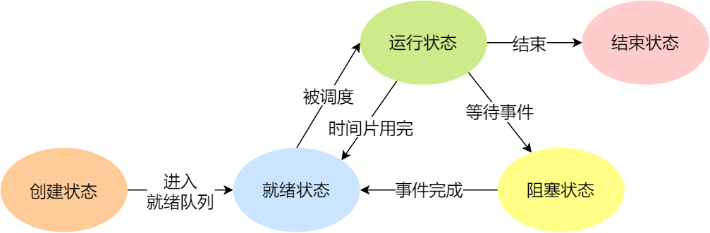
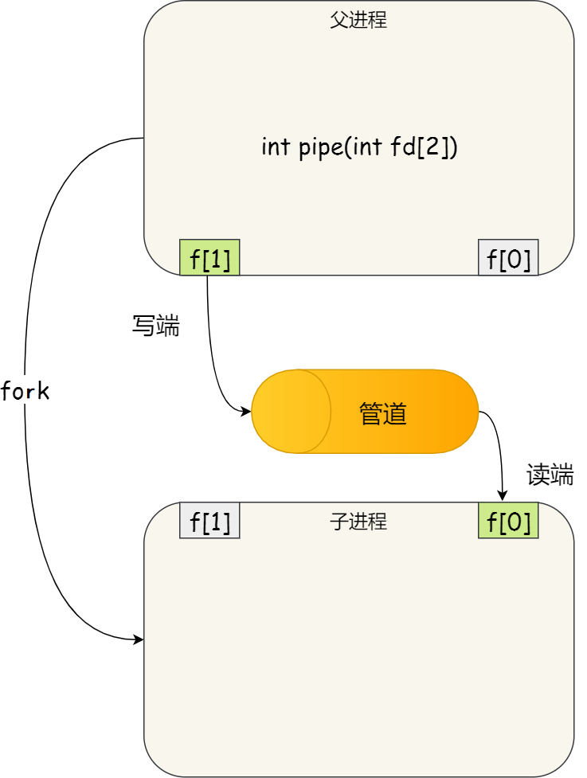
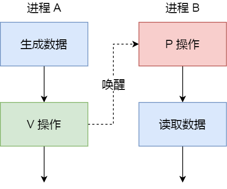

# C++

### 1. 声明和定义（分配空间）

声明：告诉编译器一个变量或者函数的名字、返回类型、参数信息等，但不分配空间。

定义：在程序中为某个变量、函数等 **分配内存空间**，以便使用。

**变量的声明和定义**

- 定义性声明：在声明时就实现定义，比如，`int a`。
- 引用性声明：比如声明外部定义的变量，关键词 `extern`，告诉编译器该变量已经在别处定义过了。

**函数的声明和定义**

- 声明：告诉编译器这个函数在别处已定义。
- 定义：带函数体。

### 2. c 和 c++ 的区别，c++ 的三大特性

c：面向过程。分析解决问题的步骤，然后代码实现步骤

- 性能更好，因为类需要实例化，开销大。Linux、嵌入式等一般采用面向过程开发。

c++：面向对象。把问题分解成各个对象，描述某个事务在整个解决问题的步骤中的行为。

- 易维护、易复用、易扩展。由于面向对象有封装、继承、多态性的特性，可以设计出低耦合的系统，使系统更加灵活和易于维护。

#### - c++ 三大特性

- 封装。数据安全。

- 继承。代码重用，功能扩充。

- 多态。接口重用。
  - 静态多态：重载函数。
  - 动态多态 / 运行时多态：虚函数实现。

### 3. 重载、覆盖和隐藏

重载：在同一个类 / 同一个作用域中，函数名相同，参数不同。

覆盖：派生类覆盖基类的虚函数。函数名相同，参数也相同。

隐藏：派生类隐藏基类的非虚函数。函数名相同，参数也相同。（当派生类存在一个和基类非虚函数函数名相同、参数也相同的函数时，派生类会覆盖基类的同名同参函数）

### 4. c++ 中的虚函数和纯虚函数

虚函数是实现 **多态** 的一种方式，当 **基类希望派生类重新定义某成员函数** 时，基类用关键词 `virtual` 修饰这些函数，将其声明为虚函数。

- 基类定义的虚函数在所有派生类中都是虚函数。
- 派生类中覆盖基类的虚函数时，可以不带关键词 `virtual` 。
- 关键词 `virtual` 只能出现在 **类内部的函数声明** 中，不能用于 **类外部的函数定义**。

```c++
class Animal {
public:
    // virtual 只能出现在类内部的函数声明中，不能用于类外部的函数定义
	virtual void makeSound() {
		std::cout << "Animal makes a sound" << std::endl;
	}
};
```

#### - 虚函数和非虚函数

在 C++ 中，基类必须将它的两种成员函数区分开：

- 非虚函数：基类希望直接继承给派生类而不需要改写的函数。**静态绑定**，即解析过程发生在编译而非运行时
- 虚函数：基类希望派生类进行覆盖的函数：定义为虚函数。**动态绑定**，即根据对象类型不同，调用该虚函数时可能执行基类的版本，也可能执行某个派生类的版本，因此需要在程序运行时确定。由于只有在程序运行时才知道调用哪个版本的虚函数，因此 **所有虚函数都必须有定义**，就是不使用虚函数，也必须定义它。

#### - 关键词 override

C++11 允许派生类使用 `override` 关键字显式注明哪个成员函数是改写的基类的虚函数，代码示例如下：

```c++
#include <iostream>


class Animal {
private:
	int nums;
public:
	Animal() = default;
	Animal(int nums_) : nums(nums_) {};
	virtual void printNum() {
		std::cout << "The number of animals is: " << nums << std::endl;
	}
};

class Dog :public Animal {
private:
	int nums;
public:
	Dog() = default;
	Dog(int nums_) : nums(nums_) {};
	void printNum() override {
		std::cout << "The number of dog is: " << nums << std::endl;
	}
};

int main(){
	Animal animal(100);
	animal.printNum();   // The number of animals is: 100
	Dog dog(5);
	dog.printNum();      // The number of dog is: 5
	return 0;
}
```

#### - 构造函数不可以定义为虚函数，析构函数最好定为虚函数

构造函数不可以是虚函数

- 构造函数是在创建对象时执行的，而虚函数是程序运行时执行的；也就是说在创建对象时虚函数还没确定用那个版本呢，所以构造函数不可以是虚函数。

析构函数可以是虚函数且最好写成虚函数

- 如果析构函数不是虚函数，则容易造成内存泄露。因为，若有父类指针指向子类对象存在，需要析构的是子类对象；但父类析构函数不是虚函数，则只析构了父类，造成子类对象没有及时释放，引起内存泄漏。

#### - 静态成员函数不能是虚函数（所有对象公用一个），内联函数不能是虚函数（在编译时就要确定函数体）

#### - 类的虚表

**每个包含了虚函数的类都包含一个虚表。**

- 不管多少个对象，都是用的是同一个虚表。
- 虚表是一个指针数组，其元素是虚函数的指针，每个元素对应一个虚函数的函数指针。虚表内的条目，即虚函数指针的赋值发生在 **编译器的编译阶段**，也就是说在代码的编译阶段，虚表就可以构造出来了。（非虚函数不会经历需表）

- 如果一个基类包含了虚函数，那么其派生类也就继承了这些虚函数，换句话说，一个类继承了包含虚函数的基类，那么这个类也拥有自己的虚表。

假设类 A 包含虚函数 vfunc1，vfunc2，由于类 A 包含虚函数，故类A拥有一个虚表。

```c++
class A {

public:

    virtual void vfunc1();
    virtual void vfunc2();
    void func1();
    void func2();

private:

    int m_data1, m_data2;
};
```

类 A 的虚表：


#### - 类的虚表指针

每个对象都有一个指向虚表的指针。为了指定对象的虚表，对象内部包含一个虚表的指针，来指向自己所使用的虚表。为了让每个包含虚表的类的对象都拥有一个虚表指针，编译器在类中添加了一个指针，`*__vptr`，用来指向虚表。这样，当类的对象在创建时便拥有了这个指针，且这个指针的值会自动被设置为指向类的虚表。


#### - 虚函数的动态绑定流程

例如，类A是基类，类B继承类A，类C又继承类B。

```c++
class A {
public:
    virtual void vfunc1();
    virtual void vfunc2();
    void func1();
    void func2();
private:
    int m_data1, m_data2;
};

class B : public A {
public:
    virtual void vfunc1();
    void func1();
private:
    int m_data3;
};

class C: public B {
public:
    virtual void vfunc2();
    void func2();
private:
    int m_data1, m_data4;
};
```

类 A 类 B 类 C 对象模型：**（虚表应该还包含从基类中继承的虚函数）**


基类的指针只能调用基类的方法，但是记住 **虚函数的指针是基类的，其他子类继承下来也只是继承了使用权**。

假设我们定义一个类 B 的对象。由于 `bObject` 是类 B 的一个对象，故 `bObject` 包含一个虚表指针，指向类 B 的虚表。

现在，我们声明一个类 A 的指针 p 来指向对象 `bObject`。虽然 **p 是基类的指针只能指向基类的部分**，但是虚表指针亦属于基类部分，**其值不会改变**，所以 p 可以访问到对象 `bObject` 的虚表指针，进而访问类 B 的需表。

```c++
int main() 
{
    B bObject;
    A *p = & bObject;
    p->vfunc1();
}
```

程序在执行 `p->vfunc1()` 时，会发现 p 是个指针，且调用的函数是虚函数，那么程序会根据虚表指针 `p->vptr` 来访问对象 `bObject` 对应的虚表，然后在虚表中查找所调用的函数对应的条目。由于虚表在编译阶段就可以构造出来了，所以可以根据所调用的函数定位到虚表中的对应条目。最后，根据虚表中找到的函数指针，调用函数。所以 `p->vfunc1()` 实质会调用 `B::vfunc1()` 函数。

#### - 纯虚函数

纯虚函数：纯虚函数是**一种特殊的虚函数**，在许多情况下，在**基类中不能对虚函数给出有意义的实现**，而把它声明为纯虚函数，它的实现留给**该基类的派生类**去做。

##### 虚函数与纯虚函数的区别

- 纯虚函数是虚函数的一种，但是虚函数可以在基类中实现，纯虚函数不能在基类中实现，且必须在子类中实现。

- 包含虚函数的类可以被实例化，包含纯虚函数的类（抽象类）不能被实例化。

```c++
class Animal {
public:
	virtual void makeSound() = 0 {} 	// 纯虚函数
};
```

#### - 抽象类

含有纯虚函数的类称为抽象类。

如下面的代码中对 Animal 抽象类的实例化会编译报错。

```c++
#include <iostream>

class Animal {
	// 这里的 = 0 没有任何实际意义，只起形式上的作用，告诉编译系统"这是纯虚函数"
	virtual void makeSound() = 0{}
};

int main(){
	Animal animal();   // 报错：不能实例化抽象类
	return 0;
}
```

### 5. 静态绑定和动态绑定

绑定：将 **变量** 和 **函数名** 转换为地址的过程。

静态绑定：编译时绑定，即，在编译阶段,该语句已经被编译成 “**call 函数地址**” 类似的汇编指令。

动态绑定：直到程序运行时才能确定调用哪个函数。（指针指向函数表，查表获取调用函数的指针）

- 动态绑定的条件：①有指针或引用②向上转型（基类指针接受派生类对象）③调用虚函数

  ```c++
  A* pa = new B;
  pa->vfunc1();
  
  pa = &b;
  pa->vfunc1();
  ```

### ==5. c 和 c++ 中结构体的区别，c++ 中结构体和类的区别==

c++ 中结构体和类差不多，结构体中可以包含函数；也可以定义public、private、protected数据成员；但结构体的默认属性是 public，类的默认属性是 private。

**c++ 中结构体和类的区别**

- 

**c 和 c++ 中结构体的区别**

- C 结构体致涉及数据，不涉及算法，只是一个存储数据的结构。

- C 结构体要在定义时加上 typedef 才能设置别名，否则必须用 struct + 结构体名。C++ 结构体可以直接设置别名。

  ```cpp
  typedef struct Student{
      int sNo;
      char name[10];
  }Stu;
  int main(){
      struct Student stu;  //方式一
      Stu stu1;            //方式二
  }
  ```

- C 结构体只有 public 一种权限，而 C++ 结构体有 public、private、protect 三种权限。
- C 结构体不能在结构体中初始化成员变量，而 C++ 结构体可以。

- C 中结构体不能有成员函数，而 C++ 中可以有，甚至可以有虚函数。所以 C 中不存在构造函数、虚构函数和 this 指针。
- 
- C 结构体没有继承关系，而 C++ 结构体可以从类或者其他结构体继承而来。
- 
- C 结构体在定义时除非使用 typedef，否则之后定义变量都必须跟上 struct + 结构体名，而 C++ 结构体可以直接使用结构体名，不受限制。
- C 结构体不能有静态成员变量，而 C++ 结构体可以有。
- C 结构体的空结构体 sizeof 为 0，C++的 sizeof 为 1。

# C++ 11 新特性

### 1. auto 和 decltype

> C++11中用auto关键字来支持自动类型推导。用decltype推导表达式类型。头文件：#include<typeinfo>

auto：让编译器在编译器就推导出变量的类型，可以通过=右边的类型推导出变量的类型。（前提是定义一个变量时对其进行初始化）

```cpp
auto a = 10; // 10是int型，可以自动推导出a是int
```

decltype：用于推导表达式类型，这里只用于编译器分析表达式的类型，表达式实际不会进行运算。（decltypde是不需要推导变量初始化的，根据的是表达式对变量的类型就可以推导。）

```text
auto varname = value;
decltype(exp) varname = value;
decltype(10.8) x;  //x 被推导成了 double
```

两者区别：

1，auto用于变量的类型推导，根据初始化表达式的类型来推导变量的类型，常用于简化代码和处理复杂类型。而decltype则用于获取表达式的类型，保留修饰符，并且可以进行表达式求值。

2，auto在初始化时进行类型推导，而decltype直接查询表达式的类型，可以用于任何表达式，包括没有初始化的变量。

3，auto在编译期间确定类型，并且无法更改。而decltype在运行时才确定表达式的类型。

4，auto适用于简单的类型推导，而decltype适用于复杂的类型推导和获取表达式的结果类型。

### 2.2 范围 for 循环

C++11 引入了 **范围 for 循环（Range-based for loop）**，它提供了一种简洁而直观的方式来遍历容器、数组、字符串和其他可迭代对象。

```c++
// 自动遍历容器中的每个元素，并将当前元素的值赋给 element 变量，然后执行循环体中的代码块。
for(auto element : container) {
    // 操作每个元素
}
```

- `element` ：变量，用于存储容器中的每个元素的值。
- `container`：可迭代对象，例如数组、标准库容器或自定义容器，也可以是大括号初始化的序列。

```c++
// 实例：
#include <iostream>
#include <vector>

int main() {
    std::vector<int> numbers = {1, 2, 3, 4, 5};
    for (auto number : numbers) {
        std::cout << number << " ";
    }
    return 0;
}
```

此外，范围 for 循环还支持 **遍历用大括号初始化的序列**：

```c++
#include <iostream>
using namespace std;

int main() {
    for (int num : {1, 2, 3, 4, 5}) {
        cout << num << " ";
    }
    return 0;
}
```

需要注意的是，如果想要修改遍历的 container 对象，需要 **定义引用形式的变量**：

```c++
#include <iostream>
#include <vector>
using namespace std;

int main() {
    char arc[] = "abcde";
    vector<char> myvector(arc, arc + 5);

    for (auto &ch : myvector) { 	// 必须引用
        ch++;
    }
    return 0;
}
```

## 3. 列表初始化 / {} 初始化

C++11 扩充了 {} 的使用范围，使得 {} 可以适用于 **所有的内置类型和用户自定义的类型**，在 **new** 表达式中也一样适用。**使用列表初始化方式初始化对象会调用对象的构造函数。**

默认地， {} 在初始化的时候会返回一个 `std::initializer_list` 的对象，而在初始化对象变量的时候将这个 `std::initializer_list` 对象作为一个参数传入需要初始化的对象的构造函数中。

# 系统

### 1. 进程

**进程：**运行中的程序。代码是一个 **存储在硬盘的静态文件**，通过编译后就会生成二进制 **可执行文件**，当我们运行这个可执行文件后，它会被装载到 **内存** 中，接着 CPU 会执行程序中的每一条指令，这个 **运行中的程序**，就被称为进程。

**并发：**CPU 交替执行多个程序。

#### - 进程的 5 个状态



#### - 进程的 7 个状态

**挂起状态：**进程暂时被淘汰到外存，**没有占用实际的物理内存空间** 的状态。阻塞的进程会占用内存，在虚拟内存管理系统中，通常会把阻塞的进程的物理内存空间换出到硬盘中，等再次被调度时再读入到内存中。挂起状态可以分为两种：

- **阻塞挂起状态：**进程在外存（硬盘）并等待某个事件的出现；
- **就绪挂起状态：**进程在外存（硬盘），但只要进入内存，即刻立刻运行；


**导致进程挂起的原因：**

- 通过 sleep 让进程间歇性挂起，其工作原理是设置一个定时器，到期后唤醒进程。
- 用户希望挂起一个程序的执行，比如在 Linux 中用 `Ctrl+Z` 挂起进程；

#### - **进程控制块**（*process control block，PCB*）

**进程控制块：**PCB 是进程存在的 **唯一标识**，随进程出现和消亡。

**进程控制块包含的信息：**

- 进程描述信息：

  - 进程标识符：标识各个进程，每个进程都有一个并且唯一的标识符；

  - 用户标识符：进程归属的用户，用户标识符主要为共享和保护服务；

- **进程控制和管理信息：**

  - 进程当前状态，如 new、ready、running、waiting 或 blocked 等；

  - 进程优先级：进程抢占 CPU 时的优先级；

- **资源分配清单：**
  - 有关内存地址空间或虚拟地址空间的信息，所打开文件的列表和所使用的 I/O 设备信息。

- **CPU 相关信息：**
  - CPU 中各个寄存器的值，当进程被切换时，CPU 的状态信息都会被保存在相应的 PCB 中，以便进程重新执行时，能从断点处继续执行。

**进程控制块的组织形式：**

通常是通过**链表**的方式进行组织，把具有 **相同状态的进程链在一起，组成各种队列**，如就绪队列、阻塞队列等。因为链表能够灵活插入和删除。

#### - 进程的控制

**01 创建进程**

- 申请一个空白的 PCB，并向 PCB 中填写一些控制和管理进程的信息，比如进程的唯一标识等；
- 为该进程分配运行时所必需的资源，比如内存资源；
- 将 PCB 插入到就绪队列，等待被调度运行；

**02 终止进程**

进程可以有 3 种终止方式：正常结束、异常结束以及外界干预（信号 `kill` 掉）。

当子进程被终止时，其在父进程处继承的资源应当还给父进程。而当父进程被终止时，该父进程的子进程就变为孤儿进程，会被 1 号进程收养，并由 1 号进程对它们完成状态收集工作。

终止进程的过程如下：

- 查找需要终止的进程的 PCB；
- 如果处于执行状态，则立即终止该进程的执行，然后将 CPU 资源分配给其他进程；
- 如果其还有子进程，则应 **将该进程的子进程交给 1 号进程接管**；
- 将该进程所拥有的全部资源都归还给操作系统；
- 将其从 PCB 所在队列中删除；

**03 阻塞进程**

当进程需要等待某一事件完成时，它可以调用阻塞语句把自己阻塞等待。而一旦被阻塞等待，**它只能由另一个进程唤醒**。

阻塞进程的过程如下：

- 找到将要被阻塞进程标识号对应的 PCB；
- 如果该进程为运行状态，则 **保护现场**，将其状态转为阻塞状态，停止运行；
- 将该 PCB 插入到阻塞队列中去；

**04 唤醒进程**

进程由「运行」转变为「阻塞」状态是由于进程必须等待某一事件的完成，**它只能由另一个进程唤醒**。

唤醒进程的过程如下：

- 在该事件的阻塞队列中找到相应进程的 PCB；
- 将其从阻塞队列中移出，并置其状态为就绪状态；
- 把该 PCB 插入到就绪队列中，等待调度程序调度；

进程的阻塞和唤醒是一对功能相反的语句，如果某个进程调用了阻塞语句，则必有一个与之对应的唤醒语句。

#### - 进程的上下文切换

**进程的上下文切换**：一个进程切换到另一个进程运行。进程是由内核管理和调度的，所以进程的切换只能发生在内核态。进程的上下文切换不仅包含了 **虚拟内存**、**栈**、**全局变量** 等用户空间的资源，还包括了 **内核堆栈**、**寄存器** 等内核空间的资源。

通常，会把交换的信息保存在进程的 PCB，当要运行另外一个进程的时候，从这个进程的 PCB 取出上下文，然后恢复到 CPU 中，这使得这个进程可以继续执行，

**发生进程上下文切换的场景：**

- 当某个进程的时间片耗尽了时
- 进程在系统资源不足（比如内存不足）时
- 进程通过睡眠函数 sleep 将自己主动挂起时
- 有优先级更高的进程运行时
- 发生硬件中断时，CPU 上的进程会被中断挂起，转而执行内核中的中断服务程序；

### 2. 线程

**线程：**线程是进程当中的一条执行流程。线程之间可以并发运行且共享相同的地址空间。同一个进程内多个线程之间可以**共享代码段、数据段、打开的文件等资源**，但每个线程各自都有一套 **独立的寄存器和栈**，这样可以确保线程的控制流是相对独立的。


**线程的上下文切换**：

在前面我们知道了，线程与进程最大的区别在于：**线程是调度的基本单位，而进程则是资源拥有的基本单位**。

所以，所谓操作系统的任务调度，实际上的调度对象是线程，而进程只是给线程提供了虚拟内存、全局变量等资源。

对于线程和进程，我们可以这么理解：

- 当进程只有一个线程时，可以认为进程就等于线程；
- 当进程拥有多个线程时，这些线程会共享相同的虚拟内存和全局变量等资源，这些资源在上下文切换时是不需要修改的；

另外，线程也有自己的私有数据，比如栈和寄存器等，这些在上下文切换时也是需要保存的。

当两个线程不是属于同一个进程，则切换的过程就跟进程上下文切换一样；

- 当两个线程是属于同一个进程，因为虚拟内存是共享的，所以在切换时，虚拟内存这些资源就保持不动，只需要切换线程的私有数据、寄存器等不共享的数据；

所以，线程的上下文切换相比进程，开销要小很多。

#### - 线程的实现

主要有三种线程的实现方式：

- **用户线程（\*User Thread\*）**：在用户空间实现的线程，不是由内核管理的线程，是由用户态的线程库来完成线程的管理；
- **内核线程（\*Kernel Thread\*）**：在内核中实现的线程，是由内核管理的线程；
- **轻量级进程（\*LightWeight Process\*）**：在内核中来支持用户线程；

多个用户线程对应同一个内核线程：


一个用户线程对应一个内核线程：


多个用户线程对应到多个内核线程：


#### 用户线程

用户线程是基于用户态的线程管理库来实现的，那么**线程控制块（\*Thread Control Block, TCB\*）** 也是在库里面来实现的，对于操作系统而言是看不到这个 TCB 的，它只能看到整个进程的 PCB。

所以，**用户线程的整个线程管理和调度，操作系统是不直接参与的，而是由用户级线程库函数来完成线程的管理，包括线程的创建、终止、同步和调度等。**

用户级线程的模型，也就类似前面提到的**多对一**的关系，即多个用户线程对应同一个内核线程，如下图所示：


用户线程的**优点**：

- 每个进程都需要有它私有的线程控制块（TCB）列表，用来跟踪记录它各个线程状态信息（PC、栈指针、寄存器），TCB 由用户级线程库函数来维护，可用于不支持线程技术的操作系统；
- 用户线程的切换也是由线程库函数来完成的，无需用户态与内核态的切换，所以速度特别快；

用户线程的**缺点**：

- 由于操作系统不参与线程的调度，如果一个线程发起了系统调用而阻塞，那进程所包含的用户线程都不能执行了。
- 当一个线程开始运行后，除非它主动地交出 CPU 的使用权，否则它所在的进程当中的其他线程无法运行，因为用户态的线程没法打断当前运行中的线程，它没有这个特权，只有操作系统才有，但是用户线程不是由操作系统管理的。
- 由于时间片分配给进程，故与其他进程比，在多线程执行时，每个线程得到的时间片较少，执行会比较慢；

以上，就是用户线程的优缺点了。

> 那内核线程如何理解？存在什么优势和缺陷？

**内核线程是由操作系统管理的，线程对应的 TCB 自然是放在操作系统里的，这样线程的创建、终止和管理都是由操作系统负责。**

内核线程的模型，也就类似前面提到的**一对一**的关系，即一个用户线程对应一个内核线程，如下图所示：


内核线程的**优点**：

- 在一个进程当中，如果某个内核线程发起系统调用而被阻塞，并不会影响其他内核线程的运行；
- 分配给线程，多线程的进程获得更多的 CPU 运行时间；

内核线程的**缺点**：

- 在支持内核线程的操作系统中，由内核来维护进程和线程的上下文信息，如 PCB 和 TCB；
- 线程的创建、终止和切换都是通过系统调用的方式来进行，因此对于系统来说，系统开销比较大；

以上，就是内核线程的优缺点了。

> 最后的轻量级进程如何理解？

**轻量级进程（\*Light-weight process，LWP\*）是内核支持的用户线程，一个进程可有一个或多个 LWP，每个 LWP 是跟内核线程一对一映射的，也就是 LWP 都是由一个内核线程支持，而且 LWP 是由内核管理并像普通进程一样被调度**。

在大多数系统中，**LWP与普通进程的区别也在于它只有一个最小的执行上下文和调度程序所需的统计信息**。一般来说，一个进程代表程序的一个实例，而 LWP 代表程序的执行线程，因为一个执行线程不像进程那样需要那么多状态信息，所以 LWP 也不带有这样的信息。

在 LWP 之上也是可以使用用户线程的，那么 LWP 与用户线程的对应关系就有三种：

- `1 : 1`，即一个 LWP 对应 一个用户线程；
- `N : 1`，即一个 LWP 对应多个用户线程；
- `M : N`，即多个 LWP 对应多个用户线程；

接下来针对上面这三种对应关系说明它们优缺点。先看下图的 LWP 模型：


**1 : 1 模式**

一个线程对应到一个 LWP 再对应到一个内核线程，如上图的进程 4，属于此模型。

- 优点：实现并行，当一个 LWP 阻塞，不会影响其他 LWP；
- 缺点：每一个用户线程，就产生一个内核线程，创建线程的开销较大。

**N : 1 模式**

多个用户线程对应一个 LWP 再对应一个内核线程，如上图的进程 2，线程管理是在用户空间完成的，此模式中用户的线程对操作系统不可见。

- 优点：用户线程要开几个都没问题，且上下文切换发生用户空间，切换的效率较高；
- 缺点：一个用户线程如果阻塞了，则整个进程都将会阻塞，另外在多核 CPU 中，是没办法充分利用 CPU 的。

**M : N 模式**

根据前面的两个模型混搭一起，就形成 `M:N` 模型，该模型提供了两级控制，首先多个用户线程对应到多个 LWP，LWP 再一一对应到内核线程，如上图的进程 3。

- 优点：综合了前两种优点，大部分的线程上下文发生在用户空间，且多个线程又可以充分利用多核 CPU 的资源。

**组合模式**

如上图的进程 5，此进程结合 `1:1` 模型和 `M:N` 模型。开发人员可以针对不同的应用特点调节内核线程的数目来达到物理并行性和逻辑并行性的最佳方案。

### 3. 进程和线程的区别

当进程只有一个线程时，可以认为进程就等于线程；

线程与进程的比较如下：

- 进程是资源（包括内存、打开的文件等）分配的单位，线程是 CPU 调度的单位；
- 进程拥有一个完整的资源平台，而线程只独享必不可少的资源，如寄存器和栈；
- 线程同样具有就绪、阻塞、执行三种基本状态，同样具有状态之间的转换关系；
- 线程能减少并发执行的时间和空间开销；

对于，线程相比进程能减少开销，体现在：

- 线程的创建时间比进程快，因为进程在创建的过程中，还需要资源管理信息，比如内存管理信息、文件管理信息，而线程在创建的过程中，不会涉及这些资源管理信息，而是共享它们；
- 线程的终止时间比进程快，因为线程释放的资源相比进程少很多；
- 同一个进程内的线程切换比进程切换快，因为线程具有相同的地址空间（虚拟内存共享），这意味着同一个进程的线程都具有同一个页表，那么在切换的时候不需要切换页表。而对于进程之间的切换，切换的时候要把页表给切换掉，而页表的切换过程开销是比较大的；
- 由于同一进程的各线程间共享内存和文件资源，那么在线程之间数据传递的时候，就不需要经过内核了，这就使得线程之间的数据交互效率更高了；

所以，不管是时间效率，还是空间效率线程比进程都要高。

### 4. 调度

操作系统相关的，进程调度算法

#### 5. 多进程通信

## 管道

如果你学过 Linux 命令，那你肯定很熟悉「`|`」这个竖线。

```bash
$ ps auxf | grep mysql
```

上面命令行里的「`|`」竖线就是一个**管道**，它的功能是将前一个命令（`ps auxf`）的输出，作为后一个命令（`grep mysql`）的输入，从这功能描述，可以看出**管道传输数据是单向的**，如果想相互通信，我们需要创建两个管道才行。

同时，我们得知上面这种管道是没有名字，所以「`|`」表示的管道称为**匿名管道**，用完了就销毁。

管道还有另外一个类型是**命名管道**，也被叫做 `FIFO`，因为数据是先进先出的传输方式。

在使用命名管道前，先需要通过 `mkfifo` 命令来创建，并且指定管道名字：

```bash
$ mkfifo myPipe
```

myPipe 就是这个管道的名称，基于 Linux 一切皆文件的理念，所以管道也是以文件的方式存在，我们可以用 ls 看一下，这个文件的类型是 p，也就是 pipe（管道） 的意思：

```bash
$ ls -l
prw-r--r--. 1 root    root         0 Jul 17 02:45 myPipe
```

接下来，我们往 myPipe 这个管道写入数据：

```bash
$ echo "hello" > myPipe  // 将数据写进管道
                         // 停住了 ...
```

你操作了后，你会发现命令执行后就停在这了，这是因为管道里的内容没有被读取，只有当管道里的数据被读完后，命令才可以正常退出。

于是，我们执行另外一个命令来读取这个管道里的数据：

```bash
$ cat < myPipe  // 读取管道里的数据
hello
```

可以看到，管道里的内容被读取出来了，并打印在了终端上，另外一方面，echo 那个命令也正常退出了。

我们可以看出，**管道这种通信方式效率低，不适合进程间频繁地交换数据**。当然，它的好处，自然就是简单，同时也我们很容易得知管道里的数据已经被另一个进程读取了。

> 那管道如何创建呢，背后原理是什么？

匿名管道的创建，需要通过下面这个系统调用：

```c
int pipe(int fd[2])
```

这里表示创建一个匿名管道，并返回了两个描述符，一个是管道的读取端描述符 `fd[0]`，另一个是管道的写入端描述符 `fd[1]`。注意，这个匿名管道是特殊的文件，只存在于内存，不存于文件系统中。


其实，**所谓的管道，就是内核里面的一串缓存**。从管道的一段写入的数据，实际上是缓存在内核中的，另一端读取，也就是从内核中读取这段数据。另外，管道传输的数据是无格式的流且大小受限。

看到这，你可能会有疑问了，这两个描述符都是在一个进程里面，并没有起到进程间通信的作用，怎么样才能使得管道是跨过两个进程的呢？

我们可以使用 `fork` 创建子进程，**创建的子进程会复制父进程的文件描述符**，这样就做到了两个进程各有两个「 `fd[0]` 与 `fd[1]`」，两个进程就可以通过各自的 fd 写入和读取同一个管道文件实现跨进程通信了。


管道只能一端写入，另一端读出，所以上面这种模式容易造成混乱，因为父进程和子进程都可以同时写入，也都可以读出。那么，为了避免这种情况，通常的做法是：

- 父进程关闭读取的 fd[0]，只保留写入的 fd[1]；
- 子进程关闭写入的 fd[1]，只保留读取的 fd[0]；



所以说如果需要双向通信，则应该创建两个管道。

到这里，我们仅仅解析了使用管道进行父进程与子进程之间的通信，但是在我们 shell 里面并不是这样的。

在 shell 里面执行 `A | B`命令的时候，A 进程和 B 进程都是 shell 创建出来的子进程，A 和 B 之间不存在父子关系，它俩的父进程都是 shell。


所以说，在 shell 里通过「`|`」匿名管道将多个命令连接在一起，实际上也就是创建了多个子进程，那么在我们编写 shell 脚本时，能使用一个管道搞定的事情，就不要多用一个管道，这样可以减少创建子进程的系统开销。

我们可以得知，**对于匿名管道，它的通信范围是存在父子关系的进程**。因为管道没有实体，也就是没有管道文件，只能通过 fork 来复制父进程 fd 文件描述符，来达到通信的目的。

另外，**对于命名管道，它可以在不相关的进程间也能相互通信**。因为命令管道，提前创建了一个类型为管道的设备文件，在进程里只要使用这个设备文件，就可以相互通信。

不管是匿名管道还是命名管道，进程写入的数据都是缓存在内核中，另一个进程读取数据时候自然也是从内核中获取，同时通信数据都遵循**先进先出**原则，不支持 lseek 之类的文件定位操作。

------

## [#](https://www.xiaolincoding.com/os/4_process/process_commu.html#消息队列)消息队列

前面说到管道的通信方式是效率低的，因此管道不适合进程间频繁地交换数据。

对于这个问题，**消息队列**的通信模式就可以解决。比如，A 进程要给 B 进程发送消息，A 进程把数据放在对应的消息队列后就可以正常返回了，B 进程需要的时候再去读取数据就可以了。同理，B 进程要给 A 进程发送消息也是如此。

再来，**消息队列是保存在内核中的消息链表**，在发送数据时，会分成一个一个独立的数据单元，也就是消息体（数据块），消息体是用户自定义的数据类型，消息的发送方和接收方要约定好消息体的数据类型，所以每个消息体都是固定大小的存储块，不像管道是无格式的字节流数据。如果进程从消息队列中读取了消息体，内核就会把这个消息体删除。

消息队列生命周期随内核，如果没有释放消息队列或者没有关闭操作系统，消息队列会一直存在，而前面提到的匿名管道的生命周期，是随进程的创建而建立，随进程的结束而销毁。

消息这种模型，两个进程之间的通信就像平时发邮件一样，你来一封，我回一封，可以频繁沟通了。

但邮件的通信方式存在不足的地方有两点，**一是通信不及时，二是附件也有大小限制**，这同样也是消息队列通信不足的点。

**消息队列不适合比较大数据的传输**，因为在内核中每个消息体都有一个最大长度的限制，同时所有队列所包含的全部消息体的总长度也是有上限。在 Linux 内核中，会有两个宏定义 `MSGMAX` 和 `MSGMNB`，它们以字节为单位，分别定义了一条消息的最大长度和一个队列的最大长度。

**消息队列通信过程中，存在用户态与内核态之间的数据拷贝开销**，因为进程写入数据到内核中的消息队列时，会发生从用户态拷贝数据到内核态的过程，同理另一进程读取内核中的消息数据时，会发生从内核态拷贝数据到用户态的过程。

------

## [#](https://www.xiaolincoding.com/os/4_process/process_commu.html#共享内存)共享内存

消息队列的读取和写入的过程，都会有发生用户态与内核态之间的消息拷贝过程。那**共享内存**的方式，就很好的解决了这一问题。

现代操作系统，对于内存管理，采用的是虚拟内存技术，也就是每个进程都有自己独立的虚拟内存空间，不同进程的虚拟内存映射到不同的物理内存中。所以，即使进程 A 和 进程 B 的虚拟地址是一样的，其实访问的是不同的物理内存地址，对于数据的增删查改互不影响。

**共享内存的机制，就是拿出一块虚拟地址空间来，映射到相同的物理内存中**。这样这个进程写入的东西，另外一个进程马上就能看到了，都不需要拷贝来拷贝去，传来传去，大大提高了进程间通信的速度。


------

## [#](https://www.xiaolincoding.com/os/4_process/process_commu.html#信号量)信号量

用了共享内存通信方式，带来新的问题，那就是如果多个进程同时修改同一个共享内存，很有可能就冲突了。例如两个进程都同时写一个地址，那先写的那个进程会发现内容被别人覆盖了。

为了防止多进程竞争共享资源，而造成的数据错乱，所以需要保护机制，使得共享的资源，在任意时刻只能被一个进程访问。正好，**信号量**就实现了这一保护机制。

**信号量其实是一个整型的计数器，主要用于实现进程间的互斥与同步，而不是用于缓存进程间通信的数据**。

信号量表示资源的数量，控制信号量的方式有两种原子操作：

- 一个是 **P 操作**，这个操作会把信号量减去 1，相减后如果信号量 < 0，则表明资源已被占用，进程需阻塞等待；相减后如果信号量 >= 0，则表明还有资源可使用，进程可正常继续执行。
- 另一个是 **V 操作**，这个操作会把信号量加上 1，相加后如果信号量 <= 0，则表明当前有阻塞中的进程，于是会将该进程唤醒运行；相加后如果信号量 > 0，则表明当前没有阻塞中的进程；

P 操作是用在进入共享资源之前，V 操作是用在离开共享资源之后，这两个操作是必须成对出现的。

接下来，举个例子，如果要使得两个进程互斥访问共享内存，我们可以初始化信号量为 `1`。


具体的过程如下：

- 进程 A 在访问共享内存前，先执行了 P 操作，由于信号量的初始值为 1，故在进程 A 执行 P 操作后信号量变为 0，表示共享资源可用，于是进程 A 就可以访问共享内存。
- 若此时，进程 B 也想访问共享内存，执行了 P 操作，结果信号量变为了 -1，这就意味着临界资源已被占用，因此进程 B 被阻塞。
- 直到进程 A 访问完共享内存，才会执行 V 操作，使得信号量恢复为 0，接着就会唤醒阻塞中的线程 B，使得进程 B 可以访问共享内存，最后完成共享内存的访问后，执行 V 操作，使信号量恢复到初始值 1。

可以发现，信号初始化为 `1`，就代表着是**互斥信号量**，它可以保证共享内存在任何时刻只有一个进程在访问，这就很好的保护了共享内存。

另外，在多进程里，每个进程并不一定是顺序执行的，它们基本是以各自独立的、不可预知的速度向前推进，但有时候我们又希望多个进程能密切合作，以实现一个共同的任务。

例如，进程 A 是负责生产数据，而进程 B 是负责读取数据，这两个进程是相互合作、相互依赖的，进程 A 必须先生产了数据，进程 B 才能读取到数据，所以执行是有前后顺序的。

那么这时候，就可以用信号量来实现多进程同步的方式，我们可以初始化信号量为 `0`。



具体过程：

- 如果进程 B 比进程 A 先执行了，那么执行到 P 操作时，由于信号量初始值为 0，故信号量会变为 -1，表示进程 A 还没生产数据，于是进程 B 就阻塞等待；
- 接着，当进程 A 生产完数据后，执行了 V 操作，就会使得信号量变为 0，于是就会唤醒阻塞在 P 操作的进程 B；
- 最后，进程 B 被唤醒后，意味着进程 A 已经生产了数据，于是进程 B 就可以正常读取数据了。

可以发现，信号初始化为 `0`，就代表着是**同步信号量**，它可以保证进程 A 应在进程 B 之前执行。

------

## [#](https://www.xiaolincoding.com/os/4_process/process_commu.html#信号)信号

上面说的进程间通信，都是常规状态下的工作模式。**对于异常情况下的工作模式，就需要用「信号」的方式来通知进程。**

信号跟信号量虽然名字相似度 66.66%，但两者用途完全不一样，就好像 Java 和 JavaScript 的区别。

在 Linux 操作系统中， 为了响应各种各样的事件，提供了几十种信号，分别代表不同的意义。我们可以通过 `kill -l` 命令，查看所有的信号：

```shell
$ kill -l
 1) SIGHUP       2) SIGINT       3) SIGQUIT      4) SIGILL       5) SIGTRAP
 6) SIGABRT      7) SIGBUS       8) SIGFPE       9) SIGKILL     10) SIGUSR1
11) SIGSEGV     12) SIGUSR2     13) SIGPIPE     14) SIGALRM     15) SIGTERM
16) SIGSTKFLT   17) SIGCHLD     18) SIGCONT     19) SIGSTOP     20) SIGTSTP
21) SIGTTIN     22) SIGTTOU     23) SIGURG      24) SIGXCPU     25) SIGXFSZ
26) SIGVTALRM   27) SIGPROF     28) SIGWINCH    29) SIGIO       30) SIGPWR
31) SIGSYS      34) SIGRTMIN    35) SIGRTMIN+1  36) SIGRTMIN+2  37) SIGRTMIN+3
38) SIGRTMIN+4  39) SIGRTMIN+5  40) SIGRTMIN+6  41) SIGRTMIN+7  42) SIGRTMIN+8
43) SIGRTMIN+9  44) SIGRTMIN+10 45) SIGRTMIN+11 46) SIGRTMIN+12 47) SIGRTMIN+13
48) SIGRTMIN+14 49) SIGRTMIN+15 50) SIGRTMAX-14 51) SIGRTMAX-13 52) SIGRTMAX-12
53) SIGRTMAX-11 54) SIGRTMAX-10 55) SIGRTMAX-9  56) SIGRTMAX-8  57) SIGRTMAX-7
58) SIGRTMAX-6  59) SIGRTMAX-5  60) SIGRTMAX-4  61) SIGRTMAX-3  62) SIGRTMAX-2
63) SIGRTMAX-1  64) SIGRTMAX
```

运行在 shell 终端的进程，我们可以通过键盘输入某些组合键的时候，给进程发送信号。例如

- Ctrl+C 产生 `SIGINT` 信号，表示终止该进程；
- Ctrl+Z 产生 `SIGTSTP` 信号，表示停止该进程，但还未结束；

如果进程在后台运行，可以通过 `kill` 命令的方式给进程发送信号，但前提需要知道运行中的进程 PID 号，例如：

- kill -9 1050 ，表示给 PID 为 1050 的进程发送 `SIGKILL` 信号，用来立即结束该进程；

所以，信号事件的来源主要有硬件来源（如键盘 Cltr+C ）和软件来源（如 kill 命令）。

信号是进程间通信机制中**唯一的异步通信机制**，因为可以在任何时候发送信号给某一进程，一旦有信号产生，我们就有下面这几种，用户进程对信号的处理方式。

**1.执行默认操作**。Linux 对每种信号都规定了默认操作，例如，上面列表中的 SIGTERM 信号，就是终止进程的意思。

**2.捕捉信号**。我们可以为信号定义一个信号处理函数。当信号发生时，我们就执行相应的信号处理函数。

**3.忽略信号**。当我们不希望处理某些信号的时候，就可以忽略该信号，不做任何处理。有两个信号是应用进程无法捕捉和忽略的，即 `SIGKILL` 和 `SEGSTOP`，它们用于在任何时候中断或结束某一进程。

------

## [#](https://www.xiaolincoding.com/os/4_process/process_commu.html#socket)Socket

前面提到的管道、消息队列、共享内存、信号量和信号都是在同一台主机上进行进程间通信，那要想**跨网络与不同主机上的进程之间通信，就需要 Socket 通信了。**

实际上，Socket 通信不仅可以跨网络与不同主机的进程间通信，还可以在同主机上进程间通信。

我们来看看创建 socket 的系统调用：

```c
int socket(int domain, int type, int protocal)
```

三个参数分别代表：

- domain 参数用来指定协议族，比如 AF_INET 用于 IPV4、AF_INET6 用于 IPV6、AF_LOCAL/AF_UNIX 用于本机；
- type 参数用来指定通信特性，比如 SOCK_STREAM 表示的是字节流，对应 TCP、SOCK_DGRAM 表示的是数据报，对应 UDP、SOCK_RAW 表示的是原始套接字；
- protocal 参数原本是用来指定通信协议的，但现在基本废弃。因为协议已经通过前面两个参数指定完成，protocol 目前一般写成 0 即可；

根据创建 socket 类型的不同，通信的方式也就不同：

- 实现 TCP 字节流通信： socket 类型是 AF_INET 和 SOCK_STREAM；
- 实现 UDP 数据报通信：socket 类型是 AF_INET 和 SOCK_DGRAM；
- 实现本地进程间通信： 「本地字节流 socket 」类型是 AF_LOCAL 和 SOCK_STREAM，「本地数据报 socket 」类型是 AF_LOCAL 和 SOCK_DGRAM。另外，AF_UNIX 和 AF_LOCAL 是等价的，所以 AF_UNIX 也属于本地 socket；

接下来，简单说一下这三种通信的编程模式。

> 针对 TCP 协议通信的 socket 编程模型


- 服务端和客户端初始化 `socket`，得到文件描述符；
- 服务端调用 `bind`，将绑定在 IP 地址和端口;
- 服务端调用 `listen`，进行监听；
- 服务端调用 `accept`，等待客户端连接；
- 客户端调用 `connect`，向服务器端的地址和端口发起连接请求；
- 服务端 `accept` 返回用于传输的 `socket` 的文件描述符；
- 客户端调用 `write` 写入数据；服务端调用 `read` 读取数据；
- 客户端断开连接时，会调用 `close`，那么服务端 `read` 读取数据的时候，就会读取到了 `EOF`，待处理完数据后，服务端调用 `close`，表示连接关闭。

这里需要注意的是，服务端调用 `accept` 时，连接成功了会返回一个已完成连接的 socket，后续用来传输数据。

所以，监听的 socket 和真正用来传送数据的 socket，是「**两个**」 socket，一个叫作**监听 socket**，一个叫作**已完成连接 socket**。

成功连接建立之后，双方开始通过 read 和 write 函数来读写数据，就像往一个文件流里面写东西一样。

> 针对 UDP 协议通信的 socket 编程模型


UDP 是没有连接的，所以不需要三次握手，也就不需要像 TCP 调用 listen 和 connect，但是 UDP 的交互仍然需要 IP 地址和端口号，因此也需要 bind。

对于 UDP 来说，不需要要维护连接，那么也就没有所谓的发送方和接收方，甚至都不存在客户端和服务端的概念，只要有一个 socket 多台机器就可以任意通信，因此每一个 UDP 的 socket 都需要 bind。

另外，每次通信时，调用 sendto 和 recvfrom，都要传入目标主机的 IP 地址和端口。

> 针对本地进程间通信的 socket 编程模型

本地 socket 被用于在**同一台主机上进程间通信**的场景：

- 本地 socket 的编程接口和 IPv4 、IPv6 套接字编程接口是一致的，可以支持「字节流」和「数据报」两种协议；
- 本地 socket 的实现效率大大高于 IPv4 和 IPv6 的字节流、数据报 socket 实现；

对于本地字节流 socket，其 socket 类型是 AF_LOCAL 和 SOCK_STREAM。

对于本地数据报 socket，其 socket 类型是 AF_LOCAL 和 SOCK_DGRAM。

本地字节流 socket 和 本地数据报 socket 在 bind 的时候，不像 TCP 和 UDP 要绑定 IP 地址和端口，而是**绑定一个本地文件**，这也就是它们之间的最大区别。

------

#### 多线程间的同步方法有哪些

#### 进程和线程的区别是什么？有哪通信些方式呢

# 网络

# 数据库

# 力扣


#### 

#### 

#### 指针和引用的区别

#### TCP/IP 四层

#### TCP 和 UDP 和 HTTP，它们之间的区别是什么？

#### 

#### 编译的过程

#### 数组和链表的优缺点

#### stl 库

#### python2 和 python3 的区别

#### python 装饰器

#### 常用的 python 库

#### Numpy 合并数组

#### Mysql 事务，

#### 索引，索引的底层存储结构，B+树，然后问为什么要用B+树

#### 

#### Linux相关的，是否用过，常用命令

#### 面向对象编程思想的理解，三大特性

#### 

#### map和list

#### 介绍内存分区

#### 用free释放会有什么问题吗？

#### 设计模式 单例模式和工厂模式，还有观察者模式这几个比较主流的模式

#### 懒汉模式和恶汉模式线程安全问题要怎么解

#### **2.用到过哪些C++11新特性，auto和**decltype

#### c加加11的新标准，拉姆表达式的话它那个传值有几种方式，lambda表达式按值传递和按引用传递

#### Linux基础的指令

#### c加加11里面的原子变量，条件变量

#### 数据库怎么操作增删改查

#### 数据库类型

#### 预处理过程

#### git 版本管理工具上传和拉取。

#### 手写个strcpy

#### 入口函数两个参数含义

#### 引用传值和直接传值区别？

#### 静态变量常量

#### C++空类中包含什么

#### 重写的时候很多人会在这个虚构函数前面加一个那个就是这个这个关键字，这个关键字干什么用的。

#### 用过哪些数据库？

#### 怎么去连接数据库？这个连接方法在哪儿调用？

#### SQL语句怎么去执行呢

#### 数据库常用API

#### 用socket编程写一个客户端，它的基本步骤是哪些

#### 短时间的客户端很多连接请求怎么办？

#### Linux的一般的那个就是命令行

#### 环境变量是干什么用的？

#### 动态库的概念，动态库是干什么用的？

#### 这台笔记本电脑，对吧？它主要是由哪几部分组成组成的呀？

## 6. Linux相关：文件的概念？文件有哪些类型？各自的作用是什么？

**解析：**： 文件类型很多，能回答几种常见的就行，例如普通文件，目录文件，块设备文件，套接字文件。 **参考回答：**

> 1.普通文件（-）：这是最常见的文件类型，包括纯文本文件、二进制文件、数据文件等。它们不包含文件系统的结构信息，只是用户所接触到的文件。例如，.c文件、可执行的二进制文件等都是普通文件。
>
> 2.目录文件（d）：目录文件是用于存放文件名及其相关信息的文件。它们可以包含下一级文件目录或普通文件，是内核组织文件系统的基本节点。通过目录文件，用户可以轻松地浏览和管理文件系统。
>
> 3.字符设备文件（c）：这类文件提供了对设备不带缓冲区的访问，每次访问长度可变。它们通常用于表示系统中的字符设备，如控制台、串口等。
>
> 4.块设备文件（b）：块设备文件提供对设备（如磁盘）带缓冲的访问，每次访问以固定的长度单位进行。它们用于表示系统中的块设备，如硬盘、U盘等。
>
> 5.FIFO（p）：FIFO文件也称为命名管道，用于进程间的通信。它们允许一个进程向另一个进程发送数据，而不需要通过中间的文件或网络连接。
>
> 6.套接字（s）：套接字文件用于进程间的网络通信。它们提供了一种在不同进程之间传输数据的方式，通常用于实现网络服务和客户端之间的通信。
>
> 7.链接文件（l）：链接文件是指向另一个文件的指针。它们可以分为硬链接和符号链接两种。硬链接指向文件的inode节点，而符号链接则指向另一个文件的路径名。通过链接文件，用户可以方便地访问其他文件或目录。
>
> 除了以上七种常见的文件类型外，Linux系统中还有其他一些特殊的文件类型，如特殊文件、门文件等，但这些类型在日常使用中相对较少见。

**学习指引：** [推荐学习：小林 coding|图解系统｜文件系统](https://gw-c.nowcoder.com/api/sparta/jump/link?link=https%3A%2F%2Fxiaolincoding.com%2Fos%2F6_file_system%2Ffile_system.html%23%E6%96%87%E4%BB%B6%E7%B3%BB%E7%BB%9F%E7%9A%84%E5%9F%BA%E6%9C%AC%E7%BB%84%E6%88%90)

## 7. Linux相关：inode的作用？inode包含哪些内容？给出一个文件名，Linux是如何根据该文件名打开文件的？（文件名->inode->block）文件的访问时间是如何记录的？

**解析：**： 考察linux文件系统相关问题，比较细，推荐大家系统学习后理解掌握 **参考回答：**

> **1.inode的作用？：** inode，即索引节点，在Linux文件系统中用于存储文件或目录的元数据信息。它是文件系统的一个基本组成部分，允许系统通过inode号而非完整的文件路径快速访问到文件数据。
>
> **2.inode包含哪些内容？：** inode包含文件的元数据信息，如文件大小、文件所有者、文件权限、文件类型、文件的创建/访问/修改时间等。此外，inode还包含指向文件数据块的指针，这些指针指示了文件内容在磁盘上的实际存储位置。
>
> **3.给出一个文件名，Linux是如何根据该文件名打开文件的？** **（文件名->inode->block）**： 当给出一个文件名时，Linux首先会根据文件路径在目录结构中查找该文件对应的目录项。目录项中包含了文件的inode号。然后，系统会使用这个inode号在文件系统中找到对应的inode结构。一旦找到inode，系统就可以通过inode中的指针找到文件数据所在的磁盘块（block）。最后，系统将这些磁盘块加载到内存中，从而打开并访问文件。
>
> **4.文件的访问时间是如何记录的**？： 文件的访问时间是通过inode中的访问时间戳（atime）来记录的。每当文件被读取时，其inode中的atime就会被更新为当前时间。这个机制允许系统跟踪文件的访问历史，以便进行各种管理和维护操作。需要注意的是，为了优化性能，某些文件系统可能会延迟更新atime或仅在文件内容实际被读取时更新它。

**学习指引：** [推荐学习：小林 coding|图解系统｜文件系统](https://gw-c.nowcoder.com/api/sparta/jump/link?link=https%3A%2F%2Fxiaolincoding.com%2Fos%2F6_file_system%2Ffile_system.html%23%E6%96%87%E4%BB%B6%E7%B3%BB%E7%BB%9F%E7%9A%84%E5%9F%BA%E6%9C%AC%E7%BB%84%E6%88%90)

## 8. 零拷贝是什么？用来解决什么问题？有哪些应用场景？实现方式有哪些？

**解析：**：

**参考回答：**

> **1.是什么？**：零拷贝是一种IO操作优化技术，旨在减少数据在内核空间和用户空间之间的冗余拷贝，从而解放CPU、减少上下文切换并降低系统资源消耗。它主要用来解决传统IO操作中不必要的数据拷贝问题，提高数据传输效率。
>
> **2.应用场景**：零拷贝技术广泛应用于需要高性能数据传输的场景，如网络传输、文件传输、数据库操作等。在这些场景中，大量的数据需要在内核空间和用户空间之间传输，传统的IO操作会导致不必要的数据拷贝和性能损失。
>
> **3.实现方式有哪些？**：实现零拷贝的方式主要有mmap、sendfile、splice和tee等。其中，mmap通过内存映射将内核缓冲区与用户空间共享，避免了数据拷贝；sendfile直接将数据从内核缓冲区发送到网络缓冲区，减少了CPU拷贝；splice和tee则在内核空间内实现数据的传输和复制，避免了用户空间的参与。这些技术根据具体的应用场景和需求选择使用，可以有效地提高数据传输效率和系统性能。

**学习指引：** [图解系统：什么是零拷贝？如何实现零拷贝？](https://gw-c.nowcoder.com/api/sparta/jump/link?link=https%3A%2F%2Fxiaolincoding.com%2Fos%2F8_network_system%2Fzero_copy.html)

## 9.Linux相关：压缩和解压使用的命令？相关参数的作用？

**解析：**： 考察Linux常用命令，大家需要掌握一些； **参考回答：**

```
压缩命令
tar：该命令用于将多个文件或目录打包成一个文件，也可以同时对其进行压缩。常用的参数有：
-c：创建新的压缩文件。
-v：显示详细的压缩过程。
-f：指定压缩文件的名称。
-z：使用gzip压缩算法进行压缩。
-j：使用bzip2压缩算法进行压缩。
-J：使用xz压缩算法进行压缩。

解压命令：
tar：该命令不仅可以用于压缩，也可以用于解压。解压时常用的参数有：
-x：从压缩文件中提取文件或目录。
-v：显示详细的解压过程。
-f：指定要解压的压缩文件名称。
-z：解压使用gzip压缩算法的文件。
-j：解压使用bzip2压缩算法的文件。
-J：解压使用xz压缩算法的文件。
例如，要解压doc.tar.gz到当前目录，可以使用命令tar -xzvf doc.tar.gz。
```

**学习指引：**

[面试常考21条Linux命令](https://gw-c.nowcoder.com/api/sparta/jump/link?link=https%3A%2F%2Fwww.jianshu.com%2Fp%2F4bca8fe8a878)

[一周学会Linux](https://gw-c.nowcoder.com/api/sparta/jump/link?link=https%3A%2F%2Fwww.bilibili.com%2Fvideo%2FBV1Sv411r7vd%2F%3Fvd_source%3D7671cf3fe9ab7359cf92eaa34075e23d)

## 10. 网络相关：TCP 和 UDP 可以使用同一个端口吗？

**解析：** 考察计算机网络基础知识，TCP 和 UDP都是重点。大家需要系统学习并掌握。

**参考回答：**

> TCP和UDP可以使用相同的端口号。TCP和UDP的协议相互独立，所以他们的端口号也相互独立，即使相同也不会相互冲突。这主要是因为，当一个主机收到数据包后，系统可以根据IP包头的协议号字段判断该数据包是TCP还是UDP，然后将其送到相应的模块进行处理。而在同一个协议内部，端口号必须是唯一的，以区分不同的应用程序。但在不同的协议之间，如TCP和UDP，由于它们各自维护自己的端口号和连接状态，所以相同的端口号可以同时被TCP和UDP使用，而不会引发冲突。

**学习指引：** [面试题解析：TCP 和 UDP 可以使用同一个端口吗？](https://gw-c.nowcoder.com/api/sparta/jump/link?link=https%3A%2F%2Fxiaolincoding.com%2Fnetwork%2F3_tcp%2Fport.html%23_4-18-tcp-%E5%92%8C-udp-%E5%8F%AF%E4%BB%A5%E4%BD%BF%E7%94%A8%E5%90%8C%E4%B8%80%E4%B8%AA%E7%AB%AF%E5%8F%A3%E5%90%97)

## 11. 网络相关：三次握手与四次挥手流程？TIME_WAIT出现在什么时候？要等待多久？（2MSL）为什么要等待这么久？

**解析：**： 计算机网络重点面试题，每个同学都该首要掌握。

**参考回答：**

> **三次握手流程：**
>
> 1.SYN：客户端向服务器发送连接请求报文段。该报文段中包含自身的数据通信初始序号。请求发送后，客户端便进入SYN-SENT状态。
>
> 2.SYN+ACK：服务器收到连接请求报文段后，如果同意连接，则会发送一个应答，该应答中也会包含自身的数据通信初始序号，发送完毕后，服务器进入SYN-RECEIVED状态。
>
> 3.ACK：客户端收到服务器的SYN+ACK应答后，还要发送一个应答，发送完数据后，客户端和服务器都进入ESTABLISHED状态，完成TCP三次握手。当连接建立后，就可以开始进行数据传输了。

> **四次挥手流程：**
>
> 1.FIN：当数据传输完成后，客户端向服务器发送连接释放报文段，并停止发送数据。此时客户端进入FIN-WAIT-1状态。
>
> 2.ACK：服务器收到客户端的连接释放报文段后，会发送确认报文段，此时服务器进入CLOSE-WAIT状态，客户端接收到服务器的确认后，进入FIN-WAIT-2状态。
>
> 3.FIN：服务器完成数据发送后，会向客户端发送连接释放报文段，此时服务器进入LAST-ACK状态。 4.ACK：客户端收到服务器的连接释放报文段后，会发送确认报文段，并进入TIME-WAIT状态。服务器收到确认后，就关闭了连接，而如果客户端在一段时间内没有收到服务器的任何数据，也会关闭连接。 TIME_WAIT出现在四次挥手的最后一个阶段，也就是客户端发送了最后的确认报文段后，会进入TIME-WAIT状态。这个状态会持续一段时间，通常是**2MSL**（Maximum Segment Lifetime），也就是两倍的最大报文段生存时间。

> **为什么要等待这么久？**
>
> 1.确保最后一个ACK报文段能够到达服务器：客户端发送了最后的ACK报文段后，这个报文段可能因为网络原因在网络中滞留一段时间才能到达服务器。如果客户端立刻关闭连接，那么服务器可能无法收到这个ACK报文段，这会导致服务器无法正确关闭连接。因此，客户端需要等待一段时间，确保服务器能够收到这个ACK报文段。
>
> 2.防止“已失效的连接请求报文段”出现在本连接中：客户端在发送完最后一个ACK报文段后，会等待一段时间，这段时间足以让本连接持续的时间内所产生的所有报文段都从网络中消失。这样就可以避免在新的连接中出现旧的连接请求报文段，从而保证了TCP连接的可靠性。

**学习指引：** 推荐重点掌握 [三次握手，四次挥手相关面试题｜系列](https://gw-c.nowcoder.com/api/sparta/jump/link?link=https%3A%2F%2Fxiaolincoding.com%2Fnetwork%2F3_tcp%2Ftcp_interview.html%23tcp-%E5%9F%BA%E6%9C%AC%E8%AE%A4%E8%AF%86)

作者：BAT后端A师兄
链接：https://www.nowcoder.com/
来源：牛客网


## 1.讲一下TCP三次握手 为什么要3次，两次或者四次不行吗

**解析：**：

TCP三次握手四次挥手，重点掌握

**参考回答：**

> TCP 建立连接时，通过三次握手能**防止历史连接的建立，能减少双方不必要的资源开销，能帮助双方同步初始化序列号**。序列号能够保证数据包不重复、不丢弃和按序传输。
>
> **不使用「两次握手」和「四次握手」的原因：**
>
> - 「两次握手」：无法防止历史连接的建立，会造成双方资源的浪费，也无法可靠的同步双方序列号；
> - 「四次握手」：三次握手就已经理论上最少可靠连接建立，所以不需要使用更多的通信次数。

**学习指引：**

理解学习：[《小林coding》｜图解网络｜为什么是三次握手？不是两次、四次？](https://gw-c.nowcoder.com/api/sparta/jump/link?link=https%3A%2F%2Fxiaolincoding.com%2Fnetwork%2F3_tcp%2Ftcp_interview.html%23%E4%B8%BA%E4%BB%80%E4%B9%88%E6%98%AF%E4%B8%89%E6%AC%A1%E6%8F%A1%E6%89%8B-%E4%B8%8D%E6%98%AF%E4%B8%A4%E6%AC%A1%E3%80%81%E5%9B%9B%E6%AC%A1)

## 2.讲一下常见的针对TCP的网络攻击？如何应对SYN flood攻击？

**解析：**：

推荐需要掌握。

**参考回答：**

> - **SYN Flood攻击**：这是一种利用TCP协议握手过程中的缺陷进行的攻击。攻击者发送大量的TCP SYN请求到目标服务器，但在收到服务器的SYN+ACK响应后并不发送最后的ACK确认，导致服务器上留下大量等待完成的半开连接，耗尽服务器资源，使得正常的TCP连接无法建立。
> - **TCP会话劫持**:这种攻击方式是通过窃取TCP会话中的序列号等信息，然后冒充合法用户接入到会话中。攻击者可以监听网络上的TCP会话，分析并预测序列号，然后发送伪造的数据包，中断或篡改原有的会话内容。
> - **TCP重置攻击**: 在这种攻击中，攻击者发送伪造的TCP RST（重置）数据包到目标主机，中断正常的TCP连接。由于TCP协议的设计，当接收到RST数据包时，连接的两端都会关闭连接，这使得攻击者可以成功地中断服务或进行拒绝服务攻击。

> **如何应对SYN flood攻击？**
>
> 1. 启用SYN Cookie技术：SYN Cookie是一种无状态的TCP连接技术，它通过计算一个独特的Cookie来验证TCP连接的合法性，而不需要在服务器上保存每个连接的状态信息。当服务器收到SYN请求时，它会计算一个Cookie并发送给客户端，客户端在后续的ACK报文中携带该Cookie，服务器通过验证Cookie的有效性来判断连接是否合法。这样可以有效减少服务器资源的消耗，并防止SYN flood攻击导致的资源耗尽。
> 2. 调整TCP协议栈参数：通过调整TCP协议栈的参数，可以优化服务器的性能和防御SYN flood攻击。例如，可以减小SYN Timeout时间，使服务器更快地释放无效的连接请求；增大TCP连接的队列长度，提高服务器处理连接请求的能力；启用TCP Fast Open等特性，加快TCP连接的建立过程。
> 3. 使用防火墙或入侵检测系统（IDS）：防火墙或IDS可以监控网络流量，并识别出异常的SYN请求流量。它们可以根据预设的规则对恶意流量进行过滤或限制，从而保护服务器免受SYN flood攻击的侵害。

**学习指引：**

面试学习：[《JavaGuild》|网络攻击常见手段总结](https://gw-c.nowcoder.com/api/sparta/jump/link?link=https%3A%2F%2Fjavaguide.cn%2Fcs-basics%2Fnetwork%2Fnetwork-attack-means.html%23syn-flood-%E6%B4%AA%E6%B0%B4)

## 3.讲一下TCP的TIME_WAIT状态，如果服务器中存在大量的这个状态应该怎么排查？

**解析：**： 系统掌握TCP的三次握手四次挥手相关内容，再按自己理解回答这个问题。

**参考回答：**

> **介绍TIME_WAIT状态**：当TCP连接的一方（通常是客户端）主动关闭连接时，会发送一个FIN包给对方，表示希望关闭连接。服务端通常会回一个ACK确认包。当服务端也完成发送后，会再次发送一个FIN包给客户端，此时客户端接收到FIN后会回复一个ACK给服务端，之后客户端会进入TIME_WAIT状态。在TIME_WAIT状态下，连接会保持一段时间（通常是2MSL，即最大报文段生存时间的两倍），以确保在网络中延迟的数据包能够被正确处理 

> **如何排查TIME_WAIT**
>
> 1. **确认TIME_WAIT状态的数量**： 使用`netstat`命令来查看当前TCP连接的状态分布。例如，运行`netstat -nat | grep TIME_WAIT | wc -l`可以查看TIME_WAIT状态的连接数。
> 2. **查看系统TCP参数**： 使用`sysctl -a | grep tcp`命令可以查看系统中与TCP相关的内核参数设置，特别关注`net.ipv4.tcp_tw_reuse`、`net.ipv4.tcp_tw_recycle`（在某些情况下可能不推荐启用）和`net.ipv4.tcp_fin_timeout`等参数的设置。
> 3. **分析网络连接和应用程序行为**： 确定哪些应用程序或服务正在产生大量的TIME_WAIT连接。使用`netstat -natp`可以查看每个连接的进程ID和程序名称。

> 1. **检查网络问题和延迟**： 网络问题或延迟可能导致连接不能正常关闭，从而产生大量的TIME_WAIT状态。使用网络诊断工具（如`ping`、`traceroute`等）来检查网络状况。

**学习指引：** [《知乎》｜运维排查篇 服务器产生大量的TIME_WAIT的原因你知道吗？](https://gw-c.nowcoder.com/api/sparta/jump/link?link=https%3A%2F%2Fzhuanlan.zhihu.com%2Fp%2F419752048)

## 4.如果项目中出现CPU占用过高的情况，该怎么排查和处理？

**解析：**： 高频面试题，需要掌握

**参考回答：**

> 在Linux环境下，项目出现CPU占用过高的情况时，可以按照以下步骤进行排查和处理：
>
> 1. **定位高CPU占用的进程**：
>
> - 使用`top`命令查看系统中CPU占用率最高的进程。
>
> 1. **分析进程中的线程**：
>
> - 如果发现某个进程的CPU占用率特别高，可以使用`top -H -p [PID]`来查看该进程中各个线程的CPU占用情况。
> - 找出占用CPU最高的线程ID。
>
> 1. **转换线程ID为16进制**：
>
> - 使用`printf "%x\n" [线程ID]`命令将线程ID转换为16进制格式。
>
> 1. **获取线程堆栈信息**：
>
> - 使用`jstack [进程PID] | grep [线程ID的16进制] -A 30`命令获取该线程的Java堆栈信息（如果是Java进程）。这可以帮助定位到具体的代码行或方法调用。
> - 如果不是Java进程，可以使用`gdb`或其他相应的调试工具来获取线程的堆栈信息。
>
> 1. **分析代码和日志**：
>
> - 根据堆栈信息，检查相关的代码逻辑，看是否有死循环、资源泄露、复杂计算等导致CPU占用过高的问题。
> - 同时检查应用程序的日志，看是否有异常或错误信息与高CPU占用相关。
>
> 1. **处理措施**：
>
> - 如果是代码问题，修复相应的bug或优化算法。
> - 如果是配置问题，调整系统或应用程序的配置参数。
> - 如果是资源不足，考虑增加硬件资源或优化资源分配。
> - 如果是外部攻击，加强系统的安全防护措施。

**学习指引：** [博客｜线上高CPU占用、高内存占用排查思路](https://gw-c.nowcoder.com/api/sparta/jump/link?link=https%3A%2F%2Fblog.csdn.net%2Fbaiye_xing%2Farticle%2Fdetails%2F90483169)

## 5.介绍一下Linux常见命令？top命令具体是做什么的？

**解析：**： linux 常用命令需要掌握，top就是最简单最重要的的之一 **参考回答：**

> 大家记忆一些，根据记忆回答就行，例如
>
> - chmod：更改文件或目录的权限。
> - cat：查看文件内容。 ......

> **top命令具体是做什么的？** top命令，它是Linux下常用的性能分析工具，能够实时显示系统中各个进程的资源占用状况.该命令可以提供实时的对系统处理器的状态监视，它会显示系统中CPU最“敏感”的任务列表，并且可以按CPU使用、内存使用和执行时间对任务进行排序

**学习指引：**

[面试常考21条Linux命令](https://gw-c.nowcoder.com/api/sparta/jump/link?link=https%3A%2F%2Fwww.jianshu.com%2Fp%2F4bca8fe8a878)

[一周学会Linux](https://gw-c.nowcoder.com/api/sparta/jump/link?link=https%3A%2F%2Fwww.bilibili.com%2Fvideo%2FBV1Sv411r7vd%2F%3Fvd_source%3D7671cf3fe9ab7359cf92eaa34075e23d)

## 6.讲一下HashMap，为什么HashMap要引入红黑树？为什么树化的默认节点是8？如果不用红黑树如何处理过长的链表？

**解析：**： HashMap是Java容器最高频的面试点。 **参考回答：**

> **为什么HashMap要引入红黑树？** 引入之前，当发生哈希冲突时，数据是以链表的形式进行存储的，如果冲突严重，链表就会过长，链表O（N）的复杂度性能太差。用红黑树期望是把复杂度降到O（log n）

> **为什么树化的默认节点是8？** 根据JDK 设计者的解释：和hashcode碰撞次数的泊松分布有关，主要是为了寻找一种时间和空间的平衡。
>
> 红黑树中的TreeNode是链表中的Node所占空间的2倍，虽然红黑树的查找效率为o(logN)，要优于链表的o(N)，但是当链表长度比较小的时候，即使全部遍历，时间复杂度也不会太高。固，要寻找一种时间和空间的平衡，即在链表长度达到一个阈值之后再转换为红黑树。 之所以是8，是因为Java的源码贡献者在进行大量实验发现，hash碰撞发生8次的概率已经降低到了0.00000006，几乎为不可能事件，如果真的碰撞发生了8次，那么这个时候说明由于元素本身和hash函数的原因，此时的链表性能已经已经很差了，操作的hash碰撞的可能性非常大了，后序可能还会继续发生hash碰撞。所以，在这种极端的情况下才会把链表转换为红黑树.

> **如果不用红黑树如何处理过长的链表？**
>
> - **使用其他数据结构**:除了红黑树之外，还可以考虑使用其他数据结构来优化长链表的问题。例如，可以使用平衡树（如 AVL 树）、B树或B+树等。这些数据结构都可以在 O(log n) 的时间复杂度内完成查找、插入和删除操作.

**学习指引：**

系统学习：[《JavaGuide》| HashMap 源码分析](https://gw-c.nowcoder.com/api/sparta/jump/link?link=https%3A%2F%2Fjavaguide.cn%2Fjava%2Fcollection%2Fhashmap-source-code.html)

面试题学习：[博客｜HashMap的树化门槛为什么是8](https://gw-c.nowcoder.com/api/sparta/jump/link?link=https%3A%2F%2Fblog.csdn.net%2FCSDN4006600%2Farticle%2Fdetails%2F101201003)

## 1.HashMap是线程安全的吗？如果不是那什么是？为什么ConcurrentHashMap是线程安全的？是如何实现线程安全的呢？

**解析：**： 面试常见套路，先问HashMap 再 问 ConcurrentHashMap。 关于线程安全的实现，一般会结合JDK1.7和JDK1.8一起来回答，当然也可以只回答JDK1.8,如果面试官问到1.7你再回答。所以需要两个版本一起掌握

**参考回答：**

> HashMap 不是现成安全的，需要保证现成安全的话，推荐使用ConcurrentHashMap。

> **如何实现线程安全的？**
>
> - JDK 1.7中的ConcurrentHashMap通过分段锁（Segmentation）实现线程安全。它将整个哈希表分成多个段（Segment），每个段都是一个小的哈希表，并且拥有自己的锁。这样，多个线程可以并发地访问不同的段，从而减少了锁的竞争，提高了并发性能。
> - JDK 1.8中的ConcurrentHashMap则采用了完全不同的设计。它摒弃了分段锁的概念，转而使用了一种更细粒度的锁策略，结合CAS（Compare-and-Swap）无锁算法来实现线程安全。在JDK 1.8中，ConcurrentHashMap将整个哈希表看作一个整体，不再进行分段。而是通过数组+链表+红黑树的结构来存储数据，并使用Synchronized和CAS来协调并发访问。

**学习指引：** 面试学习：[《JavaGuide》｜ConcurrentHashMap 源码分析](https://gw-c.nowcoder.com/api/sparta/jump/link?link=https%3A%2F%2Fjavaguide.cn%2Fjava%2Fcollection%2Fconcurrent-hash-map-source-code.html)

## 1.介绍一下Base64编码的原理，为什么Base64编码会使数据体积变大33%？

**解析：**： 不太高频。推荐了解掌握。

**参考回答：**

> **Base64编码是**:一种基于64个可打印字符来表示二进制数据的方法。其编码原理是将一个8位字节序列拆散为6位的片段，并为每个6位的片段分配一个字符，这64个字符包括小写字母a-z、大写字母A-Z、数字0-9、符号"+"和"/"。实际上，还有一个垫字符"="，用于编码后的数据长度不是4的倍数时进行填充，因此严格来说有65个字符。

> **Base64编码会使数据体积变大33%左右的原因**:在于其编码方式。原始的二进制数据是按照8位一个字节进行存储的，而Base64编码将其拆分为6位一组，并用一个字符表示。这样，原本3个字节（24位）的数据被编码成了4个字符（每个字符8位，共32位）。因此，编码后的数据长度大约是原始数据长度的4/3，即增加了约33%。

**学习指引：**

了解学习：[Base64编码使数据量变大的原因详解](https://gw-c.nowcoder.com/api/sparta/jump/link?link=https%3A%2F%2Fblog.csdn.net%2Fweixin_40611659%2Farticle%2Fdetails%2F104917094)

## 1.为什么Redis Pub/Sub比Kafka更快一些？二者之间如何选取？

**解析：**：

频率一般，推荐掌握。重在理解redis本身特点和Kafka的实现原理。然后推导回答，不要背。

**参考回答：**

> **为什么Redis Pub/Sub比Kafka更快一些？** Redis是一个内存数据库，其Pub/Sub功能将消息保存在内存中。由于内存访问速度通常远快于磁盘访问速度，因此Redis在处理实时性较高的消息推送时具有优势。此外，Redis的Pub/Sub模型相对简单，使得它在处理发布和订阅操作时的开销较小。 然而，Kafka是一个完整的系统，提供了高吞吐量、分布式的提交日志。它旨在处理大规模数据流，具有强大的持久化能力和容错性。Kafka的分布式架构和分区机制使得它能够在多个消费者之间实现负载均衡，从而提高整体处理能力。

> **二者之间如何选取？**
>
> **Redis PUB/SUB使用场景：**
>
> 1. 消息持久性需求不高
> 2. 吞吐量要求不高
> 3. 可以忍受数据丢失
> 4. 数据量不大
>
> **Kafka使用场景：**(上面以外的其他场景)
>
> 1. 高可靠性
> 2. 高吞吐量
> 3. 持久性高
> 4. 多样化的消费处理模型

**学习指引：** 面试学习：[《知乎》｜Redis与Kafka的区别](https://gw-c.nowcoder.com/api/sparta/jump/link?link=https%3A%2F%2Fzhuanlan.zhihu.com%2Fp%2F140760487)

## 1.Kafka是如何做到数据持久化的？

**解析：**：

Kafka相关高频面试题，Kafka重要原理知识点之一，推荐掌握

**参考回答：**

> 1. Kafka把Topic中一个Partition大文件分成多个小文件段，通过多个小文件段，就容易定期清除或删除已经消费完成的文件，减少磁盘占用
> 2. 通过索引信息可以快速定位Message和确定response的最大大小
> 3. 通过将索引元数据全部映射到 memory，可以避免 Segment 文件的磁盘I/O操作
> 4. 通过索引文件稀疏存储，可以大幅降低索引文件元数据占用空间大小

**学习指引：** 面试学习：[《40 道精选 Kafka 面试题》](https://gw-c.nowcoder.com/api/sparta/jump/link?link=https%3A%2F%2Fjavabetter.cn%2Finterview%2Fkafka-40.html%23_3%E3%80%81kafka-%E6%96%87%E4%BB%B6%E9%AB%98%E6%95%88%E5%AD%98%E5%82%A8%E8%AE%BE%E8%AE%A1%E5%8E%9F%E7%90%86)

作者：BAT后端A师兄
链接：https://www.nowcoder.com/
来源：牛客网

四.  计网

1. TCP三次握手、四次挥手
2. SYN攻击
3. TIME_WAIT和CLOSE_WAIT
4. HTTPS和HTTP
5. HTTP和RPC
6. 网络分层模型
7. TCP和UDP
8. linux怎么看tcp状态

五.  操作系统

1. 进程和线程
2. 进程间通信方法
3. 孤儿进程、僵尸进程
4. 内存淘汰算法
5. 死锁解决
6. 怎么创建100个进程
7. 操作系统内存申请

六.  算法

1. 了解什么排序算法，复杂度
2. 分割回文串
3. 合并区间
4. 合并两个无序数组，递增返回n个最大值
5. 最大子数组和


作者：a_shin
链接：https://www.nowcoder.com/
来源：牛客网

2. C++源代码到执行的整个过程

 预处理、编译、汇编、链接

3. C++中的智能指针
4. 智能指针中的多线程安全问题如何解决


### 力扣题

#### 合并有序链表数组


1. 要想 **建立在整个类中都恒定的常量**，需要用 `static const`。

   在 C++ 中：

   - 静态成员变量是 **类的所有对象共有的**，**不属于任何一个类对象**。==静态成员变量被存储在栈中（？）==。
   - 静态成员变量必须在 **类外定义**，在 **类内声明**，且定义时不用添加 `static` 关键字，但要指明属于哪个类。
   - 要想 **建立在整个类中都恒定的常量**，需要用 `static const`。

   ```c++
   class Solution {
   private:
       static const int HIGH_BIT = 30;
   
   public:
       int findMaximumXOR(vector<int>& nums)
       {
           for (int k = HIGH_BIT; k >= 0; --k)
           {...}
   		...
       }
   };
   
   ```

3. ==类内成员变量，static 和 const 和 static const 区别。==


1. string.h cstring string 的区别
