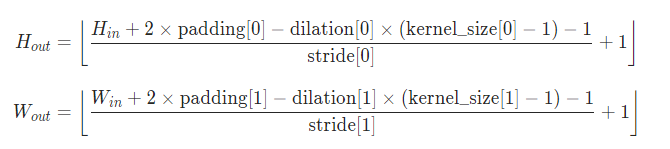
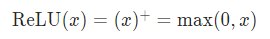
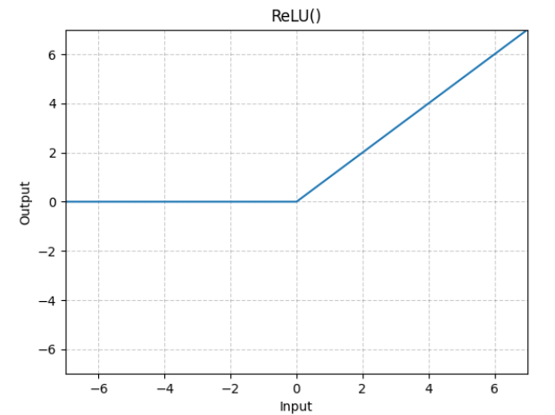
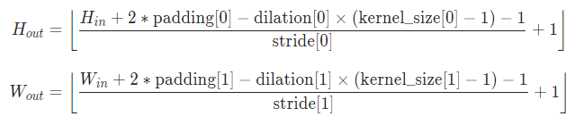
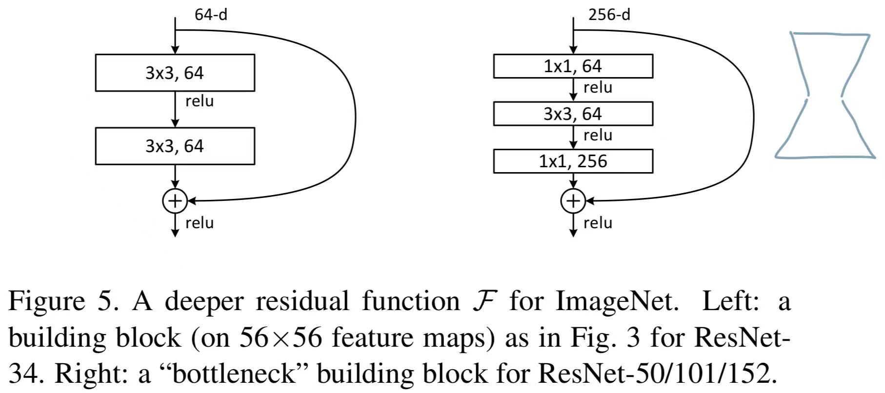
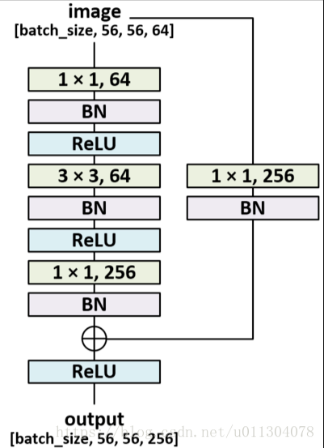

# python

## A. 基础知识

### 1. `()` 元组、 `[]`  列表、 `{}`  字典

- `()` 元组：有序的、**不可变的**、可索引的数据结构，可以包含任意类型的元素。**元组不可进行增删改，但是可以重新赋值。**

  ```python
  # 定义和赋值
  tuple = ()
  tuple = (1, '222', 3)
  
  # 访问元素
  ele = tuple[2]
  
  # 遍历
  for e in tuple:
      print(e)
  for e in range(len(tuple)):
      print(e)
  # 合并
  tup1 = (1, 2, 3, 4)
  tup2 = (5, 6, 7, 8)
  print(tup1 + tup2) 	# 输出：[1, 2, 3, 4, 5, 6, 7, 8]
  ```

- `[]` 列表：有序的、可变的、可索引的数据结构，可包含任意类型的元素。

  ```python
  # 定义和赋值
  list = []
  list = [1, 2, '333', [4, 5]]
  
  # 访问
  ele = list[3]
  
  # 增加元素
  list.append(6) 	# 在末尾增加新的元素
  list.extend([7, 8, [9, 10]]) 	# 在末尾增加多个元素
  list.insert(2, '222') 	# 在指定位置插入元素
  
  # 删去元素
  del list[2] 	# 删除指定索引的元素（可以是切片）
  list.pop(6) 	# 删除指定索引的元素，缺省为最后一个元素
  list.remove(6) 	# 删除指定元素的第一个匹配项
  list[7:8] = [] 	# 分片赋值实现删除
  
  # 排序
  list.sort()
  new_list = list.sorted() 	# 不改变原始列表，生成新的对象
  
  # 翻转
  list.reverse()
  
  ```

- `{}` 字典：有序的、可变的、可索引的数据结构，由键值对组成，可包含任意类型的元素。

  ```python
  # 定义和赋值
  dict = {
    'name': 'Jack',
    'age': 18
  }
  
  # 访问值
  name = dict['name']
  
  # 访问键
  key = dict.get('18', 0) 	# 键不存在，返回0
  
  # 遍历
  dict.items() 	# 将键值对按元组打包，数据类型为 dict_items
  for k, v in dict:
      print(k, v)
  
  # 插入
  dict.setdefault(key, default_key) 	# key 存在，返回对应的值；key 不存在，插入键值对
  ```

- `()` 元组 和 `[]` 列表的相互转换

  ```python
  tup = (2, 3, 7, 9)
  
  l = list(tup)
  print(l) 	# 输出[2, 3, 7, 9]
  
  t = tuple(l)
  print(t) 	# 输出(2, 3, 7, 9)
  
  # 字符串转为元组
  s = "abshwyw;123"
  print(tuple(s)) 	# 输出('a', 'b', 'y', 'w', ';', '1', '2', '3')
  ```

---

### 2. `assert` 断言

语法：

```
assert expression

# 等价于
if not expression:
    raise AssertionError
```

```
assert expression [, arguments]

# 等价于
if not expression:
    raise AssertionError(arguments)
```

举个例子

```
assert embedding_dim % num_heads == 0, 'embedding_dim % num_heads != 0' 	
# 输出：AssertionError: embedding_dim % num_heads != 0
```

---

### 3. `zip()`

Python 中的一个内置函数，用于将多个可迭代对象打包成一个元组序列。它的语法结构如下：

如果使用 `zip()` 函数将它们打包成一个元组序列，其中每个元素都是一个元组，包含 `a` 和 `b` 对应位置的元素：

```pythob
a = [1, 2, 3]
b = [4, 5, 6]

result = zip(a, b)
```

输出

```python
[(1, 4), (2, 5), (3, 6)]
```

---

### 4. `//` 和 `/`

`//` ：整数除法运算符，返回商的整数部分 。

`/` ：除法运算符，返回浮点数结果（双精度浮点数结果，最多 $16$ 位小数）。

```python
result = 7 // 3
print(result)  # 输出：2
```

### 5. 列表推导式 `list = [x for x in range(10)]`

```python
new_list = [expression for item in itreable if condition]
```

- `expression`：每个 item 都要执行的操作，包括表达式运算、函数等；
- `item`：可迭代对象中的每个元素；
- `iterable`：一个可迭代对象；
- `condition`： (optional) 过滤 item。

e.g.

```
# eg1
a = [i for i in range(10)]
print(a)  # a = [0, 1, 2, 3, 4, 5, 6, 7, 8, 9]

# eg2
letter = ['a+','b+','c+','d']
a = [i.replace('+','') for i in letter]
print(a)   # a = ['a', 'b', 'c', 'd']

# eg3
class Solution:
    def sumOfMultiples(self, n: int) -> int:
        return sum(x for x in range(1, n + 1) if x % 3 == 0 or x % 5 == 0 or x % 7 == 0)

# eg4 
def func(i):
    if i % 3 == 0:
        return str(i) + ' 能整除 3'
    if i % 5 == 0:
        return str(i) + ' 能整除 5'
    if i % 7 == 0:
        return str(i) + ' 能整除 7'
    return i

a = [func(i) for i in range(10)]
print(a) # a = ['0 能整除 3', 1, 2, '3 能整除 3', 4, '5 能整除 5', '6 能整除 3', '7 能整除 7', 8, '9 能整除 3']
```

<hr style="border:3px #6CA6CD double;">

### 6. set


```
st = set()

# 插入简单数据类型
st.add(key)

if key in st:
    pass

# 插入元组
st.add((key, value))

if (key, value) in st:
    pass
```

### 7.dict

1. dict.get

```python
dict.get(key, default=None)
```

- key -- 字典中要查找的键。
- default -- 如果指定键的值不存在时，返回该默认值。

2. dict.update

   ```python
   default.update(config['lr'])   # update：更新字典中的键值对（没有则添加，有则更新）
   
   ```

### 8. yield

用于生成器函数，暂停函数的执行，并将值返回给调用者，同时保持函数的状态，以便在以后的调用中继续执行。


e.g.

```
yield t, image[None], intrinsics 	# 返回一个包含三个值的元组，这些值将被生成器函数提供给调用者：
```

### 9. array[None] / tensor[None]

创建新维度，帮助你改变数据的形状，通常用于将单个数据示例转换为包含示例的批处理数据。

```
import numpy as np

# 创建一个一维数组
array = np.array([1, 2, 3, 4, 5])

# 使用 array[None] 添加一个新维度，将其转换为一个二维数组（批处理数据）
batch_array = array[None]

# batch_array 现在是一个形状为 (1, 5) 的二维数组
```

### 10. size 和 shape

Numpy：`shape` 描述数组的维度，返回一个元组

tensor：`size`描述张量的大小，返回一个tensor.size对象

### 11. `__all__`

指定公共接口，防止导入模块时导入不需要的或者私有的成员。

当通过 `from module import *` 导入一个模块中的方法时，只有 `__all__` 中指定的方法才能被导入。

如果模块没有定义 `__all__`，默认情况下，`from module import *` 将导入模块中**所有不以下划线开头**的方法。

## B. 类内函数

### 1. `__call__()`

一般用在类中，类似于在类中重载 () 运算符，使得类实例对象可以像调用普通函数那样，以 **“对象名()”** 的形式使用，即，可调用对象。

在 python 中，实际上 `a()` 可以理解为 `a.__call__()` 的缩写，`a()` 隐式调用了`a.__call__()` 。

PS. 在神经网络中，经常可以看见 `forward()` 函数，其实也是因为 ` torch.nn.Module` （一般作为网络的父类）隐式地在 `__call()__` 中调用了 `forward()` 函数，因此将网络的输入直接传入网络的对象中，就可以实现调用 `forward()`，如 `model(x)` 。

举个例子：

```python
class Test:
    def __init__(self, name, age):
        self.name = name
        self.age = age
    # 定义__call__方法
    def __call__(self,name,add):
        print("调用__call__()方法", name, age)

test = Test()
test("Jack",18)
```

输出：

```python
调用__call__()方法 Jack 18
```

---

### 2. `__getitem__()`

一般在类中定义，可以重载获取元素，让对象实现迭代功能。

- 迭代序列（列表、元组、字符串）

  ```python
  __getitem__(self, index)
  ```

- 迭代键值对（字典）

  ```
  __getitem__(self, key)
  ```

---

### 3. `__len__() `

一般在类中定义，使得对象可以实现 `len()` 函数。（ 当执行到 **len(对象)** 方法时，会自动调用对象的 `__len__()` 方法，表示用来求该对象的某个属性（变量）的元素的个数。如果类中没有定义 `__len__()`方法，就会报类型错误。）

```
class Test(object):
    def __init__(self):
        self.a = [1, 2, 3, 4]
    def __len__(self):
        return len(self.a)
```

---

### 4. `super(myClass, self).__init__() `

1. 直接继承

   不在子类中重写 `__init__()`，默认自动调用父类的 `__init__()`

   ```
   class Father():
       def __init__(self, name='Jack'):
           self.name = name
           
   class Son(Father):
       pass
   
   son = Son()
   print(son.name) 	# 输出: Jack
   ```

2. 重写 `__init__()`

   子类中重写 `__init__()`，会 **覆盖** 父类的 `__init__()`，因此此时 name 无法被访问。

   ```
   class Father():
       def __init__(self, name='Jack'):
           self.name = name
           
   class Son(Father):
       def __init__(self, age):
           self.age = age
       pass
   
   son = Son(18)
   print(son.name) 	# 输出AttributeError: 'Son' object has no attribute 'name'
   ```

   

3. 使用 `super().__init__()`

   继承父类的 `__init__()` 的同时，还在子类中增加了新的属性。

   ```
   class Father():
       def __init__(self, name='Jack'):
           self.name = name
           
   class Son(Father):
       def __init__(self, name, age):
           super(Son, self).__init__(name)
           self.age = age
       pass
   
   son = Son('Mack', 18)
   print(son.name, son.age) 	# 输出：Mack 18
   
   ```

---

## `self.__dict__.update(cfg)` 

这行代码用于将字典 `cfg` 中的键值对更新（或合并）到对象 `self` 的属性中。在这里，`self` 是一个对象，通常是某个类的实例，而 `cfg` 是一个字典对象。

具体来说，`self.__dict__` 是对象 `self` 的属性字典，包含了该对象的所有属性。`update()` 方法用于将字典 `cfg` 中的键值对添加到 `self.__dict__` 中，从而更新对象的属性。这意味着，`self` 的属性将包括来自 `cfg` 的键值对

<hr style="border:3px #6CA6CD double;">

## C. Numpy

==注意：np.array 是数组类型，和列表类型（[]）是有区别的，列表可以存储任何的对象，数据类型不同也可以，但是数组只能存储单一的数据类型。==

```python
gamma = np.power(
            self.cfg.ultimate_lr / self.cfg.initial_lr,
            1.0 / self.cfg.epoch_num)
```


### array + num

广播，将这个整数加到数组的每个元素之上。

### np.prod(array)：计算数组中所有元素的乘积。

```
import numpy as np

arr = np.array([1, 2, 3, 4])
product = np.prod(arr)

print(product)  # 输出 24，因为 1 * 2 * 3 * 4 = 24
```

### np.sqrt(array)：计算数组中每个元素的平方根

计算每个元素的平方根，并返回一个新的数组。

```
import numpy as np

arr = np.array([1, 4, 9, 16])
result = np.sqrt(arr)

print(result) 	# [1. 2. 3. 4.]
```


<hr style="border:3px #6CA6CD double;">

## D. glob


### 1. `glob.glob(pathname, (optional) recursive=False)`：搜索指定格式文件名

参数：

- `pathname`：包含通配符的路径模式，用于指定要搜索的文件和目录的规则
- `recursive`：可选参数，若 `recursive = true`，则会递归搜索子目录。

输出：

返回一个字符串列表，每个字符串代表一个匹配的文件或目录的完整路径

e.g.

```
import glob

files = glob.glob("/path/to/directory/*") 	# 返回该目录下所有文件的列表
txt_files = glob.glob("/path/to/directory/*.txt") 	# 返回该目录下所有 txt 文件的列表
all_files = glob.glob("/path/to/directory/**/*", recursive=True)
```

[golb.glob]: https://blog.csdn.net/shary_cao/article/details/122050756?ops_request_misc=&amp;request_id=&amp;biz_id=102&amp;utm_term=glob.glob&amp;utm_medium=distribute.pc_search_result.none-task-blog-2~all~sobaiduweb~default-3-122050756.142^v95^insert_down1&amp;spm=1018.2226.3001.4187	"golb.glob"

## logging

`logging` 模块保证 **在同一个 Python 解释器内（即时在多个模块中），多次调用`logging.getLogger('log_name')` 都会返回同一个 `logger` 实例**。

典型的多模块场景下使用 `logging` 的方式是在 main 模块中配置 `logging` ，然后在其他模块中直接通过 getLogger 获取 `Logger` 对象即可。

```
logger = logging.getLogger('global', logging.INFO)
```


## json

### 1. json.dumps

将 Python 对象（通常是字典）转换为 JSON 格式的字符串，并添加缩进格式以提高可读性的操作

```
json.dumps(cfg, indent=4)
```

### 2.  json.load

```
config = json.load(open(args.config))
```

从打开的文件对象中读取数据并将其解析为 Python 数据结构，通常是嵌套的字典和列表。这通常是一个字典或其他嵌套的数据结构，代表了配置文件中的信息。

## multiprocessing

Python 的 `multiprocessing` 模块用于实现多进程编程，允许你创建和管理多个并发运行的进程。以下是使用 `multiprocessing` 模块的一般步骤：

1. 导入 `multiprocessing` 模块：

```
pythonCopy code
import multiprocessing
```

1. 创建一个要在多个进程中执行的函数。这个函数通常是你希望并行执行的任务。函数可以接受参数并返回结果。
2. 在主程序中，使用 `multiprocessing.Process` 类创建并启动多个进程。例如：

```
pythonCopy codedef my_function(arg1, arg2):
    # 在此处执行你的任务
    pass

if __name__ == '__main__':
    processes = []
    for i in range(4):  # 你可以根据需要创建多个进程
        p = multiprocessing.Process(target=my_function, args=(arg1, arg2))
        p.start() 	# 启动进程
        processes.append(p)

    for p in processes:
        p.join() 	# 连接
```

在上述示例中，`my_function` 是你的任务函数，你可以向其中传递参数 `arg1` 和 `arg2`。`multiprocessing.Process` 用于创建新的进程，然后使用 `start()` 启动它们。最后，使用 `join()` 等待所有进程完成。

1. 通过 `if __name__ == '__main__'` 来包装主程序。这是为了确保在派生的子进程中执行多进程代码时不会导致递归启动。
2. 在主程序中，你可以使用 `multiprocessing.Queue`、`multiprocessing.Manager` 等工具来共享数据和通信。这些工具允许不同进程之间进行数据传递和共享。
3. 如果需要，可以使用 `multiprocessing.Pool` 来创建进程池，以更方便地管理一组并行执行的任务。
4. 最后，确保遵循多进程编程的最佳实践，以避免潜在的问题，如数据竞争和进程之间的同步问题。

`multiprocessing` 模块提供了丰富的功能，用于多进程编程，可以在并行计算、数据处理、任务分发等应用中发挥作用。

在 Python 中，你可以使用 `multiprocessing` 模块来创建共享变量和进行进程间通信。以下是一些常见的方式：

1. 使用 `multiprocessing.Value` 和 `multiprocessing.Array` 创建共享变量：

`multiprocessing` 模块提供了 `Value` 和 `Array` 来创建共享变量，它们可以在多个进程之间访问和修改。`Value` 用于创建单个值的共享变量，而 `Array` 用于创建数组类型的共享变量。

```
pythonCopy codeimport multiprocessing

# 创建一个共享整数
shared_value = multiprocessing.Value('i', 0)

# 创建一个共享数组
shared_array = multiprocessing.Array('d', [1.0, 2.0, 3.0])
```

在这里，'i' 表示整数，'d' 表示双精度浮点数。你可以根据需要选择合适的数据类型。

1. 使用 `multiprocessing.Queue` 进行进程间通信：

`Queue` 是一种用于进程间通信的数据结构，它允许一个进程将数据放入队列，另一个进程从队列中获取数据。这是一种非常常见的方式来在多个进程之间传递数据。

Queue的功能是将每个核或线程的运算结果放在队里中， 等到每个线程或核运行完毕后再从队列中取出结果， 继续加载运算。原因很简单, 多线程调用的函数不能有返回值, 所以使用Queue存储多个线程运算的结果

```
pythonCopy codeimport multiprocessing

# 创建一个队列
queue = multiprocessing.Queue()

# 向队列中放入数据
queue.put("Hello from Process 1")

# 从队列中获取数据
data = queue.get()
```

1. 使用 `multiprocessing.Pipe` 进行双向通信：

`Pipe` 是一种双向通信管道，允许两个进程之间进行双向通信。一个进程可以发送消息到管道，另一个进程可以接收并回复。

```
pythonCopy codeimport multiprocessing

# 创建一个管道
conn1, conn2 = multiprocessing.Pipe()

# 在一个进程中发送消息
conn1.send("Hello from Process 1")

# 在另一个进程中接收消息
data = conn2.recv()

# 回复消息
conn2.send("Hello back from Process 2")

# 在第一个进程中接收回复
response = conn1.recv()
```

这些是一些常见的方式来创建共享变量和进行进程间通信。你可以根据你的具体需求选择合适的方式。在多进程编程中，确保适当的同步和互斥是非常重要的，以避免数据竞争和进程之间的问题。

<hr style="border:5px #0D0D0D solid;">


# pytorch

## A. torch

### 1. 常见函数

#### a.  `torch.from_numpy(array)`： 将 numpy 转换为 tensor

```
import numpy as np
import torch
inp = np.random.randint(0, 256, size=(1920, 1200, 3), dtype=np.uint8) 	# 随机生成一个 1920x1200x3 的数组
inp = torch.from_numpy(inp).float().permute((2, 0, 1)).unsqueeze(dim = 0) 	# 将数组转换为 tensor，再转换为 float（否则内部卷积时类型会不匹配），再交换维度，再增加一个维度。
```

#### b. `torch.permute((2, 0, 1))`：重新排序维度

```python
import numpy as np
import torch
inp = np.random.randint(0, 256, size=(1920, 1200, 3), dtype=np.uint8) 	# 随机生成一个 1920x1200x3 的列表
inp = torch.from_numpy(inp).float().permute((2, 0, 1)).unsqueeze(dim = 0) 	# 将列表转换为 tensor，再转换为 float（否则内部卷积时类型会不匹配），再交换维度，再增加一个维度。
```

#### c. `torch.unsqueeze(dim = i)`：在第 i 维增加一个为 1 的维度

```
import numpy as np
import torch
inp = np.random.randint(0, 256, size=(1920, 1200, 3), dtype=np.uint8) 	# 随机生成一个 1920x1200x3 的列表
inp = torch.from_numpy(inp).float().permute((2, 0, 1)).unsqueeze(dim = 0) 	# 将列表转换为 tensor，再转换为 float（否则内部卷积时类型会不匹配），再交换维度，再增加一个维度。
```

#### d. `torch.squeeze()`

降维，但是智能压缩维数为 1 的维度。

```python
x = torch.zeros(2, 1, 2, 1, 2)
x.size() 	# torch.Size([2, 1, 2, 1, 2])

y = torch.squeeze(x)         # 压缩维数为 1 的维度
y.size() 	# torch.Size([2, 2, 2])
```

### e. 


#### f. `torch.device()`：可以用来为 torch 分配设备

```
torch.device('cuda:0')
# device(type='cuda', index=0)
torch.device('cuda', 0)
# device(type='cuda', index=0)

torch.device('cpu')
# device(type='cpu')
torch.device('mps')
# device(type='mps')
torch.device('cuda')  # current cuda device
# device(type='cuda')

# 为 torch 分配设备
self.device = torch.device('cuda:0' if self.cuda else 'cpu') 	# 如果 self.cuda 为 True，则将设备设置为 cuda:0，否则将设备设置为 CPU。这个设备将用于分配张量和执行计算操作。
self.net = self.net.to(self.device)
```


### g. `torch.arange(start, end, step=1)` - 创建一维张量

```python
torch.arange(start, end, step=1, dtype=None, layout=torch.strided, device=None, requires_grad=False)
```

**Parameters：**

- `start` 是起始值。
- `end` 是结束值（**不包括在生成的张量中**）。
- `step` 是步长，默认为 1。
- `dtype` 是生成张量的数据类型。
- `layout` 是张量的布局。
- `device` 是张量所在的设备。
- `requires_grad` 指定是否需要梯度。

**e.g.**

```
import torch

# 生成从 0 到 9 的一维张量
tensor = torch.arange(10)
print(tensor)
# tensor([0, 1, 2, 3, 4, 5, 6, 7, 8, 9])
```


### e. `torch.meshgrid(x, y)` - 生成一个 2 维网格的坐标矩阵（张量）

```
torch.meshgrid(*tensors, indexing='ij')
```

**Parameters：**

- `*tensors` 是一系列张量，每个张量表示一个维度上的坐标值。
- `indexing` 参数指定生成网格时的索引方式，可以是 'xy' 或 'ij'。默认是 'ij'，即使用矩阵的行和列索引。

**e.g.**

```
import torch

# 生成 2D 网格
x = torch.arange(0, 3)
y = torch.arange(0, 2)
grid_x, grid_y = torch.meshgrid(x, y)

print(grid_x)
#tensor([[0, 0],
#        [1, 1],
#        [2, 2]])

print(grid_y)
#tensor([[0, 1],
#        [0, 1],
#        [0, 1]])
```


### e. `torch.stack(tensors, dim=0)` - 按指定维度堆叠张量

```python
torch.stack(tensors, dim=0, out=None) -> Tensor
```

**Parameters：**

- `tensors` 是要堆叠的张量序列（可以是一个元组或列表）。
- `dim` 是指定堆叠维度的参数。在指定维度上，输入张量的大小必须是一致的。
- `out` 是可选的输出张量，如果提供，则结果将被写入此张量。

**e.g.**

```
import torch

# 两个张量
tensor1 = torch.tensor([1, 2, 3]) 	# [3]
tensor2 = torch.tensor([4, 5, 6]) 	# [3]

# 在新维度上堆叠
stacked_tensor = torch.stack((tensor1, tensor2), dim=0)

print(stacked_tensor) 	# [2, 3]
#tensor([[1, 2, 3],
#        [4, 5, 6]])
```

```
import torch

w = 5
h = 5
grid_x, grid_y = torch.meshgrid([torch.arange(w), torch.arange(h)])

# 将xy两部分的坐标拼起来：[5, 5, 2]
grid_xy = torch.stack([grid_x, grid_y], dim=-1).float()
# tensor([[[0., 0.],
#          [1., 0.],
#          [2., 0.],
#          [3., 0.],
#          [4., 0.]],

#         [[0., 1.],
#          [1., 1.],
#          [2., 1.],
#          [3., 1.],
#          [4., 1.]],

#         [[0., 2.],
#          [1., 2.],
#          [2., 2.],
#          [3., 2.],
#          [4., 2.]],

#         [[0., 3.],
#          [1., 3.],
#          [2., 3.],
#          [3., 3.],
#          [4., 3.]],

#         [[0., 4.],
#          [1., 4.],
#          [2., 4.],
#          [3., 4.],
#          [4., 4.]]])
```


### e. 

### e. 

### e. 

### e. 

### e. 

### e. 

<hr style="border:1px #6CA6CD double;">

### 2. torch.Tensor

#### a. `torch.Tensor.item()`

#### b. `torch.Tensor.float()` - 将张量转换为浮点型

为了便于参数更新、梯度计算等操作，最好将所有相关的张量都转换为浮点型。

**e.g.**

```
def create_grid(self, fmp_size):
    # 生成一个二维网格
    ws, hs = fmp_size

    grid_x, grid_y = torch.meshgrid(torch.arange(hs), torch.arange(ws)).float()

    grid_xy = torch.stack(grid_x, grid_y)

    grid_xy = grid_xy.view(-1, 2)

    return grid_xy
```


#### c. `torch.Tensor.device()`：返回该 Tensor 所在的设备

#### d. `torch.Tensor.to()`：执行 tensor 数据类型或设备转换。

```
self.cuda = torch.cuda.is_available()
        self.device = torch.device('cuda:0' if self.cuda else 'cpu')
# 如果 self.cuda 为 True，则将设备设置为第一个可用的 CUDA 设备（通常命名为 "cuda:0"），否则将设备设置为 CPU。这个设备将用于分配张量和执行计算操作。

self.net = self.net.to(self.device)
```

### e. `torch.Tensor.view()`：一个高级指针，快速操作，改变张量形状

这是一个指向原张量的指针，所以`view` 返回的张量与原始张量共享底层数据，修改一个张量会影响另一个。

在使用 `view` 时，要确保新形状与原始张量包含的元素数量相同，否则会导致错误。另外，**`view` 不会改变底层数据的顺序，而只是重新组织了张量的维度**。如果你需要在张量的拷贝上执行形状变化，可以使用 `torch.reshape`。

```
torch.Tensor.view(*shape) -> Tensor
```

**Parameters：**

- `shape` 是一个元组，指定了新张量的形状。

**e.g.**

```
t = torch.rand(4, 4)
b = t.view(2, 8) 	# 改变形状
t.storage().data_ptr() == b.storage().data_ptr() 	# t 和 b 指向同一存储空间
#true

# 修改原 tensor 或者 view 都会造成数据修改
b[0][0] = 3.14
t[0][0]
# tensor(3.14)

t[1][2] = 3.14
b[1][2]
# tensor(3.14)
```


<hr style="border:3px #6CA6CD double;">

### 3. torch.utlis

#### a. `torch.cuda.is_available()`：检查当前系统是否可用 CUDA

```python
self.cuda = torch.cuda.is_available()
        self.device = torch.device('cuda:0' if self.cuda else 'cpu')
# 如果 self.cuda 为 True，则将设备设置为第一个可用的 CUDA 设备（通常命名为 "cuda:0"），否则将设备设置为 CPU。这个设备将用于分配张量和执行计算操作。
```

#### b. `torch.utlis.data.Dataset`：构建一个可迭代的数据集

构建自己的数据集时，要继承该类，并进行子类化。具体来讲，主要是重载 `__getitem__()` 成员函数。

```
class DataSets(Dataset):
    def __init__(self, cfg, anchor_cfg, num_epoch=1):
        super(DataSets, self).__init__()
        
    def __len__(self):
        return self.num
    
    def __getitem__(self, index, debug=False):
        ...
        return 一个 data
```

#### c. `torch.utlis.model_zoo`：从指定的 URL 下载预训练模型参数

从指定的 URL 下载预训练模型参数，便于将预训练权重加载到模型中。

新版本的 pytorch 中，已经被 `torch.hub.load` 取代。

```
import torch
from torch.utils.model_zoo import load_url

# 定义一个模型
model = ...

# 定义预训练模型的 URL
model_url = "https://download.pytorch.org/models/resnet50-19c8e357.pth"

# 下载预训练模型的参数
pretrained_dict = load_url(model_url)

# 将预训练权重加载到模型中
model.load_state_dict(pretrained_dict)
```


### 初始化模型权重

```
def init_weights(model, gain=1):
    for m in model.modules():
        if isinstance(m, nn.Conv2d):
            nn.init.xavier_uniform_(m.weight, gain)
            if m.bias is not None:
                nn.init.constant_(m.bias, 0)
        elif isinstance(m, nn.BatchNorm2d):
            nn.init.constant_(m.weight, 1)
            nn.init.constant_(m.bias, 0)
        elif isinstance(m, nn.Linear):
            nn.init.xavier_uniform_(m.weight, gain)
            if m.bias is not None:
                nn.init.constant_(m.bias, 0)
```

### 导入预训练权重

```
load_state_dict(torch.load(
                net_path, map_location=lambda storage, loc: storage))
```


### net.parameters(),

### optim.SGD

```
self.optimizer = optim.SGD(
            self.net.parameters(),
            lr=self.cfg.initial_lr,
            weight_decay=self.cfg.weight_decay,
            momentum=self.cfg.momentum)
```


### `self.lr_scheduler = ExponentialLR(self.optimizer, gamma)`

## `torch.utils.data.Dataset`

如果要自定义自己的数据集，需要定义一个继承 `torch.utils.data.Dataset` 的数据类，然后在数据类中重写 `__init__()` 和 `__len__(self) `和 `__getitem__(self, index)` 这三个方法。

重写 `__init__()` 和 `__len__() `和 `__getitem__()` 这三个方法可以自定义地读取数据，比如从 .csv 文件中读取，或是从 .txt 文件中读取数据路径，然后再在 `__getitem__()` 中返回打开的图像等操作。

```
import torch.utils.data
import torch

class DatasetTrain(torch.utils.data.Dataset): 	# 专门读取 train 的图像，可以在 __getitem__() 直接加入图像预处理
    def __init__(self, dataset_data_path, data_type='train'): 
        # 图像路径根目录
        self.img_dir =  os.path.join(dataset_data_path,"JPEGImages")     # original image dir
        self.label_dir = os.path.join(dataset_data_path,"SegmentationClass")  # mask image dir
        self.split_dir = os.path.join(dataset_data_path,"ImageSets","Segmentation")    # split_dir

        # image 初始 大小
        self.img_h = 300
        self.img_w = 300
        
        # image resize 大小
        self.new_img_h = 320
        self.new_img_w = 320
 		
        # 读取 train 的图像索引，并将相关信息存储在 examples 中
        self.examples = []
        with open(os.path.join(self.split_dir,data_type + ".txt"), "r") as f:
            lines = f.read().splitlines()
            for _, line in enumerate(lines):
                _image = os.path.join(self.img_dir,line + ".jpg")
                _mask = os.path.join(self.label_dir, line + ".png")
                assert os.path.isfile(_image)
                assert os.path.isfile(_mask)
                example = {}
                example["img_path"] = _image
                example["label_img_path"] = _mask
                example["img_id"] = line
                self.examples.append(example)
        
        self.num_examples = len(self.examples)
 
    def __getitem__(self, index): 	# 打开图像
        example = self.examples[index]
        img_id = example['img_id']
 
        img_path = example["img_path"]
        img = cv2.imread(img_path, -1)  # shape: [H, W, C]
        img = cv2.resize(img, (self.new_img_w, self.new_img_h), interpolation=cv2.INTER_NEAREST)
 
        label_img_path = example["label_img_path"]
        label_img = cv2.imread(label_img_path, cv2.IMREAD_GRAYSCALE)    # shape: [H, W]
        label_img = cv2.resize(label_img, (self.new_img_h, self.new_img_w), interpolation=cv2.INTER_NEAREST)    # shape: [H, W]
        ret, label_img = cv2.threshold(src=label_img, thresh=0, maxval=1, type=cv2.THRESH_BINARY)   # 将大于0的像素值都设为1（作为前景）
        
        ########################################################################
        # 图像预处理
        # 标准化图像
        # 转换为 tensor
        ########################################################################
        return (img, label_img, img_id)
 
    def __len__(self):
        return self.num_examples

```


---

## `torch.utils.data.DataLoader`

对数据进行 batch 的划分，按 batch 返回可迭代对象。

```python
CLASS torch.utils.data.DataLoader(dataset, 
                                  batch_size=1, 
                                  shuffle=None, 
                                  sampler=None, 
                                  batch_sampler=None, 
                                  num_workers=0, 
                                  collate_fn=None, 
                                  pin_memory=False, 
                                  drop_last=False, 
                                  timeout=0, 
                                  worker_init_fn=None, 
                                  multiprocessing_context=None, 
                                  generator=None, 
                                  *, 
                                  prefetch_factor=None, 
                                  persistent_workers=False, 
                                  pin_memory_device='')
```

<u>**parameters**</u>

> - **dataset** ([*Dataset*](https://pytorch.org/docs/master/data.html#torch.utils.data.Dataset)) – 传入的数据集.
> - **batch_size** ([*int*](https://docs.python.org/3/library/functions.html#int)*,* *optional*) – batch 的大小 (default: `1`).
> - **shuffle** ([*bool*](https://docs.python.org/3/library/functions.html#bool)*,* *optional*) – 是否在每个 epoch 开始时，随机排序数据 (default: `False`).
> - **num_workers** ([*int*](https://docs.python.org/3/library/functions.html#int)*,* *optional*) – how many subprocesses to use for data loading. `0` means that the data will be loaded in the main process. (default: `0`)
> - **collate_fn** (*Callable**,* *optional*) – 处理 data load 的进程数（0 表示由主进程处理）.
> - **drop_last** ([*bool*](https://docs.python.org/3/library/functions.html#bool)*,* *optional*) – 如果最后一个 batch 的小于 batch-size，设为 true 则抛弃最后这个 batch，设为 false 则不抛弃，只是最后这个 batch 会小一点 (default: `False`). 

举个例子

```
# 写在 dataset 包的 __init__.py 文件中
def gen_data_loader(args):
    if args.dataset == 'table_tennis':
        # 首先创建数据集
        train_dataset = table_tennis.DatasetTrain(dataset_data_path=os.path.join(args.data_path, args.dataset))
        val_dataset = table_tennis.DatasetVal(dataset_data_path=os.path.join(args.data_path, args.dataset))
        test_dataset = table_tennis.DatasetTest(dataset_data_path=os.path.join(args.data_path, args.dataset))
        # 然后创建 data loader
        train_loader = torch.utils.data.DataLoader(dataset=train_dataset, batch_size=args.batch_size, shuffle=True, num_workers=8)
        val_loader = torch.utils.data.DataLoader(dataset=val_dataset, batch_size=args.batch_size, shuffle=False, num_workers=8)
        test_loader = torch.utils.data.DataLoader(dataset=test_dataset, batch_size=args.batch_size, shuffle=False, num_workers=8)
        return train_loader, val_loader, test_loader
    elif args.dataset == 'badminton':
        #...
```

**==ATTENTION==**

- 为什么创建训练集的 dataloader 时，一般将 shuffle 设为 true，而在验证集和测试集中，shuffle 一般设为 false？
  - 训练集的 shuffle 设为 true 的原因：
    - shuffle = True 可以使得模型 ==**在每个 epoch 开始时，重新排序数据 **== ，使得模型可以在一定 epoch 数量时，探索更多种数据分布的可能。如果不在每个 epoch 开始时重新排序数据，那么每个 epoch 对应的 batch都是相同的数据分布，由于神经网络强大的拟合能力，网络可能学习到每个 batch 的组合形式，从而影响模型的泛化能力，甚至过拟合。而在每个 epoch 开始时重新排序数据，可以减小数据顺序对模型学习的影响，提高模型的学习效率。
  - 验证集和测试集的 shuffle 设为 false 的原因：
    - 验证集的目的是选择最好的模型，测试集的目的是评估模型的泛化能力，所以验证集和测试集并不需要在每个 epoch 开始时重新排序数据，相反的，每个 epoch 的数据分布相同，才能在一次训练中评价模型每个 epoch 后的训练效果。另外，测试集的数据顺序可能与实际应用场景中的顺序一致，重新排序数据反而影响对模型在实际场景中表现的评估的准确性。

- ==**打乱两次数据集**== 通常用于机器学习中的数据处理和模型训练中。
  - 首先，在将数据分成训练集、验证集和测试集之前，通常需要对整个数据集进行第一次随机打乱。这是因为原始数据集可能具有某些固有的顺序和模式，这可能会对模型的训练和评估产生负面影响。通过随机打乱，可以消除数据集中的这些顺序和模式，使得数据更加随机和均匀地分布，从而更好地训练和评估模型。
  - 其次，训练神经网络等机器学习模型时，为了防止模型过度拟合，通常需要在每个 epoch 之前对训练集进行第二次随机打乱。这是因为如果在每个训练周期中使用相同的顺序和模式来遍历训练数据，**模型可能会记住数据的顺序和模式，从而导致过度拟合** 。通过在每个 epoch 之前对训练集进行随机打乱，可以避免这种情况的发生，提高模型的泛化能力。

<hr style="border:3px #6CA6CD double;">

## 4. `torch.nn`

### a. `torch.nn.Conv2d()`：2d 图像上卷积

```
torch.nn.Conv2d(in_channels, out_channels, kernel_size, stride=1, padding=0, dilation=1, groups=1, bias=True, padding_mode='zeros', device=None, dtype=None)
```

**shape**：

- input：[N, Cin, Hin, Win]
- output：[N, Cout, Hout, Wout]



**参数**：

- **num_features**：通道数量。
- **eps**：添加在分母上的极小值，保证数值稳定
- **momentum**：用于计算 running_mean 和 running_var。
- affine：布尔值，默认为true。affine=true 表示该模块有可学习的仿射参数。
- track_running_stats：布尔值，默认为 false。track_running=false 表示该模块跟踪运行均值和方差。

**e.g.**

### b. `torch.nn.BatchNorm2d()`：空间批归一化

学习每一个 batch 的均值和标准差。

```
torch.nn.BatchNorm2d(num_features, eps=1e-05, momentum=0.1, affine=True, track_running_stats=True, device=None, dtype=None)
```

**shape**：（不改变 shape）

- input：[N, C, H, W]
- output：[N, C, H, W]

**参数**：

- **num_features**：通道数量。
- **eps**：添加在分母上的极小值，保证数值稳定
- **momentum**：用于计算 running_mean 和 running_var。
- affine：布尔值，默认为true。affine=true 表示该模块有可学习的仿射参数。
- track_running_stats：布尔值，默认为 false。track_running=false 表示该模块跟踪运行均值和方差。

**e.g.**

```
self.conv1 = nn.Sequential(
            nn.Conv2d(3, 96, 11, 2),
            nn.BatchNorm2d(96, 1e-6, 0.05),
            nn.ReLU(inplace=True),
            nn.MaxPool2d(3, 2))
```


### <font color=brown size=5>c. `torch.nn.RELU()`</font>

```
torch.nn.ReLU(*inplace=False*)
```





**shape**：

- input：*
- output：*

**e.g.**

```
self.conv1 = nn.Sequential(
            nn.Conv2d(3, 96, 11, 2),
            nn.BatchNorm2d(96, 1e-6, 0.05),
            nn.ReLU(inplace=True),
            nn.MaxPool2d(3, 2))

```

### <font color=brown size=5>d. `torch.nn.MaxPool2d()`：最大池化</font>

```
torch.nn.MaxPool2d(kernel_size, stride=None, padding=0, dilation=1, return_indices=False, ceil_mode=False)
```

**shape**：

- input：[N, C, H~in~, W~in~]

- output：[N, C, H~out~, W~out~]

  

**参数**：

- **kernel_size (int / tuple[int, int])**：最大池化窗口大小。
- **stride**：默认为kernel_size。最大池化的步距。
- padding
- dilation
- return_indices
- ceil_mode

**e.g.**

```
self.conv1 = nn.Sequential(
            nn.Conv2d(3, 96, 11, 2),
            nn.BatchNorm2d(96, 1e-6, 0.05),
            nn.ReLU(inplace=True),
            nn.MaxPool2d(3, 2))
```


### e. `torch.nn.Module`

- `nn.Module`  是 **所有网络结构层次（模块）的父类**，当你要实现一个自己的 **层（模块）** 的时候，必须要继承这个类。

- 使用 `nn.Module` ，可以将网络分成各个模块，模块中也可以嵌套模块。它会对神经网络的内部参数进行一个有效的管理。

- `__init__` 和 `forward` 方法必须重写。

**e.g.**

```
import torch.nn as nn
import torch.nn.functional as F

class moduleA(nn.Module):
    def __init__(self):
        super().__init__()
        pass
    def forward(self, x):
        pass
    
class Model(nn.Module):
    def __init__(self):
        super().__init__()
        self.conv1 = nn.Conv2d(1, 20, 5)
        self.conv2 = nn.Conv2d(20, 20, 5)
        self.A = moduleA()

    def forward(self, x):
        x = F.relu(self.conv1(x))
        x = F.relu(self.conv2(x))
        return self.A(x)
```

#### 成员函数

##### i). `eval()`

将 module 设置为评估模式（不是所有的模块都会被影响，只有那些参与梯度下降的才会被影响）

`self.eval()` 等价于 `self.train(False)`。

##### ii). `load_state_dict(state_dict, strict=True)`

将 `state_dict` 中所有的参数缓存都拷贝给当前 `module`。

通过加载预训练模型的状态字典，可以使用在其他任务上预训练的模型参数作为当前任务的起点，加速模型的收敛或者提高性能。

iii). modules()

可以枚举所有模块。

### f. `torch.nn.ModuleList` 

存储 `Module` 的列表（`List`）。

ModuleList 和 Sequential 的区别：

- nn.Sequential 内部实现了 forward 函数，因此可以直接进行前向传播；而 nn.ModuleList 内部没有实现的 forward 函数。
- nn.Sequential 可以用 OrderedDict 对每层重命名，nn.ModuleList 不行。
- nn.Sequential 按顺序串联模块，必须确保上一个模块的输出符合下一个模块的输入；nn.ModuleList 只是将不同模块存储在一起，没有先后顺序要求。

### g. `torch.nn.Sequential`

`Sequential` 允许我们构建 **序列化** 的模块，也就是说，我们可以通过数字访问第几层，可以通过parameters、weights等参数显示网络的参数和权重。

```
# Using Sequential to create a small model. When `model` is run,
# input will first be passed to `Conv2d(1,20,5)`. The output of
# `Conv2d(1,20,5)` will be used as the input to the first
# `ReLU`; the output of the first `ReLU` will become the input
# for `Conv2d(20,64,5)`. Finally, the output of
# `Conv2d(20,64,5)` will be used as input to the second `ReLU`
model = nn.Sequential(
          nn.Conv2d(1,20,5),
          nn.ReLU(),
          nn.Conv2d(20,64,5),
          nn.ReLU()
        )

# Using Sequential with OrderedDict. This is functionally the
# same as the above code
model = nn.Sequential(OrderedDict([
          ('conv1', nn.Conv2d(1,20,5)),
          ('relu1', nn.ReLU()),
          ('conv2', nn.Conv2d(20,64,5)),
          ('relu2', nn.ReLU())
        ]))
```


<hr style="border:1px #cccccc dotted;">

<hr style="border:3px #6CA6CD double;">

## 5. torch.multiprocessing

0.导入模块

```
import torch
import torch.multiprocessing as mp
```

**1. torch.multiprocessing.set_start_method('spawn')** 设置多进程的启动方式

在创建任何进程前调用一次，设置多进程。

**2.torch.multiprocessing.Process(target=func, args=(...))** 创建并启动多个进程进行函数 func


e.g.

```
import torch
import torch.multiprocessing as mp

if mp.get_start_method(allow_none=True) is None:
    mp.set_start_method('spawn')

def my_function(arg1, arg2):
    # 在此处执行你的任务
    pass

if __name__ == '__main__':
    processes = []
    for i in range(4):  # 你可以根据需要创建多个进程
        p = mp.Process(target=my_function, args=(arg1, arg2))
        p.start()
        processes.append(p)

    for p in processes:
        p.join()
```

**3.torch.share_memory_()**

将张量标记为共享内存张量，共享内存张量可以在多个进程之间共享，用于多进程并行计算。


# DeepLearning 常见结构

## 网络内部结构

### 全局平均池化层

在全局平均池化层中，对每个通道的特征图取平均值，得到一个单一的值。这个操作的好处在于它减少了特征图的空间维度，同时保留了每个通道的重要信息。全局平均池化的作用有几个方面：

- **降维：** 减少了特征图的空间尺寸，从而减小了模型的参数数量，降低了计算成本。
- **平均信息：** 通过取平均值，保留了每个通道的整体信息，有助于减轻过拟合。

这一层常常出现在卷积神经网络（CNN）的最后一层，用于将最终的特征图映射为一个固定长度的向量，以供分类器使用。

### 全连接层

全连接层是传统神经网络结构中的一部分，它的神经元与前一层的所有神经元相连接。全连接层的作用包括：

- **特征整合：** 将前面层的所有特征都考虑在内，用于生成最终的输出。
- **非线性映射：** 通过激活函数引入非线性映射，增加网络的表达能力。

全连接层常常出现在神经网络的末尾，用于将前面层的特征映射到最终的输出类别。然而，在深度卷积神经网络中，由于全连接层的参数量巨大，可能导致过拟合和计算负担，因此在一些网络设计中，全连接层被替代或减少。

ps. 可以先用一个全局平均池化层减少参数量，再用一个带softmax的全连接层进行分类。

## BottleNeck - 利用 1x1 卷积 降维减少参数量

网络深度增加可以提高网络性能，但是参数量也会变大。

**BottleNeck** 可以在加深网络的同时，减少参数量。**加深网络是主要目的。**





#### 代码

```
class BottleNeck(nn.Module):
    '''
    size：尺寸不变
    channel：inplanes -> planes -> planes -> planes * 4
    kernel: 1x1 -> 3x3 -> 1x1
    '''
    def __init__(self, inplanes, planes, stride=1, downsample=None, dilation=1):
        super(BottleNeck, self).__init__()
        self.conv1 = nn.Conv2d(inplanes, planes, kernel_size=1, bias=False)
        self.bn1 = nn.BatchNorm2d(planes)   # 对每个通道进行归一化
        padding = 2 - stride
        assert stride==1 or dilation==1, "stride and dilation must have one equals to zero at least"
        if dilation > 1:
            padding = dilation
        self.conv2 = nn.Conv2d(planes, planes, kernel_size=3, stride=stride, padding=padding, bias=False, dilation=dilation)
        self.bn2 = nn.BatchNorm2d(planes)
        self.conv3 = nn.Conv2d(planes, planes * 4, kernel_size=1, bias=False)
        self.bn3 = nn.BatchNorm2d(planes * 4)
        self.relu = nn.ReLU(inplace=True)
        self.downsample = downsample
        self.stride = stride
        
                
    def forward(self, x):
        identity = x    # identity mapping
        
        out = self.conv1(x)
        out = self.bn1(out)
        out = self.relu(out)
        
        out = self.conv2(out)
        out = self.bn2(out)
        out = self.relu(out)
        
        out = self.conv3(out)
        out = self.bn3(out)
        
        if self.downsample is not None:
            identity = self.downsample(x)

        # if out.size() != identity.size():
        #     print(out.size(), identity.size())
        
        out += identity
        
        out = self.relu(out)
        
        return out
```


## ResNet

### 重点

- ResNet 主要参考了 VGG19 网络，在 VGG19 的基础上通过短路连接加上了残差单元。
- 网络越深，效果越差，主要是因为出现了梯度消失，离 loss 越远的层，在反向椽笔的时候梯度越小，因此越难更新。ResNet 依靠 Shortcut 和 BottleNeck 解决了这个问题。