# 背景知识

## 计算机硬件组成

计算机硬件组成：输入设备、输出设备、控制器、运算器、存储器

- CPU：运算器 + 控制器

- 存储器 ：内存（临时存储） + 硬盘（永久存储）

- 输入设备：鼠标 + 键盘

- 输出设备：显示器 + 打印机

## 计算机软件

### 系统软件

操作系统（windows、linux、mac）

### 应用软件

可以被分为两种形式，

- C/S：client/server 客户端/服务器端

  在用户本地有一个客户端程序，在远程有一个服务器端程序（QQ、微信）

- B/S：browser/server浏览器/服务器端

  只需要一个浏览器，用户通过不同网址，访问不同的服务器端程序（京东、淘宝）

## 计算机语言

机器语言：0/1代码

汇编语言

高级语言

## 人机交互

- 图形化界面

- 命令行

  （DOS命令行）win + r -> cmd:

  ```shell
  shutdown -s -t 300 	# 在300s后关机
  shutdown -a 	# 取消关机任务
  
  dir 	# 展示当前目录下文件和文件夹
  cd/ 	# 直接返回盘目录
  cls 	# 清屏
  exit 	# 退出命令行
  ```

## Java版本

### Java SE：

Java语言的标准版，用于桌面应用开发，是其他两个版本的基础。

桌面应用：用户只要打开程序，程序的界面会让用户在最短的时间内找到他们需要的功能，同时主动带领用户完成他们的工作并得到最好的体验。

### Java ME：

Java语言的小型版，用于嵌入式消费类电子设备。

### Java EE：

Java语言的企业版，用于Web方向的网站开发。

网页：通过浏览器将 **数据展示** 在用户面前，跟后台服务器没有交互

网站：通过跟 **后台服务器的交互** ，将查询到的真实数据再通过网页展示出来。网站 = 网页 + 后台服务器。

## Java跨平台工作原理

平台：操作系统（windows、linux、mac）

跨平台：Java程序可以在任意操作系统上运行。

Java跨平台工作原理：Java本质上是运行在操作系统的 **JVM虚拟机** 上，只要操作系统安装了 JVM虚拟机 即可。**ps. JVM虚拟机本身不允许跨平台，允许跨平台的是Java程序。**

## JRE 和 JDK

JRE： Java Runtime Environment，指Java运行环境，**包括 JVM虚拟机**以及 Java 核心类库（一个java文件就是一个类，类库指存放多个 java 文件的仓库）。

JDK：Java Development Kit，是Java语言的软件开发工具包，内部包含了 **JRE** 和代码的 **编译工具** 和 **运行工具** 等。

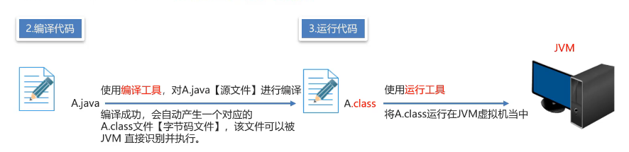

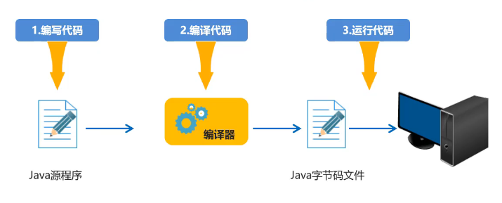

### JRE、JDK、JVM的作用

- 编写代码的过程中，需要使用 JRE 中 Java已经写好的代码
- 编译代码的过程中，需要使用 JDK 中的翻译工具。
- 运行代码的过程中，需要使用 JDK 中的运行工具。
- 代码需要运行在 JVM 当中。

### JDK、JRE、JVM的关系

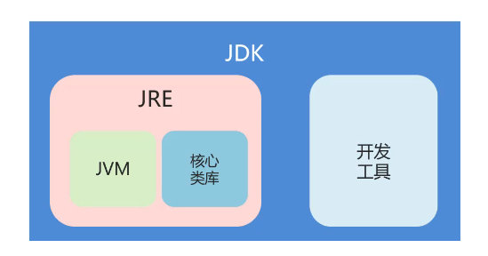

## JDK 安装

bin 目录下存放了 JDK 的各种工具命令，javac 和 java 就放在这个目录里。


## 使用 javac 和 java 实现 HelloWorld

ATTENTION: 要使用 javac 和 java 编译和执行 java 文件时，java 文件必须和他们在同一目录下。

javac：编译工具，命令行执行

```shell
javac xxx.java
```

java：运行工具，命令行执行

```
java xxx
```

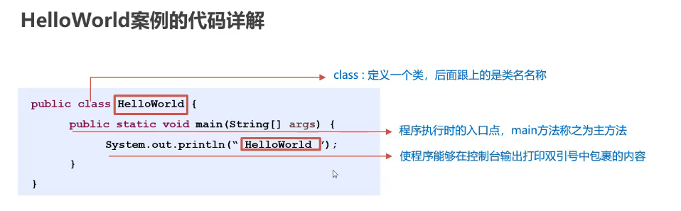

**ps. 若代码中没有 main 方法，则无法运行。**


## path 环境变量

能够在任意目录下访问 bin 目录下的 javac 和 java。

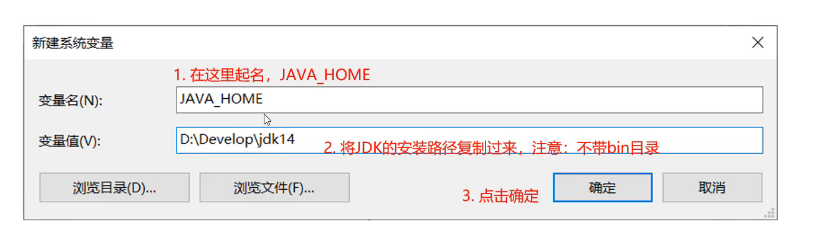

**ps. 不一定要叫 JAVA_HOME，但是在某些软件中只能识别 JAVA_HOME，所以命名为 JAVA_HOME 比较方便。**

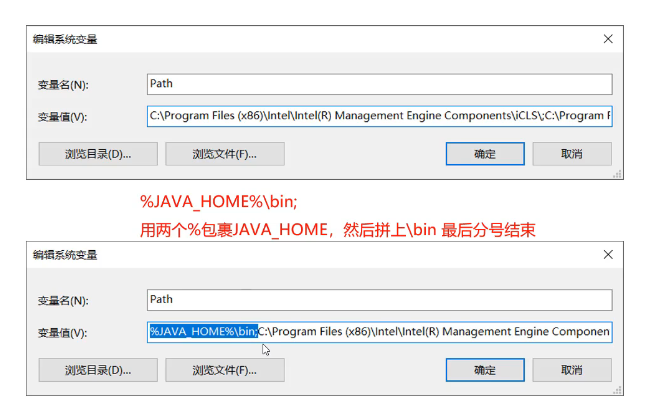

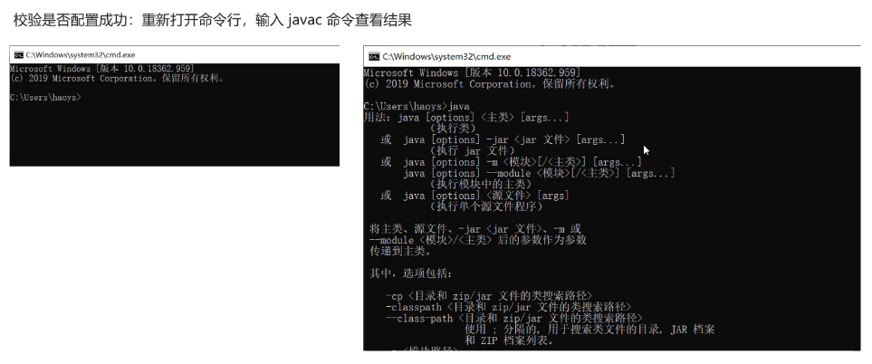

## 注释

单行注释：//

多行注释：/**/


## IDEA

IDEA，全称 IntelliJ IDEA，适用于 java 语言开发的集成环境。

集成环境：把代码编写、编译、执行、调试等多重功能综合到一起的开发工具。

### 结构

- project：项目、工程
- module：模块
- package：包
- class：类

### 类文件的修改

添加：右键 - refactor

删除：右键 - delete **（无法在回收站找回）**

<!--ps. 一个 JavaClass 只可以包含一个被 public 修饰的 class，但是可以包含多个 class。-->

### 模块的修改

新建：file - project structure

修改：右键 - refactor - rename module and directory

移除：右键 - reomve module**（只在列表中移除，仍在硬盘中，即文件夹不会被删除）**

导入：file - project structure**（导入模块后会报错 --》 点积右上角 setup SDK（因为没有和本地 SDK 关联））**

### 项目的修改

修改：file-program structure **（修改名字，不会修改路径，要修改路径，需要在关闭项目后rename文件夹再打开）**


### Package

包在硬盘中是一个文件夹

com.itheima --> com文件夹下itheima文件夹


## 注释TODO

标记代码，表示待完成或待解决的部分。

```java
// TODO:
```


# 基础知识


## 关键字

被 java 赋予特定含义的英文单词，全部小写。


## 常量

字符串常量（双引号）、整数常量、小数常量、字符常量（单个字符/单个汉字，单引号）、布尔常量（true/false）、空常量（null，不能直接打印）。

### 命名规范

- 一个单词：所有字母大写
- 多个单词：所有字母大写，中间用 _ 分割

### 进制书写格式（jdk7版本后才支持）

- 十进制，默认
- 二进制，0b/0B开头
- 八进制，0开头
- 十六进制，0x/0X开头


## 变量（某内存空间的别名）

### 定义格式（需要被初始化，否则使用时会报错）

```java
数据类型 变量名 = 数据值；
```


## 标识符（自己起的变量名）

### 命名规则

- 数字、字模、下划线(_)、美元符($)
- 不能以数字开头
- 不能是关键字
- 区分大小写

### 命名规范

- 小驼峰命名法：**（方法、变量）**
  - 标识符是一个单词，首字母小写，e.g. name
  - 标识符是多个单词，除第一个单词外的单词首字母大写，e.g.firstName

- 大驼峰命名法：**（类）**
  - 标识符是一个单词，首字母大写，e.g. Name
  - 标识符是多个单词，所有单词首字母大写，e.g.FirstName

## 数据类型

### 基本数据类型

- 整数
  - byte : 8 (-128 ~ 127)
  - short : 16 (-32768 ~ 32767)
  -  **int**（默认，首选）: 32 (-2147483648 ~ 2147483647)
  -  long : 64 (-922337036854775808 ~ 922337036854775807) （定义变量时，要在末尾加上 **L** 标识，建议大写，小写太像1了）
- 浮点数
  - float : 32 （定义变量时，要在末尾加上 **F** 标识，大小写都行）
  - **double**（默认，首选）: 64
- 字符
  - char : 8 (0 ~ 65535) （也可直接赋值为 ASCII 码）
- 布尔
  - boolean : true / false

### 引用数据类型

引用/记录地址值的变量，包括：类的对象、数组、接口。


### 键盘录入变量值

```java
import java.util.Scanner;

Scanner sc = new Scanner(Syetem.in);

int age = sc.nextInt(); 	// 录入int
String name = sc.next(); 	// 录入字符串
```


## 运算符


### 算术运算符

- +
- -
- *
- /：整数相除，只返回商/整数；有小数则返回小数
- %：取余


#### 字符串的拼接

- 当 "+" 操作中有一边出现字符串时，"+" 实现的是字符串拼接操作，如
  -  "item" + 666 = "item666"
- 但要注意表达式是 **从左往右** 运算的，所以
  - 1 + 99 + "年黑马" = "100年黑马"


### 自增（++）自减（--）运算符

运算符在前，变量先完成自增长，然后再参与运算；

运算符在后，先完成运算，再实现自增长。

ps. 只能操作变量，不能操作常量，因为 常量 = 常量 + 1 不合理

```java
public class ZiZengZiJian {
    public static void main(String[] args) {
        int a = 10;
        int b = a++;
        System.out.println(a);  // 11
        System.out.println(b);  // 10
    }
}
```

```java
public class ZiZengZiJian {
    public static void main(String[] args) {
        int a = 10;
        int b = ++a;
        System.out.println(a);  // 11
        System.out.println(b);  // 11
    }
}
```


### 赋值运算符

- =
- +=
- -=
- *=
- /=
- %=

ps. 后五个扩展赋值运算符，自带强制类型转换效果。

```java
public class ZiZengZiJian {
    public static void main(String[] args) {
        int a = 10;
        byte b = 20;

        b = (byte)(a + b);
        System.out.println(b);  // 30
    }
}
```

```java
public class ZiZengZiJian {
    public static void main(String[] args) {
        int a = 10;
        byte b = 20;

        b += a;
        System.out.println(b);  // 30
    }
}
```


### 关系运算符

- ==
- !=
- <
- <=
- (>)
- (>=)


### 逻辑运算符（没有短路效果）

- &
- |
- ！
- ^ ：异或


### 短路逻辑运算符

- &&
- ||

```java
public class ZiZengZiJian {
    public static void main(String[] args) {
        int x = 3, y = 4;

        System.out.println(++x > 4 & y-- < 5);  // false & true = false
        System.out.println("x=" + x);   // 4
        System.out.println("y=" + y);   // 3
    }
}
```

```java
public class ZiZengZiJian {
    public static void main(String[] args) {
        int x = 3, y = 4;

        System.out.println(++x > 4 && y-- < 5);  // false
        System.out.println("x=" + x);   // 4
        System.out.println("y=" + y);   // 4
    }
}
```


### 三元运算符

格式：

```java
expression ？ value1 ： value2;
```

```java
public class Test {
    public static void main(String[] args) {
        Scanner sc = new Scanner(System.in);

        System.out.println("Print three numbers:");

        int num1 = sc.nextInt();
        int num2 = sc.nextInt();
        int num3 = sc.nextInt();

        int tmp = num1 > num2 ? num1 : num2;
        int ans = num3 > tmp ? num3 : tmp;

        System.out.println("The biggest number is " + ans);
    }
}
```


## 流程控制语句

### 顺序结构

默认的执行顺序

### 分支结构

#### if 语句

```java
if(judge1)
{
    // ...
}
else if(judge1)
{
    // ...
}
else
{
    // ...
}
```


#### switch 语句

```java
switch(expression)
{
    case value1:
    	// ...
    	break;
    case value2:
    	// ...
    	break;
    // ...
    default: 	// 没有default，此外 vlaue 不执行任何语句
    	// ...
    	break;
}
```


ps. case 后只能是常量，且不能重复

### 循环结构

#### for 循环

循环体中定义的变量，在每一轮循环结束后都会被释放掉

```java
for(int i = 1; i <= 5; i++) 	//先赋值，再判断，再进入循环语句
{
    // 循环体
}
```

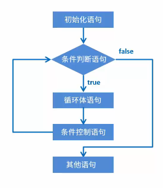

#### while 循环

```java
while(条件判断)
{
    // 循环体
    // 条件控制
}
```


#### do...while 循环

无论判断条件是否满足，都至少执行一次循环体。

```java
do{
    // 循环体
    // 条件控制
}while(条件判断)
```

### 跳转控制语句

- break：结束一级循环或switch。**在循环或switch中使用。**
- continue：跳过当前一轮循环。**只能在循环中使用。**


使用标号：

- break

  ```java
  abc: for(int i = 0; i < 5; i++)
       {
        	for(int j = 0; j < 3; j++)
          {
          	if( j == 1)
              {
                  break abc; 	// 直接跳出标号的循环
              }
              System.out.println("i: " + i + " j: " + j);
          }
      }
  /*
  i: 0 j: 0
  */
  ```

  

## 类型转换

### 隐式转换

- 把一个取值范围小的数值或变量赋值给另一个取值范围大的变量，会隐式转换成取值范围大的类型。

  ```java
  public class ZiZengZiJian {
      public static void main(String[] args) {
          int a = 10;
          double b = a;
          System.out.println(a);  // 10
          System.out.println(b);  // 10.0
      }
  }
  ```

  

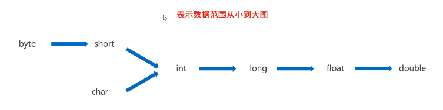

- 取值范围小的数据和取值范围大的数据进行运算时，小的会先隐式转换成大的，再进行运算。

  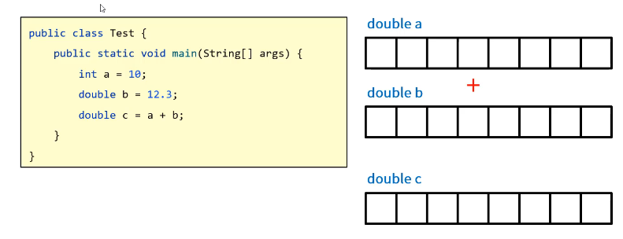

  

- byte / short / char 三种数据在运算时，会先隐式转换成 int，再进行运算。因此，下述代码会报错：

  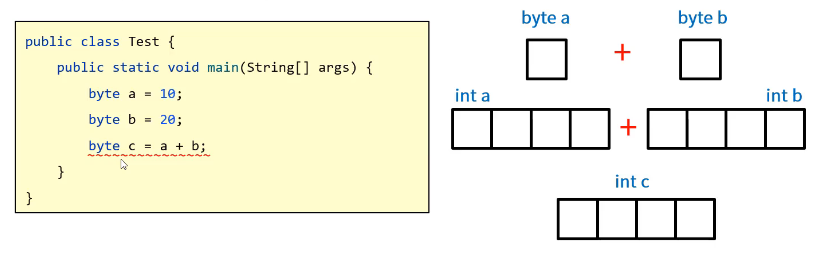

### 强制转换

- 把一个取值范围大的数值或变量赋值给另一个取值范围小的变量时，不允许直接赋值，需要加入强制转换。

  格式：

  ```java
  typeName tar_var = (typeName) var;
  ```


# Java 内存模型

- 堆内存：保存程序运行时产生的对象。
- 方法区：保存方法。
- 栈内存：保存程序运行时所有方法执行状态（ **包括方法中产生的对象** ）。方法被执行后就会进入栈内存。
- 本地方法栈：管理一些特殊方法。
- 寄存器

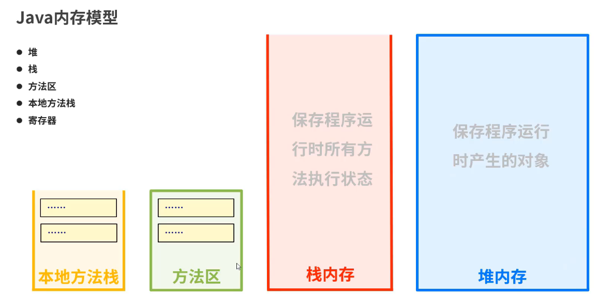


# 类和对象


## 类（提高代码的复用性和可执行性）

类的组成：属性（成员变量） + 行为（成员方法）


### Example

```java
public class Student {
    String name;
    int age;

    public void show(){
        System.out.println("====== student ======");
    }
}

public class TestStudent {
    public static void main(String[] args) {
        Student stu = new Student();
        System.out.println(stu);    // com.itheima.Student@b4c966a （对象在内存中的地址值）

        /* 成员变量没有初始化也可以直接使用，但使用的是默认初始化值。
            整数：0
            小数：0.0
            布尔：false
            字符：'\u0000' （空白字符）
            引用数据类型：null
        */
        System.out.println(stu.name);   // null
        System.out.println(stu.age);    // 0

        stu.name = "xxx";
        stu.age = 23;
        System.out.println(stu.name + "---" + stu.age);     // xxx---23

        stu.show();     // ====== student ======
    }
}
```


### 成员变量和局部变量的区别

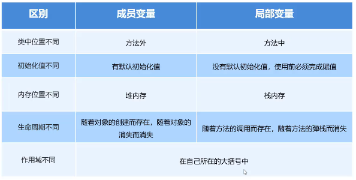


### 成员变量和局部变量重名 - 就近原则

```java
public class Student {
    String name;
    int age;

    public void sayHello(String name){
        System.out.println(name + this.name); 	// name 就近选择 String name
    }
    
    public void sayHello(){
        System.out.println(name); 	// this. 可以省略，java内部自动补全
    }
}

public class TestStudent {
    public static void main(String[] args) {
        Student stu = new Student();
        stu.name = "xxx";
        stu.age = 23;
        
        stu.sayHello("yyy"); 	// yyyxxx
        stu.sayHello(); 	// xxx
    }
}
```


## this 关键字 

- 指向当前对象，this 代表当前对象的引用，值为当前对象的地址。
- 可调用对象的成员变量和成员方法。

- 区分局部变量和成员变量的重名。

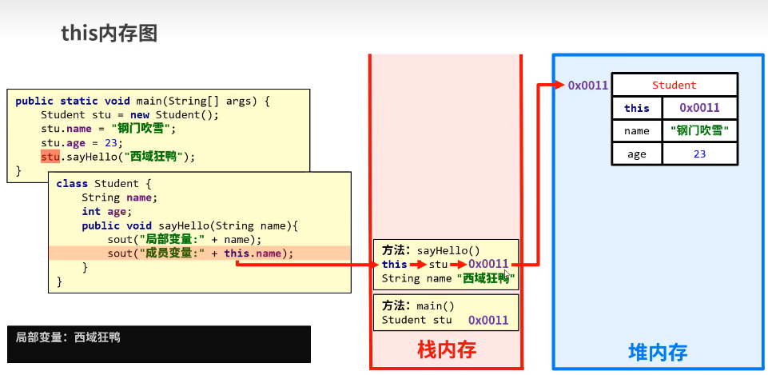


## 权限修饰符

- public：同一个包、**不同的包** 中都能访问

- private：只能在本类中访问。

- (default)：默认，在 **同一个包** 下进行访问。

- protected：同一个包或不同包下的子类可以访问。

  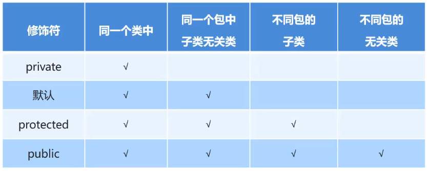

  

## 方法重载

Java 虚拟机会通过 **参数的不同** 来 **区分同名方法**。

<!--ps. 同样地参数类型，但是不用的顺序也会构成重载，但是意义不大。-->


## 构造方法

- 在创建对象时对成员变量进行初始化，可以重载。
- java 提供一个默认的、无参数的构造方法。但是 **如果显式定义了构造方法，系统将不再提供默认的构造方法**，因此，建议 **显式定义无参数的和有参数的构造方法**。

```java
public class Student {
    String name;
    int age;
	
    public Student(){}
    
    public Student(String name, int age)
    {
        this.name = name;
        this.age = age;
        System.out.println("this is the constructor of class student.");
        System.out.println("name: " + this.name + "    age: " + this.age);
    }
}

public class TestStudent {
    public static void main(String[] args) {
        Student stu = new Student("xxx", 18);
    }

}

/*
this is the constructor of class student.
name: xxx    age: 18
*/
```


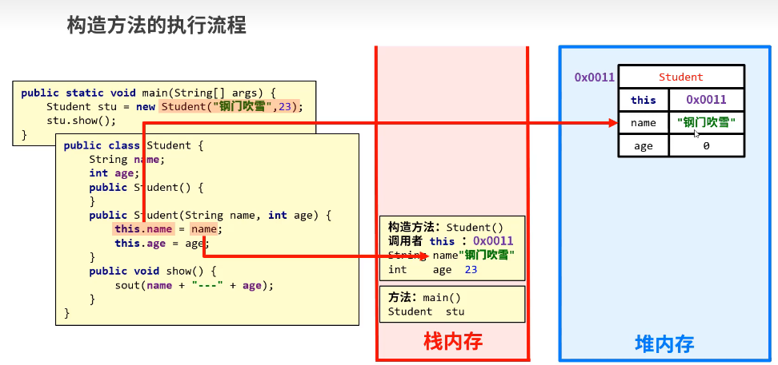

## 标准的 JavaBean 类

- 成员变量使用 private 修饰
- 构造方法提供一个无参的和一个带参的
- 成员方法中要提供每个成员变量对应的 setXxx() 和 getXxx() 

```java
public class Student {
    private String name;
    private int age;

    public Student(){}

    public Student(String name, int age)
    {
        this.name = name;
        this.age = age;
    }

    public void setName(String name)
    {
        this.name = name;
    }
    public String getName()
    {
        return name;
    }

    public void setAge(int age)
    {
        this.age = age;
    }
    public int getAge()
    {
        return age;
    }
}

public class TestStudent {
    public static void main(String[] args) {
        Student stu = new Student();
        stu.setName("xxx");
        stu.setAge(18);
        System.out.println(stu.getName() + stu.getAge());

        Student stu2 = new Student("xxx", 18);
        System.out.println(stu2.getName() + stu2.getAge());
    }
}
```


## 方法在 Java 内存中的表示


### 对象作为形参在方法中传递

对象在方法中作为参数传递时，传递的本质上是记录该对象的地址。

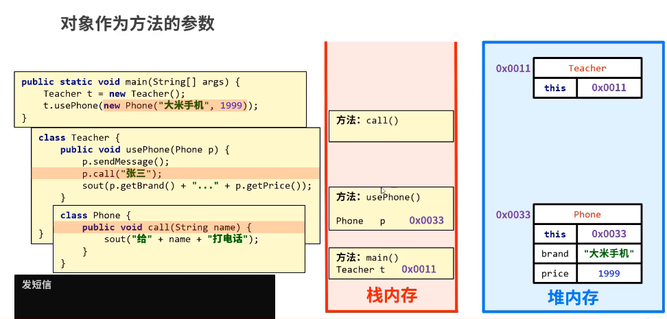


### 方法调用过程

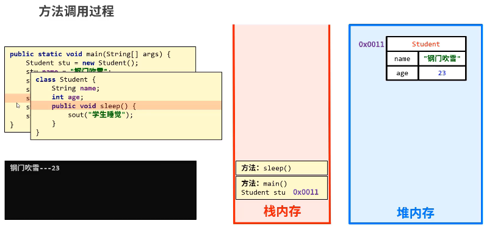


### 带参数的成员方法调用过程

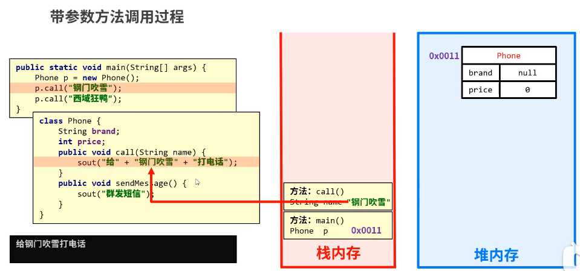


### 带返回值的成员方法调用过程

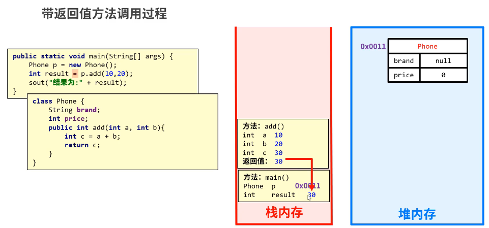


# 接口 - API

API (Application Programming Interface)：应用程序编程接口。声明规则。

如果一个类中只有抽象方法，那么可以将这个类改写成接口。

```java
public abstract class Inter{
    public abstract void method1();
    public abstract void method2();
}

// 只有抽象方法的抽象类的作用仅仅是声明规则，因此和接口没有区别，可以改写为抽象类。
public interface Inter{
    public abstract void method1();
    public abstract void method2();
}
```

## 接口的定义和特点

- 关键字 `interface` 定义。
- 不能实例化。
- 接口和类之间是实现关系，通过 `implements` 关键字表示。
- 接口的子类要么重写接口的所有抽象方法，要么是抽象类。
- 一个子类可以实现多个接口，并且不会出现方法冲突（因为接口只声明方法）。

```java
public interface Inter {
    public abstract void study();
}

public interface InterA {
    public abstract void method1();
    public abstract void method2();
}

public class InterImpl implements Inter, InterA {
    @Override
    public void study() {
        System.out.println("重写方法捏");

    }


    @Override
    public void method1() {
        System.out.println("重写方法捏1");
    }

    @Override
    public void method2() {
        System.out.println("重写方法捏2");
    }
}

public class DemoInterface {
    public static void main(String[] args) {
        InterImpl ii = new InterImpl();
        ii.study();
    }
}
```


## 接口中成员的特点

- 接口中成员变量只能是常量（默认自带三个关键字修饰符：`public static final`）

  ```java
  public interface Inter {
      public static final int num = 10;
  }
  ```

- 接口中没有构造方法，其实现类实际上调用的是 `Object` 类

- 接口中的方法只能是抽象方法（方法声明默认自带两个关键字修饰符：`public abstract`）

  ```java
  public abstract void eat();
  ```

## 类和接口的关系

- 类与类

  继承关系，只能单继承，不能多继承，但是可以多层继承。

- 接口与类

  实现关系，可以单实现，也可以多实现，还可以在继承一个类的同时实现多个接口。

  ```java
  class Fu{
      public void method()
      {
          System.out.println("父类中的成员方法");
      }
  }
  
  public interface Inter {
      public static final int num = 10;
  
      public abstract void InterMethod();
  }
  
  public interface InterA {
      public abstract void InterAMethod();
  }
  
  interface InterC{
      public abstract void method();
  }
  
  class Zi extends Fu implements Inter, InterA, InterC{
  
      // 不需要实现 InterC 中的 method 方法，因为子类从父类中继承得到了 method 方法。
  
      @Override
      public void InterMethod() {
  
      }
  
      @Override
      public void InterAMethod() {
  
      }
  }
  ```

  

- 接口与接口

  继承关系，可以单继承，也可以多继承。

  ```java
  interface Inter1{
      public abstract void method1();
  }
  
  interface Inter2{
      public abstract void method2();
  }
  
  interface Inter3 extends Inter1, Inter2{
      public abstract void method3();
  }
  
  class Inter3Impl implements Inter3{
  
      @Override
      public void method1() {
  
      }
  
      @Override
      public void method2() {
  
      }
  
      @Override
      public void method3() {
  
      }
  }
  ```

  


# 窗体结构


## 窗体

```java
import javax.swing.*;

public class App {
    public static void main(String[] args) {
        JFrame frame = new JFrame(); 	// IDEA 识别到这条语句时会自动导包

        frame.setSize(514,538);     // 设置窗体长宽

        frame.setLocationRelativeTo(null);  // 居中

        frame.setAlwaysOnTop(true);     // 置顶

        frame.setDefaultCloseOperation(3);  //关闭模式，关闭窗体即结束程序

        frame.setTitle("2048 小游戏");     //设置窗体 title

        frame.setVisible(true);     // 设置窗口可见，这条语句要放在最后执行
    }
}
```


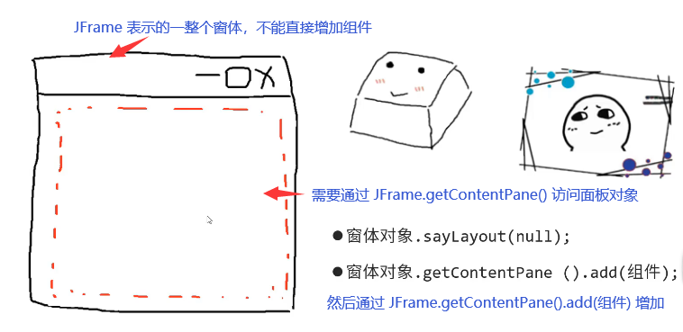


## 组件  

若多个组件被摆放在同一个位置，**后添加的组件会被压在底部**。

### JButton

```java
public class DemoJButton {
    public static void main(String[] args) {
        JFrame frame = new JFrame();

        frame.setSize(514,538);     // 设置窗体长宽
        frame.setLocationRelativeTo(null);  // 居中
        frame.setAlwaysOnTop(true);     // 置顶
        frame.setDefaultCloseOperation(3);  //关闭模式，关闭窗体即结束程序
        frame.setTitle("2048 小游戏");     //设置窗体 title

        // 通过窗体对象，取消默认布局（默认居中占满窗体）
        frame.setLayout(null);
        
        // 创建按钮对象（空参构造）
        JButton btn = new JButton();
        // 因为取消了默认布局，所以要自己设定布局
        btn.setBounds(50, 50, 100, 100);    // (x, y): 左上角
        
        // 创建按钮对象（带参构造）
        JButton btn2 = new JButton("touch me!");
        btn2.setBounds(150, 150, 100, 100);
        
        // 通过窗体对象，获取面板对象，并调用 add 方法添加组件
        frame.getContentPane().add(btn);
        frame.getContentPane().add(btn2);

        frame.setVisible(true);     // 窗体可见
    }
}
```

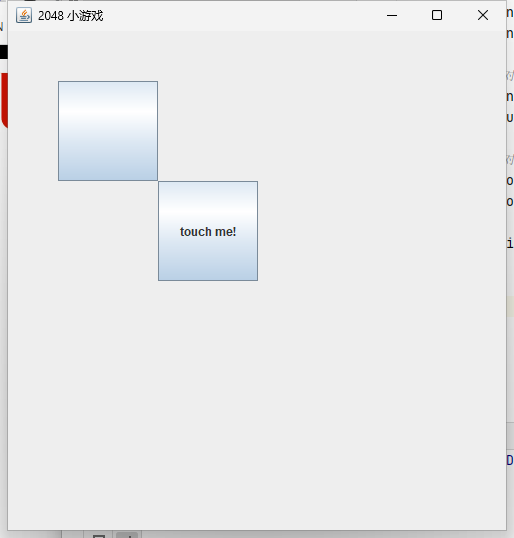

### JLabel

展示文本或图片。

```java
public class DemoJLabel {
    public static void main(String[] args) {
        JFrame frame = new JFrame();

        frame.setSize(514,538);     // 设置窗体长宽
        frame.setLocationRelativeTo(null);  // 居中
        frame.setAlwaysOnTop(true);     // 置顶
        frame.setDefaultCloseOperation(3);  //关闭模式，关闭窗体即结束程序
        frame.setTitle("2048 小游戏");     //设置窗体 title

        // 通过窗体对象，取消默认布局（默认居中占满窗体）
        frame.setLayout(null);

        // 创建 JLabel 对象（空参构造），空参不显示
        JLabel jl = new JLabel();
        // 因为取消了默认布局，所以要自己设定布局
        jl.setBounds(50, 50, 100, 100);    // (x, y): 左上角

        // 创建 JLabel 展示文本
        JLabel jl1 = new JLabel("I'm a label!");
        // 因为取消了默认布局，所以要自己设定布局
        jl1.setBounds(150, 150, 100, 100);    // (x, y): 左上角

        // 创建 JLabel 展示图片
        ImageIcon icon = new ImageIcon("D:\\tmp_dataset\\original_data\\000000.jpg");
        JLabel jl2 = new JLabel(icon);
        // 因为取消了默认布局，所以要自己设定布局
        jl2.setBounds(250, 250, 200, 200);    // (x, y): 左上角

        // 通过窗体对象，获取面板对象，并调用 add 方法添加组件
        frame.getContentPane().add(jl);
        frame.getContentPane().add(jl1);
        frame.getContentPane().add(jl2);

        frame.setVisible(true);     // 窗体可见
    }
}
```

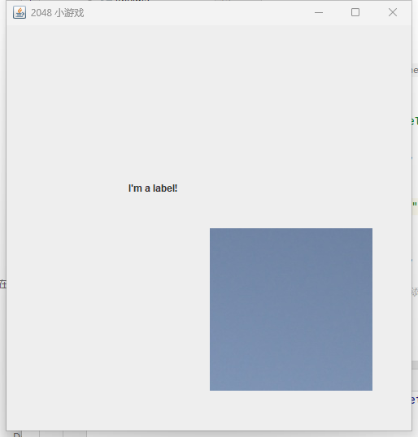


# 数组

一种容器，存储同种数据类型的多个元素。

## 定义

```java
// 数据类型[] 数组名 (推荐)
int[] array;

// 数据类型 数组名[]
int array[];
```


## 初始化

### 静态初始化 - 指定数组的元素，系统根据元素明确数组长度

```java
int[] arr = new int[]{11, 22, 33};

double[] arr = new double[]{11.1, 22.2, 33.3};

// 简写形式
int[] arr = {11, 22, 33};
```

### 动态初始化 - 只指定数组的长度，系统分配默认初始值

```java
int[] arr = new int[10]；
```


### 输出和遍历

- 直接输出数组

  返回的是数组容器在内存中的地址。

  <!--ps. 未初始化的数组无法打印。-->

- 遍历数组 （利用 **array.length** ）

  ```java
  for(int i = 0; i < arr.length; i++)
  {
      System.out.println(arr[i]);
  }
  ```


## 数组内存图

有 new 就是在堆内存中开辟空间。

### 动态初始化

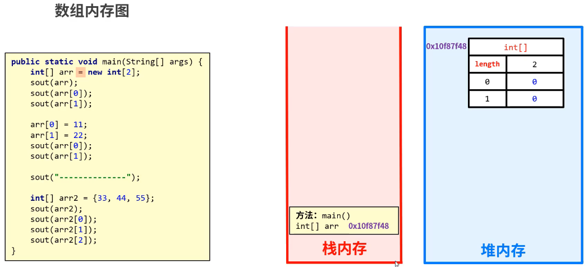


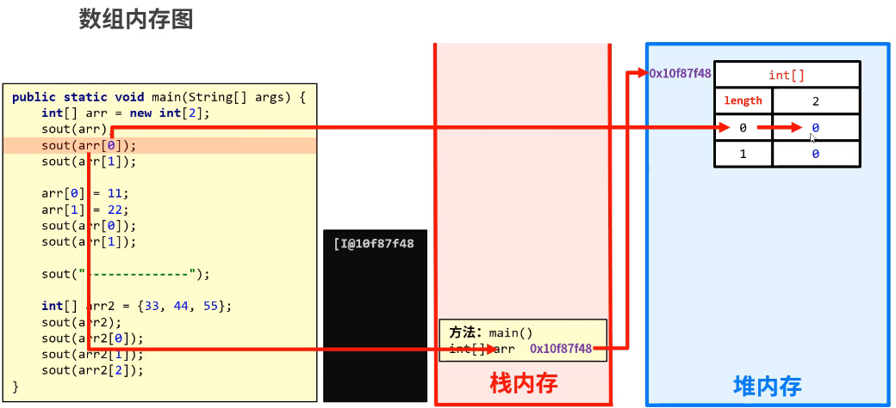


### 静态初始化

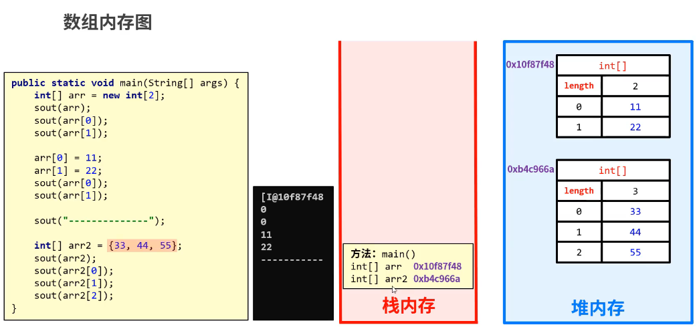


### 两个数组指向相同内存 （即两个数组地址相同）

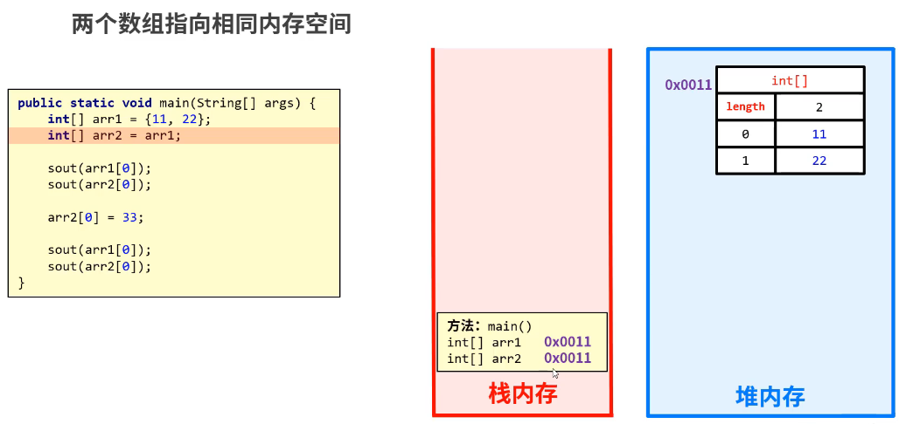

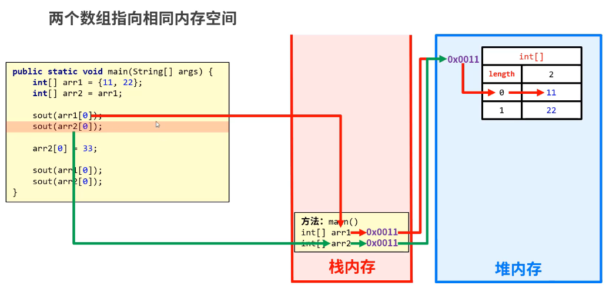


# 二维数组

## 初始化

### 静态初始化

```java
int[][] arr = new int[][]{{1, 2}, {3, 4}};

// 简写形式
int[][] arr = {{1, 2}, {3, 4}};
```

### 动态初始化

```java
int[][] arr = new int[m][n];
```


## 二维数组内存图

### 动态初始化

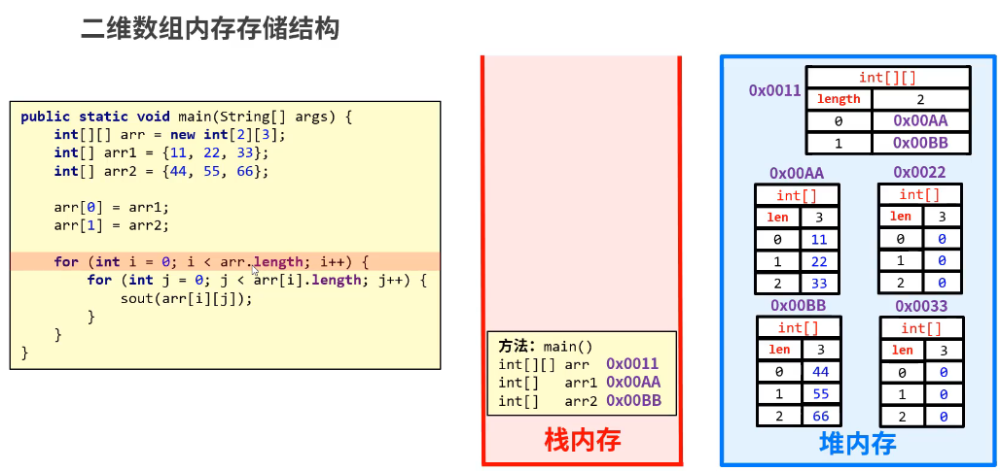

# 方法重写

方法重写：在继承体系中，子类中出现了和父类中完全相同的方法声明（包括 **方法名和参数** ），相当于覆盖。当子类需要父类功能，而子类又需要自己特有的内容的时候，可以方法重写。

```java
public class IPearV1 {
    public void call(String name)
    {
        System.out.println("calling");
    }

    public void smallBlack()
    {
        System.out.println("Speak in English");
    }
}

public class IPearV2 extends IPearV1 {
    @Override   // 检查当前方法是否为方法重写
    public void smallBlack()
    {
        super.smallBlack();     // 调用父类功能
        System.out.println("Speak in Chinese");
    }
}

public class TestOverride {
    public static void main(String[] args) {
        IPearV2 i = new IPearV2();
        i.smallBlack();
    }
}

/*
Speak in English
Speak in Chinese
*/
```


## 注意事项

- 父类中的私有方法不能被重写

- 子类重写父类方法时，访问权限必须 **大于等于** 父类（最好保持一致）

  

  

# 面向对象的三大特征

## 封装

隐藏实现细节，仅对外暴露公共的访问方式。

常见形式：

- 将代码抽取到方法中（对代码封装）
- 将属性抽取到类中（对数据封装）


## 继承

子类（派生类）可以直接使用父类（基类、超类）中的 **非私有** 成员。

```java
public class 子类 extends 父类 {}
```


### 举个例子

```java
public class TestExtends {
    public static void main(String[] args) {
        Coder c = new Coder();
        c.setName("xxx");
        System.out.println(c.getName());
    }
}

class Employee{
    private String name;

    public String getName() {
        return name;
    }

    public void setName(String name) {
        this.name = name;
    }
}

class Coder extends Employee{

}

/*
xxx
*/
```


### 优点和缺点

#### 优点

- 提高代码的复用性。
- 提高代码的维护性。
- 让类与类之间产生关系，是多态的前提。

#### 缺点

- 增加了代码的耦合性（代码与代码之间的关联）。

#### Java 中继承的特点

- 只支持单继承，不支持多继承（即继承多个父类，避免方法冲突），但支持多层继承。


### 成员变量和成员方法

- 若子类和父类中出现重名的成员变量，根据 **就近原则**，子类会使用自己的成员变量。若要调用父类的成员变量，可以使用 **super** 关键字。

  ```java
  public class TestExtends {
      public static void main(String[] args) {
          Zi z = new Zi();
          z.test();
      }
  }
  
  class Fu{
      int num = 10;
  }
  
  class Zi extends Fu{
      int num = 20;
  
      public void test ()
      {
          int num = 30;
          System.out.println(num);    // 30
          System.out.println(this.num);    // 20
          System.out.println(super.num);    // 10
      }
  }
  ```

  

- 若子类和父类中出现重名的成员方法，本质上是子类对父类的方法进行了 **方法重写**，子类会使用自己的成员方法。

### 继承中构造方法的访问特点

- **子类不能继承父类的构造方法，因为构造方法要求必须和类名保持一致。**

- 子类在初始化前，会先隐含调用 **父类的空参数构造方法** 。（在所有的构造方法中，都 **默认隐藏着 `super();`** 这句代码）

- 若父类没有空参方法，则代码会报错。

  - 子类可以使用 `super` 关键字手动访问父类的带参构造方法。

    ```java
    public class Test {
        public static void main(String[] args) {
            Zi z = new Zi(10);
        }
    }
    
    class Fu{
        private int num;
    
        public Fu(int num)
        {
            this.num = num;
            System.out.println("This is Fu's constructor! num = " + num);
        }
    }
    
    class Zi extends Fu{
        public Zi(int num){
            super(num);
            System.out.println("This is Zi's constructor! num = " + num);
        }
    }
    
    /*
    This is Fu's constructor! num = 10
    This is Zi's constructor! num = 10
    */
    ```

    

  - 子类可以使用 `this` 关键字调用本类的其他构造方法，再在其他构造方法中使用 `super` 关键字手动调用父类的带参构造方法。

    ```java
    public class Test {
        public static void main(String[] args) {
            Zi z = new Zi(10);
        }
    }
    
    class Fu{
        private int num;
    
        public Fu(int num)
        {
            this.num = num;
            System.out.println("This is Fu's constructor! num = " + num);
        }
    }
    
    class Zi extends Fu{
        public Zi(){
            this(10);
        }
        public Zi(int num){
            super(num);
            System.out.println("This is Zi's constructor! num = " + num);
        }
    }
    
    /*
    This is Fu's constructor! num = 10
    This is Zi's constructor! num = 10
    */
    ```

    <!--this 和  super 必须放在构造函数的第一行，二者不能共存。-->

- Java 中所有的类都继承了 **Object** 类（最顶层父类）。


### 继承中构造方法在内存中的执行流程

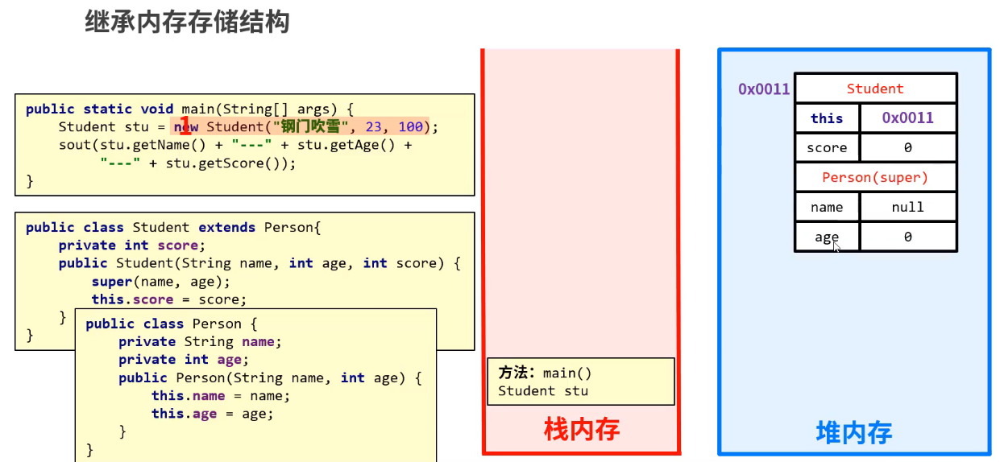

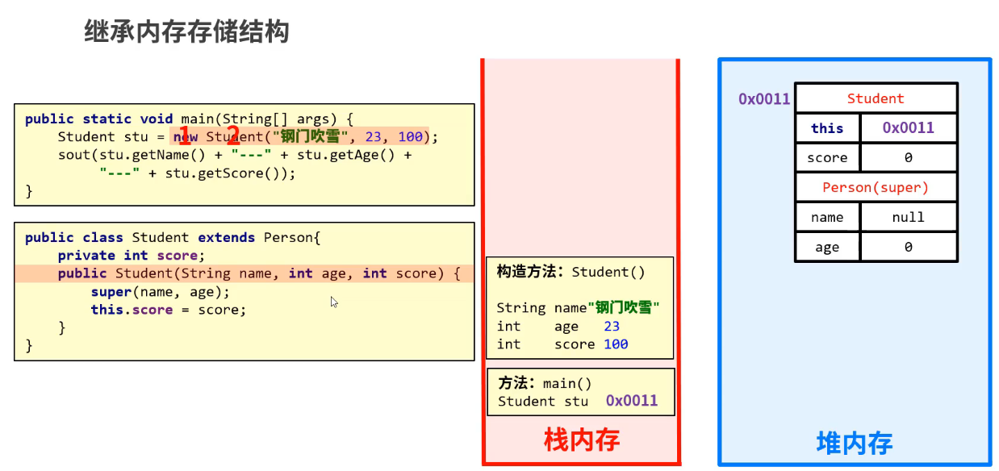

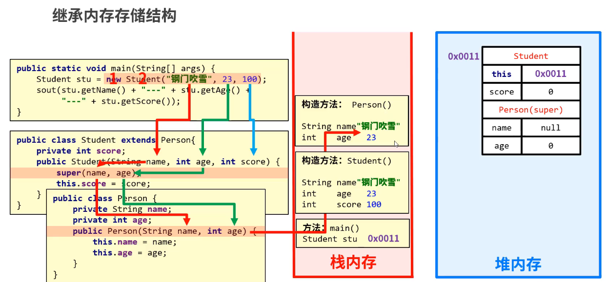

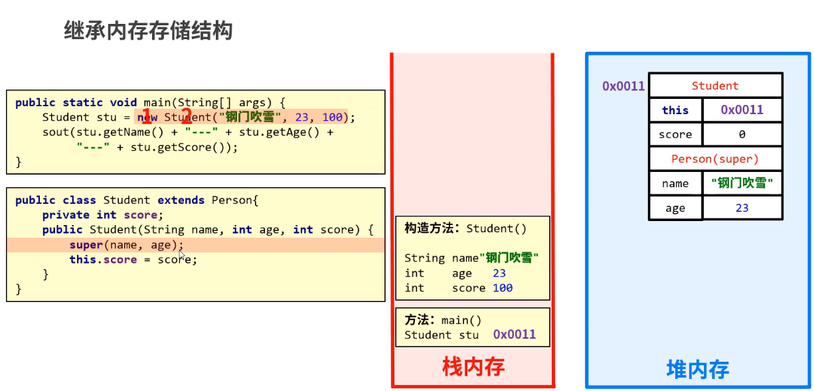

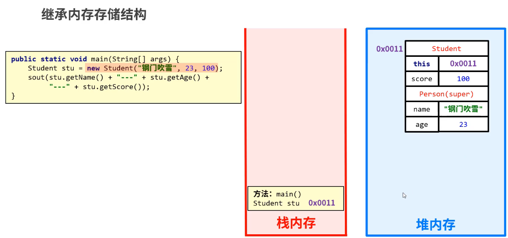

### 继承的方法在内存中的执行流程

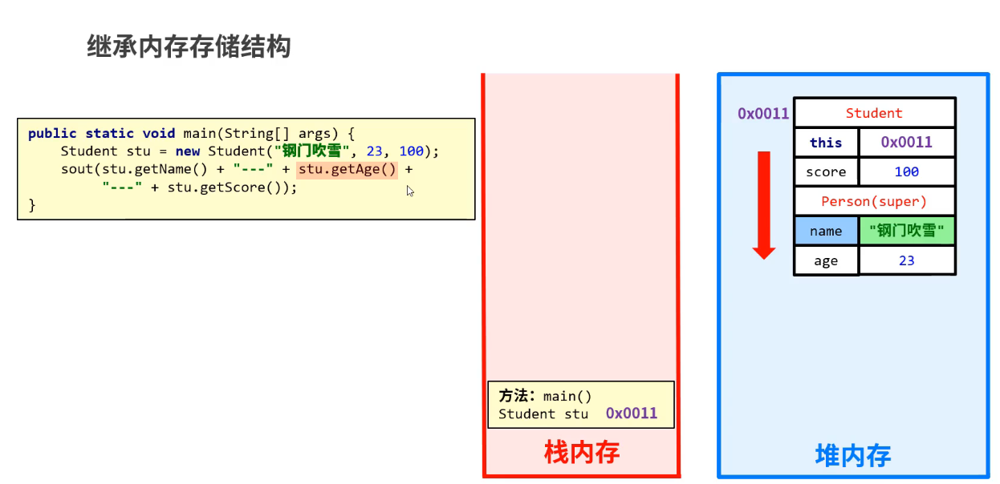

### this 和 super

this：代表奔雷对象的引用

super：代表父类存储空间的标识（可理解为父类对象的引用）

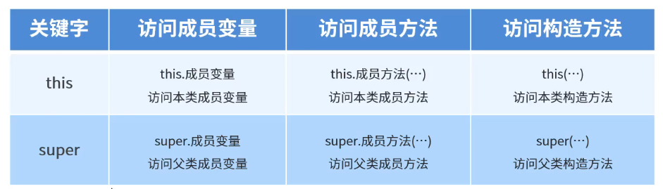

ps. 若子类调用父类的方法，且子类中没有该方法的重写，`super` 关键字可以省略不写。


## 多态

同一个对象，在不同时刻表现不同形态。

### 前提

- 有继承 / 实现关系
- 有方法重写
- 有父类引用指向子类对象

```java

public class DemoPolymorphic {
    public static void main(String[] args) {
        // 当前对象是一个员工
        Employee e = new Coder();
        // 当前对象是一个程序员
        Coder c = new Coder();
    }
}


class Employee{
    public void work()
    {
        System.out.println("working...");
    }
}

class Coder extends Employee{
    public void work()
    {
        System.out.println("coding...");
    }
}
```

### 多态的成员访问特点

- 构造方法：同继承一样，子类通过 super 关键字调用父类的构造方法。
- 成员变量：调用父类的成员变量，且只能访问父类中的成员变量。
- 成员方法：编译时查看父类中是否有该方法，运行时调用子类中重写方法。

### 多态的优劣

- 优 - 提高了程序的扩展性:

  ```java
  public class Demo4Polymorphic {
      public static void main(String[] args) {
          Demo4Polymorphic d = new Demo4Polymorphic();
          d.useAnimal(new Dog()); 	// 多态的优势
          d.useAnimal(new Cat()); 	// 多态的优势
  
      }
  
      public void useAnimal(Animal a){   // Animal a = new Dog();
                                         // Animal a = new Cat();
          a.eat();
          // a.watchHome(); 	多态的弊端：不能调用子类特有的方法
      }
      
      /* 多态精简代码
      public void useDog(Dog d){
          d.eat();
      }
      public void useCat(Cat c){
          c.eat();
      }*/
  }
  
  abstract class Animal {
      public abstract void eat();
  }
  
  class Dog extends Animal {
  
      @Override
      public void eat() {
          System.out.println("狗吃肉");
      }
  
      public void watchHome(){
          System.out.println("看家");
      }
  }
  
  class Cat extends Animal {
  
      @Override
      public void eat() {
          System.out.println("猫吃鱼");
      }
  }
  ```

- 劣 - 不能使用子类特有的方法


### 多态中的转型

### Example

```java
public class Demo1Polymorphic {
    /*
        1.向上转型
            从子到父
            父类引用指向子类对象
        2.向下转型
            从父到子
            父类引用转为子类对象
     */
    public static void main(String[] args) {
        Fu f = new Zi();
        f.method();     // 仅调用公共方法

        Zi z = (Zi) f;
        z.show();   // 可调用子类特有方法 
    }
}

class Fu {
    public void method() {
        System.out.println("Fu...method");
    }
}

class Zi extends Fu {
    @Override
    public void method() {
        System.out.println("Zi...method");
    }

    public void show() {
        System.out.println("子类特有的show方法.");
    }
}
```


#### 向上转型

```java
Fu f = new Zi(); 	// 只能调用公共方法
```

#### 向下转型

```java
Zi z = (Zi)f; 	// 可以调用子类特有的方法
```

##### 向下转型时需注意类型转换错误

```java
public class Demo2Polymorphic {

    /*
        ClassCastException:
            如果被转的引用类型变量，对应的实际类型和目标类型不是同一种类型，那么在转换的时候就会出现ClassCastException
     */

    public static void main(String[] args) {
        Demo2Polymorphic d = new Demo2Polymorphic();
        d.useAnimal(new Dog());
        d.useAnimal(new Cat());
    }

    public void useAnimal(Animal a) {
        a.eat();
		
        
        // 不能直接类型转换然后调用 d.watchHome()，因为 Cat 类没有这个方法。
        
        if(a instanceof Dog){ 	// 判断传入的对象是狗
            Dog d = (Dog) a;
            d.watchHome();
        }else if(a instanceof Cat){ 	// 判断传入的对象是猫
            Cat c = (Cat) a;
            c.catchMouse();
        }

    }
}

abstract class Animal {
    public abstract void eat();
}

class Dog extends Animal {

    @Override
    public void eat() {
        System.out.println("狗吃肉");
    }

    public void watchHome() {
        System.out.println("看家");
    }
}

class Cat extends Animal {

    @Override
    public void eat() {
        System.out.println("猫吃鱼");
    }

    public void catchMouse() {
        System.out.println("捉老鼠");
    }
}
```


# final 关键字

修饰方法、变量、类。

- 修饰变量：表名该变量是常量，不能被再次赋值。

  - 修饰基本数据类型，其值不可再次更改。

  - 修饰引用数据变量，地址值不可再次更改，但是其中的值可以更改。
  - 修饰成员变量，要么在修饰处直接赋值，要么在构造方法中完成赋值。

- 修饰方法：表名该方法是最终方法，不能被重写。（一般修饰父类的核心方法）

- 修饰类：表名该类是最终类，不能被继承。


# 抽象类

抽取子类中的共性行为到父类中，但是父类中无法具体明确，因此设置为抽象方法（强制子类重写该方法），父类变为抽象类。

```java
class Manager {
    public void work()
    {
        System.out.println("管理程序员...");
    }
}

class Coder {
    public void work()
    {
        System.out.println("编写代码...");
    }
}

// 抽取共性行为 --》 抽象类

abstract class Employee {
    public abstract void work();    // 强制子类重写该方法
}

class Manager extends Employee{
    @Override
    public void work()
    {
        System.out.println("管理程序员...");
    }
}

class Coder extends Employee{
    @Override
    public void work() {
        System.out.println("编写代码...");
    }
}
```


## 注意事项

- 抽象类不能实例化，因为抽象方法不能被调用。
- 抽象类存在构造方法，可以由子类调用。
- 抽象类中可以没有抽象方法，但是有抽象方法的类一定是抽象类。抽象类中可以定义普通方法。
- 抽象类的子类必须重写父类的所有的抽象方法，否则要将子类定义为抽象类（因为子类继承了父类中的抽象方法）。


# 事件

## 事件监听机制

事件源：事件监听的对象。

事件：监听的动作。

绑定监听：当事件源上发生了某个事件，触发对应的代码段。

### 常见监听器（接口）

#### `ActionListener` 动作监听

```java
public class Demo1ActionListener {
    public static void main(String[] args) {
        JFrame frame = new JFrame();
        frame.setSize(514, 538);
        frame.setLocationRelativeTo(null);  // 设置居中
        frame.setLayout(null);  // 取消默认布局
        frame.setDefaultCloseOperation(3);  // 设置关闭模式

        JButton btn = new JButton("button");
        btn.setBounds(0, 0, 100, 100);
        frame.getContentPane().add(btn);

        /** 绑定监听
         * 方法 addActionListener(ActionListener l) 接收接口类型对象，但是接口不能实例化，因此
         * 实际传入的是接口的实现类对象，即
         * ActionListener l = new ActionListenerImpl()；
         * 实际上是父类接收子类对象，也是一种多态的体现
         */
        btn.addActionListener(new ActionListenerImpl()); 	// 鼠标点击按钮和按空格键会引起时间

        frame.setVisible(true);
    }
}

class ActionListenerImpl implements ActionListener{


    @Override
    public void actionPerformed(ActionEvent e) {
        System.out.println("实现监听器接口");
    }
}
```


#### `MouseListener` 鼠标事件监听

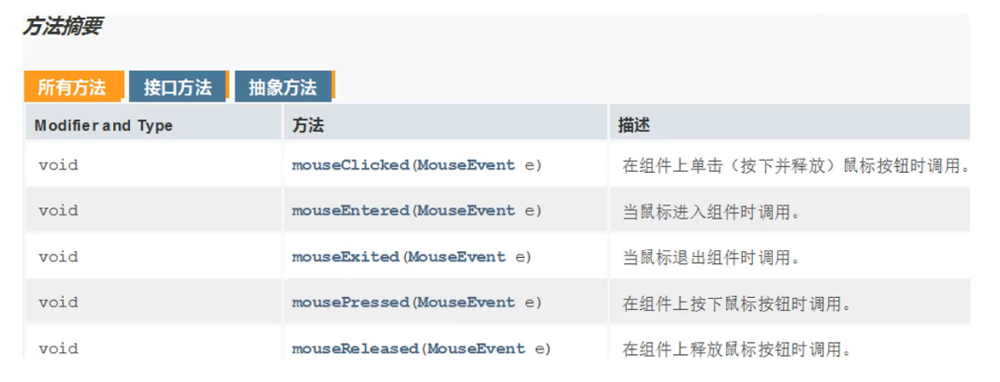

##### Example

```java
public class Demo1MouseListener {
    public static void main(String[] args) {
        JFrame frame = new JFrame();
        frame.setSize(514, 538);
        frame.setLocationRelativeTo(null);  // 设置居中
        frame.setLayout(null);  // 取消默认布局
        frame.setDefaultCloseOperation(3);  // 设置关闭模式

        JButton btn = new JButton("button");
        btn.setBounds(0, 0, 100, 100);
        frame.getContentPane().add(btn);

        /** 绑定监听
         * 方法 addActionListener(ActionListener l) 接收接口类型对象，但是接口不能实例化，因此
         * 实际传入的是接口的实现类对象，即
         * ActionListener l = new ActionListenerImpl()；
         * 实际上是父类接收子类对象，也是一种多态的体现
         */
        btn.addMouseListener(new MouseListenerImpl());


        frame.setVisible(true);
    }
}

class MouseListenerImpl implements MouseListener{
    @Override
    public void mouseClicked(MouseEvent e) {
        System.out.println("鼠标点击");
    }

    @Override
    public void mousePressed(MouseEvent e) {
        System.out.println("鼠标按下");
    }

    @Override
    public void mouseReleased(MouseEvent e) {
        System.out.println("鼠标松开");
    }

    @Override
    public void mouseEntered(MouseEvent e) {
        System.out.println("鼠标划入");
    }

    @Override
    public void mouseExited(MouseEvent e) {
        System.out.println("鼠标划出");
    }
}
```

###### Example2

```java
public class ClickMe extends JFrame implements MouseListener { 	// 在继承 JFrame 的同时实现 MouseListener 接口

    JButton btn = new JButton("button");

    public static void main(String[] args) {
        ClickMe cm = new ClickMe();
        cm.init();
    }

    public void init()
    {
        setSize(514, 538);
        setLocationRelativeTo(null);  // 设置居中
        setLayout(null);  // 取消默认布局
        setDefaultCloseOperation(3);  // 设置关闭模式


        btn.setBounds(0, 0, 100, 100);
        getContentPane().add(btn);

        btn.addMouseListener(this); 	// 因为是接口的实现类，所以可以直接传入自己

        setVisible(true);
    }

    @Override
    public void mouseClicked(MouseEvent e) {

    }

    @Override
    public void mousePressed(MouseEvent e) {

    }

    @Override
    public void mouseReleased(MouseEvent e) {

    }

    int flag = 1;

    @Override
    public void mouseEntered(MouseEvent e) { 	// 实现一个简单的按钮躲避的功能
        if(flag == 1)
        {
            btn.setBounds(100, 100, 100, 100);
            flag = -flag;
        }
        else
        {
            btn.setBounds(0, 0, 100, 100);
            flag = -flag;
        }
        System.out.println("鼠标划入");

    }

    @Override
    public void mouseExited(MouseEvent e) {

    }
}
```


#### `KeyListener`


# 快捷方式

- pvsm + enter : main方法

- sout + enter : 输出语句 

- ctrl + D : 向下复制一行

- 自动生成构造函数和 setXxx / GetXxx

  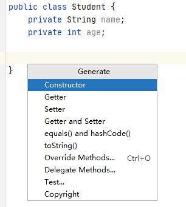

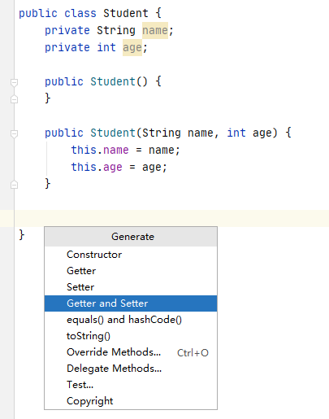
