# gcc

GCC 原名 GNU C 语言编译器（GNU C Compiler），只能处理C语言。但其很快扩展，变得可处理C++，后来又扩展为能够支持更多编程语言，如Pascal、Objective -C、Java、Go以及各类处理器架构上的汇编语言等，所以改名GNU编译器套件（GNU Compiler Collection）。


## gcc 和 g++ 的区别

- gcc 和 g++ 都是 GNU 的 **编译器**；
- gcc 和 g++ 都可以编译 c 代码和 c++ 代码。但是：
  - 后缀为 .c 的程序，**gcc 认为其是 c 程序， g++ 认为其是 c++ 程序**；
  - 后缀为 .cpp 的程序，gcc 和 g++ 都认为其是 c++ 程序；
  - 编译阶段，g++ 会调用 gcc。所以对于 c++ 代码来说，gcc 和 g++ 是等价的；但是因为 **gcc 不能自动和 c++ 程序使用的库链接，需要 g++ 来完成链接**，所以为了统一起见，干脆 **编译和链接 c++ 程序都使用 g++** 了，但实际上，**编译调用的是 gcc**。
- 编译可以使用 gcc / g++，链接可以使用 g++ / gcc -lstdc++（用 c++ 的标准进行链接）。gcc 不能自动和 c++ 程序使用的库链接，需要 g++ 来完成链接；g++ 编译的时候会调用 gcc。
- `__cpluscplus`：宏。标志着编译器将代码当做 c 代码来解释还是当作 c++ 代码来解释。
  - 如果程序后缀为 .c，并且采用 gcc 编译器，那么编译器认为这是 c 代码，所以该宏是未定义的；
  - 如果编译器认为这是 c++ 代码，那么该宏就可以被定义。


## gcc 使用

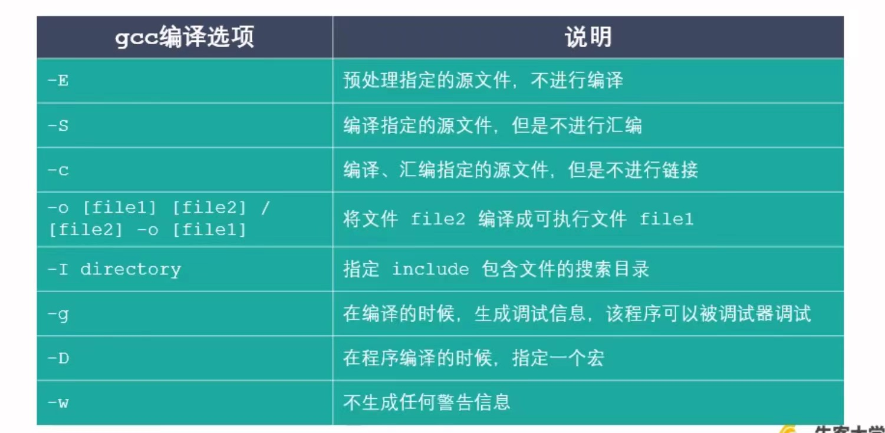

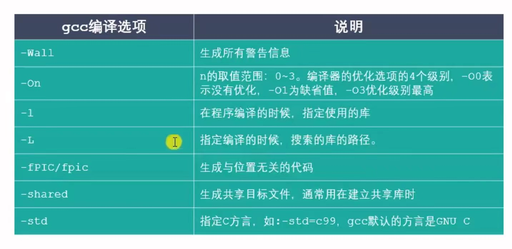

```shell
# gcc file_name.c -o target_name 将 file_name.c 编译成可执行文件（可执行文件名为 target_name）
gcc test.c -o test

# gcc 要生成 test 可执行文件，需要用到 test.c 文件
gcc -o test test.c

# gcc file_name.c 将 file_name.c 编译成可执行文件（默认可执行文件名为 a.out）
gcc filename.c

# 运行可执行文件
./target_name
./a.out 	# linux 默认的可执行文件名
```


- 预处理后源代码：删去注释、宏替换等

```
gcc test.c -E -o test.i 	# 生成预处理后文件 test.i， -E 预处理 -o 生成目标文件

gcc test.i -S -o test.s 	# 生成编译后文件 test.s， -S 编译 -o 生成目标文件

gcc test.s -c -o test.o 	# 生成汇编后文件 test.o， -S 编译 -o 生成目标文件

gcc test.o -o test.out 		# 生成链接后文件 test.out， -o 生成目标文件
```


**`-D` 调试，与宏搭配使用。**

```c
// test.c
# include <stdio.h>

main()
{
    printf("hello world\n");
    #ifdef DEBUG
    printf("DEBUGING...");
    #endif
}

// gcc test.c -o test
// hello world

// gcc test.c -o test -D DEBUG
// hello world
// DEBUGING...

// 等价于
// test.c
# include <stdio.h>
# define DENUG 	// 定义一个宏
main()
{
    printf("hello world\n");
    #ifdef DEBUG 	// 若该宏被定义，则执行这部分代码
    printf("DEBUGING...");
    #endif
}
```

**`-I` 指定头文件目录**

# 静态库和动态库

## 库文件

- 计算机上的一类文件，可以简单地把库文件看成一种代码仓库，它提供给使用者一些可以直接拿来用的变量、函数或类。
- 库是一种特殊的程序，编写上和一般地程序没有较大的区别，但是不能单独运行。
- 库文件有两种“静态库和动态库（共享库）。
  - 静态库：在程序的链接阶段被复制到程序中；（一般比较小）
  - 动态库：在程序的链接阶段没有被复制到程序中，在程序的运行阶段（调用动态库 api 时）由系统动态加载到内存中供程序调用，通过 ldd (list dynamic depencencies) 命令检查动态库依赖关系。（一般比较大）
- 库的好处：①代码保密。②方便部署和开发。
- 库文件要和头文件（说明库中 api）一起分发。


**程序编译成可执行程序的过程：**

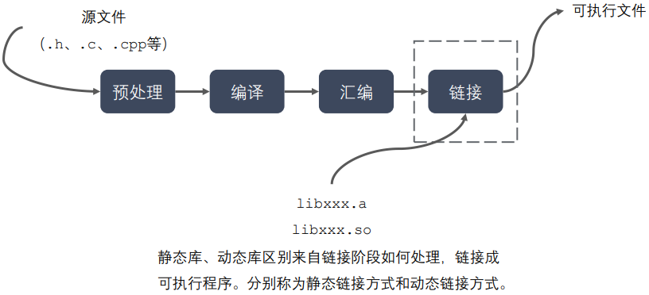


## 静态库

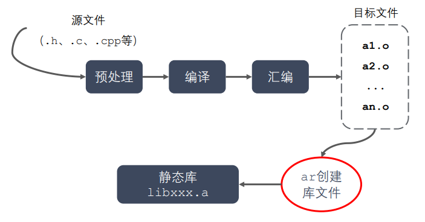

- 静态库在链接阶段会被打包复制到可执行程序中。

### 1. 库文件命名规则

- linux：libxxx.a
- windows：libxxx.lib

### 2. 静态库的制作

- gcc 获取 .o 文件

- 将 .o 文件打包（使用 ar 工具，archive）

  ```shell
  ar rsc libxxx.a xxx.o xxx.o 	// ar rsc 库名 .o文件们
  ```

  r - 将文件插入到备存文件中

  c - 建立备存文件

  s - 索引

### 3. 静态库的使用 - 例子

现有四个程序分别实现加减乘除，将它们制作成一个静态库，库名为 `calc`，库文件名为 `libcalc.a`。

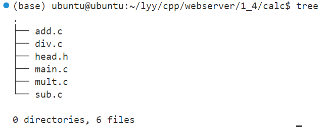

```shell
gcc -c add.c sub.c mult.c div.c 	// 生成 .o 文件
```

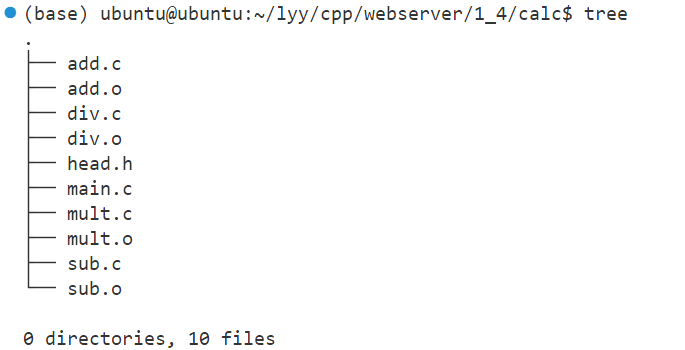

```shell
ar rcs libcalc.a add.o sub.o mult.o div.o 	// 制作库文件 libcalc.a
```

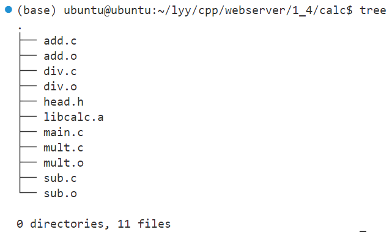

在 library 文件夹下尝试使用静态库：

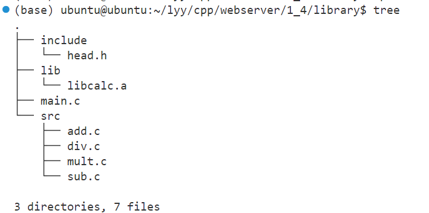

直接编译链接 main.c 文件，报错找不到头文件，使用 `-I` 参数指定头文件目录

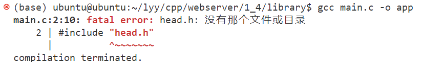

能够找到头文件，但是找不到定义的函数，使用 `-L` 和 `-l` 参数指定库和库路径。

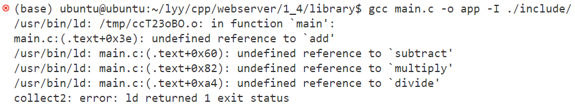

成功执行程序。

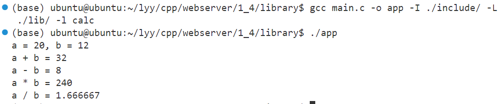

## 动态库

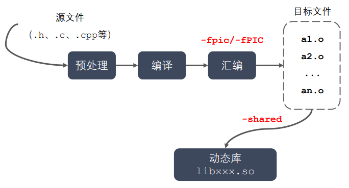

- gcc 在进行链接的时候，动态库的代码不会被打包到可执行程序中，而是在程序启动后，当调用了动态库中的 API 时，动态库会被动态加载到内存中。
- 当系统加载动态库时，不仅需要知道库的名字，还需要知道库的绝对路径。
- 系统的 **动态载入器** 可以获取动态库的绝对路径。对于 elf 格式的可执行程序来说，`ld-linux.so` 承担动态载入器的角色。它先后搜索 elf 文件的 **`DT_RPATH` 段**（一般不访问）、**环境变量 `LD_LIBRARY_PATH`**、**`/etc/ld.so.cache` 文件列表**、**`/lib/` 和 `/usr/lib/` 目录** 来寻找库文件，并将其载入内存。
- elf 文件是一种用于二进制文件、可执行文件、目标代码、共享库和核心转储格式文件的文件格式。

- 通过 `ldd` (list dynamic dependencies) 命令可以检查动态库依赖关系。

### 1. 库文件命名规则

linux：libxxx.so （在 linux 下是一个可执行文件）

windows：libxxx.dll

### 2. 动态库的制作

- gcc 获取 .o 文件（要求是 **与位置无关** 的代码）

  ```shell
  gcc -c -fpic/-fPIC a.c b.c 	# -fpic/-fPIC 生成与位置无关的代码
  ```

- gcc 制作动态库

  ```shell
  gcc -shared a.o b.o -o libcalc.so
  ```

### 3. 动态库的使用 - 例子

现有四个程序分别实现加减乘除，将它们制作成一个动态库，库名为 `calc`，库文件名为 `libcalc.so`。

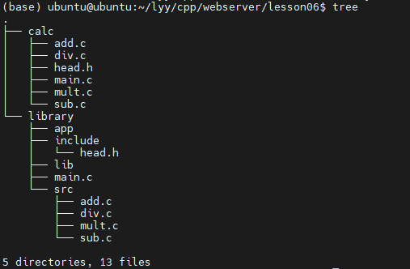

```
gcc -c -fpic/-fPIC add.c sub.c mult.c div.c 	// 生成 .o 文件
```

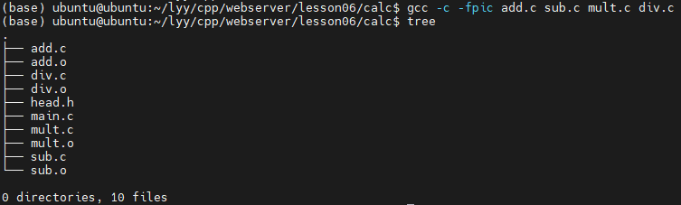

```
gcc shared *.o -o libcalc.so 	// 制作库文件 libcalc.so
```

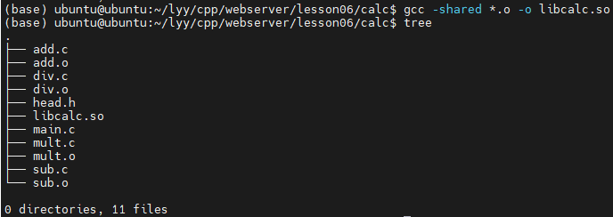

尝试在 `main.c` 程序中使用动态库：

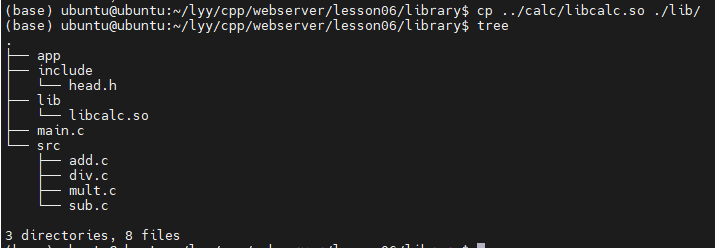

直接编译链接 main.c 文件，报错找不到头文件，使用 `-I` 参数指定头文件目录

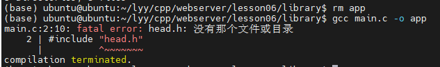

能够找到头文件，但是找不到定义的函数，使用 `-L` 和 `-l` 参数指定库和库路径。

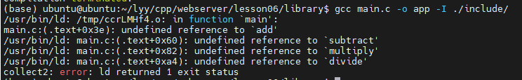

成功编译程序，但是运行失败。

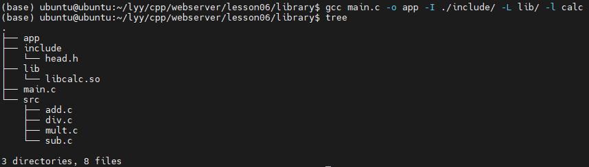

编译时不会报错（因为编译时不连接动态库），但是运行时报错找不到动态库。

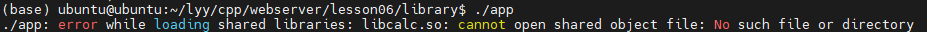

通过 `ldd` 命令查看可执行程序的依赖关系：

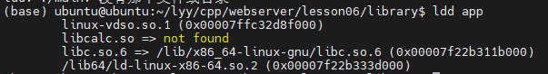

为了解决这个问题，要在 **动态载入器** 的搜索范围内 **增加动态库的绝对地址**：

```shell
# 1. 在 LD_LIBRARY_PATH 中添加库文件的绝对路径
## a. expert 配置环境变量 （export 配置环境变量仅在当前终端有效）
export LD_LIBRARY_PATH=$LD_LIBRARY_PATH:/home/ubuntu/lyy/cpp/webserver/lesson06/library/lib
# $LD_LIBRARY_PATH: 表示在这之后添加新路径

## b. 用户级别修改 （在.bashrc 中的修改在 用户 级别是永久的）
vim .bashrc 	# 末尾增加 "export LD_LIBRARY_PATH=$LD_LIBRARY_PATH:/home/ubuntu/lyy/cpp/webserver/lesson06/library/lib"
. .bashrc / source .bashrc

## c. 系统级别修改 （在 /etc/profile 中的修改在 系统 级别是永久的）
sudo vim /etc/profile 	# 末尾增加 "export LD_LIBRARY_PATH=$LD_LIBRARY_PATH:/home/ubuntu/lyy/cpp/webserver/lesson06/library/lib"
sudo source /etc/profile


# 2. 在 /etc/ld.so.cache 中增加（不能直接访问，在 /etc/ld.so.conf.d 中增加）
sudo vim /etc/ld.so.conf.d 	# 直接在末尾增加路径 "/home/ubuntu/lyy/cpp/webserver/lesson06/library/lib"
sudo ldconfig


# 3. 直接把动态库文件放到 /lib/ huo /usr/lib/ 目录下 （不建议，这两个目录下存在很多系统自带的库文件，防止重名覆盖）
```

在增加动态库文件的绝对路径后，可以看到该库文件被正常加载到内存中了。

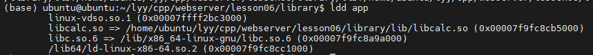

app 可执行程序可以正常执行了。

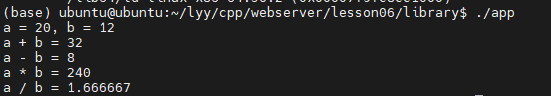

## 静态库和动态库的对比

### 1. 静态库的优缺点

**优点：**

- 静态库链接阶段被打包到可执行程序中，所以程序运行时加载快。
- 发布程序不需要提供静态库，移植方便。

**缺点：**

- 消耗系统资源，浪费内存。（可能多处复制）
- 更新、部署、发布麻烦。（需要重新编译）

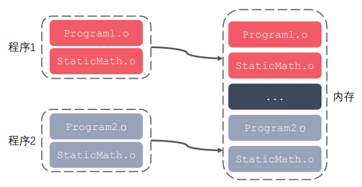

### 2. 动态库的优缺点

**优点：**

- 可以实现进程间资源共享（动态库时共享库）
- 更新、部署、发布简单。（不需要重新编译）
- 可以控制何时加载动态库。

**缺点：**

- 加载速度较慢。
- 发布程序时需要提供依赖的动态库。（可执行程序执行时需要动态库，而静态库已经包含在程序中了）

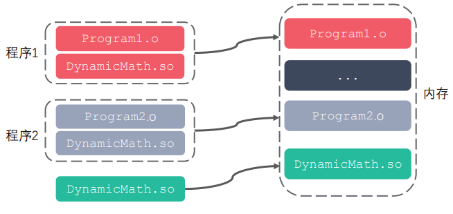

# Makefile

- Makefile 文件定义了一系列的规则来指定哪些文件需要先编译，哪些文件需要后编 译，哪些文件需要重新编译，甚至于进行更复杂的功能操作，因为 Makefile 文件就 像一个 Shell 脚本一样，也可以执行操作系统的命令。
- 自动化编译。一旦写好，只需要一个 make 命令，整 个工程完全自动编译，极大的提高了软件开发的效率。
- make 是一个命令工具，是一个 解释 Makefile 文件中指令的命令工具。

## 简单的 Makfile

- 文件命名：makefile 或 Makefile

- 规则：一个 Makefile 文件中可以有一个或多个规则。但是 **Makefile 中的其他规则一般都是为第一条规则服务的**。

  <div align=left></div>

  - 目标：最终要生成的 **文件**（伪目标除外）
  - 依赖：生成目标所需要的文件或目标
  - 命令：通过执行命令对依赖操作生成目标（必须有 Tab 缩进）

### 1. 例子

现有四个程序分别实现加减乘除和一个使用加减乘除的程序 `main.c`，现在编写一个makefile，用 make 实现编译。

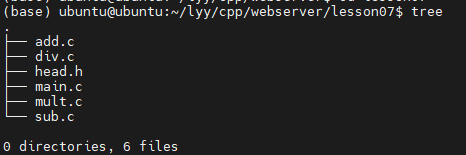

编写 Makefile 文件

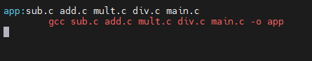

执行 make

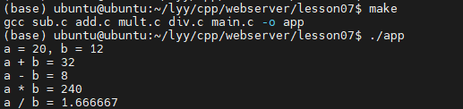

## Makefile 工作原理


- 命令在执行之前，首先会检查规则中的依赖是否存在。如果不存在，则向下检查其他规则；如果存在，则指直接执行命令。==**与第一条规则没有任何关系的规则不会执行！**==

- 检查更新。在执行规则的命令时，会比较目标和依赖文件的时间。如果依赖的时间比目标的时间晚，则会重新执行命令生成目标；如果依赖的时间比目标的时间早，则不进行更新。

- clean 规则：将 clean 文件设置成 **伪文件**，避免与其他名为 clean 的文件冲突。clean 规则不需要依赖。

  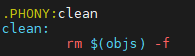

Makefile：

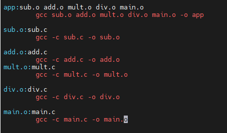

命令执行：

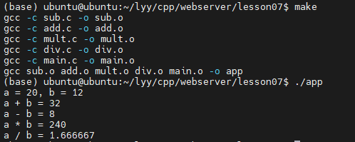

检查更新：（这种写法可以优于例子中的写法，因为检查更新的存在）

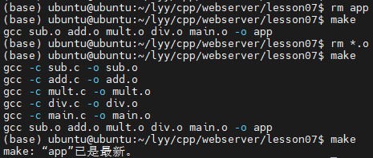

## Makefile 的变量

### 1. 自定义变量

- ```makefile
  变量名=变量值 	# var=hello
  ```

  

### 2. 预定义变量

- AR：归档维护程序的名称，默认值为 ar；
- CC：C 编译器的名称，默认值为 cc；
- CXX：C++ 编译器的名称，默认值为 g++；
- $@：目标的完整名称；
- $<：第一个依赖文件的名称（不带后缀）；
- $^：所有的依赖文件；

### 3. 获取变量的值

- ```makefile
  $(变量名) 	# $(var)
  ```

## Makefile 的模式匹配

```makefile
%.o:%.c
```

- %：通配符，匹配一个字符串；
- 一个规则中的两个或多个 % 匹配的是同一个字符串；


# Makefile 的函数

**1. `wildcard`**

```makefile
$(wildcard PATTERN...) 	# (函数名 参数)
```

- 获取指定目录下指定类型的文件列表，返回一个文件列表（空格间隔）

- 参数 PATTERN 指的是某个或多个目录下的对应的某种类型的文件，如果有多个目录，一般使用空格间隔

- e.g.

  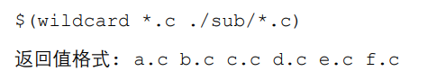


**2. `patsubst`**

```makefile
$(patsubst <pattern>,<replacement>,<text>)
```

- 查找 `<text>` 中的单词（以 空格/Tab/回车/换行 分隔）是否符合模式 `<pattern>`，如果符合，则用 `<replacement>` 替换，返回被替换后的字符串；

- `<pattern>` 可以包括通配符 '%' 表示任意长度的字符串（'\%' 代表 '%'），若 `<replacement>` 也含有 '%'，那么它们表示的是同一个字符串；

- e.g.

  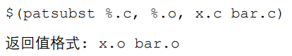

## 简化的 Makefile

简化前的 Makefile（两种写法）：


用变量简化后：

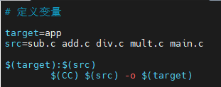

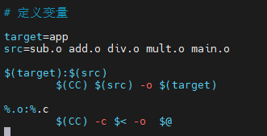

编译执行：

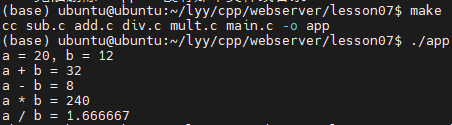

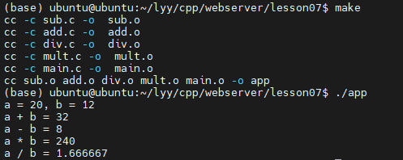

用函数简化 Makefile 后：

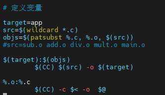

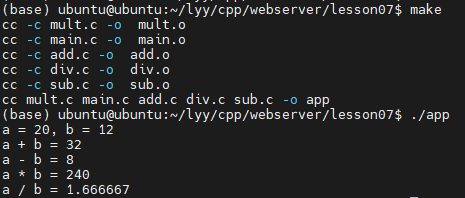

增加 clean 规则删除中间生成的 .o 文件。

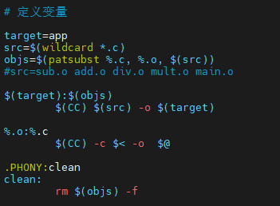

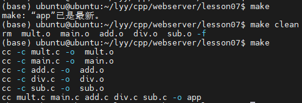

# GDB

- GDB 是由 GNU 软件系统社区提供的调试工具，同 GCC 配套组成了一套完整的开发环 境，GDB 是 Linux 和许多类 Unix 系统中的标准开发环境。

- 一般来说，GDB 主要帮助你完成下面四个方面的功能： 

  - 启动程序，可以按照自定义的要求随心所欲的运行程序
  - 可让被调试的程序在所指定的调置的断点处停住（断点可以是条件表达式） 
  - 当程序被停住时，可以检查此时程序中所发生的事
  - 可以改变程序，将一个 BUG 产生的影响修正从而测试其他 BUG

- 通常，在为调试而编译时，我们会（）关掉编译器的优化选项（`-O`）， 并打开调 试选项（`-g`）。另外，`-Wall`在尽量不影响程序行为的情况下选项打开所有 warning，也可以发现许多问题，避免一些不必要的 BUG。

  ```makefile
  gcc -g -Wall program.c -o program 	# `-g` 选项的作用是在可执行文件中加入源代码的信息，比如可执行文件中第几条机器指令对应源代码的第几行，但并不是把整个源文件嵌入到可执行文件中，所以在调试时必须保证 gdb 能找到源文件。
  ```


## GDB 常用命令

### 1. 启动和退出

```shell
gdb 可执行程序名 	# gdb main
quit
```

### 2. 给程序设置命令行参数 / 获取设置的命令行参数

```shell
set args 10 20
show args
```

### 3. gdb 使用帮助

```shell
help
```

### 4. 查看当前文件代码

```shell
# 查看当前文件代码
list/l （从默认位置显示）
list/l 行号 （从指定的行显示）
list/l 函数名（从指定的函数显示）

# 查看非当前文件代码
list/l 文件名:行号
list/l 文件名:函数名
```

### 5. 设置显示的行数

```shell
show list/listsize
set list/listsize 行数
```

### 6. 断点

```shell
# 设置断点
b/break 行号
b/break 函数名
b/break 文件名:行号
b/break 文件名:函数

# 查看断点
i/info b/break

# 删除断点
d/del/delete 断点编号

# 设置断点无效
dis/disable 断点编号

# 设置断点生效
ena/enable 断点编号

# 设置条件断点（一般用在循环的位置）
b/break 10 if i==5
```

### 7. 运行

```shell
# 运行GDB程序
start（程序停在第一行）
run（遇到断点才停）

# 继续运行，到下一个断点停
c/continue

# 向下执行一行代码（不会进入函数体）
n/next

# 向下单步调试（遇到函数进入函数体）
s/step
finish（跳出函数体）
```

### 8. 查看变量

```shell
# 变量操作
p/print 变量名（打印变量值）
ptype 变量名（打印变量类型）

# 其它操作
set var 变量名=变量值 （循环中用的较多）
until （跳出循环）
```

# 文件 IO

## 1. 标准 C 库 IO 函数 与 linux 系统 IO 的关系

标准 C 库 IO 函数通过 FILE 文件指针进行文件操作。

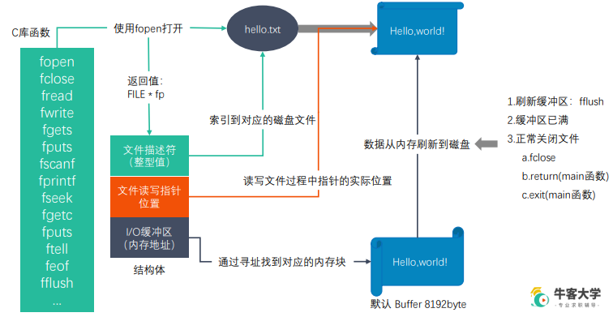

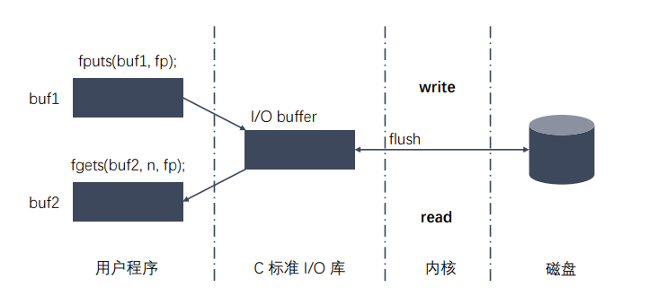

## 2. 虚拟地址空间

**以 32 位计算机为例：**

32 位计算机会为每个进程分配 4G 的虚拟地址空间，包括内核区（只能通过 **系统调用** 进行操作）和用户区。虚拟地址空间最终会被 MMU 映射到物理地址空间。

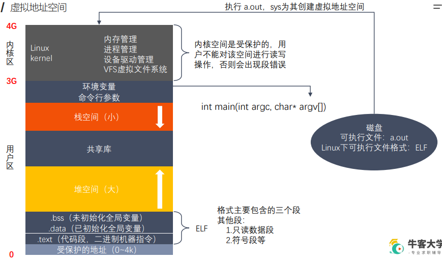

## 3. 文件描述符

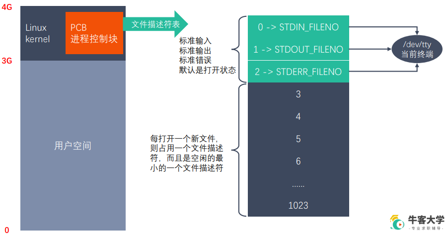

- **文件描述符表** 被保存在进程的内核区，由内核区内的 **PCB 进程控制块** 维护。
- 文件描述符表是一个数组，大小默认是 1024（每个进程默认最多可以同时打开 1024 个文件）。
- 文件描述符表中：0（标准输入）、1（标准输出）、2（标准错误），默认打开，指向当前终端。
- **一个文件可以被同时打开 n 次，每次打开得到的文件描述符是不一样的。**

## 4. `open` 函数

查看 `open` 函数：

```shell
man 2 open
```


头文件：

```c
#include <sys/types.h>
#include <sys/stat.h>
#include <fcntl.h>
```


有两个 `open` 函数，一个用来打开已经存在的文件，一个用来创建新的文件。

```c
int open(const char *pathname, int flags);
/*
参数：
    - pathname：文件路径
    - flags：对文件操作的权限设置及其他（O_RDONLY 只读, O_WRONLY 只写, or O_RDWR 读写，只能选一个）
  返回值：
    - 一个新的文件描述符（若调用失败，返回 -1）
*/
```

```c
int open(const char *pathname, int flags, mode_t mode);
/*
  参数：
    - pathname：要创建的文件的路径
    - flags：对文件操作的权限设置及其他设置
      - 必选项（互斥，必须选一个）：O_RDONLY 只读, O_WRONLY 只写, or O_RDWR 读写；
      - 可选项：O_APPEND 追加，O_CREAT 文件不存在则创建
    - mode：八进制数，表示用户对创建的新文件的操作权限，最终的权限为 mode & ~umask。e.g. 0777（最高权限）
  返回值：新创建文件的文件描述符
*/
```


e.g.

```c
/*
#include <sys/types.h>
#include <sys/stat.h>
#include <fcntl.h>

// 打开一个已经存在的文件
int open(const char *pathname, int flags);
  参数：
    - pathname：文件路径
    - flags：对文件操作的权限设置及其他（O_RDONLY 只读, O_WRONLY 只写, or O_RDWR 读写，只能选一个）
  返回值：
    - 一个新的文件描述符（若调用失败，返回 -1）
*/

/*
#include <unistd.h>

int close(int fd);  //关闭文件，并使得文件描述符可以被再次使用
  参数：
    - fd：要关闭的文件描述符
*/

/*
errno：属于 linux 系统函数库，是一个全局变量，记录最近的错误号。可以调用 perror 函数获取错误号对应的错误描述。

#include <stdio.h>

void perror(const char *s);     // 打印 errno 对应的错误描述，没有返回值。
  参数：
    - 用户描述（最后打印为 s:错误描述）
*/

#include <sys/types.h>
#include <sys/stat.h>
#include <fcntl.h>
#include <stdio.h>
#include <unistd.h>

int main()
{
    int fd = open("a.txt", O_RDONLY);

    if(fd == -1)
    {
        perror("open");     // print error desc
    } 

    // close file desc
    close(fd);
}
```

运行结果：

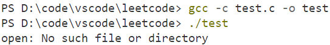

```c
/*
#include <sys/types.h>
#include <sys/stat.h>
#include <fcntl.h>

// 创建一个新文件，并打开
int open(const char *pathname, int flags, mode_t mode);
  参数：
    - pathname：要创建的文件的路径
    - flags：对文件操作的权限设置及其他设置
      - 必选项（互斥，必须选一个）：O_RDONLY 只读, O_WRONLY 只写, or O_RDWR 读写；
      - 可选项：O_APPEND 追加，O_CREAT 文件不存在则创建
    - mode：八进制数，表示用户对创建的新文件的操作权限，最终的权限为 mode & ~umask。e.g. 0777（最高权限）
  返回值：新创建文件的文件描述符
*/

/*
#include <unistd.h>

int close(int fd);  //关闭文件，并使得文件描述符可以被再次使用
  参数：
    - fd：要关闭的文件描述符
*/

/*
errno：属于 linux 系统函数库，是一个全局变量，记录最近的错误号。可以调用 perror 函数获取错误号对应的错误描述。

#include <stdio.h>

void perror(const char *s);     // 打印 errno 对应的错误描述，没有返回值。
  参数：
    - 用户描述（最后打印为 s:错误描述）
*/

#include <sys/types.h>
#include <sys/stat.h>
#include <fcntl.h>
#include <stdio.h>
#include <unistd.h>

int main()
{
    int fd = open("a.txt", O_RDWR | O_CREAT, 0777);

    if(fd == -1)
    {
        perror("open");     // print error desc
    } 

    // close file desc
    close(fd);
}
```

### 5. read 和 write

read:

```c
ssize_t read(int fd, void *buf, size_t count);
/*  
参数：
    - fd：文件描述符
    - buf：缓冲区
    - count：指定的 buf 数组的大小
  返回值：
    - 调用成功，返回读取的字节数（字节数为 0, 表示文件读取完毕）；调用失败，返回 -1，并且设置 errno。
*/
```

write:

```c
ssize_t write(int fd, const void *buf, size_t count);
/*
参数：
    - fd：文件描述符
    - buf：缓冲区
    - count：要写入的数据大小
  返回值：
    - 调用成功，返回写入的字节数（字节数为 0, 表示文件读取完毕）；调用失败，返回 -1，并且设置 errno。
*/
```


```c
/**
#include <unistd.h>

ssize_t read(int fd, void *buf, size_t count);
  参数：
    - fd：文件描述符
    - buf：缓冲区
    - count：指定的 buf 数组的大小
  返回值：
    - 调用成功，返回读取的字节数（字节数为 0, 表示文件读取完毕）；调用失败，返回 -1，并且设置 errno。
*/

/*
#include <unistd.h>

ssize_t write(int fd, const void *buf, size_t count);
参数：
    - fd：文件描述符
    - buf：缓冲区
    - count：要写入的数据大小
  返回值：
    - 调用成功，返回写入的字节数（字节数为 0, 表示文件读取完毕）；调用失败，返回 -1，并且设置 errno。

*/

#include <unistd.h>
#include <stdio.h>
#include <sys/types.h>
#include <sys/stat.h>
#include <fcntl.h>

int main()
{
    // 打开要读取的文件
    int srcfd = open("english.txt", O_RDONLY);
    if(srcfd == -1)
    {
        perror("open");
        return -1;
    }

    // 创建并打开要写入的文件
    int desfd = open("cpy.txt", O_RDWR |O_CREAT, 0777);
    if(desfd == -1)
    {
        perror("open");
        return -1;
    }

    // 创建缓冲区
    char buf[1024] = {0};

    int len = 0;
    while((len=read(srcfd, buf, sizeof(buf))) > 0)  // 只要还没读完，就一直写入
    {
        write(desfd, buf, len);     // 读入多少 len 写入多少 len
    }

    // 关闭文件
    close(srcfd);
    close(desfd);
    return 0;
}
```

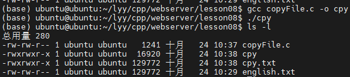

### 6. lseek

