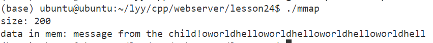
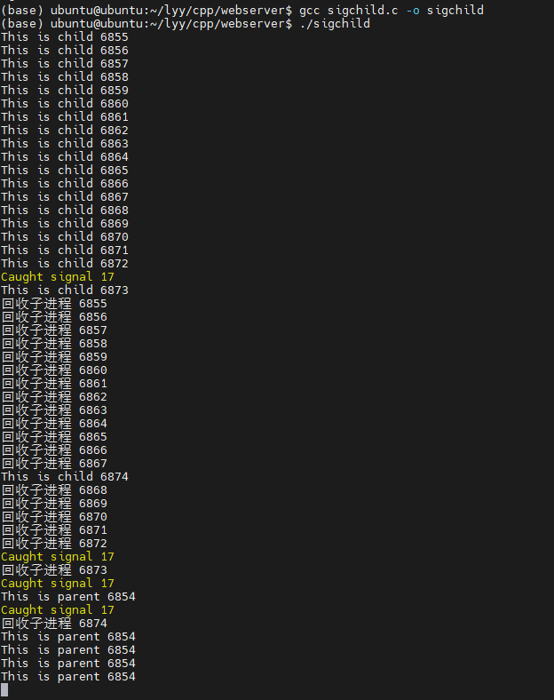

# gcc

GCC 原名 GNU C 语言编译器（GNU C Compiler），只能处理 C 语言。但其很快扩展，变得可处理 C++，后来又扩展为能够支持更多编程语言，如 Pascal、Objective -C、Java、Go 以及各类处理器架构上的汇编语言等，所以改名 GNU 编译器套件（GNU Compiler Collection）。


## gcc 和 g++ 的区别

- gcc 和 g++ 都是 GNU 的 **编译器**；
- gcc 和 g++ 都可以编译 c 代码和 c++ 代码。但是：
  - 后缀为 .c 的程序，**gcc 认为其是 c 程序， g++ 认为其是 c++ 程序**；
  - 后缀为 .cpp 的程序，gcc 和 g++ 都认为其是 c++ 程序；
  - 编译阶段，g++ 会调用 gcc。所以对于 c++ 代码来说，gcc 和 g++ 是等价的；但是因为 **gcc 不能自动和 c++ 程序使用的库链接，需要 g++ 来完成链接**，所以为了统一起见，干脆 **编译和链接 c++ 程序都使用 g++** 了，但实际上，**编译调用的是 gcc**。
- 编译可以使用 gcc / g++，链接可以使用 g++ / gcc -lstdc++（用 c++ 的标准进行链接）。gcc 不能自动和 c++ 程序使用的库链接，需要 g++ 来完成链接；g++ 编译的时候会调用 gcc。
- `__cpluscplus`：宏。标志着编译器将代码当做 c 代码来解释还是当作 c++ 代码来解释。
  - 如果程序后缀为 .c，并且采用 gcc 编译器，那么编译器认为这是 c 代码，所以该宏是未定义的；
  - 如果编译器认为这是 c++ 代码，那么该宏就可以被定义。


## gcc 使用


- 预处理后源代码：删去注释、宏替换等
- **`-o` 本质上是一个重命名选项，直接执行 `gcc test.c` 也会生成可执行文件 `a.out`**。
- **当只有一个目标代码时，`-o`可有可无。**

```shell
gcc test.c -E -o test.i 	# 生成预处理后文件 test.i， -E 预处理 -o 生成目标文件

gcc test.i -S -o test.s 	# 生成编译后文件 test.s， -S 编译 -o 生成目标文件

gcc test.s -c -o test.o 	# 生成汇编后文件 test.o， -S 编译 -o 生成目标文件

gcc test.o -o test.out 		# 生成链接后文件 test.out， -o 生成目标文件


# gcc file_name.c -o target_name 将 file_name.c 编译成可执行文件（可执行文件名为 target_name）
gcc test.c -o test

# gcc 要生成 test 可执行文件，需要用到 test.c 文件
gcc -o test test.c

# gcc file_name.c 将 file_name.c 编译成可执行文件（默认可执行文件名为 a.out）
gcc filename.c

# 运行可执行文件
./target_name
./a.out 	# linux 默认的可执行文件名
```

- **`-I` 指定头文件目录**
- **`-L` 指定库路径**
- **`-l` 指定库**

- **`-D` 调试，与宏搭配使用。**

```c
// test.c
# include <stdio.h>

main()
{
    printf("hello world\n");
    #ifdef DEBUG
    printf("DEBUGING...");
    #endif
}

// gcc test.c -o test
// hello world

// gcc test.c -o test -D DEBUG
// hello world
// DEBUGING...

// 等价于
// test.c
# include <stdio.h>
# define DENUG 	// 定义一个宏
main()
{
    printf("hello world\n");
    #ifdef DEBUG 	// 若该宏被定义，则执行这部分代码
    printf("DEBUGING...");
    #endif
}
```

<hr style="border:3px #6CA6CD double;">


# 静态库和动态库

## 库文件

- 计算机上的一类文件，可以简单地把库文件看成一种代码仓库，它提供给使用者一些可以直接拿来用的变量、函数或类。
- 库是一种特殊的程序，编写上和一般地程序没有较大的区别，但是不能单独运行。
- 库文件有两种“静态库和动态库（共享库）。
  - 静态库：在程序的  **链接阶段** 被 **复制** 到程序中；（一般比较小）
  - 动态库：在程序的链接阶段没有被复制到程序中，在程序的 **运行阶段**（调用动态库 api 时）由系统 **动态加载到内存中供程序调用**，通过 ldd (list dynamic depencencies) 命令检查动态库依赖关系。（一般比较大）
- 库的好处：①代码保密。②方便部署和开发。
- 库文件要和头文件（说明库中 api）一起分发。


**程序编译成可执行程序的过程：**


## 静态库


- 静态库在链接阶段会被打包复制到可执行程序中。

### 1. 库文件命名规则

- linux：libxxx.a
- windows：libxxx.lib

### 2. 静态库的制作

- gcc 获取 .o 文件

- 将 .o 文件打包（使用 ar 工具，archive）

  ```shell
  ar rsc libxxx.a xxx.o xxx.o 	// ar rsc 库名 .o文件们
  ```

  r - 将文件插入到备存文件中

  c - 建立备存文件

  s - 索引

### 3. 静态库的使用 - 例子

现有四个程序分别实现加减乘除，将它们制作成一个静态库，库名为 `calc`，库文件名为 `libcalc.a`。


```shell
gcc -c add.c sub.c mult.c div.c 	// 生成 .o 文件
```


```shell
ar rcs libcalc.a add.o sub.o mult.o div.o 	// 制作库文件 libcalc.a
```


在 library 文件夹下尝试使用静态库：


直接编译链接 main.c 文件，报错找不到头文件，使用 `-I` 参数指定头文件目录


能够找到头文件，但是找不到定义的函数，使用 `-L` 和 `-l` 参数指定库和库路径。


成功执行程序。


## 动态库


- gcc 在进行链接的时候，动态库的代码不会被打包到可执行程序中，而是在程序启动后，当调用了动态库中的 API 时，动态库会被动态加载到内存中。
- 当系统加载动态库时，不仅需要知道库的名字，还需要知道库的绝对路径。
- 系统的 **动态载入器** 可以获取动态库的绝对路径。对于 elf 格式的可执行程序来说，`ld-linux.so` 承担动态载入器的角色。它先后搜索 elf 文件的 **`DT_RPATH` 段**（一般不访问）、**环境变量 `LD_LIBRARY_PATH`**、**`/etc/ld.so.cache` 文件列表**、**`/lib/` 和 `/usr/lib/` 目录** 来寻找库文件，并将其载入内存。
- elf 文件是一种用于二进制文件、可执行文件、目标代码、共享库和核心转储格式文件的文件格式。

- 通过 `ldd` (list dynamic dependencies) 命令可以检查动态库依赖关系。

### 1. 库文件命名规则

linux：libxxx.so （在 linux 下是一个可执行文件）

windows：libxxx.dll

### 2. 动态库的制作

- gcc 获取 .o 文件（要求是 **与位置无关** 的代码）

  ```shell
  gcc -c -fpic/-fPIC a.c b.c 	# -fpic/-fPIC 生成与位置无关的代码
  ```

- gcc 制作动态库

  ```shell
  gcc -shared a.o b.o -o libcalc.so
  ```

### 3. 动态库的使用 - 例子

现有四个程序分别实现加减乘除，将它们制作成一个动态库，库名为 `calc`，库文件名为 `libcalc.so`。


```
gcc -c -fpic/-fPIC add.c sub.c mult.c div.c 	// 生成 .o 文件
```


```
gcc shared *.o -o libcalc.so 	// 制作库文件 libcalc.so
```


尝试在 `main.c` 程序中使用动态库：


直接编译链接 main.c 文件，报错找不到头文件，使用 `-I` 参数指定头文件目录


能够找到头文件，但是找不到定义的函数，使用 `-L` 和 `-l` 参数指定库和库路径。


成功编译程序，但是运行失败。


编译时不会报错（因为编译时不连接动态库），但是运行时报错找不到动态库。


通过 `ldd` 命令查看可执行程序的依赖关系：


为了解决这个问题，要在 **动态载入器** 的搜索范围内 **增加动态库的绝对地址**：

```shell
# 1. 在 LD_LIBRARY_PATH 中添加库文件的绝对路径
## a. expert 配置环境变量 （export 配置环境变量仅在当前终端有效）
export LD_LIBRARY_PATH=$LD_LIBRARY_PATH:/home/ubuntu/lyy/cpp/webserver/lesson06/library/lib
# $LD_LIBRARY_PATH: 表示在这之后添加新路径

## b. 用户级别修改 （在.bashrc 中的修改在 用户 级别是永久的）
vim .bashrc 	# 末尾增加 "export LD_LIBRARY_PATH=$LD_LIBRARY_PATH:/home/ubuntu/lyy/cpp/webserver/lesson06/library/lib"
. .bashrc / source .bashrc

## c. 系统级别修改 （在 /etc/profile 中的修改在 系统 级别是永久的）
sudo vim /etc/profile 	# 末尾增加 "export LD_LIBRARY_PATH=$LD_LIBRARY_PATH:/home/ubuntu/lyy/cpp/webserver/lesson06/library/lib"
sudo source /etc/profile


# 2. 在 /etc/ld.so.cache 中增加（不能直接访问，在 /etc/ld.so.conf.d 中增加）
sudo vim /etc/ld.so.conf.d 	# 直接在末尾增加路径 "/home/ubuntu/lyy/cpp/webserver/lesson06/library/lib"
sudo ldconfig


# 3. 直接把动态库文件放到 /lib/ huo /usr/lib/ 目录下 （不建议，这两个目录下存在很多系统自带的库文件，防止重名覆盖）
```

在增加动态库文件的绝对路径后，可以看到该库文件被正常加载到内存中了。


app 可执行程序可以正常执行了。


## 静态库和动态库的对比

### 1. 静态库的优缺点

**优点：**

- 静态库链接阶段被打包到可执行程序中，所以程序运行时加载快。
- 发布程序不需要提供静态库，移植方便。

**缺点：**

- 消耗系统资源，浪费内存。（可能多处复制）
- 更新、部署、发布麻烦。（需要重新编译）


### 2. 动态库的优缺点

**优点：**

- 可以实现进程间资源共享（动态库时共享库）
- 更新、部署、发布简单。（不需要重新编译）
- 可以控制何时加载动态库。

**缺点：**

- 加载速度较慢。
- 发布程序时需要提供依赖的动态库。（可执行程序执行时需要动态库，而静态库已经包含在程序中了）


<hr style="border:3px #6CA6CD double;">

# Makefile

- Makefile 文件定义了一系列的规则来指定哪些文件需要先编译，哪些文件需要后编译，哪些文件需要重新编译，甚至于进行更复杂的功能操作，因为 Makefile 文件就 像一个 Shell 脚本一样，也可以执行操作系统的命令。
- 自动化编译。一旦写好，只需要一个 make 命令，整 个工程完全自动编译，极大的提高了软件开发的效率。
- make 是一个命令工具，是一个 解释 Makefile 文件中指令的命令工具。

## 简单的 Makfile

- 文件命名：makefile 或 Makefile

- 规则：一个 Makefile 文件中可以有一个或多个规则。但是 **Makefile 中的其他规则一般都是为第一条规则服务的**。

  <div align=left></div>

  - 目标：最终要生成的 **文件**（伪目标除外）
  - 依赖：生成目标所需要的文件或目标
  - 命令：通过执行命令对依赖操作生成目标（必须有 Tab 缩进）

### 1. 例子

现有四个程序分别实现加减乘除和一个使用加减乘除的程序 `main.c`，现在编写一个makefile，用 make 实现编译。


编写 Makefile 文件


执行 make


## Makefile 工作原理


- 命令在执行之前，首先会检查规则中的依赖是否存在。如果不存在，则向下检查其他规则；如果存在，则指直接执行命令。==**与第一条规则没有任何关系的规则不会执行！**==

- 检查更新。在执行规则的命令时，会比较目标和依赖文件的时间。如果依赖的时间比目标的时间晚，则会重新执行命令生成目标；如果依赖的时间比目标的时间早，则不进行更新。

- clean 规则：将 clean 文件设置成 **伪文件**，避免与其他名为 clean 的文件冲突。clean 规则不需要依赖。

  

Makefile：


命令执行：


检查更新：（这种写法可以优于例子中的写法，因为检查更新的存在）


## Makefile 的变量

### 1. 自定义变量

- ```makefile
  变量名=变量值 	# var=hello
  ```

  

### 2. 预定义变量

- AR：归档维护程序的名称，默认值为 ar；
- CC：C 编译器的名称，默认值为 cc；
- CXX：C++ 编译器的名称，默认值为 g++；
- $@：目标的完整名称；
- $<：第一个依赖文件的名称（不带后缀）；
- $^：所有的依赖文件；

### 3. 获取变量的值

- ```makefile
  $(变量名) 	# $(var)
  ```

## Makefile 的模式匹配

```makefile
%.o:%.c
```

- %：通配符，匹配一个字符串；
- 一个规则中的两个或多个 % 匹配的是同一个字符串；


# Makefile 的函数

**1. `wildcard`**

```makefile
$(wildcard PATTERN...) 	# (函数名 参数)
```

- 获取指定目录下指定类型的文件列表，返回一个文件列表（空格间隔）

- 参数 PATTERN 指的是某个或多个目录下的对应的某种类型的文件，如果有多个目录，一般使用空格间隔

- e.g.

  


**2. `patsubst`**

```makefile
$(patsubst <pattern>,<replacement>,<text>)
```

- 查找 `<text>` 中的单词（以 空格/Tab/回车/换行 分隔）是否符合模式 `<pattern>`，如果符合，则用 `<replacement>` 替换，返回被替换后的字符串；

- `<pattern>` 可以包括通配符 '%' 表示任意长度的字符串（'\%' 代表 '%'），若 `<replacement>` 也含有 '%'，那么它们表示的是同一个字符串；

- e.g.

  

## 简化的 Makefile

简化前的 Makefile（两种写法）：


用变量简化后：


编译执行：


用函数简化 Makefile 后：


增加 clean 规则删除中间生成的 .o 文件。


<hr style="border:3px #6CA6CD double;">

# GDB

- GDB 是由 GNU 软件系统社区提供的调试工具，同 GCC 配套组成了一套完整的开发环 境，GDB 是 Linux 和许多类 Unix 系统中的标准开发环境。

- 一般来说，GDB 主要帮助你完成下面四个方面的功能： 

  - 启动程序，可以按照自定义的要求随心所欲的运行程序
  - 可让被调试的程序在所指定的调置的断点处停住（断点可以是条件表达式） 
  - 当程序被停住时，可以检查此时程序中所发生的事
  - 可以改变程序，将一个 BUG 产生的影响修正从而测试其他 BUG

- 通常，在为调试而编译时，我们会（）关掉编译器的优化选项（`-O`）， 并打开调 试选项（`-g`）。另外，`-Wall`在尽量不影响程序行为的情况下选项打开所有 warning，也可以发现许多问题，避免一些不必要的 BUG。

  ```makefile
  gcc -g -Wall program.c -o program 	# `-g` 选项的作用是在可执行文件中加入源代码的信息，比如可执行文件中第几条机器指令对应源代码的第几行，但并不是把整个源文件嵌入到可执行文件中，所以在调试时必须保证 gdb 能找到源文件。
  ```


## GDB 常用命令

### 1. 启动和退出

```shell
gdb 可执行程序名 	# gdb main
quit
```

### 2. 给程序设置命令行参数 / 获取设置的命令行参数

```shell
set args 10 20
show args
```

### 3. gdb 使用帮助

```shell
help
```

### 4. 查看当前文件代码

```shell
# 查看当前文件代码
list/l （从默认位置显示）
list/l 行号 （从指定的行显示）
list/l 函数名（从指定的函数显示）

# 查看非当前文件代码
list/l 文件名:行号
list/l 文件名:函数名
```

### 5. 设置显示的行数

```shell
show list/listsize
set list/listsize 行数
```

### 6. 断点

```shell
# 设置断点
b/break 行号
b/break 函数名
b/break 文件名:行号
b/break 文件名:函数

# 查看断点
i/info b/break

# 删除断点
d/del/delete 断点编号

# 设置断点无效
dis/disable 断点编号

# 设置断点生效
ena/enable 断点编号

# 设置条件断点（一般用在循环的位置）
b/break 10 if i==5
```

### 7. 运行

```shell
# 运行GDB程序
start（程序停在第一行）
run（遇到断点才停）

# 继续运行，到下一个断点停
c/continue

# 向下执行一行代码（不会进入函数体）
n/next

# 向下单步调试（遇到函数进入函数体）
s/step
finish（跳出函数体）
```

### 8. 查看变量

```shell
# 变量操作
p/print 变量名（打印变量值）
ptype 变量名（打印变量类型）

# 其它操作
set var 变量名=变量值 （循环中用的较多）
until （跳出循环）
```

## GDB 多进程调试

- GDB 默认跟踪父进程，子进程代码直接执行。
- 设置调试父进程或子进程： `set follow-fork-mode [child | parent]`
- 设置调试模式：`set detach-on-fork [on | off]` 。默认为 on，表示调试当前进程的时候，其它的进程继续运行，如果为 off，调试当前进程的时候，其它进程被 GDB 挂起。
- 查看调试的进程：`info inferiors`（当前调试进程含有 *）
- 切换当前调试的进程：`inferior id`
- 使进程脱离 GDB 调试：`detach inferiors id`

<hr style="border:3px #6CA6CD double;">

# 文件 IO

## 1. 标准 C 库 IO 函数 与 linux 系统 IO 的关系

标准 C 库 IO 函数通过 FILE 文件指针进行文件操作。


---


## 2. c 程序在内存中的存储空间布局

### a. 内存和硬盘的区别

**硬盘：**

- 非易失存储（SSD/HDD），数据在断电/关机后不会丢失。
- 读取和写入较慢。

**内存：**

- 易失存储（RAM），数据在断电/关机后会丢失。
- 读取和写入远快于硬盘。

**程序以文件形式被保存在硬盘中，在需要使用时，内存从硬盘中加载文件，然后再交由中央处理器（CPU）处理执行。**

### b. C 程序在内存中的存储空间布局

- **正文段**。CPU 执行的机器指令部分。通常是可共享且只读的。
- **初始化数据段**，又称数据段。包含程序中需明确赋初值的变量，如，**全局变量**。
- **未初始化数据段**，称 bss 段。包含 **函数外的未初始化的变量**，如，`long sum[1000];`。在程序开始执行之前，内核将此段中的数据初始化为 0 或空指针。
- **栈**。包含自动变量（非静态或外部变量）以及每次函数调用时需要保存的信息（返回地址、调用者的环境信息）。最近被调用的函数会在栈上为其自动变量和临时变量分配存储空间。
- **堆**。动态存储分配在堆中进行。


- **只有正文段和初始化数据段需要从磁盘程序文件中读入。**未初始化的数据段不需要保存在磁盘程序文件中，因为他们会被内核初始化为 0 或空指针。

- *若定义一个局部变量为自动变量,这意味着每次执行到定义该变量都回产生一个新变量,并对他重新初始化*。


### c. 以 32 位计算机为例

32 位计算机会为每个进程分配 4G 的虚拟地址空间，包括内核区（只能通过 **系统调用** 进行操作）和用户区。虚拟地址空间最终会被 MMU 映射到物理地址空间。


---


## 3. 文件描述符


- **文件描述符表** 被保存在进程的内核区，由内核区内的 **PCB 进程控制块** 维护。
- 文件描述符表是一个数组，大小默认是 1024（每个进程默认最多可以同时打开 1024 个文件）。
- 文件描述符表中：0（标准输入）、1（标准输出）、2（标准错误），默认打开，指向当前终端。
- **一个文件可以被同时打开 n 次，每次打开得到的文件描述符是不一样的。**

---


## 4. `errno`

`errno`：属于 linux 系统函数库，是一个全局变量，**记录最近的错误号**。可以调用 `perror` 函数获取错误号对应的错误描述。

```c
/*
#include <stdio.h>

void perror(const char *s);     // 打印 errno 对应的错误描述，没有返回值。
  参数：
    - 用户描述（最后打印为 s:错误描述）
    
  作用：
    - 输出 “用户描述：错误描述”。
*/
```

---


## 5. `open` 

### a. 查看 `open` 函数

```shell
man 2 open
```


### b. 头文件

```c
#include <sys/types.h>
#include <sys/stat.h>
#include <fcntl.h>
```


### c. `open`

有两个 `open` 函数，一个用来打开已经存在的文件，一个用来创建新的文件。

```c
int open(const char *pathname, int flags);
/*
  参数：
    - pathname：文件路径
    - flags：对文件操作的权限设置及其他设置
      - 必选项（互斥，必须选一个）：O_RDONLY 只读, O_WRONLY 只写, or O_RDWR 读写；
      - 可选项：O_APPEND 追加，...
    
  返回值：
    - 调用成功，返回一个新的文件描述符；调用失败，返回 -1
  
  作用：
    - 打开文件，返回文件描述符
*/
```


```c
int open(const char *pathname, int flags, mode_t mode);
/*
  参数：
    - pathname：要创建的文件的路径
    - flags：对文件操作的权限设置及其他设置
      - 必选项（互斥，必须选一个）：O_RDONLY 只读, O_WRONLY 只写, or O_RDWR 读写；
      - 可选项：O_APPEND 追加，O_CREAT 文件不存在则创建
    - mode：八进制数，表示用户对创建的新文件的操作权限，最终的权限为 mode & ~umask。e.g. 0777（最高权限）
    
  返回值：
    - 调用成功，返回一个新的文件描述符；调用失败，返回 -1
  
  作用：
    - 创建并打开文件，返回文件描述符
*/
```


e.g.

```c
/*
#include <sys/types.h>
#include <sys/stat.h>
#include <fcntl.h>

// 打开一个已经存在的文件
int open(const char *pathname, int flags);
  参数：
    - pathname：文件路径
    - flags：对文件操作的权限设置及其他设置
      - 必选项（互斥，必须选一个）：O_RDONLY 只读, O_WRONLY 只写, or O_RDWR 读写；
      - 可选项：O_APPEND 追加，...
    
  返回值：
    - 调用成功，返回一个新的文件描述符；调用失败，返回 -1
  
  作用：
    - 打开文件，返回文件描述符
*/

#include <sys/types.h>
#include <sys/stat.h>
#include <fcntl.h>
#include <stdio.h> 	// c 标准输入输出头文件
#include <unistd.h> 	// unix 标准库头文件，包含一些常用的系统调用函数和符号常量，如 write、read、fork、exec 等，以及对文件描述符、进程控制和文件操作的定义。

int main()
{
    int fd = open("a.txt", O_RDONLY);

    if(fd == -1)
    {
        perror("open");     // print error desc
    } 

    // close file desc
    close(fd);
}
```

运行结果：


```c
/*
#include <sys/types.h>
#include <sys/stat.h>
#include <fcntl.h>

// 创建一个新文件，并打开
int open(const char *pathname, int flags, mode_t mode);
  参数：
    - pathname：要创建的文件的路径
    - flags：对文件操作的权限设置及其他设置
      - 必选项（互斥，必须选一个）：O_RDONLY 只读, O_WRONLY 只写, or O_RDWR 读写；
      - 可选项：O_APPEND 追加，O_CREAT 文件不存在则创建
    - mode：八进制数，表示用户对创建的新文件的操作权限，最终的权限为 mode & ~umask。e.g. 0777（最高权限）
    
  返回值：
    - 调用成功，返回一个新的文件描述符；调用失败，返回 -1
  
  作用：
    - 创建并打开文件，返回文件描述符
*/

#include <sys/types.h>
#include <sys/stat.h>
#include <fcntl.h>
#include <stdio.h>
#include <unistd.h>

int main()
{
    int fd = open("a.txt", O_RDWR | O_CREAT, 0777);

    if(fd == -1)
    {
        perror("open");     // print error desc
    } 

    // close file desc
    close(fd);
}
```

---


## 6. `close`

### a. 查看 `close` 函数

```shell
man 2 close
```


### b. 头文件

```c
#include <unistd.h>
```


### c. `close`

```c
int close(int fd);  //关闭文件，并使得文件描述符可以被再次使用
/*
  参数：
    - fd：要关闭的文件描述符
    
  作用：
    - 关闭文件，释放文件描述符
*/

```

---


## 7. `read` 和 `write`

### a. 查看  `read` 和 `write` 函数

```shell
man 2 read 	# man 2 write
```


### b. 头文件

```c
#include <unistd.h>
```


### c. `read`

```c
ssize_t read(int fd, void *buf, size_t count);
/*  
  参数：
    - fd：文件描述符
    - buf：缓冲区
    - count：指定的 buf 数组的大小
    
  返回值：
    - 调用成功，返回读取的字节数（字节数为 0, 表示文件读取完毕）；调用失败，返回 -1，并且设置 errno。
    
  作用：
    - 从文件中读取给定数量的字节。
*/
```

### d. `write`

```c
ssize_t write(int fd, const void *buf, size_t count);
/*
  参数：
    - fd：文件描述符
    - buf：缓冲区
    - count：要写入的数据大小
    
  返回值：
    - 调用成功，返回写入的字节数（字节数为 0, 表示文件读取完毕）；调用失败，返回 -1，并且设置 errno。
    
  作用：
    - 向文件中写入给定数量的字节。
*/
```


```c
/**
#include <unistd.h>

ssize_t read(int fd, void *buf, size_t count);
  参数：
    - fd：文件描述符
    - buf：缓冲区
    - count：指定的 buf 数组的大小
    
  返回值：
    - 调用成功，返回读取的字节数（字节数为 0, 表示文件读取完毕）；调用失败，返回 -1，并且设置 errno。
    
  作用：
    - 从文件中读取给定数量的字节。
*/

/*
#include <unistd.h>

ssize_t write(int fd, const void *buf, size_t count);
  参数：
    - fd：文件描述符
    - buf：缓冲区
    - count：要写入的数据大小
    
  返回值：
    - 调用成功，返回写入的字节数（字节数为 0, 表示文件读取完毕）；调用失败，返回 -1，并且设置 errno。
    
  作用：
    - 向文件中写入给定数量的字节。
*/

#include <unistd.h>
#include <stdio.h>
#include <sys/types.h>
#include <sys/stat.h>
#include <fcntl.h>

int main()
{
    // 打开要读取的文件
    int srcfd = open("english.txt", O_RDONLY);
    if(srcfd == -1)
    {
        perror("open");
        return -1;
    }

    // 创建并打开要写入的文件
    int desfd = open("cpy.txt", O_RDWR |O_CREAT, 0777);
    if(desfd == -1)
    {
        perror("open");
        return -1;
    }

    // 创建缓冲区
    char buf[1024] = {0};

    int len = 0;
    while((len=read(srcfd, buf, sizeof(buf))) > 0)  // 只要还没读完，就一直写入
    {
        write(desfd, buf, len);     // 读入多少 len 写入多少 len
    }

    // 关闭文件
    close(srcfd);
    close(desfd);
    return 0;
}
```


---


## 8. `lseek`

### a. 查看 `lseek` 函数

```shell
man 2 lseek
```


### b. 头文件

```c
#include <sys/types.h>
#include <unistd.h>
```


### c. `lseek`

```c
off_t lseek(int fd, off_t offset, int whence);
/*
  参数：
    fd：文件描述符，通过 open 得到;
    offset：偏移量
    whence：标记，设置文件指针偏移量
      - SEEK_SET：设置偏移量：offset;
      - SEEK_CUR：设置偏移量：当前位置 + offset;
      - SEEK_END：设置偏移量：文件大小 + offset;

  返回值：
    - 调用成功，返回文件指针最终的位置；调用失败，返回-1，并且设置errno。

  作用：
    - 移动文件指针到文件头：lseek(fd, 0, SEEK_SET);
    - 获取当前文件指针的位置：lseek(fd, 0, SEEK_CUR);
    - 获取文件长度：lseek(fd, 0, SEEK_END);
    - 拓展文件长度：lseek(fd, 100, SEEK_END);   // 最好在末尾写入一些字符才能实现拓展
*/
```

**举个例子：**

```c
/*
#include <sys/types.h>
#include <unistd.h>

off_t lseek(int fd, off_t offset, int whence);
  参数：
    fd：文件描述符，通过 open 得到;
    offset：偏移量
    whence：标记，设置文件指针偏移量
      - SEEK_SET：设置偏移量：offset;
      - SEEK_CUR：设置偏移量：当前位置 + offset;
      - SEEK_END：设置偏移量：文件大小 + offset;

  返回值：
    - 调用成功，返回文件指针最终的位置；调用失败，返回-1，并且设置errno。

  作用：
    - 移动文件指针到文件头：lseek(fd, 0, SEEK_SET);
    - 获取当前文件指针的位置：lseek(fd, 0, SEEK_CUR);
    - 获取文件长度：lseek(fd, 0, SEEK_END);
    - 拓展文件长度：lseek(fd, 100, SEEK_END);   // 最好在末尾写入一些字符才能实现拓展
*/

#include <sys/types.h>
#include <sys/stat.h>
#include <unistd.h>
#include <fcntl.h> 	// 文件操作函数 open
#include <stdio.h> 	// perror

int main()
{
    int fd = open("hello.txt", O_RDWR);
    if(fd == -1)
    {
        perror("open");
        return -1;
    }

    int ret = lseek(fd, 100, SEEK_END);
    if(ret == -1)
    {
        perror("lseek");
        return -1;
    }

    // 写入数据
    write(fd, " ", 1);
    
    // 关闭文件
    close(fd);
    return 0;
}
```

若没有在拓展后的文件末尾写入一些字符，文件并没有被成功拓展：


调用 `write` 函数在文件末尾写入字符后，可以看到文件长度发生了变化，文件长度变为：**原来长度 + 拓展的长度 + 写入的字符串的长度。**


---


## 9. `stat` 和 `fstat` 和 `lstat`

### a. 查看 `stat` 和 `fstat` 和 `lstat`函数

```shell
man 2 stat/fstat/lstat
```


### b. 头文件

```c
#include <sys/types.h>
#include <unistd.h>
#include <sys/stat.h>
```


### c. `stat`

```c
int stat(const char *pathname, struct stat *statbuf);
/*
  参数：
    - pathname：文件路径
    - statbuf：结构体变量，接收获取的文件相关信息

  返回值：
    - 调用成功，返回0；调用失败，返回-1，并设置 errno

  作用：
    - 获取一个文件的相关信息（当文件是一个软连接时，获取的是软链接指向的文件的信息）
*/
```

### d. `fstat`

```c
int fstat(int fd, struct stat *statbuf);
/*
  参数：
    - fd：文件描述符，open 获得
    - statbuf：结构体变量，接收获取的文件相关信息

  返回值：
    - 调用成功，返回0；调用失败，返回-1，并设置 errno
  
  作用：
    - 获取一个文件的相关信息（除参数外，作用于 stat 相同）
*/
```

### e. `lstat`

```c
int lstat(const char *pathname, struct stat *statbuf);
/*
  参数：
    - pathname：文件路径
    - statbuf：结构体变量，接收获取的文件相关信息

  返回值：
    - 调用成功，返回0；调用失败，返回-1，并设置 errno
  
  作用：
    - 获取一个文件的相关信息（当文件是一个软连接时，获取的是软链接本身的信息）
*/
```

### f. `struct stat`：

```c
// 就是命令 stat filename 输出的信息
struct stat {
               dev_t     st_dev;         /* 文件的设备编号 */
               ino_t     st_ino;         /* 节点号 */
               mode_t    st_mode;        /* 文件的类型和存取的权限 */
               nlink_t   st_nlink;       /* 链接到该文件的硬链接的数据 */
               uid_t     st_uid;         /* 用户ID */
               gid_t     st_gid;         /* 组ID */
               dev_t     st_rdev;        /* 设备文件的设备编号 */
               off_t     st_size;        /* 文件大小（字节数） */
               blksize_t st_blksize;     /* I/O文件系统的块大小 */
               blkcnt_t  st_blocks;      /* 分配的块的数量（512B） */

               /* Since Linux 2.6, the kernel supports nanosecond
                  precision for the following timestamp fields.
                  For the details before Linux 2.6, see NOTES. */

               struct timespec st_atim;  /* 最后一次访问时间 */
               struct timespec st_mtim;  /* 最后一次修改时间 */
               struct timespec st_ctim;  /* 最后一次改变属性时间 */

           #define st_atime st_atim.tv_sec      /* Backward compatibility */
           #define st_mtime st_mtim.tv_sec
           #define st_ctime st_ctim.tv_sec
           };

```

### g. `st_mode`：

`st_mode` 是一个 $16$ 位的二进制串，用来表示文件类型（7种，前四位和 `S_IFMT` 掩码位与获取）和文件权限（12位）。


### h. 举个例子

```c
/*
#include <sys/types.h>
#include <unistd.h>
#include <sys/stat.h>

int stat(const char *pathname, struct stat *statbuf);
  参数：
    - pathname：文件路径
    - statbuf：结构体变量，接收获取的文件相关信息

  返回值：
    - 调用成功，返回0；调用失败，返回-1，并设置 errno
    
  作用：
    - 获取一个文件的相关信息

  int lstat(const char *pathname, struct stat *statbuf);
*/

#include <sys/types.h>
#include <sys/stat.h>
#include <unistd.h>
#include <stdio.h>

int main()
{
    struct stat statbuf;
    int ret = stat("hello.txt", &statbuf);

    if(ret == -1)
    {
        perror("stat");
        return -1;
    }

    printf("size:%d\n", statbuf.st_size);

    return 0;
}
```

运行结果如下：


---


## 10. 模拟实现 `ls -l` 命令

```c
/*
模拟实现 ls -l 指令

-rwxrwxr-x 1 ubuntu ubuntu    113 十月   31 13:47 a.txt
*/

#include <sys/types.h>
#include <sys/stat.h>   //
#include <stdio.h>  //
#include <unistd.h>     //
#include <pwd.h>    // getpwuid
#include <grp.h>    // getgrgid
#include <time.h>
#include <string.h>

int main(int argc, char * argv[])
{
    // 参数输入是否正确
    if(argc < 2)
    {
        printf("usage: %s <filename>\n", argv[0]);
        return -1;
    }

    // 调用 stat 函数获取文件信息
    struct stat st;
    int ret = stat(argv[1], &st);
    if(ret == -1)
    {
        perror("stat");
        return -1;
    }

    // 获取文件类型 (1位) 和文件权限 （9位）
    char perms[11] = {0};   // 最后一位表示字符串结束
    
    switch(st.st_mode & __S_IFMT)
    {
        case __S_IFLNK:     // 符号链接（软链接）
            perms[0] = 'l';
            break;
        case __S_IFDIR:     // 目录
            perms[0] = 'd';
            break;
        case __S_IFREG:     // 普通文件
            perms[0] = '-';
            break;
        case __S_IFBLK:     // 块设备
            perms[0] = 'b';
            break;
        case __S_IFCHR:     // 字符设备
            perms[0] = 'c';
            break;
        case __S_IFSOCK:    // 套接字
            perms[0] = 's';
            break;
        case __S_IFIFO:     // 管道
            perms[0] = 'p';
            break;
        default:
            perms[0] = '?';
            break;
    }
    // 判断文件的访问权限

    // 文件所有者
    perms[1] = (st.st_mode & S_IRUSR) ? 'r' : '-';
    perms[2] = (st.st_mode & S_IWUSR) ? 'w' : '-';
    perms[3] = (st.st_mode & S_IXUSR) ? 'x' : '-';

    // 文件所在组
    perms[4] = (st.st_mode & S_IRGRP) ? 'r' : '-';
    perms[5] = (st.st_mode & S_IWGRP) ? 'w' : '-';
    perms[6] = (st.st_mode & S_IXGRP) ? 'x' : '-';
    
    // 其他人
    perms[7] = (st.st_mode & S_IROTH) ? 'r' : '-';
    perms[8] = (st.st_mode & S_IWOTH) ? 'w' : '-';
    perms[9] = (st.st_mode & S_IXOTH) ? 'x' : '-';
    
    // 硬链接数
    int linkNum = st.st_nlink;

    // 文件所有者
    char * fileUser = getpwuid(st.st_uid)->pw_name;

    // 文件所在组
    char * fileGrp = getgrgid(st.st_gid)->gr_name;

    // 文件大小
    long int fileSize = st.st_size;

    // 获取修改的时间
    char * time = ctime(&st.st_mtime);  // 带有换行符
    char mtime[512] = {0};
    strncpy(mtime, time, strlen(time) - 1);     // 去掉换行符

    char * buf[1024];
    sprintf(buf, "%s %d %s %s %ld %s %s", perms, linkNum, fileUser, fileGrp, fileSize, mtime, argv[1]);

    printf("%s\n", buf);

    return 0;
}
```

---


## 11. 文件属性操作函数

### a. `access`

**头文件：**

```c
 #include <unistd.h>
```


**access：**

```c
int access(const char *pathname, int mode);
/*
  参数：
    - pathname：要判断的文件路径
    - mode：要判断的权限
        - R_OK: 判断是否有读权限
        - W_OK: 判断是否有写权限
        - X_OK: 判断是否有执行权限
        - F_OK: 判断文件是否存在
  作用：
    - 判断用户对某个文件是否有某个权限或某个文件是否存在

  返回值：
    - 文件存在或文件拥有某个权限，返回0；反之，返回-1
*/
```


**e.g.**

```c
/*
#include <unistd.h>

int access(const char *pathname, int mode);
  参数：
    - pathname：要判断的文件路径
    - mode：要判断的权限
        - R_OK: 判断是否有读权限
        - W_OK: 判断是否有写权限
        - X_OK: 判断是否有执行权限
        - F_OK: 判断文件是否存在
  作用：
    - 判断用户对某个文件是否有某个权限或文件是否存在

  返回值：
    - 文件存在或文件拥有某个权限，返回0；反之，返回-1
*/

#include <unistd.h>
#include <stdio.h> 	// 标准输入输出库的头文件，perror 头文件

int main()
{

    int ret = access("a.txt", F_OK);
    if(ret == -1)
    {
        perror("access");
        return -1;
    }

    printf("success!\n");

    return 0;
}
```


### b. `chmod`

**头文件：**

```c
#include <sys/stat.h>
```


**chmod：**

```c
int chmod(const char *pathname, mode_t mode);
/*
  参数：
    - pathname：需要修改权限的文件路径
    - mode：需要修改的权限值

  返回值：
    - 调用成功，返回0；调用失败，返回-1，并设置errno

  作用：
    - 修改某个文件的权限
*/
```


**e.g.**

```c
/*
#include <sys/stat.h>

int chmod(const char *pathname, mode_t mode);
  参数：
    - pathname：需要修改权限的文件路径
    - mode：需要修改的权限值

  返回值：
    - 调用成功，返回0；调用失败，返回-1，并设置errno

  作用：
    - 修改某个文件的权限
*/

#include <stdio.h>
#include <unistd.h>
#include <sys/stat.h>

int main()
{
    int ret = chmod("a.txt", 0775);
    if(ret == -1)
    {
        perror("chmod");
        return -1;
    }

    printf("success!\n");

    return 0;
}
```


### c. `chown`

**头文件：**

```c
#include <unistd.h>
```


**chown：**

```c
int chown(const char *pathname, uid_t owner, gid_t group);
/*
  参数：
    - pathname：需要修改所有者的文件路径
    - owner：新的所有者ID 	（通过 vim /etc/passwd 查询所有用户ID）
    - groud：新的组ID 	（通过 vim /etc/group 查询所有组ID）

  返回值：
    - 调用成功，返回0；调用失败，返回-1，并设置errno

  作用：
    - 修改某个文件的所有者
*/
```

### d. `truncate`

**头文件：**

```c
#include <unistd.h>
#include <sys/types.h>
```


**truncate：**

```c
int truncate(const char *path, off_t length);
/*
  参数：
    - path：需要修改的文件路径
    - length：文件最终的大小

  返回值：
    - 调用成功，返回0；调用失败，返回-1，并设置errno

  作用：
    - 缩减（会截断）或拓展（空字符填充）文件的尺寸至指定的大小
*/
```

---


## 12. 目录操作函数

### a. `mkdir`

**头文件：**

```c
#include <sys/stat.h>
#include <sys/types.h>
```


```c
int mkdir(const char *pathname, mode_t mode);
/*
  参数：
	- pathname: 创建的目录的路径
	- mode: 目录权限，八进制的数
	
  返回值：
	- 调用成功，返回0；调用失败，返回-1，并设置errno
	
  作用：
    - 创建一个目录
*/
```

**e.g.**

```c
/*
#include <sys/stat.h>
#include <sys/types.h>

int mkdir(const char *pathname, mode_t mode);
  参数：
	- pathname: 创建的目录的路径
	- mode: 目录权限，八进制的数
	
  返回值：
	- 调用成功，返回0；调用失败，返回-1，并设置errno
	
  作用：
    - 创建一个目录
*/

#include <sys/stat.h>
#include <sys/types.h>
#include <stdio.h>

int main() {

    int ret = mkdir("aaa", 0777);

    if(ret == -1) {
        perror("mkdir");
        return -1;
    }

    return 0;
}
```


### b. `rmdir`

**头文件：**

```c
#include <unistd.h>
```


```c
int rmdir(const char *pathname);
/*
  参数：
	- pathname: 要删除的目录路径
	
  返回值：
	- 调用成功，返回0；调用失败，返回-1，并设置errno
	
  作用：
    - 删除空目录（只能删除空目录）
*/
```

### c. `rename`

**头文件：**

```c
#include <stdio.h>
```


```c
int rename(const char *oldpath, const char *newpath);
/*
  参数：
	- oldpath: 要重命名的目录路径
    - newpath：重命名后的目录路径
	
  返回值：
	- 调用成功，返回0；调用失败，返回-1，并设置errno
	
  作用：
    - 重命名目录
*/
```

**e.g.**

```c
/*
#include <stdio.h>

int rename(const char *oldpath, const char *newpath);
  参数：
	- oldpath: 要重命名的目录路径
    - newpath：重命名后的目录路径
	
  返回值：
	- 调用成功，返回0；调用失败，返回-1，并设置errno
	
  作用：
    - 重命名目录
*/

#include <stdio.h>

int main() {

    int ret = rename("aaa", "bbb");

    if(ret == -1) {
        perror("rename");
        return -1;
    }

    return 0;
}
```


### d. `chdir`  和 `getcwd`

头文件：

```c
#include <unistd.h>
```


```c
int chdir(const char *path);
/*
  参数：
	- path : 需要修改的工作目录
	
  返回值：
	- 调用成功，返回0；调用失败，返回-1，并设置errno

  作用：
    - 修改进程的工作目录
*/
```

```c
char *getcwd(char *buf, size_t size);
/*
  参数：
	- buf: 存储的路径，指向的是一个数组（传出参数）
    - size: 数组的大小
	
  返回值：
	- 返回的指向的一块内存，这个数据就是第一个参数
	
  作用：
    - 获取当前工作目录
*/
```

```c
/*
#include <unistd.h>

int chdir(const char *path);
  参数：
    - path : 修改后的工作目录
	
  返回值：
	- 调用成功，返回0；调用失败，返回-1，并设置errno

  作用：
    - 修改进程的工作目录

char *getcwd(char *buf, size_t size);
  参数：
	- buf: 存储的路径，指向的是一个数组（传出参数）
    - size: 数组的大小
	
  返回值：
	- 返回的指向的一块内存，这个数据就是第一个参数
	
  作用：
    - 获取当前工作目录
*/

#include <unistd.h>
#include <stdio.h>
#include <sys/stat.h>
#include <sys/types.h>
#include <fcntl.h>

int main() {

    // 获取当前的工作目录
    char buf[128];
    getcwd(buf, sizeof(buf));
    printf("当前的工作目录是：%s\n", buf);

    // 修改工作目录
    int ret = chdir("/home/nowcoder/Linux/lesson13");
    if(ret == -1) {
        perror("chdir");
        return -1;
    } 

    // 创建一个新的文件
    int fd = open("chdir.txt", O_CREAT | O_RDWR, 0664);
    if(fd == -1) {
        perror("open");
        return -1;
    }

    close(fd);

    // 获取当前的工作目录
    char buf1[128];
    getcwd(buf1, sizeof(buf1));
    printf("当前的工作目录是：%s\n", buf1);
    
    return 0;
}
```

---

## 13. 目录遍历函数

linux 系统中 “一切皆为文件”。所以，目录也是一个文件，其中存储这目录的信息和目录内子文件的信息，调用 `readdir` 函数可以逐条地读取目录中子文件的信息。

### a. `opendir`

头文件：

```c
#include <sys/types.h>
#include <dirent.h>
```


```c
DIR *opendir(const char *name);
/*
  参数：
   -  name：需要打开的目录名称

  返回值：
    - 调用成功，返回一个 DIR *（指针）指向一个目录流；调用失败，返回 NULL；

  作用：
    - 打开一个目录
*/
```

### b. `readdir`

头文件：

```c
#include <dirent.h>
```


```c
struct dirent *readdir(DIR *dirp);
/*
  参数：
    - dirp：存储 opendir 返回的结果

  返回值：
    - 调用成功，返回 struct dirent，其中存储了读取到的文件的信息（目录下的子文件，每次读取一项）；读取到末尾或者调用失败，返回 NULL

  作用：
    - 读取目录中的数据
*/
```


### c. `closedir`

头文件：

```c
#include <sys/types.h>
#include <dirent.h>
```


```c
int closedir(DIR *dirp);
/*
  参数：
    - dirp：要操作的目录的相关信息，由 opendir 获取

  返回值：
    - 调用成功，返回 0；调用失败，返回 -1

  作用：
    - 关闭与 dirp 关联的目录
*/
```

### d. `struct dirent`

```c
struct dirent
{
    ino_t d_ino; // 此目录进入点的inode
    off_t d_off; // 目录文件开头至此目录进入点的位移
    unsigned short int d_reclen; // d_name 的长度, 不包含NULL字符
    unsigned char d_type; // d_name 所指的文件类型
    char d_name[256]; // 文件名
};
```

### e. `d_type`

```c
d_type
DT_BLK - 块设备
DT_CHR - 字符设备
DT_DIR - 目录
DT_LNK - 软连接
DT_FIFO - 管道
DT_REG - 普通文件
DT_SOCK - 套接字
DT_UNKNOWN - 未知
```


### f. 举个例子

```c
/*
#include <sys/types.h>
#include <dirent.h>

// 打开一个目录
DIR *opendir(const char *name);
  参数：
   -  name：需要打开的目录名称

  返回值：
    - 调用成功，返回一个 DIR *（指针）指向一个目录流；调用失败，返回 NULL；

  作用：
    - 打开一个目录


#include <dirent.h>

struct dirent *readdir(DIR *dirp);
  参数：
    - dirp：存储 opendir 返回的结果

  返回值：
    - 调用成功，返回 struct dirent，其中存储了读取到的文件的信息（目录下的子文件，每次读取一项）；读取到末尾或者调用失败，返回 NULL

  作用：
    - 读取目录中的数据


#include <sys/types.h>
#include <dirent.h>

int closedir(DIR *dirp);
  参数：
    - dirp：要操作的目录的相关信息，由 opendir 获取

  返回值：
    - 调用成功，返回 0；调用失败，返回 -1

  作用：
    - 关闭与 dirp 关联的目录
*/

#include <sys/types.h>
#include <dirent.h>
#include <stdio.h>
#include <string.h>     // 
// #include <unistd.h>
#include <stdlib.h>

int getFileNum(const char * path);

int main(int argc, char * argv[])
{
    if(argc < 2)
    {
        printf("Usage: %s <path>\n", argv[0]);
        return -1;
    }

    int num = getFileNum(argv[1]);

    printf("Total number of filse is: %d\n", num);
    
    return 0;
}

int getFileNum(const char * path)
{
    // 打开目录
    DIR * dir = opendir(path);
    if(dir == NULL)
    {
        perror("opendir");
        // return -1;
        exit(0); 	// 强制退出程序，直接返回操作系统
    }

    // 读取目录
    struct dirent *ptr;
    int tot = 0;
    while((ptr = readdir(dir)) != NULL)     // readdir 每次读取目录流中一条信息
    {
        char * dname = ptr->d_name;
        // printf("%s\n", dname);
        if(strcmp(dname, ".") == 0 || strcmp(dname, "..") == 0) continue;
        
        if(ptr->d_type == DT_DIR)   // 子目录
        {   
            char subPath[256] = {0};
            sprintf(subPath, "%s/%s", path, dname);
            tot += getFileNum(subPath);
        }
        else if(ptr->d_type == DT_REG)  // 普通文件
        {
            tot++;
        }
    }  
    // 关闭目录
    closedir(dir);

    return tot;
}
```

---


## 14. dup 和 dup2

### a. dup

```c
#include <unistd.h>
```

```c
int dup(int oldfd);
/*
  参数：
    - oldfd：要复制的文件描述符
  
  返回值：
    - 一个新的文件描述符（从空闲的文件描述符表中寻找一个最小的）

  作用：
    - 复制一个新的文件描述符。假设 oldfd 指向文件 a.txt，那么 fd2 = dup(oldfd) 也指向文件 a.txt
*/
```

### b. dup2

```c
#include <unistd.h>
```

```c
int dup2(int oldfd, int newfd);
/*
  参数：
    - oldfd：要指向的文件描述符
    - newfd：要重定向的文件描述符
  
  返回值：
    - 调用成功，返回 newfd；调用失败，返回 -1

  作用：
    - 重定向文件描述符。假设 oldfd 指向文件 a.txt，newfd 指向 b.txt，那么，调用 dup2(oldfd, newfd) 后，newfd 不再指向 b.txt，而是指向 a.txt
*/
```

### c. 举个例子

```c
/*
#include <unistd.h>

int dup(int oldfd);
  参数：
    - oldfd：要复制的文件描述符
  
  返回值：
    - 一个新的文件描述符（从空闲的文件描述符表中寻找一个最小的）

  作用：
    - 复制一个新的文件描述符。假设 oldfd 指向文件 a.txt，那么 fd2 = dup(oldfd) 也指向文件 a.txt

int dup2(int oldfd, int newfd);
  参数：
    - oldfd：要指向的文件描述符
    - newfd：要重定向的文件描述符
  
  返回值：
    - 调用成功，返回 newfd；调用失败，返回 -1

  作用：
    - 重定向文件描述符。假设 oldfd 指向文件 a.txt，newfd 指向 b.txt，那么，调用 dup2(oldfd, newfd) 后，newfd 不再指向 b.txt，而是指向 a.txt
*/

#include <unistd.h>
#include <stdio.h>
#include <string.h>
#include <sys/stat.h>
#include <sys/types.h>
#include <fcntl.h>

int main() {

    int fd = open("1.txt", O_RDWR | O_CREAT, 0664);
    if(fd == -1) {
        perror("open");
        return -1;
    }

    int fd1 = open("2.txt", O_RDWR | O_CREAT, 0664);
    if(fd1 == -1) {
        perror("open");
        return -1;
    }

    printf("fd : %d, fd1 : %d\n", fd, fd1);

    int fd2 = dup2(fd, fd1);
    if(fd2 == -1) {
        perror("dup2");
        return -1;
    }

    // 通过fd1去写数据，实际操作的是1.txt，而不是2.txt
    char * str = "hello, dup2";
    int len = write(fd1, str, strlen(str));

    if(len == -1) {
        perror("write");
        return -1;
    }

    printf("fd : %d, fd1 : %d, fd2 : %d\n", fd, fd1, fd2);

    close(fd);
    close(fd1);

    return 0;
}
```

---

## 15. fcntl

头文件：

```c
#include <unistd.h>
#include <fcntl.h>
```


```c
int fcntl(int fd, int cmd, ... );
/*
  参数：
    - fd：需要操作的文件描述符
    - cmd：表示对文件描述符的操作
      - F_DUPFD：复制文件描述符，返回一个新的文件描述符，和 fd 指向同一个文件。
        - e.g. int fd2 = fcntl(fd, F_DUPFD);
      - F_GETFL：获取（返回） fd 指向的文件的状态 flag，如O_RDONLY/O_APPEND 等；
      - F_SETFL：设置 fd 指向的文件的状态 flag（重置而非增加）
        - 必选项：O_RDONLY, O_WRONLY, O_RDWR 不可以被修改
        - 可选性：O_APPEND（追加数据）, O_NONBLOCK
                O_APPEND（设置成非阻塞）

  作用：
    - 基于文件描述符对文件进行操作
*/
```

举个例子：

```c
/*
#include <unistd.h>
#include <fcntl.h>

int fcntl(int fd, int cmd, ... );
  参数：
    - fd：需要操作的文件描述符
    - cmd：表示对文件描述符的操作
      - F_DUPFD：复制文件描述符，返回一个新的文件描述符，和 fd 指向同一个文件。int fd2 = fcntl(fd, F_DUPFD);
      - F_GETFL：获取（返回） fd 指向的文件的状态 flag，如O_RDONLY/O_APPEND 等；
      - F_SETFL：设置 fd 指向的文件的状态 flag（重置而非增加）
        - 必选项：O_RDONLY, O_WRONLY, O_RDWR 不可以被修改
        - 可选性：O_APPEND（追加数据）, O_NONBLOCK（设置成非阻塞）

  作用：
    - 基于文件描述符对文件进行操作
*/

#include <unistd.h>
#include <fcntl.h>

int main()
{
    int fd = open("1.txt", O_RDWR);
    if(fd == -1) {
        perror("open");
        return -1;
    }

    // 获取文件描述符状态flag
    int flag = fcntl(fd, F_GETFL);
    if(flag == -1) {
        perror("fcntl");
        return -1;
    }

    // 重置状态
    flag |= O_APPEND;

    // 修改文件描述符状态的flag，给flag加入O_APPEND这个标记
    int ret = fcntl(fd, F_SETFL, flag);
    if(ret == -1) {
        perror("fcntl");
        return -1;
    }

    char * str = "nihao";
    write(fd, str, strlen(str));

    close(fd);

    return 0;
}
```

<hr style="border:3px #6CA6CD double;">

# 进程

## 进程概述

- 进程是正在运行的程序的实例，是一个具有一定独立功能的程序关于某个数据集合的一次运行活动。它是操作系统动态执行的基本单元。在传统的操作系统中，进程既是基本的分配单元，也是基本的执行单元。
- 从内核的角度看，进程由用户内存空间和一系列内核数据结构组成，其中用户内存空间包含了程序代码以及代码所使用的的变量，而内核数据结构则用于维护进程状态信息。
- 单道程序设计和多道程序设计：
  - 单道程序设计：计算机内存中只允许一个程序运行。
  - 多道程序设计：计算机内存中同时包含多道相互独立的程序，在管理程序的控制下相互穿插运行。这些程序共享计算机系统资源，同处于开始到结束之间的状态。引入多道程序设计技术的根本目的是提高 CPU 的利用率。
  - 无论是单道程序设计还是多道程序设计，就微观而言，单个 CPU 上运行的进程只有一个。
- 时间片：操作系统分配给每个正在运行的进程微观上的一段 CPU 时间。时间片由操作系统内核的调度程序分配给每个进程。首先，内核会给每个进程分配相等 的初始时间片，然后每个进程轮番地执行相应的时间，当所有进程都处于时间片耗尽的 状态时，内核会重新为每个进程计算并分配时间片，如此往复。
- 并发和并行：
  - 并发：在同一时刻只有一条指令执行。宏观上具有多个进程同时执行的效果，但在微观上并不是同时执行的， 只是把时间分成若干段，使多个进程快速交替的执行。
  - 并行：在同一时刻，有多条指令在**多个处理器**上同时执行。
- 为了管理进程，内核为每个进程分配一个 PCB (Processing Control Block) 进程控制块。Linux 内核的进程控制块是 task_struct 结构体。（/usr/src/linux-headers-xxx/include/linux/sched.h）


## 进程状态

进程状态反映进程执行过程的变化。这些状态随着进程的执行和外界条件的变化而转换。 在三态模型中，进程状态分为三个基本状态，即就绪态，运行态，阻塞态。在五态模型 中，进程分为新建态、就绪态，运行态，阻塞态，终止态。


- 运行态：进程占有处理器正在运行。
- 就绪态：进程具备运行条件，等待系统分配处理器以便运 行。当进程已分配到除CPU以外的所有必要资源后，只要再 获得CPU，便可立即执行。在一个系统中处于就绪状态的进 程可能有多个，通常将它们排成一个队列，称为就绪队列。
- 阻塞态：又称为等待(wait)态或睡眠(sleep)态，指进程 不具备运行条件，正在等待某个事件的完成。


- 新建态：进程刚被创建时的状态，尚未进入就绪队列。
- 终止态：进程完成任务到达正常结束点，或出现无法克服的错误而异常终止，或被操作系统及 有终止权的进程所终止时所处的状态。进入终止态的进程以后不再执行，但依然保留在操作系 统中等待善后。一旦其他进程完成了对终止态进程的信息抽取之后，操作系统将删除该进程。

## 进程号

- 每个进程都由进程号来标识，其类型为 pid_t（整型），进程号的范围：0～32767。 进程号总是唯一的，但可以重用。当一个进程终止后，其进程号就可以再次使用。
- 任何进程（除 init 进程）都是由另一个进程创建，该进程称为被创建进程的父进程， 对应的进程号称为父进程号（PPID）。
- 进程组是一个或多个进程的集合。他们之间相互关联，进程组可以接收同一终端的各 种信号，关联的进程有一个进程组号（PGID）。默认情况下，当前的进程号会当做当 前的进程组号。

## 进程控制块 PCB

进程控制块 PCB 是用来描述进程的数据结构，包括进程号、进程状态、等进程的相关信息。

每一个进程均有一个 PCB，在创建进程时，建立 PCB，伴随进程运行的全过程，直到进程撤消而撤消。

## 进程相关命令

### 1. ps aux / ajx

- a：显示终端上的所有进程，包括其他用户的进程 
- u：显示进程的详细信息 
- x：显示没有控制终端的进程 
- j：列出与作业控制相关的信息


### 2. top

可以在使用 top 命令时加上 -d 来指定显示信息更新的时间间隔，在 top 命令 执行后，可以按以下按键对显示的结果进行排序： 

- M - 根据内存使用量排序 
- P - 根据 CPU 占有率排序 
- T - 根据进程运行时间长短排序 
- U - 根据用户名来筛选进程 
- K - 输入指定的 PID 杀死进程

### 3. kill

- kill [-signal] pid 
- kill –l 列出所有信号 
- kill –SIGKILL 进程ID 
- kill -9 进程ID

ulimit -a


### tty 

查看当前终端ID


## 进程创建

### 1. 父子进程虚拟地址空间

- 创建的子进程，会**在分离的存储空间中创建一个父进程的副本（包括用户区和内核区）。即，深拷贝**。内核区中的 pid 为各自的进程号。`fork` 函数的返回值保存在栈空间中。
- 如果在创建子进程之前，父进程中有一个变量 `num`，那么创建的子进程中也会有这样一个变量 `num`，但是两个 `num` 毫无关系，父进程中对 `num` 的操作不会影响子进程中的 `num`。


### 2. 进程控制块 PCB


### 3. `fork`

- 一个现有的进程可以调用 `fork` 函数创建一个新进程，称为子进程。`fork` 函数被调用一次，但**返回两次**，一次返回给子进程，返回值为0，一次返回给父进程，返回值为子进程的进程号。（因为父子进程是一对多的关系，所以子进程返回 0 即可，而父进程需要返回子进程的进程号）。
- 当该子进程创建时，它和父进程都会 **从 `fork` 调用的下一条（或者说从 `fork` 的返回处）**开始执行继续执行与父进程相同的代码。
- 子进程是父进程的副本，准确的说，子进程获取父进程 **数据空间、堆和栈的副本**。**父进程和子进程不共享这些存储空间，但是父子进程共享正文段**。

- 准确的说，`fork` 是通过写时拷贝（copy-on-write，推迟或者避免拷贝数据的技术）实现的。内核在刚创建子进程时不会拷贝整个父进程的地址空间，而是父子进程共享同一个地址空间。只有当父/子进程出现了写入操作时，内核才会真正地进行拷贝，将父子进程的地址空间分离。**因为 `fork` 之后经常跟随 `exec`，所以现在很多实现都不执行父进程数据段、栈、堆的完全副本**。

- 父进程在 `fork` 之前打开的文件描述符，都会被拷贝给子进程。父进程和子进程共享同一个文件偏移量，也就是说，当父子进程向同一个文件（`fork` 之前打开的）写时，父子进程会相互影响。因此，在 fork 之后通常这样处理文件描述符：

  - 父进程等待子进程完成；
  - 父进程和子进程各自关闭他们不需要使用的文件描述符，避免干扰对方。

  

- 父进程和子进程会交替进行，但这并不意味着一定是轮流进行，也可能是子进程执行好几个时间片后再切换为父进程。
- `fork` 之后，父子进程谁先执行也是不确定的，这取决于内核使用的调度算法。


头文件：

```c
#include <sys/types.h>
#include <unistd.h>
```


```c
pid_t fork(void);
/*
  参数：
    - None

  返回值：
    - 返回两次（分别在父子进程中各返回一次）。在父进程中返回子进程的进程号，在子进程中返回 0。可以通过返回值区分父子进程。
    - 若创建子进程失败，会在父进程中返回 -1，并设置 errno。
      - errno 设为 EAGAIN：当前系统的进程数已经达到系统规定的上限；
      - errno 设为 ENOMEN：系统内存不足

  作用：
    - 创建子进程
      - 父进程希望复制自己，使父子进程同时执行不同的代码段。如网络服务进程中父进程等待客户端的服务请求：当请求到达时，父进程调用 fork 使进紫禁城处理此请求，父进程则继续等待下一个服务请求；
      - 一个进程要执行一个不同的程序。如，子进程从 fork 返回后立即调用 exec。（spawn）
*/
```


举个例子：

```c
/*
#include <sys/types.h>
#include <unistd.h>

pid_t fork(void);
  参数：
    - None

  返回值：
    - 返回两次（分别在父子进程中各返回一次）。在父进程中返回子进程的进程号，在子进程中返回 0。可以通过返回值区分父子进程。
    - 若创建子进程失败，会在父进程中返回 -1，并设置 errno。
      - errno 设为 EAGAIN：当前系统的进程数已经达到系统规定的上限；
      - errno 设为 ENOMEN：系统内存不足

  作用：
    - 创建子进程
*/

#include <sys/types.h>
#include <unistd.h>
#include <stdio.h>

int main()
{
    // create a new pid
    pid_t pid = fork();
    pid_t child, parent;

    if(pid > 0)
    {
        // parent
        printf("pid: %d\n", getpid());
        parent = getpid();
        printf("parent pid: %d, ppid: %d\n", getpid(), getppid());
    }
    else if (pid == 0)
    {
        //child
        child = getpid();
        printf("child pid: %d, ppid: %d\n", getpid(), getppid());
    }
    for(int i = 0; i < 5; i++)
    {
        if(getpid() == parent)
        {
            printf("parent i: %d, pid: %d\n", i, getpid());
        }
        else if(getpid() == child)
        {
            printf("child i: %d, pid: %d\n", i, getpid());
        }
        sleep(1);
    }

    return 0;
}
```

运行结果：


调用 `ps aux` 命令查看进程 10067，发现这是一个终端（终端是一个阻塞的进程，等待用户交互）：


调用 `tty` 命令查看当前终端 ID，相同：


---

### 4. exec 函数族

- 当进程调用一种 `exec` 函数时，该进程执行的程序完全替换为新程序，而 **新程序则从其 `main` 函数开始执行**。**`exec` 函数用磁盘上的一个新程序替换了当前进程的正文段、数据段、堆段和栈段。**

  <figure class="half">
      
      
  </figure>

- 当内核执行 exec 调用时，在调用 main 前会先调用一个特殊的启动例程，可执行程序文件将此启动例程指定为程序的起始地址。启动例程从内核去的命令行参数和环境变量值，为调用 main 函数做好安排。


#### a. execl

```c
int execl(const char *pathname, const char *arg, ... /* (char  *) NULL */);
/*
  参数：
    - pathname：要执行的程序路径（相对路径或绝对路径）
    - arg：执行程序需要的参数（第一个为可执行文件的名称，中间为可执行文件需要的参数，最后需要以 NULL 结尾）

  返回值：
    - 调用失败，返回-1，并设置errno；调用成功，没有返回值（因为程序段已经被替换，不会再回到原 main）
*/
```


```c
#include <unistd.h>
#include <sys/types.h>
#include <stdio.h>

int main()
{
    // create a new process
    pid_t pid = fork();
    pid_t child, parent;
    if(pid > 0)
    {
        // parent process
        printf("pid: %d\n", getpid());
        parent = getpid();
        printf("parent pid: %d, ppid: %d\n", getpid(), getppid());
    }
    else if(pid == 0)
    {
        // child process
        execl("hello", "hello", NULL); 	// 执行 hello 可执行文件（输出 “hello world”）
        // execl("/bin/ps", "ps", "aux", NULL); 	// 执行系统调用
        child = getpid();
        printf("child pid: %d, ppid: %d\n", getpid(), getppid());
    }
    for(int i = 0; i < 3; i++)
    {
        if(getpid() == parent)
        {
            printf("parent i: %d, pid: %d\n", i, getpid());
        }
        else if(getpid() == child)
        {
            printf("child i: %d, pid: %d\n", i, getpid());
        }
        sleep(1);
    }
    return 0;
}
```

运行结果：

子进程仅执行 hello。


子进程仅执行 `ps aux` 命令


#### b. execlp

```c
int execlp(const char *file, const char *arg, ... /* (char  *) NULL */);
/*
  参数：
    - file：要执行的可执行文件路径（自动在系统环境变量下搜索可执行文件）
    - arg：执行程序需要的参数（第一个为可执行文件的名称，中间为可执行文件需要的参数，最后需要以 NULL 结尾）

  返回值：
    - 调用失败，返回-1，并设置errno；调用成功，没有返回值（因为程序段已经被替换，不会再回到原 main）
*/
```

```c
#include <unistd.h>
#include <sys/types.h>
#include <stdio.h>

int main()
{
    // create a new process
    pid_t pid = fork();
    pid_t child, parent;
    if(pid > 0)
    {
        // parent process
        printf("pid: %d\n", getpid());
        parent = getpid();
        printf("parent pid: %d, ppid: %d\n", getpid(), getppid());
    }
    else if(pid == 0)
    {
        // child process
        execlp("ps", "ps", "aux", NULL); 	// 自动在环境变量中寻找 ps 可执行文件
        // execlp("/home/ubuntu/lyy/cpp/webserver/hello","hello", NULL); 	// 绝对路径仍可以执行
        child = getpid();
        printf("child pid: %d, ppid: %d\n", getpid(), getppid());
    }
    for(int i = 0; i < 3; i++)
    {
        if(getpid() == parent)
        {
            printf("parent i: %d, pid: %d\n", i, getpid());
        }
        else if(getpid() == child)
        {
            printf("child i: %d, pid: %d\n", i, getpid());
        }
        sleep(1);
    }
    return 0;
}
```


#### c. execle

```c
int execle(const char *pathname, const char *arg, ... /*, (char *) NULL, char *const envp[] */);
/*
  参数：
    - pathname：要执行的可执行文件路径（在自己定义的环境路径下搜索可执行文件）
    - arg：执行程序需要的参数（第一个为可执行文件的名称，中间为可执行文件需要的参数，最后需要以 NULL 结尾）
    - envp：自己定义的环境路径，如char * envp[] = {"/home/ubuntu", "home/bin"};

  返回值：
    - 调用失败，返回-1，并设置errno；调用成功，没有返回值（因为程序段已经被替换，不会再回到原 main）
*/
```


#### d. execv

```c
int execv(const char *pathname, char *const argv[]);
/*
  参数：
    - pathname：要执行的程序路径（相对路径或绝对路径）
    - arg：执行程序需要的参数（第一个为可执行文件的名称，中间为可执行文件需要的参数，最后需要以 NULL 结尾），以数组的形式传入，如， char * argv[] = {"ps", "aux", NULL};

  返回值：
    - 调用失败，返回-1，并设置errno；调用成功，没有返回值（因为程序段已经被替换，不会再回到原 main）
*/
```

```c
int execvp(const char *file, char *const argv[]);
/*
  参数：
    - file：要执行的可执行文件路径（自动在系统环境变量下搜索可执行文件）
    - arg：执行程序需要的参数（第一个为可执行文件的名称，中间为可执行文件需要的参数，最后需要以 NULL 结尾），以数组的形式传入，如， char * argv[] = {"ps", "aux", NULL};

  返回值：
    - 调用失败，返回-1，并设置errno；调用成功，没有返回值（因为程序段已经被替换，不会再回到原 main）
*/
```

```c
int execvpe(const char *file, char *const argv[], char *const envp[]);
/*
  参数：
    - pathname：要执行的可执行文件路径（在自己定义的环境路径下搜索可执行文件）
    - arg：执行程序需要的参数（第一个为可执行文件的名称，中间为可执行文件需要的参数，最后需要以 NULL 结尾），以数组的形式传入，如， char * argv[] = {"ps", "aux", NULL};
    - envp：自己定义的环境路径，如char * envp[] = {"/home/ubuntu", "home/bin"};

  返回值：
    - 调用失败，返回-1，并设置errno；调用成功，没有返回值（因为程序段已经被替换，不会再回到原 main）
*/
```

---

### 5. 孤儿进程和僵尸进程

- 每个进程结束时，都会释放自己地址空间中 **用户区** 的数据，但是**进程不能释放自己内核区中 PCB**，需要父进程去释放。 

- 在每个进程退出的时候，内核释放该进程所有的资源、包括打开的文件、占用的内存等。但是仍然为其保留一定的信息，这些信息主要主要指进程控制块 PCB 的信息 （包括进程号、退出状态、运行时间等）。
- 父进程可以通过调用 `wait` 或 `waitpid` 得到它的退出状态同时彻底清除掉这个进程。

#### a. 孤儿进程（orphan）

孤儿进程：父进程运行结束，但子进程还在执行的进程称为孤儿进程。内核会把孤儿进程的父进程设置为 `init` 进程，而每当有一个孤儿进程结束，`init` 就会调用 `wait()` 取得其终止状态，释放子进程占用的资源。

- 孤儿进程不会有负面影响
- 孤儿进程的父进程是 `init`

**举个例子**：让子进程每次循环 sleep(1)，模拟父进程执行结束，子进程还在执行的情况：

```c
#include <sys/types.h>
#include <unistd.h>
#include <stdio.h>

int main()
{
    // create a new pid
    pid_t pid = fork();
    pid_t child, parent;

    if(pid > 0)
    {
        // parent
        printf("pid: %d\n", getpid());
        parent = getpid();
        printf("parent pid: %d, ppid: %d\n", getpid(), getppid());
    }
    else if (pid == 0)
    {
        //child
        child = getpid();
        printf("child pid: %d, ppid: %d\n", getpid(), getppid());
    }
    for(int i = 0; i < 5; i++)
    {
        if(getpid() == parent)
        {
            printf("parent i: %d, pid: %d\n", i, getpid());
        }
        else if(getpid() == child)
        {
            printf("child i: %d, pid: %d\n", i, getpid());
            sleep(1);
        }
    }

    return 0;
}
```

运行结果：由于子进程复制了父进程的文件描述符表，所以子进程的标准输出也是控制台，可以看到父进程结束后，子进程仍在执行，且其父进程已经变成 `init`。


#### b. 僵尸进程（zombie）

**僵尸进程**：一个已经终止，但是父进程尚未对其进行善后处理（通常父进程尚未结束，获取子进程的信息，释放子进程占用的资源）的进程被称为僵尸进程。

- **僵尸进程不能被 `kill -9` 命令杀死。**
- 僵尸进程会一直 **占用进程号**，如果产生大量的僵尸进程，会影响系统创建新的进程。


**举个例子**：让父进程死循环，模拟子进程已经终止，但父进程未回收资源的情况：

```c
#include <sys/types.h>
#include <unistd.h>
#include <stdio.h>

int main()
{
    // create a new pid
    pid_t pid = fork();
    pid_t child, parent;

    if(pid > 0)
    {
        // parent
        while(1)
        {
            printf("pid: %d\n", getpid());
            parent = getpid();
            printf("parent pid: %d, ppid: %d\n", getpid(), getppid());
        } 
    }
    else if (pid == 0)
    {
        //child
        child = getpid();
        printf("child pid: %d, ppid: %d\n", getpid(), getppid());
    }
    for(int i = 0; i < 5; i++)
    {
        if(getpid() == parent)
        {
            printf("parent i: %d, pid: %d\n", i, getpid());
        }
        else if(getpid() == child)
        {
            printf("child i: %d, pid: %d, ppid: %d\n", i, getpid(), getppid());
            // sleep(1);
        }
    }

    return 0;
}
```

运行结果：可以看到子进程被标记为僵尸进程。


### 6. exit 和 _exit

头文件：

```c
#include <stdlib.h>
```


```c
void exit(int status); 	// 标准 C 库 IO 函数，头文件是 #include <stdlib.h>
/*
  参数：
    - status：进程退出时的一个状态，父进程可以通过wait或waitpid在回收子进程资源时可以获得该状态

  作用：
    - 退出进程前，会额外调用退出处理函数、刷新I/O缓冲区，关闭文件描述符；然后调用 _exit()系统调用，最后进程结束运行。
*/
```

```c
void _exit(int status);	// linux 系统调用，头文件是 #include <unistd.h>
/*
  参数：
    - status：进程退出时的一个状态，父进程可以通过wait或waitpid在回收子进程资源时可以获得该状态

  作用：
    - 退出进程
*/
```


```c
/*
#include <stdlib.h>

void exit(int status);
  参数：
    - status：进程退出时的一个状态，父进程回收子进程资源时可以获得

  作用：
    - 退出进程前，会额外调用退出处理函数、刷新I/O缓冲区，关闭文件描述符；然后调用 _exit()系统调用，最后进程结束运行。

#include <unistd.h>

void _exit(int status);

  参数：
    - status：进程退出时的一个状态，父进程回收子进程资源时可以获得

  作用：
    - 退出进程
*/

#include <unistd.h>
#include <stdlib.h>
#include <stdio.h>

int main()
{
    printf("hello\n");
    printf("world");

    // exit(0);
    _exit(0);
}
```


运行 `exit()`，自动刷新缓冲区，“world” 被输出：


运行 `_exit()`，不刷新缓冲区，“world” 没有被输出：


### 7. `wait` 和 `waitpid`

#### a. `wait`

- 调用 `wait` 时，父进程以 **阻塞态等待** 子进程执行结束；
- 成功调用 `wait`，返回回收的子进程的进程号。
- 一个 `wait` 只能回收一个子进程，多个子进程需要多个 `wait` 进行回收

```c
pid_t wait(int *wstatus);
/*
  参数：
    - wstatus：指向进程退出时的状态信息。若非 NULL，则会存储进程状态信息
      - WIFEXITED(status)：非0，进程正常退出；
      - WIFSIGNALED(status)：非0，进程异常终止；

  返回值：
    - 调用成功，返回被回收的子进程 pid；调用失败或没有子进程需要回收，返回 -1。

  作用：
    - 父进程以阻塞态等待任意一个子进程结束，回收其资源。（一个 wait 只能回收一个子进程，多个子进程需要多个 wait 进行回收
*/
```

举个例子：

```c
/*
#include <sys/types.h>
#include <sys/wait.h>

pid_t wait(int *wstatus);
  参数：
    - wstatus：指向进程退出时的状态信息。
    
  返回值：
    - 调用成功，返回被回收的子进程 pid；调用失败或没有子进程需要回收，返回 -1。
    
  作用：
	- 父进程以阻塞态等待任意一个子进程结束，回收其资源。（一个 wait 只能回收一个子进程，多个子进程需要多个 wait 进行回收）
*/

#include <sys/types.h>
#include <sys/wait.h>
#include <unistd.h>

int main()
{
    pid_t pid;
    for(int i = 0; i < 3; i++)
    {
        pid = fork();
        if(pid ==0) break;  // 如果没有这行判断，for 循环会创建大于 3 个子进程。
    }
    if(pid > 0)
    {
        // parent
        while(1)
        {
            printf("parent pid: %d\n", getpid());
            int ret = wait(NULL);   // 调用成功，返回回收的子进程 pid
            if(ret == -1) break;    // 所有子进程全部回收
            printf("child %d died!\n", ret);
        }
    }
    else if(pid == 0)
    {
        // child
        while(1)
        {
            printf("child pid: %d, ppid: %d\n", getpid(), getppid());
            sleep(2);
        }
        
    }
    return 0;
}
```

运行结果：

父进程一直被阻塞，直到一个子进程结束执行。


调用 `wait` 获取子进程状态：


#### b. status

```c
 WIFEXITED(wstatus)
              returns true if the child terminated normally, that is, by calling exit(3) or _exit(2), or by returning from main().

WEXITSTATUS(wstatus)
              returns the exit status of the child.  This consists of the least significant 8 bits of the status argument  that  the  child
              specified  in  a  call  to exit(3) or _exit(2) or as the argument for a return statement in main().  This macro should be em‐
              ployed only if WIFEXITED returned true.

WIFSIGNALED(wstatus)
              returns true if the child process was terminated by a signal.

WTERMSIG(wstatus)
              returns the number of the signal that caused the child process to terminate.  This macro should be employed only  if  WIFSIG‐
              NALED returned true.

WCOREDUMP(wstatus)
              returns  true  if  the  child produced a core dump (see core(5)).  This macro should be employed only if WIFSIGNALED returned
              true.

              This macro is not specified in POSIX.1-2001 and is not available on some UNIX implementations (e.g., AIX, SunOS).  Therefore,
              enclose its use inside #ifdef WCOREDUMP ... #endif.

WIFSTOPPED(wstatus)
              returns  true if the child process was stopped by delivery of a signal; this is possible only if the call was done using WUN‐
              TRACED or when the child is being traced (see ptrace(2)).

WSTOPSIG(wstatus)
              returns the number of the signal which caused the child to stop.  This macro should be employed only if  WIFSTOPPED  returned
              true.

WIFCONTINUED(wstatus)
              (since Linux 2.6.10) returns true if the child process was resumed by delivery of SIGCONT.

```


#### c. `waipid`


```c
pid_t waitpid(pid_t pid, int *wstatus, int options);
/*
  参数：
    - pid：指定要回收的子进程的进程号
      - pid > 0：指定要回收的子进程
      - pid = 0：回收当前进程组的任意一个子进程（同一个父进程创建的子进程可以是不同组的）
      - pid = -1：回收任意一个子进程，waitpid(-1, &wstatus, 0) = wait(&wstatus)
      - pid < -1：回收指定进程组的任意一个子进程，进程组 id = |pid|
    - wstatus：指向进程退出时的状态信息。若非 NULL，则会存储进程状态信息
      - WIFEXITED(status)：非0，进程正常退出；
      - WIFSIGNALED(status)：非0，进程异常终止；
    - options:
      - 0：阻塞
      - WNOHANG：非阻塞

  返回值：
    - >0：返回的是回收的子进程的 pid
    - =0：非阻塞的前提下，表示还有子进程仍在执行
    - =-1：调用失败或所有子进程都回收了

  作用：
    - 等待回收子进程
*/
```

举个例子：

```c
#include <sys/types.h>
#include <sys/wait.h>
#include <unistd.h>
#include <stdio.h>

int main()
{
    pid_t pid;
    for(int i = 0; i < 3; i++)
    {
        pid = fork();
        if(pid ==0) break;  // 如果没有这行判断，for 循环会创建大于 3 个子进程。
    }
    if(pid > 0)
    {
        // parent
        while(1)
        {
            printf("parent pid: %d\n", getpid());
            sleep(1);

            int st;
            int ret = waitpid(-1, &st, WNOHANG);   // 非阻塞回收子进程
            if(ret == -1) break;    // 所有子进程全部回收
            else if(ret == 0) continue;  // 还有子进程没有被回收
            else if(ret > 0)
            {
              if(WIFEXITED(st)) {
                  // 是不是正常退出
                  printf("退出的状态码：%d\n", WEXITSTATUS(st));  // 返回的是子进程中调用 exit 时传入的状态
              }
              if(WIFSIGNALED(st)) {
                  // 是不是异常终止
                  printf("被哪个信号干掉了：%d\n", WTERMSIG(st));
              }
              printf("child %d died!\n", ret);
            }
        }
    }
    else if(pid == 0)
    {
        // child
        while(1)
        {
            printf("child pid: %d, ppid: %d\n", getpid(), getppid());
            sleep(2);
        }
        exit(0);
        
    }
    return 0;
}
```

运行结果：

和 `wait` 不同，非阻塞态的父进程也一直在执行。


## 进程间通信

- 进程是一个独立的资源分配单元，不同进程之间的资源是独立的，不能在一个进程中访问另一个进程的资源。
- 进程不是鼓励的，可以用过进程间通信（IPC）进行信息交互

- 进程间通信的目的：
  - 数据传输：进程 A 向进程 B 数据传输；
  - 通知事件：进程 A 向进程 B 发送消息，通知发生了某时间
  - 资源共享：多进程之间共享资源；
  - 进程控制：进程 A 控制进程 B 的执行。

### 进程间通信的方式


### 匿名管道/管道 PIPE

UNIX 系统 IPC（进程间通信）的最古老的形式，所有 UNIX 系统都支持这种通信机制。


#### 特点

- 管道本质是一个在内核内存中维护的缓冲器，缓冲器的存储能力由操作系统决定。
- 管道拥有文件的特质（读操作、写操作），可以按操作文件的方式对管道进行操作。匿名管道没有文件实体，有名管道有文件实体，但不存储数据。
- 一个管道是一个字节流。进程可以从管道读取任意大小的数据块。
- 通过管道传递的数据是顺序的，读取顺序与写入顺序相同。
- 管道中数据的传递方向是单向的，一端写入，一端读取。管道是 **半双工**（可双向读写，但同时只能保证单向读写）的。
- 从管道中读取数据是一次性的，数据一旦被读走，就被管道抛弃了。
- 匿名管道只能在具有 **公共祖先** 的进程之间使用。


#### 为什么管道可以实现进程间通信？

因为子进程和父进程共享文件描述符表，所以在 `fork` 之前，如果父进程已经指向了一个管道的读端和写端，那么子进程自然会拷贝，实现指向同一个管道的读端和写端，从而实现父子进程间的通信。（有公共祖先的进程同理）


#### 匿名管道的使用


##### pipe

头文件：

```c
#include <unistd.h>
```

```c
int pipe(int pipefd[2]);
/*
  参数：
    - pipefd：传出参数。两个文件描述符，pipefd[0] 指向管道读端，pipefd[1] 指向管道写端。

  返回值：
    - 调用成功，返回 0；调用失败，返回 -1。

  作用：
    - 创建一个管道，实现进程间通信。

  注意：
    - 当管道中没有写入内容时，读取管道的进程会被阻塞。
*/
```

###### 实现：子进程通过管道向父进程发送数据，父进程通过管道向子进程发送数据

```c
/*
#include <unistd.h>

int pipe(int pipefd[2]);
  参数：
    - pipefd：传出参数。两个文件描述符，pipefd[0] 指向管道读端，pipefd[1] 指向管道写端。

  返回值：
    - 调用成功，返回 0；调用失败，返回 -1。

  作用：
    - 创建一个管道，实现进程间通信。

  注意：
    - 当管道中没有写入内容时，读取管道的进程会被阻塞。
*/

// 实现：子进程通过管道向父进程发送数据，父进程通过管道向子进程发送数据
#include <unistd.h>
#include <sys/types.h>
#include <stdio.h>
#include <string.h>
#include <stdlib.h>

int main()
{
    int pipefd[2];
    int ret = pipe(pipefd);
    if(ret == -1)
    {
        perror("pipe");
        exit(0);
    }

    pid_t pid = fork();
    if(pid > 0)
    {
        // parent
        close(pipefd[1]);   // 关闭写端（父进程不需要写）
        char buf[1024] = {0};
        int len = -1;
        while((len = read(pipefd[0], buf, sizeof(buf))) > 0)
        {
            printf("parent recv: %s, pid = %d\n", buf, getpid());
            memset(buf, 0, sizeof(buf));
        }
    }
    else if(pid == 0)
    {
        // child
        close(pipefd[0]);   // 关闭读端（子进程不需要读）
        char * str = "message from child! ";
        while(1)
        {
            write(pipefd[1], str, strlen(str));
            sleep(1);
        }
    }
    else if(pid == -1)
    {
        perror("fork");
        exit(0);
    }
}
```

###### 实现：ps aux | grep xxx （只实现了前半部分）

```c
// 实现：ps aux | grep xxx 父子进程间通信

#include <sys/types.h>
#include <unistd.h>
#include <stdio.h>
#include <stdlib.h>     // exit 头文件
#include <string.h>

int main()
{
    int pipefd[2];
    int ret = pipe(pipefd);
    if(ret == -1)
    {
        perror("pipe");
        exit(0);
    }

    pid_t pid = fork();
    if(pid > 0)
    {
        // parent
        close(pipefd[1]);
        char buf[1024] = {0};
        int len = -1;
        while((len = read(pipefd[0], buf, sizeof(buf)-1)) > 0)
        {
            printf("%s", buf);
            memset(buf, 0, sizeof(buf));
        }

    }
    else if(pid == 0)
    {
        // child
        close(pipefd[0]);
        dup2(pipefd[1], STDOUT_FILENO);     // 2 -> 1
        execlp("ps", "ps", "aux", NULL);
    }
    else if(pid == -1)
    {
        perror("fork");
        exit(0);
    }

    return 0;
}

```


##### fpathconf

头文件：

```
#include <unistd.h>
```

```c
long fpathconf(int fd, int name);
/*
  参数： 
    - fd：文件描述符
    - name：一些宏，代表各个属性值
      -  _PC_PIPE_BUF：表示 pipe 的大小
      - ...
    
  返回值：
	- 调用成功，返回属性值；调用失败，返回 -1‘
    
  作用：
	- 获取文件相关的一些配置信息
*/
```

举个例子：返回管道缓冲区的默认大小

```c
#include <unistd.h>
#include <sys/types.h>
#include <stdio.h>
#include <stdlib.h>
#include <string.h>

int main() {

    int pipefd[2];

    int ret = pipe(pipefd);

    // 获取管道的大小
    long size = fpathconf(pipefd[0], _PC_PIPE_BUF);

    printf("pipe size : %ld\n", size);

    return 0;
}
```

#### 匿名管道的读写特点

只打开读端或者只打开写端，会阻塞。

读管道时：

- 管道中有数据：read 返回实际读到的字节数；
- 管道中无数据：
  - 若写端关闭，则 read 返回 0，表示读完；
  - 若写端没有全部关闭，read 阻塞等待。

写管道时：

- 读端全部关闭：内核发送 SIGPIPE 信号给进程，进程异常终止；
- 读端没有全部关闭：
  - 若管道已满：write阻塞，等待数据被读取；
  - 若管道未满：write 继续写入，返回实际写入的字节数。

#### 非阻塞态读取管道

```c
// 设置管道非阻塞读（利用 fcntl 函数）

#include <unistd.h>
#include <stdio.h>
#include <sys/types.h>
#include <fcntl.h>
#include <stdlib.h>
#include <string.h>

int main()
{
    int pipefd[2];
    int ret = pipe(pipefd);
    if(ret == -1)
    {
        perror("pipe");
        exit(0);
    }

    
    if(ret == -1)
    {
        perror("fcntl");
        exit(0);
    }

    pid_t pid = fork();
    if(pid > 0)
    {
        // parent
        close(pipefd[1]);

        // set nonblock
        int flag = fcntl(pipefd[0], F_GETFL);

        flag |= O_NONBLOCK;

        ret = fcntl(pipefd[0], F_SETFL, flag);

        char buf[1024] = {0};
        int len = -1;
        while(1)
        {
            len = read(pipefd[0], buf, sizeof(buf)-1);
            printf("len: %d\n", len);
            printf("parent recv: %s, pid: %d\n", buf, getpid());
            memset(buf, 0, sizeof(buf));
            sleep(2);
        }
    }
    else if(pid == 0)
    {
        // child
        close(pipefd[0]);
        char * str = "message from child";
        int cnt = 0;
        while(cnt < 3)
        {
            write(pipefd[1], str, strlen(str));
            sleep(5);
            cnt++;
        }
        close(pipefd[1]); 	// 写端关闭后，在读取完所有数据后，父进程 len = 0
    }
    else if(pid == -1)
    {
        perror("fork");
        exit(0);
    }

    return 0;
}
```


如果不关闭父进程读端，也不读取管道，则子进程会一直发送信息给管道，直到管道满：


```c
// 设置管道非阻塞读（利用 fcntl 函数）

#include <unistd.h>
#include <stdio.h>
#include <sys/types.h>
#include <fcntl.h>
#include <stdlib.h>
#include <string.h>

int main()
{
    int pipefd[2];
    int ret = pipe(pipefd);
    if(ret == -1)
    {
        perror("pipe");
        exit(0);
    }

    
    if(ret == -1)
    {
        perror("fcntl");
        exit(0);
    }

    pid_t pid = fork();
    if(pid > 0)
    {
        // parent
        close(pipefd[1]);
        sleep(300;
    }
    else if(pid == 0)
    {
        // child
        close(pipefd[0]);
        char * str = "message from child";
        // int cnt = 0;
        while(1)
        {
            write(pipefd[1], str, strlen(str));
            printf("child send: %s, pid: %d\n", str, getpid());
        }
        close(pipefd[1]);
    }
    else if(pid == -1)
    {
        perror("fork");
        exit(0);
    }

    return 0;
}
```


---

### 有名管道 FIFO

- 匿名管道受限于有亲缘关系的进程间通信，而有名管道提供了一个文件的实体，以 FIFO（管道的数据读取顺序与写入顺序相同，先入先出） 的文件形式存在于文件系统（**写入管道的内容不存放在文件中，而是存放在内存缓冲区中**）中，因此可以在无亲缘关系的进程间实现通信。

#### 有名管道的创建

##### 命令创建

```shell
mkfifo fifo
```


##### `mkfifo` 函数创建

头文件：

```c
#include <sys/types.h>
#include <sys/stat.h>
```


```c
int mkfifo(const char *pathname, mode_t mode);
/*
  参数：
    - pathname：管道路径
    - mode：文件的权限，和 open 中的 mode 相同

  返回值：
    - 调用成功，返回 0； 调用失败，返回 -1。

  作用：
    - 创建一个有名管道
*/
```


```c
/*
#include <sys/types.h>
#include <sys/stat.h>

int mkfifo(const char *pathname, mode_t mode);
  参数：
    - pathname：管道路径
    - mode：文件的权限，和 open 中的 mode 相同

  返回值：
    - 调用成功，返回 0； 调用失败，返回 -1。

  作用：
    - 创建一个有名管道
*/

#include <sys/types.h>
#include <sys/stat.h>
#include <stdio.h>
#include <stdlib.h>

int main()
{
    // 查看有名管道是否存在，不存在则创建有名管道
    int ret = access("fifo1", F_OK);
    if(ret == -1)
    {
        printf("fifo not exits, create fifo test!\n");
        ret = mkfifo("fifo1", 0664);
        if(ret == -1)
        {
            perror("mkfifo");
            exit(0);
        }
    }
}
```

运行结果：


#### 有名管道的读写

读写特点：

- 若读端全部关闭，则写端进程会异常终止。
- 若存在读端，则写端进程一直写到缓冲区满阻塞等待。
- 若写端全部关闭，则读端进程在读完缓冲区后，结束进程。
- 若存在写端，则读端进程一直阻塞直到写端写入数据。

```c
// write.c

#include <sys/types.h>
#include <sys/stat.h>
#include <stdio.h>
#include <stdlib.h>
#include <unistd.h>
#include <fcntl.h>  // OPEN
#include <string.h>

int main()
{
    // 判断有名管道是否存在，若不存在，则创建有名管道
    int ret = access("test", F_OK);
    if(ret == -1)
    {
        printf("fifo not exits, create fifo test!\n");
        
        ret = mkfifo("test", 0664);
        if(ret == -1)
        {
            perror("mkfifo");
            exit(0);
        }       
    }
    ///////////
    int fd = open("test", O_RDONLY);    // 以仅写形式打开有名管道。不能读写，否则由于一直有读端存在，进程会一直向管道内写直到管道满而非阻塞等待
    char buf[1024] = {0};
    int cnt = 0;
    while(cnt < 10)
    {
        sprintf(buf, "hello %d\n", cnt++);
        printf("write data: %s", buf);
        write(fd, buf, strlen(buf));
        sleep(1);
    }

    close(fd);
    return 0;
}
```

```c
// read.c

#include <sys/types.h>
#include <sys/stat.h>
#include <stdio.h>
#include <stdlib.h>
#include <unistd.h>
#include <fcntl.h>
#include <string.h>

int main()
{
    // int ret = access("test", 0664);
    // if(ret == -1)
    // {
    //     printf("fifo not exits!\n");
    //     exit(0);      
    // }

    int fd = open("test", O_RDONLY);
    
    char buf[1024] = {0};
    int len = -1;
    while((len = read(fd, buf, sizeof(buf))) > 0)
    {
        printf("read data: %s", buf);
        memset(buf, 0, sizeof(buf));
        sleep(2);
    }
    close(fd);
    return 0;
}
```

#### 有名管道实现简单的聊天

注意：

- **管道文件不能读写打开**，这样的行为是未定义的。管道是半双工的。

- 进程调用 `open` 以只读或只写打开管道文件时，在管道文件的另一些写/读端没有被打开时，进程会阻塞。
- 当一个读写端都被打开的管道的读端或者写端被关闭时，写/读管道的进程会接收到 `SIGPIPE` 信号，进程异常终止。

```c
// chatA.c
// 创建两个有名管道，管道 1 实现 A 写 B 读，管道 2 实现 B 写 A 读。
// 必须一个先读后写，一个先写后读，否则会阻塞

#include <sys/types.h>
#include <unistd.h>
#include <fcntl.h>
#include <sys/stat.h>
#include <stdlib.h>
#include <stdio.h>
#include <string.h>

int main()
{
    int ret = access("awbr", F_OK);
    if(ret == -1)
    {
        printf("fifo not exits, create a fifo for A to write, for B to read\n");
        ret = mkfifo("awbr", 0664);
        if(ret == -1)
        {
            perror("mkfifio awbr");
            exit(0);
        }
    }
    printf("awbr exits!\n");

    ret = access("bwar", F_OK);
    if(ret == -1)
    {
        printf("fifo not exits, create a fifo for B to write, for A to read\n");
        ret = mkfifo("bwar", 0664);
        if(ret == -1)
        {
            perror("mkfifio bwar");
            exit(0);
        }
    }
    printf("bwar exits!\n");

    int fdw = open("awbr", O_WRONLY);
    if(fdw == -1) {
        perror("open fdw");
        exit(0);
    }
    printf("A open awbr!\n");

    int fdr = open("bwar", O_RDONLY);
    if(fdr == -1) {
        perror("open fdr");
        exit(0);
    }
    printf("A open bwar!\n");

    char buf[1024] = {0};

    while(1)
    {
        // write
        memset(buf, 0, 1024);
        fgets(buf, 1024, stdin);
        write(fdw, buf, strlen(buf));
        printf("A: %s\n", buf);

        // read
        memset(buf, 0, 1024);
        int len = read(fdr, buf, sizeof(buf));
        if(len < 0)
        {
            perror("read");
            exit(0);
        }
        printf("B: %s\n", buf);
    }

    // close
    close(fdw);
    close(fdr);

    return 0;
}


// chatB.c
// 创建两个有名管道，管道 1 实现 A 写 B 读，管道 2 实现 B 写 A 读。
// 必须一个先读后写，一个先写后读，否则会阻塞

#include <sys/types.h>
#include <unistd.h>
#include <fcntl.h>
#include <sys/stat.h>
#include <stdlib.h>
#include <stdio.h>
#include <string.h>

int main()
{
    int ret = access("bwar", F_OK);
    if(ret == -1)
    {
        printf("fifo not exits, create a fifo for B to write, for A to read\n");
        ret = mkfifo("bwar", 0664);
        if(ret == -1)
        {
            perror("mkfifio bwar");
            exit(0);
        }
    }
    printf("bwar exits!\n");

    ret = access("awbr", F_OK);
    if(ret == -1)
    {
        printf("fifo not exits, create a fifo for A to write, for B to read\n");
        ret = mkfifo("awbr", 0664);
        if(ret == -1)
        {
            perror("mkfifio awbr");
            exit(0);
        }
    }
    printf("awbr exits!\n");

    int fdr = open("awbr", O_RDONLY);
    if(fdr == -1) {
        perror("open fdr");
        exit(0);
    }
    printf("B open awbr!\n");

    int fdw = open("bwar", O_WRONLY);
    if(fdw == -1) {
        perror("open fdw");
        exit(0);
    }
    printf("B open bwar!\n");
    
    char buf[1024] = {0};

    while(1)
    {
        // read
        memset(buf, 0, 1024);
        int len = read(fdr, buf, sizeof(buf));
        if(len < 0)
        {
            perror("read");
            exit(0);
        }
        printf("len: %d\n", len);
        printf("A: %s\n", buf);

        // write
        memset(buf, 0, 1024);
        fgets(buf, 1024, stdin);
        write(fdw, buf, strlen(buf));
        printf("B: %s\n", buf);  
    }

    // close
    close(fdw);
    close(fdr);

    return 0;
}
```

运行结果：


### 内存映射 `mmap` 和 `munmap`

内存映射：将磁盘文件的数据映射到内存，用户通过修改内存就能修改磁盘文件。（因为磁盘的读写很慢，所以可以通过内存映射实现快速读写）


头文件：

```c
#include <sys/mman.h>
```

mmap：

```c
void *mmap(void *addr, size_t length, int prot, int flags, int fd, off_t offset);
/*
  参数：
    - addr：内存映射区地址。若为 NULL，内核指定；若非 NULL，内核根据此指定内存。
    - length：要映射的数据的长度，必须大于 0。建议使用文件的长度（stat 或 lseek 获取）。
    - prot：内存映射区的操作权限（必须为 PROT_NONE 或带 PROT_READ 的一个或多个权限位或表达式，一般和 open 打开硬盘文件时设置的权限相同）
        - PROT_EXEC ：可执行的权限
        - PROT_READ ：读权限
        - PROT_WRITE ：写权限
        - PROT_NONE ：没有权限
    - flags：标记内存映射区和磁盘文件是否同步更新
      - MAP_SHARED：内存映射区更新，磁盘文件同步更新。进程间通信前提。
      - MAP_PRIVATE：内存映射区与磁盘文件不同步更新。若内存映射区更新，内核会在磁盘中创建一个新的文件（copy on write）。
    - fd：需要映射的文件的文件描述符。
        注意：open 的权限不能和 prot 参数有冲突。
    - offset：偏移量，一般不用。必须指定的是 4k 的整数倍，0 表示不偏移。

  返回值：
    - 调用成功，返回内存映射区首地址；调用失败，返回宏 MAP_FAILED（(void *) -1）。
    - void * 是一种通用的指针类型，他可以指向任何类型的数据。在使用时，最好人为地将返回值显式转换为特定类型的指针。

  作用：
    - 将磁盘文件映射到内存中。
*/
```


munmap：

```c
int munmap(void *addr, size_t length);
/*
  参数：
    - addr：要释放的内存的首地址
    - length：要释放的内存的大小

  返回值：
    - 调用成功，返回 0；调用失败，返回 -1，并设置 errno。

  作用：
    - 释放内存映射。
*/
```


#### a. `mmap` 和 `munmap` 的注意点

- `mmap` 函数返回的指针 `ptr` 可以执行 `ptr++` 操作，但是 `munmap` 函数接收的地址仍旧应该是原来的 `ptr`，所以如果要对 `ptr` 进行操作，就需要保存 `ptr` 原来的值。**不建议进行这样的操作。**
- 调用 `mmap` 时，`prot` 指定的对内存映射区的操作权限必须与 `open` 函数保持一致，否则会报错，返回 `MAP_FAILED`。
- `mmap` 函数的偏移量必须是 4K 的整数倍，否则报错，返回 `MAP_FAILED`。
- `mmap` 中的 `fd`，可以是 `open` 函数 **创建的新文件**，但是该文件长度不能为 0，可以调用 `lseek` 函数或 `truncate` 函数扩展文件长度。
-  **在调用 `mmap` 函数后，如果关闭文件描述符，对 `mmap` 的映射不会产生影响，也就是说，映射仍然存在，除非调用 `munmap` 函数解除映射**。
- 当 `mmap` 指定的内存映射区大小较小时，内核实际上会分配**一页内存**实现映射，页的大小由内核决定。
- `ptr` 不能越界，否则返回段错误。
- `mmap` 调用失败的原因：
  - `length` = 0；
  - `prot` 只指定了写权限，没有读权限；
  - `prot` 与 `open` 权限不一致；

#### b. 利用内存映射实现有亲缘关系的进程间通信

```c
/*
内存映射实现进程间通信：
  1. 亲缘关系的进程（e.g. 父子进程）
    - 父进程先创建映射
    - 然后创建子进程
    - 实现父子进程共享创建的内存映射区
*/

#include <stdio.h>
#include <sys/types.h>
#include <unistd.h>
#include <sys/mman.h>
#include <fcntl.h>
#include <string.h>
#include <stdlib.h>
#include <wait.h>

int main()
{
  // 获取硬盘文件的文件描述符和长度
  int fd = open("text.txt", O_RDWR);
  if(fd == -1)
  {
    perror("open");
    exit(0);
  }
  int size = lseek(fd, 0, SEEK_END);
  printf("size: %d\n", size);


  // 创建内存映射区
  void * ptr = mmap(NULL, size, PROT_READ | PROT_WRITE, MAP_SHARED, fd, 0);
  if(ptr == MAP_FAILED)
  {
    perror("mmap");
    exit(0);
  }

  // 创建子进程
  pid_t pid = fork();
  if(pid > 0)
  {
    // parent
    wait(NULL);   // 等待子进程结束
    char buf[64] = {0};   // 这种形式只能将数组初始化为0，不能初始化为其他值
    strcpy(buf, ptr);   // strcpy 遇到 '\0' 就停止复制（认为字符串已经结束），并且复制 '\0' 
    // printf("data in mem: %s\n", buf);

    printf("data in mem: ");
    char * b= (char*)ptr;
    for(int i = 0; i < 64; i++)
      printf("%c", b[i]);
    printf("\n");
  }
  else if(pid == 0)
  {
    // child
    // 修改内存映射区内容
    strcpy(ptr, "message from the child!");  // 会复制上'\0'
  }
  else
  {
    perror("fork");
    exit(0);
  }

  // 释放映射
  munmap(ptr, size);
  return 0;
}
```

运行结果：




#### c. 利用内存映射实现文件拷贝

。。。

### 共享内存

#### 1. 概念

- 共享内存允许两个或多个进程共享物理内存的同一块区域。
- 与管道等要求 ①发送端进程将数据从用户空间的缓冲区复制到内核内存；②要求接收端进程将数据从内核内存复制到用户空间的缓冲区 相比，这种进程间通信（IPC）的速度更快。

#### 2. 共享内存的流程

- 调用 shmget() 创建一个新共享内存段或取得一个既有共享内存段的标识符（即由其他进程创建的共享内存段）。这个调用将返回后续调用中需要用到的共享内存标识符。
- 使用 shmat() 来附上共享内存段，即使该段成为调用进程的虚拟内存的一部分。
- 此刻在程序中可以像对待其他可用内存那样对待这个共享内存段。为引用这块共享内存， 程序需要使用由 shmat() 调用返回的 addr 值，它是一个指向进程的虚拟地址空间 中该共享内存段的起点的指针。
- 调用 shmdt() 来分离共享内存段。在这个调用之后，进程就无法再引用这块共享内存 了。这一步是可选的，并且在进程终止时会自动完成这一步。
- 调用 shmctl() 来删除共享内存段。只有当当前所有附加内存段的进程都与之分离之 后内存段才会销毁。只有一个进程需要执行这一步。

#### 3. 共享内存操作函数

##### a. 头文件

```c
#include <sys/ipc.h>
#include <sys/shm.h>
```


##### b. `shmget`

```c
int shmget(key_t key, size_t size, int shmflg);
/*
  参数：
    - key：key_t 类型是一个整形，通过这个找到或者创建一个共享内存。一般使用 16 进制表示，非0值。
    - size：共享内存的大小
    - shmflg：设置属性
      - IPC_CREAT
      - IPC_EXCL
      - SHM
  返回值：
    - 调用成功，返回共享内存的引用 ID；调用失败，返回 -1，并设置 errno。

  作用：
    - 创建一个新的共享内存段，或者获取一个既有的共享内存段的标识。
    - 新创建的内存段中的数据会被初始化为 0。
*/
```


##### c. `shmat`

```c
void *shmat(int shmid, const void *shmaddr, int shmflg);
/*
  参数：
    - shmid：共享内存的标识 ID，由 shmget 获取。
    - shmaddr：
    - shmflg：
  返回值：
    - 调用成功，返回共享内存的的首地址；调用失败，...

  作用：
    - 将共享内存与当前进程相关联
*/
```


##### d. `shmdt`

```c
int shmdt(const void *shmaddr);
/*
  参数：
    - shmaddr：共享内存的首地址
  返回值：
    - 调用成功，...；调用失败，...

  作用：
    - 解除当前进程与共享内存的关联。
*/
```


##### e. `shmctl`

```c
int shmctl(int shmid, int cmd, struct shmid_ds *buf);
/*
  参数：
    - shmid：
    - cmd：
    - buf：
  返回值：
    - 调用成功，...；调用失败，...

  作用：
    - ....
*/
```


##### f. `ftok`

```c
key_t ftok(const char *pathname, int proj_id);
/*
  参数：
    - pathname：
    - proj_id：
  返回值：
    - 调用成功，...；调用失败，...

  作用：
    - 根据指定的路径名，和 int 值，生成一个共享内存的 key。
*/
```

#### 4. 共享内存的注意事项

- 操作系统如何直到一块共享内存被多少个进程关联？
  - 共享内存维护了一个结构体 struct shmid_ds，这个结构体中有一个属性 shm_nattach 记录了关联的进程个数。
- 可以对共享内存进行多次 shmctl 操作吗？
  - 可以。因为 shmctl 函数只是标记删除共享内存，而非真正删除共享内存。
  - 当共享内存被标记删除时，共享内存的 key 变为 0。
- 共享内存什么时候被真正删除？
  - 当与共享内存关联的进程数为 0 时，共享内存被真正删除。


**共享内存是独立于被共享的那段内存的吗？** **？？？？？？？**

#### 5. 共享内存与内存映射的区别

- 

## 守护进程

### 1. 进程组（作业）

- 每个进程除了有一个唯一的进程 ID 外，还属于一个进程组；
- 进程组是一个或多个进程的集合。同一进程组中的各个进程接收来自同一终端的各种信号。通常由 shell 的管道将几个进程变成一个进程组。
- 每个进程组有一个唯一的进程组 ID，每个进程组有一个 **组长进程**，组长进程的进程 ID 就是进程组 ID。（ **进程组组长不能创建新的会话**，因为创建新的会话会隐式地创建一个新的进程组，这会导致进程组 ID 冲突）
- 进程组组长可以创建一个进程组、创建进程组中的进程，然后终止。
- 进程组的生命周期：从进程组创建开始（进程组组长创建），到最后一个进程离开（进程终止，或者移动到其他进程组）。**进程组的生命周期与进程组组长的终止无关。**
- 进程可以调用 `setpgid` 移动到其他进程组或者创建一个新的进程组。
- **新进程会继承其父进程所属的进程组 ID**。
- ==在大多是作业控制 shell 中，在 `fork` 之后，会分别为父子进程设置子进程的进程组 ID。这看似是冗余的，因为子进程会继承父进程的进程组 ID，但是由于 fork 之后父进程和子进程的运行次序不确定，可能会导致竞争。==

#### 操作函数

头文件：

```c
#include <sys/types.h>
#include <unistd.h>
```

函数体：

```c
pid_t getpgrp(void); 	// POSIX.1 格式，首选
/*
  返回值：
    - 返回调用进程的进程组 ID
    
  作用：
    - 返回调用进程的进程组 ID
*/

pid_t getpgid(pid_t pid);
/*
  返回值：
    - 调用成功，返回进程组 ID；调用失败，返回 -1，并设置 errno
      - EACCES：尝试更改子进程的进程组 ID，但子进程已经执行了 exec 函数
      - EINVAL：pgid < 0
      - EPERM：尝试将进程移动到不同会话的进程组中；尝试更改位于不同会话中的子进程的进程组 ID；尝试更改进程组组长的进程组 ID；
      - ESRCH：不存在 pid 进程
  作用：
    - 返回进程 pid 的进程组 ID；
      - pid = 0：返回调用进程的进程组 ID；
      - pid != 0：返回其他进程的进程组 ID
*/

int setpgid(pid_t pid, pid_t pgid); 	// 首选
/*
  参数：
    - pid：要更改进程组 ID 的进程号
    - pgid：进程组 ID
  
  返回值：
    - 调用成功，返回 0；调用失败，返回 -1，并设置 errno
      - EACCES：尝试更改子进程的进程组 ID，但子进程已经执行了 exec 函数
      - EINVAL：pgid < 0
      - EPERM：尝试将进程移动到不同会话的进程组中；尝试更改位于不同会话中的子进程的进程组 ID；尝试更改进程组组长的进程组 ID；
      - ESRCH：pid 既不是当前进程，也不是当前子进程
  
  作用：
    - 将 pgid 设置为进程 pid 的进程组 ID；如果要将进程从一个进程组移动到另一个进程组，两个进程组必须属于同一个会话。
      - pid = pgid：设置 pid 为进程组组长；
      - pid = 0：setpgid(0, 0); 将调用进程设置为进程组组长，从而创建一个新的进程组（通常用于在创建子进程后，为子进程创建一个新的进程组）
      - pgid = 0：将 pid 作为进程组 ID
      
*/
```

### 2. 会话

- 会话是一个或多个进程组的集合。通常由 shell 的管道将几个进程变成一个进程组。

  - e.g. 以下两条命令会创建两个进程组：

    

    

- 一个会话包括一个会话首进程，会话首进程是创建该会话的进程，其进程 ID 会成为会话 ID。

- 新进程会继承其父进程的会话 ID。

- **进程组组长不能创建新会话**（因为创建新会话时会创建一个新进程组，这会导致进程组 ID 冲突），通常先调用 `fork` 创建子进程，然后使父进程终止，子进程创建新会话，由于子进程 ID 是新分配的，所以保证了子进程不是进程组组长。

- 一个会话中的所有进程共享 **单个控制终端**。控制终端会在会话首进程首次打开一个终端设备时被建立。**一个终端最多可能会成为一个会话的控制终端**。当控制终端的连接建立起来之后，**会话首进程会成为该终端的控制进程**。

- 在任一时刻，会话中的其中一个进程组会成为终端的 **前台进程组**，其他进程组会成为 **后台进程组**。只有前台进程组中的进程才能从控制终端中读取输入。当用户在控制终端中输入终端字符生成信号后，该信号会被发送到前台进程组中的所有成员。

- 进程组首进程不能创建新的会话。因为在创建新的会话的同时，进程会在新的会话中创建一个新的进程组，这会导致进程组 ID 冲突。


#### 操作函数

头文件：

```c
#include <sys/types.h>
#include <unistd.h>
```

函数体：

```c
pid_t getsid(pid_t pid);
/*
  参数：
    - pid：获取进程 pid 的会话 ID
      - pid = 0：获取调用进程的会话 ID；
      - pid != 0：获取进程 pid 的会话 ID。
     
  返回值：
    - 调用成功，返回会话 ID；调用失败，返回 -1，并设置 errno。
      - EPERM：尝试获取其他会话的进程的会话 ID（安全考虑，只能获取与调用进程同会话的进程的会话 ID）
      - ESRCH：不存在 pid 进程
    
  作用：
    - getsid(0)：返回调用进程的会话 ID；
    - getsid(pid)：返回进程 pid 的会话 ID
*/

pid_t setsid(void);
/*
  返回值：
    - 调用成功，返回新创建的会话 ID；调用失败，返回 (pid_t) -1，并设置 errno。
      - EPERM：当前进程是进程组组长。
    
  作用：
    - 创建一个新会话。（进程组组长不能创建新会话，通常先调用 fork 创建子进程，然后使父进程终止，子进程创建新会话）
      - 如果调用进程不是进程组组长，则会创建一个新会话：
        - 调用进程变成新会话的会话首进程，此时会话中仅有一个进程；
        - 调用进程成为一个新进程组的进程组长，新进程组 ID 即调用进程 ID；
        - 该进程没有控制终端。若在调用 setsid 之前该进程有一个控制终端，调用之后，该联系被切断。   
*/
```

### 3. 控制终端、进程组、会话

- 一个会话只能有一个控制终端，建立与控制终端链接的会话首进程被称为控制进程。如果一个会话拥有一个控制终端，那么它定有一个前台进程组。前台进程组只能有 1 个。
- 一个会话中的进程组可被分为 **一个前台进程组** 以及 **若干个后台进程组**。
- 在控制终端输入一些特殊的控制键可以给 **前台进程** 发信号，例如 `Ctrl + C` 会产 生 `SIGINT` 信号，`Ctrl + \` 会产生 `SIGQUIT` 信号。
- 默认情况下（没有重定向），每个进程的 **标准输入**、**标准输出** 和 **标准错误输出** 都指向控制终端，进程从标准输入读也就是读用户的键盘输入，进程往标准输出或标准错误输出写也就是输出到显示器上。

- 在 UNIX 系统中，用户通过终端登录系统后得到一个 `shell` 进程，这个终端成为 `shell` 进程的控制终端（Controlling Terminal）

- **进程的 PCB 会保存其控制终端的信息**，而 `fork` 会复制 PCB 的信息，因此 **由 shell 进程启动的其他进程的控制终端也是这个终端**。

- 可以通过 `echo $$` 命令查询控制终端的控制进程号，通过 `tty` 命令查询当前控制终端。

  

### 4. 控制终端、进程组和会话的关系

```shell
$ find / 2 > /dev/null | wc -l & 	# wc是管道创建的子进程，通常会被设置为和管道全半段进程同进程组
$ sort < longlist | uniq -c
```


- 这里的 `shell` 是 bash，bash 作为会话首进程，与当前控制终端连接，作为当前控制终端的控制进程。它创建了会话400，同时 bash 也是一个进程组首进程，它创建了进程组400。
- shell：命令解释器，常见的有 bash、sh等。

###  5. 守护进程

#### a. 守护进程的概念

- 守护进程（Daemon Process），也就是通常说的 Daemon 进程（精灵进程），是 Linux 中的 **后台服务进程**。它是一个 **生存期较长** 的进程，通常 **独立于控制终端** 并且 **周期性地执行某种任务或等待处理某些发生的事件**。一般采用以 d 结尾的名字。
- 守护进程的特征：
  - 生命周期很长，**守护进程会在系统启动的时候被创建并一直运行直至系统被关闭**。
  - 它在 **后台运行** 并且 **不拥有控制终端**。没有控制终端确保了内核永远不会为守护进程自动生成任何控制信号以及终端相关的信号（如 `SIGINT`、`SIGQUIT`）。
- Linux 的大多数服务器就是用守护进程实现的。比如，Internet 服务器 inetd， Web 服务器 httpd 等。

#### b. 守护进程的创建

- 执行一个 `fork()`，之后父进程退出，子进程继续执行。（不使用父进程的原因：避免进程组冲突）
- 子进程调用 `setsid()` 开启一个新会话。 （守护进程要脱离终端存在，新创建的会话只要不与控制终端建立连接就不用有控制终端）
- 清除进程的 `umask` 以确保当守护进程创建文件和目录时拥有所需的权限。 
- 修改进程的当前工作目录，通常会改为根目录（/）。 
-  关闭守护进程从其父进程继承而来的所有打开着的文件描述符。 （避免将输入输出与控制终端相连）
- 在关闭了文件描述符0、1、2之后，守护进程通常会打开 `/dev/null` （往该设备写的数据都会被丢弃）并使用 `dup2()`使所有这些描述符指向这个设备。 
- 核心业务逻辑。

```c
// 实现一个守护进程
// 业务实现：每隔 2s 获取系统时间，并且将时间写入到磁盘文件中

#include <stdio.h>
#include <sys/types.h>
#include <sys/stat.h>
#include <unistd.h>
#include <stdlib.h>
#include <fcntl.h>
#include <signal.h>
#include <sys/time.h>
#include <time.h>
#include <string.h>

void work(int num)
{
    int fd = open("time.txt", O_CREAT | O_APPEND | O_RDWR, 0664);
    if(fd == -1)
    {
        perror("open");
        exit(0);
    }

    time_t tm = time(NULL);     // 返回当前的 Unix 时间
    struct tm * loc = localtime(&tm);   // 将 Unix 时间转换为本地时间结构
    char * str = asctime(loc);  // 将 tm 结构的结构体转换为字符串
    write(fd, str, strlen(str));
    close(fd);
}

int main()
{
    // 父进程创建子进程
    pid_t pid = fork();

    // 父进程退出
    if(pid == 0)
    {
        exit(0);
    }
    // 子进程创建会话
    setsid();

    // 设置掩码
    umask(022);     // 000 010 010，屏蔽写权限，使得守护进程创建的文件只读，不能修改

    // 更改工作目录
    // chdir("/");
    chdir("/home/ubuntu/lyy");   // 为了查看 time.txt 文件

    // 关闭、重定向文件描述符0/1/2
    int fd = open("/dev/null", O_RDWR);
    dup2(fd, STDIN_FILENO);
    dup2(fd, STDOUT_FILENO);
    dup2(fd, STDERR_FILENO);

    // 实现主要业务逻辑
    struct sigaction act;
    act.sa_handler = work;
    act.sa_flags = 0;
    sigemptyset(&act.sa_mask);
    sigaction(SIGALRM, &act, NULL);

    struct itimerval new_value;
    new_value.it_value.tv_sec = 2;
    new_value.it_value.tv_usec = 0;
    new_value.it_interval.tv_sec = 2;
    new_value.it_interval.tv_usec = 0;

    int ret = setitimer(ITIMER_REAL, &new_value, NULL);
    if(ret == -1)
    {
        perror("setitimer");
        exit(0);
    }

    // 模拟进程不退出
    int cnt = 0;
    while(cnt < 100)
    {
        sleep(1);
        cnt++;
    }

    return 0;
}
```

**运行结果：**

==为什么显示 daemon 有控制终端？==


# 信号

## 1. 信号的概念

- **信号** 是 linux 进程间通信的最古老的方式之一，是 **事件发生时对进程的通知机制**，有时也称为 **软件中断**。信号是在软件层次上对中断机制的一种模拟，是一种 **异步通信** 的方式。

- 信号可以使一个正在运行的进程被另一个正在运行的异步进程中断，转而处理某一个突发事件。

- 发往进程的信号通常是源于内核。

  - 对于前台进程（用户当前正在与之交互的进程），用户可以输入特殊的终端字符来给进程发送信号；
  - 当硬件发生异常时，即硬件检测到一个错误条件时，会通知内核，然后内核发送相应的信号给相关进程。e.g. 除 0。
  - 系统状态变化时内核也会发送信号。e.g. alarm 定时器到期时会引发 SIGALRM 信号；进程执行的 CPU 时间超限；进程的某个子进程退出。
  - 执行 `kill` 命令或调用 `kill` 函数发送信号。

- 使用信号的目的：

  - 通知进程发生了某特定事件；
  - 强迫进程执行他代码中的信号处理程序。

- 信号的特点：

  - 简单
  - 携带信息少，不能携带大量信息
  - 满足某个特定条件才能发送
  - 优先级较高

- 查看系统定义的信号列表（前 31 个位常规信号，其余为实时信号/预定义信号）：`kill -l`

  

## 2. 常见的信号

**==ATTENTION：`SIGKILL` 和 `SIGSTOP` 信号不能被捕捉、阻塞或者忽略，只能执行默认动作。==**


- `SIGINT`：`<Ctrl +C>`。用户终端向前台进程发出信号，终止进程。
- `SIGQUIT`：`<Ctrl + \>`。用户终端向前台进程发出信号，终止进程。


- `SIGKILL`：无条件终止任何进程（除僵尸进程外）。**该信号不能被忽略、处理和阻塞。**
- `SIGSEGV`：只是进程进行了无效内存访问（段错误）。终止进程并产生 `core` 文件（记录进程异常信息）。
- `SIGPIPE`：向一个没有读端的管道写数据。终止进程。


- `SIGCHID`：子进程退出时，父进程会接收到这个信号。忽略这个信号。
- `SIGCONT`：若进程已经停止，则使其继续运行。进程继续或忽略这个信号。
- `SIGSTOP`：停止进程执行。**该信号不能被忽略、处理和阻塞。**


## 3. 信号的默认处理动作和状态（命令 `man 7 signal` 可查询文档）

### a. 信号的 5 种默认处理动作

- Term：终止进程。

- Ign：当前进程忽略该信号。e.g. 子进程执行退出，父进程接收到 `SIGCHLD` 信号，执行 Ign 动作。

- Stop：赞同当前进程。

- Cont：继续执行当前被暂停的进程。

- Core：终止进程，并生成一个 `core` 文件（保存进程异常退出的错误信息）。

  - 首先执行 `ulimit -c 1024` 命令开启 `core` 文件的存储;

    

  - 然后执行段错误的代码：

    ```c
    #include <stdio.h>
    #include <string.h>
    
    int main()
    {
        char * buf;
        strcpy(buf, "hello world");
        return 0;
    }
    ```

  - 执行程序发现没有产生 `core` 文件，关闭 ubuntu 错误收集系统，再次执行程序，发现 `core` 文件产生。

    

    

  - 执行 `gdb cc` 命令进入调试状态，再执行 `core-file core` 命令，可以看到程序接收到了 `SIGSEGV` 信号导致进程终止。

    

### b. 信号的状态

- 产生
- 未决（还没有到达要通知的进程）
- 递达

## 4. 信号的相关函数

### a. `kill` / `raise` / `abort`

#### i). `kill`

**头文件：**

```c
#include <sys/types.h>
#include <signal.h>
```

```c
int kill(pid_t pid, int sig);
/*
  参数：
    - pid：要发送信号的进程号。
      - pid > 0：向进程号为 pid 的进程发送信号。
      - pid = 0：向和当前进程同组的所有进程发送信号。
      - pid = -1：向所有可以接收该信号的进程发送信号（init 除外）。
      - pid < -1：向进程组为 |pid| 的所有进程发送信号。
    - sig：要发送的信号（一般取宏）。

  返回值：
    - 调用成功，返回 0；调用失败，返回 -1，并设置 errno。

  作用：
    - 向指定进程发送指定信号。
    - 杀死当前进程：kill(getpid(), 9)
    - 杀死父进程：kill(getppid(), 9)
*/
```


#### ii). `raise`

**头文件：**

```c
#include <signal.h>
```

```c
int raise(int sig);
/*
  参数：
    - sig：要发送的信号（一般取宏）。

  返回值：
    - 调用成功，返回 0；调用失败，返回非零值。

  作用：
    - 向当前进程发送指定信号。等价于 kill(getpid(), sig)
*/
```


#### iii). `abort`

**头文件：**

```c
#include <stdlib.h>
```

```c
void abort(void);
/*
  参数：
    - void

  返回值：
    - 没有返回值。

  作用：
    - 向当前进程发送信号 SIGABRT。等价于 kill(getpid(), SIGABRT)
*/
```


#### iv). 举个例子 - 父进程调用 `kill` 函数杀死子进程

```c
/*
#include <sys/types.h>
#include <signal.h>

int kill(pid_t pid, int sig);
  参数：
    - pid：要发送信号的进程号。
      - pid > 0：向进程号为 pid 的进程发送信号。
      - pid = 0：向和当前进程同组的所有进程发送信号。
      - pid = -1：向所有可以接收该信号的进程发送信号（init 除外）。
      - pid < -1：向进程组为 |pid| 的所有进程发送信号。
    - sig：要发送的信号（一般取宏）。

  返回值：
    - 调用成功，返回 0；调用失败，返回 -1，并设置 errno。

  作用：
    - 向指定进程发送指定信号。
    - 杀死当前进程：kill(getpid(), 9)
    - 杀死父进程：kill(getppid(), 9)


#include <signal.h>

int raise(int sig);
  参数：
    - sig：要发送的信号（一般取宏）。

  返回值：
    - 调用成功，返回 0；调用失败，返回非零值。

  作用：
    - 向当前进程发送指定信号。等价于 kill(getpid(), sig)


#include <stdlib.h>

void abort(void);
  参数：
    - void

  返回值：
    - 没有返回值。

  作用：
    - 向当前进程发送信号 SIGABRT。等价于 kill(getpid(), SIGABRT)

*/

#include <sys/types.h>
#include <signal.h>
#include <unistd.h>
#include <stdio.h>

int main()
{
    pid_t pid = fork();
    if(pid > 0)
    {
        // parent
        sleep(2);
        printf("Parent kills its child\n");
        kill(pid, SIGINT);  // kill child
    }
    else if(pid == 0)
    {
        // child
        while(1)
        {
            printf("Child still alive!\n");
            sleep(1);
        }
    }

    return 0;
}

```

运行结果：


### b. `alarm`

#### i). 头文件

```c
#include <unistd.h>
```

#### ii). 函数体

```c
unsigned int alarm(unsigned int seconds);
/*
  参数：
    - seconds：倒计时的时长（秒）。若secconds = 0，则取消设置的定时器或定时器无效。

  返回值：
    - 若之前设置了定时器，返回前一个定时器剩余的时间；若之前没有设置定时器，返回 0。

  功能：
    - 设置定时器。当定时器倒计时结束时，alarm 函数会给当前进程发送一个 SIGALARM 信号。
    - SIGALARM ：默认终止当前的进程。
    - 每一个进程都有且只有唯一的一个定时器。以最后设置的定时器为准。
    - 定时器遵从自然定时法，是不阻塞的，也就是说，即便当前进程阻塞，定时器仍然在倒计时。
    - 取消设置的定时器：alarm(0);
*/
```

#### iii). 举个例子

```c
/*
#include <unistd.h>

unsigned int alarm(unsigned int seconds);
  参数：
    - seconds：倒计时的时长（秒）。若secconds = 0，则取消设置的定时器或定时器无效。

  返回值：
    - 若之前设置了定时器，返回前一个定时器剩余的时间；若之前没有设置定时器，返回 0。

  功能：
    - 设置定时器。当定时器倒计时结束时，alarm 函数会给当前进程发送一个 SIGALARM 信号。
    - SIGALARM ：默认终止当前的进程。
    - 每一个进程都有且只有唯一的一个定时器。以最后设置的定时器为准。
    - 定时器遵从自然定时法，是不阻塞的，也就是说，即便当前进程阻塞，定时器仍然在倒计时。
	- 取消设置的定时器：alarm(0);
*/

#include <unistd.h>
#include <stdio.h>

int main()
{
    int ret = alarm(5);
    printf("ret = %d\n", ret);
    sleep(3);
    ret = alarm(6);
    printf("ret = %d\n", ret);
    int i = 1;
    while(1)
    {
        printf("%d\n", i);
        sleep(1);
    }
    return 0;
}
```

运行结果：


#### iv). 举个例子 - 计算机 1 秒可以数多少数

```c
#include <unistd.h>
#include <stdio.h>

int main()
{
    int ret = alarm(1);
    int i = 1;
    while(1)
    {
        printf("%d\n", i++);
    }
    return 0;
}
```

运行结果：

若带上 `printf`，共数93114个数；若重定向到文件里（即去掉 I/O 调用， `./alarm >> a.txt`），共数12223680个数。

### c. `setitimer`

#### i). 头文件

```c
#include <sys/time.h>
```

#### ii). 函数体

```c
int setitimer(int which, const struct itimerval *new_value, struct itimerval *old_value);
/*
    参数：
    - which：决定定时器以什么时间计时
      - ITIMER_REAL：真实时间，时间到达，发送 SIGALRM。（常用）
      - ITIMER_VIRTUAL：用户时间，时间到达，发送 SIGVTALRM。
      - ITIMER_PROF：以该进程在用户态和内核态下所消耗的时间来计算，时间到达，发送 SIGPROF。
    - new_value：设置定时器的属性
        - struct itimerval {    // 定时器的结构体
            struct timeval it_interval;     // 时间间隔
            struct timeval it_value;    // 延长多少时间开启定时器
          };

        - struct timeval {  // 时间的结构体
            time_t      tv_sec;     // 秒
            suseconds_t tv_usec;    // 微秒
          };

    - old_value：记录上一次的定时的时间参数，一般不使用，指定NULL。

  返回值：
    - 调用成功，返回 0；调用失败，返回 -1，并设置 errno。

  作用：
    - 设置定时器，可周期性定时（需要和信号捕捉函数一起使用），时间精确到微秒。
*/
```

#### iii). 举个例子

```c
#include <sys/time.h>
#include <stdio.h>
#include <stdlib.h>

int main()
{
    struct itimerval new_val;
    
    // interval
    new_val.it_interval.tv_sec = 2;     // s
    new_val.it_interval.tv_usec = 0;    // us

    // init layback
    new_val.it_value.tv_sec = 3;
    new_val.it_value.tv_usec = 0;

    // 3s 后定时器开始倒计时，每次倒计时时间为2s
    int ret = setitimer(ITIMER_REAL, &new_val, NULL);   // 非阻塞执行

    if(ret == -1) {
        perror("setitimer");
        exit(0);
    }

    printf("timer start...\n");

    getchar();  // 仅仅是为了阻塞进程，没有别的作用

    return 0;
}
```

### d. 信号捕捉函数 `signal` (ANSI 标准，少用)

#### i). 头文件

```c
#include <signal.h>
```

#### ii). 函数体

```c
sighandler_t signal(int signum, sighandler_t handler);
/*
  参数：
    - signum：要捕捉的信号，一般用宏表示。
    - handler：要执行的动作。
      - SIG_IGN：忽略信号；
      - SIG_DFL：执行默认动作；
      - 回调函数：内核调用。自己的回调函数一般在程序开头注册。函数格式：typedef void (*sighandler_t)(int);

  返回值：
    - 调用成功，返回上一次调用的回调函数地址（第一次调用返回 NULL）；调用失败，返回 SIG_ERR，并设置 errno。

  作用：
    - 捕捉指定信号，并执行指定动作。
    - SIGKILL SIGSTOP不能被捕捉，不能被忽略。（否则进程无法被强制结束）
*/
```

#### iii). 举个例子

```c
#include <sys/time.h>
#include <stdio.h>
#include <stdlib.h>
#include <signal.h>

// typedef void (*sighandler_t)(int);
void myAlarm(int num)
{
    printf("caught signal %d\n", num);
    printf("xixixixixixi\n");
}

int main()
{   
    // 注册信号捕捉函数
    // signal(SIGALRM, SIG_IGN); 	// 忽略信号
    // signal(SIGALRM, SIG_DFL); 	// 执行默认动作
    signal(SIGALRM, myAlarm); 	// 执行自己写的回调函数
    struct itimerval new_val;
    
    // interval
    new_val.it_interval.tv_sec = 2;     // s
    new_val.it_interval.tv_usec = 0;    // us

    // init layback
    new_val.it_value.tv_sec = 3;
    new_val.it_value.tv_usec = 0;

    // 3s 后定时器开始倒计时，每次倒计时时间为2s
    int ret = setitimer(ITIMER_REAL, &new_val, NULL);   // 非阻塞执行

    if(ret == -1) {
        perror("setitimer");
        exit(0);
    }

    printf("timer start...\n");

    getchar();  // 仅仅是为了阻塞进程，没有别的作用

    return 0;
}
```

运行结果：

- 忽略信号，进程被 `getchar()` 阻塞：


- 执行默认动作，`SIGALRM` 默认动作为结束进程。


- 执行自己写的回调函数：


## 5. 信号集及相关函数

### a. 信号集

- 多个信号可以使用一个称为信号集的数据结构来表示，其数据类型为 `sigset_t`。
- 对于每一个进程，其 PCB 中包含了两个信号集：**阻塞信号集**（为 1 表示阻塞信号的处理（仅阻塞进程对接收的信号操作，而不阻塞进程）， 为 0 表示可以处理该信号）和 **未决信号集**（为 1 表示信号已经发送给进程但还未被处理）。这两个信号集都是由 **位图机制** 来实现的（1位表示一个信号，内核中的信号共62个，用64位来表示所有的信号）。
- **对于未决信号集中为 1 的信号，首先在阻塞信号集中查看：若阻塞信号集中为 1，则进程不处理信号，直到阻塞信号集中变为 0 ；若阻塞信号集中为 0，则进程处理该信号。**
- 操作系统不允许用户直接对两个信号集进行位操作，所以需要自定义一个集合，借助 **信号集操作函数** 来修改 PCB 中的阻塞信号集。


### b. 阻塞信号集生成函数

#### i). 头文件

```c
#include <signal.h>
```


#### ii). `sigemptyset`

```c
int sigemptyset(sigset_t *set);
/*
  参数：
    - set：传出参数。需要操作的阻塞信号集。（sigset_t 本质上是一个 long 类型的数，位图存储每个信号）

  返回值：
    - 调用成功返回 0；调用失败返回 -1。

  作用：
    - 清空阻塞信号集，将阻塞信号集中的所有的标志位置为 0。
*/
```


#### iii). `sigfillset`

```c
int sigfillset(sigset_t *set);
/*
  参数：
    - set：传出参数。需要操作的阻塞信号集。（sigset_t 本质上是一个 long 类型的数，位图存储每个信号）

  返回值：
    - 调用成功返回 0；调用失败返回 -1。

  作用：
    - 将阻塞信号集中的所有的标志位置为 1。
*/
```


#### iv). `sigaddset`

```c
int sigaddset(sigset_t *set, int signum);
/*
  参数：
    - set：传出参数。需要操作的阻塞信号集。（sigset_t 本质上是一个 long 类型的数，位图存储每个信号）
    - signum：需要操作的信号。

  返回值：
    - 调用成功返回 0；调用失败返回 -1。

  作用：
    - 设置阻塞信号集中的某一个信号对应的标志位为 1。
*/
```


#### v). `sigdelset`

```c
int sigdelset(sigset_t *set, int signum);
/*
  参数：
    - set：传出参数。需要操作的阻塞信号集。（sigset_t 本质上是一个 long 类型的数，位图存储每个信号）
    - signum：需要操作的信号。

  返回值：
    - 调用成功返回 0；调用失败返回 -1。

  作用：
    - 设置阻塞信号集中的某一个信号对应的标志位为 0。
*/
```


#### vi). `sigismember`

```c
int sigismember(const sigset_t *set, int signum);
/*
  参数：
    - set：需要查询的阻塞信号集。（sigset_t 本质上是一个 long 类型的数，位图存储每个信号）
    - signum：需要查询的信号。

  返回值：
    - 返回 1：signum 被阻塞；
    - 返回 0：signum 没有被阻塞；
    - 返回 -1：调用失败

  作用：
    - 设查询某个信号是否被阻塞。
*/
```


#### vii). 举个例子

```C
#include <signal.h>
#include <stdio.h>

int main()
{
    sigset_t set;
    sigemptyset(&set);  // 清空 set

    int ret = sigismember(&set, SIGINT); 	// 查询阻塞信号集 set 中 SIGINT 对应的值
    if(ret == 0)
        printf("SIGINT 不阻塞\n");
    else if(ret == 1)
        printf("SIGINT 阻塞\n");
    
    ret = sigismember(&set, SIGQUIT); 	// 查询阻塞信号集 set 中 SIGQUIT 对应的值
    if(ret == 0)
        printf("SIGQUIT 不阻塞\n");
    else if(ret == 1)
        printf("SIGQUIT 阻塞\n");

    sigaddset(&set, SIGINT);    // 将 SIGINT 加入阻塞信号集
    sigaddset(&set, SIGQUIT);    // 将 SIGQUIT 加入阻塞信号集
    
    ret = sigismember(&set, SIGINT); 	// 查询阻塞信号集 set 中 SIGINT 对应的值
    if(ret == 0)
        printf("SIGINT 不阻塞\n");
    else if(ret == 1)
        printf("SIGINT 阻塞\n");
    
    ret = sigismember(&set, SIGQUIT); 	// 查询阻塞信号集 set 中 SIGQUIT 对应的值
    if(ret == 0)
        printf("SIGQUIT 不阻塞\n");
    else if(ret == 1)
        printf("SIGQUIT 阻塞\n");

    return 0;
}
```

运行结果：


### c. 信号集处理函数

#### i). 头文件

```c
#include <signal.h>
```


#### ii). `sigprocmask`

```c
int sigprocmask(int how, const sigset_t *set, sigset_t *oldset);
/*
  参数：
    - how：如何处理内核阻塞信号集
      - SIG_BLOCK：将用户设置的阻塞信号集里为 1 的信号添加到内核阻塞信号集。
      - SIG_UNBLOCK：将用户设置的阻塞信号集里为 1 的信号从内核阻塞信号集中删除。
      - SIG_SETMASK：用用户设置的阻塞信号集覆盖内核阻塞信号集。
    - set：用户设置的阻塞信号集。（sigset_t 本质上是一个 long 类型的数，位图存储每个信号）
    - oldset：传出参数。若非 NULL，则为修改之前内核中的阻塞信号集。不使用则传递 NULL。

  返回值：
    - 调用成功，返回 0； 调用失败，返回 -1，并设置 errno。

  作用：
    - 根据用户设置的阻塞信号集，修改内核中的阻塞信号集。
*/
```


#### iii). `sigpending`

```c
int sigpending(sigset_t *set);
/*
  参数：
    - set：传出参数，获取内核中未决信号集。（sigset_t 本质上是一个 long 类型的数，位图存储每个信号）

  返回值：
    - 调用成功，返回 0； 调用失败，返回 -1，并设置 errno。

  作用：
    - 获取内核中的未决信号集。
*/
```


#### iv).  举个例子

```c
#include <signal.h>
#include <stdio.h>
#include <stdlib.h>
// #include <unistd.h> 	// sleep

int main()
{
    // 初始化用户设置的阻塞信号集
    sigset_t set;
    sigemptyset(&set);

    // 增加阻塞信号
    sigaddset(&set, SIGINT);
    sigaddset(&set, SIGQUIT);

    // 更新内核的阻塞信号集
    int ret = sigprocmask(SIG_BLOCK, &set, NULL);
    if(ret == -1)
    {
        perror("sigprocmask");
        exit(0);
    }

    int cnt = 0;
    while(1)
    {
        sigset_t pending_set;
        sigemptyset(&pending_set);
        sigpending(&pending_set);   // 获取内核的未决信号集

        // 查询 1 - 31 信号
        for(int i = 1; i <= 31; i++)
        {
            printf("%d", sigismember(&pending_set, i));
        }
        printf("\n");   // 刷新缓冲区，否则只有在程序退出后才会有输出
        sleep(1);
        cnt++;
        if(cnt == 10)   // 将之前阻塞的信号解开阻塞，进而使进程处理信号，在这里的效果就是终止进程
        {
            sigprocmask(SIG_UNBLOCK, &set, NULL);
        }
    }

    return 0;
}
```

运行结果：

这里 warning 是因为没有添加 sleep 的头文件 `<unistd.h>`。


### d. 信号捕捉函数 `sigaction` （POSIX 标准，常用）

#### i). 头文件

```c
#include <signal.h>
```


#### ii). 函数体

```c
int sigaction(int signum, const struct sigaction *act, struct sigaction *oldact);
/*
  参数：
    - signum：要捕捉的信号或宏。
    - act：捕捉信号后的处理动作。
    - oldact：调用之前对该信号的处理动作，一般不使用，传入 NULL。

  返回值：
    - 调用成功，返回 0；调用失败，返回 -1，并设置 errno。

  作用：
    - 信号捕捉。改变信号捕捉后的处理动作。
*/
```

#### iii). `struct sigaction`

```c
struct sigaction {
    void     (*sa_handler)(int);    // 指针函数，表示捕捉信号后的处理动作
    void     (*sa_sigaction)(int, siginfo_t *, void *);     // 不常用
    sigset_t   sa_mask;     // 临时阻塞信号集，在 sigaction 函数执行过程中，临时阻塞某些信号。
    int        sa_flags;    //若为 0，表示用 sa_handler 进行信号处理动作；若为 SA_SIGINFO，表示用 sa_sigaction 进行信号处理动作。
    void     (*sa_restorer)(void);  // 已废弃
};
```


#### iv). 举个例子

```c
#include <signal.h>
#include <stdio.h>
#include <stdlib.h>
#include <sys/time.h>   // setitimer 头文件

void myAlarm(int num)
{
    printf("Caught signal %d\n", num);
    printf("xixixixixi\n");
    return;
}
int main()
{   
    // 注册信号捕捉函数
    struct sigaction my_sigaction;
    my_sigaction.sa_flags = 0;
    my_sigaction.sa_handler = myAlarm;
    sigemptyset(&my_sigaction.sa_mask);     // 临时清空阻塞信号集
    sigaction(SIGALRM, &my_sigaction, NULL);


    struct itimerval new_value;

    // 设置开始的延时
    new_value.it_value.tv_sec = 3;
    new_value.it_value.tv_usec = 0;

    // 设置间隔
    new_value.it_interval.tv_sec = 2;
    new_value.it_interval.tv_usec = 0;

    int ret = setitimer(ITIMER_REAL, &new_value, NULL);
    if(ret == -1)
    {
        perror("setitimer");
        exit(0);
    }
    printf("定时器开始了...\n");

    // getchar();   sigaction 函数不能用 getchar() 函数实现进程阻塞 - https://blog.csdn.net/fan_Mk/article/details/123638182
    while(1);
    
    return 0;
}
```

运行结果：


## 6. `SIGCHLD` 信号

### a. `SIGCHLD` 信号产生的条件

- 子进程终止时（发送给父进程，可以用来处理僵尸进程）
- 子进程接收到 SIGSTOP 信号停止时
- 子进程处在停止态，接收到 SIGCONT 信号被唤醒时

### b. 利用 `SIGCHLD` 信号回收僵尸进程

#### `wait` 阻塞实现  + 优化自己的信号捕捉函数忽略的僵尸进程

```c
// 利用 SIGCHLD 信号回收僵尸进程
// 子进程在结束后会向父进程发送 SIGCHLD 信号，父进程默认忽略该信号
// 修改父进程对该信号的处理动作函数

#include <unistd.h>
#include <sys/types.h>
#include <signal.h>
#include <stdio.h>
#include <sys/wait.h>

void myFun(int num)
{
    printf("Caught signal %d\n", num);
    // 回收僵尸进程
    while(1)
    {
        int ret = wait(NULL);     // 在处理 SIGCHLD 信号的时候，处理所有的僵尸进程。
        if(ret > 0)
            printf("回收子进程 %d\n", ret);
        else if(ret == -1)  // 调用失败或者没有子进程需要回收
            break;
    }
    // wait(NULL);     // 若在父进程接收到 SIGCHLD 信号，在处理 SIGCHLD 信号的同时，还有其他子进程结束，并向父进程发送信号，此时，由于未决信号集中 SIGCHLD 对应的仍然是 1，因此这个新的子进程会被忽略，由于 wait 函数一次只能回收一个子进程，所以该新子进程不会被成功回收。
}

int main()
{
    pid_t pid;

    for(int i = 0; i < 20; i++)
    {
        pid = fork();
        if(pid == 0) 	// child 子进程不要再产生子进程
            break;
    }

    if(pid > 0)
    {
        // parent
        // 注册信号捕捉函数，修改接收到 SIGCHLD 信号后的处理动作
        struct sigaction act;
        act.sa_flags = 0; 
        act.sa_handler = myFun;
        sigaction(SIGCHLD, &act, NULL);

        // 模拟父进程没有结束，子进程先结束，变成僵尸进程
        while(1)
        {
            printf("This is parent %d\n", getpid());
            sleep(1);
        }
    }
    else if(pid == 0)
    {
        // child
        printf("This is child %d\n", getpid());
    }

    return 0;
}
```

运行结果：

如果不用 `while` 循环，仅调用 `wait(NULL)`，会出现没有被成功回收的僵尸进程：


运行结果：

调用 `while` 执行 `wait(NULL)`


#### `waitpid` 非阻塞实现 + 优化注册信号捕捉函数前被忽略的僵尸进程

```c
// 利用 SIGCHLD 信号回收僵尸进程
// 子进程在结束后会向父进程发送 SIGCHLD 信号，父进程默认忽略该信号
// 修改父进程对该信号的处理动作函数

#include <unistd.h>
#include <sys/types.h>
#include <signal.h>
#include <stdio.h>
#include <sys/wait.h>

void myFun(int num)
{
    printf("Caught signal %d\n", num);
    // 回收僵尸进程
    while(1)
    {
        int ret = waitpid(-1, NULL, WNOHANG);    // 非阻塞回收。在处理 SIGCHLD 信号的时候，处理所有的僵尸进程。
        if(ret > 0)
            printf("回收子进程 %d\n", ret);
        else if(ret == 0)  // 还有正在执行的子进程
            break;
        else if(ret == -1)  // 调用失败或子进程全部回收
            break;
    }
}
int main()
{
    // 有可能在注册完信号捕捉函数之前，子进程已经创建，并且结束运行，此时虽然子进程发送了 SIGCHLD 信号，但是由于信号处理动作还没有被修改，所以父进程忽略这些信号。
    // 所以，在注册完信号捕捉函数，需要先阻塞 SIGCHLD 信号防止遗漏
    sigset_t set;
    sigemptyset(&set);
    sigaddset(&set, SIGCHLD);
    sigprocmask(SIG_BLOCK, &set, NULL);

    pid_t pid;

    for(int i = 0; i < 20; i++)
    {
        pid = fork();
        if(pid == 0) 	// child 子进程不要再产生子进程
            break;
    }

    if(pid > 0)
    {
        // parent
        
        // 注册信号捕捉函数，修改接收到 SIGCHLD 信号后的处理动作
        struct sigaction act;
        act.sa_flags = 0; 
        act.sa_handler = myFun;
        sigemptyset(&act.sa_mask);    // 临时阻塞信号集，在执行 myFun 信号处理函数期间不用阻塞任何信号。
        sigaction(SIGCHLD, &act, NULL);

        // 信号捕捉函数注册结束，解除 SIGCHLD 的阻塞
        sigprocmask(SIG_UNBLOCK, &set, NULL);

        // 模拟父进程没有结束，子进程先结束，变成僵尸进程
        while(1)
        {
            printf("This is parent %d\n", getpid());
            sleep(2);
        }
    }
    else if(pid == 0)
    {
        // child
        printf("This is child %d\n", getpid());  
    }

    return 0;
}
```



# 线程（thread）

## 1. 线程概念

<<<<<<< HEAD
# 线程（thread）

## 1. 线程概念

- 线程是允许应用程序并发执行多个任务的一种机制。
- 一个进程可以包含多个线程。
- 同一个程序中的所有线程均会独立执行相同程序。
- 线程是允许应用程序并发执行多个任务的一种机制。（传统意义上的 UNIX 进程只是多线程的一个特例，该进程质保函一个线程）

>>>>>>> f31ac2017ee0693e50a4bd38460436014c21231f

>>>>>>> 8a192446d2bbeed7cd5b719090be0d2a92e96691

- 一个进程可以包含多个线程。

- 同一个程序中的所有线程均会独立执行相同程序（？），且 **共享同一份全局内存区域**，其中包括 **初始化数据段**、**未初始化数据段**、**堆内存段**。

- 进程是 CPU 分配资源的最小单位，线程是操作系统调度执行的最小单位。

- 线程是轻量级的进程（LWP：Light Weight Process），在 Linux 环境下线程的本质仍然是进程（？）。

- 查看指定进程的 LWP 号：`ps -LF pid` 。

- Linux 自带的线程库不够完善，目前使用的线程库是 Red Hat 开展的 NPTL（Native POSIX Thread Library） 项目，这是 Linux 线程的一个新实现，同时也符合 POSXI 标准。查看当前 pthread 库版本：`getconf GNU_LIBPTHREAD_VERSION`

  

## 2. 线程产生的原因

- 进程间需要通信才能共享信息。即便是利用父子进程之间的继承来实现通信，调用 `fork` 来创建进程的代价依然很高。即便使用写时复制技术，仍然需要复制内存页表、文件描述符表等多种进程属性。
- 线程之间可以通过共享的内存区域进行通信。
- 线程的创新比进程要快很多。

## 3. 线程的共享资源和非共享资源

### a. 共享资源

- 进程 ID 和 父进程 ID
- 进程组 ID 和 会话 ID
- 用户 ID 和 用户组 ID
- 文件描述符表
- 信号处置
- 文件系统的相关信息：文件权限掩码（umask）、当前工作目录等
- 虚拟地址空间（栈、.text 除外）

### b. 非共享资源

- 线程 ID
- 信号掩码
- 线程特有数据
- error 变量
- 实时调度策略和优先级
- 栈、本地变量和函数的调用链接信息

## 4. 线程操作函数 （-pthread）

### a. `pthread_t` 和 `pthread_self`

#### i). 头文件

```c
#include <pthread.h>
```

#### ii). 函数体

```c
typedef unsigned long int pthread_t; 	// long int 型，输出用 %ld
```


```c
pthread_t pthread_self(void);
/*
  参数：
    - 无

  返回值：
    - 返回调用线程号。

  作用：
    - 返回调用线程号。其值与 pthread_create 中传出参数 *thread 值相同
*/
```


### b.== `pthread_create`==

#### i). 头文件

```c
#include <pthread.h>
```

#### ii). 函数体

```c
int pthread_create(pthread_t *thread, const pthread_attr_t *attr, void *(*start_routine) (void *), void *arg);
/*
  参数：
    - thread：传出参数，子线程号
    - attr：指定子线程的属性。一般使用 NULL，即使用默认属性创建线程
    - strat_routine：子线程执行的函数
    - arg：strat_routine() 的参数

  返回值：
    - 调用成功，返回 0；调用失败，返回 error number，且 *thread 未定义
      - 此 error number 与进程的 errno 不同，应调用 char * strerror(int errnum) 获取错误信息（头文件：<string.h>）
      - EAGAIN：资源不足，无法创建新线程。
      - EINVAL：attr 中存在的无效的设置。
      - EPERM：没有 attr 中指定的调度策略和参数。
  作用：
    - 创建一个线程，执行 strat_routine(), arg 作为 strat_routine() 的唯一参数传递。
*/
```

#### iii). 举个例子 - 创建一个子线程

```c
// 一般情况下,main函数所在的线程我们称之为主线程（main线程），其余创建的线程称之为子线程。

#include <pthread.h>
#include <string.h>
#include <stdio.h>
#include <unistd.h>
#include <stdlib.h>     // exit

void * callback(void * arg)
{
    printf("This is a new thread, num = %d\n", *(int *)arg);
    return NULL;
}
int main()
{
    pthread_t tid;
    int num = 10;
    int ret = pthread_create(&tid, NULL, callback, (void *)&num); 	// 取址符
    if(ret != 0)
    {
        char * errstr = strerror(ret);
        printf("error: %s\n", errstr);
        exit(0);
    }
    // 子线程只执行 callback，主线程会继续往下执行
    for(int i = 0; i < 5; i++)
    {
        printf("%d\n", i);
    }

    sleep(1);   // 确保子线程抢占时间片，避免子线程还未创建主线程已经退出

    return 0;
}
```

- 主线程和子线程的执行顺序不确定，涉及时间片抢占。
- 子线程只会执行 `start_routine()`，不会执行 `main` 函数中接下来的
- 代码段。

#### iv) 运行结果：


### c. `pthread_exit`

#### i). 头文件

```c
#include <pthread.h>
```

#### ii). 函数体

```c
void pthread_exit(void *retval);
/*
  参数：
    - retval：传出参数，其值可在 pthread_join() 中获取到。不需要则传入 NULL。

  返回值：
    - 无返回值

  作用：
    - 终止调用线程，并通过 retval 返回一个值（可供同一进程中调用 pthread_join(3) 的另一线程使用）
	========== (TODO:) ==========
    - 线程终止并不会释放进程共享资源（例如互斥锁、条件变量、信号量和文件描述符），并且使用 atexit(3) 注册的函数也不会被调用。
    - 在进程中的最后一个线程终止后，进程将通过调用 exit(3) 以零的退出状态终止；因此，进程共享的资源将被释放，同时使用 atexit(3) 注册的函数将被调用。
*/
```

#### iii). 举个例子 - 主线程退出，子线程正常执行

```c
#include <stdio.h>
#include <pthread.h>
#include <string.h>
#include <unistd.h>     // sleep

void * callback(void * arg)
{
    for(int i = 0; i < 5; i++)
    {
       printf("%d, This is child thread, tid = %ld\n", i,pthread_self());
       sleep(1);
    }
    
}
int main()
{
    pthread_t tid;

    int ret = pthread_create(&tid, NULL, callback, NULL);
    if(ret != 0)
    {
        char * errstr = strerror(ret);
        printf("error: %s\n", errstr);
    }

    for(int i = 0; i < 5; i++)
    {
        printf("%d\n", i);
    }

    printf("tid: %ld, main thread is %ld\n", tid, pthread_self());

    // 主线程退出不会影响子线程执行，因此子线程继续执行
    pthread_exit(NULL);     // 主线程退出
    printf("main thread exits!\n");

    return 0;
}
```

**运行结果：**

- 主线程退出不影响其他线程执行，因此主线程退出后，子线程正常执行：


- 主线程和子线程的执行次序还是根据时间片抢占来的，并不是说一定是主线程执行完后子线程才能执行。


### d. `pthread_equal`

#### i). 头文件

```c
#include <pthread.h>
```

#### ii). 函数体

```c
int pthread_equal(pthread_t t1, pthread_t t2);
/*
  参数：
    - t1、t2：要比较的两个线程号
    
  返回值：
    - 相等返回非零值；不等返回 0。
  
  功能：
    - 比较两个线程ID是否相等.
    - 不同的操作系统，pthread_t 类型的实现不一样，有的是无符号的长整型，有的是使用结构体去实现的。因此为了兼容各个设备，需要有这样一个函数。
*/
```


### e. `pthread_join`

#### i). 头文件

```c
#include <pthread.h>
```

#### ii). 函数体

```c
int pthread_join(pthread_t thread, void **retval);
/*
  参数：
    - thread：需要回收的子线程号
    - retval：接收子线程退出时的返回值 - 指向 pthread_exit(void *retval) 的 retval 的指针，指针的指针，二级指针。

  返回值：
    - 调用成功，返回 0；调用失败，返回错误号。
      - EDEADLK：检测到死锁（例如，两个线程尝试相互加入）；或 thread 指定的是调用线程。
      - EINVAL：thread 不可连接，或者另一个线程已经在等待与此线程结合。
      - ESRCH：无法找到具有线程 ID thread 的线程。

  作用：
    - 连接一个已经终止的线程，回收其资源。
    - 阻塞函数，调用一次只能回收一个子线程。
    - 一般在主线程中使用。
*/
```

#### iii). 举个例子 - 主线程回收子线程资源

**1. 首先不涉及子线程返回状态，测试 `pthread_join()` 阻塞执行 效果：**

```
#include <stdio.h>
#include <pthread.h>
#include <string.h>
#include <unistd.h>

void * callback(void * arg)
{
    printf("This is child thread, tid = %ld\n", pthread_self());
    sleep(5);
    return NULL;
}
int main()
{
    pthread_t tid;
    
    int ret = pthread_create(&tid, NULL, callback, NULL);
    if(ret != 0)
    {
        char * errstr = strerror(ret);
        printf("error: %s\n", errstr);
    }
    for(int i = 0; i < 5; i++)
    {
        printf("%d\n", i);
    }

    printf("tid: %ld, main thread is %ld\n", tid, pthread_self());

    // 主线程回收子线程资源
    ret = pthread_join(tid, NULL);  // 阻塞回收，等待一个子线程结束才会继续执行
    if(ret != 0)
    {
        char * errstr = strerror(ret);
        printf("error: %s\n", errstr);
    }
    printf("回收子线程资源回收\n");

    // 主线程退出不会影响子线程执行，因此子线程继续执行
    pthread_exit(NULL);     // 主线程退出
    printf("main thread exits!\n");

    return 0; 	// 这一行不会被执行，因为主线程已经通过 pthread_exit 退出
}
```

执行结果：

- 阻塞执行。主线程等待子线程结束：


**2. 主线程调用 `pthread_join` 接收子线程的返回状态**

```c
#include <stdio.h>
#include <pthread.h>
#include <string.h>
#include <unistd.h>

int value = 10;
void * callback(void * arg)
{
    // int value = 10;
    value = 5;
    printf("This is child thread, tid = %ld\n", pthread_self());
    pthread_exit((void *)&value);   // pthread_exit(void *retval)
    // pthread_exit((void *)&value); 等价于 return (void *)&value
}
int main()
{
    pthread_t tid;
    
    int ret = pthread_create(&tid, NULL, callback, NULL);
    if(ret != 0)
    {
        char * errstr = strerror(ret);
        printf("error: %s\n", errstr);
    }
    for(int i = 0; i < 5; i++)
    {
        printf("%d\n", i);
    }

    printf("tid: %ld, main thread is %ld\n", tid, pthread_self());

    // 主线程回收子线程资源， 阻塞回收，等待一个子线程结束才会继续执行
    int * thread_retval;
    ret = pthread_join(tid, (void **)&thread_retval);  // **retval 指针的指针
    if(ret != 0)
    {
        char * errstr = strerror(ret);
        printf("error: %s\n", errstr);
    }
    printf("回收子线程资源回收, exit num = %d\n", *thread_retval);

    // 主线程退出不会影响子线程执行，因此子线程继续执行
    pthread_exit(NULL);     // 主线程退出
    printf("main thread exits!\n");

    return 0;
}
```

执行结果：


#### iv). `(void **) retval` 解释

- 在 `pthread_exit(void *retval)` 函数中，要求返回状态要是一个指针，也就是说，要将返回状态存储到内存单元中，然后返回一个指向返回状态的指针。
- 而在 `pthread_join(pthread_t thread, void **retval)` 中，传出参数 `retval` 是一个二级指针，即，指针的指针，他是 **指向存储子线程返回状态的指针的指针**，因此是一个二级指针。
- 这就要求了，子线程的返回状态不能是子线程执行函数中的局部变量，否则**在子线程退出时，栈空间的局部变量会被释放，从而导致父线程读取返回状态出错**。
- 因此，返回状态可以先定义为 **全局变量**。

### f. `pthread_detach`

#### i). 头文件

```c
#include <pthread.h>
```

#### ii). 函数体

```c
int pthread_detach(pthread_t thread);
/*
  参数：
    - thread：要分离的线程号。

  返回值：
    - 调用成功，返回 0；调用失败，返回错误号。
      - EINVAL：thread 不可连接。
      - ESRCH：无法找到具有线程 ID thread 的线程。

  作用：
    - 分离指定线程。
      - 线程一旦被分离，就不能通过 pthread_join 被回收。
      - 分离的线程在终止后会自动释放资源。
      - 线程不能被多次分离，否则会产生不可预料的行为。
      - 不能用 pthread_join 连接一个已经分离的线程。
*/
```

#### iii). 举个例子 - 链接已经分离的子线程

```c
#include <pthread.h>
#include <stdio.h>
#include <string.h>

void * callback(void * arg)
{
    printf("This is child thread, tid = %ld\n", pthread_self());
    return NULL;
}
int main()
{
    pthread_t tid;

    int ret = pthread_create(&tid, NULL, callback, NULL);
    if(ret != 0)
    {
        char * errstr = strerror(ret);
        printf("error1: %s\n", errstr);
    }

    printf("tid: %ld, main thread is %ld\n", tid, pthread_self());

    // 设置子线程分离
    ret = pthread_detach(tid);
    if(ret != 0)
    {
        char * errstr = strerror(ret);
        printf("error2: %s\n", errstr);
    }

    // 尝试连接已经分离的子线程
    ret = pthread_join(tid, NULL);
    if(ret != 0)
    {
        char * errstr = strerror(ret);
        printf("error3: %s\n", errstr);
    }

    pthread_exit(NULL);

    return 0;
}
```

执行结果：报错。

 

### g. `pthread_cancel`

#### i). 头文件

```c
#include <pthread.h>
```

#### ii). 函数体

```c
int pthread_cancel(pthread_t thread);
/*
  参数：
    - thread：向 thread 线程发送取消请求

  返回值：
    - 调用成功，返回 0；调用失败，返回错误号。
      - ESRCH：找不到该线程

  作用：
    - 向指定线程发送取消请求
      - 目标线程对取消请求的响应取决于线程的两个属性：线程的取消状态和类型。
        - 线程的取消状态：
          由 pthread_setcancelstate() 确定，可以是启用（新线程的默认状态）或禁用。如果线程已禁用取消，那么取消请求将保持排队状态，直到线程启用取消。如果线程已启用取消，那么其取消类型将确定何时发生取消。
        - 线程的取消类型：
          由 pthread_setcanceltype() 确定，可以是异步的或延迟的（新线程的默认类型）。异步取消性意味着线程可以在任何时候被取消（通常是立即，但系统不保证这一点）。延迟取消性意味着取消将被延迟，直到线程下次调用一个被视为取消点的函数。（取消点通常是系统提供的一些系统调用，可以粗略地理解为用户区到内核区的切换）

      - 当取消请求被执行时，对于线程（按照以下顺序）会发生以下步骤：
        - 取消清理处理程序被弹出（按照它们被推送的相反顺序）并被调用。（参见 pthread_cleanup_push()。）
        - 线程特定数据析构函数按照不确定的顺序被调用。（参见 pthread_key_create()。）
        - 线程被终止。（参见 pthread_exit()。）

      - 在取消线程终止后，使用 pthread_join() 连接该线程将获取 PTHREAD_CANCELED 作为线程的退出状态。
*/

```

#### iii). 举个例子 - 主线程取消子线程

```c

#include <pthread.h>
#include <stdio.h>
#include <string.h>
#include <unistd.h>

void * callback(void * args)
{
    printf("child thread is %ld\n", pthread_self());
    for(int i = 0; i < 5; i++)
    {
        printf("child thread is %ld, i = %d\n", pthread_self(), i);
        // printf 调用了 I/O 设备，这可能会导致线程阻塞，而线程阻塞就是该线程可被取消的地方
    }
    return NULL;
}
int main()
{
    pthread_t tid;
    int ret = pthread_create(&tid, NULL, callback, NULL);
    if(ret != 0)
    {
        char * strerr = strerror(ret);
        printf("error: %s\n", strerr);
    }

    pthread_cancel(tid);

    for(int i = 0; i < 5; i++)
    {
        printf("main thread is %ld, i = %d\n", pthread_self(), i);
    }
    
    pthread_exit(NULL);
    
    return 0;
}
```

**运行结果：**

由于线程不是立即取消，而是在遇到取消点后取消，所以每次运行结果可能不同。


### h. `pthread_attr_`

#### i). 头文件

```c
#include <pthread.h>
```

#### ii). 函数体

```c
int pthread_attr_init(pthread_attr_t *attr);
/*
  参数：
    - attr：传出参数，获取线程默认属性

  返回值：
    - 调用成功，返回 0；调用失败，返回错误号。

  作用：
    - 初始化线程属性变量。
      - 在设置好 attr 后，可以调用 pthread_create 创建指定属性的线程。
      - 对已经初始化的线程属性对象调用 pthread_attr_init() 将导致未定义的行为。
      - 当不再需要线程属性对象时，应使用 pthread_attr_destroy() 函数销毁它。销毁线程属性对象对使用该对象创建的线程没有影响。
      - 一旦线程属性对象被销毁，可以使用 pthread_attr_init() 对其进行重新初始化。对已销毁的线程属性对象的任何其他使用都将导致未定义的结果。
*/
```

```c
int pthread_attr_destroy(pthread_attr_t *attr);
/*
  参数：
    - attr：要释放的资源

  返回值：
    - 调用成功，返回 0；调用失败，返回错误号。

  作用：
    - 释放线程属性的资源
*/
```

```c
int pthread_attr_getdetachstate(const pthread_attr_t *attr, int *detachstate);
/*
    参数：
    - attr：线程属性，pthread_attr_init 获取
    - detachstate：传出参数，存储线程的分离状态

  返回值：
    - 调用成功，返回 0；调用失败，返回错误号。

  作用：
    - 获取线程分离的状态属性
*/
```

```c
int pthread_attr_setdetachstate(pthread_attr_t *attr, int detachstate);
/*
参数：
    - attr：线程属性，pthread_attr_init 获取
    - detachstate：要设置的属性
      - PTHREAD_CREATE_DETACHED：使用 attr 创建的线程将以分离状态创建。
      - PTHREAD_CREATE_JOINABLE：使用 attr 创建的线程将以可连接状态创建。
  返回值：
    - 调用成功，返回 0；调用失败，返回错误号。

  作用：
    - 设置线程分离的状态属性
*/
```

#### iii). 举个例子 - 主线程中先设置子线程属性，再创建子线程

```c
#include <pthread.h>
#include <stdio.h>
#include <unistd.h>

void * callback(void * arg) {
    printf("chid thread id : %ld\n", pthread_self());
    return NULL;
}
int main()
{
    // 初始化线程属性
    pthread_attr_t attr;
    pthread_attr_init(&attr);

    // 获取线程状态
    int detachstate;
    pthread_attr_getdetachstate(&attr, &detachstate);
    if(detachstate == PTHREAD_CREATE_DETACHED)
    {
        printf("new thread is detached!\n");
    }
    else if(detachstate == PTHREAD_CREATE_JOINABLE)
    {
        printf("new thread is joinable!\n");
    }

    // 设置子线程为分离态
    pthread_attr_setdetachstate(&attr, PTHREAD_CREATE_DETACHED);

    pthread_t tid;
    pthread_create(&tid, &attr, callback, NULL);
    printf("new thread created!\n");

    // 获取线程状态
    pthread_attr_getdetachstate(&attr, &detachstate);
    if(detachstate == PTHREAD_CREATE_DETACHED)
    {
        printf("new thread is detached!\n");
    }
    else if(detachstate == PTHREAD_CREATE_JOINABLE)
    {
        printf("new thread is joinable!\n");
    }

    // 获取线程的栈的大小
    size_t size;
    pthread_attr_getstacksize(&attr, &size);
    printf("thread stack size : %ld\n", size);

    // 释放线程属性资源
    pthread_attr_destroy(&attr);

    pthread_exit(NULL);

    return 0;
}
```

**运行结果：**


## 5. 线程同步

### a. 线程同步

- 线程的主要优势在于，能够 **通过全局变量来共享信息**。不过，这种便捷的共享是有代价的：必须 **确保多个线程不会同时修改同一变量**，或者 **某一线程不会读取正在由其他线程修改的变量**。

- **临界区** ：指访问某一共享资源的 **代码片段**，并且这段代码的执行应为 **原子操作**，也就是同时访问同一共享资源的其他线程不应中断该片段的执行。

- **线程同步**：即当有一个线程在对内存进行操作时，其他线程都不可以对这个内存地址进行操作，直到该线程完成操作，其他线程才能对该内存地址进行操作，而其他线程则处于等待状态。

- **互斥量**：为避免线程更新共享变量时出现问题，可以使用互斥量（mutex 是 mutual exclusion 的缩写）来 **确保同时仅有一个线程可以访问某项共享资源**。可以使用互斥量来 **保证对任意共享资源的原子访问**。

- 互斥量有两种状态：**已锁定（locked）**和 **未锁定（unlocked）**。任何时候，至多只有一个线程可以锁定该互斥量。试图对已经锁定的某一互斥量再次加锁，将可能阻塞线程或者报错失败，具体取决于加锁时使用的方法。

- 一旦线程锁定互斥量，即成为该互斥量的所有者，**只有所有者才能给互斥量解锁**。一般情况下，对每一共享资源（可能由多个相关变量组成）会使用不同的互斥量，每一线程在访问同一资源时将采用如下协议： 

  -  针对共享资源锁定互斥量
  -  访问共享资源
  - 对互斥量解锁

- 如果多个线程试图执行这一块代码（一个临界区），事实上只有一个线程能够持有该互斥量（**其他线程将遭到阻塞**），即同时只有一个线程能够进入这段代码区域，如下图所示：

  

### b. 互斥锁

#### i). 头文件

```c
#include <pthread.h>
```

#### ii). 函数体

```c
pthread_mutex_t 	// 互斥量结构体
/*
    typedef union
    {
      struct __pthread_mutex_s __data;
      char __size[__SIZEOF_PTHREAD_MUTEX_T];
      long int __align;
    } pthread_mutex_t;
*/
```

```c
int pthread_mutex_init(pthread_mutex_t *restrict mutex, const pthread_mutexattr_t *restrict attr);
/* 
  参数：
    - mutex：要初始化的互斥量
    - attr：设置互斥量的属性，若为 NULL，则使用默认属性

  返回值：
    - 调用成功，返回 0；调用失败，返回错误号。

  作用：
    - 初始化互斥量
*/
```

```c
int pthread_mutex_destroy(pthread_mutex_t *mutex);
/*
  参数：
    - mutex

  返回值：
    - 调用成功，返回 0；调用失败，返回错误号。

  作用：
    - 释放互斥锁
*/
```

```c
int pthread_mutex_lock(pthread_mutex_t *mutex);
/*
  参数：
    - mutex：要加锁的互斥量

  返回值：
    - 调用成功，返回 0；调用失败，返回错误号。

  作用：
    - 为互斥量加锁，阻塞执行。若互斥量已被其他线程锁住，调用线程将会被阻塞，直到它成功获取到互斥量为止。
*/   
```

```c
int pthread_mutex_trylock(pthread_mutex_t *mutex);
/*
  参数：
    - mutex：尝试加锁的互斥量

  返回值：
    - 成功获得锁，返回 0；互斥量已被其他线程锁住，返回 EBUSY；调用失败，返回错误号。

  作用：
    - 尝试为互斥量加锁，非阻塞执行。若互斥量已被其他线程锁住，调用线程不会阻塞，继续执行。
    - 一般作为 if 执行的条件，若获得锁则执行...，否则不执行...。
*/   
```

```c
int pthread_mutex_unlock(pthread_mutex_t *mutex);
/*
  参数：
    - mutex：要释放锁的互斥量

  返回值：
    - 调用成功，返回 0；调用失败，返回错误号。

  作用：
    - 释放互斥锁。
*/
```


#### iii). 举个例子 - 创建三个子线程，主线程管理和回收子线程，子线程共同买卖50张票。

```c
#include <pthread.h>
#include <stdio.h>
#include <unistd.h>

// 全局变量，线程共享
pthread_mutex_t mutex;
int tickets = 50;


void * sell(void * args)
{
    while(1)
    {
        pthread_mutex_lock(&mutex);
        if(tickets > 0)
        {
            printf("child thread %ld sells ticket %d\n", pthread_self(), tickets);
            tickets--;
        }
        else
        {
            pthread_mutex_unlock(&mutex);
            break;
        }
        pthread_mutex_unlock(&mutex);
        usleep(600);
    }
    pthread_exit(NULL);
}
int main()
{
    pthread_mutex_init(&mutex, NULL);
    pthread_t tid[3];
    for(int i = 0; i < 3; i++)
    {
        pthread_create(&tid[i], NULL, sell, NULL);
    }

    for(int i = 0; i < 3; i++)
    {
        pthread_join(tid[i], NULL);
    }

    pthread_mutex_destroy(&mutex);
    pthread_exit(NULL);

    return 0;
}
```

**运行结果：**


### c. 死锁

- 一个线程需要同时访问两个或更多不同的共享资源，而每个资源又都由不同的互斥量管理。当超过一个线程加锁同一组互斥量时，就有可能发生死锁。
- 两个或两个以上的进程在执行过程中，因争夺共享资源而造成的一种互相等待的现象， 若无外力作用，它们都将无法推进下去。此时称系统处于死锁状态或系统产生了死锁。
- 死锁的几种场景： 
  - 忘记释放锁（死锁其他获取锁的线程）
  - 重复加锁（自己死锁自己）
  - 多线程多锁，抢占锁资源


```c
#include <stdio.h>
#include <pthread.h>
#include <unistd.h>

// 创建2个互斥量
pthread_mutex_t mutex1, mutex2;

void * workA(void * arg) {

    pthread_mutex_lock(&mutex1);
    sleep(1);
    pthread_mutex_lock(&mutex2);

    printf("workA....\n");

    pthread_mutex_unlock(&mutex2);
    pthread_mutex_unlock(&mutex1);
    return NULL;
}


void * workB(void * arg) {
    pthread_mutex_lock(&mutex2);
    sleep(1);
    pthread_mutex_lock(&mutex1);

    printf("workB....\n");

    pthread_mutex_unlock(&mutex1);
    pthread_mutex_unlock(&mutex2);

    return NULL;
}

int main() {

    // 初始化互斥量
    pthread_mutex_init(&mutex1, NULL);
    pthread_mutex_init(&mutex2, NULL);

    // 创建2个子线程
    pthread_t tid1, tid2;
    pthread_create(&tid1, NULL, workA, NULL);
    pthread_create(&tid2, NULL, workB, NULL);

    // 回收子线程资源
    pthread_join(tid1, NULL);
    pthread_join(tid2, NULL);

    // 释放互斥量资源
    pthread_mutex_destroy(&mutex1);
    pthread_mutex_destroy(&mutex2);

    return 0;
}
```


### d. 读写锁

#### i). 读写锁

- 当有一个线程已经持有互斥锁时，互斥锁将所有试图进入临界区的线程都阻塞住。但是考虑一种情形，当前持有互斥锁的线程只是要读访问共享资源，而同时有其它几个线程也想 读取这个共享资源，但是由于互斥锁的排它性，所有其它线程都无法获取锁，也就无法读 访问共享资源了，但是实际上多个线程同时读访问共享资源并不会导致问题。
- 在对数据的读写操作中，更多的是读操作，写操作较少，例如对数据库数据的读写应用。 为了满足当前能够允许多个读出，但只允许一个写入的需求，线程提供了读写锁来实现。
- 读写锁的特点：
  - 如果有其它线程读数据，则允许其它线程执行读操作，但不允许写操作。
  -  如果有其它线程写数据，则其它线程都不允许读、写操作。
  - 写是独占的，写的优先级高

#### ii). 头文件

```c
#include <pthread.h>
```

#### iii). 读写锁操作函数

```c
pthread_rwlock_t 	// 读写锁的类型 
int pthread_rwlock_init(pthread_rwlock_t *restrict rwlock, const pthread_rwlockattr_t *restrict attr);
int pthread_rwlock_destroy(pthread_rwlock_t *rwlock);

int pthread_rwlock_rdlock(pthread_rwlock_t *rwlock);
int pthread_rwlock_tryrdlock(pthread_rwlock_t *rwlock);

int pthread_rwlock_wrlock(pthread_rwlock_t *rwlock);
int pthread_rwlock_trywrlock(pthread_rwlock_t *rwlock);

int pthread_rwlock_unlock(pthread_rwlock_t *rwlock);
```


#### iv). 举个例子 - 创建 8 个子线程，其中 3 个写全局变量，5 个读全局变量

```c
#include <pthread.h>
#include <stdio.h>
#include <unistd.h>

int num = 10;
pthread_rwlock_t rwlock;

void * myread(void *args)
{
    while(1) {
        pthread_rwlock_rdlock(&rwlock);
        printf("===read, tid : %ld, num : %d\n", pthread_self(), num);
        pthread_rwlock_unlock(&rwlock);
        usleep(100);
    }
}

void * mywrite(void * args)
{
    while(1) {
        pthread_rwlock_wrlock(&rwlock);
        num++;
        printf("++write, tid : %ld, num : %d\n", pthread_self(), num);
        pthread_rwlock_unlock(&rwlock);
        usleep(100);
    }

    pthread_exit(NULL);
}

int main()
{
    pthread_rwlock_init(&rwlock, NULL);

    // 创建3个写线程，5个读线程
    pthread_t wtids[3], rtids[5];
    for(int i = 0; i < 3; i++) {
        pthread_create(&wtids[i], NULL, mywrite, NULL);
    }

    for(int i = 0; i < 5; i++) {
        pthread_create(&rtids[i], NULL, myread, NULL);
    }

    // 设置线程分离
    for(int i = 0; i < 3; i++) {
       pthread_detach(wtids[i]);
    }

    for(int i = 0; i < 5; i++) {
         pthread_detach(rtids[i]);
    }

    pthread_rwlock_destroy(&rwlock);

    pthread_exit(NULL);

    return 0;
}
```

**运行结果：**


==c不支持函数重载==


# linux 命令

## wc

```shell
wc [-lwm]
#  参数：
#    -l： 仅列出行
#    -w：仅列出多少字（英文单字）
#    -m：多少字符
```

e.g.

```shell
~$:cat 1.txt | wc 	# 行数 字数 字符数
```

```txt
# 1.txt 内容
hello, dup2nihao
```

注意：这里 **行数为 0 说明文件中没有换行符**


# C 注意事项

## 1. printf() 缓冲区刷新

`printf` 是一个行缓冲函数，先将数据放到缓冲区中，满足一定条件才会将缓冲区中的内容输出到标准输出。

刷新缓冲区的条件：

- 缓冲区写满
- 遇到 `'\n'`，`'\r'`
- 调用 `fflush` 手动刷新缓冲区
- 调用 `scanf` 从缓冲区中读取数据
- 程序结束


## 2. bzero  清零内存（已弃用，用 memset 代替）

bzero() 函数用于将一段内存区域清零，即将这段内存区域中的所有字节都设置为0。


## 3. 打印到字符数组/字符串 - `sprintf(buf, "xxx %d", aug)`

头文件：`stdio.h`

```c
int sprintf(char *str, const char *format, ...);
/*
  参数：
    - str：打印到的字符数组
    - format：格式化后的字符串
    
  返回值：
    - 调用成功，返回打印的字符数；调用失败，返回一个小于 0 的数。
    
  功能：
    - 将格式化后的输出打印到字符数组/字符串中。
*/
```


## 4. fgets

从指定的文件流中读取一行字符串，并存储到指定的字符数组中。

**会读取换行符。**

头文件：

```c
#include <stdio.h>
```

```c
char *fgets(char *s, int size, FILE *stream);
/*
  参数：
    - s: 存储读取到的字符串；
    - size：能读取的最大长度，一般写 s 的大小；
    - stream：读取的文件流，fopen 打开；
    
    返回值：
      - 调用成功，返回字符串 s；调用失败或者没有读取到数据，返回 NULL。
  
  作用：
    - 从文件流中读取一行字符串（至少 1 个，最多 size 个）存储到 s 中。
    - 遇到 '\n' 或 EOF 停止读取。
*/
```


## 4. 字符串拷贝 - `strcpy(str1, str2)`

**头文件：**`<string.h>`

```c
char *strcpy(char *dest, const char *src);
/*
参数：
  - dest：目标字符串数组的指针，它指向要存储复制内容的内存空间。（大小应当要足够容纳要复制内容和终止符）
  - src：源字符串的指针，它指向要复制的字符串。
  
返回值：
  - 返回 dest
*/
```

**注意：**

- `strcpy` 在遇到 `str2` 中的 `'\0'` 时，认为字符串结束，复制也就结束了。
- `strcpy` 会复制 `'\0'`。


## 5. 数组初始化 - `char buf[1024] = {0}`

- `char buf[1024] = {0}` ：只能将数组初始化为 $0$ ，不能初始化为其他值。

- `char buf[1024] = {1}`：在 C99 标准下只能初始化 `buf[0] = 1`。


## 6. getchar

