# 索引

**存储引擎**：如何 **存储数据**、如何为存储的数据 **建立索引** 和如何 **更新**、**查询** 数据等技术的实现方法。MySQL 存储引擎有 MyISAM 、InnoDB、Memory，其中 InnoDB 是在 MySQL 5.5 之后成为默认的存储引擎。


## 1. 索引的分类

**聚簇索引**：B+ Tree 叶子结点直接存储 data。

- **innodb 中的主键索引是聚簇索引。**聚簇索引可以是任何非空的唯一索引，但如果表中没有设置主键，Innodb 会生成一个名为隐形聚簇索引的特殊索引。

**非聚簇索引**：B+ Tree 叶子结点不直接存储 data。

- **二级索引 = 辅助索引（Secondary Index）是非聚簇索引**，其叶子结点存储了索引和主键值。

**索引的分类**：

- 按「数据结构」分类：**B+tree 索引、Hash 索引、Full-text 索引**。
- 按「物理存储」分类：**聚簇索引（主键索引）、非聚簇索引（二级索引 / 辅助索引）**。
- 按「字段特性」分类：**主键索引、唯一索引、普通索引、前缀索引**。
- 按「字段个数」分类：**单列索引、联合索引**。

###  a. 按数据结构分类

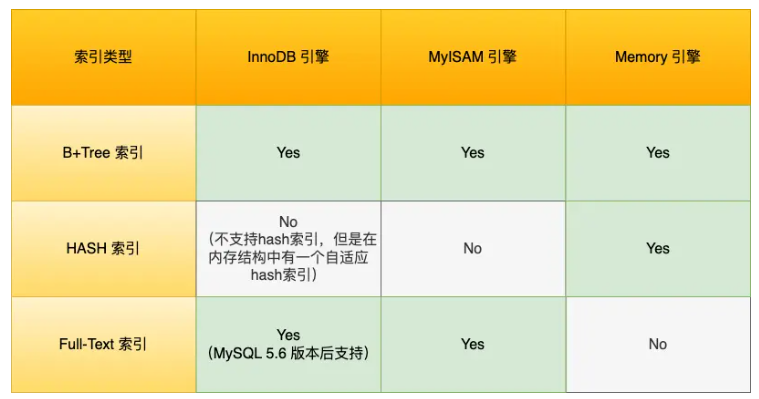

#### - B+tree 索引

**B+Tree 索引**

- 一种多叉树，叶子节点存放数据，**非叶子节点只存放索引**，而且每个节点里的数据是 **按主键顺序存放** 的。
- 每一层父节点的索引值都会出现在下层子节点的索引值中，因此在叶子节点中，包括了所有的索引值信息。
-  **每一个叶子节点都有两个指针**，分别指向下一个叶子节点和上一个叶子节点，形成一个双向链表。

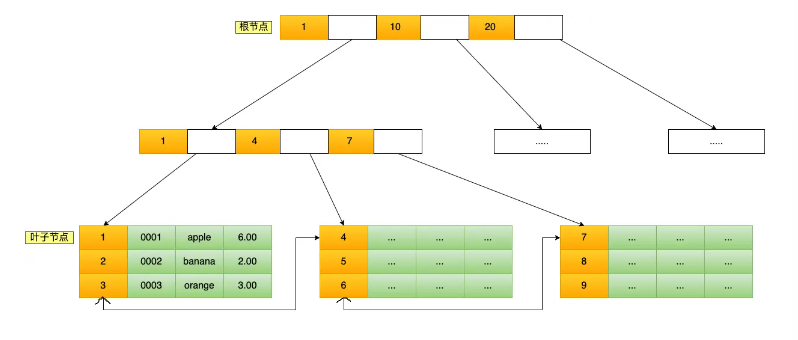

**B+Tree 的磁盘操作数**

- **数据库的索引和数据都是存储在硬盘的**，我们可以把 **读取一个节点当作一次磁盘 I/O 操作**。

- B+Tree 存储千万级的数据只需要 3-4 层高度就可以满足，这意味着从千万级的表查询目标数据最多需要 3-4 次磁盘 I/O，所以 B+Tree 相比于 B 树和二叉树来说，最大的优势在于 **查询效率很高**。

**主键索引的 B+Tree 和二级索引的 B+Tree 区别**

- 主键索引的 B+Tree 的叶子节点存放的是 **实际数据**，所有完整的用户记录都存放在主键索引的 B+Tree 的叶子节点里；
- 二级索引的 B+Tree 的叶子节点存放的是 **主键值**，而不是实际数据。


#### - Hash 索引

Hash 等值查询的效率极高，时间复杂度为 O(1)。

但是 Hash 表不适合做范围查询，它更适合做等值的查询，这也是 B+Tree 索引要比 Hash 表索引有着更广泛的适用场景的原因。

#### - Full-text 索引

全文检索，略。

### b. 按物理存储分类

从物理存储的角度来看，索引分为聚簇索引（主键索引）、非聚簇索引（二级索引/辅助索引）。

**聚簇索引**：将 **数据** 存储与 **索引** 放到了一块，索引结构的 **叶子节点** 保存了 **行数据**。

**非聚簇索引**：将 **数据** 与 **索引** 分开存储，表数据存储顺序与索引顺序无关。

> 主键索引的 B+Tree 的叶子节点存放的是实际数据，所有完整的用户记录都存放在主键索引的 B+Tree 的叶子节点里；
>
> 二级索引的 B+Tree 的叶子节点存放的是主键值。

在创建表时，InnoDB 存储引擎会根据不同的场景选择不同的列作为索引，但 **定会创建一个聚集索引**：

- 如果有主键，默认会使用 **主键** 作为聚簇索引的索引键（key）；
- 如果没有主键，就选择 **第一个不包含 NULL 值的唯一列** 作为聚簇索引的索引键（key）；
- 在上面两个都没有的情况下，InnoDB 将自动生成一个 **隐式自增 id 列** 作为聚簇索引的索引键（key）；

其它索引都属于辅助索引 / 二级索引 / 非聚簇索引。

**创建的主键索引和二级索引默认使用的是 B+Tree 索引**。

#### - 覆盖索引和回表

覆盖索引：在使用二级索引查询时，如果查询的字段在索引中都能找到，那么就不需要根据索引对应的主键值再去主键索引中寻找 data，这叫覆盖索引。**只需要查一个 B+Tree 就能找到数据**。

回表：在使用二级索引查询时，如果查询的字段在索引中不都能找到，那么就需要根据索引对应的主键值再去主键索引中寻找 data，这叫回表。**查两个 B+Tree 才能查到数据**。

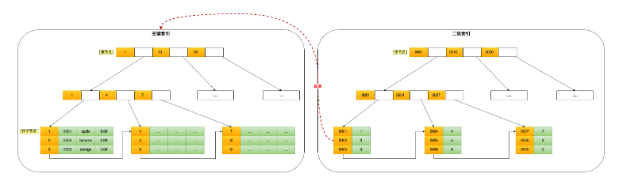

如果我用 product_no 二级索引查询商品，如下查询语句：

```sql
select * from product where product_no = '0002';
```

### c. 按字段特性分类

#### - 主键索引

主键索引就是建立在主键字段上的索引，通常在创建表的时候一起创建，一张表 **最多只有一个主键索引**，**索引列的值不允许有空值**。

在创建表时，创建主键索引的方式如下：

```sql
CREATE TABLE table_name  (
  ....
  PRIMARY KEY (index_column_1) USING BTREE
);
```

#### - 唯一索引

唯一索引建立在 UNIQUE 字段上的索引，一张表 **可以有多个唯一索引**，**索引列的值必须唯一，但是允许有空值**。

在创建表时，创建唯一索引的方式如下：

```sql
CREATE TABLE table_name  (
  ....
  UNIQUE KEY(index_column_1,index_column_2,...) 
);
```

建表后，如果要创建唯一索引，可以使用这面这条命令：

```sql
CREATE UNIQUE INDEX index_name
ON table_name(index_column_1,index_column_2,...); 
```

#### - 普通索引

普通索引就是建立在普通字段上的索引，**既不要求字段为主键，也不要求字段为 UNIQUE**。

在创建表时，创建普通索引的方式如下：

```sql
CREATE TABLE table_name  (
  ....
  INDEX(index_column_1,index_column_2,...) 
);
```

建表后，如果要创建普通索引，可以使用这面这条命令：

```sql
CREATE INDEX index_name
ON table_name(index_column_1,index_column_2,...); 
```

#### - 前缀索引

前缀索引是指 **对字符类型字段的前几个字符建立的索引**，而不是在整个字段上建立的索引，前缀索引可以建立在字段类型为 char、 varchar、binary、varbinary 的列上。

使用前缀索引的目的是为了**减少索引占用的存储空间，提升查询效率**。

在创建表时，创建前缀索引的方式如下：

```sql
CREATE TABLE table_name(
    column_list,
    INDEX(column_name(length))
); 
```

建表后，如果要创建前缀索引，可以使用这面这条命令：

```sql
CREATE INDEX index_name
ON table_name(column_name(length)); 
```

### d. 按字段个数分类

单列索引：建立在 **单列** 上的索引称为单列索引，比如主键索引。

联合索引（复合索引）：建立在 **多列** 上的索引称为联合索引。

#### - 联合索引

通过将多个字段组合成一个索引，该索引就被称为联合索引。

比如，将商品表中的 product_no 和 name 字段组合成联合索引`(product_no, name)`，创建联合索引的方式如下：

```sql
CREATE INDEX index_product_no_name ON product(product_no, name);
```

联合索引`(product_no, name)` 的 B+Tree 示意图如下：


##### 最左匹配原则

- 使用联合索引时，存在 **最左匹配原则**，也就是按照最左优先的方式进行索引的匹配。
- 当在联合索引查询数据时，先按 product_no 字段比较，在 product_no 相同的情况下再按 name 字段比较。也就是说，联合索引查询的 B+Tree 是先按 product_no 进行排序，然后在 product_no 相同的情况再按 name 字段排序。

比如，如果创建了一个 `(a, b, c)` 联合索引，如果查询条件是以下这几种，就可以匹配上联合索引：

- where a=1；
- where a=1 and b=2 and c=3；
- where a=1 and b=2；

需要注意的是，因为有查询优化器，所以 a 字段在 where 子句的顺序并不重要。

但是，如果查询条件是以下这几种，因为 **不符合最左匹配原则**，所以就无法匹配上联合索引，联合索引就会失效:

- where b=2；
- where c=3；
- where b=2 and c=3；

上面这些查询条件之所以会失效，是因为`(a, b, c)` 联合索引，是先按 a 排序，在 a 相同的情况再按 b 排序，在 b 相同的情况再按 c 排序。所以，**b 和 c 是全局无序，局部相对有序的**，这样在没有遵循最左匹配原则的情况下，是无法利用到索引的。

##### 联合索引范围查询（当对某一字段进行范围查询时，下一个字段索引将会失效；等号另处理）

联合索引有一些特殊情况，**并不是查询过程使用了联合索引查询，就代表联合索引中的所有字段都用到了联合索引进行索引查询**，也就是可能存在部分字段用到联合索引的 B+Tree，部分字段没有用到联合索引的 B+Tree 的情况。

这种特殊情况就发生在范围查询。联合索引的最左匹配原则会一直向右匹配直到遇到「范围查询」就会停止匹配。也就是说，**范围查询的字段可以用到联合索引，但是在范围查询字段的后面的字段无法用到联合索引**。

> Q1: `select * from t_table where a > 1 and b = 2`，联合索引（a, b）哪一个字段用到了联合索引的 B+Tree？

由于联合索引（二级索引）是先按照 a 字段的值排序的，所以我可以找到第一个 a > 1 的叶子结点，然后接下来遍历的是叶子结点产生的双向链表，在这个链表中， b 字段的值是无序的，所以 b 字段无法用到联合索引。

因此，**Q1 这条查询语句只有 a 字段用到了联合索引进行索引查询，而 b 字段并没有使用到联合索引**。（key_len = 4）

> Q2: `select * from t_table where a >= 1 and b = 2`，联合索引（a, b）哪一个字段用到了联合索引的 B+Tree？

Q2 和 Q1 的查询语句很像，唯一的区别就是 a 字段的查询条件「大于等于」。

**等号需要另处理**。在 a = 1 的项中，**b 字段的值是「有序」的**，所以直接利用联合索引查询到第一条 b = 2 的记录。而对于 a > 1 的项，和 Q1 一样处理。

所以，**Q2 这条查询语句 a 和 b 字段都用到了联合索引进行索引查询**。（key_len = 8）

> Q3: `SELECT * FROM t_table WHERE a BETWEEN 2 AND 8 AND b = 2`，联合索引（a, b）哪一个字段用到了联合索引的 B+Tree？

Q3 查询条件中 `a BETWEEN 2 AND 8` 的意思是查询 a 字段的值在 2 和 8 之间的记录。类似于 Q2 查询语句，因此， **Q3 这条查询语句 a 和 b 字段都用到了联合索引进行索引查询**。（key_len = 8）

> Q4: `SELECT * FROM t_user WHERE name like 'j%' and age = 22`，联合索引（name, age）哪一个字段用到了联合索引的 B+Tree？

虽然在符合前缀为 ‘j’ 的 name 字段的二级索引记录的范围里，age 字段的值是「无序」的，**但是对于符合 name = j 的二级索引记录的范围里，age字段的值是「有序」的**。

于是，在确定需要扫描的二级索引的范围时，当二级索引记录的 name 字段值为 ‘j’ 时，可以通过 age = 22 条件减少需要扫描的二级索引记录范围（age 字段可以利用联合索引进行索引查询的意思）。也就是说，从符合 `name = 'j' and age = 22` 条件的第一条记录时开始扫描，而不需要从第一个 name 为 j 的记录开始扫描 。如下图的右边：

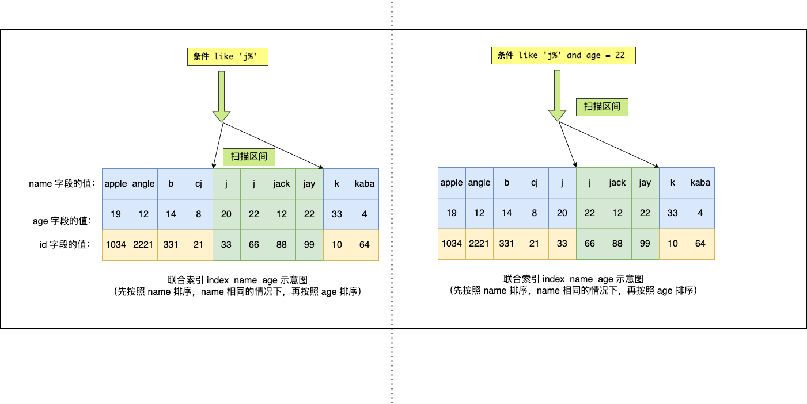

所以，**Q4 这条查询语句 a 和 b 字段都用到了联合索引进行索引查询**。（key_len = 126）

- name 字段的类型是 varchar(30) 且不为 NULL，数据库表使用了 utf8mb4 字符集，一个字符集为 utf8mb4 的字符是 4 个字节，因此 name 字段的实际数据最多占用的存储空间长度是 120 字节（30 x 4）；又因为 name 是变长类型的字段，需要再加 **2 字节（用于存储该字段实际数据的长度值）**，也就是 name 的 key_len 为 122。
- age 字段的类型是 int 且不为 NULL，key_len 为 4。

综上所示，**联合索引的最左匹配原则，在遇到范围查询（如 >、<）的时候，就会停止匹配，也就是范围查询的字段可以用到联合索引，但是在范围查询字段的后面的字段无法用到联合索引。注意，对于 >=、<=、BETWEEN、like 前缀匹配的范围查询，并不会停止匹配**。

##### 索引下推

对于联合索引（a, b），在执行 `select * from table where a > 1 and b = 2` 语句的时候，只有 a 字段能用到索引，那在联合索引的 B+Tree 找到第一个满足条件的主键值（ID 为 2）后，还需要判断其他条件是否满足（看 b 是否等于 2），那是在联合索引里判断？还是回主键索引去判断呢？

- 在 MySQL 5.6 之前，只能从 ID2 （主键值）开始回表，到「主键索引」上找出数据行，再对比 b 字段值。
- 而 MySQL 5.6 引入的 **索引下推优化**（index condition pushdown)， **可以在联合索引遍历过程中，对联合索引中包含的字段先做判断，直接过滤掉不满足条件的记录，减少回表次数**。

当你的查询语句的执行计划里，出现了 Extra 为 `Using index condition`，那么说明使用了索引下推的优化。

##### 索引区分度

建立联合索引时的字段顺序，对索引效率也有很大影响。越靠前的字段被用于索引过滤的概率越高，实际开发工作中 **建立联合索引时，要把区分度大的字段排在前面**，这样区分度大的字段越有可能被更多的 SQL 使用到。

**区分度**：某个字段 column 不同值的个数「除以」表的总行数，计算公式如下：


比如，性别的区分度就很小，不适合建立索引或不适合排在联合索引列的靠前的位置，而 UUID 这类字段就比较适合做索引或排在联合索引列的靠前的位置。

因为如果索引的区分度很小，假设字段的值分布均匀，那么无论搜索哪个值都可能得到一半的数据。在这些情况下，还不如不要索引，因为 MySQL 还有一个查询优化器，查询优化器发现某个值出现在表的数据行中的百分比（惯用的百分比界线是"30%"）很高的时候，它一般会忽略索引，进行全表扫描。

##### 联合索引进行排序

针对下面这条 SQL，你怎么通过索引来提高查询效率呢？

```sql
select * from order where status = 1 order by create_time asc
```

给 status 和 create_time 列建立一个联合索引，因为这样可以避免 MySQL 数据库发生 **文件排序**（当没有合适的索引可用时，MySQL 使用文件排序，设计文件读写，效率较慢）。

如果只用到 status 的索引，但是这条语句还要对 create_time 排序，这时就要用文件排序 filesort，在 SQL 执行计划中，Extra 列会出现 Using filesort。

要利用索引的有序性，在 status 和 create_time 列建立联合索引，这样根据 status 筛选后的数据就是按照 create_time 排好序的，避免文件排序，提高了查询效率。

## 2. 什么时候需要 / 不需要创建索引？

### - 索引的缺点

- 需要 **占用物理空间**，数量越大，占用空间越大；
- 创建索引和维护索引要 **耗费时间**，这种时间随着数据量的增加而增大；
- 会 **降低表的增删改的效率**，因为每次增删改索引，B+ 树为了维护索引有序性，都需要进行动态维护。

### - 什么时候适用索引？

- 字段有 **唯一性** 限制的，比如商品编码；
- **经常用于 `WHERE` 查询条件的字段**，这样能够提高整个表的查询速度，如果查询条件不是一个字段，可以建立联合索引。
- **经常用于 `GROUP BY` 和 `ORDER BY` 的字段**，这样在查询的时候就不需要再去做一次排序了，因为我们都已经知道了建立索引之后在 B+Tree 中的记录都是排序好的。

### - 什么时候不需要创建索引？

- **`WHERE` 条件，`GROUP BY`，`ORDER BY` 里用不到的字段**，索引的价值是快速定位，如果起不到定位的字段通常是不需要创建索引的，因为索引是会占用物理空间的。
- **字段中存在大量重复数据**，不需要创建索引，比如性别字段，只有男女，如果数据库表中，男女的记录分布均匀，那么无论搜索哪个值都可能得到一半的数据。在这些情况下，还不如不要索引，**因为 MySQL 还有一个查询优化器，查询优化器发现某个值出现在表的数据行中的百分比很高的时候，它一般会忽略索引，进行全表扫描。**
- **表数据太少** 的时候，不需要创建索引；
- **经常更新的字段** 不用创建索引，比如不要对电商项目的用户余额建立索引，因为索引字段频繁修改，由于要维护 B+Tree的有序性，那么就需要频繁的重建索引，这个过程是会影响数据库性能的。

## 3. 优化索引的方法

### - 前缀索引优化

在一些大字符串的字段作为索引时，使用前缀索引可以减小索引字段大小，可以增加一个索引页中存储的索引值，有效提高索引的查询速度。

前缀索引有一定的局限性，例如：

- order by 就无法使用前缀索引；
- 无法把前缀索引用作覆盖索引；

### - 覆盖索引优化

通过建立联合索引避免回表。

覆盖索引是指 SQL 中 query 的所有字段，在索引 B+Tree 的叶子节点上都能找得到的那些索引，从二级索引中查询得到记录，而不需要通过聚簇索引查询获得，可以避免回表的操作。

假设我们只需要查询商品的名称、价格，我们可以建立一个联合索引，即「商品ID、名称、价格」作为一个联合索引。如果索引中存在这些数据，查询将不会再次检索主键索引，从而避免回表。

所以，使用覆盖索引的好处就是，不需要查询出包含整行记录的所有信息，也就减少了大量的 I/O 操作。

### - 主键索引最好是自增的

**如果我们使用自增主键**，那么每次插入的新数据就会按顺序添加到当前索引节点的位置，不需要移动已有的数据，当页面写满，就会自动开辟一个新页面。因为每次 **插入一条新记录，都是追加操作，不需要重新移动数据**，因此这种插入数据的方法效率非常高。

**如果我们使用非自增主键**，由于每次插入主键的索引值都是随机的，因此每次插入新的数据时，就可能会插入到现有数据页中间的某个位置，这将不得不移动其它数据来满足新数据的插入，甚至需要从一个页面复制数据到另外一个页面，我们通常将这种情况称为 **页分裂**。**页分裂还有可能会造成大量的内存碎片，导致索引结构不紧凑，从而影响查询效率**。

举个例子，假设某个数据页中的数据是1、3、5、9，且数据页满了，现在准备插入一个数据7，则需要把数据页分割为两个数据页：


出现页分裂时，需要将一个页的记录移动到另外一个页，性能会受到影响，同时页空间的利用率下降，造成存储空间的浪费。

而如果记录是顺序插入的，例如插入数据11，则只需开辟新的数据页，也就不会发生页分裂：

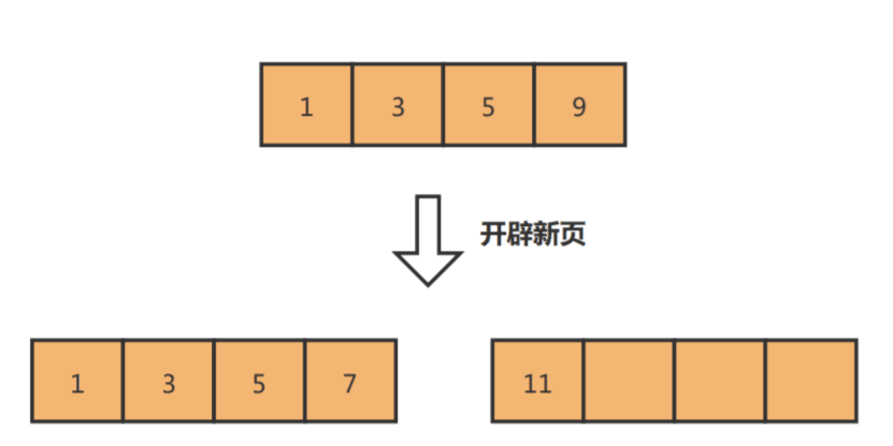

因此，在使用 InnoDB 存储引擎时，如果没有特别的业务需求，建议使用自增字段作为主键。

另外，主键字段的长度不要太大，因为**主键字段长度越小，意味着二级索引的叶子节点越小（二级索引的叶子节点存放的数据是主键值），这样二级索引占用的空间也就越小**。

### - ==索引最好设置为 NOT NULL==

为了更好的利用索引，索引列要设置为 NOT NULL 约束。有两个原因：

- 索引列存在 NULL 就会导致优化器在做索引选择的时候更加复杂，更加难以优化。

- 第二个原因：NULL 值是一个没意义的值，但是它会占用物理空间，所以会带来的存储空间的问题，因为 InnoDB 存储记录的时候，如果表中存在允许为 NULL 的字段，那么行格式 (opens new window) 中**至少会用 1 字节空间存储 NULL 值列表**，如下图的紫色部分：

  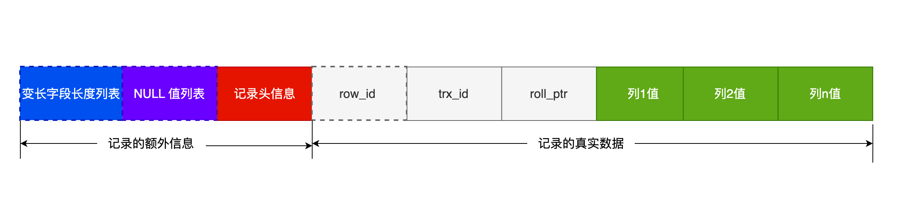

### ==- 防止索引失效==

用上了索引并不意味着查询的时候会使用到索引，所以我们心里要清楚有哪些情况会导致索引失效，从而避免写出索引失效的查询语句，否则这样的查询效率是很低的。

这里简单说一下，发生索引失效的情况：

- 当我们使用左或者左右模糊匹配的时候，也就是 `like %xx` 或者 `like %xx%`这两种方式都会造成索引失效；
- 当我们在查询条件中对索引列做了计算、函数、类型转换操作，这些情况下都会造成索引失效；
- 联合索引要能正确使用需要遵循最左匹配原则，也就是按照最左优先的方式进行索引的匹配，否则就会导致索引失效。
- 在 WHERE 子句中，如果在 OR 前的条件列是索引列，而在 OR 后的条件列不是索引列，那么索引会失效。

我上面说的是常见的索引失效场景，实际过程中，可能会出现其他的索引失效场景，这时我们就需要查看执行计划，通过执行计划显示的数据判断查询语句是否使用了索引。

如下图，就是一个没有使用索引，并且是一个全表扫描的查询语句。


对于执行计划，参数有：

- possible_keys 字段表示可能用到的索引；
- key 字段表示实际用的索引，如果这一项为 NULL，说明没有使用索引；
- key_len 表示索引的长度；
- rows 表示扫描的数据行数。
- type 表示数据扫描类型，我们需要重点看这个。

type 字段就是描述了找到所需数据时使用的扫描方式是什么，常见扫描类型的**执行效率从低到高的顺序为**：

- All（全表扫描）；
- index（全索引扫描）；
- range（索引范围扫描）；
- ref（非唯一索引扫描）；
- eq_ref（唯一索引扫描）；
- const（结果只有一条的主键或唯一索引扫描）。

在这些情况里，all 是最坏的情况，因为采用了全表扫描的方式。index 和 all 差不多，只不过 index 对索引表进行全扫描，这样做的好处是不再需要对数据进行排序，但是开销依然很大。所以，要尽量避免全表扫描和全索引扫描。

range 表示采用了索引范围扫描，一般在 where 子句中使用 < 、>、in、between 等关键词，只检索给定范围的行，属于范围查找。**从这一级别开始，索引的作用会越来越明显，因此我们需要尽量让 SQL 查询可以使用到 range 这一级别及以上的 type 访问方式**。

ref 类型表示采用了非唯一索引，或者是唯一索引的非唯一性前缀，返回数据返回可能是多条。因为虽然使用了索引，但该索引列的值并不唯一，有重复。这样即使使用索引快速查找到了第一条数据，仍然不能停止，要进行目标值附近的小范围扫描。但它的好处是它并不需要扫全表，因为索引是有序的，即便有重复值，也是在一个非常小的范围内扫描。

eq_ref 类型是使用主键或唯一索引时产生的访问方式，通常使用在多表联查中。比如，对两张表进行联查，关联条件是两张表的 user_id 相等，且 user_id 是唯一索引，那么使用 EXPLAIN 进行执行计划查看的时候，type 就会显示 eq_ref。

const 类型表示使用了主键或者唯一索引与常量值进行比较，比如 select name from product where id=1。

需要说明的是 const 类型和 eq_ref 都使用了主键或唯一索引，不过这两个类型有所区别，**const 是与常量进行比较，查询效率会更快，而 eq_ref 通常用于多表联查中**。

> 除了关注 type，我们也要关注 extra 显示的结果。

这里说几个重要的参考指标：

- Using filesort ：当查询语句中包含 group by 操作，而且无法利用索引完成排序操作的时候， 这时不得不选择相应的排序算法进行，甚至可能会通过文件排序，效率是很低的，所以要避免这种问题的出现。
- Using temporary：使了用临时表保存中间结果，MySQL 在对查询结果排序时使用临时表，常见于排序 order by 和分组查询 group by。效率低，要避免这种问题的出现。
- Using index：所需数据只需在索引即可全部获得，不须要再到表中取数据，也就是使用了覆盖索引，避免了回表操作，效率不错。

## ==3. 索引失效==

MySQL 默认的存储引擎是 InnoDB，它采用 B+Tree（叶子节点保存数据本身）作为索引的数据结构。在创建表时，InnoDB 存储引擎默认会创建一个主键索引。

这里有一张 t_user 表，其中 id 字段为主键索引，其他都是普通字段。

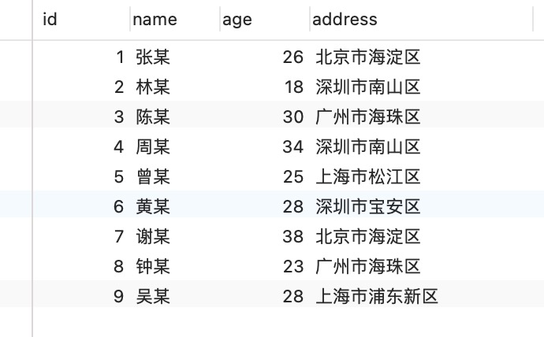


## 4. 为什么 MySQL InnoDB 选择 B+tree 作为索引的数据结构

##### 索引要求

- 能在尽可能少的 **磁盘的 I/O 操作** 中完成查询工作；
  - MySQL 的数据是持久化的，意味着数据（索引+记录）是保存到磁盘上的。磁盘读写慢，一次磁盘读写需要读写多个扇区。
  - 当通过索引查找某行数据的时候，需要先从磁盘读取索引到内存，再通过索引从磁盘中找到某行数据，然后读入到内存，也就是说查询过程中会发生多次磁盘 I/O，而磁盘 I/O 次数越多，所消耗的时间也就越大。
- 要能高效地查询某一个记录，也要能高效地执行 **范围查找**；
  - MySQL 是支持范围查找的，所以索引的数据结构不仅要能高效地查询某一个记录，而且也要能高效地执行范围查找。

##### 不同的数据结构

###### 线性结构实现：

- 直接遍历 O(n)
- 二分查找 O(log n)，需要维护有序队列，插入元素会导致后面所有元素后移，需要大量的磁盘读写。

###### 非线性结构实现：（避免增删元素导致的大量磁盘读写）

- 二叉查找树 O(log n)，若每次插入的都是最大元素，二叉查找树为退化为链表，复杂度退化为 O(n)。

- 平衡二叉树、红黑树 O(log n)，因为只有两个孩子，所以树会越来越高

- B 树，不再限制一个节点只有 2 个子节点，但是每个节点（非叶节点和叶子节点）都包含索引和记录，占用存储空间较大，且非叶节点保存的记录在查找时无用。另外，B 树不适合范围查找（需要中序遍历）。

- B+ 树，非叶节点只保存索引值。

  

B+ 树与 B 树差异的点，主要是以下这几点：

- 叶子节点（最底部的节点）才会存放实际数据（索引+记录），**非叶子节点只会存放索引**；
- 所有索引都会在叶子节点出现，**叶子节点之间构成一个有序链表**（B 树叶子结点之间没有链表结构）；

##### ==B+ 和 B 树的性能区别：==

## ==5. 从数据页的角度看 B+ 树==

**InnoDB 的数据是按「数据页」为单位来读写的**，也就是说，当需要读一条记录的时候，并不是将这个记录本身从磁盘读出来，而是以页为单位，将其整体读入内存。

数据库的 I/O 操作的最小单位是页，**InnoDB 数据页的默认大小是 16KB**，意味着数据库每次读写都是以 16KB 为单位的，一次最少从磁盘中读取 16K 的内容到内存中，一次最少把内存中的 16K 内容刷新到磁盘中。

Innodb 使用的  B+ 树有一些特别的点，比如：

- B+ 树的叶子节点之间是用**「双向链表」**进行连接，这样的好处是既能向右遍历，也能向左遍历。
- B+ 树点节点内容是 **数据页**，数据页里存放了用户的记录以及各种信息，每个数据页默认大小是 16 KB。


### 数据页结构

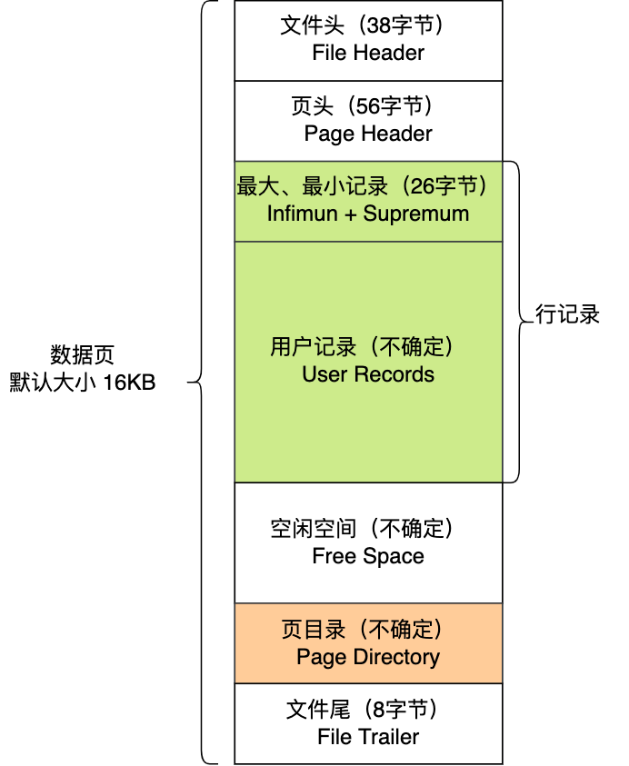

这 7 个部分的作用如下图：


在文件头 File Header 中有两个指针，分别指向上一个数据页和下一个数据页，连接起来的页相当于一个双向的链表，如下图所示：

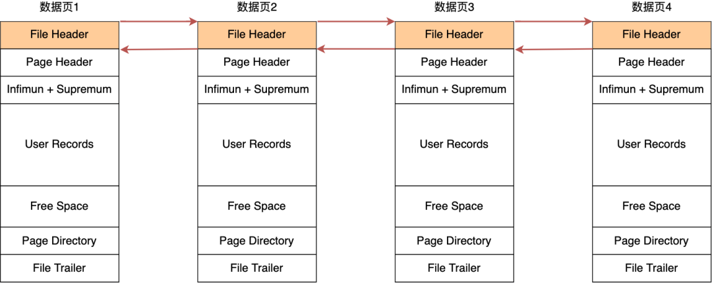

**采用链表的结构是让数据页之间不需要是物理上的连续的，而是逻辑上的连续。**

**数据页中的记录按照「主键」顺序组成单向链表**，单向链表的特点就是插入、删除非常方便，但是检索效率不高，最差的情况下需要遍历链表上的所有节点才能完成检索。

因此，数据页中有一个**页目录**，起到记录的索引作用，就像我们书那样，针对书中内容的每个章节设立了一个目录，想看某个章节的时候，可以查看目录，快速找到对应的章节的页数，而数据页中的页目录就是为了能快速找到记录。

那 InnoDB 是如何给记录创建页目录的呢？页目录与记录的关系如下图：


页目录创建的过程如下：

1. 将所有的记录划分成几个组，这些记录包括最小记录和最大记录，但不包括标记为“已删除”的记录；
2. 每个记录组的最后一条记录就是组内最大的那条记录，并且最后一条记录的头信息中会存储该组一共有多少条记录，作为 n_owned 字段（上图中粉红色字段）
3. 页目录用来存储每组最后一条记录的地址偏移量，这些地址偏移量会按照先后顺序存储起来，每组的地址偏移量也被称之为槽（slot），**每个槽相当于指针指向了不同组的最后一个记录**。

从图可以看到，**页目录就是由多个槽组成的，槽相当于分组记录的索引**。然后，因为记录是按照「主键值」从小到大排序的，所以**我们通过槽查找记录时，可以使用二分法快速定位要查询的记录在哪个槽（哪个记录分组），定位到槽后，再遍历槽内的所有记录，找到对应的记录**，无需从最小记录开始遍历整个页中的记录链表。

以上面那张图举个例子，5 个槽的编号分别为 0，1，2，3，4，我想查找主键为 11 的用户记录：

- 先二分得出槽中间位是 (0+4)/2=2 ，2号槽里最大的记录为 8。因为 11 > 8，所以需要从 2 号槽后继续搜索记录；
- 再使用二分搜索出 2 号和 4 槽的中间位是 (2+4)/2= 3，3 号槽里最大的记录为 12。因为 11 < 12，所以主键为 11 的记录在 3 号槽里；
- 这里有个问题，**「槽对应的值都是这个组的主键最大的记录，如何找到组里最小的记录」**？比如槽 3 对应最大主键是 12 的记录，那如何找到最小记录 9。解决办法是：通过槽 3 找到 槽 2 对应的记录，也就是主键为 8 的记录。主键为 8 的记录的下一条记录就是槽 3 当中主键最小的 9 记录，然后开始向下搜索 2 次，定位到主键为 11 的记录，取出该条记录的信息即为我们想要查找的内容。

看到第三步的时候，可能有的同学会疑问，如果某个槽内的记录很多，然后因为记录都是单向链表串起来的，那这样在槽内查找某个记录的时间复杂度不就是 O(n) 了吗？

这点不用担心，InnoDB 对每个分组中的记录条数都是有规定的，槽内的记录就只有几条：

- 第一个分组中的记录只能有 1 条记录；
- 最后一个分组中的记录条数范围只能在 1-8 条之间；
- 剩下的分组中记录条数范围只能在 4-8 条之间。

### B+ 树是如何进行查询的？

InnoDB 里的 B+ 树中的**每个节点都是一个数据页**，结构示意图如下：

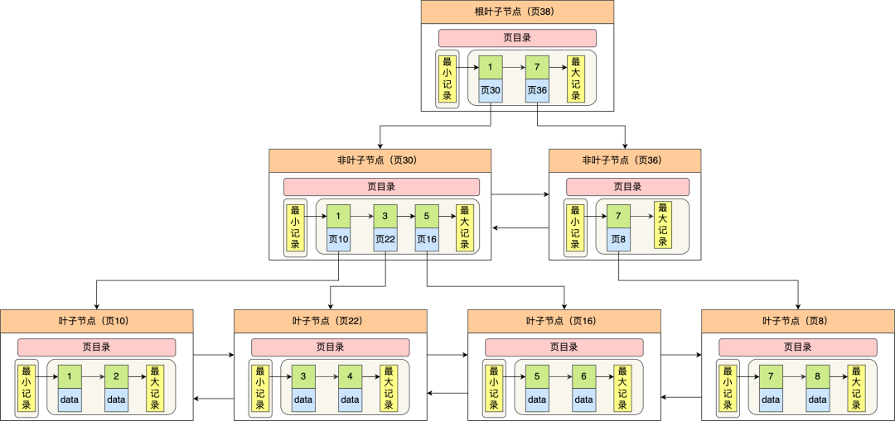

通过上图，我们看出 B+ 树的特点：

- 只有叶子节点（最底层的节点）才存放了数据，非叶子节点（其他上层节）仅用来存放目录项作为索引。
- 非叶子节点分为不同层次，通过分层来降低每一层的搜索量；
- 所有节点按照索引键大小排序，构成一个双向链表，便于范围查询；

我们再看看 B+ 树如何实现快速查找主键为 6 的记录，以上图为例子：

- 从根节点开始，通过二分法快速定位到符合页内范围包含查询值的页，因为查询的主键值为 6，在[1, 7)范围之间，所以到页 30 中查找更详细的目录项；
- 在非叶子节点（页30）中，继续通过二分法快速定位到符合页内范围包含查询值的页，主键值大于 5，所以就到叶子节点（页16）查找记录；
- 接着，在叶子节点（页16）中，通过槽查找记录时，使用二分法快速定位要查询的记录在哪个槽（哪个记录分组），定位到槽后，再遍历槽内的所有记录，找到主键为 6 的记录。

可以看到，在定位记录所在哪一个页时，也是通过二分法快速定位到包含该记录的页。定位到该页后，又会在该页内进行二分法快速定位记录所在的分组（槽号），最后在分组内进行遍历查找。

### 二级索引

二级索引的 B+ 树如下图，数据部分为主键值：


因此，**如果某个查询语句使用了二级索引，但是查询的数据不是主键值，这时在二级索引找到主键值后，需要去聚簇索引中获得数据行，这个过程就叫作「回表」，也就是说要查两个 B+ 树才能查到数据。不过，当查询的数据是主键值时，因为只在二级索引就能查询到，不用再去聚簇索引查，这个过程就叫作「索引覆盖」，也就是只需要查一个 B+ 树就能找到数据。**

- 

## 6. ==MySQL 单表不要超过 2000W 行，靠谱吗？==


# 事务

## 1. 事务的特性

- **原子性（Atomicity）**：一个事务中的所有操作，要么全部完成，要么全部不完成，不会结束在中间某个环节，而且事务在执行过程中发生错误，会被回滚到事务开始前的状态，就像这个事务从来没有执行过一样，就好比买一件商品，购买成功时，则给商家付了钱，商品到手；购买失败时，则商品在商家手中，消费者的钱也没花出去。
- **一致性（Consistency）**：是指事务操作前和操作后，数据满足完整性约束，数据库保持一致性状态。比如，用户 A 和用户 B 在银行分别有 800 元和 600 元，总共 1400 元，用户 A 给用户 B 转账 200 元，分为两个步骤，从 A 的账户扣除 200 元和对 B 的账户增加 200 元。一致性就是要求上述步骤操作后，最后的结果是用户 A 还有 600 元，用户 B 有 800 元，总共 1400 元，而不会出现用户 A 扣除了 200 元，但用户 B 未增加的情况（该情况，用户 A 和 B 均为 600 元，总共 1200 元）。
- **隔离性（Isolation）**：数据库允许多个并发事务同时对其数据进行读写和修改的能力，隔离性可以防止多个事务并发执行时由于交叉执行而导致数据的不一致，因为多个事务同时使用相同的数据时，不会相互干扰，每个事务都有一个完整的数据空间，对其他并发事务是隔离的。也就是说，消费者购买商品这个事务，是不影响其他消费者购买的。
- **持久性（Durability）**：事务处理结束后，对数据的修改就是永久的，即便系统故障也不会丢失。

### InnoDB 引擎通过什么技术来保证事务的这四个特性的呢？

- 持久性是通过 redo log （重做日志）来保证的；
- 原子性是通过 undo log（回滚日志） 来保证的；
- 隔离性是通过 MVCC（多版本并发控制） 或锁机制来保证的；
- 一致性则是通过持久性+原子性+隔离性来保证；

# sql

## group by

GROUP BY 语句根据一个或多个列对结果集进行分组。

在分组的列上我们可以使用 COUNT, SUM, AVG,等函数。

```
SELECT customer_id, SUM(order_amount) AS total_amount 	# select 后面的所有列中,没有使用聚合函数的列,必须出现在 group by 后面。
FROM orders
GROUP BY customer_id;
```


## order by

**ORDER BY(排序)** 语句可以按照一个或多个列的值进行升序（**ASC**，默认）或降序（**DESC**）排序。

```
SELECT column1, column2, ...
FROM table_name
ORDER BY column1 [ASC | DESC], column2 [ASC | DESC], ...;
```

## 函数

### count(expression)

COUNT() 是一个聚合函数，返回指定匹配条件的行数。

- COUNT(*)：统计所有的记录**（包括 NULL）**。

- COUNT(1)：统计不为 NULL 的记录。
- COUNT(字段)：统计该"字段" **不为 NULL** 的记录。
  - 如果这个字段是定义为 not null 的话，一行行地从记录里面读出这个字段，判断不能为 null，按行累加。
  - 如果这个字段定义允许为 null 的话，判断到有可能是 null，还要把值取出来在判断一下，不是 null 才累加。

- COUNT(DISTINCT 字段)：统计该"字段"去重且不为 NULL 的记录。

#### ==count 性能比较==

**count(*) = count(1) > count(主键字段) >count(字段)**

注意：

- **在既有二级索引又有主键索引的情况下，innodb 优先选择二级索引。**因为相同数量的二级索引记录可以比聚簇索引记录占用更少的存储空间，这样遍历二级索引的 I/O 成本比遍历聚簇索引的 I/O 成本小，「优化器」优先选择二级索引。
- MySQL 会对 count(*) 和 count(1) 有个优化，如果有多个二级索引的时候，优化器会使用 **key_len 最小的二级索引** 进行扫描。
- 在通过 count 函数统计有多少个记录时，MySQL 的 server 层会维护一个名叫 count 的变量，server 层会循环向 InnoDB 读取一条记录。

##### - count(*) 执行过程

**count(`*`) 等于 count(`0`)**，也就是说，MySQL 会将 `*` 参数转化为参数 0 来处理。

所以，count(\*) 执行过程跟 count(1) 执行过程基本一样的，**性能没什么差异**。

##### - count(1) 执行过程

用下面这条语句作为例子：

```text
select count(1) from t_order;
```

如果表里只有主键索引，没有二级索引时。

那么，InnoDB 循环遍历聚簇索引（主键索引），将读取到的记录返回给 server 层，**但是不会读取记录中的任何字段的值**，因此 server 层每从 InnoDB 读取到一条记录，就将 count 变量加 1。

但是，如果表里有二级索引时，InnoDB 循环遍历的对象就是二级索引了。

##### - count(主键字段) 执行过程

如果 count 函数指定的参数不为 NULL，那么就会将变量 count 加 1，直到符合查询的全部记录被读完，就退出循环。最后将 count 变量的值发送给客户端。

用下面这条语句作为例子：

```sql
//id 为主键值
select count(id) from t_order;
```

如果表里只有主键索引，没有二级索引时，那么，InnoDB 循环遍历聚簇索引，将读取到的记录返回给 server 层，不需要读取 id 值，直接 + 1，因为主键字段必然不为 NULL。

但是，如果表里有二级索引时，InnoDB 循环遍历的对象就不是聚簇索引，而是二级索引。

##### - count(字段) 执行过程是怎样的？

count(字段) 的执行效率相比前面的 count(1)、 count(*)、 count(主键字段) 执行效率是最差的。

用下面这条语句作为例子：

```sql
// name不是索引，普通字段
select count(name) from t_order;
```

对于这个查询来说，会采用全表扫描的方式来计数，所以它的执行效率是比较差的。

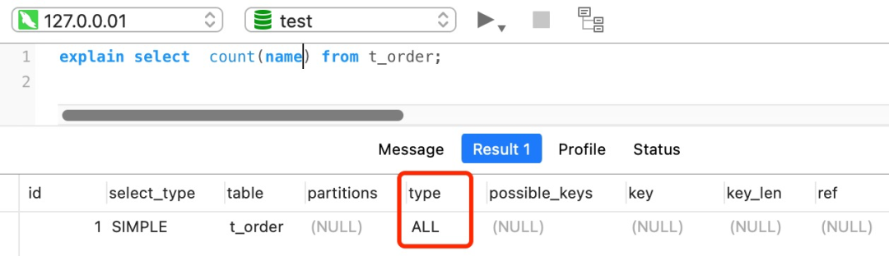

#### 为什么 innodb 通过遍历实现 count 计数

而 InnoDB 存储引擎是支持事务的，同一个时刻的多个查询，由于多版本并发控制（MVCC）的原因，InnoDB 表“应该返回多少行”也是不确定的，所以无法像 MyISAM一样，只维护一个 row_count 变量。

### 如何优化 count(*)？

如果对一张大表经常用 count(*) 来做统计，其实是很不好的。

比如下面我这个案例，表 t_order 共有 1200+ 万条记录，我也创建了二级索引，但是执行一次 `select count(*) from t_order` 要花费差不多 5 秒！


面对大表的记录统计，我们有没有什么其他更好的办法呢？

#### 第一种，近似值

如果你的业务对于统计个数不需要很精确，比如搜索引擎在搜索关键词的时候，给出的搜索结果条数是一个大概值。

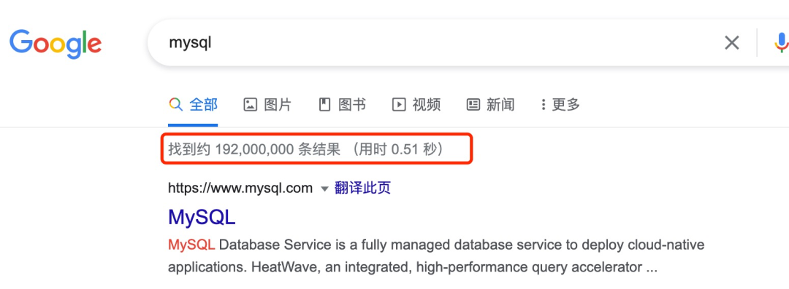

这时，我们就可以使用 show table status 或者 explain 命令来表进行估算。

执行 explain 命令效率是很高的，因为它并不会真正的去查询，下图中的 rows 字段值就是 explain 命令对表 t_order 记录的估算值。

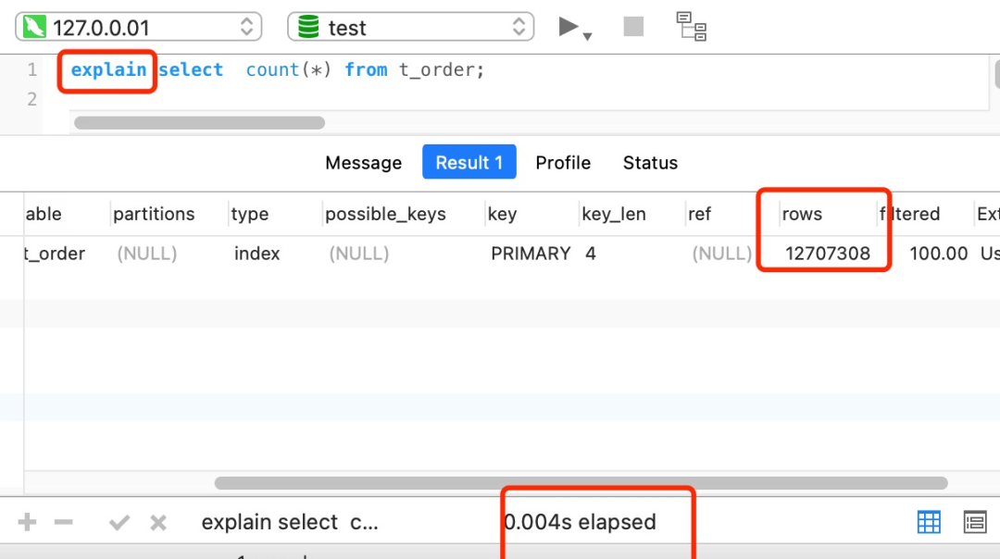

#### 第二种，额外表保存计数值

如果是想精确的获取表的记录总数，我们可以将这个计数值保存到单独的一张计数表中。

当我们在数据表插入一条记录的同时，将计数表中的计数字段 + 1。也就是说，在新增和删除操作时，我们需要额外维护这个计数表。


## like

**LIKE** 子句是在 MySQL 中用于在 WHERE 子句中进行模糊匹配的关键字。它通常与通配符一起使用，用于搜索符合某种模式的字符串。**LIKE** 子句中使用百分号 **%**字符来表示任意字符。如果没有使用百分号 **%**, LIKE 子句与等号 **=** 的效果是一样的。

```
SELECT column1, column2, ...
FROM table_name
WHERE column_name LIKE pattern;

组合使用 % 和 _：
SELECT * FROM users WHERE username LIKE 'a%o_'; 	// % 可以表示0个或多个字符
不区分大小写的匹配：
SELECT * FROM employees WHERE last_name LIKE 'smi%' COLLATE utf8mb4_general_ci;
```

### like "%x" 和索引


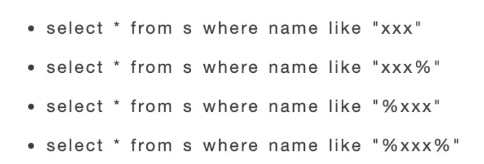
