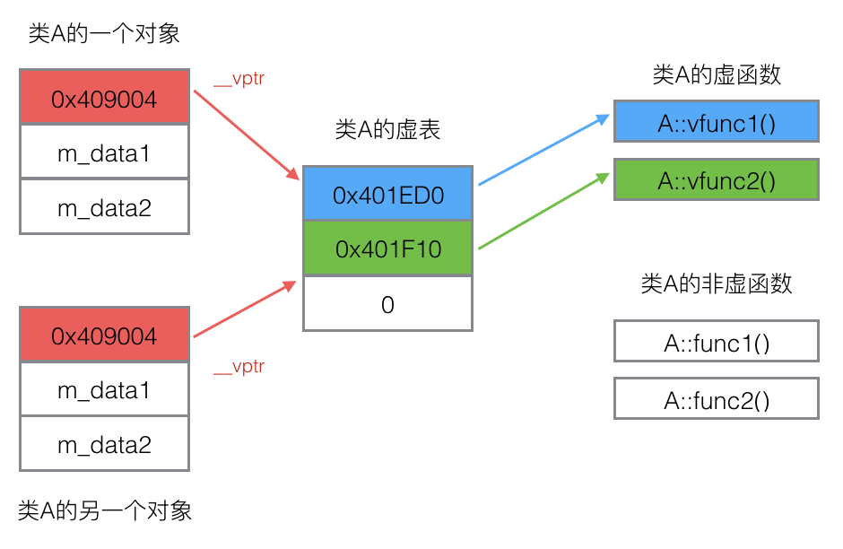
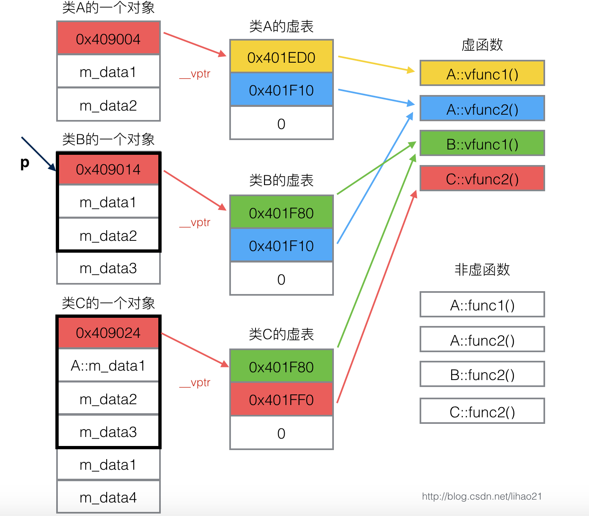

# 

### 1. 声明和定义（分配空间）

声明：告诉编译器一个变量或者函数的名字、返回类型、参数信息等，但不分配空间。

定义：在程序中为某个变量、函数等 **分配内存空间**，以便使用。

**变量的声明和定义**

- 定义性声明：在声明时就实现定义，比如，`int a`。
- 引用性声明：比如声明外部定义的变量，关键词 `extern`，告诉编译器该变量已经在别处定义过了。

**函数的声明和定义**

- 声明：告诉编译器这个函数在别处已定义。
- 定义：带函数体。

### 2. c 和 c++ 的区别，c++ 的三大特性

c：面向过程。分析解决问题的步骤，然后代码实现步骤

- 性能更好，因为类需要实例化，开销大。Linux、嵌入式等一般采用面向过程开发。

c++：面向对象。把问题分解成各个对象，描述某个事务在整个解决问题的步骤中的行为。

- 易维护、易复用、易扩展。由于面向对象有封装、继承、多态性的特性，可以设计出低耦合的系统，使系统更加灵活和易于维护。

#### - c++ 三大特性

- 封装。**数据安全。**

- 继承。代码重用，功能扩充。

- 多态。接口重用。
  - 静态多态：重载函数。
  - 动态多态 / 运行时多态：虚函数实现。

### 3. 指针和引用的区别

| 指针                                                         | 引用                                                         |
| :----------------------------------------------------------- | ------------------------------------------------------------ |
| 一个变量，存储指向原变量内存单元的地址。                     | 变量的别名，跟原变量标识同一块内存。                         |
| 可以有多级、不初始化、指向 NULL。                            | 只能有一级、必须初始化、不可以指向 NULL。                    |
| 初始化之后可以再改变指向                                     | 初始化后不可以改变指向                                       |
| sizeof 指针得到的是本指针的⼤⼩                              | sizeof 引⽤得到的是引⽤所指向变量的⼤⼩                      |
| 把指针 p 作为函数参数进⾏传递时，实际传递的是一个指针 p 的拷贝（隐含一次值拷贝，**临时变量**），这同样是一个指针，只是和 p 指向同一块内存，但是和 p 没有关系。如果在函数中修改这个指针的指向，它就和 p 毫无关系了。 | 把引用作为函数参数进行传递时，不存在临时变量。函数内可直接修改引用表示的内存。 |
| 4 字节。                                                     | 本质上是一个指针常量（只能和一个指向绑定）。占 4 字节。但编译器对其进行了优化，访问引用时直接访问其标识的内存。 |

#### - 函数的返回值能是指针或引用吗？

- 当返回的是 **栈** 上的局部变量（也就是当前函数声明的局部变量，会随着函数结束消亡），返回值不能是指针和引⽤ 
- 当返回的是 **堆** 上的局部变量（外部函数声明的变量），返回值可以指针和引⽤，但是这没有意义，因为它们可以直接在函数外部被访问。

### 4. 函数传参的方式

- 值传递：传递的是值的副本，隐含一次值拷贝。
- 指针传递：传递的是指针的副本，隐含一次值拷贝。
- 引用传递：不产生临时变量。

#### - 函数传参方式的选择

- 若要修改实参，选择指针或者引用，但是指针多一次拷贝开销。
- 若不要修改实参，最好选择值传递，但是值传递存在一次拷贝开销。

### 3. 重载、覆盖和隐藏

重载：在同一个类 / 同一个作用域中，函数名相同，参数不同。

覆盖：派生类覆盖基类的虚函数。函数名相同，参数也相同。

隐藏：派生类隐藏基类的非虚函数。函数名相同，参数也相同。（当派生类存在一个和基类非虚函数函数名相同、参数也相同的函数时，派生类会覆盖基类的同名同参函数）

### 4. c++ 中的虚函数和纯虚函数

虚函数是实现 **多态** 的一种方式，当 **基类希望派生类重新定义某成员函数** 时，基类用关键词 `virtual` 修饰这些函数，将其声明为虚函数。

- 基类定义的虚函数在所有派生类中都是虚函数。
- 派生类中覆盖基类的虚函数时，可以不带关键词 `virtual` 。
- 关键词 `virtual` 只能出现在 **类内部的函数声明** 中，不能用于 **类外部的函数定义**。

```c++
class Animal {
public:
    // virtual 只能出现在类内部的函数声明中，不能用于类外部的函数定义
	virtual void makeSound() {
		std::cout << "Animal makes a sound" << std::endl;
	}
};
```

#### - 虚函数和非虚函数

在 C++ 中，基类必须将它的两种成员函数区分开：

- 非虚函数：基类希望直接继承给派生类而不需要改写的函数。**静态绑定**，即解析过程发生在编译而非运行时
- 虚函数：基类希望派生类进行覆盖的函数：定义为虚函数。**动态绑定**，即根据对象类型不同，调用该虚函数时可能执行基类的版本，也可能执行某个派生类的版本，因此需要在程序运行时确定。由于只有在程序运行时才知道调用哪个版本的虚函数，因此 **所有虚函数都必须有定义**，就是不使用虚函数，也必须定义它。

#### - 关键词 override

C++11 允许派生类使用 `override` 关键字显式注明哪个成员函数是改写的基类的虚函数，代码示例如下：

```c++
#include <iostream>


class Animal {
private:
	int nums;
public:
	Animal() = default;
	Animal(int nums_) : nums(nums_) {};
	virtual void printNum() {
		std::cout << "The number of animals is: " << nums << std::endl;
	}
};

class Dog :public Animal {
private:
	int nums;
public:
	Dog() = default;
	Dog(int nums_) : nums(nums_) {};
	void printNum() override {
		std::cout << "The number of dog is: " << nums << std::endl;
	}
};

int main(){
	Animal animal(100);
	animal.printNum();   // The number of animals is: 100
	Dog dog(5);
	dog.printNum();      // The number of dog is: 5
	return 0;
}
```

#### - 构造函数不可以定义为虚函数，析构函数最好定为虚函数

构造函数不可以是虚函数

- 构造函数是在创建对象时执行的，而虚函数是程序运行时执行的；也就是说在创建对象时虚函数还没确定用那个版本呢，所以构造函数不可以是虚函数。

析构函数可以是虚函数且最好写成虚函数

- 如果析构函数不是虚函数，则容易造成内存泄露。因为，若有父类指针指向子类对象存在，需要析构的是子类对象；但父类析构函数不是虚函数，则只析构了父类，造成子类对象没有及时释放，引起内存泄漏。

#### - 静态成员函数不能是虚函数（所有对象公用一个），内联函数不能是虚函数（在编译时就要确定函数体）

#### - 类的虚表

**每个包含了虚函数的类都包含一个虚表。**

- 不管多少个对象，都是用的是同一个虚表。
- 虚表是一个指针数组，其元素是虚函数的指针，每个元素对应一个虚函数的函数指针。虚表内的条目，即虚函数指针的赋值发生在 **编译器的编译阶段**，也就是说在代码的编译阶段，虚表就可以构造出来了。（非虚函数不会经历需表）

- 如果一个基类包含了虚函数，那么其派生类也就继承了这些虚函数，换句话说，一个类继承了包含虚函数的基类，那么这个类也拥有自己的虚表。

假设类 A 包含虚函数 vfunc1，vfunc2，由于类 A 包含虚函数，故类A拥有一个虚表。

```c++
class A {

public:

    virtual void vfunc1();
    virtual void vfunc2();
    void func1();
    void func2();

private:

    int m_data1, m_data2;
};
```

类 A 的虚表：


#### - 类的虚表指针

每个对象都有一个指向虚表的指针。为了指定对象的虚表，对象内部包含一个虚表的指针，来指向自己所使用的虚表。为了让每个包含虚表的类的对象都拥有一个虚表指针，编译器在类中添加了一个指针，`*__vptr`，用来指向虚表。这样，当类的对象在创建时便拥有了这个指针，且这个指针的值会自动被设置为指向类的虚表。



#### - 虚函数的动态绑定流程

例如，类A是基类，类B继承类A，类C又继承类B。

```c++
class A {
public:
    virtual void vfunc1();
    virtual void vfunc2();
    void func1();
    void func2();
private:
    int m_data1, m_data2;
};

class B : public A {
public:
    virtual void vfunc1();
    void func1();
private:
    int m_data3;
};

class C: public B {
public:
    virtual void vfunc2();
    void func2();
private:
    int m_data1, m_data4;
};
```

类 A 类 B 类 C 对象模型：**（虚表应该还包含从基类中继承的虚函数）**



基类的指针只能调用基类的方法，但是记住 **虚函数的指针是基类的，其他子类继承下来也只是继承了使用权**。

假设我们定义一个类 B 的对象。由于 `bObject` 是类 B 的一个对象，故 `bObject` 包含一个虚表指针，指向类 B 的虚表。

现在，我们声明一个类 A 的指针 p 来指向对象 `bObject`。虽然 **p 是基类的指针只能指向基类的部分**，但是虚表指针亦属于基类部分，**其值不会改变**，所以 p 可以访问到对象 `bObject` 的虚表指针，进而访问类 B 的需表。

```c++
int main() 
{
    B bObject;
    A *p = & bObject;
    p->vfunc1();
}
```

程序在执行 `p->vfunc1()` 时，会发现 p 是个指针，且调用的函数是虚函数，那么程序会根据虚表指针 `p->vptr` 来访问对象 `bObject` 对应的虚表，然后在虚表中查找所调用的函数对应的条目。由于虚表在编译阶段就可以构造出来了，所以可以根据所调用的函数定位到虚表中的对应条目。最后，根据虚表中找到的函数指针，调用函数。所以 `p->vfunc1()` 实质会调用 `B::vfunc1()` 函数。

#### - 纯虚函数

纯虚函数：纯虚函数是**一种特殊的虚函数**，在许多情况下，在**基类中不能对虚函数给出有意义的实现**，而把它声明为纯虚函数，它的实现留给**该基类的派生类**去做。

##### 虚函数与纯虚函数的区别

- 纯虚函数是虚函数的一种，但是虚函数可以在基类中实现，纯虚函数不能在基类中实现，且必须在子类中实现。

- 包含虚函数的类可以被实例化，包含纯虚函数的类（抽象类）不能被实例化。

```c++
class Animal {
public:
	virtual void makeSound() = 0 {} 	// 纯虚函数
};
```

#### - 抽象类

含有纯虚函数的类称为抽象类。

如下面的代码中对 Animal 抽象类的实例化会编译报错。

```c++
#include <iostream>

class Animal {
	// 这里的 = 0 没有任何实际意义，只起形式上的作用，告诉编译系统"这是纯虚函数"
	virtual void makeSound() = 0{}
};

int main(){
	Animal animal();   // 报错：不能实例化抽象类
	return 0;
}
```

### 5. 静态绑定和动态绑定

绑定：将 **变量** 和 **函数名** 转换为地址的过程。

静态绑定：编译时绑定，即，在编译阶段,该语句已经被编译成 “**call 函数地址**” 类似的汇编指令。

动态绑定：直到程序运行时才能确定调用哪个函数。（指针指向函数表，查表获取调用函数的指针）

- 动态绑定的条件：①有指针或引用②向上转型（基类指针接受派生类对象）③调用虚函数

  ```c++
  A* pa = new B;
  pa->vfunc1();
  
  pa = &b;
  pa->vfunc1();
  ```

### ==5. c 和 c++ 中结构体的区别，c++ 中结构体和类的区别==

c++ 中结构体和类差不多，结构体中可以包含函数；也可以定义public、private、protected数据成员；但结构体的默认属性是 public，类的默认属性是 private。

**c++ 中结构体和类的区别**

- 

**c 和 c++ 中结构体的区别**

- C 结构体致涉及数据，不涉及算法，只是一个存储数据的结构。

- C 结构体要在定义时加上 typedef 才能设置别名，否则必须用 struct + 结构体名。C++ 结构体可以直接设置别名。

  ```cpp
  typedef struct Student{
      int sNo;
      char name[10];
  }Stu;
  int main(){
      struct Student stu;  //方式一
      Stu stu1;            //方式二
  }
  ```

- C 结构体只有 public 一种权限，而 C++ 结构体有 public、private、protect 三种权限。

- C 结构体不能在结构体中初始化成员变量，而 C++ 结构体可以。

- C 中结构体不能有成员函数，而 C++ 中可以有，甚至可以有虚函数。所以 C 中不存在构造函数、虚构函数和 this 指针。

- 

- C 结构体没有继承关系，而 C++ 结构体可以从类或者其他结构体继承而来。

- 

- C 结构体在定义时除非使用 typedef，否则之后定义变量都必须跟上 struct + 结构体名，而 C++ 结构体可以直接使用结构体名，不受限制。

- C 结构体不能有静态成员变量，而 C++ 结构体可以有。

- C 结构体的空结构体 sizeof 为 0，C++的 sizeof 为 1。

## 6. 智能指针

普通指针存在的问题

- 访问失败：当多个指针指向同一块内存，并且内存被其中一个指针释放时，其余指针会访问失败。
- 内存泄漏：从堆中申请了内存后不释放回去，就会引发内存泄漏。new 了以后没有 delete。

智能指针：在构造的时候**分配内存**，当离开作用域的时候，自动**释放分配的内存**。以类模板的方式实现。

### 智能指针三个好处：

- 1.明确资源的所属权
- 2.避免忘记delete，这种比较容易犯错误
- 3.更好的处理异常

## 7. 面向对象和面向模板的区别

OOP：将对象的行为和属性，即数据和方法，封装在一起。

GP：泛型编程，将数据和方法分开。

### ==8. volatile关键字的作用==（阿里）

## 9. free 释放 new 的内存会怎样

free 仅对指向的内存做标记，标记这块内存可以使用。不会调用析构函数。

free(p1)后，是把分配的那块内存中的内容清空（或保持原样，或者值被修改），不会释放指针。

如果不主动修改指针的指向，free(p1)后，p1仍然指向这片堆内存，仍然可以通过p1去访问，只是结果是未知的，不建议这样操作，如果不把该指针设为NUL或修改其指向,那么该指针就会变成野指针。
多个指针指向同一块区域，其中一个指针free之后，另外两个指针也还是可以去访问之前的内存空间。
free后那块内存空间得到释放，其它地方调用malloc时可以分配这块空间。

# 10. 野指针和悬空指针

都是是指向⽆效内存区域(这⾥的⽆效指的是"不安全不可控")的指针，访问⾏为将会导致未定义⾏为。 ᰀ指针 产⽣的原因：指针变ᰁ未初始化 解决⽅法：及时初始化或置空 Bilibili搜索柴柴_8c 悬空指针指的是指针指向的内存已经被释放，但指针仍然保留着释放了的内存的地址，指向了⼀块曾经保存数 据对象但现在已经⽆效的内存 产⽣的原因：指针被释放后未置空或指针指向了超出⽣命周期的局部变ᰁ 解决⽅法：释放后⽴即置空

# STL

## 1. STL 是什么

STL，标准模块库。采⽤泛型编程，容器中保存数据，算法中定义各种⽅法，通过迭代器进⾏沟通。这种设计⽅法可以使得 **容器和算法的设计相互独⽴**，不受对⽅的约束，具有更强⼤的通⽤性（复⽤性）。

STL 内含六⼤组件：

- 容器：组织数据的逻辑结构
- 迭代器：是容器和算法之间的桥梁，泛型指针
- 算法：通过迭代器操作容器中的元素，实现相应的功能
- 分配器：管理容器内数据内存的分配和释放
- 适配器：⽤来修饰迭代器、容器、仿函数等接⼝
- 仿函数：类似函数，作为算法的某种策略，重载了函数调⽤运算符()

## ==2. STL 的两级空间配置器原理==

## 3. vector 的扩容机制

`vector` 中主要存储三个指针 `start`、`finish`、`end_of_storage`，每次插⼊时会判断是否还有空闲空间，如果没有则执⾏扩容操作。 

扩容操作的流程：

1. 先确定新的容量 `new_capacity`，gcc 下是 2 倍扩容，vs 是 1.5 倍扩容 
2. 重新开辟⼀个容量为 `new_capacity` 的数组，将旧数组中的元素拷⻉到新数组上，所以这会导致迭代器失效。
3. 重置 `start`、`finish`、`end_of_storage` 
4. 释放旧数组 

成倍扩容相⽐固定扩容的好处：①保证扩容操作的均摊时间复杂度为 O(1)，⽽后者是O(n)；②防⽌申请内存的浪费，1.5可以更好的实现对内存的重复利⽤。

## ==4. vector 的 push_back() 和 emplace_back()==

## 5. vector 的 resize 和 reserve

**resize**： 

1. 如果 new_size ⼤于 old_size，则先要判断剩余空间是否⾜够，如果不够的话还要进⾏扩容操作，然后在末尾 **按默认值插⼊元素**，此时会改变 capacity 
2. 如果 new_size ⼩于 old_size，则调⽤ _M_erase_at_end，删除多余元素 

**reserve**： 

1. reverse()，改变 capacity，不改变 size
2. 当 reserve() 新设置的 capacity 比原空间大时，重新开辟一个容量为 `new_capacity` 的数组，将旧数组中的元素拷⻉到新数组上，所以这会导致迭代器失效。
3. 当 reserve() 新设置的 capacity 比原空间⼩时，不会引起重新分配。

# C++ 11 新特性

### 1. auto 和 decltype（阿里）

**头文件：`#include <typeinfo>`**

### - `auto`：初始化时自动类型推导。

- ```c++
  // auto 根据 = 右边的初始值 value 推导出变量的类型
  auto varname = value;
  ```

- `auto` 会忽略顶层 `const`。

  ```c++
  const int ci;
  auto a = ci; 	// a 的类型为 int
  // 如果希望 auto 定义 const 类型，则需要特殊说明：
  const auto a = ci; 	// a 的类型为 const int
  
  auto &g = ci; 	// 正确，g 指向常量 ci，但 g 不能被重新赋值
  auto &h = 42; 	// 错误，不能为非常量引用绑定字面值，
  const auto &j = 42; 	// 正确，常量引用可以绑定字面值。
  ```

- 在 **编译期间确定类型**，并且无法更改。

- 常用于简化代码和处理复杂类型。

### - `decltype`：自动推导表达式类型，但不执行表达式。

- ```c++
  // decltype 根据 exp 表达式推导出变量的类型，跟 = 右边的 value 没有关系。
  decltype(exp) varname = value;
  ```

- 如果 `decltype` 使用的是一个不加括号的变量，则得到的结果就是该变量的类型；如果给变量加上了一层或多层括号，则编译器将推断得到 **引用类型**。

- 如果表达式的内容是解引用操作，则将得到 **引用类型**。

  ```c++
  char ch = 'a';
  int i = 0;
  
  decltype(ch + i) a1; // (char + int)表达式的结果是int， a1类型为int
  decltype(i++) a2; // i++表达式的结果是int, a2类型为int。
  
  int temp_int = 10;
  decltype(++i) a3 = temp_int; // ++i表达式的结果是对i的int&， a3推导的类型是int&, 对temp_int的引用。
  printf("i == %d\n", i); // 打印“i == 0”, 在decltype中的表达式++i并不会执行。
  
  int Fun1()
  {
  	return 0;
  }
  const int& Fun2()
  {
  	static int s_i = 10;
  	return s_i;
  }
  
  decltype(Fun1()) a4; // 推导是Fun1()的返回值类型int
  decltype(Fun2()) a5; // 推导是Fun2()的返回值类型const int&;例如int *p = &i;则decltype(*p)的类型时int &。
  ```

- 在 **运行时才确定表达式的类型**。

- 应用场景：**尾置返回类型**（联合函数返回值后置声明 + auto 占位，对模板功能的增强）

  ```c++
  // 需要新的语法支持--函数返回值后置声明--
  // 在函数参数定义完后加上 ->Return_Type再接原来的大括号`{}`包裹的函数体。
  // 但是前面原来写Return_Type的位置不能留空，编译器会迷惑， 通过 auto 占位编译器很好识别。
  // 正确的写法。
  template<typename T1, typename T2>
  auto Add(const T1& t1, const T2& t2)->decltype(t1 + t2)
  {
  	return (t1 + t2);
  }
  
  // c++ 14
  template<typename T1, typename T2>
  decltype(auto) Add(const T1& t1, const T2& t2)
  {
  	return (t1 + t2);
  }
  ```

### 2.2 范围 for 循环

C++11 引入了 **范围 for 循环（Range-based for loop）**，它提供了一种简洁而直观的方式来遍历容器、数组、字符串和其他可迭代对象。

```c++
// 自动遍历容器中的每个元素，并将当前元素的值赋给 element 变量，然后执行循环体中的代码块。
for(auto element : container) {
    // 操作每个元素
}
```

- `element` ：变量，用于存储容器中的每个元素的值。
- `container`：可迭代对象，例如数组、标准库容器或自定义容器，也可以是大括号初始化的序列。

```c++
// 实例：
#include <iostream>
#include <vector>

int main() {
    std::vector<int> numbers = {1, 2, 3, 4, 5};
    for (auto number : numbers) {
        std::cout << number << " ";
    }
    return 0;
}
```

此外，范围 for 循环还支持 **遍历用大括号初始化的序列**：

```c++
#include <iostream>
using namespace std;

int main() {
    for (int num : {1, 2, 3, 4, 5}) {
        cout << num << " ";
    }
    return 0;
}
```

需要注意的是，如果想要修改遍历的 container 对象，需要 **定义引用形式的变量**：

```c++
#include <iostream>
#include <vector>
using namespace std;

int main() {
    char arc[] = "abcde";
    vector<char> myvector(arc, arc + 5);

    for (auto &ch : myvector) { 	// 必须引用
        ch++;
    }
    return 0;
}
```

## 3. 列表初始化 / {} 初始化

C++11 扩充了 {} 的使用范围，使得 {} 可以适用于 **所有的内置类型和用户自定义的类型**，在 **new** 表达式中也一样适用。**使用列表初始化方式初始化对象会调用对象的构造函数。**

默认地， {} 在初始化的时候会返回一个 `std::initializer_list` 的对象，而在初始化对象变量的时候将这个 `std::initializer_list` 对象作为一个参数传入需要初始化的对象的构造函数中。

## 4. ==lambda 表达式 / 匿名函数 / 闭包==

lambda 表达式中主要包含三部分，捕获变量，参数列表和返回类型。

```c++
[捕获列表](参数列表) mutable或exception -> 返回值类型 { 函数体 }
```

- 捕获列表
  - 值捕获 =：拷贝所在函数的局部变量的值。
  - 引用捕获 &：获取变量的引用
  - lambda 无法捕获任何 static 变量、全局变量，不过可以在 lambda 表达式内部直接访问。
- 参数列表
- 

## 4. 智能指针

C++中智能指针的种类？ 有两种智能指针：shared_ptr和unique_ptr。与常规指针⾏为类型，最᯿要的区别就是它负责⾃动释放所指向的对 象。这两种智能指针的区别在于管理底层指针的⽅式：shared_ptr允许多个指针指向同⼀个对象；unique_ptr则独 占所指向的对象。 还有⼀种weak_ptr，它是⼀种弱引⽤，指向shared_ptr所管理的对象。 weak_ptr最初的引⼊，是为了解决shared_ptr互相引⽤导致的内存⽆法释放的问题。weak_ptr不会增加引⽤计 数，不能直接操作对象的内存（需要先调⽤lock接⼝），需要和shared_ptr配套使⽤。 同时，通过weak_ptr获得的shared_ptr可以安全使⽤，因为其lock接⼝是原⼦性的，那么lock返回的是⼀个新的 shared_ptr，不存在同⼀个shared_ptr的读写操作，除⾮后续⼜对这个新的shared_ptr⼜被其他线程同时读写。 C++中智能指针的底层实现原理？ C++ 智能指针底层是采⽤引⽤计数的⽅式实现的。智能指针在申请堆内存空间的同时，会为其配备⼀个整形值（初 始值为 1），每当有新对象使⽤此堆内存时，该整形值 +1；反之，每当使⽤此堆内存的对象被释放时，该整形值减 1。当堆空间对应的整形值为 0 时，即表明不再有对象使⽤它，该堆空间就会被释放掉。 智能指针是线程安全的吗？ // 转发右值 template _GLIBCXX_NODISCARD constexpr _Tp&& forward(typename std::remove_reference<_Tp>::type&& __t) noexcept { static_assert(!std::is_lvalue_reference<_Tp>::value, "template argument" " substituting _Tp must not be an lvalue reference type"); return static_cast<_Tp&&>(__t); } Bilibili搜索柴柴_8c 通常⽽⾔，智能指针是⾮线程安全的。在编写多线程程序中，为了避免竞态条件导致的未定义⾏为，需要使⽤⼀些 技术，⽐如互斥区或者是锁。幸运的是，读取另⼀个线程修改的引⽤计数并不会构成竞态条件，但是数值可能不是 最新值。事实上，⼀个线程检查引⽤计数的时候，另⼀个线程可以修改它。 • 同⼀个shared_ptr被多线程读，线程安全； • 同⼀个shared_ptr被多线程写，不是线程安全； • 共享引⽤计数的不同的shared_ptr被多个线程写，是线程安全。 智能指针⾃定义删除器 unique_ptr是编译时就知道要调哪个函数，从⽽提前做好内联、⽆⽤消除等优化，shared_ptr是要等运⾏时再去控 制块⾥去找函数地址，再调⽤。 C++中的智能指针是对裸指针的⼀种RAII封装，C++中共有过4种智能指针： auto_ptr ：C++11开始不推荐使⽤，C++17中被移除； unique_ptr ：表示对资源的独占的所有权； shared_ptr ：表示对资源的共享的所有权； weak_ptr ：表示资源的观察者，指向 shared_ptr 所管理的对象，避免了循环引⽤问题，不具有资源的所有 权。 auto_ptr⽀持拷⻉构造、拷⻉赋值，所以就会不经意间转移了资源的所有权 unique_ptr禁⽤了拷⻉构造、拷⻉赋值，同时⽀持移动语义，性能好，在没有⾃定义deleter的情况下可以做到零 开销。 shared_ptr主要由两个指针构成： 指向被管理对象的指针，⽤于访问该对象， get() 返回的是这个指针。 指向控制块的指针，控制块由以下⼏部分构成： Bilibili搜索柴柴_8c 成员 描述 指向被管理 对象的指针 （或者直接 是该对象本 身） ⽤于管理该对象，当 use_count 为零时⽤于析构该对象，不必和 shared_ptr 中的指针 相同（将在别名构造函数中另述）。当该 shared_ptr 是由 make_shared ⼯⼚函数构 造出来时，被管理的对象直接在控制块的成员中被 in-place 地构造出来，与控制块位于 内存中的同⼀位置；当该控制块由 shared_ptr 的构造函数构造出来时，被管理的对象 与控制块分处内存中的不同位置，控制块中保存指向对象的指针。也就是说，使⽤ make_shared 构造 shared_ptr 能够少⼀次内存分配，这也是绝⼤部分情况下都推荐使 ⽤ make_shared 的原因之⼀。 deleter ⽤于析构对象。 allocator ⽤于分配内存。 use_count shared_ptr 的引⽤计数，在 shared_ptr 的构造函数中原⼦⾃增，在 shared_ptr 的析 构函数中原⼦⾃减。当值为0时，调⽤被管理对象的析构函数。 weak_count weak_ptr 的引⽤计数，当值为0时，析构该控制块本身。 Shared_ptr的注意事项： 1. 传播性、double free 2. 内存泄漏问题，循环引⽤ 3. 如果需要在对象的成员函数中通过 this 指针构造该对象的 shared_ptr ，需要让该对象类型继承 std::enable_shared_from_this ，再通过 shared_from_this() 得到指向该对象的 shared_ptr 。其实现 机制相当于让控制块直接成为该对象的数据成员。 weak_ptr 由两个指针构成： 指向被观察的对象的指针，和构造该 weak_ptr 的 shared_ptr 的指向被管理对象的指针指向同⼀位置。保证 了即使该 shared_ptr 为别名 shared_ptr ，该 weak_ptr 在 lock() 之后和原 shared_ptr ⾏为完全⼀致。 指向控制块的指针。 注意事项： 通过 make_shared 构造的 shared_ptr ，其管理的对象直接作为控制块的成员。此时如果 weak_ptr 指向该对象， 因为 weak_ptr 管理控制块的⽣命周期，可能会造成对象占据的内存空间在对象被析构之后依然⽆法释放，直⾄控 制块被析构释放。

- 