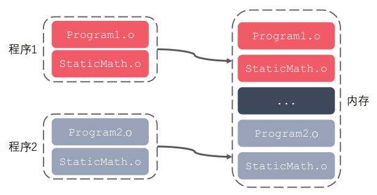
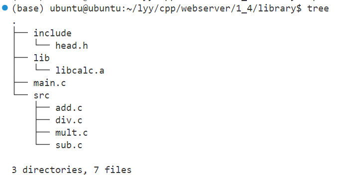
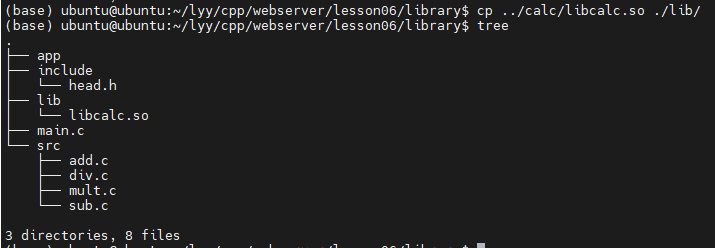
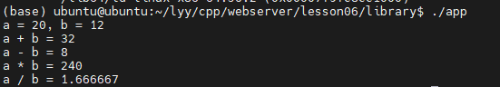

# 1. C / C++ 的编译流程

**预编译 - 编译 - 汇编 - 链接**

**预编译：**处理预处理指令（宏展开、引入头文件、去掉注释等），生成 `.i` 文件

**编译：**进行词法分析、语法分析和语义分析等，生成 `.s` **汇编文件**

**汇编：**将对应的汇编指令翻译成 **机器指令**，生成 `.o` **二进制目标文件**

**链接：**将所有相关的 `.o` 链接起来，得到 `.exe` **可执行文件**。链接分为 **静态链接** 和 **动态链接**。


## - 静态链接和动态链接

**静态链接**

在链接期，将目标文件 **直接拷贝** 到可执行文件中的链接方式。使用静态链接方式可以生成 **静态库文件**（ `.lib` 或 `.a` 文件，本质上是若干目标文件的集合）。在程序执行时，这些代码都会被装入该进程的虚拟地址空间中。

**静态链接的优缺点：**

- 静态库链接阶段被打包到可执行程序中，所以程序运行时加载快。
- 发布程序不需要提供静态库，移植方便。

- 消耗系统资源，浪费内存。（可能多处复制）
- 更新、部署、发布麻烦。（需要重新编译）




**动态链接**

在链接时只建立映射关系，在程序运行时动态加载目标文件的链接方式。使用动态链接方式可以生成 **动态链接库**（`.dll` 或 `.so` 文件，本质上是若干个目标文件集合）

**动态链接的优缺点：**

- 可以实现进程间资源共享（动态库时共享库）
- 更新、部署、发布简单。（不需要重新编译）
- 可以控制何时加载动态库。

- 加载速度较慢。
- 发布程序时需要提供依赖的动态库。（可执行程序执行时需要动态库，而静态库已经包含在程序中了）


## - 静态库和动态库

**库文件**

- 计算机上的一类文件，可以简单地把库文件看成一种代码仓库，它提供给使用者一些可以直接拿来用的变量、函数或类。
- 库是一种特殊的程序，编写上和一般地程序没有较大的区别，但是不能单独运行。
- 库文件有两种：静态库和动态库（共享库）。
  - 静态库：在程序的  **链接阶段** 被 **复制** 到程序中；（一般比较小）
  - 动态库：在程序的链接阶段没有被复制到程序中，在程序的 **运行阶段**（调用动态库 api 时）由系统 **动态加载到内存中供程序调用**。（一般比较大）
- 库的好处：①代码保密。②方便部署和开发。
- 库文件要和头文件（说明库中 api）一起分发。

**静态库**


- 静态库在链接阶段会被打包复制到可执行程序中。

- 命名规则：linux：`libxxx.a`；windows：`libxxx.lib`

- 静态库的制作

  - gcc 获取 .o 文件


  - 将 .o 文件打包（使用 ar 工具，archive）

    ```shell
    ar rsc libxxx.a xxx.o xxx.o 	// ar rsc 库名 .o文件们
    ```

    r - 将文件插入到备存文件中

    c - 建立备存文件

    s - 索引


- 静态库的使用例子
  - 现有四个程序分别实现加减乘除，将它们制作成一个静态库，库名为 `calc`，库文件名为 `libcalc.a`。


```shell
gcc -c add.c sub.c mult.c div.c 	// 生成 .o 文件
```


```shell
ar rcs libcalc.a add.o sub.o mult.o div.o 	// 制作库文件 libcalc.a
```


在 library 文件夹下尝试使用静态库：



直接编译链接 main.c 文件，报错找不到头文件，使用 `-I` 参数指定头文件目录


能够找到头文件，但是找不到定义的函数，使用 `-L` 和 `-l` 参数指定库和库路径。


成功执行程序。


**动态库**


- 当系统加载动态库时，不仅需要知道库的名字，还需要知道库的绝对路径。

- 系统的 **动态载入器** 可以获取动态库的绝对路径。对于 elf 格式的可执行程序来说，`ld-linux.so` 承担动态载入器的角色。它先后搜索 elf 文件的 **`DT_RPATH` 段**（一般不访问）、**环境变量 `LD_LIBRARY_PATH`**、**`/etc/ld.so.cache` 文件列表**、**`/lib/` 和 `/usr/lib/` 目录** 来寻找库文件，并将其载入内存。elf 文件是一种用于二进制文件、可执行文件、目标代码、共享库和核心转储格式文件的文件格式。

- 命名规则：linux：libxxx.so （在 linux 下是一个可执行文件）；windows：libxxx.dll

- 动态库的制作

  - gcc 获取 .o 文件（要求是 **与位置无关** 的代码）

    ```shell
    gcc -c -fpic/-fPIC a.c b.c 	# -fpic/-fPIC 生成与位置无关的代码
    ```


  - gcc 制作动态库

    ```shell
    gcc -shared a.o b.o -o libcalc.so
    ```

- 动态库的使用例子

  - 现有四个程序分别实现加减乘除，将它们制作成一个动态库，库名为 `calc`，库文件名为 `libcalc.so`。


```
gcc -c -fpic/-fPIC add.c sub.c mult.c div.c 	// 生成 .o 文件
```


```
gcc shared *.o -o libcalc.so 	// 制作库文件 libcalc.so
```


尝试在 `main.c` 程序中使用动态库：



直接编译链接 main.c 文件，报错找不到头文件，使用 `-I` 参数指定头文件目录


能够找到头文件，但是找不到定义的函数，使用 `-L` 和 `-l` 参数指定库和库路径。


成功编译程序，但是运行失败。


编译时不会报错（因为编译时不连接动态库），但是运行时报错找不到动态库。


通过 `ldd` 命令查看可执行程序的依赖关系：


为了解决这个问题，要在 **动态载入器** 的搜索范围内 **增加动态库的绝对地址**：

```shell
# 1. 在 LD_LIBRARY_PATH 中添加库文件的绝对路径
## a. expert 配置环境变量 （export 配置环境变量仅在当前终端有效）
export LD_LIBRARY_PATH=$LD_LIBRARY_PATH:/home/ubuntu/lyy/cpp/webserver/lesson06/library/lib
# $LD_LIBRARY_PATH: 表示在这之后添加新路径

## b. 用户级别修改 （在.bashrc 中的修改在 用户 级别是永久的）
vim .bashrc 	# 末尾增加 "export LD_LIBRARY_PATH=$LD_LIBRARY_PATH:/home/ubuntu/lyy/cpp/webserver/lesson06/library/lib"
. .bashrc / source .bashrc

## c. 系统级别修改 （在 /etc/profile 中的修改在 系统 级别是永久的）
sudo vim /etc/profile 	# 末尾增加 "export LD_LIBRARY_PATH=$LD_LIBRARY_PATH:/home/ubuntu/lyy/cpp/webserver/lesson06/library/lib"
sudo source /etc/profile


# 2. 在 /etc/ld.so.cache 中增加（不能直接访问，在 /etc/ld.so.conf.d 中增加）
sudo vim /etc/ld.so.conf.d 	# 直接在末尾增加路径 "/home/ubuntu/lyy/cpp/webserver/lesson06/library/lib"
sudo ldconfig


# 3. 直接把动态库文件放到 /lib/ huo /usr/lib/ 目录下 （不建议，这两个目录下存在很多系统自带的库文件，防止重名覆盖）
```

在增加动态库文件的绝对路径后，可以看到该库文件被正常加载到内存中了。


app 可执行程序可以正常执行了。




# Git

## 1. git pull

```shell
git pull <远程主机名> <远程分支名>:<本地分支名>
    
git pull origin test-git 	# origin一般为远程主机名，如果远程分支是与当前分支合并，则冒号后面的部分可以省略。
```

