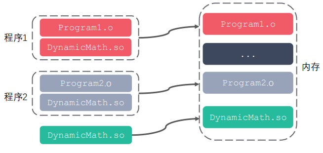
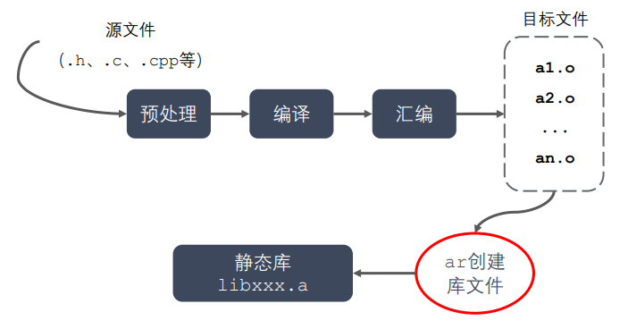
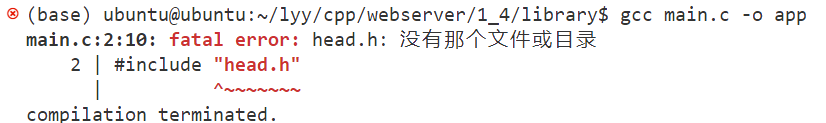
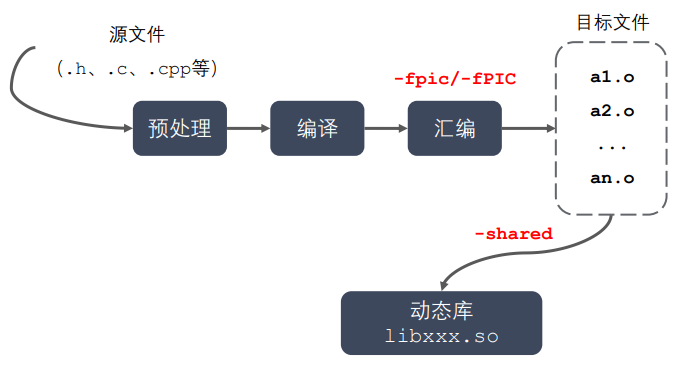
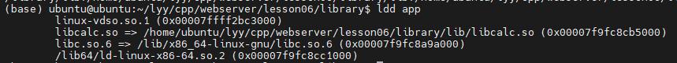

# 基础

# 1. C / C++ 的编译流程 （从 C++ 文件到可执行文件的过程）（阿里）

**预编译 - 编译 - 汇编 - 链接**

**预编译：**处理预处理指令（宏展开、引入头文件、去掉注释等），生成 `.i` 文件

**编译：**进行 **词法分析、语法分析和语义分析** 等，生成 `.s` **汇编文件**

**汇编：**将对应的汇编指令翻译成 **机器指令**，生成 `.o` **二进制目标文件**

**链接：**将所有相关的 `.o` 链接起来，得到 `.exe` **可执行文件**。链接分为 **静态链接** 和 **动态链接**。


## - 静态链接和动态链接（阿里）

**静态链接**

在链接期，将目标文件 **直接拷贝** 到可执行文件中的链接方式。使用静态链接方式可以生成 **静态库文件**（ `.lib` 或 `.a` 文件，本质上是若干目标文件的集合）。在程序执行时，这些代码都会被装入该进程的虚拟地址空间中。

**静态链接的优缺点：**

- 静态库链接阶段被打包到可执行程序中，所以程序运行时加载快。
- 发布程序不需要提供静态库，移植方便。

- 消耗系统资源，浪费内存。（可能多处复制）
- 更新、部署、发布麻烦。（需要重新编译）


**动态链接**

在链接时只建立映射关系，在程序运行时动态加载目标文件的链接方式。使用动态链接方式可以生成 **动态链接库**（`.dll` 或 `.so` 文件，本质上是若干个目标文件集合）

**动态链接的优缺点：**

- 可以实现进程间资源共享（动态库时共享库）
- 更新、部署、发布简单。（不需要重新编译）
- **可以控制何时加载动态库。**

- 加载速度较慢。
- 发布程序时需要提供依赖的动态库。（可执行程序执行时需要动态库，而静态库已经包含在程序中了）



## - 库文件和静态库和动态库

### a. 库文件

- 计算机上的一类文件，可以简单地把库文件看成一种代码仓库，它提供给使用者一些可以直接拿来用的变量、函数或类。
- 库是一种特殊的程序，编写上和一般地程序没有较大的区别，但是不能单独运行。
- 库文件有两种：静态库和动态库（共享库）。
  - 静态库：在程序的  **链接阶段** 被 **复制** 到程序中；（一般比较小）
  - 动态库：在程序的链接阶段没有被复制到程序中，在程序的 **运行阶段**（调用动态库 api 时）由系统 **动态加载到内存中供程序调用**。（一般比较大）
- 库的好处：①代码保密。②方便部署和开发。
- 库文件要和头文件（说明库中 api）一起分发。

### b. 静态库



- 静态库在链接阶段会被打包复制到可执行程序中。

- 命名规则：linux：`libxxx.a`；windows：`libxxx.lib`

- 静态库的制作

  - gcc 获取 .o 文件


  - 将 .o 文件打包（使用 ar 工具，archive）

    ```shell
    ar rsc libxxx.a xxx.o xxx.o 	// ar rsc 库名 .o文件们
    ```

    r - 将文件插入到备存文件中

    c - 建立备存文件

    s - 索引


- 静态库的使用例子
  - 现有四个程序分别实现加减乘除，将它们制作成一个静态库，库名为 `calc`，库文件名为 `libcalc.a`。
  
    
  
    要生成静态库文件，先生成 `.o` 目标文件，再执行 `ar` 命令打包，然后根据模块移动文件。
  
    ```shell
    gcc -c add.c sub.c mult.c div.c 	// 生成 .o 文件
    ar rcs libcalc.a add.o sub.o mult.o div.o 	// 制作库文件 libcalc.a
    ```
  
    
  
    但此时，还无法直接在根目录下成功编译 main.c 文件，要人为指定其头文件、库路径。
  
    - 直接编译链接 main.c 文件，报错找不到头文件，使用 `-I` 参数指定头文件目录
  
      
  
    - 能够找到头文件，但是找不到定义的函数，使用 `-L` 和 `-l` 参数指定库和库路径。
  
      
  
    - 成功执行程序。
  
      

### c. 动态库



- 当系统加载动态库时，不仅需要知道库的名字，还需要知道 **库的绝对路径**。

- 系统的 **动态载入器** 可以获取动态库的绝对路径。对于 elf 格式的可执行程序来说，`ld-linux.so` 承担动态载入器的角色。它先后搜索 elf 文件的 **`DT_RPATH` 段**（一般不访问）、**环境变量 `LD_LIBRARY_PATH`**、**`/etc/ld.so.cache` 文件列表**、**`/lib/` 和 `/usr/lib/` 目录** 来寻找库文件，并将其载入内存。elf 文件是一种用于二进制文件、可执行文件、目标代码、共享库和核心转储格式文件的文件格式。

- 命名规则：linux：libxxx.so （在 linux 下是一个可执行文件）；windows：libxxx.dll

- 动态库的制作

  - gcc 获取 .o 文件（要求是 **与位置无关** 的代码）

    ```shell
    gcc -c -fpic/-fPIC a.c b.c 	# -fpic/-fPIC 生成与位置无关的代码
    ```


  - gcc 制作动态库

    ```shell
    gcc -shared a.o b.o -o libcalc.so
    ```

- 动态库的使用例子

  - 现有四个程序分别实现加减乘除，将它们制作成一个动态库，库名为 `calc`，库文件名为 `libcalc.so`。
  
    
  
  - 先生成与位置无关的 `.o` 目标文件，再在链接时指定为共享库，然后移动各文件到指定模块。
  
    ```shell
    gcc -c -fpic/-fPIC add.c sub.c mult.c div.c 	// 生成 .o 文件
    gcc shared *.o -o libcalc.so 	// 制作库文件 libcalc.so
    ```
  
    
  
  - 同样地，不能直接编译 `main.c`，要人为指定头文件和库路径。**动态库需要将库路径（且得是绝对路径）加入到 [动态载入器] 可以搜索的范围内，否则虽然可以通过编译，但是在运行时会找不到动态库。**
  
    - 直接编译链接 `main.c` 文件，报错找不到头文件，使用 `-I` 参数指定头文件目录
  
      
  
    - 能够找到头文件，但是找不到定义的函数，使用 `-L` 和 `-l` 参数指定库和库路径。
  
      
  
    - 成功编译程序，但是运行失败。编译时不会报错（因为编译时不连接动态库），但是运行时报错找不到动态库。
  
      
  
    - 通过 `ldd` 命令查看可执行程序的依赖关系：
  
      
  
    - 为了解决这个问题，要在 **动态载入器** 的搜索范围内 **增加动态库的绝对地址**：
  
      ```
      # 1. 在 LD_LIBRARY_PATH 中添加库文件的绝对路径
      ## a. export 配置环境变量 （export 配置环境变量仅在当前终端有效）
      export LD_LIBRARY_PATH=$LD_LIBRARY_PATH:/home/ubuntu/lyy/cpp/webserver/lesson06/library/lib
      # $LD_LIBRARY_PATH: 表示在这之后添加新路径
      
      ## b. 用户级别修改 （在.bashrc 中的修改在 用户 级别是永久的）
      vim .bashrc 	# 末尾增加 "export LD_LIBRARY_PATH=$LD_LIBRARY_PATH:/home/ubuntu/lyy/cpp/webserver/lesson06/library/lib"
      . .bashrc / source .bashrc
      
      ## c. 系统级别修改 （在 /etc/profile 中的修改在 系统 级别是永久的）
      sudo vim /etc/profile 	# 末尾增加 "export LD_LIBRARY_PATH=$LD_LIBRARY_PATH:/home/ubuntu/lyy/cpp/webserver/lesson06/library/lib"
      sudo source /etc/profile
      
      
      # 2. 在 /etc/ld.so.cache 中增加（不能直接访问，在 /etc/ld.so.conf.d 中增加）
      sudo vim /etc/ld.so.conf.d 	# 直接在末尾增加路径 "/home/ubuntu/lyy/cpp/webserver/lesson06/library/lib"
      sudo ldconfig
      
      
      # 3. 直接把动态库文件放到 /lib/ huo /usr/lib/ 目录下 （不建议，这两个目录下存在很多系统自带的库文件，防止重名覆盖）
      ```
  
      - 在增加动态库文件的绝对路径后，可以看到该库文件被正常加载到内存中了。
  
        
  
      - app 可执行程序可以正常执行了。


## - 查看可执行文件依赖的动态库（阿里）

ldd

# 2. ==C++ 中如何编译 C（阿里）==

```
对比 C++ 和 C 语言之间的关系。简单的理解，C++ 就是在 C 语言的基础上增加了一些新特性，从大的方面讲，C++ 不仅支持面向过程编程，还支持面向对象编程和泛型编程；从小的方面讲，C++ 还支持命名空间、函数重载、内联函数等。

在此基础上，很多读者都存在一个疑问，即在一个项目中，能否既包含 C++ 程序又包含 C 程序呢？换句话说，C++ 和 C 可以进行混合编程吗？

要知道，在 C++ 出现之前，很多实用的功能都是用 C 语言开发的，很多底层的库也是用 C 语言编写的。这意味着，如果能在 C++ 代码中兼容 C 语言代码，无疑能极大地提高 C++ 程序员的开发效率。

而恰恰答案也正是我们想要的，C++ 和 C 可以进行混合编程。但需要注意的是，由于 C++ 和 C 在程序的编译、链接等方面都存在一定的差异，而这些差异往往会导致程序运行失败。

举个例子，如下就是一个用 C++ 和 C 混合编程实现的实例项目：
//myfun.h


void display();


 


//myfun.c


#include <stdio.h>


#include "myfun.h"


void display(){


printf("C++：http://c.biancheng/net/cplus/");


}


 


//main.cpp


#include <iostream>


#include "myfun.h"


using namespace std;


int main(){


display();


return 0;


}
```

在此项目中，主程序是用 C++ 编写的，而 display() 函数的定义是用 C 语言编写的。从表面上看，这个项目很完整，我们可以尝试运行它：

In function `main': undefined reference to `display()'

如上是调用 GCC 编译器运行此项目时给出的错误信息，指的是编译器无法找到 main.cpp 文件中 display() 函数的实现代码。导致此错误的原因， C++ 和 C 编译程序的方式存在差异。

 C++ 支持函数的重载，是因为 C++ 会在程序的编译阶段对函数的函数名进行“再次重命名”，例如：

- void Swap(int a, int b) 会被重命名为`_Swap_int_int`；
- void Swap(float x, float y) 会被重命名为`_Swap_float_float`。

显然通过重命名，可以有效避免编译器在程序链接阶段无法找到对应的函数。

但是，C 语言是不支持函数重载的，它不会在编译阶段对函数的名称做较大的改动。仍以 void Swap(int a, int b) 和 void Swap(float x, float y) 为例，若以 C 语言的标准对它们进行编译，两个函数的函数名将都是`_Swap`。

使用 C 和 C++ 进行混合编程时，考虑到对函数名的处理方式不同，势必会造成编译器在程序链接阶段无法找到函数具体的实现，导致链接失败。

幸运的是，C++ 给出了相应的解决方案，即借助 extern "C"，就可以轻松解决 C++ 和 C 在处理代码方式上的差异性。

### extern "C"

extern 是 C 和 C++ 的一个关键字，但对于 extern "C"，读者大可以将其看做一个整体，和 extern 毫无关系。

extern "C" 既可以修饰一句 C++ 代码，也可以修饰一段 C++ 代码，它的功能是让编译器以处理 C 语言代码的方式来处理修饰的 C++ 代码。

仍以本节前面的实例项目来说，main.cpp 和 myfun.c 文件中都包含 myfun.h 头文件，当程序进行预处理操作时，myfun.h 头文件中的内容会被分别复制到这 2 个源文件中。对于 main.cpp 文件中包含的 display() 函数来说，编译器会以 C++ 代码的编译方式来处理它；而对于 myfun.c 文件中的 display() 函数来说，编译器会以 C 语言代码的编译方式来处理它。

为了避免 display() 函数以不同的编译方式处理，我们应该使其在 main.cpp 文件中仍以 C 语言代码的方式处理，这样就可以解决函数名不一致的问题。因此，可以像如下这样来修改 myfun.h：

```cpp
#ifdef __cplusplus


extern "C" void display();


#else


void display();


#endif
```

当 myfun.h 被引入到 C++ 程序中时，会选择带有 extern "C" 修饰的 display() 函数；反之如果 myfun.h 被引入到 C 语言程序中，则会选择不带 extern "C" 修饰的 display() 函数。由此，无论 display() 函数位于 C++ 程序还是 C 语言程序，都保证了 display() 函数可以按照 C 语言的标准来处理。

再次运行该项目，会发现之前的问题消失了，可以正常运行：

C++：http://c.biancheng/net/cplus/


在实际开发中，对于解决 C++ 和 C 混合编程的问题，通常在头文件中使用如下格式：

```cpp
#ifdef __cplusplus


extern "C" {


#endif


 


void display();


 


#ifdef __cplusplus


}


#endif
```

由此可以看出，extern "C" 大致有 2 种用法，当仅修饰一句 C++ 代码时，直接将其添加到该函数代码的开头即可；如果用于修饰一段 C++ 代码，只需为 extern "C" 添加一对大括号`{}`，并将要修饰的代码囊括到括号内即可。

## 3. ==C语言和C++在编译时的区别==（阿里）

## 4. 内存分区 / 内存模型（字节）

C++ 内存模型包括 **栈**、**堆**、**全局/ 静态存储区**、**常量区**、**代码区**。


- 栈区（stack）：存放函数的 **参数值**，当前函数中 **局部变量的值** 等。
- 堆区（heap）：允许程序在运行时动态地申请某个大小的内存空间（`new`），一般自己手动释放空间。
- 全局/ 静态存储区：存放全局变量和静态变量。C 中又分为 **未初始化区（bss）** 和 **已初始化区（data）**，**C++ 中不区分，未初始化变量自动初始化为 0**。
- 常量区：存放常量，不可修改。
- 代码区：存储代码。

## 5. 堆和栈的区别

**堆**

- 向上增长。

- 程序员控制，动态分配。容易内存泄漏。
- 堆是不连续的内存区域。频繁的 new/delete 会造成大量碎⽚，使程序效率降低。
- 系统有⼀个记录空闲内存地址的链表，当系统收到程序申请时，遍历该链表，寻找第⼀个空间大于申请空间的堆结点，删除空闲结点链表中的该结点，并将该结点空间分配给程序（大多数系统会在这块内存空间⾸地址记录本次分配的大小，这样 delete 才能正确释放本内存空间，另外系统会将多余的部分重新放入空闲链表中）。

**栈**

- 向下增长。

- 编译器管理。分为静态分配（编译时）和动态分配。
- 栈是⼀块连续的内存区域。不会出现碎片。
- 只要栈的剩余空间大于所申请空间，系统为程序提供内存，否则报异常提示栈溢出。

# Git

## 1. git pull

```shell
git pull <远程主机名> <远程分支名>:<本地分支名>
    
git pull origin test-git 	# origin一般为远程主机名，如果远程分支是与当前分支合并，则冒号后面的部分可以省略。
```

