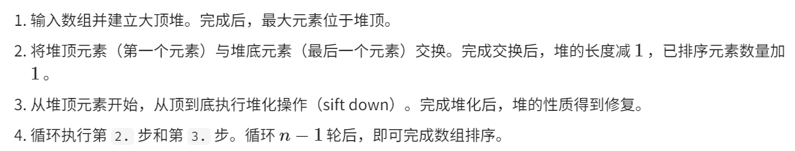

# 数据结构

## 1. 数组和链表的优缺点

数组：可下标访问；插入和删除效率低（要移动元素）；可能浪费内存。

链接：插入和删除快；查找效率低，必须遍历；非连续存储，避免内存空间的浪费。

## 2. 排序算法

### a. 选择排序

开启一个循环，每轮 **从未排序区间选择最小的元素**，将 **其放到已排序区间的末尾（下一个）**。

设数组长度为 n：


```cpp
class Solution {
public:
    vector<int> sortArray(vector<int>& nums) {
        int n = nums.size();
        for(int i = 0; i < n - 1; i++)
        {
            // 当前轮次最小元素应该放的位置为 i
            int k = i;  // k 保存当前轮次最小元素的下标
            for(int j = i + 1; j < n; j++)
            {
                if(nums[j] < nums[k])
                    k = j;
            }
            swap(nums[i], nums[k]); 	// 这行导致非稳定
        }
        return nums;
    }
};
```

时间复杂度：$O(n^2)$。

空间复杂度：$O(1)$，原地排序。

**非稳定排序。**

### b. 冒泡排序

开启一个循环，每轮 **连续地比较与交换相邻元素实现排序**。

设数组长度为 n：


```cpp
class Solution {
public:
    vector<int> sortArray(vector<int>& nums) {
        int n = nums.size();
        for(int i = n - 1; i >= 0; i--)
        {
           for(int j = 0; j < i; j++)
           {
                if(nums[j] > nums[j + 1])
                    swap(nums[j], nums[j + 1]); 	// 冒泡中遇到相等元素不交换
           }
        }
        return nums;
    }
};
```

时间复杂度：$O(n^2)$。

空间复杂度：$O(1)$，原地排序。

稳定排序。

### c. 插入排序

开启一个循环，每轮 **在未排序区间选择一个基准元素**，将该元素 **与其左侧已排序区间的元素逐一比较大小**，并将该元素插入到正确的位置。

设数组长度为 n：


```cpp
class Solution {
public:
    vector<int> sortArray(vector<int>& nums) {
        int n = nums.size();
        for(int i = 1; i < n; i++)
        {
           int cur = nums[i], j = i - 1;
           while(j >= 0 && nums[j] > cur)
           {
                nums[j + 1] = nums[j];
                j--;
           }
           nums[j + 1] = cur;
        }
        return nums;
    }
};
```

时间复杂度：$O(n^2)$。

空间复杂度：$O(1)$，原地排序。

稳定排序。

### d. 快速排序

快速排序的核心操作是 **“哨兵划分”**，其目标是：选择数组中的某个元素作为“基准数”，将所有 **小于** 基准数的元素移到其左侧，而 **大于** 基准数的元素移到其右侧。

设数组长度为 n：


```cpp
class Solution {
public:
    int partition(vector<int>& nums, int left, int right)
    {
        int base = nums[left];
        int l = left, r = right;
        while(l < r)
        {
            while(l < r && nums[r] >= base) r--;
            while(l < r && nums[l] <= base) l++;
            swap(nums[l], nums[r]);
        }
        swap(nums[left], nums[l]); 	// 哨兵放到中间
        return l;
    }
    void quick_sort(vector<int>& nums, int left, int right)
    {
        if(left >= right) return;
        int pivot = partition(nums, left, right);
        quick_sort(nums, left, pivot - 1);  // 不能含哨兵
        quick_sort(nums, pivot + 1, right);
        
    }
    vector<int> sortArray(vector<int>& nums) {
        int n = nums.size();
        quick_sort(nums, 0, n - 1);
        return nums;
    }
};
```

时间复杂度：$O(nlogn)$，最坏情况下到 $O(n^2)$。


空间复杂度：$O(1)$，原地排序。

**非稳定排序。**

### e. 归并排序

分治。包含划分阶段和合并阶段。

设数组长度为 n：


```cpp
class Solution {
public:
    vector<int> tmp;
    void mergeSort(vector<int>& nums, int l, int r)
    {
        if(l >= r) return;
        int mid = l + (r - l) / 2;
        mergeSort(nums, l, mid);
        mergeSort(nums, mid + 1, r);
        int i = l, j = mid + 1;
        int cnt = 0;
        while(i <= mid && j <= r)
        {
            if(nums[i] <= nums[j])
            {
                tmp[cnt++] = nums[i];
                i++;
            } 
            else
            {
                tmp[cnt++] = nums[j];
                j++;
            }
        }
        while(i <= mid)
        {
            tmp[cnt++] = nums[i];
            i++;
        }
        while(j <= r)
        {
            tmp[cnt++] = nums[j];
            j++;
        }
        for(int i = l; i <= r; i++)
        {
            nums[i] = tmp[i - l];
        }
        return ;
    }
    vector<int> sortArray(vector<int>& nums) {
        int n = nums.size();
        tmp.resize(n, 0);
        mergeSort(nums, 0, n - 1);
        return nums;
    }
};
```

时间复杂度：$O(nlogn)$。

空间复杂度：$O(n)$，非原地排序。

稳定排序。

### f. 堆排序

分治。包含划分阶段和合并阶段。

设数组长度为 n：



```cpp
class Solution {
public:
    void downAdjust(vector<int>& nums, int i, int len)
    {
        for(; (i << 1) + 1 <= len;)
        {
            int lson = (i << 1) + 1;
            int rson = (i << 1) + 2;
            int large = i;
            if(lson <= len && nums[lson] > nums[large]) large = lson;
            if(rson <= len && nums[rson] > nums[large]) large = rson;
            if(large != i)
            {
                swap(nums[i], nums[large]);
                i = large;
            }
            else break;
        }
    }
    vector<int> sortArray(vector<int>& nums) {
        int n = nums.size();
        // create heap
        for(int i = (n - 1) / 2; i >= 0; i--)
            downAdjust(nums, i, n - 1);
        for(int i = n - 1; i > 0; i--)
        {
            swap(nums[i], nums[0]);
            downAdjust(nums, 0, i - 1);
        }
        return nums;
    }
};
```

时间复杂度：$O(nlogn)$，**建堆时间复杂度为 $O(n)$**，但从堆中提取最大元素的时间为 $O(logn)$，共提取 n - 1 次最大元素。


空间复杂度：$O(1)$，原地排序。

**非稳定排序。**在交换堆顶元素和堆底元素时，相等元素的相对位置可能发生变化。

### g. top K 问题

堆排序时间复杂度：

- 建堆的时间复杂度为 $O(n)$

- 先建堆，然后再 pop 出前 k 个元素，每次 pop 以后都要调整堆，所以总的时间复杂度为 $O(n + klogn)$。

快排时间复杂度：

- 如果只要求前 k 个元素，快排的时间复杂度为 $O(n)$：

  

- 如果还要求得这 k 个元素的排序，那么还要对这 k 个元素进行排序，快排的时间复杂度为 $O(n + klogk)$

## 2. 字典树（阿里）

### 在字典树和基数树中插入alibaba，然后又插入alimama，第二次插入的时候有什么区别

## 3. 解决哈希冲突的办法（阿里）


# 力扣

## 1. 手撕一道算法题，用队列实现栈（阿里）

2. 接雨水 腾讯