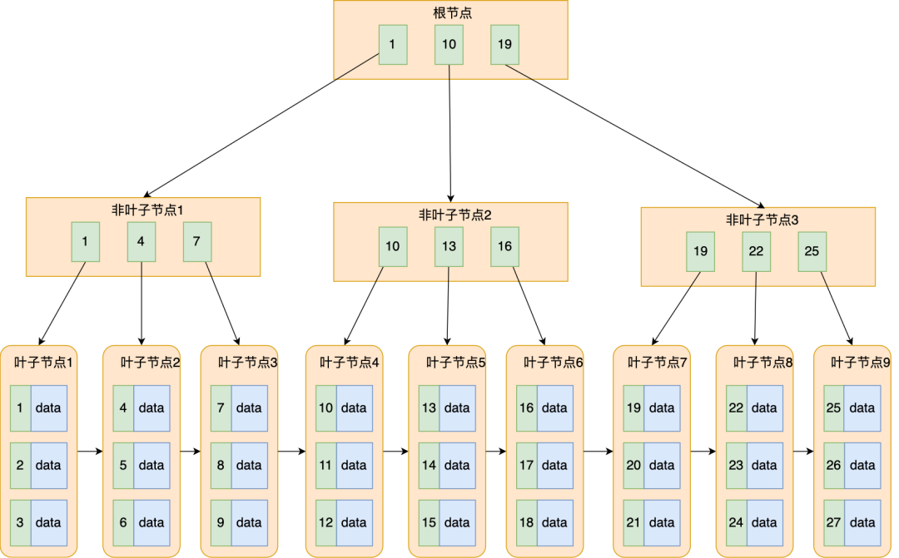
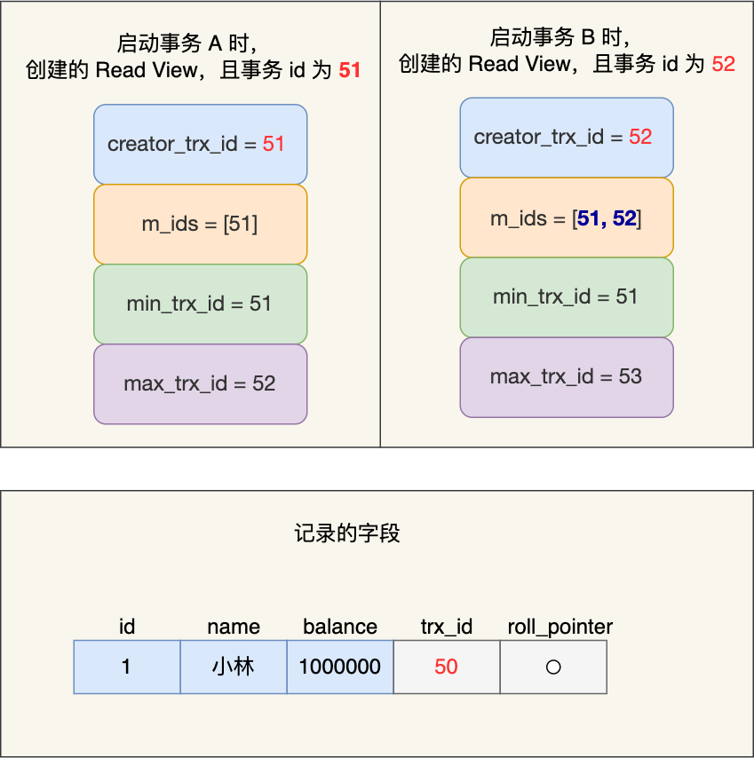
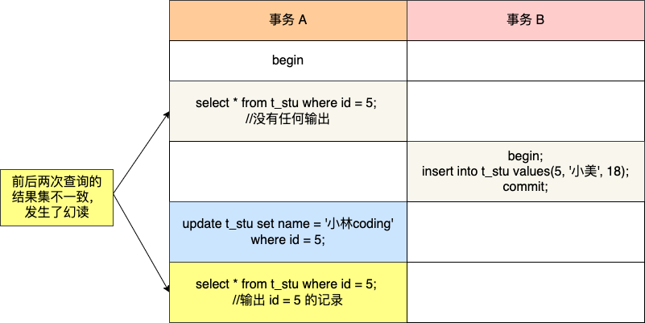

# 索引

**存储引擎**：如何 **存储数据**、如何为存储的数据 **建立索引** 和如何 **更新**、**查询** 数据等技术的实现方法。MySQL 存储引擎有 MyISAM 、InnoDB、Memory，其中 InnoDB 是在 MySQL 5.5 之后成为默认的存储引擎。


### ==mysql有哪些存储引擎（阿里）==

### ==INNODB和MYISAM的区别==

## 1. 索引的分类（阿里）

**聚簇索引**：B+ Tree 叶子结点直接存储 data。

- **innodb 中的主键索引是聚簇索引。**聚簇索引可以是任何非空的唯一索引，但如果表中没有设置主键，Innodb 会生成一个名为隐形聚簇索引的特殊索引。

**非聚簇索引**：B+ Tree 叶子结点不直接存储 data。

- **二级索引 = 辅助索引（Secondary Index）是非聚簇索引**，其叶子结点存储了索引和主键值。

**索引的分类**：

- 按「数据结构」分类：**B+tree 索引、Hash 索引、Full-text 索引**。
- 按「物理存储」分类：**聚簇索引（主键索引）、非聚簇索引（二级索引 / 辅助索引）**。
- 按「字段特性」分类：**主键索引、唯一索引、普通索引、前缀索引**。
- 按「字段个数」分类：**单列索引、联合索引**。

###  a. 按数据结构分类


#### - B+tree 索引

**B+Tree 索引**

- 一种多叉树，叶子节点存放数据，**非叶子节点只存放索引**，而且每个节点里的数据是 **按主键顺序存放** 的。
- 每一层父节点的索引值都会出现在下层子节点的索引值中，因此在叶子节点中，包括了所有的索引值信息。
-  **每一个叶子节点都有两个指针**，分别指向下一个叶子节点和上一个叶子节点，形成一个双向链表。


**B+Tree 的磁盘操作数**

- **数据库的索引和数据都是存储在硬盘的**，我们可以把 **读取一个节点当作一次磁盘 I/O 操作**。

- B+Tree 存储千万级的数据只需要 3-4 层高度就可以满足，这意味着从千万级的表查询目标数据最多需要 3-4 次磁盘 I/O，所以 B+Tree 相比于 B 树和二叉树来说，最大的优势在于 **查询效率很高**。

**主键索引的 B+Tree 和二级索引的 B+Tree 区别**

- 主键索引的 B+Tree 的叶子节点存放的是 **实际数据**，所有完整的用户记录都存放在主键索引的 B+Tree 的叶子节点里；
- 二级索引的 B+Tree 的叶子节点存放的是 **主键值**，而不是实际数据。


#### - Hash 索引（阿里）

Hash 等值查询的效率极高，时间复杂度为 O(1)。

但是 Hash 表不适合做范围查询，它更适合做等值的查询，这也是 B+Tree 索引要比 Hash 表索引有着更广泛的适用场景的原因。

#### - Full-text 索引

全文检索，略。

### b. 按物理存储分类

从物理存储的角度来看，索引分为聚簇索引（主键索引）、非聚簇索引（二级索引/辅助索引）。

**聚簇索引**：将 **数据** 存储与 **索引** 放到了一块，索引结构的 **叶子节点** 保存了 **行数据**。

**非聚簇索引**：将 **数据** 与 **索引** 分开存储，表数据存储顺序与索引顺序无关。

> 主键索引的 B+Tree 的叶子节点存放的是实际数据，所有完整的用户记录都存放在主键索引的 B+Tree 的叶子节点里；
>
> 二级索引的 B+Tree 的叶子节点存放的是主键值。

在创建表时，InnoDB 存储引擎会根据不同的场景选择不同的列作为索引，但 **定会创建一个聚集索引**：

- 如果有主键，默认会使用 **主键** 作为聚簇索引的索引键（key）；
- 如果没有主键，就选择 **第一个不包含 NULL 值的唯一列** 作为聚簇索引的索引键（key）；
- 在上面两个都没有的情况下，InnoDB 将自动生成一个 **隐式自增 id 列** 作为聚簇索引的索引键（key）；

其它索引都属于辅助索引 / 二级索引 / 非聚簇索引。

**创建的主键索引和二级索引默认使用的是 B+Tree 索引**。

#### - 覆盖索引和回表

覆盖索引：在使用二级索引查询时，如果查询的字段在索引中都能找到，那么就不需要根据索引对应的主键值再去主键索引中寻找 data，这叫覆盖索引。**只需要查一个 B+Tree 就能找到数据**。

回表：在使用二级索引查询时，如果查询的字段在索引中不都能找到，那么就需要根据索引对应的主键值再去主键索引中寻找 data，这叫回表。**查两个 B+Tree 才能查到数据**。


如果我用 product_no 二级索引查询商品，如下查询语句：

```sql
select * from product where product_no = '0002';
```

### c. 按字段特性分类

#### - 主键索引

主键索引就是建立在主键字段上的索引，通常在创建表的时候一起创建，一张表 **最多只有一个主键索引**，**索引列的值不允许有空值**。

在创建表时，创建主键索引的方式如下：

```sql
CREATE TABLE table_name  (
  ....
  PRIMARY KEY (index_column_1) USING BTREE
);
```

#### - 唯一索引

唯一索引建立在 UNIQUE 字段上的索引，一张表 **可以有多个唯一索引**，**索引列的值必须唯一，但是允许有空值**。

在创建表时，创建唯一索引的方式如下：

```sql
CREATE TABLE table_name  (
  ....
  UNIQUE KEY(index_column_1,index_column_2,...) 
);
```

建表后，如果要创建唯一索引，可以使用这面这条命令：

```sql
CREATE UNIQUE INDEX index_name
ON table_name(index_column_1,index_column_2,...); 
```

#### - 普通索引

普通索引就是建立在普通字段上的索引，**既不要求字段为主键，也不要求字段为 UNIQUE**。

在创建表时，创建普通索引的方式如下：

```sql
CREATE TABLE table_name  (
  ....
  INDEX(index_column_1,index_column_2,...) 
);
```

建表后，如果要创建普通索引，可以使用这面这条命令：

```sql
CREATE INDEX index_name
ON table_name(index_column_1,index_column_2,...); 
```

#### - 前缀索引

前缀索引是指 **对字符类型字段的前几个字符建立的索引**，而不是在整个字段上建立的索引，前缀索引可以建立在字段类型为 char、 varchar、binary、varbinary 的列上。

使用前缀索引的目的是为了**减少索引占用的存储空间，提升查询效率**。

在创建表时，创建前缀索引的方式如下：

```sql
CREATE TABLE table_name(
    column_list,
    INDEX(column_name(length))
); 
```

建表后，如果要创建前缀索引，可以使用这面这条命令：

```sql
CREATE INDEX index_name
ON table_name(column_name(length)); 
```

### d. 按字段个数分类

单列索引：建立在 **单列** 上的索引称为单列索引，比如主键索引。

联合索引（复合索引）：建立在 **多列** 上的索引称为联合索引。

#### - 联合索引

通过将多个字段组合成一个索引，该索引就被称为联合索引。

比如，将商品表中的 product_no 和 name 字段组合成联合索引`(product_no, name)`，创建联合索引的方式如下：

```sql
CREATE INDEX index_product_no_name ON product(product_no, name);
```

联合索引`(product_no, name)` 的 B+Tree 示意图如下：


##### 最左匹配原则

- 使用联合索引时，存在 **最左匹配原则**，也就是按照最左优先的方式进行索引的匹配。
- 当在联合索引查询数据时，先按 product_no 字段比较，在 product_no 相同的情况下再按 name 字段比较。也就是说，联合索引查询的 B+Tree 是先按 product_no 进行排序，然后在 product_no 相同的情况再按 name 字段排序。

比如，如果创建了一个 `(a, b, c)` 联合索引，如果查询条件是以下这几种，就可以匹配上联合索引：

- where a=1；
- where a=1 and b=2 and c=3；
- where a=1 and b=2；

需要注意的是，因为有查询优化器，所以 a 字段在 where 子句的顺序并不重要。

但是，如果查询条件是以下这几种，因为 **不符合最左匹配原则**，所以就无法匹配上联合索引，联合索引就会失效:

- where b=2；
- where c=3；
- where b=2 and c=3；

上面这些查询条件之所以会失效，是因为`(a, b, c)` 联合索引，是先按 a 排序，在 a 相同的情况再按 b 排序，在 b 相同的情况再按 c 排序。所以，**b 和 c 是全局无序，局部相对有序的**，这样在没有遵循最左匹配原则的情况下，是无法利用到索引的。

##### 联合索引范围查询（当对某一字段进行范围查询时，下一个字段索引将会失效；等号另处理）

联合索引有一些特殊情况，**并不是查询过程使用了联合索引查询，就代表联合索引中的所有字段都用到了联合索引进行索引查询**，也就是可能存在部分字段用到联合索引的 B+Tree，部分字段没有用到联合索引的 B+Tree 的情况。

这种特殊情况就发生在范围查询。联合索引的最左匹配原则会一直向右匹配直到遇到「范围查询」就会停止匹配。也就是说，**范围查询的字段可以用到联合索引，但是在范围查询字段的后面的字段无法用到联合索引**。

> Q1: `select * from t_table where a > 1 and b = 2`，联合索引（a, b）哪一个字段用到了联合索引的 B+Tree？

由于联合索引（二级索引）是先按照 a 字段的值排序的，所以我可以找到第一个 a > 1 的叶子结点，然后接下来遍历的是叶子结点产生的双向链表，在这个链表中， b 字段的值是无序的，所以 b 字段无法用到联合索引。

因此，**Q1 这条查询语句只有 a 字段用到了联合索引进行索引查询，而 b 字段并没有使用到联合索引**。（key_len = 4）

> Q2: `select * from t_table where a >= 1 and b = 2`，联合索引（a, b）哪一个字段用到了联合索引的 B+Tree？

Q2 和 Q1 的查询语句很像，唯一的区别就是 a 字段的查询条件「大于等于」。

**等号需要另处理**。在 a = 1 的项中，**b 字段的值是「有序」的**，所以直接利用联合索引查询到第一条 b = 2 的记录。而对于 a > 1 的项，和 Q1 一样处理。

所以，**Q2 这条查询语句 a 和 b 字段都用到了联合索引进行索引查询**。（key_len = 8）

> Q3: `SELECT * FROM t_table WHERE a BETWEEN 2 AND 8 AND b = 2`，联合索引（a, b）哪一个字段用到了联合索引的 B+Tree？

Q3 查询条件中 `a BETWEEN 2 AND 8` 的意思是查询 a 字段的值在 2 和 8 之间的记录。类似于 Q2 查询语句，因此， **Q3 这条查询语句 a 和 b 字段都用到了联合索引进行索引查询**。（key_len = 8）

> Q4: `SELECT * FROM t_user WHERE name like 'j%' and age = 22`，联合索引（name, age）哪一个字段用到了联合索引的 B+Tree？

虽然在符合前缀为 ‘j’ 的 name 字段的二级索引记录的范围里，age 字段的值是「无序」的，**但是对于符合 name = j 的二级索引记录的范围里，age字段的值是「有序」的**。

于是，在确定需要扫描的二级索引的范围时，当二级索引记录的 name 字段值为 ‘j’ 时，可以通过 age = 22 条件减少需要扫描的二级索引记录范围（age 字段可以利用联合索引进行索引查询的意思）。也就是说，从符合 `name = 'j' and age = 22` 条件的第一条记录时开始扫描，而不需要从第一个 name 为 j 的记录开始扫描 。如下图的右边：


所以，**Q4 这条查询语句 a 和 b 字段都用到了联合索引进行索引查询**。（key_len = 126）

- name 字段的类型是 varchar(30) 且不为 NULL，数据库表使用了 utf8mb4 字符集，一个字符集为 utf8mb4 的字符是 4 个字节，因此 name 字段的实际数据最多占用的存储空间长度是 120 字节（30 x 4）；又因为 name 是变长类型的字段，需要再加 **2 字节（用于存储该字段实际数据的长度值）**，也就是 name 的 key_len 为 122。
- age 字段的类型是 int 且不为 NULL，key_len 为 4。

综上所示，**联合索引的最左匹配原则，在遇到范围查询（如 >、<）的时候，就会停止匹配，也就是范围查询的字段可以用到联合索引，但是在范围查询字段的后面的字段无法用到联合索引。注意，对于 >=、<=、BETWEEN、like 前缀匹配的范围查询，并不会停止匹配**。

##### 索引下推

对于联合索引（a, b），在执行 `select * from table where a > 1 and b = 2` 语句的时候，只有 a 字段能用到索引，那在联合索引的 B+Tree 找到第一个满足条件的主键值（ID 为 2）后，还需要判断其他条件是否满足（看 b 是否等于 2），那是在联合索引里判断？还是回主键索引去判断呢？

- 在 MySQL 5.6 之前，只能从 ID2 （主键值）开始回表，到「主键索引」上找出数据行，再对比 b 字段值。
- 而 MySQL 5.6 引入的 **索引下推优化**（index condition pushdown)， **可以在联合索引遍历过程中，对联合索引中包含的字段先做判断，直接过滤掉不满足条件的记录，减少回表次数**。

当你的查询语句的执行计划里，出现了 Extra 为 `Using index condition`，那么说明使用了索引下推的优化。

##### 索引区分度

建立联合索引时的字段顺序，对索引效率也有很大影响。越靠前的字段被用于索引过滤的概率越高，实际开发工作中 **建立联合索引时，要把区分度大的字段排在前面**，这样区分度大的字段越有可能被更多的 SQL 使用到。

**区分度**：某个字段 column 不同值的个数「除以」表的总行数，计算公式如下：


比如，性别的区分度就很小，不适合建立索引或不适合排在联合索引列的靠前的位置，而 UUID 这类字段就比较适合做索引或排在联合索引列的靠前的位置。

因为如果索引的区分度很小，假设字段的值分布均匀，那么无论搜索哪个值都可能得到一半的数据。在这些情况下，还不如不要索引，因为 MySQL 还有一个查询优化器，查询优化器发现某个值出现在表的数据行中的百分比（惯用的百分比界线是"30%"）很高的时候，它一般会忽略索引，进行全表扫描。

##### 联合索引进行排序

针对下面这条 SQL，你怎么通过索引来提高查询效率呢？

```sql
select * from order where status = 1 order by create_time asc
```

给 status 和 create_time 列建立一个联合索引，因为这样可以避免 MySQL 数据库发生 **文件排序**（当没有合适的索引可用时，MySQL 使用文件排序，设计文件读写，效率较慢）。

如果只用到 status 的索引，但是这条语句还要对 create_time 排序，这时就要用文件排序 filesort，在 SQL 执行计划中，Extra 列会出现 Using filesort。

要利用索引的有序性，在 status 和 create_time 列建立联合索引，这样根据 status 筛选后的数据就是按照 create_time 排好序的，避免文件排序，提高了查询效率。

## 2. 什么时候需要 / 不需要创建索引？

### - 索引的缺点

- 需要 **占用物理空间**，数量越大，占用空间越大；
- 创建索引和维护索引要 **耗费时间**，这种时间随着数据量的增加而增大；
- 会 **降低表的增删改的效率**，因为每次增删改索引，B+ 树为了维护索引有序性，都需要进行动态维护。

### - 什么时候适用索引？

- 字段有 **唯一性** 限制的，比如商品编码；
- **经常用于 `WHERE` 查询条件的字段**，这样能够提高整个表的查询速度，如果查询条件不是一个字段，可以建立联合索引。
- **经常用于 `GROUP BY` 和 `ORDER BY` 的字段**，这样在查询的时候就不需要再去做一次排序了，因为我们都已经知道了建立索引之后在 B+Tree 中的记录都是排序好的。

### - 什么时候不需要创建索引？

- **`WHERE` 条件，`GROUP BY`，`ORDER BY` 里用不到的字段**，索引的价值是快速定位，如果起不到定位的字段通常是不需要创建索引的，因为索引是会占用物理空间的。
- **字段中存在大量重复数据**，不需要创建索引，比如性别字段，只有男女，如果数据库表中，男女的记录分布均匀，那么无论搜索哪个值都可能得到一半的数据。在这些情况下，还不如不要索引，**因为 MySQL 还有一个查询优化器，查询优化器发现某个值出现在表的数据行中的百分比很高的时候，它一般会忽略索引，进行全表扫描。**
- **表数据太少** 的时候，不需要创建索引；
- **经常更新的字段** 不用创建索引，比如不要对电商项目的用户余额建立索引，因为索引字段频繁修改，由于要维护 B+Tree的有序性，那么就需要频繁的重建索引，这个过程是会影响数据库性能的。

## 3. 优化索引的方法

### - 前缀索引优化

在一些大字符串的字段作为索引时，使用前缀索引可以减小索引字段大小，可以增加一个索引页中存储的索引值，有效提高索引的查询速度。

前缀索引有一定的局限性，例如：

- order by 就无法使用前缀索引；
- 无法把前缀索引用作覆盖索引；

### - 覆盖索引优化

通过建立联合索引避免回表。

覆盖索引是指 SQL 中 query 的所有字段，在索引 B+Tree 的叶子节点上都能找得到的那些索引，从二级索引中查询得到记录，而不需要通过聚簇索引查询获得，可以避免回表的操作。

假设我们只需要查询商品的名称、价格，我们可以建立一个联合索引，即「商品ID、名称、价格」作为一个联合索引。如果索引中存在这些数据，查询将不会再次检索主键索引，从而避免回表。

所以，使用覆盖索引的好处就是，不需要查询出包含整行记录的所有信息，也就减少了大量的 I/O 操作。

### - 主键索引最好是自增的

**如果我们使用自增主键**，那么每次插入的新数据就会按顺序添加到当前索引节点的位置，不需要移动已有的数据，当页面写满，就会自动开辟一个新页面。因为每次 **插入一条新记录，都是追加操作，不需要重新移动数据**，因此这种插入数据的方法效率非常高。

**如果我们使用非自增主键**，由于每次插入主键的索引值都是随机的，因此每次插入新的数据时，就可能会插入到现有数据页中间的某个位置，这将不得不移动其它数据来满足新数据的插入，甚至需要从一个页面复制数据到另外一个页面，我们通常将这种情况称为 **页分裂**。**页分裂还有可能会造成大量的内存碎片，导致索引结构不紧凑，从而影响查询效率**。

举个例子，假设某个数据页中的数据是1、3、5、9，且数据页满了，现在准备插入一个数据7，则需要把数据页分割为两个数据页：


出现页分裂时，需要将一个页的记录移动到另外一个页，性能会受到影响，同时页空间的利用率下降，造成存储空间的浪费。

而如果记录是顺序插入的，例如插入数据11，则只需开辟新的数据页，也就不会发生页分裂：


因此，在使用 InnoDB 存储引擎时，如果没有特别的业务需求，建议使用自增字段作为主键。

另外，主键字段的长度不要太大，因为**主键字段长度越小，意味着二级索引的叶子节点越小（二级索引的叶子节点存放的数据是主键值），这样二级索引占用的空间也就越小**。

### - ==索引最好设置为 NOT NULL==

为了更好的利用索引，索引列要设置为 NOT NULL 约束。有两个原因：

- 索引列存在 NULL 就会导致优化器在做索引选择的时候更加复杂，更加难以优化。

- 第二个原因：NULL 值是一个没意义的值，但是它会占用物理空间，所以会带来的存储空间的问题，因为 InnoDB 存储记录的时候，如果表中存在允许为 NULL 的字段，那么行格式 (opens new window) 中**至少会用 1 字节空间存储 NULL 值列表**，如下图的紫色部分：

  

### ==- 防止索引失效==

用上了索引并不意味着查询的时候会使用到索引，所以我们心里要清楚有哪些情况会导致索引失效，从而避免写出索引失效的查询语句，否则这样的查询效率是很低的。

这里简单说一下，发生索引失效的情况：

- 当我们使用左或者左右模糊匹配的时候，也就是 `like %xx` 或者 `like %xx%`这两种方式都会造成索引失效；
- 当我们在查询条件中对索引列做了计算、函数、类型转换操作，这些情况下都会造成索引失效；
- 联合索引要能正确使用需要遵循最左匹配原则，也就是按照最左优先的方式进行索引的匹配，否则就会导致索引失效。
- 在 WHERE 子句中，如果在 OR 前的条件列是索引列，而在 OR 后的条件列不是索引列，那么索引会失效。

我上面说的是常见的索引失效场景，实际过程中，可能会出现其他的索引失效场景，这时我们就需要查看执行计划，通过执行计划显示的数据判断查询语句是否使用了索引。

如下图，就是一个没有使用索引，并且是一个全表扫描的查询语句。


对于执行计划，参数有：

- possible_keys 字段表示可能用到的索引；
- key 字段表示实际用的索引，如果这一项为 NULL，说明没有使用索引；
- key_len 表示索引的长度；
- rows 表示扫描的数据行数。
- type 表示数据扫描类型，我们需要重点看这个。

type 字段就是描述了找到所需数据时使用的扫描方式是什么，常见扫描类型的**执行效率从低到高的顺序为**：

- All（全表扫描）；
- index（全索引扫描）；
- range（索引范围扫描）；
- ref（非唯一索引扫描）；
- eq_ref（唯一索引扫描）；
- const（结果只有一条的主键或唯一索引扫描）。

在这些情况里，all 是最坏的情况，因为采用了全表扫描的方式。index 和 all 差不多，只不过 index 对索引表进行全扫描，这样做的好处是不再需要对数据进行排序，但是开销依然很大。所以，要尽量避免全表扫描和全索引扫描。

range 表示采用了索引范围扫描，一般在 where 子句中使用 < 、>、in、between 等关键词，只检索给定范围的行，属于范围查找。**从这一级别开始，索引的作用会越来越明显，因此我们需要尽量让 SQL 查询可以使用到 range 这一级别及以上的 type 访问方式**。

ref 类型表示采用了非唯一索引，或者是唯一索引的非唯一性前缀，返回数据返回可能是多条。因为虽然使用了索引，但该索引列的值并不唯一，有重复。这样即使使用索引快速查找到了第一条数据，仍然不能停止，要进行目标值附近的小范围扫描。但它的好处是它并不需要扫全表，因为索引是有序的，即便有重复值，也是在一个非常小的范围内扫描。

eq_ref 类型是使用主键或唯一索引时产生的访问方式，通常使用在多表联查中。比如，对两张表进行联查，关联条件是两张表的 user_id 相等，且 user_id 是唯一索引，那么使用 EXPLAIN 进行执行计划查看的时候，type 就会显示 eq_ref。

const 类型表示使用了主键或者唯一索引与常量值进行比较，比如 select name from product where id=1。

需要说明的是 const 类型和 eq_ref 都使用了主键或唯一索引，不过这两个类型有所区别，**const 是与常量进行比较，查询效率会更快，而 eq_ref 通常用于多表联查中**。

> 除了关注 type，我们也要关注 extra 显示的结果。

这里说几个重要的参考指标：

- Using filesort ：当查询语句中包含 group by 操作，而且无法利用索引完成排序操作的时候， 这时不得不选择相应的排序算法进行，甚至可能会通过文件排序，效率是很低的，所以要避免这种问题的出现。
- Using temporary：使了用临时表保存中间结果，MySQL 在对查询结果排序时使用临时表，常见于排序 order by 和分组查询 group by。效率低，要避免这种问题的出现。
- Using index：所需数据只需在索引即可全部获得，不须要再到表中取数据，也就是使用了覆盖索引，避免了回表操作，效率不错。

## ==3. 索引失效==

MySQL 默认的存储引擎是 InnoDB，它采用 B+Tree（叶子节点保存数据本身）作为索引的数据结构。在创建表时，InnoDB 存储引擎默认会创建一个主键索引。

这里有一张 t_user 表，其中 id 字段为主键索引，其他都是普通字段。


## 4. 为什么 MySQL InnoDB 选择 B+tree 作为索引的数据结构

##### 索引要求

- 能在尽可能少的 **磁盘的 I/O 操作** 中完成查询工作；
  - MySQL 的数据是持久化的，意味着数据（索引+记录）是保存到磁盘上的。磁盘读写慢，一次磁盘读写需要读写多个扇区。
  - 当通过索引查找某行数据的时候，需要先从磁盘读取索引到内存，再通过索引从磁盘中找到某行数据，然后读入到内存，也就是说查询过程中会发生多次磁盘 I/O，而磁盘 I/O 次数越多，所消耗的时间也就越大。
- 要能高效地查询某一个记录，也要能高效地执行 **范围查找**；
  - MySQL 是支持范围查找的，所以索引的数据结构不仅要能高效地查询某一个记录，而且也要能高效地执行范围查找。

##### 不同的数据结构

###### 线性结构实现：

- 直接遍历 O(n)
- 二分查找 O(log n)，需要维护有序队列，插入元素会导致后面所有元素后移，需要大量的磁盘读写。

###### 非线性结构实现：（避免增删元素导致的大量磁盘读写）

- 二叉查找树 O(log n)，若每次插入的都是最大元素，二叉查找树为退化为链表，复杂度退化为 O(n)。

- 平衡二叉树、红黑树 O(log n)，因为只有两个孩子，所以树会越来越高

- B 树，不再限制一个节点只有 2 个子节点，但是每个节点（非叶节点和叶子节点）都包含索引和记录，占用存储空间较大，且非叶节点保存的记录在查找时无用。另外，B 树不适合范围查找（需要中序遍历）。

- B+ 树，非叶节点只保存索引值。

  

B+ 树与 B 树差异的点，主要是以下这几点：

- 叶子节点（最底部的节点）才会存放实际数据（索引+记录），**非叶子节点只会存放索引**；
- 所有索引都会在叶子节点出现，**叶子节点之间构成一个有序链表**（B 树叶子结点之间没有链表结构）；

##### ==B+ 和 B 树的性能区别：==

## ==5. 从数据页的角度看 B+ 树==

**InnoDB 的数据是按「数据页」为单位来读写的**，也就是说，当需要读一条记录的时候，并不是将这个记录本身从磁盘读出来，而是以页为单位，将其整体读入内存。

数据库的 I/O 操作的最小单位是页，**InnoDB 数据页的默认大小是 16KB**，意味着数据库每次读写都是以 16KB 为单位的，一次最少从磁盘中读取 16K 的内容到内存中，一次最少把内存中的 16K 内容刷新到磁盘中。

Innodb 使用的  B+ 树有一些特别的点，比如：

- B+ 树的叶子节点之间是用**「双向链表」**进行连接，这样的好处是既能向右遍历，也能向左遍历。
- B+ 树点节点内容是 **数据页**，数据页里存放了用户的记录以及各种信息，每个数据页默认大小是 16 KB。


### 数据页结构


这 7 个部分的作用如下图：


在文件头 File Header 中有两个指针，分别指向上一个数据页和下一个数据页，连接起来的页相当于一个双向的链表，如下图所示：


**采用链表的结构是让数据页之间不需要是物理上的连续的，而是逻辑上的连续。**

**数据页中的记录按照「主键」顺序组成单向链表**，单向链表的特点就是插入、删除非常方便，但是检索效率不高，最差的情况下需要遍历链表上的所有节点才能完成检索。

因此，数据页中有一个**页目录**，起到记录的索引作用，就像我们书那样，针对书中内容的每个章节设立了一个目录，想看某个章节的时候，可以查看目录，快速找到对应的章节的页数，而数据页中的页目录就是为了能快速找到记录。

那 InnoDB 是如何给记录创建页目录的呢？页目录与记录的关系如下图：


页目录创建的过程如下：

1. 将所有的记录划分成几个组，这些记录包括最小记录和最大记录，但不包括标记为“已删除”的记录；
2. 每个记录组的最后一条记录就是组内最大的那条记录，并且最后一条记录的头信息中会存储该组一共有多少条记录，作为 n_owned 字段（上图中粉红色字段）
3. 页目录用来存储每组最后一条记录的地址偏移量，这些地址偏移量会按照先后顺序存储起来，每组的地址偏移量也被称之为槽（slot），**每个槽相当于指针指向了不同组的最后一个记录**。

从图可以看到，**页目录就是由多个槽组成的，槽相当于分组记录的索引**。然后，因为记录是按照「主键值」从小到大排序的，所以**我们通过槽查找记录时，可以使用二分法快速定位要查询的记录在哪个槽（哪个记录分组），定位到槽后，再遍历槽内的所有记录，找到对应的记录**，无需从最小记录开始遍历整个页中的记录链表。

以上面那张图举个例子，5 个槽的编号分别为 0，1，2，3，4，我想查找主键为 11 的用户记录：

- 先二分得出槽中间位是 (0+4)/2=2 ，2号槽里最大的记录为 8。因为 11 > 8，所以需要从 2 号槽后继续搜索记录；
- 再使用二分搜索出 2 号和 4 槽的中间位是 (2+4)/2= 3，3 号槽里最大的记录为 12。因为 11 < 12，所以主键为 11 的记录在 3 号槽里；
- 这里有个问题，**「槽对应的值都是这个组的主键最大的记录，如何找到组里最小的记录」**？比如槽 3 对应最大主键是 12 的记录，那如何找到最小记录 9。解决办法是：通过槽 3 找到 槽 2 对应的记录，也就是主键为 8 的记录。主键为 8 的记录的下一条记录就是槽 3 当中主键最小的 9 记录，然后开始向下搜索 2 次，定位到主键为 11 的记录，取出该条记录的信息即为我们想要查找的内容。

看到第三步的时候，可能有的同学会疑问，如果某个槽内的记录很多，然后因为记录都是单向链表串起来的，那这样在槽内查找某个记录的时间复杂度不就是 O(n) 了吗？

这点不用担心，InnoDB 对每个分组中的记录条数都是有规定的，槽内的记录就只有几条：

- 第一个分组中的记录只能有 1 条记录；
- 最后一个分组中的记录条数范围只能在 1-8 条之间；
- 剩下的分组中记录条数范围只能在 4-8 条之间。

### B+ 树是如何进行查询的？

InnoDB 里的 B+ 树中的**每个节点都是一个数据页**，结构示意图如下：


通过上图，我们看出 B+ 树的特点：

- 只有叶子节点（最底层的节点）才存放了数据，非叶子节点（其他上层节）仅用来存放目录项作为索引。
- 非叶子节点分为不同层次，通过分层来降低每一层的搜索量；
- 所有节点按照索引键大小排序，构成一个双向链表，便于范围查询；

我们再看看 B+ 树如何实现快速查找主键为 6 的记录，以上图为例子：

- 从根节点开始，通过二分法快速定位到符合页内范围包含查询值的页，因为查询的主键值为 6，在[1, 7)范围之间，所以到页 30 中查找更详细的目录项；
- 在非叶子节点（页30）中，继续通过二分法快速定位到符合页内范围包含查询值的页，主键值大于 5，所以就到叶子节点（页16）查找记录；
- 接着，在叶子节点（页16）中，通过槽查找记录时，使用二分法快速定位要查询的记录在哪个槽（哪个记录分组），定位到槽后，再遍历槽内的所有记录，找到主键为 6 的记录。

可以看到，在定位记录所在哪一个页时，也是通过二分法快速定位到包含该记录的页。定位到该页后，又会在该页内进行二分法快速定位记录所在的分组（槽号），最后在分组内进行遍历查找。

### 二级索引

二级索引的 B+ 树如下图，数据部分为主键值：


因此，**如果某个查询语句使用了二级索引，但是查询的数据不是主键值，这时在二级索引找到主键值后，需要去聚簇索引中获得数据行，这个过程就叫作「回表」，也就是说要查两个 B+ 树才能查到数据。不过，当查询的数据是主键值时，因为只在二级索引就能查询到，不用再去聚簇索引查，这个过程就叫作「索引覆盖」，也就是只需要查一个 B+ 树就能找到数据。**

- 

## 6. ==MySQL 单表不要超过 2000W 行，靠谱吗？==


# 事务

## 1. 事务的特性

- **原子性（Atomicity）**：一个事务中的所有操作，要么全部完成，要么全部不完成。若在事务执行过程中发生错误，会被回滚到事务开始前的状态。
- **一致性（Consistency）**：是指事务操作前和操作后，数据满足完整性约束，数据库保持一致性状态。比如，张三向李四转100元，转账前和转账后的数据是正确的状态，这就叫一致性，如果出现张三转出100元，李四账号没有增加100元，这就出现了数据错误，就没有达到一致性。
- **隔离性（Isolation）**：多个用户并发访问数据库时，数据库为每一个用户开启的事务，不被其他事务的操作数据所干扰，多个并发事务之间要相互隔离。
- **持久性（Durability）**：事务处理结束后，对数据的修改就是永久的，即便系统故障也不会丢失。

### - ==InnoDB 引擎通过什么技术保证事务的四个特性？==

- 持久性： redo log （重做日志）
- 原子性： undo log（回滚日志）
- 隔离性： MVCC（多版本并发控制） 或锁机制
- 一致性：持久性 + 原子性 + 隔离性

## 2. 并发事务时会出现什么异常状态？

### - 脏读

脏读：**一个事务「读到」了另一个「未提交事务修改过的数据」。**

假设有 A 和 B 这两个事务同时在处理，事务 A 先开始从数据库中读取小林的余额数据，然后再执行更新操作，如果此时事务 A 还 **没有提交事务**，而此时正好事务 B 也从数据库中读取小林的余额数据，那么事务 B 读取到的余额数据是刚才事务 A 更新后的数据，即使没有提交事务。


因为事务 A 是还没提交事务的，也就是它随时可能发生回滚操作，如果在上面这种情况事务 A 发生了回滚，那么事务 B 刚才得到的数据就是过期的数据，这种现象就被称为脏读。

### - 不可重复读

不可重复读：**在一个 [事务] 内多次读取同一个数据，出现前后两次读到的数据不一样的情况**。

假设有 A 和 B 这两个事务同时在处理，事务 A 先开始从数据库中读取小林的余额数据，然后继续执行代码逻辑处理，在这过程中如果事务 B 更新了这条数据，并提交了事务，那么当事务 A 再次读取该数据时，就会发现前后两次读到的数据是不一致的，这种现象就被称为不可重复读。


### - 幻读

幻读：**在一个 [事务] 内多次查询某个符合查询条件的「记录数量」，如果出现前后两次查询到的记录数量不一样的情况，就意味着发生了「幻读」现象。**

假设有 A 和 B 这两个事务同时在处理，事务 A 先开始从数据库查询账户余额大于 100 万的记录，发现共有 5 条，然后事务 B 也按相同的搜索条件也是查询出了 5 条记录。


接下来，事务 A 插入了一条余额超过 100 万的账号，并 **提交了事务**，此时数据库超过 100 万余额的账号个数就变为 6。然后事务 B 再次查询账户余额大于 100 万的记录，此时查询到的记录数量有 6 条，发现和前一次读到的记录数量不一样了，这种现象就被称为幻读。

### - 三个现象的严重性排序


## 3. 四种隔离级别

- **读未提交（read uncommitted）**，指一个事务还没提交时，它做的变更就能被其他事务看到；
- **读提交（read committed）**，指一个事务提交之后，它做的变更才能被其他事务看到；
- **可重复读（repeatable read）**，指一个事务执行过程中看到的数据，一直跟这个事务启动时看到的数据是一致的，**MySQL InnoDB 引擎的默认隔离级别**；
- **串行化（serializable）**；会对记录加上读写锁，在多个事务对这条记录进行读写操作时，如果发生了读写冲突的时候，**后访问的事务必须等前一个事务执行完成**，才能继续执行；

### - 按隔离水平高低排序


### - 不同隔离水平可能出现的异常状态


- 在「读未提交」隔离级别下，可能发生脏读、不可重复读和幻读现象；
- 在「读提交」隔离级别下，可能发生不可重复读和幻读现象，但是不可能发生脏读现象；
- 在「可重复读」隔离级别下，可能发生幻读现象（插入新数据行），但是不可能脏读和不可重复读现象；
- 在「串行化」隔离级别下，脏读、不可重复读和幻读现象都不可能会发生。

要解决脏读现象，就要升级到「读提交」以上的隔离级别；

要解决不可重复读现象，就要升级到「可重复读」的隔离级别；

**要解决幻读现象不建议将隔离级别升级到「串行化」。（串行化影响性能）**

### - 举例说明四种隔离级别

有一张账户余额表，里面有一条账户余额为 100 万的记录。然后有两个并发的事务，事务 A 只负责查询余额，事务 B 则会将我的余额改成 200 万，下面是按照时间顺序执行两个事务的行为：


在不同隔离级别下，事务 A 执行过程中查询到的余额可能会不同：

- 在「读未提交」隔离级别下，事务 B 修改余额后，虽然没有提交事务，但是此时的余额已经可以被事务 A 看见了，于是事务 A 中余额 V1 查询的值是 200 万，余额 V2、V3 自然也是 200 万了；
- 在「读提交」隔离级别下，事务 B 修改余额后，因为没有提交事务，所以事务 A 中余额 V1 的值还是 100 万，等事务 B 提交完后，最新的余额数据才能被事务 A 看见，因此额 V2、V3 都是 200 万；
- 在「可重复读」隔离级别下，**事务 A 只能看见启动事务时的数据**，所以余额 V1、余额 V2 的值都是 100 万，当事务 A 提交事务后，就能看见最新的余额数据了，所以余额 V3 的值是 200 万；
- 在「串行化」隔离级别下，事务 B 在执行将余额 100 万修改为 200 万时，由于此前事务 A 执行了读操作，这样就发生了读写冲突，于是就会被锁住，**直到事务 A 提交后，事务 B 才可以继续执行**，所以从 A 的角度看，余额 V1、V2 的值是 100 万，余额 V3 的值是 200万。

### - 四种隔离级别具体实现

- 对于「读未提交」隔离级别的事务来说，因为可以读到未提交事务修改的数据，所以直接读取最新的数据就好了；
- 对于「串行化」隔离级别的事务来说，通过加读写锁的方式来避免并行访问；
- 对于「读提交」和「可重复读」隔离级别的事务来说，它们是通过 **Read View（数据快照） **来实现的，它们的区别在于创建 Read View 的时机不同。
  - 「读提交」隔离级别是在**「每个语句执行前」**都会重新生成一个 Read View，
  - 「可重复读」隔离级别是**「启动事务时」**生成一个 Read View，然后整个事务期间都在用这个 Read View。


### - 开始事务和启动事务

执行「开始事务」命令，并不意味着启动了事务。在 **MySQL 有两种开启事务的命令**，分别是：

- begin / start transaction 命令；
- start transaction with consistent snapshot 命令；

这两种开启事务的命令，事务的启动时机是不同的：

- 执行 begin/start transaction 命令后，并不代表事务启动了。只有在执行这个命令后，**执行了第一条 select 语句，才是事务真正启动的时机**；
- 执行 start transaction with consistent snapshot 命令，就会 **马上启动事务**。

### - Read View 在 MVCC 里如何工作

#### Read View


Read View 有四个重要的字段：

- m_ids ：指的是在创建 Read View 时，当前数据库中「活跃事务」（启动了但还没提交的事务）的事务 id **列表**。
- min_trx_id ：指的是在创建 Read View 时，当前数据库中「活跃事务」中事务 **id 最小的事务**，也就是 m_ids 的最小值。
- max_trx_id ：这个并不是 m_ids 的最大值，而是 **创建 Read View 时当前数据库中应该给下一个事务的 id 值**，也就是全局事务中最大的事务 id 值 + 1；
- creator_trx_id ：指的是 **创建该 Read View 的事务的事务 id**。

#### 聚簇索引记录中的两个隐藏列

假设在账户余额表插入一条小林余额为 100 万的记录，整个示意图如下：


对于使用 **InnoDB** 存储引擎的数据库表，它的聚簇索引记录中都包含下面两个隐藏列：

- trx_id，当一个事务对某条聚簇索引记录进行改动时，就会 **把该事务的事务 id 记录在 trx_id 隐藏列里**；
- roll_pointer，**每次对某条聚簇索引记录进行改动时，都会把旧版本的记录写入到 undo 日志中**，然后**这个隐藏列是个指针，指向每一个旧版本记录**，于是就可以通过它找到修改前的记录。

#### Read View 的工作原理

在创建 Read View 后，我们可以将记录中的 trx_id 划分这三种情况：


一个事务去访问记录的时候，除了自己的更新记录总是可见之外，还有这几种情况：

- 如果记录的 trx_id 值小于 Read View 中的 `min_trx_id` 值，表示这个版本的记录是在创建 Read View  **前** 已经提交的事务生成的，所以该版本的记录对当前事务 **可见**。

- 如果记录的 trx_id 值 **大于等于** Read View 中的 `max_trx_id` 值，表示这个版本的记录是在创建 Read View **后** 才启动的事务生成的，所以该版本的记录对当前事务 **不可见**。

- 如果记录的 trx_id 值在 Read View 的 `min_trx_id` 和 `max_trx_id`之间，需要 **判断 trx_id 是否在 m_ids 列表中**：

  - 如果记录的 trx_id **在** `m_ids` 列表中，表示生成该版本记录的活跃事务依然活跃着（还没提交事务），所以该版本的记录对当前事务**不可见**。
  - 如果记录的 trx_id **不在** `m_ids`列表中，表示生成该版本记录的活跃事务已经被提交，所以该版本的记录对当前事务**可见**。

#### MVCC

**这种通过「版本链」来控制并发事务访问同一个记录时的行为就叫 MVCC（多版本并发控制）。**

### - 可重复读是如何工作的？

**可重复读隔离级别是 [启动事务] 时生成一个 Read View，然后 [整个事务期间] 都用这个 Read View**。

假设事务 A （事务 id 为51）启动后，紧接着事务 B （事务 id 为52）也启动了，那这两个事务创建的 Read View 如下：



在可重复读隔离级别下，假设事务 A 和事务 B 按顺序执行了以下操作：

- 事务 B 读取小林的账户余额记录，读到余额是 100 万；
- 事务 A 将小林的账户余额记录修改成 200 万，并没有提交事务；
- 事务 B 读取小林的账户余额记录，读到余额还是 100 万；
- 事务 A 提交事务；
- 事务 B 读取小林的账户余额记录，读到余额依然还是 100 万；

接下来，跟大家具体分析下。

事务 B 第一次读小林的账户余额记录，在找到记录后，它会先看这条记录的 trx_id，此时发现 trx_id 为 50，比事务 B 的 Read View 中的 min_trx_id 值（51）还小，这意味着 **修改这条记录的事务早就在事务 B 启动前提交过了**，所以该版本的记录对事务 B **可见** 的。

接着，事务 A 通过 update 语句将这条记录修改了（还未提交事务），将小林的余额改成 200 万，这时 MySQL 会记录相应的 undo log，并以链表的方式串联起来，形成**版本链**，如下图：


然后事务 B 第二次去读取该记录，发现这条记录的 trx_id 值为 51，在事务 B 的 Read View 的 min_trx_id 和 max_trx_id 之间，则需要判断 trx_id 值是否在 m_ids 范围内，判断的结果是在的，那么 **说明这条记录是被还未提交的事务修改的**，这时事务 B 并不会读取这个版本的记录。而是 **沿着 undo log 链条往下找旧版本的记录**，直到找到 trx_id 「小于」事务 B 的 Read View 中的 min_trx_id 值的第一条记录，所以事务 B 能读取到的是 trx_id 为 50 的记录，也就是小林余额是 100 万的这条记录。

就是通过这样的方式实现了，「可重复读」隔离级别下在事务期间读到的记录都是事务启动前的记录。

### - 读提交是如何工作的？

**读提交隔离级别是在 [每次读取数据] 时，都会生成一个新的 Read View**。

也意味着，事务期间的多次读取同一条数据，前后两次读的数据可能会出现不一致，因为可能这期间另外一个事务修改了该记录，并提交了事务。

那读提交隔离级别是怎么工作呢？我们还是以前面的例子来聊聊。

假设事务 A （事务 id 为51）启动后，紧接着事务 B （事务 id 为52）也启动了，接着按顺序执行了以下操作：

- 事务 B 读取数据（创建 Read View），小林的账户余额为 100 万；
- 事务 A 修改数据（还没提交事务），将小林的账户余额从 100 万修改成了 200 万；
- 事务 B 读取数据（创建 Read View），小林的账户余额为 100 万；
- 事务 A 提交事务；
- 事务 B 读取数据（创建 Read View），小林的账户余额为 200 万；

那具体怎么做到的呢？我们重点看事务 B 每次读取数据时创建的 Read View。前两次 事务 B 读取数据时创建的 Read View 如下图：


我们来分析下为什么事务 B 第二次读数据时，读不到事务 A （还未提交事务）修改的数据？

事务 B 在找到小林这条记录时，会看这条记录的 trx_id 是 51，在事务 B 的 Read View 的 min_trx_id 和 max_trx_id 之间，接下来需要判断 trx_id 值是否在 m_ids 范围内，判断的结果是在的，那么说明 **这条记录是被还未提交的事务修改的，这时事务 B 并不会读取这个版本的记录**。而是，**沿着 undo log 链条往下找旧版本的记录**，直到找到 trx_id 「小于」事务 B 的 Read View 中的 min_trx_id 值的第一条记录，所以事务 B 能读取到的是 trx_id 为 50 的记录，也就是小林余额是 100 万的这条记录。

我们来分析下为什么事务 A 提交后，事务 B 就可以读到事务 A 修改的数据？

在事务 A 提交后，**由于隔离级别是「读提交」，所以事务 B 在每次读数据的时候，会重新创建 Read View**，此时事务 B 第三次读取数据时创建的 Read View 如下：


事务 B 在找到小林这条记录时，会发现这条记录的 trx_id 是 51，比事务 B 的 Read View 中的 min_trx_id 值（52）还小，这意味着修改这条记录的事务早就在创建 Read View 前提交过了，所以该版本的记录对事务 B 是 **可见**的。

正是因为在读提交隔离级别下，事务每次读数据时都重新创建 Read View，那么在事务期间的多次读取同一条数据，前后两次读的数据可能会出现不一致，因为可能这期间另外一个事务修改了该记录，并提交了事务。

## 4. MySQL 中的隔离级别

不同的数据库厂商对 SQL 标准中规定的 4 种隔离级别的支持不一样。**MySQL 虽然支持 4 种隔离级别，但是与 SQL 标准中规定的各级隔离级别允许发生的现象却有些出入**。

MySQL 在「可重复读」隔离级别下，可以 **很大程度上避免幻读现象的发生**，所以 **MySQL 并不会使用「串行化」隔离级别来避免幻读现象的发生**，因为 **使用「串行化」隔离级别会影响性能**。

### - MySQL 中 [可重复读] 解决幻读的方法

#### a. 快照读 （普通 select 语句）- MVCC 的 Read View

可重复读隔离级是由 MVCC（多版本并发控制）实现的，实现的方式是开始事务后（执行 begin 语句后），在执行第一个查询语句后，会创建一个 Read View，**后续的查询语句利用这个 Read View，通过这个 Read View 就可以在 undo log 版本链找到事务开始时的数据，所以事务过程中每次查询的数据都是一样的**，即使中途 **有其他事务插入了新纪录**，是查询不出来这条数据的，所以就很好了避免幻读问题。

#### b. 当前读（select ... for update 等语句） - next-key lock（记录锁+间隙锁）

MySQL 里除了普通查询是快照读，其他都是 **当前读**，比如 update、insert、delete，这些语句执行前都会查询最新版本的数据，然后再做进一步的操作。另外，**`select ... for update`** 这种查询语句是当前读，每次执行的时候都是读取最新的数据。

**Innodb 引擎为了解决「可重复读」隔离级别使用「当前读」而造成的幻读问题，就引出了间隙锁**。


事务 A 执行了这面这条锁定读语句后，就在对表中的记录加上 id 范围为 **(2, +∞] 的 next-key lock**（next-key lock 是间隙锁+记录锁的组合）。

然后，事务 B 在执行插入语句的时候，判断到插入的位置被事务 A 加了 next-key lock，于是事物 B 会生成一个 **插入意向锁**，同时 **进入等待状态**，直到事务 A 提交了事务。这就避免了由于事务 B 插入新记录而导致事务 A 发生幻读的现象。

## - MySQL 中出现幻读的场景

**可重复读隔离级别下虽然很大程度上避免了幻读，但是还是没有能完全解决幻读**。

### - 场景一：更新 “不存在的记录”

还是以这张表作为例子：


事务 A 执行查询 id = 5 的记录，此时表中是没有该记录的，所以查询不出来。

```sql
# 事务 A
mysql> begin;
Query OK, 0 rows affected (0.00 sec)

mysql> select * from t_stu where id = 5;
Empty set (0.01 sec)
```

然后事务 B 插入一条 id = 5 的记录，并且提交了事务。

```sql
# 事务 B
mysql> begin;
Query OK, 0 rows affected (0.00 sec)

mysql> insert into t_stu values(5, '小美', 18);
Query OK, 1 row affected (0.00 sec)

mysql> commit;
Query OK, 0 rows affected (0.00 sec)
```

此时，**事务 A 更新 id = 5 这条“不存在的”记录，然后再次查询 id = 5 的记录，事务 A 就能看到事务 B 插入的纪录了，幻读就是发生在这种违和的场景**。

```sql
# 事务 A
mysql> update t_stu set name = '小林coding' where id = 5;
Query OK, 1 row affected (0.01 sec)
Rows matched: 1  Changed: 1  Warnings: 0

mysql> select * from t_stu where id = 5;
+----+--------------+------+
| id | name         | age  |
+----+--------------+------+
|  5 | 小林coding   |   18 |
+----+--------------+------+
1 row in set (0.00 sec)
```

整个发生幻读的时序图如下：



在可重复读隔离级别下，事务 A 第一次执行普通的 select 语句时生成了一个 ReadView，之后事务 B 向表中新插入了一条 id = 5 的记录并提交。接着，事务 A 对 id = 5 这条记录进行了更新操作，**在这个时刻，这条新记录的 trx_id 隐藏列的值就变成了事务 A 的事务 id**，之后事务 A 再使用普通 select 语句去查询这条记录时就可以看到这条记录了，于是就发生了幻读。

因为这种特殊现象的存在，所以我们认为 **MySQL Innodb 中的 MVCC 并不能完全避免幻读现象**。

### - 场景二：先 select 再 select ... for update

除了上面这一种场景会发生幻读现象之外，还有下面这个场景也会发生幻读现象。

- T1 时刻：事务 A 先执行「快照读语句」：select * from t_test where id > 100 得到了 3 条记录。
- T2 时刻：事务 B 往插入一个 id= 200 的记录并提交；
- T3 时刻：事务 A 再执行「当前读语句」 select * from t_test where id > 100 **for update** 就会得到 4 条记录，此时也发生了幻读现象。

**要避免这类特殊场景下发生幻读的现象的话，就是尽量在开启事务之后，马上执行 select ... for update 这类当前读的语句**，因为它会对记录加 next-key lock，从而避免其他事务插入一条新记录。

# 锁

在 MySQL 里，根据加锁的范围，可以分为 **全局锁**、**表级锁** 和 **行锁** 三类。

## 1. 全局锁

### - 全局锁的调用和释放

要使用全局锁，则要执行这条命令：

```sql
flush tables with read lock
```

执行后，**整个数据库就处于只读状态了**，这时其他线程执行以下操作，都会被阻塞：

-  对数据的增删改操作，比如 insert、delete、update等语句；
- 对表结构的更改操作，比如 alter table、drop table 等语句。

如果要释放全局锁，则要执行这条命令：

```sql
unlock tables
```

当然，当会话断开了，全局锁会被自动释放。

### - 全局锁的应用场景

全局锁主要应用于做 **全库逻辑备份**，这样在备份数据库期间，不会因为数据或表结构的更新，而出现备份文件的数据与预期的不一样。

### - 全局锁的缺点

加上全局锁，意味着整个数据库都是只读状态。如果数据库里有很多数据，**备份会花费很多的时间**，关键是 **备份期间，业务只能读数据，而不能更新数据，造成业务停滞。**

### - 如何避免全局锁导致的备份数据库时的业务停滞？

如果数据库的引擎支持的事务支持 **可重复读的隔离级别**，那么在备份数据库之前先 **启动事务**，会先创建 Read View，然后 **整个事务执行期间都在用这个 Read View**，而且由于 MVCC 的支持，备份期间业务依然可以对数据进行更新操作。

因为在可重复读的隔离级别下，即使其他事务更新了表的数据，也不会影响备份数据库时的 Read View，这就是事务四大特性中的隔离性，这样备份期间备份的数据一直是在开启事务时的数据。

备份数据库的工具是 mysqldump，在使用 mysqldump 时加上 `–single-transaction` 参数的时候，就会在备份数据库之前先开启事务。**这种方法只适用于支持「可重复读隔离级别的事务」的存储引擎。**

InnoDB 存储引擎默认的事务隔离级别正是可重复读，因此可以采用这种方式来备份数据库。但是，对于 MyISAM 这种不支持事务的引擎，在备份数据库时就要使用全局锁的方法。

## 2. 表级锁

MySQL 表级锁有四种：

- 表锁
- 元数据锁（MDL）
- 意向锁
- AUTO-INC 锁

### a. 表锁

对学生表（t_student）加表锁：

```sql
//表级别的共享锁，也就是读锁；
lock tables t_student read;

//表级别的独占锁，也就是写锁；
lock tables t_stuent write;
```

**表锁除了会限制别的线程的读写外，也会限制本线程接下来的读写操作。**

也就是说如果本线程对学生表加了「共享表锁」，那么本线程接下来如果要对学生表执行写操作的语句，是会被阻塞的，当然其他线程对学生表进行写操作时也会被阻塞，直到锁被释放。

要释放表锁，可以使用下面这条命令，**释放当前会话的所有表锁**：

```sql
unlock tables
```

另外，**会话退出后也会释放所有表锁**。

不过尽量避免在使用 InnoDB 引擎的表使用表锁，因为 **表锁的颗粒度太大，会影响并发性能**，**InnoDB 牛逼的地方在于实现了颗粒度更细的行级锁**。

### b. 元数据锁 MDL

当我们对数据库表进行操作时，会自动给这个表加上 MDL：

- 对一张表进行 CRUD 操作时，加 **MDL 读锁**；
- 对一张表做结构变更操作的时候，加 **MDL 写锁**；

MDL 是为了 **保证当用户对表执行 CRUD 操作时，防止其他线程对这个表结构做变更**。

当有线程在执行 select 语句（ 加 MDL 读锁）的期间，如果有其他线程要更改该表的结构（ 申请 MDL 写锁），那么将会被阻塞，直到执行完 select 语句（ 释放 MDL 读锁）。

反之，当有线程对表结构进行变更（ 加 MDL 写锁）的期间，如果有其他线程执行了 CRUD 操作（ 申请 MDL 读锁），那么就会被阻塞，直到表结构变更完成（ 释放 MDL 写锁）。

**MDL 维护一个队列，写锁会阻塞其之后的读写锁，读锁会阻塞其之后的写锁。**

#### MDL 什么时候被释放？

MDL 是 **事务提交后** 被释放，也就是说，**事务执行期间，MDL 是一直持有的**。

#### 长事务可能导致数据库线程大量阻塞

如果数据库有一个长事务（开启了事务，但是一直没提交），那在对表结构做变更操作的时候，可能会发生造成数据库大量线程被阻塞：

1. 首先，线程 A 启动事务（但是一直不提交），然后执行一条 select 语句，此时就先对该表加上 **MDL 读锁**；
2. 然后，线程 B 也执行了同样的 select 语句，此时并不会阻塞，因为**「读读」并不冲突**；
3. 接着，线程 C 修改了表字段，此时由于线程 A 的事务并没有提交，也就是 MDL 读锁还在占用着，这时 **线程 C 就无法申请到 MDL 写锁，就会被阻塞**，
4. 那么在线程 C 阻塞后，**后续所有对该表的 select 语句，就都会被阻塞**，如果此时有大量该表的 select 语句的请求到来，就会有大量的线程被阻塞住，这时数据库的线程很快就会爆满了。

**所以为了能安全的对表结构进行变更，在对表结构变更前，先要看看数据库中的长事务，是否有事务已经对表加上了 MDL 读锁，如果可以，考虑 kill 掉这个长事务，然后再做表结构的变更**。

### 意向锁

- 在使用 InnoDB 引擎的表里对某些记录加上「共享锁」之前，需要先在表级别加上一个**「意向共享锁」**；
- 在使用 InnoDB 引擎的表里对某些纪录加上「独占锁」之前，需要先在表级别加上一个**「意向独占锁」**；

也就是，当执行插入、更新、删除操作，需要先对表加上「意向独占锁」，然后对该记录加独占锁。

而普通的 select 是不会加行级锁的，普通的 select 语句是利用 MVCC 实现一致性读，是无锁的。

不过，select 也是可以对记录加共享锁和独占锁的，具体方式如下：

```sql
//先在表上加上意向共享锁，然后对读取的记录加共享锁
select ... lock in share mode;

//先表上加上意向独占锁，然后对读取的记录加独占锁
select ... for update;
```

**意向共享锁和意向独占锁是表级锁，不会和行级的共享锁和独占锁发生冲突，而且意向锁之间也不会发生冲突，只会和共享表锁（\*lock tables ... read\*）和独占表锁（\*lock tables ... write\*）发生冲突。**

表锁和行锁是满足读读共享、读写互斥、写写互斥的。

如果没有「意向锁」，那么加「独占表锁」时，就需要遍历表里所有记录，查看是否有记录存在独占锁，这样效率会很慢。

那么有了「意向锁」，由于在对记录加独占锁前，先会加上表级别的意向独占锁，那么在加「独占表锁」时，直接查该表是否有意向独占锁，如果有就意味着表里已经有记录被加了独占锁，这样就不用去遍历表里的记录。

所以，**意向锁的目的是为了快速判断表里是否有记录被加锁**。

### d. AUTO-INC 锁

表里的主键通常都会设置成自增的，这是通过对主键字段声明 `AUTO_INCREMENT` 属性实现的。

之后可以在插入数据时，可以不指定主键的值，数据库会自动给主键赋值递增的值，这主要是通过 **AUTO-INC 锁** 实现的。

AUTO-INC 锁是特殊的表锁机制，锁 **不是在一个事务提交后才释放，而是在执行完插入语句后就会立即释放**。

**在插入数据时，会加一个表级别的 AUTO-INC 锁**，然后为被 `AUTO_INCREMENT` 修饰的字段赋值递增的值，等插入语句执行完成后，才会把 AUTO-INC 锁释放掉。

那么，一个事务在持有 AUTO-INC 锁的过程中，其他事务的如果要向该表插入语句都会被阻塞，从而保证插入数据时，被 `AUTO_INCREMENT` 修饰的字段的值是连续递增的。

但是， **AUTO-INC 锁在对大量数据进行插入的时候，会影响插入性能，因为另一个事务中的插入会被阻塞。**

因此， 在 MySQL 5.1.22 版本开始，InnoDB 存储引擎提供了一种 **轻量级的锁** 来实现自增。

一样也是在插入数据的时候，会为被 `AUTO_INCREMENT` 修饰的字段加上轻量级锁，**然后给该字段赋值一个自增的值，就把这个轻量级锁释放了，而不需要等待整个插入语句执行完后才释放锁**。

InnoDB 存储引擎提供了个 innodb_autoinc_lock_mode 的系统变量，是用来控制选择用 AUTO-INC 锁，还是轻量级的锁。

- 当 innodb_autoinc_lock_mode = 0，就采用 AUTO-INC 锁，语句执行结束后才释放锁；
- 当 innodb_autoinc_lock_mode = 2，就采用轻量级锁，申请自增主键后就释放锁，并不需要等语句执行后才释放。
- 当 innodb_autoinc_lock_mode = 1：
  - 普通 insert 语句，自增锁在申请之后就马上释放；
  - 类似 insert … select 这样的批量插入数据的语句，自增锁还是要等语句结束后才被释放；

### ==意向锁 + binlog statement 时会造成数据不一致问题==

当 innodb_autoinc_lock_mode = 2 是性能最高的方式，但是当搭配 binlog 的日志格式是 statement 一起使用的时候，在「主从复制的场景」中会发生 **数据不一致的问题**。

举个例子，考虑下面场景：


session A 往表 t 中插入了 4 行数据，然后创建了一个相同结构的表 t2，然后**两个 session 同时执行向表 t2 中插入数据**。

如果 innodb_autoinc_lock_mode = 2，意味着「申请自增主键后就释放锁，不必等插入语句执行完」。那么就可能出现这样的情况：

- session B 先插入了两个记录，(1,1,1)、(2,2,2)；
- 然后，session A 来申请自增 id 得到 id=3，插入了（3,5,5)；
- 之后，session B 继续执行，插入两条记录 (4,3,3)、 (5,4,4)。

可以看到，**session B 的 insert 语句，生成的 id 不连续**。

当「主库」发生了这种情况，binlog 面对 t2 表的更新只会记录这两个 session 的 insert 语句，如果 binlog_format=statement，记录的语句就是原始语句。记录的顺序要么先记 session A 的 insert 语句，要么先记 session B 的 insert 语句。

但不论是哪一种，这个 binlog 拿去「从库」执行，这时从库是按「顺序」执行语句的，只有当执行完一条 SQL 语句后，才会执行下一条 SQL。因此，在**从库上「不会」发生像主库那样两个 session 「同时」执行向表 t2 中插入数据的场景。所以，在备库上执行了 session B 的 insert 语句，生成的结果里面，id 都是连续的。这时，主从库就发生了数据不一致**。

要解决这问题，binlog 日志格式要设置为 row，这样在 binlog 里面记录的是主库分配的自增值，到备库执行的时候，主库的自增值是什么，从库的自增值就是什么。

所以，**当 innodb_autoinc_lock_mode = 2 时，并且 binlog_format = row，既能提升并发性，又不会出现数据一致性问题**。

## 3. 行级锁

**InnoDB 引擎是支持行级锁的，而 MyISAM 引擎并不支持行级锁。**

前面也提到，普通的 select 语句是不会对记录加锁的，因为它属于快照读。如果要在查询时对记录加行锁，可以使用下面这两个方式，这种查询会加锁的语句称为 **锁定读**。

```sql
//对读取的记录加共享锁
select ... lock in share mode;

//对读取的记录加独占锁
select ... for update;
```

上面这两条语句必须在一个事务中，**因为当事务提交了，锁就会被释放**，所以在使用这两条语句的时候，要加上 begin、start transaction 或者 set autocommit = 0。

共享锁（S锁）满足读读共享，读写互斥。独占锁（X锁）满足写写互斥、读写互斥。


行级锁的类型主要有三类：

- Record Lock，记录锁，也就是仅仅把一条记录锁上；
- Gap Lock，间隙锁，锁定一个范围，但是不包含记录本身；
- Next-Key Lock：Record Lock + Gap Lock 的组合，锁定一个范围，并且锁定记录本身。

### 记录锁 Record Lock

Record Lock 称为记录锁，锁住的是一条记录。记录锁有 S 锁和 X 锁之分：

- 当一个事务对一条记录加了 S 型记录锁后，其他事务也可以继续对该记录加 S 型记录锁（S 型与 S 锁兼容），但是不可以对该记录加 X 型记录锁（S 型与 X 锁不兼容）;
- 当一个事务对一条记录加了 X 型记录锁后，其他事务既不可以对该记录加 S 型记录锁（S 型与 X 锁不兼容），也不可以对该记录加 X 型记录锁（X 型与 X 锁不兼容）。

举个例子，当一个事务执行了下面这条语句：

```sql
mysql > begin;
mysql > select * from t_test where id = 1 for update;
```

就是对 t_test 表中主键 id 为 1 的这条记录加上 X 型的记录锁，这样其他事务就无法对这条记录进行修改了。


**当事务执行 commit 后，事务过程中生成的锁都会被释放。**

### 间隙锁 Gap Lock

间隙锁 Gap Lock **只存在于可重复读隔离级别**，目的是 **解决可重复读隔离级别下幻读的现象**。

假设，表中有一个范围 id 为（3，5）间隙锁，那么其他事务就无法插入 id = 4 这条记录了，这样就有效的防止幻读现象的发生。


间隙锁虽然存在 X 型间隙锁和 S 型间隙锁，但是并没有什么区别，**间隙锁之间是兼容的，即两个事务可以同时持有包含共同间隙范围的间隙锁，并不存在互斥关系，因为间隙锁的目的是防止插入幻影记录而提出的**。

### 临键锁 Next-Key Lock

临键锁 Next-Key Lock，是 Record Lock + Gap Lock 的组合，锁定一个范围，并且锁定记录本身。

假设，表中有一个范围 id 为（3，5] 的 next-key lock，那么其他事务即不能插入 id = 4 记录，也不能修改 id = 5 这条记录。


所以，**next-key lock 即能保护该记录，又能阻止其他事务将新纪录插入到被保护记录前面的间隙中**。

**next-key lock 包含间隙锁+记录锁的，如果一个事务获取了 X 型的 next-key lock，那么另外一个事务在获取相同范围的 X 型的 next-key lock 时，是会被阻塞的**。

比如，一个事务持有了范围为 (1, 10] 的 X 型的 next-key lock，那么另外一个事务在获取相同范围的 X 型的 next-key lock 时，就会被阻塞。

虽然相同范围的间隙锁是多个事务相互兼容的，但 **记录锁要考虑 X 型与 S 型关系**，X 型的记录锁与 X 型的记录锁是冲突的。

### 插入意向锁

一个事务在插入一条记录的时候，需要判断插入位置是否已被其他事务加了间隙锁（next-key lock 也包含间隙锁）。

如果有的话，插入操作就会发生 **阻塞**，直到拥有间隙锁的那个事务提交为止（释放间隙锁的时刻），在此期间会生成一个 **插入意向锁**，表明有事务想在某个区间插入新记录，但是现在处于等待状态。

举个例子，假设事务 A 已经对表加了一个范围 id 为（3，5）间隙锁。


当事务 A 还没提交的时候，事务 B 向该表插入一条 id = 4 的新记录，这时会判断到插入的位置已经被事务 A 加了间隙锁，于是事物 B 会生成一个插入意向锁，然后将锁的状态设置为等待状态（*PS：MySQL 加锁时，是先生成锁结构，然后设置锁的状态，如果锁状态是等待状态，并不是意味着事务成功获取到了锁，只有当锁状态为正常状态时，才代表事务成功获取到了锁*），此时事务 B 就会发生阻塞，直到事务 A 提交了事务。

插入意向锁名字虽然有意向锁，但是它并 **不是意向锁，它是一种特殊的间隙锁，属于行级别锁**。

如果说间隙锁锁住的是一个区间，那么「插入意向锁」锁住的就是一个点。因而从这个角度来说，插入意向锁确实是一种特殊的间隙锁。

插入意向锁与间隙锁的另一个非常重要的差别是：尽管「插入意向锁」也属于间隙锁，但两个事务却不能在同一时间内，一个拥有间隙锁，另一个拥有该间隙区间内的插入意向锁（当然，插入意向锁如果不在间隙锁区间内则是可以的）。

## 4. MySQL 如何加行级锁

InnoDB 引擎是支持行级锁的，而 MyISAM 引擎并不支持行级锁，

### 什么 SQL 语句会加行级锁？

普通的 select 语句是不会对记录加锁的（除了串行化隔离级别），因为它属于快照读，是通过 MVCC（多版本并发控制）实现的。

### 锁定读

如果要在查询时对记录加行级锁，可以使用下面这两个方式，这两种查询会加锁的语句称为 **锁定读**。

```sql
//对读取的记录加共享锁(S型锁)
select ... lock in share mode;

//对读取的记录加独占锁(X型锁)
select ... for update;
```

上面这两条语句必须在一个事务中，**因为当事务提交了，锁就会被释放**，所以在使用这两条语句的时候，要加上 begin 或者 start transaction 开启事务的语句。

### update 和 delete

**除了上面这两条锁定读语句会加行级锁之外，update 和 delete 操作都会加行级锁，且锁的类型都是独占锁(X型锁)**。

```sql
//对操作的记录加独占锁(X型锁)
update table .... where id = 1;

//对操作的记录加独占锁(X型锁)
delete from table where id = 1;
```

共享锁（S锁）满足读读共享，读写互斥。独占锁（X锁）满足写写互斥、读写互斥。


### MySQL 是怎么加行级锁的？

行级锁加锁规则比较复杂，不同的场景，加锁的形式是不同的。

**加锁的对象是索引，加锁的基本单位是 next-key lock**，它是由记录锁和间隙锁组合而成的，**next-key lock 是前开后闭区间，而间隙锁是前开后开区间**。

但是，next-key lock 在一些场景下会退化成记录锁或间隙锁。**在能使用记录锁或者间隙锁就能避免幻读现象的场景下， next-key lock 就会退化成记录锁或间隙锁**。

创建下表：

```sql
CREATE TABLE `user` (
  `id` bigint NOT NULL AUTO_INCREMENT,
  `name` varchar(30) COLLATE utf8mb4_unicode_ci NOT NULL,
  `age` int NOT NULL,
  PRIMARY KEY (`id`),
  KEY `index_age` (`age`) USING BTREE
) ENGINE=InnoDB  DEFAULT CHARSET=utf8mb4 COLLATE=utf8mb4_unicode_ci;
```

其中，id 是主键索引（唯一索引），age 是普通索引（非唯一索引），name 是普通的列。

表中的有这些行记录：


这次实验环境的 **MySQL 版本是 8.0.26，隔离级别是「可重复读」**。

不同版本的加锁规则可能是不同的，但是大体上是相同的。

#### 唯一索引等值查询

- 当查询的记录是「存在」的，在索引树上定位到这一条记录后，将该记录的索引中的 next-key lock 会 **退化成「记录锁」**。
- 当查询的记录是「不存在」的，在索引树找到第一条大于该查询记录的记录后，将该记录的索引中的 next-key lock 会 **退化成「间隙锁」**。

TIP

我本篇文章的「唯一索引」是用「主键索引」作为案例说明的，加锁只加在主键索引项上。

然后，很多同学误以为如果是二级索引的「唯一索引」，加锁也是只加在二级索引项上。

其实这是不对的，所以这里特此说明下，如果是用二级索引（不管是不是非唯一索引，还是唯一索引）进行锁定读查询的时候，除了会对二级索引项加行级锁（如果是唯一索引的二级索引，加锁规则和主键索引的案例相同），而且还会对查询到的记录的主键索引项上加「记录锁」。

在文章的「非唯一索引」的案例中，我就是用二级索引作为例子，在后面的章节我有说明，对二级索引进行锁定读查询的时候，因为存在两个索引（二级索引和主键索引），所以两个索引都会加锁。

接下里用两个案例来说明。

#### [#](https://www.xiaolincoding.com/mysql/lock/how_to_lock.html#_1、记录存在的情况)1、记录存在的情况

假设事务 A 执行了这条等值查询语句，查询的记录是「存在」于表中的。

```sql
mysql> begin;
Query OK, 0 rows affected (0.00 sec)

mysql> select * from user where id = 1 for update;
+----+--------+-----+
| id | name   | age |
+----+--------+-----+
|  1 | 路飞   |  19 |
+----+--------+-----+
1 row in set (0.02 sec)
```

那么，事务 A 会为 id 为 1 的这条记录就会加上 **X 型的记录锁**。


接下来，如果有其他事务，对 id 为 1 的记录进行更新或者删除操作的话，这些操作都会被阻塞，因为更新或者删除操作也会对记录加 X 型的记录锁，而 X 锁和 X 锁之间是互斥关系。

比如，下面这个例子：


因为事务 A 对 id = 1的记录加了 **X 型的记录锁**，所以事务 B 在修改 id=1 的记录时会被阻塞，事务 C 在删除 id=1 的记录时也会被阻塞。

> 有什么命令可以分析加了什么锁？

我们可以通过 `select * from performance_schema.data_locks\G;` 这条语句，查看事务执行 SQL 过程中加了什么锁。

我们以前面的事务 A 作为例子，分析下下它加了什么锁。


从上图可以看到，共加了两个锁，分别是：

- 表锁：X 类型的意向锁；
- 行锁：X 类型的记录锁；

这里我们重点关注行级锁，图中 LOCK_TYPE 中的 RECORD 表示行级锁，而不是记录锁的意思。

通过 LOCK_MODE 可以确认是 next-key 锁，还是间隙锁，还是记录锁：

- 如果 LOCK_MODE 为 `X`，说明是 next-key 锁；
- 如果 LOCK_MODE 为 `X, REC_NOT_GAP`，说明是记录锁；
- 如果 LOCK_MODE 为 `X, GAP`，说明是间隙锁；

因此，**此时事务 A 在 id = 1 记录的主键索引上加的是记录锁，锁住的范围是 id 为 1 的这条记录。**这样其他事务就无法对 id 为 1 的这条记录进行更新和删除操作了。

从这里我们也可以得知，**加锁的对象是针对索引**，因为这里查询语句扫描的 B+ 树是聚簇索引树，即主键索引树，所以是对主键索引加锁。将对应记录的主键索引加 记录锁后，就意味着其他事务无法对该记录进行更新和删除操作了。

> 为什么唯一索引等值查询并且查询记录存在的场景下，该记录的索引中的 next-key lock 会退化成记录锁？

原因就是在唯一索引等值查询并且查询记录存在的场景下，仅靠记录锁也能避免幻读的问题。

幻读的定义就是，当一个事务前后两次查询的结果集，不相同时，就认为发生幻读。所以，要避免幻读就是避免结果集某一条记录被其他事务删除，或者有其他事务插入了一条新记录，这样前后两次查询的结果集就不会出现不相同的情况。

- 由于主键具有唯一性，所以**其他事务插入 id = 1 的时候，会因为主键冲突，导致无法插入 id = 1 的新记录**。这样事务 A 在多次查询 id = 1 的记录的时候，不会出现前后两次查询的结果集不同，也就避免了幻读的问题。
- 由于对 id = 1 加了记录锁，**其他事务无法删除该记录**，这样事务 A 在多次查询 id = 1 的记录的时候，不会出现前后两次查询的结果集不同，也就避免了幻读的问题。

#### [#](https://www.xiaolincoding.com/mysql/lock/how_to_lock.html#_2、记录不存在的情况)2、记录不存在的情况

假设事务 A 执行了这条等值查询语句，查询的记录是「不存在」于表中的。

```sql
mysql> begin;
Query OK, 0 rows affected (0.00 sec)

mysql> select * from user where id = 2 for update;
Empty set (0.03 sec)
```

接下来，通过 `select * from performance_schema.data_locks\G;` 这条语句，查看事务执行 SQL 过程中加了什么锁。


从上图可以看到，共加了两个锁，分别是：

- 表锁：X 类型的意向锁；
- 行锁：X 类型的间隙锁；

因此，**此时事务 A 在 id = 5 记录的主键索引上加的是间隙锁，锁住的范围是 (1, 5)。**


接下来，如果有其他事务插入 id 值为 2、3、4 这一些记录的话，这些插入语句都会发生阻塞。

注意，如果其他事务插入的 id = 1 或者 id = 5 的记录话，并不会发生阻塞，而是报主键冲突的错误，因为表中已经存在 id = 1 和 id = 5 的记录了。

比如，下面这个例子：


因为事务 A 在 id = 5 记录的主键索引上加了范围为 (1, 5) 的 X 型间隙锁，所以事务 B 在插入一条 id 为 3 的记录时会被阻塞住，即无法插入 id = 3 的记录。

> 间隙锁的范围`(1, 5)` ，是怎么确定的？

根据我的经验，如果 LOCK_MODE 是 next-key 锁或者间隙锁，那么 LOCK_DATA 就表示锁的范围「右边界」，此次的事务 A 的 LOCK_DATA 是 5。

然后锁范围的「左边界」是表中 id 为 5 的上一条记录的 id 值，即 1。

因此，间隙锁的范围`(1, 5)`。

> 为什么唯一索引等值查询并且查询记录「不存在」的场景下，在索引树找到第一条大于该查询记录的记录后，要将该记录的索引中的 next-key lock 会退化成「间隙锁」？

原因就是在唯一索引等值查询并且查询记录不存在的场景下，仅靠间隙锁就能避免幻读的问题。

- 为什么 id = 5 记录上的主键索引的锁不可以是 next-key lock？如果是 next-key lock，就意味着其他事务无法删除 id = 5 这条记录，但是这次的案例是查询 id = 2 的记录，只要保证前后两次查询 id = 2 的结果集相同，就能避免幻读的问题了，所以即使 id =5 被删除，也不会有什么影响，那就没必须加 next-key lock，因此只需要在 id = 5 加间隙锁，避免其他事务插入 id = 2 的新记录就行了。
- 为什么不可以针对不存在的记录加记录锁？锁是加在索引上的，而这个场景下查询的记录是不存在的，自然就没办法锁住这条不存在的记录。

### 唯一索引范围查询

当唯一索引进行范围查询时，**会对每一个扫描到的索引加 next-key 锁，然后如果遇到下面这些情况，会退化成记录锁或者间隙锁**：

- 情况一：针对「大于等于」的范围查询，因为存在等值查询的条件，那么如果等值查询的记录是存在于表中，那么该记录的索引中的 next-key 锁会**退化成记录锁**。
- 情况二：针对「小于或者小于等于」的范围查询，要看条件值的记录是否存在于表中：
  - 当条件值的记录不在表中，那么不管是「小于」还是「小于等于」条件的范围查询，**扫描到终止范围查询的记录时，该记录的索引的 next-key 锁会退化成间隙锁**，其他扫描到的记录，都是在这些记录的索引上加 next-key 锁。
  - 当条件值的记录在表中，如果是「小于」条件的范围查询，**扫描到终止范围查询的记录时，该记录的索引的 next-key 锁会退化成间隙锁**，其他扫描到的记录，都是在这些记录的索引上加 next-key 锁；如果「小于等于」条件的范围查询，扫描到终止范围查询的记录时，该记录的索引 next-key 锁不会退化成间隙锁。其他扫描到的记录，都是在这些记录的索引上加 next-key 锁。

接下来，通过几个实验，才验证我上面说的结论。

#### [#](https://www.xiaolincoding.com/mysql/lock/how_to_lock.html#_1、针对「大于或者大于等于」的范围查询)1、针对「大于或者大于等于」的范围查询

> 实验一：针对「大于」的范围查询的情况。

假设事务 A 执行了这条范围查询语句：

```sql
mysql> begin;
Query OK, 0 rows affected (0.00 sec)

mysql> select * from user where id > 15 for update;
+----+-----------+-----+
| id | name      | age |
+----+-----------+-----+
| 20 | 香克斯    |  39 |
+----+-----------+-----+
1 row in set (0.01 sec)
```

事务 A 加锁变化过程如下：

1. 最开始要找的第一行是 id = 20，由于查询该记录不是一个等值查询（不是大于等于条件查询），所以对该主键索引加的是范围为 (15, 20] 的 next-key 锁；
2. 由于是范围查找，就会继续往后找存在的记录，虽然我们看见表中最后一条记录是 id = 20 的记录，但是实际在 Innodb 存储引擎中，会用一个特殊的记录来标识最后一条记录，该特殊的记录的名字叫 supremum pseudo-record ，所以扫描第二行的时候，也就扫描到了这个特殊记录的时候，会对该主键索引加的是范围为 (20, +∞] 的 next-key 锁。
3. 停止扫描。

可以得知，事务 A 在主键索引上加了两个 X 型 的 next-key 锁：


- 在 id = 20 这条记录的主键索引上，加了范围为 (15, 20] 的 next-key 锁，意味着其他事务即无法更新或者删除 id = 20 的记录，同时无法插入 id 值为 16、17、18、19 的这一些新记录。
- 在特殊记录（ supremum pseudo-record）的主键索引上，加了范围为 (20, +∞] 的 next-key 锁，意味着其他事务无法插入 id 值大于 20 的这一些新记录。

我们也可以通过 `select * from performance_schema.data_locks\G;` 这条语句来看看事务 A 加了什么锁。

输出结果如下，我这里只截取了行级锁的内容。


从上图中的分析中，也可以得到**事务 A 在主键索引上加了两个 X 型 的next-key 锁：**

- 在 id = 20 这条记录的主键索引上，加了范围为 (15, 20] 的 next-key 锁，意味着其他事务即无法更新或者删除 id = 20 的记录，同时无法插入 id 值为 16、17、18、19 的这一些新记录。
- 在特殊记录（ supremum pseudo-record）的主键索引上，加了范围为 (20, +∞] 的 next-key 锁，意味着其他事务无法插入 id 值大于 20 的这一些新记录。

> 实验二：针对「大于等于」的范围查询的情况。

假设事务 A 执行了这条范围查询语句：

```sql
mysql> begin;
Query OK, 0 rows affected (0.00 sec)

mysql> select * from user where id >= 15 for update;
+----+-----------+-----+
| id | name      | age |
+----+-----------+-----+
| 15 | 乌索普    |  20 |
| 20 | 香克斯    |  39 |
+----+-----------+-----+
2 rows in set (0.00 sec)
```

事务 A 加锁变化过程如下：

1. 最开始要找的第一行是 id = 15，由于查询该记录是一个等值查询（等于 15），所以该主键索引的 next-key 锁会**退化成记录锁**，也就是仅锁住 id = 15 这一行记录。
2. 由于是范围查找，就会继续往后找存在的记录，扫描到的第二行是 id = 20，于是对该主键索引加的是范围为 (15, 20] 的 next-key 锁；
3. 接着扫描到第三行的时候，扫描到了特殊记录（ supremum pseudo-record），于是对该主键索引加的是范围为 (20, +∞] 的 next-key 锁。
4. 停止扫描。

可以得知，事务 A 在主键索引上加了三个 X 型 的锁，分别是：


- 在 id = 15 这条记录的主键索引上，加了记录锁，范围是 id = 15 这一行记录；意味着其他事务无法更新或者删除 id = 15 的这一条记录；
- 在 id = 20 这条记录的主键索引上，加了 next-key 锁，范围是 (15, 20] 。意味着其他事务即无法更新或者删除 id = 20 的记录，同时无法插入 id 值为 16、17、18、19 的这一些新记录。
- 在特殊记录（ supremum pseudo-record）的主键索引上，加了 next-key 锁，范围是 (20, +∞] 。意味着其他事务无法插入 id 值大于 20 的这一些新记录。

我们也可以通过 `select * from performance_schema.data_locks\G;` 这条语句来看看事务 A 加了什么锁。

输出结果如下，我这里只截取了行级锁的内容。


通过前面这个实验，我们证明了：

- 针对「大于等于」条件的唯一索引范围查询的情况下， 如果条件值的记录存在于表中，那么由于查询该条件值的记录是包含一个等值查询的操作，所以该记录的索引中的 next-key 锁会**退化成记录锁**。

#### [#](https://www.xiaolincoding.com/mysql/lock/how_to_lock.html#_2、针对「小于或者小于等于」的范围查询)2、针对「小于或者小于等于」的范围查询

> 实验一：针对「小于」的范围查询时，查询条件值的记录「不存在」表中的情况。

假设事务 A 执行了这条范围查询语句，注意查询条件值的记录（id 为 6）并不存在于表中。

```sql
mysql> begin;
Query OK, 0 rows affected (0.00 sec)

mysql> select * from user where id < 6 for update;
+----+--------+-----+
| id | name   | age |
+----+--------+-----+
|  1 | 路飞   |  19 |
|  5 | 索隆   |  21 |
+----+--------+-----+
3 rows in set (0.00 sec)
```

事务 A 加锁变化过程如下：

1. 最开始要找的第一行是 id = 1，于是对该主键索引加的是范围为 (-∞, 1] 的 next-key 锁；
2. 由于是范围查找，就会继续往后找存在的记录，扫描到的第二行是 id = 5，所以对该主键索引加的是范围为 (1, 5] 的 next-key 锁；
3. 由于扫描到的第二行记录（id = 5），满足 id < 6 条件，而且也没有达到终止扫描的条件，接着会继续扫描。
4. 扫描到的第三行是 id = 10，该记录不满足 id < 6 条件的记录，所以 id = 10 这一行记录的锁会**退化成间隙锁**，于是对该主键索引加的是范围为 (5, 10) 的间隙锁。
5. 由于扫描到的第三行记录（id = 10），不满足 id < 6 条件，达到了终止扫描的条件，于是停止扫描。

从上面的分析中，可以得知事务 A 在主键索引上加了三个 X 型的锁：


- 在 id = 1 这条记录的主键索引上，加了范围为 (-∞, 1] 的 next-key 锁，意味着其他事务即无法更新或者删除 id = 1 的这一条记录，同时也无法插入 id 小于 1 的这一些新记录。
- 在 id = 5 这条记录的主键索引上，加了范围为 (1, 5] 的 next-key 锁，意味着其他事务即无法更新或者删除 id = 5 的这一条记录，同时也无法插入 id 值为 2、3、4 的这一些新记录。
- 在 id = 10 这条记录的主键索引上，加了范围为 (5, 10) 的间隙锁，意味着其他事务无法插入 id 值为 6、7、8、9 的这一些新记录。

我们也可以通过 `select * from performance_schema.data_locks\G;` 这条语句来看看事务 A 加了什么锁。

输出结果如下，我这里只截取了行级锁的内容。


从上图中的分析中，也可以得知事务 A 在主键索引加的三个锁，就是我们前面分析出那三个锁。

虽然这次范围查询的条件是「小于」，但是查询条件值的记录不存在于表中（ id 为 6 的记录不在表中），所以如果事务 A 的范围查询的条件改成 <= 6 的话，加的锁还是和范围查询条件为 < 6 是一样的。 大家自己也验证下这个结论。

因此，**针对「小于或者小于等于」的唯一索引范围查询，如果条件值的记录不在表中，那么不管是「小于」还是「小于等于」的范围查询，扫描到终止范围查询的记录时，该记录中索引的 next-key 锁会退化成间隙锁，其他扫描的记录，则是在这些记录的索引上加 next-key 锁**。

> 实验二：针对「小于等于」的范围查询时，查询条件值的记录「存在」表中的情况。

假设事务 A 执行了这条范围查询语句，注意查询条件值的记录（id 为 5）存在于表中。

```sql
mysql> begin;
Query OK, 0 rows affected (0.00 sec)

mysql> select * from user where id <= 5 for update;
+----+--------+-----+
| id | name   | age |
+----+--------+-----+
|  1 | 路飞   |  19 |
|  5 | 索隆   |  21 |
+----+--------+-----+
2 rows in set (0.00 sec)
```

事务 A 加锁变化过程如下：

1. 最开始要找的第一行是 id = 1，于是对该记录加的是范围为 (-∞, 1] 的 next-key 锁；
2. 由于是范围查找，就会继续往后找存在的记录，扫描到的第二行是 id = 5，于是对该记录加的是范围为 (1, 5] 的 next-key 锁。
3. 由于主键索引具有唯一性，不会存在两个 id = 5 的记录，所以不会再继续扫描，于是停止扫描。

从上面的分析中，可以得到**事务 A 在主键索引上加了 2 个 X 型的锁**：


- 在 id = 1 这条记录的主键索引上，加了范围为 (-∞, 1] 的 next-key 锁。意味着其他事务即无法更新或者删除 id = 1 的这一条记录，同时也无法插入 id 小于 1 的这一些新记录。
- 在 id = 5 这条记录的主键索引上，加了范围为 (1, 5] 的 next-key 锁。意味着其他事务即无法更新或者删除 id = 5 的这一条记录，同时也无法插入 id 值为 2、3、4 的这一些新记录。

我们也可以通过 `select * from performance_schema.data_locks\G;` 这条语句来看看事务 A 加了什么锁。

输出结果如下，我这里只截取了行级锁的内容。


从上图中的分析中，可以得到事务 A 在主键索引上加了两个 X 型 next-key 锁，分别是：

- 在 id = 1 这条记录的主键索引上，加了范围为 (-∞, 1] 的 next-key 锁；
- 在 id = 5 这条记录的主键索引上，加了范围为(1, 5 ] 的 next-key 锁。

> 实验三：再来看针对「小于」的范围查询时，查询条件值的记录「存在」表中的情况。

如果事务 A 的查询语句是小于的范围查询，且查询条件值的记录（id 为 5）存在于表中。

```sql
select * from user where id < 5 for update;
```

事务 A 加锁变化过程如下：

1. 最开始要找的第一行是 id = 1，于是对该记录加的是范围为 (-∞, 1] 的 next-key 锁；
2. 由于是范围查找，就会继续往后找存在的记录，扫描到的第二行是 id = 5，该记录是第一条不满足 id < 5 条件的记录，于是**该记录的锁会退化为间隙锁，锁范围是 (1,5)**。
3. 由于找到了第一条不满足 id < 5 条件的记录，于是停止扫描。

可以得知，此时**事务 A 在主键索引上加了两种 X 型锁：**


- 在 id = 1 这条记录的主键索引上，加了范围为 (-∞, 1] 的 next-key 锁，意味着其他事务即无法更新或者删除 id = 1 的这一条记录，同时也无法插入 id 小于 1 的这一些新记录。
- 在 id = 5 这条记录的主键索引上，加了范围为 (1,5) 的间隙锁，意味着其他事务无法插入 id 值为 2、3、4 的这一些新记录。

我们也可以通过 `select * from performance_schema.data_locks\G;` 这条语句来看看事务 A 加了什么锁。

输出结果如下，我这里只截取了行级锁的内容。


从上图中的分析中，可以得到事务 A 在主键索引上加了 **X 型的范围为 (-∞, 1] 的 next-key 锁，和 X 型的范围为 (1, 5) 的间隙锁**。

因此，通过前面这三个实验，可以得知。

在针对「小于或者小于等于」的唯一索引（主键索引）范围查询时，存在这两种情况会将索引的 next-key 锁会退化成间隙锁的：

- 当条件值的记录「不在」表中时，那么不管是「小于」还是「小于等于」条件的范围查询，扫描到终止范围查询的记录时，该记录的主键索引中的 next-key 锁会**退化成间隙锁**，其他扫描到的记录，都是在这些记录的主键索引上加 next-key 锁。
- 当条件值的记录「在」表中时：
  - 如果是「小于」条件的范围查询，扫描到终止范围查询的记录时，该记录的主键索引中的 next-key 锁会**退化成间隙锁**，其他扫描到的记录，都是在这些记录的主键索引上，加 next-key 锁。
  - 如果是「小于等于」条件的范围查询，扫描到终止范围查询的记录时，该记录的主键索引中的 next-key 锁「不会」退化成间隙锁，其他扫描到的记录，都是在这些记录的主键索引上加 next-key 锁。

### 非唯一索引等值查询

当我们用非唯一索引进行等值查询的时候，**因为存在两个索引，一个是主键索引，一个是非唯一索引（二级索引），所以在加锁时，同时会对这两个索引都加锁，但是对主键索引加锁的时候，只有满足查询条件的记录才会对它们的主键索引加锁**。

针对非唯一索引等值查询时，查询的记录存不存在，加锁的规则也会不同：

- 当查询的记录「存在」时，由于不是唯一索引，所以肯定存在索引值相同的记录，于是**非唯一索引等值查询的过程是一个扫描的过程，直到扫描到第一个不符合条件的二级索引记录就停止扫描，然后在扫描的过程中，对扫描到的二级索引记录加的是 next-key 锁，而对于第一个不符合条件的二级索引记录，该二级索引的 next-key 锁会退化成间隙锁。同时，在符合查询条件的记录的主键索引上加记录锁**。
- 当查询的记录「不存在」时，**扫描到第一条不符合条件的二级索引记录，该二级索引的 next-key 锁会退化成间隙锁。因为不存在满足查询条件的记录，所以不会对主键索引加锁**。

接下里用两个实验来说明。

#### [#](https://www.xiaolincoding.com/mysql/lock/how_to_lock.html#_1、记录不存在的情况)1、记录不存在的情况

> 实验一：针对非唯一索引等值查询时，查询的值不存在的情况。

先来说说非唯一索引等值查询时，查询的记录不存在的情况，因为这个比较简单。

假设事务 A 对非唯一索引（age）进行了等值查询，且表中不存在 age = 25 的记录。

```sql
mysql> begin;
Query OK, 0 rows affected (0.00 sec)

mysql> select * from user where age = 25 for update;
Empty set (0.00 sec)
```

事务 A 加锁变化过程如下：

- 定位到第一条不符合查询条件的二级索引记录，即扫描到 age = 39，于是**该二级索引的 next-key 锁会退化成间隙锁，范围是 (22, 39)**。
- 停止查询

事务 A 在 age = 39 记录的二级索引上，加了 X 型的间隙锁，范围是 (22, 39)。意味着其他事务无法插入 age 值为 23、24、25、26、....、38 这些新记录。不过对于插入 age = 22 和 age = 39 记录的语句，在一些情况是可以成功插入的，而一些情况则无法成功插入，具体哪些情况，会在后面说。


我们也可以通过 `select * from performance_schema.data_locks\G;` 这条语句来看看事务 A 加了什么锁。

输出结果如下，我这里只截取了行级锁的内容。


从上图的分析，可以看到，事务 A 在 age = 39 记录的二级索引上（INDEX_NAME: index_age ），加了范围为 (22, 39) 的 X 型间隙锁。

此时，如果有其他事务插入了 age 值为 23、24、25、26、....、38 这些新记录，那么这些插入语句都会发生阻塞。不过对于插入 age = 39 记录的语句，在一些情况是可以成功插入的，而一些情况则无法成功插入，具体哪些情况，接下来我们就说！

> 当有一个事务持有二级索引的间隙锁 (22, 39) 时，什么情况下，可以让其他事务的插入 age = 22 或者 age = 39 记录的语句成功？又是什么情况下，插入 age = 22 或者 age = 39 记录时的语句会被阻塞？

我们先要清楚，什么情况下插入语句会发生阻塞。

**插入语句在插入一条记录之前，需要先定位到该记录在 B+树 的位置，如果插入的位置的下一条记录的索引上有间隙锁，才会发生阻塞**。

在分析二级索引的间隙锁是否可以成功插入记录时，我们要先要知道二级索引树是如何存放记录的？

二级索引树是按照二级索引值（age列）按顺序存放的，在相同的二级索引值情况下， 再按主键 id 的顺序存放。知道了这个前提，我们才能知道执行插入语句的时候，插入的位置的下一条记录是谁。

基于前面的实验，事务 A 是在 age = 39 记录的二级索引上，加了 X 型的间隙锁，范围是 (22, 39)。

插入 age = 22 记录的成功和失败的情况分别如下：

- 当其他事务插入一条 age = 22，id = 3 的记录的时候，在二级索引树上定位到插入的位置，而**该位置的下一条是 id = 10、age = 22 的记录，该记录的二级索引上没有间隙锁，所以这条插入语句可以执行成功**。
- 当其他事务插入一条 age = 22，id = 12 的记录的时候，在二级索引树上定位到插入的位置，而**该位置的下一条是 id = 20、age = 39 的记录，正好该记录的二级索引上有间隙锁，所以这条插入语句会被阻塞，无法插入成功**。

插入 age = 39 记录的成功和失败的情况分别如下：

- 当其他事务插入一条 age = 39，id = 3 的记录的时候，在二级索引树上定位到插入的位置，而**该位置的下一条是 id = 20、age = 39 的记录，正好该记录的二级索引上有间隙锁，所以这条插入语句会被阻塞，无法插入成功**。
- 当其他事务插入一条 age = 39，id = 21 的记录的时候，在二级索引树上定位到插入的位置，而**该位置的下一条记录不存在，也就没有间隙锁了，所以这条插入语句可以插入成功**。

所以，**当有一个事务持有二级索引的间隙锁 (22, 39) 时，插入 age = 22 或者 age = 39 记录的语句是否可以执行成功，关键还要考虑插入记录的主键值，因为「二级索引值（age列）+主键值（id列）」才可以确定插入的位置，确定了插入位置后，就要看插入的位置的下一条记录是否有间隙锁，如果有间隙锁，就会发生阻塞，如果没有间隙锁，则可以插入成功**。

知道了这个结论之后，我们再回过头看，非唯一索引等值查询时，查询的记录不存在时，执行`select * from performance_schema.data_locks\G;` 输出的结果。


在前面分析输出结果的时候，我说的结论是：「*事务 A 在 age = 39 记录的二级索引上（INDEX_NAME: index_age ），加了范围为 (22, 39) 的 X 型间隙锁*」。这个结论其实还不够准确，因为只考虑了 LOCK_DATA 第一个数值（39），没有考虑 LOCK_DATA 第二个数值（20）。

那 `LOCK_DATA：39，20` 是什么意思？

- LOCK_DATA 第一个数值，也就是 39， 它代表的是 age 值。从前面我们也知道了，LOCK_DATA 第一个数值是 next-key 锁和间隙锁**锁住的范围的右边界值**。
- LOCK_DATA 第二个数值，也就是 20， 它代表的是 id 值。

之所以 LOCK_DATA 要多显示一个数值（ID值），是因为针对「当某个事务持有非唯一索引的 (22, 39) 间隙锁的时候，其他事务是否可以插入 age = 39 新记录」的问题，还需要考虑插入记录的 id 值。而 **LOCK_DATA 的第二个数值，就是说明在插入 age = 39 新记录时，哪些范围的 id 值是不可以插入的**。

因此， `LOCK_DATA：39，20` + `LOCK_MODE : X, GAP` 的意思是，事务 A 在 age = 39 记录的二级索引上（INDEX_NAME: index_age ），加了 age 值范围为 (22, 39) 的 X 型间隙锁，**同时针对其他事务插入 age 值为 39 的新记录时，不允许插入的新记录的 id 值小于 20 **。如果插入的新记录的 id 值大于 20，则可以插入成功。

但是我们无法从`select * from performance_schema.data_locks\G;` 输出的结果分析出「在插入 age =22 新记录时，哪些范围的 id 值是可以插入成功的」，这时候就**得自己画出二级索引的 B+ 树的结构，然后确定插入位置后，看下该位置的下一条记录是否存在间隙锁，如果存在间隙锁，则无法插入成功，如果不存在间隙锁，则可以插入成功**。

#### [#](https://www.xiaolincoding.com/mysql/lock/how_to_lock.html#_2、记录存在的情况)2、记录存在的情况

> 实验二：针对非唯一索引等值查询时，查询的值存在的情况。

假设事务 A 对非唯一索引（age）进行了等值查询，且表中存在 age = 22 的记录。

```sql
mysql> begin;
Query OK, 0 rows affected (0.00 sec)

mysql> select * from user where age = 22 for update;
+----+--------+-----+
| id | name   | age |
+----+--------+-----+
| 10 | 山治   |  22 |
+----+--------+-----+
1 row in set (0.00 sec)
```

事务 A 加锁变化过程如下：

- 由于不是唯一索引，所以肯定存在值相同的记录，于是非唯一索引等值查询的过程是一个扫描的过程，最开始要找的第一行是 age = 22，于是对该二级索引记录加上范围为 (21, 22] 的 next-key 锁。同时，因为 age = 22 符合查询条件，于是对 age = 22 的记录的主键索引加上记录锁，即对 id = 10 这一行加记录锁。
- 接着继续扫描，扫描到的第二行是 age = 39，该记录是第一个不符合条件的二级索引记录，所以该二级索引的 next-key 锁会**退化成间隙锁**，范围是 (22, 39)。
- 停止查询。

可以看到，事务 A 对主键索引和二级索引都加了 X 型的锁：


- 主键索引：
  - 在 id = 10 这条记录的主键索引上，加了记录锁，意味着其他事务无法更新或者删除 id = 10 的这一行记录。
- 二级索引（非唯一索引）：
  - 在 age = 22 这条记录的二级索引上，加了范围为 (21, 22] 的 next-key 锁，意味着其他事务无法更新或者删除 age = 22 的这一些新记录，不过对于插入 age = 20 和 age = 21 新记录的语句，在一些情况是可以成功插入的，而一些情况则无法成功插入，具体哪些情况，会在后面说。
  - 在 age = 39 这条记录的二级索引上，加了范围 (22, 39) 的间隙锁。意味着其他事务无法插入 age 值为 23、24、..... 、38 的这一些新记录。不过对于插入 age = 22 和 age = 39 记录的语句，在一些情况是可以成功插入的，而一些情况则无法成功插入，具体哪些情况，会在后面说。

我们也可以通过 `select * from performance_schema.data_locks\G;` 这条语句来看看事务 A 加了什么锁。

输出结果如下，我这里只截取了行级锁的内容。


从上图的分析，可以看到，事务 A 对二级索引（INDEX_NAME: index_age ）加了两个 X 型锁，分别是：

- 在 age = 22 这条记录的二级索引上，加了范围为 (21, 22] 的 next-key 锁，意味着其他事务无法更新或者删除 age = 22 的这一些新记录，针对是否可以插入 age = 21 和 age = 22 的新记录，分析如下：
  - 是否可以插入 age = 21 的新记录，还要看插入的新记录的 id 值，**如果插入 age = 21 新记录的 id 值小于 5，那么就可以插入成功**，因为此时插入的位置的下一条记录是 id = 5，age = 21 的记录，该记录的二级索引上没有间隙锁。**如果插入 age = 21 新记录的 id 值大于 5，那么就无法插入成功**，因为此时插入的位置的下一条记录是 id = 10，age = 22 的记录，该记录的二级索引上有间隙锁。
  - 是否可以插入 age = 22 的新记录，还要看插入的新记录的 id 值，从 `LOCK_DATA : 22, 10` 可以得知，其他事务插入 age 值为 22 的新记录时，**如果插入的新记录的 id 值小于 10，那么插入语句会发生阻塞；如果插入的新记录的 id 大于 10，还要看该新记录插入的位置的下一条记录是否有间隙锁，如果没有间隙锁则可以插入成功，如果有间隙锁，则无法插入成功**。
- 在 age = 39 这条记录的二级索引上，加了范围 (22, 39) 的间隙锁。意味着其他事务无法插入 age 值为 23、24、..... 、38 的这一些新记录，针对是否可以插入 age = 22 和 age = 39 的新记录，分析如下：
  - 是否可以插入 age = 22 的新记录，还要看插入的新记录的 id 值，**如果插入 age = 22 新记录的 id 值小于 10，那么插入语句会被阻塞，无法插入**，因为此时插入的位置的下一条记录是 id = 10，age = 22 的记录，该记录的二级索引上有间隙锁（ age = 22 这条记录的二级索引上有 next-key 锁）。**如果插入 age = 22 新记录的 id 值大于 10，也无法插入**，因为此时插入的位置的下一条记录是 id = 20，age = 39 的记录，该记录的二级索引上有间隙锁。
  - 是否可以插入 age = 39 的新记录，还要看插入的新记录的 id 值，从 `LOCK_DATA : 39, 20` 可以得知，其他事务插入 age 值为 39 的新记录时，**如果插入的新记录的 id 值小于 20，那么插入语句会发生阻塞，如果插入的新记录的 id 大于 20，则可以插入成功**。

同时，事务 A 还对主键索引（INDEX_NAME: PRIMARY ）加了 X 型的记录锁：

- 在 id = 10 这条记录的主键索引上，加了记录锁，意味着其他事务无法更新或者删除 id = 10 的这一行记录。

> 为什么这个实验案例中，需要在二级索引索引上加范围 (22, 39) 的间隙锁？

要找到这个问题的答案，我们要明白 MySQL 在可重复读的隔离级别场景下，为什么要引入间隙锁？其实**是为了避免幻读现象的发生**。

如果这个实验案例中：

```sql
select * from user where age = 22 for update;
```

如果事务 A 不在二级索引索引上加范围 (22, 39) 的间隙锁，只在二级索引索引上加范围为 (21, 22] 的 next-key 锁的话，那么就会有幻读的问题。

前面我也说过，在非唯一索引上加了范围为 (21, 22] 的 next-key 锁，是无法完全锁住 age = 22 新记录的插入，因为对于是否可以插入 age = 22 的新记录，还要看插入的新记录的 id 值，从 `LOCK_DATA : 22, 10` 可以得知，其他事务插入 age 值为 22 的新记录时，如果插入的新记录的 id 值小于 10，那么插入语句会发生阻塞，**如果插入的新记录的 id 值大于 10，则可以插入成功**。

也就是说，只在二级索引索引（非唯一索引）上加范围为 (21, 22] 的 next-key 锁，其他事务是有可能插入 age 值为 22 的新记录的（比如插入一个 age = 22，id = 12 的新记录），那么如果事务 A 再一次查询 age = 22 的记录的时候，前后两次查询 age = 22 的结果集就不一样了，这时就发生了幻读的现象。

**那么当在 age = 39 这条记录的二级索引索引上加了范围为 (22, 39) 的间隙锁后，其他事务是无法插入一个 age = 22，id = 12 的新记录，因为当其他事务插入一条 age = 22，id = 12 的新记录的时候，在二级索引树上定位到插入的位置，而该位置的下一条是 id = 20、age = 39 的记录，正好该记录的二级索引上有间隙锁，所以这条插入语句会被阻塞，无法插入成功，这样就避免幻读现象的发生**。

所以，为了避免幻读现象的发生，就需要在二级索引索引上加范围 (22, 39) 的间隙锁。

### 非唯一索引范围查询

非唯一索引和主键索引的范围查询的加锁也有所不同，不同之处在于**非唯一索引范围查询，索引的 next-key lock 不会有退化为间隙锁和记录锁的情况**，也就是非唯一索引进行范围查询时，对二级索引记录加锁都是加 next-key 锁。

就带大家简单分析一下，事务 A 的这条范围查询语句：

```sql
mysql> begin;
Query OK, 0 rows affected (0.00 sec)

mysql> select * from user where age >= 22  for update;
+----+-----------+-----+
| id | name      | age |
+----+-----------+-----+
| 10 | 山治      |  22 |
| 20 | 香克斯    |  39 |
+----+-----------+-----+
2 rows in set (0.01 sec)
```

事务 A 的加锁变化：

- 最开始要找的第一行是 age = 22，虽然范围查询语句包含等值查询，但是这里不是唯一索引范围查询，所以是不会发生退化锁的现象，因此对该二级索引记录加 next-key 锁，范围是 (21, 22]。同时，对 age = 22 这条记录的主键索引加记录锁，即对 id = 10 这一行记录的主键索引加记录锁。
- 由于是范围查询，接着继续扫描已经存在的二级索引记录。扫面的第二行是 age = 39 的二级索引记录，于是对该二级索引记录加 next-key 锁，范围是 (22, 39]，同时，对 age = 39 这条记录的主键索引加记录锁，即对 id = 20 这一行记录的主键索引加记录锁。
- 虽然我们看见表中最后一条二级索引记录是 age = 39 的记录，但是实际在 Innodb 存储引擎中，会用一个特殊的记录来标识最后一条记录，该特殊的记录的名字叫 supremum pseudo-record ，所以扫描第二行的时候，也就扫描到了这个特殊记录的时候，会对该二级索引记录加的是范围为 (39, +∞] 的 next-key 锁。
- 停止查询

可以看到，事务 A 对主键索引和二级索引都加了 X 型的锁：


- 主键索引（id 列）：
  - 在 id = 10 这条记录的主键索引上，加了记录锁，意味着其他事务无法更新或者删除 id = 10 的这一行记录。
  - 在 id = 20 这条记录的主键索引上，加了记录锁，意味着其他事务无法更新或者删除 id = 20 的这一行记录。
- 二级索引（age 列）：
  - 在 age = 22 这条记录的二级索引上，加了范围为 (21, 22] 的 next-key 锁，意味着其他事务无法更新或者删除 age = 22 的这一些新记录，不过对于是否可以插入 age = 21 和 age = 22 的新记录，还需要看新记录的 id 值，有些情况是可以成功插入的，而一些情况则无法插入，具体哪些情况，我们前面也讲了。
  - 在 age = 39 这条记录的二级索引上，加了范围为 (22, 39] 的 next-key 锁，意味着其他事务无法更新或者删除 age = 39 的这一些记录，也无法插入 age 值为 23、24、25、...、38 的这一些新记录。不过对于是否可以插入 age = 22 和 age = 39 的新记录，还需要看新记录的 id 值，有些情况是可以成功插入的，而一些情况则无法插入，具体哪些情况，我们前面也讲了。
  - 在特殊的记录（supremum pseudo-record）的二级索引上，加了范围为 (39, +∞] 的 next-key 锁，意味着其他事务无法插入 age 值大于 39 的这些新记录。

> 在 age >= 22 的范围查询中，明明查询 age = 22 的记录存在并且属于等值查询，为什么不会像唯一索引那样，将 age = 22 记录的二级索引上的 next-key 锁退化为记录锁？

因为 age 字段是非唯一索引，不具有唯一性，所以如果只加记录锁（记录锁无法防止插入，只能防止删除或者修改），就会导致其他事务插入一条 age = 22 的记录，这样前后两次查询的结果集就不相同了，出现了幻读现象。

### [#](https://www.xiaolincoding.com/mysql/lock/how_to_lock.html#没有加索引的查询)没有加索引的查询

前面的案例，我们的查询语句都有使用索引查询，也就是查询记录的时候，是通过索引扫描的方式查询的，然后对扫描出来的记录进行加锁。

**如果锁定读查询语句，没有使用索引列作为查询条件，或者查询语句没有走索引查询，导致扫描是全表扫描。那么，每一条记录的索引上都会加 next-key 锁，这样就相当于锁住的全表，这时如果其他事务对该表进行增、删、改操作的时候，都会被阻塞**。

不只是锁定读查询语句不加索引才会导致这种情况，update 和 delete 语句如果查询条件不加索引，那么由于扫描的方式是全表扫描，于是就会对每一条记录的索引上都会加 next-key 锁，这样就相当于锁住的全表。

因此，**在线上在执行 update、delete、select ... for update 等具有加锁性质的语句，一定要检查语句是否走了索引，如果是全表扫描的话，会对每一个索引加 next-key 锁，相当于把整个表锁住了**，这是挺严重的问题。

# sql

## group by

GROUP BY 语句根据一个或多个列对结果集进行分组。

在分组的列上我们可以使用 COUNT, SUM, AVG,等函数。

```
SELECT customer_id, SUM(order_amount) AS total_amount 	# select 后面的所有列中,没有使用聚合函数的列,必须出现在 group by 后面。
FROM orders
GROUP BY customer_id;
```


## order by

**ORDER BY(排序)** 语句可以按照一个或多个列的值进行升序（**ASC**，默认）或降序（**DESC**）排序。

```
SELECT column1, column2, ...
FROM table_name
ORDER BY column1 [ASC | DESC], column2 [ASC | DESC], ...;
```

## 函数

### count(expression)

COUNT() 是一个聚合函数，返回指定匹配条件的行数。

- COUNT(*)：统计所有的记录**（包括 NULL）**。

- COUNT(1)：统计不为 NULL 的记录。
- COUNT(字段)：统计该"字段" **不为 NULL** 的记录。
  - 如果这个字段是定义为 not null 的话，一行行地从记录里面读出这个字段，判断不能为 null，按行累加。
  - 如果这个字段定义允许为 null 的话，判断到有可能是 null，还要把值取出来在判断一下，不是 null 才累加。

- COUNT(DISTINCT 字段)：统计该"字段"去重且不为 NULL 的记录。

#### ==count 性能比较==

**count(*) = count(1) > count(主键字段) >count(字段)**

注意：

- **在既有二级索引又有主键索引的情况下，innodb 优先选择二级索引。**因为相同数量的二级索引记录可以比聚簇索引记录占用更少的存储空间，这样遍历二级索引的 I/O 成本比遍历聚簇索引的 I/O 成本小，「优化器」优先选择二级索引。
- MySQL 会对 count(*) 和 count(1) 有个优化，如果有多个二级索引的时候，优化器会使用 **key_len 最小的二级索引** 进行扫描。
- 在通过 count 函数统计有多少个记录时，MySQL 的 server 层会维护一个名叫 count 的变量，server 层会循环向 InnoDB 读取一条记录。

##### - count(*) 执行过程

**count(`*`) 等于 count(`0`)**，也就是说，MySQL 会将 `*` 参数转化为参数 0 来处理。

所以，count(\*) 执行过程跟 count(1) 执行过程基本一样的，**性能没什么差异**。

##### - count(1) 执行过程

用下面这条语句作为例子：

```text
select count(1) from t_order;
```

如果表里只有主键索引，没有二级索引时。

那么，InnoDB 循环遍历聚簇索引（主键索引），将读取到的记录返回给 server 层，**但是不会读取记录中的任何字段的值**，因此 server 层每从 InnoDB 读取到一条记录，就将 count 变量加 1。

但是，如果表里有二级索引时，InnoDB 循环遍历的对象就是二级索引了。

##### - count(主键字段) 执行过程

如果 count 函数指定的参数不为 NULL，那么就会将变量 count 加 1，直到符合查询的全部记录被读完，就退出循环。最后将 count 变量的值发送给客户端。

用下面这条语句作为例子：

```sql
//id 为主键值
select count(id) from t_order;
```

如果表里只有主键索引，没有二级索引时，那么，InnoDB 循环遍历聚簇索引，将读取到的记录返回给 server 层，不需要读取 id 值，直接 + 1，因为主键字段必然不为 NULL。

但是，如果表里有二级索引时，InnoDB 循环遍历的对象就不是聚簇索引，而是二级索引。

##### - count(字段) 执行过程是怎样的？

count(字段) 的执行效率相比前面的 count(1)、 count(*)、 count(主键字段) 执行效率是最差的。

用下面这条语句作为例子：

```sql
// name不是索引，普通字段
select count(name) from t_order;
```

对于这个查询来说，会采用全表扫描的方式来计数，所以它的执行效率是比较差的。


#### 为什么 innodb 通过遍历实现 count 计数

而 InnoDB 存储引擎是支持事务的，同一个时刻的多个查询，由于多版本并发控制（MVCC）的原因，InnoDB 表“应该返回多少行”也是不确定的，所以无法像 MyISAM一样，只维护一个 row_count 变量。

### 如何优化 count(*)？

如果对一张大表经常用 count(*) 来做统计，其实是很不好的。

比如下面我这个案例，表 t_order 共有 1200+ 万条记录，我也创建了二级索引，但是执行一次 `select count(*) from t_order` 要花费差不多 5 秒！


面对大表的记录统计，我们有没有什么其他更好的办法呢？

#### 第一种，近似值

如果你的业务对于统计个数不需要很精确，比如搜索引擎在搜索关键词的时候，给出的搜索结果条数是一个大概值。


这时，我们就可以使用 show table status 或者 explain 命令来表进行估算。

执行 explain 命令效率是很高的，因为它并不会真正的去查询，下图中的 rows 字段值就是 explain 命令对表 t_order 记录的估算值。


#### 第二种，额外表保存计数值

如果是想精确的获取表的记录总数，我们可以将这个计数值保存到单独的一张计数表中。

当我们在数据表插入一条记录的同时，将计数表中的计数字段 + 1。也就是说，在新增和删除操作时，我们需要额外维护这个计数表。


## like

**LIKE** 子句是在 MySQL 中用于在 WHERE 子句中进行模糊匹配的关键字。它通常与通配符一起使用，用于搜索符合某种模式的字符串。**LIKE** 子句中使用百分号 **%**字符来表示任意字符。如果没有使用百分号 **%**, LIKE 子句与等号 **=** 的效果是一样的。

```
SELECT column1, column2, ...
FROM table_name
WHERE column_name LIKE pattern;

组合使用 % 和 _：
SELECT * FROM users WHERE username LIKE 'a%o_'; 	// % 可以表示0个或多个字符
不区分大小写的匹配：
SELECT * FROM employees WHERE last_name LIKE 'smi%' COLLATE utf8mb4_general_ci;
```

### like "%x" 和索引


