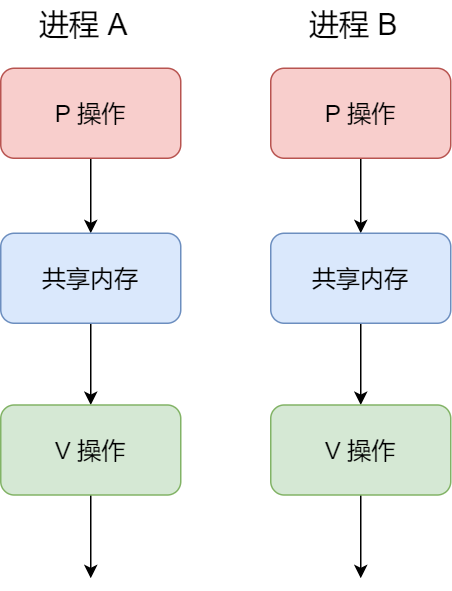
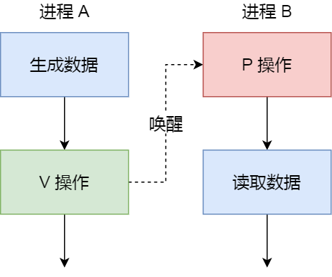
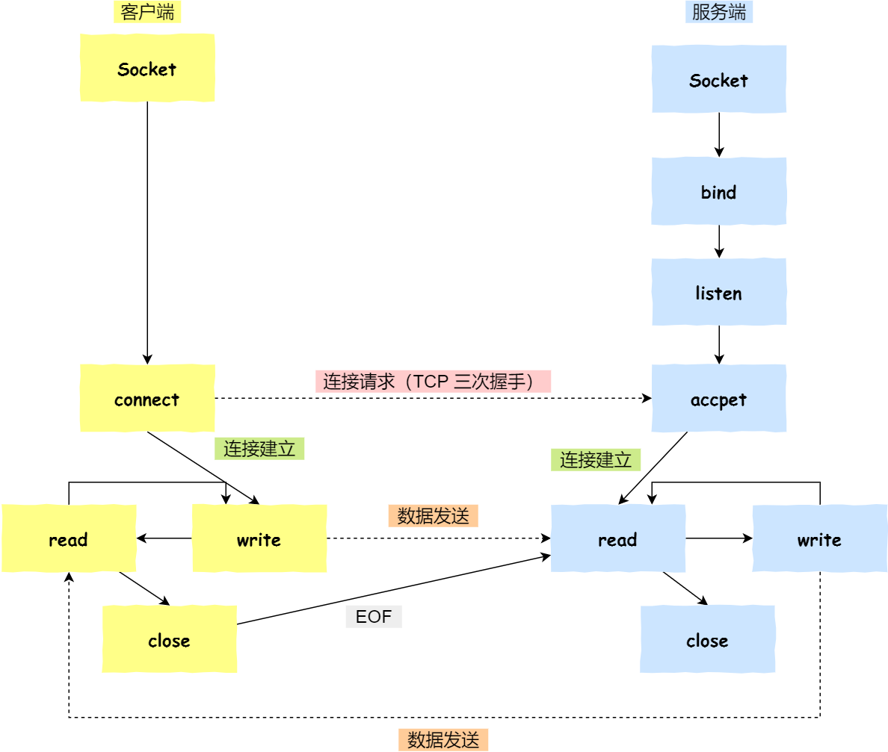

# 7. 文件系统

文件系统是操作系统中 **管理持久数据**（磁盘中的文件） 的子系统。文件系统的 **基本数据单位是文件**。

用户和操作系统对文件的读写操作是有差异的，用户习惯以字节的方式读写文件，而操作系统则是以数据块来读写文件，那屏蔽掉这种差异的工作就是文件系统了。

## 1. 文件系统的基本组成

### 文件的数据结构

**索引节点** 和 **目录项**。记录文件的元信息和目录层次结构。

- 索引节点，也就是 *inode*，用来记录文件的元信息，比如 inode 编号、文件大小、访问权限、创建时间、修改时间、**数据在磁盘的位置 **等等。索引节点是文件的 **唯一 **标识，它们一一对应，也同样都会被存储在硬盘中，所以**索引节点同样占用磁盘空间**。
- 目录项，也就是 *dentry*，用来记录文件的名字、**索引节点指针** 以及与其他目录项的层级关联关系。多个目录项关联起来，就会形成目录结构，但它与索引节点不同的是，**目录项是由内核维护的一个数据结构，不存放于磁盘，而是缓存在内存**。

索引节点唯一标识一个文件，目录项记录文件的名字，所以 **目录项和索引节点的关系是多对一**，也就是说，**一个文件可以有多个别名**。比如，硬链接的实现就是多个目录项中的索引节点指向同一个文件。

**目录也是文件**，也是用索引节点唯一标识，和普通文件不同的是，普通文件在磁盘里面保存的是文件数据，而目录文件在磁盘里面保存子目录或文件。

如果查询目录频繁从磁盘读，效率会很低，所以内核会把已经读过的目录用目录项这个数据结构缓存在内存，下次再次读到相同的目录时，只需从内存读就可以，大大提高了文件系统的效率。

注意，目录项这个数据结构不只是表示目录，也是可以表示文件的。

### 文件数据在磁盘中的存储

磁盘读写的最小单位是 **扇区**，扇区的大小只有 `512B` 大小。文件系统把多个扇区组成了一个**逻辑块**，**每次读写的最小单位就是逻辑块（数据块）**，Linux 中的逻辑块大小为 `4KB`，也就是一次性读写 8 个扇区，这将大大提高了磁盘的读写的效率。

以上就是索引节点、目录项以及文件数据的关系，下面这个图就很好的展示了它们之间的关系：


索引节点是存储在硬盘上的数据，那么为了加速文件的访问，通常会把索引节点加载到内存中。

另外，磁盘进行格式化的时候，会被分成三个存储区域，分别是超级块、索引节点区和数据块区。

- *超级块*，用来存储文件系统的详细信息，比如块个数、块大小、空闲块等等。
- *索引节点区*，用来存储索引节点；
- *数据块区*，用来存储文件或目录数据；

我们不可能把超级块和索引节点区全部加载到内存，这样内存肯定撑不住，所以只有当需要使用的时候，才将其加载进内存，它们加载进内存的时机是不同的：

- 超级块：当文件系统挂载时进入内存；
- 索引节点区：当文件被访问时进入内存；

------

## [#](https://xiaolincoding.com/os/6_file_system/file_system.html#虚拟文件系统)虚拟文件系统

文件系统的种类众多，而操作系统希望**对用户提供一个统一的接口**，于是在用户层与文件系统层引入了中间层，这个中间层就称为**虚拟文件系统（\*Virtual File System，VFS\*）。**

VFS 定义了一组所有文件系统都支持的数据结构和标准接口，这样程序员不需要了解文件系统的工作原理，只需要了解 VFS 提供的统一接口即可。

在 Linux 文件系统中，用户空间、系统调用、虚拟文件系统、缓存、文件系统以及存储之间的关系如下图：


Linux 支持的文件系统也不少，根据存储位置的不同，可以把文件系统分为三类：

- *磁盘的文件系统*，它是直接把数据存储在磁盘中，比如 Ext 2/3/4、XFS 等都是这类文件系统。
- *内存的文件系统*，这类文件系统的数据不是存储在硬盘的，而是占用内存空间，我们经常用到的 `/proc` 和 `/sys` 文件系统都属于这一类，读写这类文件，实际上是读写内核中相关的数据。
- *网络的文件系统*，用来访问其他计算机主机数据的文件系统，比如 NFS、SMB 等等。

文件系统首先要先挂载到某个目录才可以正常使用，比如 Linux 系统在启动时，会把文件系统挂载到根目录。

------

## 2. 文件的打开和读写

首先通过系统调用来打开一个文件。


```shell
fd = open(name, flag); # 打开文件
...
write(fd,...);         # 写数据
...
close(fd);             # 关闭文件
```

上面简单的代码是读取一个文件的过程：

- 首先用 `open` 系统调用打开文件，`open` 的参数中包含文件的路径名和文件名。
- 使用 `write` 写数据，其中 `write` 使用 `open` 所返回的 **文件描述符**，并不使用文件名作为参数。
- 使用完文件后，要用 `close` 系统调用关闭文件，避免资源的泄露。

**操作系统会跟踪进程打开的所有文件**，即，操作系统为每个进程维护一个 **打开文件表**，文件表里的每一项代表「**文件描述符**」，所以说文件描述符是打开文件的标识。


操作系统在打开文件表中维护着打开文件的状态和信息：

- 文件指针：系统跟踪上次读写位置作为当前文件位置指针，这种指针对打开文件的某个进程来说是唯一的；
- 文件打开计数器：跟踪打开和关闭的数量，当该计数为 0 时，系统关闭文件，删除该条目；
- 文件磁盘位置：绝大多数文件操作都要求系统修改文件数据，该信息保存在内存中，以免每个操作都从磁盘中读取；
- 访问权限：每个进程打开文件都需要有一个访问模式（创建、只读、读写、添加等），该信息保存在进程的打开文件表中，以便操作系统能允许或拒绝之后的 I/O 请求；

### 文件的读写 - 基本操作单位是数据块

- 当用户进程从文件读取 1 个字节大小的数据时，文件系统则需要获取字节所在的数据块，再返回数据块对应的用户进程所需的数据部分。
- 当用户进程把 1 个字节大小的数据写进文件时，文件系统则找到需要写入数据的数据块的位置，然后修改数据块中对应的部分，最后再把数据块写回磁盘。

------

## 3. 文件的存储方式

### - 连续空间存放方式

文件存放在磁盘「连续的」物理空间中，**读写效率高**，因为一次磁盘寻道就可以读出整个文件。

连续空间存放的前提：已知文件的大小。所以，**文件头（类似于 inode）里需要指定「起始块的位置」和「长度」**。


缺点：

- 文件删除会产生磁盘空间碎片。（磁盘内挪动文件耗时，不现实）
- 文件长度不易扩展。

### - 非连续空间存放方式

链表方式 和 索引方式。

#### a. 链表方式

链表方式解决 **磁盘空间碎片**，实现 **文件动态扩展**，但不能实现 **随机访问**。

链表可分为「**隐式链表**」和「**显式链接**」两种形式。

##### 隐式链表

文件头包含「第一块」和「最后一块」的位置，每个数据块里面留出一个指针空间，存放下一个数据块的位置。


**缺点：**

- 无法直接访问数据块，只能通过指针顺序访问文件。
- 数据块指针消耗了一定的存储空间**。**
- 稳定性较差，系统在运行过程中由于软件或者硬件错误导致链表中的 **指针丢失或损坏**，会导致文件数据的丢失。

##### 显式链表

把用于链接文件各数据块的指针，显式地存放在 **内存的文件分配表（\*File Allocation Table，FAT\*）** 中。该表在整个磁盘仅设置一张，**每个表项中存放链接指针，指向下一个数据块号**。


**优点：**

- 存储在内存中，提高检索速度，减少磁盘访问。

**缺点：**

- 不适用于大磁盘，会导致文件分配表很大。

#### b. 索引方式

索引方式可以实现随机访问。

索引的实现：

- 为每个文件创建一个「**索引数据块**」，里面存放 **指向文件数据块的指针列表。**
- **文件头需要包含指向「索引数据块」的指针**，这样就可以通过文件头知道索引数据块的位置，再通过索引数据块里的索引信息找到对应的数据块。


**优点：**

- 文件的创建、增大、缩小很方便；
- 不会有碎片的问题；
- 支持顺序读写和随机读写；

**缺点：**

- 索引数据块带来额外的空间消耗。

#### c. 大文件的组合方式

##### 链式索引块 - 链表 + 索引

**在索引数据块留出一个存放下一个索引数据块的指针**，于是当一个索引数据块的索引信息用完了，就可以通过指针的方式，找到下一个索引数据块的信息。那这种方式也会出现前面提到的链表方式的问题，万一某个指针损坏了，后面的数据也就会无法读取了。


**缺点：**

- 不稳定。万一存放下一个索引数据块的指针损坏了，后面的数据就丢了。

##### 多级索引块 - 索引 + 索引

**通过一个索引块来存放多个索引数据块。**


### - Unix 文件的实现方式


Unix 根据文件的大小，选择存放的方式：

- 如果存放文件所需的数据块小于 10 块，则采用直接查找的方式；
- 如果存放文件所需的数据块超过 10 块，则采用一级间接索引方式；
- 如果前面两种方式都不够存放大文件，则采用二级间接索引方式；
- 如果二级间接索引也不够存放大文件，这采用三级间接索引方式；


那么，文件头（*Inode*）就需要包含 13 个指针：

- 10 个指向数据块的指针；
- 第 11 个指向索引块的指针；
- 第 12 个指向二级索引块的指针；
- 第 13 个指向三级索引块的指针；

**优点：**

- 对于小文件使用直接查找的方式可减少索引数据块的开销；
- 对于大文件则以多级索引的方式来支持，所以大文件在访问数据块时需要大量查询；

------

## 4. 空闲空间管理

种常见的方法：

- 空闲表法
- 空闲链表法
- 位图法

### - 空闲表法

为所有空闲空间建立一张表，表内容包括空闲区的第一个块号和该空闲区的块个数另外。这种分配技术适用于建立 **连续文件**。如下图：


当请求分配磁盘空间时，系统依次 **扫描** 空闲表里的内容，直到找到一个合适的空闲区域为止。当用户撤销一个文件时，系统回收文件空间。这时，也需顺序 **扫描** 空闲表，寻找一个空闲表条目并将释放空间的第一个物理块号及它占用的块数填到这个条目中。

**缺点：**

如果存储空间中有着大量的小的空闲区，则空闲表变得很大，这样查询效率会很低。

**空闲表法和空闲链表法都不适合用于大型文件系统，因为这会使空闲表或空闲链表太大。**

### - 空闲链表法

使用「链表」的方式来管理空闲空间，**每一个空闲块里有一个指针指向下一个空闲块**，这样也能很方便的找到空闲块并管理起来。如下图：


当创建文件需要一块或几块时，就 **从链头上依次取下一块或几块**。反之，当回收空间时，把这些空闲块依次 **接到链头** 上。

**缺点：**

但不能随机访问，工作效率低，因为每当在链上增加或移动空闲块时需要做很多 I/O 操作，同时数据块的指针消耗了一定的存储空间。

**空闲表法和空闲链表法都不适合用于大型文件系统，因为这会使空闲表或空闲链表太大。**

### - 位图法

利用二进制的一位来表示磁盘中一个盘块的使用情况，磁盘上所有的盘块都有一个二进制位与之对应。

当值为 0 时，表示对应的盘块空闲，值为 1 时，表示对应的盘块已分配。它形式如下：

```text
1111110011111110001110110111111100111 ...
```

在 Linux 文件系统就采用了位图的方式来管理空闲空间，不仅用于数据空闲块的管理，还用于 inode 空闲块的管理，因为 inode 也是存储在磁盘的，自然也要有对其管理。

------

## ==5. 文件系统的结构==

前面提到 Linux 是用位图的方式管理空闲空间，用户在创建一个新文件时，Linux 内核会通过 inode 的位图找到空闲可用的 inode，并进行分配。要存储数据时，会通过块的位图找到空闲的块，并分配，但仔细计算一下还是有问题的。

数据块的位图是放在磁盘块里的，假设是放在一个块里，一个块 4K，每位表示一个数据块，共可以表示 `4 * 1024 * 8 = 2^15` 个空闲块，由于 1 个数据块是 4K 大小，那么最大可以表示的空间为 `2^15 * 4 * 1024 = 2^27` 个 byte，也就是 128M。

也就是说按照上面的结构，如果采用「一个块的位图 + 一系列的块」，外加「一个块的 inode 的位图 + 一系列的 inode 的结构」能表示的最大空间也就 128M，这太少了，现在很多文件都比这个大。

在 Linux 文件系统，把这个结构称为一个**块组**，那么有 N 多的块组，就能够表示 N 大的文件。

下图给出了 Linux Ext2 整个文件系统的结构和块组的内容，文件系统都由大量块组组成，在硬盘上相继排布：


最前面的第一个块是引导块，在系统启动时用于启用引导，接着后面就是一个一个连续的块组了，块组的内容如下：

- *超级块*，包含的是文件系统的重要信息，比如 inode 总个数、块总个数、每个块组的 inode 个数、每个块组的块个数等等。
- *块组描述符*，包含文件系统中各个块组的状态，比如块组中空闲块和 inode 的数目等，每个块组都包含了文件系统中「所有块组的组描述符信息」。
- *数据位图和 inode 位图*， 用于表示对应的数据块或 inode 是空闲的，还是被使用中。
- *inode 列表*，包含了块组中所有的 inode，inode 用于保存文件系统中与各个文件和目录相关的所有元数据。
- *数据块*，包含文件的有用数据。

你可以会发现每个块组里有很多重复的信息，比如**超级块和块组描述符表，这两个都是全局信息，而且非常的重要**，这么做是有两个原因：

- 如果系统崩溃破坏了超级块或块组描述符，有关文件系统结构和内容的所有信息都会丢失。如果有冗余的副本，该信息是可能恢复的。
- 通过使文件和管理数据尽可能接近，减少了磁头寻道和旋转，这可以提高文件系统的性能。

不过，Ext2 的后续版本采用了稀疏技术。该做法是，超级块和块组描述符表不再存储到文件系统的每个块组中，而是只写入到块组 0、块组 1 和其他 ID 可以表示为 3、 5、7 的幂的块组中。

------

## [==#](https://xiaolincoding.com/os/6_file_system/file_system.html#目录的存储)目录的存储==

在前面，我们知道了一个普通文件是如何存储的，但还有一个特殊的文件，经常用到的目录，它是如何保存的呢？

基于 Linux 一切皆文件的设计思想，目录其实也是个文件，你甚至可以通过 `vim` 打开它，它也有 inode，inode 里面也是指向一些块。

和普通文件不同的是，**普通文件的块里面保存的是文件数据，而目录文件的块里面保存的是目录里面一项一项的文件信息。**

在目录文件的块中，最简单的保存格式就是**列表**，就是一项一项地将目录下的文件信息（如文件名、文件 inode、文件类型等）列在表里。

列表中每一项就代表该目录下的文件的文件名和对应的 inode，通过这个 inode，就可以找到真正的文件。


通常，第一项是「`.`」，表示当前目录，第二项是「`..`」，表示上一级目录，接下来就是一项一项的文件名和 inode。

如果一个目录有超级多的文件，我们要想在这个目录下找文件，按照列表一项一项的找，效率就不高了。

于是，保存目录的格式改成**哈希表**，对文件名进行哈希计算，把哈希值保存起来，如果我们要查找一个目录下面的文件名，可以通过名称取哈希。如果哈希能够匹配上，就说明这个文件的信息在相应的块里面。

Linux 系统的 ext 文件系统就是采用了哈希表，来保存目录的内容，这种方法的优点是查找非常迅速，插入和删除也较简单，不过需要一些预备措施来避免哈希冲突。

目录查询是通过在磁盘上反复搜索完成，需要不断地进行 I/O 操作，开销较大。所以，为了减少 I/O 操作，把当前使用的文件目录缓存在内存，以后要使用该文件时只要在内存中操作，从而降低了磁盘操作次数，提高了文件系统的访问速度。

------

## [==#](https://xiaolincoding.com/os/6_file_system/file_system.html#软链接和硬链接)软链接和硬链接==

有时候我们希望给某个文件取个别名，那么在 Linux 中可以通过**硬链接（\*Hard Link\*）** 和**软链接（\*Symbolic Link\*）** 的方式来实现，它们都是比较特殊的文件，但是实现方式也是不相同的。

硬链接是**多个目录项中的「索引节点」指向一个文件**，也就是指向同一个 inode，但是 inode 是不可能跨越文件系统的，每个文件系统都有各自的 inode 数据结构和列表，所以**硬链接是不可用于跨文件系统的**。由于多个目录项都是指向一个 inode，那么**只有删除文件的所有硬链接以及源文件时，系统才会彻底删除该文件。**


软链接相当于重新创建一个文件，这个文件有**独立的 inode**，但是这个**文件的内容是另外一个文件的路径**，所以访问软链接的时候，实际上相当于访问到了另外一个文件，所以**软链接是可以跨文件系统的**，甚至**目标文件被删除了，链接文件还是在的，只不过指向的文件找不到了而已。**


------

##  ==文件 I/O==

文件的读写方式各有千秋，对于文件的 I/O 分类也非常多，常见的有

- 缓冲与非缓冲 I/O
- 直接与非直接 I/O
- 阻塞与非阻塞 I/O VS 同步与异步 I/O

接下来，分别对这些分类讨论讨论。

### [#](https://xiaolincoding.com/os/6_file_system/file_system.html#缓冲与非缓冲-i-o)缓冲与非缓冲 I/O

文件操作的标准库是可以实现数据的缓存，那么**根据「是否利用标准库缓冲」，可以把文件 I/O 分为缓冲 I/O 和非缓冲 I/O**：

- 缓冲 I/O，利用的是标准库的缓存实现文件的加速访问，而标准库再通过系统调用访问文件。
- 非缓冲 I/O，直接通过系统调用访问文件，不经过标准库缓存。

这里所说的「缓冲」特指标准库内部实现的缓冲。

比方说，很多程序遇到换行时才真正输出，而换行前的内容，其实就是被标准库暂时缓存了起来，这样做的目的是，减少系统调用的次数，毕竟系统调用是有 CPU 上下文切换的开销的。

### [#](https://xiaolincoding.com/os/6_file_system/file_system.html#直接与非直接-i-o)直接与非直接 I/O

我们都知道磁盘 I/O 是非常慢的，所以 Linux 内核为了减少磁盘 I/O 次数，在系统调用后，会把用户数据拷贝到内核中缓存起来，这个内核缓存空间也就是「页缓存」，只有当缓存满足某些条件的时候，才发起磁盘 I/O 的请求。

那么，**根据是「否利用操作系统的缓存」，可以把文件 I/O 分为直接 I/O 与非直接 I/O**：

- 直接 I/O，不会发生内核缓存和用户程序之间数据复制，而是直接经过文件系统访问磁盘。
- 非直接 I/O，读操作时，数据从内核缓存中拷贝给用户程序，写操作时，数据从用户程序拷贝给内核缓存，再由内核决定什么时候写入数据到磁盘。

如果你在使用文件操作类的系统调用函数时，指定了 `O_DIRECT` 标志，则表示使用直接 I/O。如果没有设置过，默认使用的是非直接 I/O。

> 如果用了非直接 I/O 进行写数据操作，内核什么情况下才会把缓存数据写入到磁盘？

以下几种场景会触发内核缓存的数据写入磁盘：

- 在调用 `write` 的最后，当发现内核缓存的数据太多的时候，内核会把数据写到磁盘上；
- 用户主动调用 `sync`，内核缓存会刷到磁盘上；
- 当内存十分紧张，无法再分配页面时，也会把内核缓存的数据刷到磁盘上；
- 内核缓存的数据的缓存时间超过某个时间时，也会把数据刷到磁盘上；

### [#](https://xiaolincoding.com/os/6_file_system/file_system.html#阻塞与非阻塞-i-o-vs-同步与异步-i-o)阻塞与非阻塞 I/O VS 同步与异步 I/O

为什么把阻塞 / 非阻塞与同步与异步放一起说的呢？因为它们确实非常相似，也非常容易混淆，不过它们之间的关系还是有点微妙的。

先来看看**阻塞 I/O**，当用户程序执行 `read` ，线程会被阻塞，一直等到内核数据准备好，并把数据从内核缓冲区拷贝到应用程序的缓冲区中，当拷贝过程完成，`read` 才会返回。

注意，**阻塞等待的是「内核数据准备好」和「数据从内核态拷贝到用户态」这两个过程**。过程如下图：


知道了阻塞 I/O ，来看看**非阻塞 I/O**，非阻塞的 read 请求在数据未准备好的情况下立即返回，可以继续往下执行，此时应用程序不断轮询内核，直到数据准备好，内核将数据拷贝到应用程序缓冲区，`read` 调用才可以获取到结果。过程如下图：


注意，**这里最后一次 read 调用，获取数据的过程，是一个同步的过程，是需要等待的过程。这里的同步指的是内核态的数据拷贝到用户程序的缓存区这个过程。**

举个例子，访问管道或 socket 时，如果设置了 `O_NONBLOCK` 标志，那么就表示使用的是非阻塞 I/O 的方式访问，而不做任何设置的话，默认是阻塞 I/O。

应用程序每次轮询内核的 I/O 是否准备好，感觉有点傻乎乎，因为轮询的过程中，应用程序啥也做不了，只是在循环。

为了解决这种傻乎乎轮询方式，于是 **I/O 多路复用**技术就出来了，如 select、poll，它是通过 I/O 事件分发，当内核数据准备好时，再以事件通知应用程序进行操作。

这个做法大大改善了 CPU 的利用率，因为当调用了 I/O 多路复用接口，如果没有事件发生，那么当前线程就会发生阻塞，这时 CPU 会切换其他线程执行任务，等内核发现有事件到来的时候，会唤醒阻塞在 I/O 多路复用接口的线程，然后用户可以进行后续的事件处理。

整个流程要比阻塞 IO 要复杂，似乎也更浪费性能。但 **I/O 多路复用接口最大的优势在于，用户可以在一个线程内同时处理多个 socket 的 IO 请求**（参见：[I/O 多路复用：select/poll/epoll (opens new window)](https://xiaolincoding.com/os/8_network_system/selete_poll_epoll.html)）。用户可以注册多个 socket，然后不断地调用 I/O 多路复用接口读取被激活的 socket，即可达到在同一个线程内同时处理多个 IO 请求的目的。而在同步阻塞模型中，必须通过多线程的方式才能达到这个目的。

下图是使用 select I/O 多路复用过程。注意，`read` 获取数据的过程（数据从内核态拷贝到用户态的过程），也是一个**同步的过程**，需要等待：


实际上，无论是阻塞 I/O、非阻塞 I/O，还是基于非阻塞 I/O 的多路复用**都是同步调用。因为它们在 read 调用时，内核将数据从内核空间拷贝到应用程序空间，过程都是需要等待的，也就是说这个过程是同步的，如果内核实现的拷贝效率不高，read 调用就会在这个同步过程中等待比较长的时间。**

而真正的**异步 I/O** 是「内核数据准备好」和「数据从内核态拷贝到用户态」这两个过程都不用等待。

当我们发起 `aio_read` 之后，就立即返回，内核自动将数据从内核空间拷贝到应用程序空间，这个拷贝过程同样是异步的，内核自动完成的，和前面的同步操作不一样，应用程序并不需要主动发起拷贝动作。过程如下图：


下面这张图，总结了以上几种 I/O 模型：


在前面我们知道了，I/O 是分为两个过程的：

1. 数据准备的过程
2. 数据从内核空间拷贝到用户进程缓冲区的过程

阻塞 I/O 会阻塞在「过程 1 」和「过程 2」，而非阻塞 I/O 和基于非阻塞 I/O 的多路复用只会阻塞在「过程 2」，所以这三个都可以认为是同步 I/O。

异步 I/O 则不同，「过程 1 」和「过程 2 」都不会阻塞。

> 用故事去理解这几种 I/O 模型

举个你去饭堂吃饭的例子，你好比用户程序，饭堂好比操作系统。

阻塞 I/O 好比，你去饭堂吃饭，但是饭堂的菜还没做好，然后你就一直在那里等啊等，等了好长一段时间终于等到饭堂阿姨把菜端了出来（数据准备的过程），但是你还得继续等阿姨把菜（内核空间）打到你的饭盒里（用户空间），经历完这两个过程，你才可以离开。

非阻塞 I/O 好比，你去了饭堂，问阿姨菜做好了没有，阿姨告诉你没，你就离开了，过几十分钟，你又来饭堂问阿姨，阿姨说做好了，于是阿姨帮你把菜打到你的饭盒里，这个过程你是得等待的。

基于非阻塞的 I/O 多路复用好比，你去饭堂吃饭，发现有一排窗口，饭堂阿姨告诉你这些窗口都还没做好菜，等做好了再通知你，于是等啊等（`select` 调用中），过了一会阿姨通知你菜做好了，但是不知道哪个窗口的菜做好了，你自己看吧。于是你只能一个一个窗口去确认，后面发现 5 号窗口菜做好了，于是你让 5 号窗口的阿姨帮你打菜到饭盒里，这个打菜的过程你是要等待的，虽然时间不长。打完菜后，你自然就可以离开了。

异步 I/O 好比，你让饭堂阿姨将菜做好并把菜打到饭盒里后，把饭盒送到你面前，整个过程你都不需要任何等待。

# ==7.2 进程写文件时，进程发生了崩溃，已写入的数据会丢失吗？==

### 1. 进程

**进程：**运行中的程序。代码是一个 **存储在硬盘的静态文件**，通过编译后就会生成二进制 **可执行文件**，当我们运行这个可执行文件后，它会被装载到 **内存** 中，接着 CPU 会执行程序中的每一条指令，这个 **运行中的程序**，就被称为进程。

**并发：**CPU 交替执行多个程序。

#### - 进程的 5 个状态


#### - 进程的 7 个状态

**挂起状态：**进程暂时被淘汰到外存，**没有占用实际的物理内存空间** 的状态。阻塞的进程会占用内存，在虚拟内存管理系统中，通常会把阻塞的进程的物理内存空间换出到硬盘中，等再次被调度时再读入到内存中。挂起状态可以分为两种：

- **阻塞挂起状态：**进程在外存（硬盘）并等待某个事件的出现；
- **就绪挂起状态：**进程在外存（硬盘），但只要进入内存，即刻立刻运行；


**导致进程挂起的原因：**

- 通过 sleep 让进程间歇性挂起，其工作原理是设置一个定时器，到期后唤醒进程。
- 用户希望挂起一个程序的执行，比如在 Linux 中用 `Ctrl+Z` 挂起进程；

#### - **进程控制块**（*process control block，PCB*）

**进程控制块：**PCB 是进程存在的 **唯一标识**，随进程出现和消亡。

**进程控制块包含的信息：**

- 进程描述信息：

  - 进程标识符：标识各个进程，每个进程都有一个并且唯一的标识符；

  - 用户标识符：进程归属的用户，用户标识符主要为共享和保护服务；

- **进程控制和管理信息：**

  - 进程当前状态，如 new、ready、running、waiting 或 blocked 等；

  - 进程优先级：进程抢占 CPU 时的优先级；

- **资源分配清单：**
  - 有关内存地址空间或虚拟地址空间的信息，所打开文件的列表和所使用的 I/O 设备信息。

- **CPU 相关信息：**
  - CPU 中各个寄存器的值，当进程被切换时，CPU 的状态信息都会被保存在相应的 PCB 中，以便进程重新执行时，能从断点处继续执行。

**进程控制块的组织形式：**

通常是通过**链表**的方式进行组织，把具有 **相同状态的进程链在一起，组成各种队列**，如就绪队列、阻塞队列等。因为链表能够灵活插入和删除。

#### - 进程的控制

**01 创建进程**

- 申请一个空白的 PCB，并向 PCB 中填写一些控制和管理进程的信息，比如进程的唯一标识等；
- 为该进程分配运行时所必需的资源，比如内存资源；
- 将 PCB 插入到就绪队列，等待被调度运行；

**02 终止进程**

进程可以有 3 种终止方式：正常结束、异常结束以及外界干预（信号 `kill` 掉）。

当子进程被终止时，其在父进程处继承的资源应当还给父进程。而当父进程被终止时，该父进程的子进程就变为孤儿进程，会被 1 号进程收养，并由 1 号进程对它们完成状态收集工作。

终止进程的过程如下：

- 查找需要终止的进程的 PCB；
- 如果处于执行状态，则立即终止该进程的执行，然后将 CPU 资源分配给其他进程；
- 如果其还有子进程，则应 **将该进程的子进程交给 1 号进程接管**；
- 将该进程所拥有的全部资源都归还给操作系统；
- 将其从 PCB 所在队列中删除；

**03 阻塞进程**

当进程需要等待某一事件完成时，它可以调用阻塞语句把自己阻塞等待。而一旦被阻塞等待，**它只能由另一个进程唤醒**。

阻塞进程的过程如下：

- 找到将要被阻塞进程标识号对应的 PCB；
- 如果该进程为运行状态，则 **保护现场**，将其状态转为阻塞状态，停止运行；
- 将该 PCB 插入到阻塞队列中去；

**04 唤醒进程**

进程由「运行」转变为「阻塞」状态是由于进程必须等待某一事件的完成，**它只能由另一个进程唤醒**。

唤醒进程的过程如下：

- 在该事件的阻塞队列中找到相应进程的 PCB；
- 将其从阻塞队列中移出，并置其状态为就绪状态；
- 把该 PCB 插入到就绪队列中，等待调度程序调度；

进程的阻塞和唤醒是一对功能相反的语句，如果某个进程调用了阻塞语句，则必有一个与之对应的唤醒语句。

#### - 进程的上下文切换

**进程的上下文切换**：一个进程切换到另一个进程运行。进程是由内核管理和调度的，所以进程的切换只能发生在内核态。进程的上下文切换不仅包含了 **虚拟内存**、**栈**、**全局变量** 等用户空间的资源，还包括了 **内核堆栈**、**寄存器** 等内核空间的资源。

通常，会把交换的信息保存在进程的 PCB，当要运行另外一个进程的时候，从这个进程的 PCB 取出上下文，然后恢复到 CPU 中，这使得这个进程可以继续执行，

**发生进程上下文切换的场景：**

- 当某个进程的时间片耗尽了时
- 进程在系统资源不足（比如内存不足）时
- 进程通过睡眠函数 sleep 将自己主动挂起时
- 有优先级更高的进程运行时
- 发生硬件中断时，CPU 上的进程会被中断挂起，转而执行内核中的中断服务程序；

### 2. 线程

**线程：**线程是进程当中的一条执行流程。线程之间可以并发运行且共享相同的地址空间。同一个进程内多个线程之间可以**共享代码段、数据段、打开的文件等资源**，但每个线程各自都有一套 **独立的寄存器和栈**，这样可以确保线程的控制流是相对独立的。


**线程的上下文切换**：

在前面我们知道了，线程与进程最大的区别在于：**线程是调度的基本单位，而进程则是资源拥有的基本单位**。

所以，所谓操作系统的任务调度，实际上的调度对象是线程，而进程只是给线程提供了虚拟内存、全局变量等资源。

对于线程和进程，我们可以这么理解：

- 当进程只有一个线程时，可以认为进程就等于线程；
- 当进程拥有多个线程时，这些线程会共享相同的虚拟内存和全局变量等资源，这些资源在上下文切换时是不需要修改的；

另外，线程也有自己的私有数据，比如栈和寄存器等，这些在上下文切换时也是需要保存的。

当两个线程不是属于同一个进程，则切换的过程就跟进程上下文切换一样；

- 当两个线程是属于同一个进程，因为虚拟内存是共享的，所以在切换时，虚拟内存这些资源就保持不动，只需要切换线程的私有数据、寄存器等不共享的数据；

所以，线程的上下文切换相比进程，开销要小很多。

#### - 线程的实现

主要有三种线程的实现方式：

- **用户线程（\*User Thread\*）**：在用户空间实现的线程，不是由内核管理的线程，是由用户态的线程库来完成线程的管理；
- **内核线程（\*Kernel Thread\*）**：在内核中实现的线程，是由内核管理的线程；
- **轻量级进程（\*LightWeight Process\*）**：在内核中来支持用户线程；

多个用户线程对应同一个内核线程：


一个用户线程对应一个内核线程：


多个用户线程对应到多个内核线程：


#### 用户线程

用户线程是基于用户态的线程管理库来实现的，那么**线程控制块（\*Thread Control Block, TCB\*）** 也是在库里面来实现的，对于操作系统而言是看不到这个 TCB 的，它只能看到整个进程的 PCB。

所以，**用户线程的整个线程管理和调度，操作系统是不直接参与的，而是由用户级线程库函数来完成线程的管理，包括线程的创建、终止、同步和调度等。**

用户级线程的模型，也就类似前面提到的**多对一**的关系，即多个用户线程对应同一个内核线程，如下图所示：


用户线程的**优点**：

- 每个进程都需要有它私有的线程控制块（TCB）列表，用来跟踪记录它各个线程状态信息（PC、栈指针、寄存器），TCB 由用户级线程库函数来维护，可用于不支持线程技术的操作系统；
- 用户线程的切换也是由线程库函数来完成的，无需用户态与内核态的切换，所以速度特别快；

用户线程的**缺点**：

- 由于操作系统不参与线程的调度，如果一个线程发起了系统调用而阻塞，那进程所包含的用户线程都不能执行了。
- 当一个线程开始运行后，除非它主动地交出 CPU 的使用权，否则它所在的进程当中的其他线程无法运行，因为用户态的线程没法打断当前运行中的线程，它没有这个特权，只有操作系统才有，但是用户线程不是由操作系统管理的。
- 由于时间片分配给进程，故与其他进程比，在多线程执行时，每个线程得到的时间片较少，执行会比较慢；

以上，就是用户线程的优缺点了。

> 那内核线程如何理解？存在什么优势和缺陷？

**内核线程是由操作系统管理的，线程对应的 TCB 自然是放在操作系统里的，这样线程的创建、终止和管理都是由操作系统负责。**

内核线程的模型，也就类似前面提到的**一对一**的关系，即一个用户线程对应一个内核线程，如下图所示：


内核线程的**优点**：

- 在一个进程当中，如果某个内核线程发起系统调用而被阻塞，并不会影响其他内核线程的运行；
- 分配给线程，多线程的进程获得更多的 CPU 运行时间；

内核线程的**缺点**：

- 在支持内核线程的操作系统中，由内核来维护进程和线程的上下文信息，如 PCB 和 TCB；
- 线程的创建、终止和切换都是通过系统调用的方式来进行，因此对于系统来说，系统开销比较大；

以上，就是内核线程的优缺点了。

> 最后的轻量级进程如何理解？

**轻量级进程（\*Light-weight process，LWP\*）是内核支持的用户线程，一个进程可有一个或多个 LWP，每个 LWP 是跟内核线程一对一映射的，也就是 LWP 都是由一个内核线程支持，而且 LWP 是由内核管理并像普通进程一样被调度**。

在大多数系统中，**LWP与普通进程的区别也在于它只有一个最小的执行上下文和调度程序所需的统计信息**。一般来说，一个进程代表程序的一个实例，而 LWP 代表程序的执行线程，因为一个执行线程不像进程那样需要那么多状态信息，所以 LWP 也不带有这样的信息。

在 LWP 之上也是可以使用用户线程的，那么 LWP 与用户线程的对应关系就有三种：

- `1 : 1`，即一个 LWP 对应 一个用户线程；
- `N : 1`，即一个 LWP 对应多个用户线程；
- `M : N`，即多个 LWP 对应多个用户线程；

接下来针对上面这三种对应关系说明它们优缺点。先看下图的 LWP 模型：


**1 : 1 模式**

一个线程对应到一个 LWP 再对应到一个内核线程，如上图的进程 4，属于此模型。

- 优点：实现并行，当一个 LWP 阻塞，不会影响其他 LWP；
- 缺点：每一个用户线程，就产生一个内核线程，创建线程的开销较大。

**N : 1 模式**

多个用户线程对应一个 LWP 再对应一个内核线程，如上图的进程 2，线程管理是在用户空间完成的，此模式中用户的线程对操作系统不可见。

- 优点：用户线程要开几个都没问题，且上下文切换发生用户空间，切换的效率较高；
- 缺点：一个用户线程如果阻塞了，则整个进程都将会阻塞，另外在多核 CPU 中，是没办法充分利用 CPU 的。

**M : N 模式**

根据前面的两个模型混搭一起，就形成 `M:N` 模型，该模型提供了两级控制，首先多个用户线程对应到多个 LWP，LWP 再一一对应到内核线程，如上图的进程 3。

- 优点：综合了前两种优点，大部分的线程上下文发生在用户空间，且多个线程又可以充分利用多核 CPU 的资源。

**组合模式**

如上图的进程 5，此进程结合 `1:1` 模型和 `M:N` 模型。开发人员可以针对不同的应用特点调节内核线程的数目来达到物理并行性和逻辑并行性的最佳方案。

### 3. 进程和线程的区别

当进程只有一个线程时，可以认为进程就等于线程；

线程与进程的比较如下：

- 进程是资源（包括内存、打开的文件等）分配的单位，线程是 CPU 调度的单位；
- 进程拥有一个完整的资源平台，而线程只独享必不可少的资源，如寄存器和栈；
- 线程同样具有就绪、阻塞、执行三种基本状态，同样具有状态之间的转换关系；
- 线程能减少并发执行的时间和空间开销；

对于，线程相比进程能减少开销，体现在：

- 线程的创建时间比进程快，因为进程在创建的过程中，还需要资源管理信息，比如内存管理信息、文件管理信息，而线程在创建的过程中，不会涉及这些资源管理信息，而是共享它们；
- 线程的终止时间比进程快，因为线程释放的资源相比进程少很多；
- 同一个进程内的线程切换比进程切换快，因为线程具有相同的地址空间（虚拟内存共享），这意味着同一个进程的线程都具有同一个页表，那么在切换的时候不需要切换页表。而对于进程之间的切换，切换的时候要把页表给切换掉，而页表的切换过程开销是比较大的；
- 由于同一进程的各线程间共享内存和文件资源，那么在线程之间数据传递的时候，就不需要经过内核了，这就使得线程之间的数据交互效率更高了；

所以，不管是时间效率，还是空间效率线程比进程都要高。

### 4. 调度

操作系统相关的，进程调度算法

#### 5. 多进程通信

## 管道

如果你学过 Linux 命令，那你肯定很熟悉「`|`」这个竖线。

```bash
$ ps auxf | grep mysql
```

上面命令行里的「`|`」竖线就是一个**管道**，它的功能是将前一个命令（`ps auxf`）的输出，作为后一个命令（`grep mysql`）的输入，从这功能描述，可以看出**管道传输数据是单向的**，如果想相互通信，我们需要创建两个管道才行。

同时，我们得知上面这种管道是没有名字，所以「`|`」表示的管道称为**匿名管道**，用完了就销毁。

管道还有另外一个类型是**命名管道**，也被叫做 `FIFO`，因为数据是先进先出的传输方式。

在使用命名管道前，先需要通过 `mkfifo` 命令来创建，并且指定管道名字：

```bash
$ mkfifo myPipe
```

myPipe 就是这个管道的名称，基于 Linux 一切皆文件的理念，所以管道也是以文件的方式存在，我们可以用 ls 看一下，这个文件的类型是 p，也就是 pipe（管道） 的意思：

```bash
$ ls -l
prw-r--r--. 1 root    root         0 Jul 17 02:45 myPipe
```

接下来，我们往 myPipe 这个管道写入数据：

```bash
$ echo "hello" > myPipe  // 将数据写进管道
                         // 停住了 ...
```

你操作了后，你会发现命令执行后就停在这了，这是因为管道里的内容没有被读取，只有当管道里的数据被读完后，命令才可以正常退出。

于是，我们执行另外一个命令来读取这个管道里的数据：

```bash
$ cat < myPipe  // 读取管道里的数据
hello
```

可以看到，管道里的内容被读取出来了，并打印在了终端上，另外一方面，echo 那个命令也正常退出了。

我们可以看出，**管道这种通信方式效率低，不适合进程间频繁地交换数据**。当然，它的好处，自然就是简单，同时也我们很容易得知管道里的数据已经被另一个进程读取了。

> 那管道如何创建呢，背后原理是什么？

匿名管道的创建，需要通过下面这个系统调用：

```c
int pipe(int fd[2])
```

这里表示创建一个匿名管道，并返回了两个描述符，一个是管道的读取端描述符 `fd[0]`，另一个是管道的写入端描述符 `fd[1]`。注意，这个匿名管道是特殊的文件，只存在于内存，不存于文件系统中。


其实，**所谓的管道，就是内核里面的一串缓存**。从管道的一段写入的数据，实际上是缓存在内核中的，另一端读取，也就是从内核中读取这段数据。另外，管道传输的数据是无格式的流且大小受限。

看到这，你可能会有疑问了，这两个描述符都是在一个进程里面，并没有起到进程间通信的作用，怎么样才能使得管道是跨过两个进程的呢？

我们可以使用 `fork` 创建子进程，**创建的子进程会复制父进程的文件描述符**，这样就做到了两个进程各有两个「 `fd[0]` 与 `fd[1]`」，两个进程就可以通过各自的 fd 写入和读取同一个管道文件实现跨进程通信了。


管道只能一端写入，另一端读出，所以上面这种模式容易造成混乱，因为父进程和子进程都可以同时写入，也都可以读出。那么，为了避免这种情况，通常的做法是：

- 父进程关闭读取的 fd[0]，只保留写入的 fd[1]；
- 子进程关闭写入的 fd[1]，只保留读取的 fd[0]；


所以说如果需要双向通信，则应该创建两个管道。

到这里，我们仅仅解析了使用管道进行父进程与子进程之间的通信，但是在我们 shell 里面并不是这样的。

在 shell 里面执行 `A | B`命令的时候，A 进程和 B 进程都是 shell 创建出来的子进程，A 和 B 之间不存在父子关系，它俩的父进程都是 shell。


所以说，在 shell 里通过「`|`」匿名管道将多个命令连接在一起，实际上也就是创建了多个子进程，那么在我们编写 shell 脚本时，能使用一个管道搞定的事情，就不要多用一个管道，这样可以减少创建子进程的系统开销。

我们可以得知，**对于匿名管道，它的通信范围是存在父子关系的进程**。因为管道没有实体，也就是没有管道文件，只能通过 fork 来复制父进程 fd 文件描述符，来达到通信的目的。

另外，**对于命名管道，它可以在不相关的进程间也能相互通信**。因为命令管道，提前创建了一个类型为管道的设备文件，在进程里只要使用这个设备文件，就可以相互通信。

不管是匿名管道还是命名管道，进程写入的数据都是缓存在内核中，另一个进程读取数据时候自然也是从内核中获取，同时通信数据都遵循**先进先出**原则，不支持 lseek 之类的文件定位操作。

------

## [#](https://www.xiaolincoding.com/os/4_process/process_commu.html#消息队列)消息队列

前面说到管道的通信方式是效率低的，因此管道不适合进程间频繁地交换数据。

对于这个问题，**消息队列**的通信模式就可以解决。比如，A 进程要给 B 进程发送消息，A 进程把数据放在对应的消息队列后就可以正常返回了，B 进程需要的时候再去读取数据就可以了。同理，B 进程要给 A 进程发送消息也是如此。

再来，**消息队列是保存在内核中的消息链表**，在发送数据时，会分成一个一个独立的数据单元，也就是消息体（数据块），消息体是用户自定义的数据类型，消息的发送方和接收方要约定好消息体的数据类型，所以每个消息体都是固定大小的存储块，不像管道是无格式的字节流数据。如果进程从消息队列中读取了消息体，内核就会把这个消息体删除。

消息队列生命周期随内核，如果没有释放消息队列或者没有关闭操作系统，消息队列会一直存在，而前面提到的匿名管道的生命周期，是随进程的创建而建立，随进程的结束而销毁。

消息这种模型，两个进程之间的通信就像平时发邮件一样，你来一封，我回一封，可以频繁沟通了。

但邮件的通信方式存在不足的地方有两点，**一是通信不及时，二是附件也有大小限制**，这同样也是消息队列通信不足的点。

**消息队列不适合比较大数据的传输**，因为在内核中每个消息体都有一个最大长度的限制，同时所有队列所包含的全部消息体的总长度也是有上限。在 Linux 内核中，会有两个宏定义 `MSGMAX` 和 `MSGMNB`，它们以字节为单位，分别定义了一条消息的最大长度和一个队列的最大长度。

**消息队列通信过程中，存在用户态与内核态之间的数据拷贝开销**，因为进程写入数据到内核中的消息队列时，会发生从用户态拷贝数据到内核态的过程，同理另一进程读取内核中的消息数据时，会发生从内核态拷贝数据到用户态的过程。

------

## [#](https://www.xiaolincoding.com/os/4_process/process_commu.html#共享内存)共享内存

消息队列的读取和写入的过程，都会有发生用户态与内核态之间的消息拷贝过程。那**共享内存**的方式，就很好的解决了这一问题。

现代操作系统，对于内存管理，采用的是虚拟内存技术，也就是每个进程都有自己独立的虚拟内存空间，不同进程的虚拟内存映射到不同的物理内存中。所以，即使进程 A 和 进程 B 的虚拟地址是一样的，其实访问的是不同的物理内存地址，对于数据的增删查改互不影响。

**共享内存的机制，就是拿出一块虚拟地址空间来，映射到相同的物理内存中**。这样这个进程写入的东西，另外一个进程马上就能看到了，都不需要拷贝来拷贝去，传来传去，大大提高了进程间通信的速度。


------

## [#](https://www.xiaolincoding.com/os/4_process/process_commu.html#信号量)信号量

用了共享内存通信方式，带来新的问题，那就是如果多个进程同时修改同一个共享内存，很有可能就冲突了。例如两个进程都同时写一个地址，那先写的那个进程会发现内容被别人覆盖了。

为了防止多进程竞争共享资源，而造成的数据错乱，所以需要保护机制，使得共享的资源，在任意时刻只能被一个进程访问。正好，**信号量**就实现了这一保护机制。

**信号量其实是一个整型的计数器，主要用于实现进程间的互斥与同步，而不是用于缓存进程间通信的数据**。

信号量表示资源的数量，控制信号量的方式有两种原子操作：

- 一个是 **P 操作**，这个操作会把信号量减去 1，相减后如果信号量 < 0，则表明资源已被占用，进程需阻塞等待；相减后如果信号量 >= 0，则表明还有资源可使用，进程可正常继续执行。
- 另一个是 **V 操作**，这个操作会把信号量加上 1，相加后如果信号量 <= 0，则表明当前有阻塞中的进程，于是会将该进程唤醒运行；相加后如果信号量 > 0，则表明当前没有阻塞中的进程；

P 操作是用在进入共享资源之前，V 操作是用在离开共享资源之后，这两个操作是必须成对出现的。

接下来，举个例子，如果要使得两个进程互斥访问共享内存，我们可以初始化信号量为 `1`。



具体的过程如下：

- 进程 A 在访问共享内存前，先执行了 P 操作，由于信号量的初始值为 1，故在进程 A 执行 P 操作后信号量变为 0，表示共享资源可用，于是进程 A 就可以访问共享内存。
- 若此时，进程 B 也想访问共享内存，执行了 P 操作，结果信号量变为了 -1，这就意味着临界资源已被占用，因此进程 B 被阻塞。
- 直到进程 A 访问完共享内存，才会执行 V 操作，使得信号量恢复为 0，接着就会唤醒阻塞中的线程 B，使得进程 B 可以访问共享内存，最后完成共享内存的访问后，执行 V 操作，使信号量恢复到初始值 1。

可以发现，信号初始化为 `1`，就代表着是**互斥信号量**，它可以保证共享内存在任何时刻只有一个进程在访问，这就很好的保护了共享内存。

另外，在多进程里，每个进程并不一定是顺序执行的，它们基本是以各自独立的、不可预知的速度向前推进，但有时候我们又希望多个进程能密切合作，以实现一个共同的任务。

例如，进程 A 是负责生产数据，而进程 B 是负责读取数据，这两个进程是相互合作、相互依赖的，进程 A 必须先生产了数据，进程 B 才能读取到数据，所以执行是有前后顺序的。

那么这时候，就可以用信号量来实现多进程同步的方式，我们可以初始化信号量为 `0`。



具体过程：

- 如果进程 B 比进程 A 先执行了，那么执行到 P 操作时，由于信号量初始值为 0，故信号量会变为 -1，表示进程 A 还没生产数据，于是进程 B 就阻塞等待；
- 接着，当进程 A 生产完数据后，执行了 V 操作，就会使得信号量变为 0，于是就会唤醒阻塞在 P 操作的进程 B；
- 最后，进程 B 被唤醒后，意味着进程 A 已经生产了数据，于是进程 B 就可以正常读取数据了。

可以发现，信号初始化为 `0`，就代表着是**同步信号量**，它可以保证进程 A 应在进程 B 之前执行。

------

## [#](https://www.xiaolincoding.com/os/4_process/process_commu.html#信号)信号

上面说的进程间通信，都是常规状态下的工作模式。**对于异常情况下的工作模式，就需要用「信号」的方式来通知进程。**

信号跟信号量虽然名字相似度 66.66%，但两者用途完全不一样，就好像 Java 和 JavaScript 的区别。

在 Linux 操作系统中， 为了响应各种各样的事件，提供了几十种信号，分别代表不同的意义。我们可以通过 `kill -l` 命令，查看所有的信号：

```shell
$ kill -l
 1) SIGHUP       2) SIGINT       3) SIGQUIT      4) SIGILL       5) SIGTRAP
 6) SIGABRT      7) SIGBUS       8) SIGFPE       9) SIGKILL     10) SIGUSR1
11) SIGSEGV     12) SIGUSR2     13) SIGPIPE     14) SIGALRM     15) SIGTERM
16) SIGSTKFLT   17) SIGCHLD     18) SIGCONT     19) SIGSTOP     20) SIGTSTP
21) SIGTTIN     22) SIGTTOU     23) SIGURG      24) SIGXCPU     25) SIGXFSZ
26) SIGVTALRM   27) SIGPROF     28) SIGWINCH    29) SIGIO       30) SIGPWR
31) SIGSYS      34) SIGRTMIN    35) SIGRTMIN+1  36) SIGRTMIN+2  37) SIGRTMIN+3
38) SIGRTMIN+4  39) SIGRTMIN+5  40) SIGRTMIN+6  41) SIGRTMIN+7  42) SIGRTMIN+8
43) SIGRTMIN+9  44) SIGRTMIN+10 45) SIGRTMIN+11 46) SIGRTMIN+12 47) SIGRTMIN+13
48) SIGRTMIN+14 49) SIGRTMIN+15 50) SIGRTMAX-14 51) SIGRTMAX-13 52) SIGRTMAX-12
53) SIGRTMAX-11 54) SIGRTMAX-10 55) SIGRTMAX-9  56) SIGRTMAX-8  57) SIGRTMAX-7
58) SIGRTMAX-6  59) SIGRTMAX-5  60) SIGRTMAX-4  61) SIGRTMAX-3  62) SIGRTMAX-2
63) SIGRTMAX-1  64) SIGRTMAX
```

运行在 shell 终端的进程，我们可以通过键盘输入某些组合键的时候，给进程发送信号。例如

- Ctrl+C 产生 `SIGINT` 信号，表示终止该进程；
- Ctrl+Z 产生 `SIGTSTP` 信号，表示停止该进程，但还未结束；

如果进程在后台运行，可以通过 `kill` 命令的方式给进程发送信号，但前提需要知道运行中的进程 PID 号，例如：

- kill -9 1050 ，表示给 PID 为 1050 的进程发送 `SIGKILL` 信号，用来立即结束该进程；

所以，信号事件的来源主要有硬件来源（如键盘 Cltr+C ）和软件来源（如 kill 命令）。

信号是进程间通信机制中**唯一的异步通信机制**，因为可以在任何时候发送信号给某一进程，一旦有信号产生，我们就有下面这几种，用户进程对信号的处理方式。

**1.执行默认操作**。Linux 对每种信号都规定了默认操作，例如，上面列表中的 SIGTERM 信号，就是终止进程的意思。

**2.捕捉信号**。我们可以为信号定义一个信号处理函数。当信号发生时，我们就执行相应的信号处理函数。

**3.忽略信号**。当我们不希望处理某些信号的时候，就可以忽略该信号，不做任何处理。有两个信号是应用进程无法捕捉和忽略的，即 `SIGKILL` 和 `SEGSTOP`，它们用于在任何时候中断或结束某一进程。

------

## [#](https://www.xiaolincoding.com/os/4_process/process_commu.html#socket)Socket

前面提到的管道、消息队列、共享内存、信号量和信号都是在同一台主机上进行进程间通信，那要想**跨网络与不同主机上的进程之间通信，就需要 Socket 通信了。**

实际上，Socket 通信不仅可以跨网络与不同主机的进程间通信，还可以在同主机上进程间通信。

我们来看看创建 socket 的系统调用：

```c
int socket(int domain, int type, int protocal)
```

三个参数分别代表：

- domain 参数用来指定协议族，比如 AF_INET 用于 IPV4、AF_INET6 用于 IPV6、AF_LOCAL/AF_UNIX 用于本机；
- type 参数用来指定通信特性，比如 SOCK_STREAM 表示的是字节流，对应 TCP、SOCK_DGRAM 表示的是数据报，对应 UDP、SOCK_RAW 表示的是原始套接字；
- protocal 参数原本是用来指定通信协议的，但现在基本废弃。因为协议已经通过前面两个参数指定完成，protocol 目前一般写成 0 即可；

根据创建 socket 类型的不同，通信的方式也就不同：

- 实现 TCP 字节流通信： socket 类型是 AF_INET 和 SOCK_STREAM；
- 实现 UDP 数据报通信：socket 类型是 AF_INET 和 SOCK_DGRAM；
- 实现本地进程间通信： 「本地字节流 socket 」类型是 AF_LOCAL 和 SOCK_STREAM，「本地数据报 socket 」类型是 AF_LOCAL 和 SOCK_DGRAM。另外，AF_UNIX 和 AF_LOCAL 是等价的，所以 AF_UNIX 也属于本地 socket；

接下来，简单说一下这三种通信的编程模式。

> 针对 TCP 协议通信的 socket 编程模型



- 服务端和客户端初始化 `socket`，得到文件描述符；
- 服务端调用 `bind`，将绑定在 IP 地址和端口;
- 服务端调用 `listen`，进行监听；
- 服务端调用 `accept`，等待客户端连接；
- 客户端调用 `connect`，向服务器端的地址和端口发起连接请求；
- 服务端 `accept` 返回用于传输的 `socket` 的文件描述符；
- 客户端调用 `write` 写入数据；服务端调用 `read` 读取数据；
- 客户端断开连接时，会调用 `close`，那么服务端 `read` 读取数据的时候，就会读取到了 `EOF`，待处理完数据后，服务端调用 `close`，表示连接关闭。

这里需要注意的是，服务端调用 `accept` 时，连接成功了会返回一个已完成连接的 socket，后续用来传输数据。

所以，监听的 socket 和真正用来传送数据的 socket，是「**两个**」 socket，一个叫作**监听 socket**，一个叫作**已完成连接 socket**。

成功连接建立之后，双方开始通过 read 和 write 函数来读写数据，就像往一个文件流里面写东西一样。

> 针对 UDP 协议通信的 socket 编程模型


UDP 是没有连接的，所以不需要三次握手，也就不需要像 TCP 调用 listen 和 connect，但是 UDP 的交互仍然需要 IP 地址和端口号，因此也需要 bind。

对于 UDP 来说，不需要要维护连接，那么也就没有所谓的发送方和接收方，甚至都不存在客户端和服务端的概念，只要有一个 socket 多台机器就可以任意通信，因此每一个 UDP 的 socket 都需要 bind。

另外，每次通信时，调用 sendto 和 recvfrom，都要传入目标主机的 IP 地址和端口。

> 针对本地进程间通信的 socket 编程模型

本地 socket 被用于在**同一台主机上进程间通信**的场景：

- 本地 socket 的编程接口和 IPv4 、IPv6 套接字编程接口是一致的，可以支持「字节流」和「数据报」两种协议；
- 本地 socket 的实现效率大大高于 IPv4 和 IPv6 的字节流、数据报 socket 实现；

对于本地字节流 socket，其 socket 类型是 AF_LOCAL 和 SOCK_STREAM。

对于本地数据报 socket，其 socket 类型是 AF_LOCAL 和 SOCK_DGRAM。

本地字节流 socket 和 本地数据报 socket 在 bind 的时候，不像 TCP 和 UDP 要绑定 IP 地址和端口，而是**绑定一个本地文件**，这也就是它们之间的最大区别。

------

#### 多线程间的同步方法有哪些

#### 进程和线程的区别是什么？有哪通信些方式呢