#  进程和线程

## 1. 进程和线程的基础知识

### a. 进程

**进程：**运行中的程序。代码是一个 **存储在硬盘的静态文件**，通过编译后就会生成二进制 **可执行文件**，当我们运行这个可执行文件后，它会被装载到 **内存** 中，接着 CPU 会执行程序中的每一条指令，这个 **运行中的程序**，就被称为进程。

**并发：**CPU 交替执行多个程序。

#### - 进程的 5 个状态


#### - 进程的 7 个状态

**挂起状态：**进程暂时被淘汰到外存，**没有占用实际的物理内存空间** 的状态。阻塞的进程会占用内存，在虚拟内存管理系统中，通常会把阻塞的进程的物理内存空间换出到硬盘中，等再次被调度时再读入到内存中。挂起状态可以分为两种：

- **阻塞挂起状态：**进程在外存（硬盘）并等待某个事件的出现；
- **就绪挂起状态：**进程在外存（硬盘），但只要进入内存，即刻立刻运行；


**导致进程挂起的原因：**

- 通过 sleep 让进程间歇性挂起，其工作原理是设置一个定时器，到期后唤醒进程。
- 用户希望挂起一个程序的执行，比如在 Linux 中用 `Ctrl+Z` 挂起进程；

#### - **进程控制块**（*process control block，PCB*）

**进程控制块：**PCB 是进程存在的 **唯一标识**，随进程出现和消亡。

**进程控制块包含的信息**：

- **进程描述信息**
  - 进程标识符：标识各个进程，每个进程都有一个并且唯一的标识符；

  - 用户标识符：进程归属的用户，用户标识符主要为共享和保护服务；

- **进程控制和管理信息**
  - **进程当前状态**，如 new、ready、running、waiting 或 blocked 等；

  - **进程优先级**：进程抢占 CPU 时的优先级；

- **资源分配清单**
  - 有关内存地址空间或虚拟地址空间的信息，所打开文件的列表和所使用的 I/O 设备信息。

- **CPU 相关信息**
  - **CPU 中各个寄存器的值**，当进程被切换时，CPU 的状态信息都会被保存在相应的 PCB 中，以便进程重新执行时，能从断点处继续执行。

**进程控制块的组织形式：**

通常是通过 **链表** 的方式进行组织，把具有 **相同状态的进程链在一起，组成各种队列**，如就绪队列、阻塞队列等。因为链表能够灵活插入和删除。

#### - 进程的控制

**01 创建进程**

- 申请一个空白的 PCB，并向 PCB 中填写一些控制和管理进程的信息，比如进程的唯一标识等；
- 为该进程分配运行时所必需的资源，比如内存资源；
- 将 PCB 插入到就绪队列，等待被调度运行；

**02 终止进程**

进程可以有 3 种终止方式：正常结束、异常结束以及外界干预（信号 `kill` 掉）。

当子进程被终止时，其在父进程处继承的资源应当还给父进程。而当父进程被终止时，该父进程的子进程就变为 **孤儿进程**，会被 1 号进程收养，并由 1 号进程对它们完成状态收集工作。

终止进程的过程如下：

- 查找需要终止的进程的 PCB；
- 如果处于执行状态，则立即终止该进程的执行，然后将 CPU 资源分配给其他进程；
- 如果其还有子进程，则应 **将该进程的子进程交给 1 号进程接管**；
- 将该进程所拥有的全部资源都归还给操作系统；
- 将其从 PCB 所在队列中删除；

**03 阻塞进程**

当进程需要等待某一事件完成时，它可以调用阻塞语句把自己阻塞等待。而一旦被阻塞等待，**它只能由另一个进程唤醒**。

阻塞进程的过程如下：

- 找到将要被阻塞进程标识号对应的 PCB；
- 如果该进程为运行状态，则 **保护现场**，将其状态转为阻塞状态，停止运行；
- 将该 PCB 插入到阻塞队列中去；

**04 唤醒进程**

进程由「运行」转变为「阻塞」状态是由于进程必须等待某一事件的完成，**它只能由另一个进程唤醒**。

唤醒进程的过程如下：

- 在该事件的阻塞队列中找到相应进程的 PCB；
- 将其从阻塞队列中移出，并置其状态为就绪状态；
- 把该 PCB 插入到就绪队列中，等待调度程序调度；

进程的阻塞和唤醒是一对功能相反的语句，如果某个进程调用了阻塞语句，则必有一个与之对应的唤醒语句。

#### - 进程的上下文切换

**进程的上下文切换**：一个进程切换到另一个进程运行。进程是由内核管理和调度的，所以 **进程的切换只能发生在内核态**。进程的上下文切换不仅包含了 **虚拟内存**、**栈**、**全局变量** 等用户空间的资源，还包括了 **内核堆栈**、**寄存器** 等内核空间的资源。

**通常会把交换的信息保存在进程的 PCB，当要运行另外一个进程的时候，从这个进程的 PCB 取出上下文，然后恢复到 CPU 中，这使得这个进程可以继续执行。**

**发生进程上下文切换的场景：**

- 当某个进程的时间片耗尽了时
- 进程在系统资源不足（比如内存不足）时
- 进程通过睡眠函数 sleep 将自己主动挂起时
- 有优先级更高的进程运行时
- 发生硬件中断时，CPU 上的进程会被中断挂起，转而执行内核中的中断服务程序

### b. 线程

**线程：**线程是进程当中的一条执行流程。线程之间可以并发运行且共享相同的地址空间。同一个进程内多个线程之间可以 **共享代码段、数据段、打开的文件等资源**，但每个线程各自都有一套 **独立的寄存器和栈**，这样可以确保线程的控制流是相对独立的。


**线程的上下文切换**：

线程与进程最大的区别在于：**线程是调度的基本单位，而进程则是资源拥有的基本单位**。所以，**操作系统的任务调度，实际上的调度对象是线程**，而进程只是给线程提供了虚拟内存、全局变量等资源。

对于线程和进程：

- 当进程只有一个线程时，可以认为进程就等于线程；
- 当进程拥有多个线程时，这些线程会共享相同的虚拟内存和全局变量等资源，这些资源在上下文切换时是不需要修改的；但线程自己的私有数据，比如栈和寄存器等，这些在上下文切换时是需要保存的。

- 当两个线程不是属于同一个进程，则切换的过程就跟进程上下文切换一样；

- 当两个线程是属于同一个进程，因为虚拟内存是共享的，所以在切换时，虚拟内存这些资源就保持不动，只需要切换线程的私有数据、寄存器等不共享的数据；

所以，线程的上下文切换相比进程，开销要小很多。

#### - 线程的实现方法

- **用户线程（User Thread）**：在用户空间实现的线程，不由内核管理，由用户态的线程库管理；
- **内核线程（Kernel Thread）**：在内核中实现的线程，由内核管理；
- **轻量级进程（LightWeight Process）**：在内核中来支持用户线程。

**用户线程和内核线程的对应关系：**

- 多个用户线程对应同一个内核线程：

  

- 一个用户线程对应一个内核线程：

  

- 多个用户线程对应多个内核线程：

  

#### - 用户线程

用户线程基于用户态的线程管理库实现，**线程控制块（Thread Control Block, TCB）** 也是在库里面实现的，内核看不到用户线程的 TCB，它只能看到整个进程的 PCB。所以，用户线程的整个线程管理和调度，**操作系统不直接参与**，由用户级线程库函数来完成线程的管理，包括线程的创建、终止、同步和调度等。

用户级线程的模型，类似前面提到的 **多对一** 的关系，即多个用户线程对应同一个内核线程：


**优点**：

- 每个进程都需要有它私有的线程控制块（TCB）列表，用来跟踪记录它各个线程状态信息（PC、栈指针、寄存器），TCB 由用户级线程库函数来维护，**可用于不支持线程技术的操作系统**；
- 用户线程的切换也是由线程库函数来完成的，**无需用户态与内核态的切换**，所以速度特别快；

**缺点**：

- 由于操作系统不参与线程的调度，如果一个线程发起了系统调用而 **阻塞**，那进程所包含的用户线程都不能执行了。
- 当一个线程开始运行后，除非它 **主动地交出 CPU 的使用权**，否则它所在的进程当中的其他线程无法运行，因为用户态的线程没法打断当前运行中的线程，它没有这个特权，只有操作系统才有，但是用户线程不是由操作系统管理的。
- 由于时间片分配给进程，故与其他进程比，在多线程执行时，**每个线程得到的时间片较少**，执行会比较慢；

#### - 内核线程

内核线程由操作系统管理，线程对应的 TCB 在操作系统中，线程的创建、终止和管理都是由操作系统负责。内核线程的模型，类似前面提到的 **一对一** 的关系，即一个用户线程对应一个内核线程：


**优点**：

- 在一个进程当中，如果某个内核线程发起系统调用而被 **阻塞**，并不会影响其他内核线程的运行；
- 分配给线程，多线程的进程获得 **更多的 CPU 运行时间**；

**缺点**：

- 在支持内核线程的操作系统中，由内核来维护进程和线程的上下文信息，如 PCB 和 TCB；
- 线程的创建、终止和切换都是通过 **系统调用** 的方式来进行，因此对于系统来说，系统开销比较大；

#### - ==轻量级进程==

轻量级进程是 **内核支持的用户线程**，一个进程可有一个或多个 LWP，每个 LWP 跟内核线程一对一映射，LWP 由内核管理并像普通进程一样被调度。

在大多数系统中，**LWP 与普通进程的区别在于它只有一个最小的执行上下文和调度程序所需的统计信息**。一般来说，一个进程代表程序的一个实例，而 LWP 代表程序的执行线程，因为一个执行线程不像进程那样需要那么多状态信息，所以 LWP 也不带有这样的信息。

在 LWP 之上也是可以使用用户线程的，那么 LWP 与用户线程的对应关系就有三种：

- `1 : 1`，即一个 LWP 对应 一个用户线程；
- `N : 1`，即一个 LWP 对应多个用户线程；
- `M : N`，即多个 LWP 对应多个用户线程；

接下来针对上面这三种对应关系说明它们优缺点。先看下图的 LWP 模型：


**1 : 1 模式**

一个线程对应到一个 LWP 再对应到一个内核线程，如上图的进程 4，属于此模型。

- 优点：实现并行，当一个 LWP 阻塞，不会影响其他 LWP；
- 缺点：每一个用户线程，就产生一个内核线程，创建线程的开销较大。

**N : 1 模式**

多个用户线程对应一个 LWP 再对应一个内核线程，如上图的进程 2，线程管理是在用户空间完成的，此模式中用户的线程对操作系统不可见。

- 优点：用户线程要开几个都没问题，且上下文切换发生用户空间，切换的效率较高；
- 缺点：一个用户线程如果阻塞了，则整个进程都将会阻塞，另外在多核 CPU 中，是没办法充分利用 CPU 的。

**M : N 模式**

根据前面的两个模型混搭一起，就形成 `M:N` 模型，该模型提供了两级控制，首先多个用户线程对应到多个 LWP，LWP 再一一对应到内核线程，如上图的进程 3。

- 优点：综合了前两种优点，大部分的线程上下文发生在用户空间，且多个线程又可以充分利用多核 CPU 的资源。

**组合模式**

如上图的进程 5，此进程结合 `1:1` 模型和 `M:N` 模型。开发人员可以针对不同的应用特点调节内核线程的数目来达到物理并行性和逻辑并行性的最佳方案。

### c. 进程和线程的区别

当进程只有一个线程时，可以认为进程就等于线程。

**线程与进程的区别：**

- 进程是 **资源（包括内存、打开的文件等）分配的单位**，线程是 **CPU 调度的单位**；

- 进程拥有一个 **完整的资源** 平台，而线程只独享必不可少的资源，如寄存器和栈；

- 线程同样具有就绪、阻塞、执行三种基本状态，同样具有状态之间的转换关系；

- 线程能减少并发执行的时间和空间开销；

  - 线程的 **创建** 时间比进程快，因为进程在创建的过程中，还需要资源管理信息，比如内存管理信息、文件管理信息，而线程在创建的过程中，不会涉及这些资源管理信息，而是共享它们；

  - 线程的 **终止** 时间比进程快，因为线程释放的资源相比进程少很多；

  - 同一个进程内的线程 **切换** 比进程切换快，因为线程具有相同的地址空间（虚拟内存共享），这意味着同一个进程的线程都具有同一个页表，那么在切换的时候不需要切换页表。而对于进程之间的切换，切换的时候要把页表给切换掉，而页表的切换过程开销是比较大的；

  - 由于同一进程的各线程间 **共享** 内存和文件资源，那么在线程之间数据传递的时候，就不需要经过内核了，这就使得线程之间的数据交互效率更高了；


## 2. 调度

#### a. 调度时机

**进程状态的变化** 会触发操作系统的调度：

- 从就绪态 -> 运行态：当进程被创建时，会进入到就绪队列，操作系统会从就绪队列选择一个进程运行；
- 从运行态 -> 阻塞态：当进程发生 I/O 事件而阻塞时，操作系统必须选择另外一个进程运行；
- 从运行态 -> 结束态：当进程退出结束后，操作系统得从就绪队列选择另外一个进程运行；

#### b. 调度算法的分类

- **非抢占式调度算法 **挑选一个进程，然后让该进程运行直到被阻塞，或者直到该进程退出，才会调用另外一个进程，也就是说不会理时钟中断这个事情。
- **抢占式调度算法** 挑选一个进程，然后让该进程只运行某段时间，如果在该时段结束时，该进程仍然在运行时，则会把它挂起，接着调度程序从就绪队列挑选另外一个进程。这种抢占式调度处理，需要在时间间隔的末端发生 **时钟中断**，以便把 CPU 控制返回给调度程序进行调度，也就是常说的 **时间片机制**。

#### c. 调度算法

##### - 先来先服务 FCFS


每次从就绪队列选择最先进入队列的进程，然后一直运行，直到进程退出或被阻塞，才会继续从队列中选择第一个进程接着运行。这似乎很公平，但是当一个长作业先运行了，那么后面的短作业等待的时间就会很长，不利于短作业。

**FCFS 对长作业有利，适用于 CPU 繁忙型作业的系统，而不适用于 I/O 繁忙型作业的系统。**

##### - 最短作业优先调度算法 SJF


对长作业不利，很容易造成长作业长久不执行的极端现象。

##### - 高响应比优先调度算法

**权衡了短作业和长作业**。每次进行进程调度时，先计算「响应比优先级」，然后把「响应比优先级」最高的进程投入运行，「响应比优先级」的计算公式：


从上面的公式，可以发现：

- 如果两个进程的「等待时间」相同时，「要求的服务时间」越短，「响应比」就越高，这样短作业的进程容易被选中运行；
- 如果两个进程「要求的服务时间」相同时，「等待时间」越长，「响应比」就越高，这就兼顾到了长作业进程，因为进程的响应比可以随时间等待的增加而提高，当其等待时间足够长时，其响应比便可以升到很高，从而获得运行的机会；

要求服务的时间不可预估。高响应比优先调度算法是「理想型」的调度算法，现实中实现不了。

##### - 时间片轮转调度算法 RR

最古老、最简单、**最公平**（认为所有进程同样重要）且使用最广的算法就是 **时间片轮转（Round Robin, RR）调度算法**。


**每个进程被分配一个时间段，称为时间片（Quantum），即允许该进程在该时间段中运行。**

- 如果时间片用完，进程还在运行，那么将会把此进程从 CPU 释放出来，并把 CPU 分配给另外一个进程；
- 如果该进程在时间片结束前阻塞或结束，则 CPU 立即进行切换；

另外，时间片的长度就是一个很关键的点：

- 如果时间片设得太短会导致过多的进程上下文切换，降低了 CPU 效率；
- 如果设得太长又可能引起对短作业进程的响应时间变长。将

一般来说，时间片设为 `20ms~50ms` 通常是一个比较合理的折中值。

##### - 最高优先级调度算法 HPF

**从就绪队列中选择最高优先级的进程进行运行，称为最高优先级（Highest Priority First，HPF）调度算法**。

进程的优先级可以分为，静态优先级和动态优先级：

- 静态优先级：创建进程时候，就已经确定了优先级了，然后整个运行时间优先级都不会变化；
- 动态优先级：根据进程的动态变化调整优先级，比如如果进程运行时间增加，则降低其优先级，如果进程等待时间（就绪队列的等待时间）增加，则升高其优先级，也就是 **随着时间的推移增加等待进程的优先级**。

该算法也有两种处理优先级高的方法，非抢占式和抢占式：

- 非抢占式：当就绪队列中出现优先级高的进程，运行完当前进程，再选择优先级高的进程。
- 抢占式：当就绪队列中出现优先级高的进程，当前进程挂起，调度优先级高的进程运行。

但是依然有缺点，**可能会导致低优先级的进程永远不会运行**。

##### - 多级反馈队列调度算法 MFQ

「时间片轮转算法」和「最高优先级算法」的综合和发展。

- 「多级」表示有多个队列，每个队列优先级从高到低，同时优先级越高时间片越短。
- 「反馈」表示如果有新的进程加入优先级高的队列时，立刻停止当前正在运行的进程，转而去运行优先级高的队列；


- 设置了多个队列，赋予每个队列不同的优先级，每个**队列优先级从高到低**，同时**优先级越高时间片越短**；
- 新的进程会被放入到第一级队列的末尾，按先来先服务的原则排队等待被调度，**如果在第一级队列规定的时间片没运行完成，则将其转入到第二级队列的末尾**，以此类推，直至完成；
- **较高优先级的队列为空，才调度较低优先级的队列中的进程运行**。如果进程运行时，有新进程进入较高优先级的队列，则停止当前运行的进程并将其移入到原队列末尾，接着让较高优先级的进程运行；

可以发现，对于短作业可能可以在第一级队列很快被处理完。对于长作业，如果在第一级队列处理不完，可以移入下次队列等待被执行，**虽然等待的时间变长了，但是运行时间也变更长了**，所以该算法很好的 **兼顾了长短作业，同时有较好的响应时间。**

## 3. 多进程通信

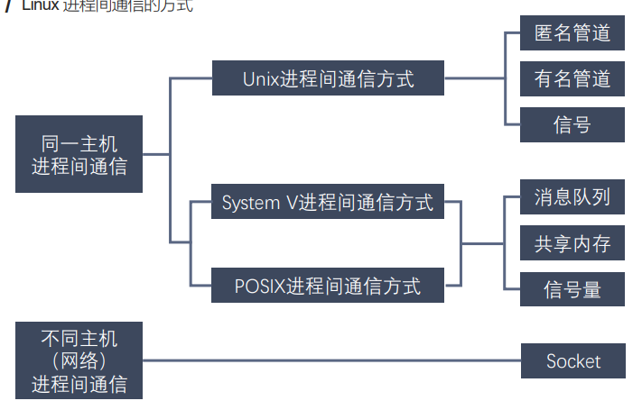

### a. 管道

管道的通信方式简单，同时也很容易得知管道内的数据是否被读取。但是管道效率低，不适合进程间频繁地交换数据。

**管道随进程的创建而建立，随进程的结束而销毁。**

#### - 匿名管道 `|`

UNIX 系统 IPC（进程间通信）的最古老的形式，所有 UNIX 系统都支持这种通信机制。

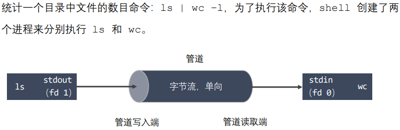


##### 特点

- 本质是一个在内核内存中维护的 **缓冲器**，缓冲器的存储能力由操作系统决定。
- 管道拥有文件的特质（读操作、写操作），可以按操作文件的方式对管道进行操作。**匿名管道没有文件实体，只存在于内存，不存于文件系统中。有名管道有文件实体，但不存储数据**。
- **一个管道是一个字节流**。进程可以从管道读取任意大小的数据块。
- 通过管道传递的数据是 **顺序** 的，读取顺序与写入顺序相同。
- 管道中数据的传递方向是 **单向** 的，一端写入，一端读取。管道是 **半双工**（可双向读写，但同时只能保证单向读写）的。
- 从管道中 **读取数据是一次性** 的，数据一旦被读走，就被管道抛弃了。
- 匿名管道只能在具有 **公共祖先** 的进程之间使用。


##### 为什么管道可以实现有亲缘关系进程间的通信？

匿名管道是特殊的文件，只存在于内存，不存于文件系统中。


使用 `fork` 创建子进程，**创建的子进程会复制父进程的文件描述符**，这样就做到了两个进程各有两个「 `fd[0]` 与 `fd[1]`」，两个进程就可以通过各自的 `fd` 写入和读取同一个管道文件实现跨进程通信了。

   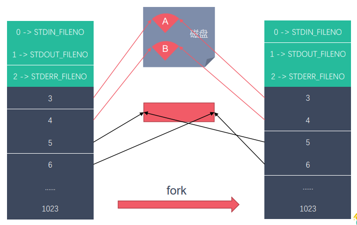

管道只能一端写入，另一端读出，所以上面这种模式容易造成混乱，因此一般要关闭不同的读/写端。


**如果需要双向通信，则应该创建两个管道。**

##### 匿名管道的使用


**头文件**

```c++
#include <unistd.h>
```

**函数体**

```c
int pipe(int pipefd[2]);
/*
  参数：
    - pipefd：传出参数。两个文件描述符，pipefd[0] 指向管道读端，pipefd[1] 指向管道写端。

  返回值：
    - 调用成功，返回 0；调用失败，返回 -1。

  作用：
    - 创建一个管道，实现进程间通信。
*/
```

**举例 - 子进程通过管道向父进程发送数据，父进程通过管道向子进程发送数据**

```c
#include <unistd.h>
#include <sys/types.h>
#include <stdio.h>
#include <string.h>
#include <stdlib.h>

int main()
{
    int pipefd[2];
    int ret = pipe(pipefd);
    if(ret == -1)
    {
        perror("pipe");
        exit(0);
    }

    pid_t pid = fork();
    if(pid > 0)
    {
        // parent
        close(pipefd[1]);   // 关闭写端（父进程不需要写）
        char buf[1024] = {0};
        int len = -1;
        while((len = read(pipefd[0], buf, sizeof(buf))) > 0)
        {
            printf("parent recv: %s, pid = %d\n", buf, getpid());
            memset(buf, 0, sizeof(buf));
        }
    }
    else if(pid == 0)
    {
        // child
        close(pipefd[0]);   // 关闭读端（子进程不需要读）
        char * str = "message from child! ";
        while(1)
        {
            write(pipefd[1], str, strlen(str));
            sleep(1);
        }
    }
    else if(pid == -1)
    {
        perror("fork");
        exit(0);
    }
}
```

##### 匿名管道的读写特点（默认阻塞）

读管道时：

- 管道中有数据：read 返回实际读到的字节数；
- 管道中无数据：
  - 若写端关闭，则 read 返回 0，表示读完；
  - 若写端没有全部关闭，read 阻塞等待。

写管道时：

- **读端全部关闭：内核发送 SIGPIPE 信号给进程，进程异常终止；**
- 读端没有全部关闭：
  - 若管道已满：write阻塞，等待数据被读取；
  - 若管道未满：write 继续写入，返回实际写入的字节数。

##### ==*非阻塞态读取管道==

管道可以设置成非阻塞读取（将管道读端文件设置为 `O_NONBLOCK`），那么，在管道内无数据时，非阻塞读取 `read` 将会一直返回 -1。

```c
// 设置管道非阻塞读（利用 fcntl 函数）
#include <unistd.h>
#include <stdio.h>
#include <sys/types.h>
#include <fcntl.h>
#include <stdlib.h>
#include <string.h>

int main()
{
    int pipefd[2];
    int ret = pipe(pipefd);
    if(ret == -1)
    {
        perror("pipe");
        exit(0);
    }

    pid_t pid = fork();
    if(pid > 0)
    {
        // parent
        close(pipefd[1]);

        // set nonblock
        int flag = fcntl(pipefd[0], F_GETFL);
        flag |= O_NONBLOCK;
        ret = fcntl(pipefd[0], F_SETFL, flag);

        char buf[1024] = {0};
        int len = -1;
        while(1)
        {
            len = read(pipefd[0], buf, sizeof(buf)-1);
            printf("len: %d\n", len);
            printf("parent recv: %s, pid: %d\n", buf, getpid());
            memset(buf, 0, sizeof(buf));
            sleep(2);
        }
    }
    else if(pid == 0)
    {
        // child
        close(pipefd[0]);
        char * str = "message from child";
        int cnt = 0;
        while(cnt < 3)
        {
            write(pipefd[1], str, strlen(str));
            sleep(5);
            cnt++;
        }
        close(pipefd[1]); 	// 写端关闭后，在读取完所有数据后，父进程 len = 0
    }
    else if(pid == -1)
    {
        perror("fork");
        exit(0);
    }

    return 0;
}
```


如果不关闭父进程读端，也不读取管道，则子进程会一直发送信息给管道，直到管道满：


```c
// 设置管道非阻塞读（利用 fcntl 函数）

#include <unistd.h>
#include <stdio.h>
#include <sys/types.h>
#include <fcntl.h>
#include <stdlib.h>
#include <string.h>

int main()
{
    int pipefd[2];
    int ret = pipe(pipefd);
    if(ret == -1)
    {
        perror("pipe");
        exit(0);
    }

    
    if(ret == -1)
    {
        perror("fcntl");
        exit(0);
    }

    pid_t pid = fork();
    if(pid > 0)
    {
        // parent
        close(pipefd[1]);
        sleep(300;
    }
    else if(pid == 0)
    {
        // child
        close(pipefd[0]);
        char * str = "message from child";
        // int cnt = 0;
        while(1)
        {
            write(pipefd[1], str, strlen(str));
            printf("child send: %s, pid: %d\n", str, getpid());
        }
        close(pipefd[1]);
    }
    else if(pid == -1)
    {
        perror("fork");
        exit(0);
    }

    return 0;
}
```


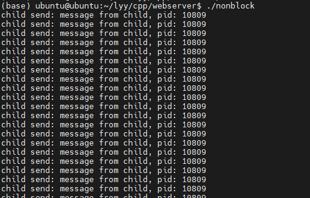

#### - 有名管道 FIFO（文件类型 p）

匿名管道受限于有亲缘关系的进程间通信，而有名管道提供了一个文件的实体，以 FIFO（管道的数据读取顺序与写入顺序相同，先入先出） 的文件形式存在于文件系统（**写入管道的内容不存放在文件中，而是存放在内存缓冲区中**）中，因此可以在无亲缘关系的进程间实现通信。

##### 有名管道的创建

###### 命令创建

```shell
$ mkfifo fifo
```

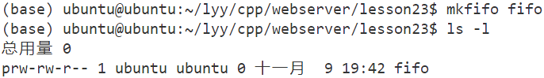

###### `mkfifo` 函数创建

头文件：

```c
#include <sys/types.h>
#include <sys/stat.h>
```

```c
int mkfifo(const char *pathname, mode_t mode);
/*
  参数：
    - pathname：管道路径
    - mode：文件的权限，和 open 中的 mode 相同

  返回值：
    - 调用成功，返回 0； 调用失败，返回 -1。

  作用：
    - 创建一个有名管道
*/
```

```c
#include <sys/types.h>
#include <sys/stat.h>
#include <stdio.h>
#include <stdlib.h>

int main()
{
    // 查看有名管道是否存在，不存在则创建有名管道
    int ret = access("fifo1", F_OK);
    if(ret == -1)
    {
        printf("fifo not exits, create fifo test!\n");
        ret = mkfifo("fifo1", 0664);
        if(ret == -1)
        {
            perror("mkfifo");
            exit(0);
        }
    }
}
```

运行结果：

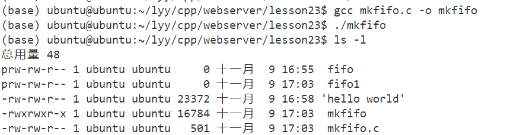

##### 有名管道的读写特点

- **若读端全部关闭，则写端进程会异常终止。**
- 若存在读端，则写端进程一直写到缓冲区满阻塞等待。
- 若写端全部关闭，则读端进程在读完缓冲区后，结束进程。
- **若存在写端，则读端进程一直阻塞直到写端写入数据。**

##### ==有名管道的读写实现==

- **管道文件不能读写打开**，这样的行为是未定义的。管道是半双工的。

- 进程调用 `open` 以 **只读或只写打开管道文件** 时，在管道文件的另一些写/读端没有被打开时，进程会阻塞。
- 当一个读写端都被打开的管道的读端或者写端被关闭时，写/读管道的进程会接收到 `SIGPIPE` 信号，进程异常终止。

```c
// chatA.c
// 创建两个有名管道，管道 1 实现 A 写 B 读，管道 2 实现 B 写 A 读。
// 必须一个先读后写，一个先写后读，否则会阻塞

#include <sys/types.h>
#include <unistd.h>
#include <fcntl.h>
#include <sys/stat.h>
#include <stdlib.h>
#include <stdio.h>
#include <string.h>

int main()
{
    int ret = access("awbr", F_OK);
    if(ret == -1)
    {
        printf("fifo not exits, create a fifo for A to write, for B to read\n");
        ret = mkfifo("awbr", 0664);
        if(ret == -1)
        {
            perror("mkfifio awbr");
            exit(0);
        }
    }
    printf("awbr exits!\n");

    ret = access("bwar", F_OK);
    if(ret == -1)
    {
        printf("fifo not exits, create a fifo for B to write, for A to read\n");
        ret = mkfifo("bwar", 0664);
        if(ret == -1)
        {
            perror("mkfifio bwar");
            exit(0);
        }
    }
    printf("bwar exits!\n");

    int fdw = open("awbr", O_WRONLY);
    if(fdw == -1) {
        perror("open fdw");
        exit(0);
    }
    printf("A open awbr!\n");

    int fdr = open("bwar", O_RDONLY);
    if(fdr == -1) {
        perror("open fdr");
        exit(0);
    }
    printf("A open bwar!\n");

    char buf[1024] = {0};

    while(1)
    {
        // write
        memset(buf, 0, 1024);
        fgets(buf, 1024, stdin);
        write(fdw, buf, strlen(buf));
        printf("A: %s\n", buf);

        // read
        memset(buf, 0, 1024);
        int len = read(fdr, buf, sizeof(buf));
        if(len < 0)
        {
            perror("read");
            exit(0);
        }
        printf("B: %s\n", buf);
    }

    // close
    close(fdw);
    close(fdr);

    return 0;
}


// chatB.c
// 创建两个有名管道，管道 1 实现 A 写 B 读，管道 2 实现 B 写 A 读。
// 必须一个先读后写，一个先写后读，否则会阻塞

#include <sys/types.h>
#include <unistd.h>
#include <fcntl.h>
#include <sys/stat.h>
#include <stdlib.h>
#include <stdio.h>
#include <string.h>

int main()
{
    int ret = access("bwar", F_OK);
    if(ret == -1)
    {
        printf("fifo not exits, create a fifo for B to write, for A to read\n");
        ret = mkfifo("bwar", 0664);
        if(ret == -1)
        {
            perror("mkfifio bwar");
            exit(0);
        }
    }
    printf("bwar exits!\n");

    ret = access("awbr", F_OK);
    if(ret == -1)
    {
        printf("fifo not exits, create a fifo for A to write, for B to read\n");
        ret = mkfifo("awbr", 0664);
        if(ret == -1)
        {
            perror("mkfifio awbr");
            exit(0);
        }
    }
    printf("awbr exits!\n");

    int fdr = open("awbr", O_RDONLY);
    if(fdr == -1) {
        perror("open fdr");
        exit(0);
    }
    printf("B open awbr!\n");

    int fdw = open("bwar", O_WRONLY);
    if(fdw == -1) {
        perror("open fdw");
        exit(0);
    }
    printf("B open bwar!\n");
    
    char buf[1024] = {0};

    while(1)
    {
        // read
        memset(buf, 0, 1024);
        int len = read(fdr, buf, sizeof(buf));
        if(len < 0)
        {
            perror("read");
            exit(0);
        }
        printf("len: %d\n", len);
        printf("A: %s\n", buf);

        // write
        memset(buf, 0, 1024);
        fgets(buf, 1024, stdin);
        write(fdw, buf, strlen(buf));
        printf("B: %s\n", buf);  
    }

    // close
    close(fdw);
    close(fdr);

    return 0;
}
```

运行结果：

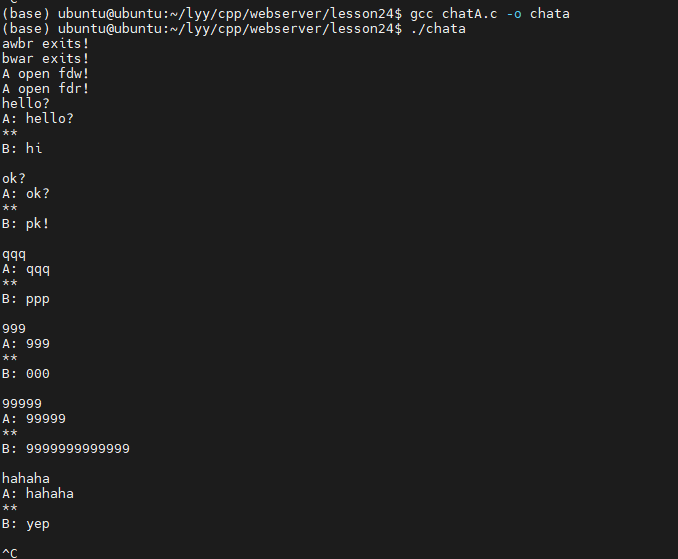


------

### b. 消息队列

消息队列是保存在 **内核中的消息体链表**。消息体是用户自定义的数据类型，消息的发送方和接收方要约定好消息体的数据类型，每个消息体都是固定大小的存储块，不像管道是无格式的字节流数据。

和管道不同，**消息队列生命周期随内核**。

**缺点：**

- 非即时通信。
- 有大小限制。**消息队列不适合比较大数据的传输**，因为在内核中每个消息体都有一个最大长度的限制，同时所有队列所包含的全部消息体的总长度也是有上限。在 Linux 内核中，会有两个宏定义 `MSGMAX` 和 `MSGMNB`，它们以字节为单位，分别定义了一条消息的最大长度和一个队列的最大长度。
- **消息队列通信过程中，存在用户态与内核态之间的数据拷贝开销**，因为进程写入数据到内核中的消息队列时，会发生从用户态拷贝数据到内核态的过程，同理另一进程读取内核中的消息数据时，会发生从内核态拷贝数据到用户态的过程。

### c. 共享内存 - 避免用户态与内核态之间的消息拷贝过程

**共享内存，就是拿出一块虚拟地址空间来，映射到相同的物理内存中**。这样这个进程写入的东西，另外一个进程马上就能看到了，大大提高了进程间通信的速度。


------

### d. 信号量 - 实现进程间的互斥与同步

**共享内存存在冲突和竞争**。为了防止多进程竞争共享资源造成数据错乱，引入 **信号量** 保护机制。

**信号量是一个整型的计数器，主要用于实现进程间的互斥与同步，而不是用于缓存进程间通信的数据**。

**信号量表示资源的数量**，控制信号量的方式有两种原子操作：

- 一个是 **P 操作**，这个操作会把信号量减去 1，相减后如果信号量 **< 0**，则表明资源已被占用，进程需 **阻塞等待**；相减后如果信号量 >= 0，则表明还有资源可使用，进程可正常继续执行。
- 另一个是 **V 操作**，这个操作会把信号量加上 1，相加后如果信号量 **<= 0**，则表明当前有阻塞中的进程，于是会将该进程 **唤醒运行**；相加后如果信号量 > 0，则表明当前没有阻塞中的进程；

**互斥信号量**：信号初始值为 1。它可以保证共享内存在任何时刻只有一个进程在访问。

**同步信号量**：信号量初始值为 0。它可以保证先生产资源再消耗资源。

### e. 信号

对于异常情况下的工作模式，就需要用「信号」的方式来通知进程。**信号可以使一个正在运行的进程被另一个正在运行的异步进程中断，转而处理某一个突发事件。**

通过 `kill -l` 命令，查看所有的信号：

```shell
$ kill -l
 1) SIGHUP       2) SIGINT       3) SIGQUIT      4) SIGILL       5) SIGTRAP
 6) SIGABRT      7) SIGBUS       8) SIGFPE       9) SIGKILL     10) SIGUSR1
11) SIGSEGV     12) SIGUSR2     13) SIGPIPE     14) SIGALRM     15) SIGTERM
16) SIGSTKFLT   17) SIGCHLD     18) SIGCONT     19) SIGSTOP     20) SIGTSTP
21) SIGTTIN     22) SIGTTOU     23) SIGURG      24) SIGXCPU     25) SIGXFSZ
26) SIGVTALRM   27) SIGPROF     28) SIGWINCH    29) SIGIO       30) SIGPWR
31) SIGSYS      34) SIGRTMIN    35) SIGRTMIN+1  36) SIGRTMIN+2  37) SIGRTMIN+3
38) SIGRTMIN+4  39) SIGRTMIN+5  40) SIGRTMIN+6  41) SIGRTMIN+7  42) SIGRTMIN+8
43) SIGRTMIN+9  44) SIGRTMIN+10 45) SIGRTMIN+11 46) SIGRTMIN+12 47) SIGRTMIN+13
48) SIGRTMIN+14 49) SIGRTMIN+15 50) SIGRTMAX-14 51) SIGRTMAX-13 52) SIGRTMAX-12
53) SIGRTMAX-11 54) SIGRTMAX-10 55) SIGRTMAX-9  56) SIGRTMAX-8  57) SIGRTMAX-7
58) SIGRTMAX-6  59) SIGRTMAX-5  60) SIGRTMAX-4  61) SIGRTMAX-3  62) SIGRTMAX-2
63) SIGRTMAX-1  64) SIGRTMAX
```

#### 常见的信号

**ATTENTION：`SIGKILL` 和 `SIGSTOP` 信号不能被捕捉、阻塞或者忽略，只能执行默认动作。**


- `SIGINT`：`<Ctrl +C>`。用户终端向前台进程发出信号，终止进程。
- `SIGQUIT`：`<Ctrl + \>`。用户终端向前台进程发出信号，终止进程。

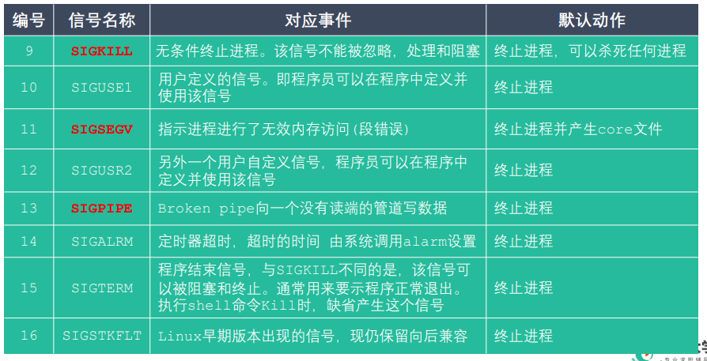

- `SIGKILL`：无条件终止任何进程（**除僵尸进程外**）。**该信号不能被忽略、处理和阻塞。**
- `SIGSEGV`：只是进程进行了无效内存访问（段错误）。终止进程并产生 `core` 文件（记录进程异常信息）。
- `SIGPIPE`：向一个没有读端的管道写数据。终止进程。

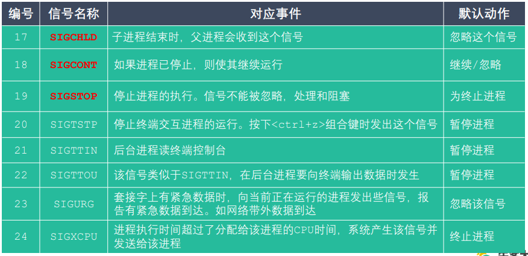

- `SIGCHID`：子进程退出时，父进程会接收到这个信号。默认忽略这个信号。
- `SIGCONT`：若进程已经停止，则使其继续运行。进程继续或忽略这个信号。
- `SIGSTOP`：停止进程执行。**该信号不能被忽略、处理和阻塞。**


#### 用户进程对信号的处理方式

**1. 执行默认操作**。Linux 对每种信号都规定了默认操作，例如，上面列表中的 SIGTERM 信号，就是终止进程的意思。

**2. 捕捉信号**。我们可以为信号定义一个信号处理函数。当信号发生时，我们就执行相应的信号处理函数。

**3. 忽略信号**。当我们不希望处理某些信号的时候，就可以忽略该信号，不做任何处理。有两个信号是应用进程无法捕捉和忽略的，即 `SIGKILL` 和 `SEGSTOP`，它们用于在任何时候中断或结束某一进程。

------

### f. Socket - 跨主机通信

前面提到的管道、消息队列、共享内存、信号量和信号都是在同一台主机上进行进程间通信，那要想**跨网络与不同主机上的进程之间通信，就需要 Socket 通信了。**

实际上，Socket 通信不仅可以跨网络与不同主机的进程间通信，还可以在同主机上进程间通信。

```c
int socket(int domain, int type, int protocol);
/*
  参数：
    - domain：指定通信协议族，
    	- AF_INET 用于 IPV4、AF_INET6 用于 IPV6、AF_LOCAL/AF_UNIX 用于本机（<sys/socket.h>）
    - type：通信特性
     	- SOCK_STREAM：字节流，TCP
      	- SOCK_DGRAM：报文传递，UDP
    - protocol：基本废弃，写 0 即可。

  返回值：
    - 调用成功，返回套接字描述符；调用失败，返回 -1，并设置错误号。

  作用：
    - 创建一个套接字 socket 用来监听
*/
```

根据创建 socket 类型的不同，通信的方式也就不同：

- 实现 TCP 字节流通信： socket 类型是 AF_INET 和 SOCK_STREAM；
- 实现 UDP 数据报通信：socket 类型是 AF_INET 和 SOCK_DGRAM；
- 实现本地进程间通信： 
  - 「本地字节流 socket 」类型是 AF_LOCAL 和 SOCK_STREAM，
  - 「本地数据报 socket 」类型是 AF_LOCAL 和 SOCK_DGRAM。另外，AF_UNIX 和 AF_LOCAL 是等价的，所以 AF_UNIX 也属于本地 socket；


#### TCP 通信


**服务器端**

> 1. 创建一个用于监听的套接字，监听是否有客户端的连接
> 2. 将这个监听文件描述符和本地的 **IP 和端口** 绑定
>    - IP 和端口表示了服务器的地址信息，客户端通过这个 IP 和端口连接服务器
> 3. 设置监听，开始监听
> 4. **阻塞等待**，直到有客户端发起连接，解除阻塞，接受客户端的连接，得到一个和客户端通信的 **连接套接字**
> 5. 通信。接收数据 / 发送数据
> 6. 通信结束，断开连接


**客户端**

> 1. 创建一个用于通信的 **连接套接字**（fd）
> 2. 连接服务器（指定服务器的 IP 和端口）
> 3. 连接成功后，客户端与服务器进行通信。接收数据 / 发送数据
> 4. 通信结束，断开连接（断开通信时，会在发送的数据末尾插入一个 EOF，那么服务端读到了这个 EOF，就能知道客户端断开连接）

####  UDP 通信


- UDP 的交互需要 IP 地址和端口号，因此也需要 bind。
- UDP 没有连接的，所以不需要三次握手，也就不需要像 TCP 调用 listen 和 connect
- 另外，每次通信时，**调用 sendto 和 recvfrom，都要传入目标主机的 IP 地址和端口**

#### 本机进程间通信

其他都一样，唯一的区别是，本地字节流 socket 和 本地数据报 socket 在 bind 的时候，不像 TCP 和 UDP 要绑定 IP 地址和端口，而是 **绑定一个本地文件**。

## 4. 多线程互斥和同步

**临界区**：指访问某一共享资源的 **代码片段**，并且这段代码的执行应为 **原子操作**，也就是同时访问同一共享资源的其他线程不应中断该片段的执行。

**互斥**：保证一个线程在临界区执行时，其他线程被阻止进入临界区。

**同步**：当有一个线程在对内存进行操作时，其他线程都不可以对这个内存地址进行操作，直到该线程完成操作，其他线程才能对该内存地址进行操作，而其他线程则处于等待状态。

### 锁

使用加锁操作和解锁操作可以解决并发线程/进程的互斥问题。

任何想进入临界区的线程，必须先执行加锁操作。若加锁操作顺利通过，则线程可进入临界区；在完成对临界资源的访问后再执行解锁操作，以释放该临界资源。


#### 互斥锁

获取不到锁时，阻塞线程，把当前线程放入到锁的等待队列，然后执行调度程序，把 CPU 让给其他线程执行。

**互斥锁是独占锁。**


**互斥锁加锁失败时，会从用户态陷入到内核态，让内核切换线程，存在一定的性能开销成本（两次线程上下文切换的成本）：**

- 当线程加锁失败时，内核会把线程的状态从「运行」状态设置为「睡眠」状态，然后把 CPU 切换给其他线程运行；
- 接着，当锁被释放时，之前「睡眠」状态的线程会变为「就绪」状态，然后内核会在合适的时间，把 CPU 切换给该线程运行。

所以，**如果你确定被锁住的代码执行时间很短，就不应该用互斥锁，而应该选用自旋锁。**

#### 自旋锁 / 忙等待锁

获取不到锁时，会一直询问锁，不做任何事情，直到锁可获取为止，这需要消耗 CPU。

在单处理器上，需要抢占式的调度器（即不断通过时钟中断一个线程，运行其他线程）。否则，自旋锁在单 CPU 上无法使用，因为一个自旋的线程永远不会放弃 CPU。

自旋锁开销少，在多核系统下一般不会主动产生线程切换，适合异步、协程等在用户态切换请求的编程方式，但如果被锁住的代码执行时间过长，自旋的线程会长时间占用 CPU 资源。

#### 读写锁

如果只读取共享资源用「读锁」加锁，如果要修改共享资源则用「写锁」加锁。读写锁在读多写少的场景，能发挥出优势。

工作原理：

- **当「写锁」没有被线程持有时，多个线程能够并发地持有读锁**，提高共享资源的访问效率。
- **一旦「写锁」被线程持有后，读线程的获取读锁的操作会被阻塞**，而且其他写线程的获取写锁的操作也会被阻塞。

**写锁是独占锁**，因为任何时刻只能有一个线程持有写锁，类似互斥锁和自旋锁。

**读锁是共享锁**，因为读锁可以被多个线程同时持有。

##### 读优先锁 - 写者可能饿死

读优先锁 **期望读锁能被更多的线程持有**，以便提高读线程的并发性，它的工作方式是：当读线程 A 先持有了读锁，写线程 B 在获取写锁的时候，会被阻塞，并且在阻塞过程中，后续来的读线程 C 仍然可以成功获取读锁，最后直到读线程 A 和 C 释放读锁后，写线程 B 才可以成功获取写锁。如下图：


##### 写优先锁 - 读者可能饿死

「写优先锁」**优先服务写线程**，其工作方式是：当读线程 A 先持有了读锁，写线程 B 在获取写锁的时候，会被阻塞，并且在阻塞过程中，**后续来的读线程 C 获取读锁时会失败**，于是读线程 C 将被阻塞在获取读锁的操作，这样只要读线程 A 释放读锁后，写线程 B 就可以成功获取写锁。如下图：


##### 公平读写锁

用队列把获取锁的线程排队，**不管是写线程还是读线程都按照先进先出的原则加锁**，这样读线程仍然可以并发，也不会出现「饥饿」的现象。

#### 乐观锁和悲观锁

**悲观锁**：认为多线程同时修改共享资源的概率比较高，很容易出现冲突，所以 **访问共享资源前，先上锁**。**互斥锁**、**自旋锁**、**读写锁**，都是属于悲观锁。

**乐观锁**：假定冲突的概率很低。**先修改完共享资源，再验证这段时间内有没有发生冲突**，如果没有其他线程在修改资源，那么操作完成，如果发现有其他线程已经修改过这个资源，就放弃本次操作。

**乐观锁的应用场景：在线文档、Git**

在线文档实现多人同时编辑，实际上是用了乐观锁，它允许多个用户打开同一个文档进行编辑，**编辑完提交之后才验证修改的内容是否有冲突**。

如何验证冲突：

- 由于发生冲突的概率比较低，所以先让用户编辑文档，但是 **浏览器在下载文档时会记录下服务端返回的文档版本号**；
- 当用户提交修改时，发给服务端的请求会带上 **原始文档版本号**，服务器收到后将它与当前版本号进行比较，如果版本号不一致则提交失败，如果版本号一致则修改成功，然后服务端版本号更新到最新的版本号。

### 信号量

信号量是操作系统提供的一种协调共享资源访问的方法。**信号量表示资源的数量**，对应的变量是一个整型（`sem`）变量。

两个原子操作的系统调用函数控制信号量：

- P 操作：将 `sem` 减 `1`，相减后，如果 `sem < 0`，则进程/线程进入阻塞等待，否则继续，表明 P 操作可能会阻塞；
- V 操作：将 `sem` 加 `1`，相加后，如果 `sem <= 0`，唤醒一个等待中的进程/线程，表明 V 操作不会阻塞；

#### 生产者-消费者问题


生产者-消费者问题：

- **生产者** 在生成数据后，放在一个缓冲区中；
- **消费者** 从缓冲区取出数据处理；（生产者消费者同步）
- 任何时刻，**只有一个** 生产者或消费者可以访问缓冲区；（缓冲区互斥）

需要三个信号量，分别是：

- 互斥信号量 `mutex`：用于互斥访问缓冲区，初始化值为 1；
- 资源信号量 `fullBuffers`：用于消费者询问缓冲区是否有数据，有数据则读取数据，初始化值为 0（表明缓冲区一开始为空）；
- 资源信号量 `emptyBuffers`：用于生产者询问缓冲区是否有空位，有空位则生成数据，初始化值为 n （缓冲区大小）；

实现代码：


#### 哲学家就餐问题 - 互斥访问有限的竞争问题（如 I/O 设备）


哲学家就餐的问题描述：

- `5` 个哲学家，围绕着一张圆桌吃面；
- 这个桌子只有 `5` 支叉子，每两个哲学家之间放一支叉子；
- 哲学家围在一起先思考，思考中途饿了就会想进餐；
- **哲学家要两支叉子才愿意吃面，也就是需要拿到左右两边的叉子才进餐**；
- **吃完后，会把两支叉子放回原处，继续思考**；

##### 方案一（死锁）

为每个叉子设置一个互斥信号量：


假设五位哲学家同时拿起左边的叉子，会发生 **死锁** 现象。


##### 方案二（效率低）

拿取左右叉子设置为原子操作：


只要有一个哲学家进入了「临界区」，其他哲学家都不能动，**只有这位哲学家用完叉子了，才能轮到下一个哲学家进餐。**


##### 方案三（两人同时进餐）

让偶数编号的哲学家「先拿左边的叉子后拿右边的叉子」，奇数编号的哲学家「先拿右边的叉子后拿左边的叉子」。


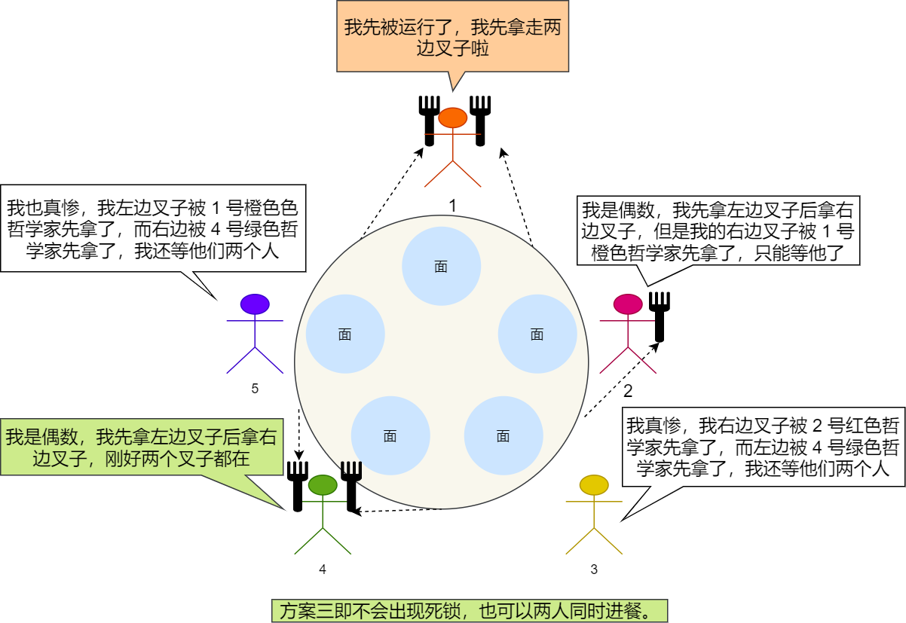

#### 读者-写者问题 - 数据库

读者-写者的问题描述：

- 「读-读」允许：同一时刻，允许多个读者同时读
- 「读-写」互斥：没有写者时读者才能读，没有读者时写者才能写
- 「写-写」互斥：没有其他写者时，写者才能写

##### 方案一（读者优先，写者会饿死）

使用信号量的方式来尝试解决：

- 信号量 `wMutex`：控制写操作的互斥信号量，初始值为 1 ；
- 读者计数 `rCount`：正在进行读操作的读者个数，初始化为 0；
- 信号量 `rCountMutex`：控制对 rCount 读者计数器的互斥修改，初始值为 1；

接下来看看代码的实现：


##### 方案二（写者优先，读者饿死）

- 只要有写者准备要写入，写者应尽快执行写操作，后来的读者就必须阻塞；
- 如果有写者持续不断写入，则读者就处于饥饿；

在方案一的基础上新增如下变量：

- 信号量 `rMutex`：控制读者进入的互斥信号量，初始值为 1；
- 信号量 `wDataMutex`：控制写者写操作的互斥信号量，初始值为 1；
- 写者计数 `wCount`：记录写者数量，初始值为 0；
- 信号量 `wCountMutex`：控制 wCount 互斥修改，初始值为 1；

具体实现如下代码：


方案三（公平策略）

- 优先级相同；
- 写者、读者互斥访问；
- 只能一个写者访问临界区；
- 可以有多个读者同时访问临界资源；

具体代码实现：


### ==条件变量==


## 5. 怎么避免死锁

死锁：两个线程都在等待对方释放锁。

死锁产生的条件：

- 互斥

  - 多个线程不能同时使用同一个资源

    

    

- 持有并等待

  - 当线程 A 已经持有了资源 1，又想申请资源 2，而资源 2 已经被线程 C 持有了，所以线程 A 就会处于等待状态，但是 **线程 A 在等待资源 2 的同时并不会释放自己已经持有的资源 1**。

    

- 不可剥夺

  - 当线程已经持有了资源 ，**在自己使用完之前不能被其他线程获取**

    

- 环路等待

  - 在死锁发生的时候，**两个线程获取资源的顺序构成了环形链**。

### 排查死锁问题

使用 `pstack` + `gdb` 工具来定位死锁问题。

 `pstack <pid>` 命令可以显示每个线程的栈跟踪信息（函数调用过程）。

在定位死锁问题时，可以多次执行 `pstack` 命令查看线程的函数调用过程，多次对比结果，**确认哪几个线程一直没有变化**，**且是因为在等待锁**，那么大概率是由于死锁问题导致的。

我用 pstack 输出了我前面模拟死锁问题的进程的所有线程的情况，多次执行命令后，其结果都一样，如下：

```shell
$ pstack 87746
Thread 3 (Thread 0x7f60a610a700 (LWP 87747)):
#0  0x0000003720e0da1d in __lll_lock_wait () from /lib64/libpthread.so.0
#1  0x0000003720e093ca in _L_lock_829 () from /lib64/libpthread.so.0
#2  0x0000003720e09298 in pthread_mutex_lock () from /lib64/libpthread.so.0
#3  0x0000000000400725 in threadA_proc ()
#4  0x0000003720e07893 in start_thread () from /lib64/libpthread.so.0
#5  0x00000037206f4bfd in clone () from /lib64/libc.so.6
Thread 2 (Thread 0x7f60a5709700 (LWP 87748)):
#0  0x0000003720e0da1d in __lll_lock_wait () from /lib64/libpthread.so.0
#1  0x0000003720e093ca in _L_lock_829 () from /lib64/libpthread.so.0
#2  0x0000003720e09298 in pthread_mutex_lock () from /lib64/libpthread.so.0
#3  0x0000000000400792 in threadB_proc ()
#4  0x0000003720e07893 in start_thread () from /lib64/libpthread.so.0
#5  0x00000037206f4bfd in clone () from /lib64/libc.so.6
Thread 1 (Thread 0x7f60a610c700 (LWP 87746)):
#0  0x0000003720e080e5 in pthread_join () from /lib64/libpthread.so.0
#1  0x0000000000400806 in main ()

....

$ pstack 87746
Thread 3 (Thread 0x7f60a610a700 (LWP 87747)):
#0  0x0000003720e0da1d in __lll_lock_wait () from /lib64/libpthread.so.0
#1  0x0000003720e093ca in _L_lock_829 () from /lib64/libpthread.so.0
#2  0x0000003720e09298 in pthread_mutex_lock () from /lib64/libpthread.so.0
#3  0x0000000000400725 in threadA_proc ()
#4  0x0000003720e07893 in start_thread () from /lib64/libpthread.so.0
#5  0x00000037206f4bfd in clone () from /lib64/libc.so.6
Thread 2 (Thread 0x7f60a5709700 (LWP 87748)):
#0  0x0000003720e0da1d in __lll_lock_wait () from /lib64/libpthread.so.0
#1  0x0000003720e093ca in _L_lock_829 () from /lib64/libpthread.so.0
#2  0x0000003720e09298 in pthread_mutex_lock () from /lib64/libpthread.so.0
#3  0x0000000000400792 in threadB_proc ()
#4  0x0000003720e07893 in start_thread () from /lib64/libpthread.so.0
#5  0x00000037206f4bfd in clone () from /lib64/libc.so.6
Thread 1 (Thread 0x7f60a610c700 (LWP 87746)):
#0  0x0000003720e080e5 in pthread_join () from /lib64/libpthread.so.0
#1  0x0000000000400806 in main ()
```

可以看到，Thread 2 和 Thread 3 一直阻塞获取锁（*pthread_mutex_lock*）的过程，而且 pstack 多次输出信息都没有变化，那么可能大概率发生了死锁。

但是，还不能够确认这两个线程是在互相等待对方的锁的释放，因为我们看不到它们是等在哪个锁对象，于是我们可以使用 gdb 工具进一步确认：

```shell
// gdb 命令
$ gdb -p 87746

// 打印所有的线程信息
(gdb) info thread
  3 Thread 0x7f60a610a700 (LWP 87747)  0x0000003720e0da1d in __lll_lock_wait () from /lib64/libpthread.so.0
  2 Thread 0x7f60a5709700 (LWP 87748)  0x0000003720e0da1d in __lll_lock_wait () from /lib64/libpthread.so.0
* 1 Thread 0x7f60a610c700 (LWP 87746)  0x0000003720e080e5 in pthread_join () from /lib64/libpthread.so.0
//最左边的 * 表示 gdb 锁定的线程，切换到第二个线程去查看

// 切换到第2个线程
(gdb) thread 2
[Switching to thread 2 (Thread 0x7f60a5709700 (LWP 87748))]#0  0x0000003720e0da1d in __lll_lock_wait () from /lib64/libpthread.so.0 

// bt 可以打印函数堆栈，却无法看到函数参数，跟 pstack 命令一样 
(gdb) bt
#0  0x0000003720e0da1d in __lll_lock_wait () from /lib64/libpthread.so.0
#1  0x0000003720e093ca in _L_lock_829 () from /lib64/libpthread.so.0
#2  0x0000003720e09298 in pthread_mutex_lock () from /lib64/libpthread.so.0
#3  0x0000000000400792 in threadB_proc (data=0x0) at dead_lock.c:25
#4  0x0000003720e07893 in start_thread () from /lib64/libpthread.so.0
#5  0x00000037206f4bfd in clone () from /lib64/libc.so.6

// 打印第三帧信息，每次函数调用都会有压栈的过程，而 frame 则记录栈中的帧信息
(gdb) frame 3
#3  0x0000000000400792 in threadB_proc (data=0x0) at dead_lock.c:25
27    printf("thread B waiting get ResourceA \n");
28    pthread_mutex_lock(&mutex_A);

// 打印mutex_A的值 ,  __owner表示gdb中标示线程的值，即LWP
(gdb) p mutex_A
$1 = {__data = {__lock = 2, __count = 0, __owner = 87747, __nusers = 1, __kind = 0, __spins = 0, __list = {__prev = 0x0, __next = 0x0}}, 
  __size = "\002\000\000\000\000\000\000\000\303V\001\000\001", '\000' <repeats 26 times>, __align = 2}

// 打印mutex_B的值 ,  __owner表示gdb中标示线程的值，即LWP
(gdb) p mutex_B
$2 = {__data = {__lock = 2, __count = 0, __owner = 87748, __nusers = 1, __kind = 0, __spins = 0, __list = {__prev = 0x0, __next = 0x0}}, 
  __size = "\002\000\000\000\000\000\000\000\304V\001\000\001", '\000' <repeats 26 times>, __align = 2}  
```

1. 通过 `info thread` 打印了所有的线程信息，可以看到有 3 个线程，一个是主线程（LWP 87746），另外两个都是我们自己创建的线程（LWP 87747 和 87748）；
2. 通过 `thread 2`，将切换到第 2 个线程（LWP 87748）；
3. 通过 `bt`，打印线程的调用栈信息，可以看到有 threadB_proc 函数，说明这个是线程 B 函数，也就说 LWP 87748 是线程 B;
4. 通过 `frame 3`，打印调用栈中的第三个帧的信息，可以看到线程 B 函数，在获取互斥锁 A 的时候阻塞了；
5. 通过 `p mutex_A`，打印互斥锁 A 对象信息，可以看到它被 LWP 为 87747（线程 A） 的线程持有着；
6. 通过 `p mutex_B`，打印互斥锁 B 对象信息，可以看到他被 LWP 为 87748 （线程 B） 的线程持有着；

因为线程 B 在等待线程 A 所持有的 mutex_A, 而同时线程 A 又在等待线程 B 所拥有的mutex_B, 所以可以断定该程序发生了死锁。

### 避免死锁问题的发生

产生死锁的四个必要条件是：互斥条件、持有并等待条件、不可剥夺条件、环路等待条件。

那么避免死锁问题就只需要破环其中一个条件就可以，最常见的并且可行的方法：**使用资源有序分配法，来破环环路等待条件**。

**资源有序分配法**：线程 A 和 线程 B 获取资源的顺序要一样，当线程 A 是先尝试获取资源 A，然后尝试获取资源 B 的时候，线程 B 同样也是先尝试获取资源 A，然后尝试获取资源 B。也就是说，线程 A 和 线程 B 总是以相同的顺序申请自己想要的资源。

我们使用资源有序分配法的方式来修改前面发生死锁的代码，我们可以不改动线程 A 的代码。

我们先要清楚线程 A 获取资源的顺序，它是先获取互斥锁 A，然后获取互斥锁 B。

所以我们只需将线程 B 改成以相同顺序的获取资源，就可以打破死锁了。


线程 B 函数改进后的代码如下：

```c
//线程 B 函数，同线程 A 一样，先获取互斥锁 A，然后获取互斥锁 B
void *threadB_proc(void *data)
{
    printf("thread B waiting get ResourceA \n");
    pthread_mutex_lock(&mutex_A);
    printf("thread B got ResourceA \n");
    
    sleep(1);
    
    printf("thread B waiting  get ResourceB \n");
    pthread_mutex_lock(&mutex_B);
    printf("thread B got ResourceB \n");
    
    pthread_mutex_unlock(&mutex_B);
    pthread_mutex_unlock(&mutex_A);
    return (void *)0;
}
```

执行结果如下，可以看，没有发生死锁。

```shell
thread B waiting get ResourceA 
thread B got ResourceA 
thread A waiting get ResourceA 
thread B waiting  get ResourceB 
thread B got ResourceB 
thread A got ResourceA 
thread A waiting get ResourceB 
thread A got ResourceB
exit
```

## 6. 锁

### 互斥锁和自旋锁


自旋锁是通过 CPU 提供的 `CAS` 函数（*Compare And Swap*），在「用户态」完成加锁和解锁操作，不会主动产生线程上下文切换，所以相比互斥锁来说，会快一些，开销也小一些。

一般加锁的过程，包含两个步骤：

- 第一步，查看锁的状态，如果锁是空闲的，则执行第二步；
- 第二步，将锁设置为当前线程持有；

CAS 函数就把这两个步骤合并成一条硬件级指令，形成**原子指令**，这样就保证了这两个步骤是不可分割的，要么一次性执行完两个步骤，要么两个步骤都不执行。

比如，设锁为变量 lock，整数 0 表示锁是空闲状态，整数 pid 表示线程 ID，那么 CAS(lock, 0, pid) 就表示自旋锁的加锁操作，CAS(lock, pid, 0) 则表示解锁操作。

使用自旋锁的时候，当发生多线程竞争锁的情况，加锁失败的线程会「忙等待」，直到它拿到锁。这里的「忙等待」可以用 `while` 循环等待实现，不过最好是使用 CPU 提供的 `PAUSE` 指令来实现「忙等待」，因为可以减少循环等待时的耗电量。

自旋锁是最比较简单的一种锁，一直自旋，利用 CPU 周期，直到锁可用。**需要注意，在单核 CPU 上，需要抢占式的调度器（即不断通过时钟中断一个线程，运行其他线程）。否则，自旋锁在单 CPU 上无法使用，因为一个自旋的线程永远不会放弃 CPU。**

自旋锁开销少，在多核系统下一般不会主动产生线程切换，适合异步、协程等在用户态切换请求的编程方式，但如果被锁住的代码执行时间过长，自旋的线程会长时间占用 CPU 资源，所以自旋的时间和被锁住的代码执行的时间是成「正比」的关系，我们需要清楚的知道这一点。

自旋锁与互斥锁使用层面比较相似，但实现层面上完全不同：**当加锁失败时，互斥锁用「线程切换」来应对，自旋锁则用「忙等待」来应对**。

它俩是锁的最基本处理方式，更高级的锁都会选择其中一个来实现，比如读写锁既可以选择互斥锁实现，也可以基于自旋锁实现。

## 7. 一个进程最多可以创建多少个线程？

这个问题跟两个东西有关系：

- **进程的虚拟内存空间上限**，因为创建一个线程，操作系统需要为其分配一个栈空间，如果线程数量越多，所需的栈空间就要越大，那么虚拟内存就会占用的越多。
- **系统参数限制**，虽然 Linux 并没有内核参数来控制单个进程创建的最大线程个数，但是有系统级别的参数来控制整个系统的最大线程个数。

## 8. 线程崩溃了，进程也会崩溃吗？

一般来说，如果线程是因为非法访问内存引起的崩溃，那么进程肯定会崩溃。因为 **某个线程对地址的非法访问会导致内存的不确定性，进而可能会影响到其他线程**，操作系统会认为这很可能导致一系列严重的后果，于是干脆让整个进程崩溃。

### 线程非法访问内存的情况

线程共享代码段，数据段，地址空间，文件。

#### 针对只读内存写入数据

```c
   #include <stdio.h>
   #include <stdlib.h>
   
   int main() {
      char *s = "hello world";
      // 向只读内存写入数据，崩溃
      s[1] = 'H'; 
   }
```

#### 访问了进程没有权限访问的地址空间（比如内核空间）

```c
   #include <stdio.h>
   #include <stdlib.h>

   int main() {
      int *p = (int *)0xC0000fff;
      // 针对进程的内核空间写入数据，崩溃
      *p = 10; 
   }
```

在 32 位虚拟地址空间中，p 指向的是内核空间，显然不具有写入权限，所以上述赋值操作会导致崩溃

#### 访问了不存在的内存

```c
   #include <stdio.h>
   #include <stdlib.h>
   
   int main() {
      int *a = NULL;
      *a = 1;     
   }
```

以上错误都是访问内存时的错误，所以统一会报 Segment Fault 错误（即段错误），这些都会导致进程崩溃

## 进程是如何崩溃的-信号

其背后的机制如下

1. CPU 执行正常的进程指令
2. 调用 kill 系统调用向进程发送信号
3. 进程收到操作系统发的信号，CPU 暂停当前程序运行，并将控制权转交给操作系统
4. 调用 kill 系统调用向进程发送信号（假设为 11，即 SIGSEGV，一般非法访问内存报的都是这个错误）
5. **操作系统根据情况执行相应的信号处理程序（函数），一般执行完信号处理程序逻辑后会让进程退出**

注意上面的第五步，如果进程没有注册自己的信号处理函数，那么操作系统会执行默认的信号处理程序（一般最后会让进程退出），但如果注册了，则会执行自己的信号处理函数，这样的话就给了进程一个垂死挣扎的机会，它收到 kill 信号后，可以调用 exit() 来退出，**但也可以使用 sigsetjmp，siglongjmp 这两个函数来恢复进程的执行**

```c
// 自定义信号处理函数示例

#include <stdio.h>
#include <signal.h>
#include <stdlib.h>
// 自定义信号处理函数，处理自定义逻辑后再调用 exit 退出
void sigHandler(int sig) {
  printf("Signal %d catched!\n", sig);
  exit(sig);
}
int main(void) {
  signal(SIGSEGV, sigHandler);
  int *p = (int *)0xC0000fff;
  *p = 10; // 针对不属于进程的内核空间写入数据，崩溃
}

// 以上结果输出: Signal 11 catched!
```

**如代码所示**：注册信号处理函数后，当收到 SIGSEGV 信号后，先执行相关的逻辑再退出

另外当进程接收信号之后也可以不定义自己的信号处理函数，而是选择忽略信号，如下

```c
#include <stdio.h>
#include <signal.h>
#include <stdlib.h>

int main(void) {
  // 忽略信号
  signal(SIGSEGV, SIG_IGN);

  // 产生一个 SIGSEGV 信号
  raise(SIGSEGV);

  printf("正常结束");
}
```

也就是说虽然给进程发送了 kill 信号，但如果进程自己定义了信号处理函数或者无视信号就有机会逃出生天，当然了 kill -9 命令例外，不管进程是否定义了信号处理函数，都会马上被干掉。


# 7. 文件系统

文件系统是操作系统中 **管理持久数据**（磁盘中的文件） 的子系统。文件系统的 **基本数据单位是文件**。

用户和操作系统对文件的读写操作是有差异的，用户习惯以字节的方式读写文件，而操作系统则是以数据块来读写文件，那屏蔽掉这种差异的工作就是文件系统了。

## 1. 文件系统的基本组成

### 文件的数据结构

**索引节点** 和 **目录项**。记录文件的元信息和目录层次结构。

- 索引节点，也就是 *inode*，用来记录文件的元信息，比如 inode 编号、文件大小、访问权限、创建时间、修改时间、**数据在磁盘的位置 **等等。索引节点是文件的 **唯一 **标识，它们一一对应，也同样都会被存储在硬盘中，所以**索引节点同样占用磁盘空间**。
- 目录项，也就是 *dentry*，用来记录文件的名字、**索引节点指针** 以及与其他目录项的层级关联关系。多个目录项关联起来，就会形成目录结构，但它与索引节点不同的是，**目录项是由内核维护的一个数据结构，不存放于磁盘，而是缓存在内存**。

索引节点唯一标识一个文件，目录项记录文件的名字，所以 **目录项和索引节点的关系是多对一**，也就是说，**一个文件可以有多个别名**。比如，硬链接的实现就是多个目录项中的索引节点指向同一个文件。

**目录也是文件**，也是用索引节点唯一标识，和普通文件不同的是，普通文件在磁盘里面保存的是文件数据，而目录文件在磁盘里面保存子目录或文件。

如果查询目录频繁从磁盘读，效率会很低，所以内核会把已经读过的目录用目录项这个数据结构缓存在内存，下次再次读到相同的目录时，只需从内存读就可以，大大提高了文件系统的效率。

注意，目录项这个数据结构不只是表示目录，也是可以表示文件的。

### 文件数据在磁盘中的存储

磁盘读写的最小单位是 **扇区**，扇区的大小只有 `512B` 大小。文件系统把多个扇区组成了一个**逻辑块**，**每次读写的最小单位就是逻辑块（数据块）**，Linux 中的逻辑块大小为 `4KB`，也就是一次性读写 8 个扇区，这将大大提高了磁盘的读写的效率。

以上就是索引节点、目录项以及文件数据的关系，下面这个图就很好的展示了它们之间的关系：


索引节点是存储在硬盘上的数据，那么为了加速文件的访问，通常会把索引节点加载到内存中。

另外，磁盘进行格式化的时候，会被分成三个存储区域，分别是超级块、索引节点区和数据块区。

- *超级块*，用来存储文件系统的详细信息，比如块个数、块大小、空闲块等等。
- *索引节点区*，用来存储索引节点；
- *数据块区*，用来存储文件或目录数据；

我们不可能把超级块和索引节点区全部加载到内存，这样内存肯定撑不住，所以只有当需要使用的时候，才将其加载进内存，它们加载进内存的时机是不同的：

- 超级块：当文件系统挂载时进入内存；
- 索引节点区：当文件被访问时进入内存；

------

## [#](https://xiaolincoding.com/os/6_file_system/file_system.html#虚拟文件系统)虚拟文件系统

文件系统的种类众多，而操作系统希望**对用户提供一个统一的接口**，于是在用户层与文件系统层引入了中间层，这个中间层就称为**虚拟文件系统（\*Virtual File System，VFS\*）。**

VFS 定义了一组所有文件系统都支持的数据结构和标准接口，这样程序员不需要了解文件系统的工作原理，只需要了解 VFS 提供的统一接口即可。

在 Linux 文件系统中，用户空间、系统调用、虚拟文件系统、缓存、文件系统以及存储之间的关系如下图：


Linux 支持的文件系统也不少，根据存储位置的不同，可以把文件系统分为三类：

- *磁盘的文件系统*，它是直接把数据存储在磁盘中，比如 Ext 2/3/4、XFS 等都是这类文件系统。
- *内存的文件系统*，这类文件系统的数据不是存储在硬盘的，而是占用内存空间，我们经常用到的 `/proc` 和 `/sys` 文件系统都属于这一类，读写这类文件，实际上是读写内核中相关的数据。
- *网络的文件系统*，用来访问其他计算机主机数据的文件系统，比如 NFS、SMB 等等。

文件系统首先要先挂载到某个目录才可以正常使用，比如 Linux 系统在启动时，会把文件系统挂载到根目录。

------

## 2. 文件的打开和读写

首先通过系统调用来打开一个文件。


```shell
fd = open(name, flag); # 打开文件
...
write(fd,...);         # 写数据
...
close(fd);             # 关闭文件
```

上面简单的代码是读取一个文件的过程：

- 首先用 `open` 系统调用打开文件，`open` 的参数中包含文件的路径名和文件名。
- 使用 `write` 写数据，其中 `write` 使用 `open` 所返回的 **文件描述符**，并不使用文件名作为参数。
- 使用完文件后，要用 `close` 系统调用关闭文件，避免资源的泄露。

**操作系统会跟踪进程打开的所有文件**，即，操作系统为每个进程维护一个 **打开文件表**，文件表里的每一项代表「**文件描述符**」，所以说文件描述符是打开文件的标识。


操作系统在打开文件表中维护着打开文件的状态和信息：

- 文件指针：系统跟踪上次读写位置作为当前文件位置指针，这种指针对打开文件的某个进程来说是唯一的；
- 文件打开计数器：跟踪打开和关闭的数量，当该计数为 0 时，系统关闭文件，删除该条目；
- 文件磁盘位置：绝大多数文件操作都要求系统修改文件数据，该信息保存在内存中，以免每个操作都从磁盘中读取；
- 访问权限：每个进程打开文件都需要有一个访问模式（创建、只读、读写、添加等），该信息保存在进程的打开文件表中，以便操作系统能允许或拒绝之后的 I/O 请求；

### 文件的读写 - 基本操作单位是数据块

- 当用户进程从文件读取 1 个字节大小的数据时，文件系统则需要获取字节所在的数据块，再返回数据块对应的用户进程所需的数据部分。
- 当用户进程把 1 个字节大小的数据写进文件时，文件系统则找到需要写入数据的数据块的位置，然后修改数据块中对应的部分，最后再把数据块写回磁盘。

------

## 3. 文件的存储方式

### - 连续空间存放方式

文件存放在磁盘「连续的」物理空间中，**读写效率高**，因为一次磁盘寻道就可以读出整个文件。

连续空间存放的前提：已知文件的大小。所以，**文件头（类似于 inode）里需要指定「起始块的位置」和「长度」**。


缺点：

- 文件删除会产生磁盘空间碎片。（磁盘内挪动文件耗时，不现实）
- 文件长度不易扩展。

### - 非连续空间存放方式

链表方式 和 索引方式。

#### a. 链表方式

链表方式解决 **磁盘空间碎片**，实现 **文件动态扩展**，但不能实现 **随机访问**。

链表可分为「**隐式链表**」和「**显式链接**」两种形式。

##### 隐式链表

文件头包含「第一块」和「最后一块」的位置，每个数据块里面留出一个指针空间，存放下一个数据块的位置。


**缺点：**

- 无法直接访问数据块，只能通过指针顺序访问文件。
- 数据块指针消耗了一定的存储空间**。**
- 稳定性较差，系统在运行过程中由于软件或者硬件错误导致链表中的 **指针丢失或损坏**，会导致文件数据的丢失。

##### 显式链表

把用于链接文件各数据块的指针，显式地存放在 **内存的文件分配表（\*File Allocation Table，FAT\*）** 中。该表在整个磁盘仅设置一张，**每个表项中存放链接指针，指向下一个数据块号**。


**优点：**

- 存储在内存中，提高检索速度，减少磁盘访问。

**缺点：**

- 不适用于大磁盘，会导致文件分配表很大。

#### b. 索引方式

索引方式可以实现随机访问。

索引的实现：

- 为每个文件创建一个「**索引数据块**」，里面存放 **指向文件数据块的指针列表。**
- **文件头需要包含指向「索引数据块」的指针**，这样就可以通过文件头知道索引数据块的位置，再通过索引数据块里的索引信息找到对应的数据块。


**优点：**

- 文件的创建、增大、缩小很方便；
- 不会有碎片的问题；
- 支持顺序读写和随机读写；

**缺点：**

- 索引数据块带来额外的空间消耗。

#### c. 大文件的组合方式

##### 链式索引块 - 链表 + 索引

**在索引数据块留出一个存放下一个索引数据块的指针**，于是当一个索引数据块的索引信息用完了，就可以通过指针的方式，找到下一个索引数据块的信息。那这种方式也会出现前面提到的链表方式的问题，万一某个指针损坏了，后面的数据也就会无法读取了。


**缺点：**

- 不稳定。万一存放下一个索引数据块的指针损坏了，后面的数据就丢了。

##### 多级索引块 - 索引 + 索引

**通过一个索引块来存放多个索引数据块。**


### - Unix 文件的实现方式


Unix 根据文件的大小，选择存放的方式：

- 如果存放文件所需的数据块小于 10 块，则采用直接查找的方式；
- 如果存放文件所需的数据块超过 10 块，则采用一级间接索引方式；
- 如果前面两种方式都不够存放大文件，则采用二级间接索引方式；
- 如果二级间接索引也不够存放大文件，这采用三级间接索引方式；


那么，文件头（*Inode*）就需要包含 13 个指针：

- 10 个指向数据块的指针；
- 第 11 个指向索引块的指针；
- 第 12 个指向二级索引块的指针；
- 第 13 个指向三级索引块的指针；

**优点：**

- 对于小文件使用直接查找的方式可减少索引数据块的开销；
- 对于大文件则以多级索引的方式来支持，所以大文件在访问数据块时需要大量查询；

------

## 4. 空闲空间管理

种常见的方法：

- 空闲表法
- 空闲链表法
- 位图法

### - 空闲表法

为所有空闲空间建立一张表，表内容包括空闲区的第一个块号和该空闲区的块个数另外。这种分配技术适用于建立 **连续文件**。如下图：


当请求分配磁盘空间时，系统依次 **扫描** 空闲表里的内容，直到找到一个合适的空闲区域为止。当用户撤销一个文件时，系统回收文件空间。这时，也需顺序 **扫描** 空闲表，寻找一个空闲表条目并将释放空间的第一个物理块号及它占用的块数填到这个条目中。

**缺点：**

如果存储空间中有着大量的小的空闲区，则空闲表变得很大，这样查询效率会很低。

**空闲表法和空闲链表法都不适合用于大型文件系统，因为这会使空闲表或空闲链表太大。**

### - 空闲链表法

使用「链表」的方式来管理空闲空间，**每一个空闲块里有一个指针指向下一个空闲块**，这样也能很方便的找到空闲块并管理起来。如下图：


当创建文件需要一块或几块时，就 **从链头上依次取下一块或几块**。反之，当回收空间时，把这些空闲块依次 **接到链头** 上。

**缺点：**

但不能随机访问，工作效率低，因为每当在链上增加或移动空闲块时需要做很多 I/O 操作，同时数据块的指针消耗了一定的存储空间。

**空闲表法和空闲链表法都不适合用于大型文件系统，因为这会使空闲表或空闲链表太大。**

### - 位图法

利用二进制的一位来表示磁盘中一个盘块的使用情况，磁盘上所有的盘块都有一个二进制位与之对应。

当值为 0 时，表示对应的盘块空闲，值为 1 时，表示对应的盘块已分配。它形式如下：

```text
1111110011111110001110110111111100111 ...
```

在 Linux 文件系统就采用了位图的方式来管理空闲空间，不仅用于数据空闲块的管理，还用于 inode 空闲块的管理，因为 inode 也是存储在磁盘的，自然也要有对其管理。

------

## ==5. 文件系统的结构==

前面提到 Linux 是用位图的方式管理空闲空间，用户在创建一个新文件时，Linux 内核会通过 inode 的位图找到空闲可用的 inode，并进行分配。要存储数据时，会通过块的位图找到空闲的块，并分配，但仔细计算一下还是有问题的。

数据块的位图是放在磁盘块里的，假设是放在一个块里，一个块 4K，每位表示一个数据块，共可以表示 `4 * 1024 * 8 = 2^15` 个空闲块，由于 1 个数据块是 4K 大小，那么最大可以表示的空间为 `2^15 * 4 * 1024 = 2^27` 个 byte，也就是 128M。

也就是说按照上面的结构，如果采用「一个块的位图 + 一系列的块」，外加「一个块的 inode 的位图 + 一系列的 inode 的结构」能表示的最大空间也就 128M，这太少了，现在很多文件都比这个大。

在 Linux 文件系统，把这个结构称为一个**块组**，那么有 N 多的块组，就能够表示 N 大的文件。

下图给出了 Linux Ext2 整个文件系统的结构和块组的内容，文件系统都由大量块组组成，在硬盘上相继排布：


最前面的第一个块是引导块，在系统启动时用于启用引导，接着后面就是一个一个连续的块组了，块组的内容如下：

- *超级块*，包含的是文件系统的重要信息，比如 inode 总个数、块总个数、每个块组的 inode 个数、每个块组的块个数等等。
- *块组描述符*，包含文件系统中各个块组的状态，比如块组中空闲块和 inode 的数目等，每个块组都包含了文件系统中「所有块组的组描述符信息」。
- *数据位图和 inode 位图*， 用于表示对应的数据块或 inode 是空闲的，还是被使用中。
- *inode 列表*，包含了块组中所有的 inode，inode 用于保存文件系统中与各个文件和目录相关的所有元数据。
- *数据块*，包含文件的有用数据。

你可以会发现每个块组里有很多重复的信息，比如**超级块和块组描述符表，这两个都是全局信息，而且非常的重要**，这么做是有两个原因：

- 如果系统崩溃破坏了超级块或块组描述符，有关文件系统结构和内容的所有信息都会丢失。如果有冗余的副本，该信息是可能恢复的。
- 通过使文件和管理数据尽可能接近，减少了磁头寻道和旋转，这可以提高文件系统的性能。

不过，Ext2 的后续版本采用了稀疏技术。该做法是，超级块和块组描述符表不再存储到文件系统的每个块组中，而是只写入到块组 0、块组 1 和其他 ID 可以表示为 3、 5、7 的幂的块组中。

------

## [==#](https://xiaolincoding.com/os/6_file_system/file_system.html#目录的存储)目录的存储==

在前面，我们知道了一个普通文件是如何存储的，但还有一个特殊的文件，经常用到的目录，它是如何保存的呢？

基于 Linux 一切皆文件的设计思想，目录其实也是个文件，你甚至可以通过 `vim` 打开它，它也有 inode，inode 里面也是指向一些块。

和普通文件不同的是，**普通文件的块里面保存的是文件数据，而目录文件的块里面保存的是目录里面一项一项的文件信息。**

在目录文件的块中，最简单的保存格式就是**列表**，就是一项一项地将目录下的文件信息（如文件名、文件 inode、文件类型等）列在表里。

列表中每一项就代表该目录下的文件的文件名和对应的 inode，通过这个 inode，就可以找到真正的文件。


通常，第一项是「`.`」，表示当前目录，第二项是「`..`」，表示上一级目录，接下来就是一项一项的文件名和 inode。

如果一个目录有超级多的文件，我们要想在这个目录下找文件，按照列表一项一项的找，效率就不高了。

于是，保存目录的格式改成**哈希表**，对文件名进行哈希计算，把哈希值保存起来，如果我们要查找一个目录下面的文件名，可以通过名称取哈希。如果哈希能够匹配上，就说明这个文件的信息在相应的块里面。

Linux 系统的 ext 文件系统就是采用了哈希表，来保存目录的内容，这种方法的优点是查找非常迅速，插入和删除也较简单，不过需要一些预备措施来避免哈希冲突。

目录查询是通过在磁盘上反复搜索完成，需要不断地进行 I/O 操作，开销较大。所以，为了减少 I/O 操作，把当前使用的文件目录缓存在内存，以后要使用该文件时只要在内存中操作，从而降低了磁盘操作次数，提高了文件系统的访问速度。

------

## [==#](https://xiaolincoding.com/os/6_file_system/file_system.html#软链接和硬链接)软链接和硬链接==

有时候我们希望给某个文件取个别名，那么在 Linux 中可以通过**硬链接（\*Hard Link\*）** 和**软链接（\*Symbolic Link\*）** 的方式来实现，它们都是比较特殊的文件，但是实现方式也是不相同的。

硬链接是**多个目录项中的「索引节点」指向一个文件**，也就是指向同一个 inode，但是 inode 是不可能跨越文件系统的，每个文件系统都有各自的 inode 数据结构和列表，所以**硬链接是不可用于跨文件系统的**。由于多个目录项都是指向一个 inode，那么**只有删除文件的所有硬链接以及源文件时，系统才会彻底删除该文件。**


软链接相当于重新创建一个文件，这个文件有**独立的 inode**，但是这个**文件的内容是另外一个文件的路径**，所以访问软链接的时候，实际上相当于访问到了另外一个文件，所以**软链接是可以跨文件系统的**，甚至**目标文件被删除了，链接文件还是在的，只不过指向的文件找不到了而已。**


------

##  ==文件 I/O==

文件的读写方式各有千秋，对于文件的 I/O 分类也非常多，常见的有

- 缓冲与非缓冲 I/O
- 直接与非直接 I/O
- 阻塞与非阻塞 I/O VS 同步与异步 I/O

接下来，分别对这些分类讨论讨论。

### [#](https://xiaolincoding.com/os/6_file_system/file_system.html#缓冲与非缓冲-i-o)缓冲与非缓冲 I/O

文件操作的标准库是可以实现数据的缓存，那么**根据「是否利用标准库缓冲」，可以把文件 I/O 分为缓冲 I/O 和非缓冲 I/O**：

- 缓冲 I/O，利用的是标准库的缓存实现文件的加速访问，而标准库再通过系统调用访问文件。
- 非缓冲 I/O，直接通过系统调用访问文件，不经过标准库缓存。

这里所说的「缓冲」特指标准库内部实现的缓冲。

比方说，很多程序遇到换行时才真正输出，而换行前的内容，其实就是被标准库暂时缓存了起来，这样做的目的是，减少系统调用的次数，毕竟系统调用是有 CPU 上下文切换的开销的。

### [#](https://xiaolincoding.com/os/6_file_system/file_system.html#直接与非直接-i-o)直接与非直接 I/O

我们都知道磁盘 I/O 是非常慢的，所以 Linux 内核为了减少磁盘 I/O 次数，在系统调用后，会把用户数据拷贝到内核中缓存起来，这个内核缓存空间也就是「页缓存」，只有当缓存满足某些条件的时候，才发起磁盘 I/O 的请求。

那么，**根据是「否利用操作系统的缓存」，可以把文件 I/O 分为直接 I/O 与非直接 I/O**：

- 直接 I/O，不会发生内核缓存和用户程序之间数据复制，而是直接经过文件系统访问磁盘。
- 非直接 I/O，读操作时，数据从内核缓存中拷贝给用户程序，写操作时，数据从用户程序拷贝给内核缓存，再由内核决定什么时候写入数据到磁盘。

如果你在使用文件操作类的系统调用函数时，指定了 `O_DIRECT` 标志，则表示使用直接 I/O。如果没有设置过，默认使用的是非直接 I/O。

> 如果用了非直接 I/O 进行写数据操作，内核什么情况下才会把缓存数据写入到磁盘？

以下几种场景会触发内核缓存的数据写入磁盘：

- 在调用 `write` 的最后，当发现内核缓存的数据太多的时候，内核会把数据写到磁盘上；
- 用户主动调用 `sync`，内核缓存会刷到磁盘上；
- 当内存十分紧张，无法再分配页面时，也会把内核缓存的数据刷到磁盘上；
- 内核缓存的数据的缓存时间超过某个时间时，也会把数据刷到磁盘上；

### [#](https://xiaolincoding.com/os/6_file_system/file_system.html#阻塞与非阻塞-i-o-vs-同步与异步-i-o)阻塞与非阻塞 I/O VS 同步与异步 I/O

为什么把阻塞 / 非阻塞与同步与异步放一起说的呢？因为它们确实非常相似，也非常容易混淆，不过它们之间的关系还是有点微妙的。

先来看看**阻塞 I/O**，当用户程序执行 `read` ，线程会被阻塞，一直等到内核数据准备好，并把数据从内核缓冲区拷贝到应用程序的缓冲区中，当拷贝过程完成，`read` 才会返回。

注意，**阻塞等待的是「内核数据准备好」和「数据从内核态拷贝到用户态」这两个过程**。过程如下图：


知道了阻塞 I/O ，来看看**非阻塞 I/O**，非阻塞的 read 请求在数据未准备好的情况下立即返回，可以继续往下执行，此时应用程序不断轮询内核，直到数据准备好，内核将数据拷贝到应用程序缓冲区，`read` 调用才可以获取到结果。过程如下图：


注意，**这里最后一次 read 调用，获取数据的过程，是一个同步的过程，是需要等待的过程。这里的同步指的是内核态的数据拷贝到用户程序的缓存区这个过程。**

举个例子，访问管道或 socket 时，如果设置了 `O_NONBLOCK` 标志，那么就表示使用的是非阻塞 I/O 的方式访问，而不做任何设置的话，默认是阻塞 I/O。

应用程序每次轮询内核的 I/O 是否准备好，感觉有点傻乎乎，因为轮询的过程中，应用程序啥也做不了，只是在循环。

为了解决这种傻乎乎轮询方式，于是 **I/O 多路复用**技术就出来了，如 select、poll，它是通过 I/O 事件分发，当内核数据准备好时，再以事件通知应用程序进行操作。

这个做法大大改善了 CPU 的利用率，因为当调用了 I/O 多路复用接口，如果没有事件发生，那么当前线程就会发生阻塞，这时 CPU 会切换其他线程执行任务，等内核发现有事件到来的时候，会唤醒阻塞在 I/O 多路复用接口的线程，然后用户可以进行后续的事件处理。

整个流程要比阻塞 IO 要复杂，似乎也更浪费性能。但 **I/O 多路复用接口最大的优势在于，用户可以在一个线程内同时处理多个 socket 的 IO 请求**（参见：[I/O 多路复用：select/poll/epoll (opens new window)](https://xiaolincoding.com/os/8_network_system/selete_poll_epoll.html)）。用户可以注册多个 socket，然后不断地调用 I/O 多路复用接口读取被激活的 socket，即可达到在同一个线程内同时处理多个 IO 请求的目的。而在同步阻塞模型中，必须通过多线程的方式才能达到这个目的。

下图是使用 select I/O 多路复用过程。注意，`read` 获取数据的过程（数据从内核态拷贝到用户态的过程），也是一个**同步的过程**，需要等待：


实际上，无论是阻塞 I/O、非阻塞 I/O，还是基于非阻塞 I/O 的多路复用**都是同步调用。因为它们在 read 调用时，内核将数据从内核空间拷贝到应用程序空间，过程都是需要等待的，也就是说这个过程是同步的，如果内核实现的拷贝效率不高，read 调用就会在这个同步过程中等待比较长的时间。**

而真正的**异步 I/O** 是「内核数据准备好」和「数据从内核态拷贝到用户态」这两个过程都不用等待。

当我们发起 `aio_read` 之后，就立即返回，内核自动将数据从内核空间拷贝到应用程序空间，这个拷贝过程同样是异步的，内核自动完成的，和前面的同步操作不一样，应用程序并不需要主动发起拷贝动作。过程如下图：


下面这张图，总结了以上几种 I/O 模型：


在前面我们知道了，I/O 是分为两个过程的：

1. 数据准备的过程
2. 数据从内核空间拷贝到用户进程缓冲区的过程

阻塞 I/O 会阻塞在「过程 1 」和「过程 2」，而非阻塞 I/O 和基于非阻塞 I/O 的多路复用只会阻塞在「过程 2」，所以这三个都可以认为是同步 I/O。

异步 I/O 则不同，「过程 1 」和「过程 2 」都不会阻塞。

> 用故事去理解这几种 I/O 模型

举个你去饭堂吃饭的例子，你好比用户程序，饭堂好比操作系统。

阻塞 I/O 好比，你去饭堂吃饭，但是饭堂的菜还没做好，然后你就一直在那里等啊等，等了好长一段时间终于等到饭堂阿姨把菜端了出来（数据准备的过程），但是你还得继续等阿姨把菜（内核空间）打到你的饭盒里（用户空间），经历完这两个过程，你才可以离开。

非阻塞 I/O 好比，你去了饭堂，问阿姨菜做好了没有，阿姨告诉你没，你就离开了，过几十分钟，你又来饭堂问阿姨，阿姨说做好了，于是阿姨帮你把菜打到你的饭盒里，这个过程你是得等待的。

基于非阻塞的 I/O 多路复用好比，你去饭堂吃饭，发现有一排窗口，饭堂阿姨告诉你这些窗口都还没做好菜，等做好了再通知你，于是等啊等（`select` 调用中），过了一会阿姨通知你菜做好了，但是不知道哪个窗口的菜做好了，你自己看吧。于是你只能一个一个窗口去确认，后面发现 5 号窗口菜做好了，于是你让 5 号窗口的阿姨帮你打菜到饭盒里，这个打菜的过程你是要等待的，虽然时间不长。打完菜后，你自然就可以离开了。

异步 I/O 好比，你让饭堂阿姨将菜做好并把菜打到饭盒里后，把饭盒送到你面前，整个过程你都不需要任何等待。

## ==7.2 进程写文件时，进程发生了崩溃，已写入的数据会丢失吗？==

#### 

# 网络系统

## 1. ==零拷贝==

## 2. I/O 多路复用

最基本的 socket 是一对一的模型，效率很低，如何才能提高网络的性能？

### a. 多进程模型

主进程负责监听客户的连接，一旦与客户端连接完成，`accept()` 函数就返回一个「已连接 Socket」，这时就通过 `fork()` 函数创建一个子进程，由子进程负责这个新连接。

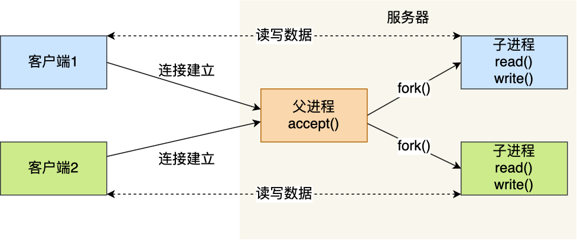

**缺点：**

- 子进程是父进程的副本，父进程的所有资源都要拷贝一份给子进程；而且当「子进程」退出时，实际上内核里还会保留子进程的一些信息，如果父进程不做好“回收”工作（ `wait()` 和 `waitpid()` ），就会变成 **僵尸进程**，随着僵尸进程越多，会慢慢耗尽我们的系统资源。
- 进程间的上下文切换耗费资源。进程的上下文切换不仅包含了虚拟内存、栈、全局变量等用户空间的资源，还包括了内核堆栈、寄存器等内核空间的资源。

这种用多个进程来应付多个客户端的方式，在应对 100 个客户端还是可行的，但是当客户端数量高达一万时，肯定扛不住的。

### b. 多线程模型

主线程负责监听客户的连接，一旦与客户端连接完成，`accept()` 函数就返回一个「已连接 Socket」，这时就通过 `pthread_create()` 函数创建线程，然后将「已连接 Socket」的文件描述符传递给线程函数，接着在线程里和客户端进行通信，从而达到并发处理的目的。

如果每来一个连接就创建一个线程，线程运行完后，操作系统还得销毁线程，虽说线程切换的上写文开销不大，但是如果 **频繁创建和销毁线程**，系统开销也是不小的。

#### - 线程池 - 避免线程的频繁创建和销毁

线程池，就是提前创建若干个线程，这样当由新连接建立时，将这个已连接的 Socket 放入到一个队列里，然后线程池里的线程负责从队列中取出「已连接 Socket 」进行处理。


这个队列是 **全局** 的，每个线程都会操作，为了避免 **多线程竞争**，线程在操作这个队列前要加 **锁**。

如果要达到 C10K，意味着要一台机器维护 1 万个连接，相当于要 **维护 1 万个进程/线程**，操作系统就算死扛也是扛不住的。

### c. I/O 多路复用 - 单进程/ 线程同时监听多个连接

把连接放入队列中，线程池中的线程依次取出队列中的连接，并处理业务，也就是说，一个线程会先后处理多个业务。当一个连接对应一个线程时，线程一般采用「read -> 业务处理 -> send」的处理流程，如果当前连接没有数据可读，那么线程会阻塞在 `read` 操作上（ socket 默认情况是阻塞 I/O），这种阻塞方式并不影响其他线程，但是引入了线程池后，线程如果遇到没有数据可读会发生阻塞，那么线程就没办法继续处理其他连接的业务。

一个解决办法是把线程负责的 socket 设置为非阻塞，工作线程一直轮询他负责的连接们，有数据再处理。这种方式虽然能够解决阻塞的问题，但是 **轮询会消耗 CPU ，而且随着一个线程处理的连接越多，轮询的效率就会越低**。

轮询的问题在于，工作线程不知道当前连接们是否有数据可读，所以要每次通过 `read` 轮询。那么，**如何才能在只有连接上有数据时，线程才向该连接发出读请求呢？—— I/O 多路复用。**

I/O 多路复用技术会用一个系统调用函数来监听我们所有关心的连接，也就说可以在一个监控线程里面监控很多的连接。

 I/O 多路复用可以使进程 **通过一个系统调用函数从内核中获取多个事件**。

#### - select

- 在用户空间维护 **文件描述符集合** `fd_set[]`，将要监听的文件描述符（已建立的连接）对应设置为 1。
- 调用 `select` 系统调用，将用户空间的 `fd_set[]` **拷贝** 到内核空间。
- 内核 **遍历**  `fd_set[]`，**对于捕捉到 I/O 操作的对应的文件描述符，仍置 1，其余置 0**。（每轮监听都要重新拷贝 `fd_set[]` 的拷贝传入到内核空间中）
- 内核将修改后的 `fd_set[]` 拷贝到用户空间。
- 可在用户空间中 **遍历** `fd_set[]`，根据是否为 1 来判断文件描述符对应的客户端是否发生了 I/O 操作。

**缺点：（两次拷贝 + 两次遍历）**

- 每次调用 `select` 都要将 `fd_set[]` 从用户空间拷贝到内核空间。
- 每次调用 `select`，内核都要遍历 `fd_set[]`。
- 每次调用 `select`后，内核都要将 `fd_set[]` 从内核空间拷贝到用户空间。
- 每次调用 `select`后，都要在用户空间中遍历 `fd_set[]` 才能找到发生 I/O 事件的连接。
- `select` 支持的 `fd_set[]` 空间有限，Linux 系统默认 1024。

```cpp
// sizeof(fd_set) = 128 1024
#include <sys/time.h>
#include <sys/types.h>
#include <unistd.h>
#include <sys/select.h>

int select(int nfds, fd_set *readfds, fd_set *writefds, fd_set *exceptfds, struct timeval *timeout);
/*
    参数：
    - nfds: 委托内核检测的最大文件描述符的值 + 1
    - readfds: 要检测的文件描述符的可读的集合，委托内核检测文件描述符的可读的属性
    	- 是一个传出参数
    - writefds: 要检测的文件描述符的写的集合，委托内核检测文件描述符的写的属性
        - 是一个传出参数
    - exceptfds : 检测发生异常的文件描述符的集合
        - 是一个传出参数
    - timeout: 设置的超时时间
        struct timeval {
            long tv_sec; 	// seconds
            long tv_usec; 	// microseconds
        };
    	- NULL: 永久阻塞，直到检测到了文件描述符有变化
        	- tv_sec = 0 && tv_usec = 0， 不阻塞
        	- tv_sec > 0 || tv_usec > 0， 阻塞对应的时间
    - 返回值:
        - -1 : 失败
        - > 0 (n) : 检测的集合中有 n 个文件描述符发生了变化
*/

// 将参数文件描述符 fd 对应的标志位设置为 0
void FD_CLR(int fd, fd_set *set);

// 判断 fd 对应的标志位是 0 还是 1， 返回值： fd 对应的标志位的值，0，返回 0， 1，返回 1
int FD_ISSET(int fd, fd_set *set);

// 将参数文件描述符 fd 对应的标志位，设置为 1
void FD_SET(int fd, fd_set *set);

// fd_set 一共有 1024 bit, 全部初始化为 0
void FD_ZERO(fd_set *set);
```


```c++
// select.c
#include <stdio.h>
#include <arpa/inet.h>
#include <sys/select.h>
#include <string.h>
#include <unistd.h>
#include <stdlib.h>     // exit

int main()
{
    // create socket
    int lfd = socket(PF_INET, SOCK_STREAM, 0);
    struct sockaddr_in saddr;
    saddr.sin_port = htons(9999);
    saddr.sin_family = AF_INET;
    saddr.sin_addr.s_addr = INADDR_ANY;

    // bind
    bind(lfd, (struct sockaddr*)&saddr, sizeof(saddr));

    // listen
    listen(lfd, 8);

    // create fd_set
    fd_set rdset, tmp;
    FD_ZERO(&rdset);
    FD_SET(lfd, &rdset); 	// 当客户端向服务端发送请求时，存在三次握手过程，所以监听 socket 存在读写行为
    int maxfd = lfd;

    while(1)
    {
        tmp = rdset; 	// 深拷贝

        // select
        int ret = select(maxfd + 1, &tmp, NULL, NULL, NULL);

        if(ret == -1)
        {
            perror("select");
            exit(-1);
        }
        else if(ret == 0)
        {
            // 若指定了阻塞的时间，则说明阻塞时间内没有请求。
            // 因为此时设置的是阻塞，所以这个条件不可能出现
            continue;
        }
        else if(ret > 0)
        {
            // 先看看有没有新的客户端请求连接
            if(FD_ISSET(lfd, &tmp))
            {
                struct sockaddr_in cliaddr;
                int len = sizeof(cliaddr);
                int cfd = accept(lfd, (struct sockaddr*)&cliaddr, &len);

                // 将新的文件描述符加入到 fd_set 中
                FD_SET(cfd, &rdset);

                // 更新最大的文件描述符
                maxfd = maxfd > cfd ? maxfd : cfd;
            }
            
            // 已经连接的客户端是否发来请求数据
            // lfd + 1: 监听到的客户端连接对应的文件描述符一定大于 lfd
            for(int i = lfd + 1; i <= maxfd; i++)
            {
                if(FD_ISSET(i, &tmp))
                {
                    // i 对应客户端发来数据
                    char buf[1024] = {0};
                    int len = read(i, buf, sizeof(buf));

                    if(len == -1)
                    {
                        perror("read");
                        exit(-1);
                    }
                    else if(len == 0)
                    {
                        // 认为客户端已断开连接
                        printf("client closed...\n");
                        close(i);
                        FD_CLR(i, &rdset);
                    }
                    else if(len > 0)
                    {
                        printf("read buf = %s\n", buf);
                        write(i, buf, strlen(buf) + 1);
                    }
                }
            }
        }
    }
    close(lfd);
    return 0;
}
```

####  - poll

poll 与 select 唯一的不同：poll 底层使用链表实现文件描述符集合，所以单个进程/线程可监听的连接不再受 **进程可打开最多文件数量** 的限制，但依旧受到系统文件描述符限制。

```c++
#include <poll.h>

struct pollfd {
    int fd; /* 委托内核检测的文件描述符 */
    short events; /* 委托内核检测文件描述符的什么事件 */
    short revents; /* 文件描述符实际发生的事件 */
};
struct pollfd myfd;
myfd.fd = 5;
myfd.events = POLLIN | POLLOUT;

int poll(struct pollfd *fds, nfds_t nfds, int timeout);
/*
  参数：
	- fds: struct pollfd 结构体链表，是存储需要检测的文件描述符的集合。
	- nfds: fds 中最后一个有效元素的下标 + 1
	- timeout: 阻塞时长
		设为 0: 不阻塞
		设为 -1: 阻塞，当检测到需要检测的文件描述符有变化，解除阻塞。
		设为 > 0: 表示阻塞的时长
	- 返回值：
		-1: 调用失败
		> 0（n）: 成功，n 表示检测到集合中有 n 个文件描述符发生变化。
*/
```


```c++
#include <stdio.h>
#include <arpa/inet.h>
#include <unistd.h>
#include <stdlib.h>
#include <string.h>
#include <poll.h>

int main()
{
    // 创建socket
    int lfd = socket(PF_INET, SOCK_STREAM, 0);
    struct sockaddr_in saddr;
    saddr.sin_port = htons(9999);
    saddr.sin_family = AF_INET;
    saddr.sin_addr.s_addr = INADDR_ANY;

    // 绑定
    bind(lfd, (struct sockaddr *)&saddr, sizeof(saddr));

    // 监听
    listen(lfd, 8);

    // 初始化检测的文件描述符数组
    struct pollfd fds[1024];
    for(int i = 0; i < 1024; i++)
    {
        fds[i].fd = -1;
        fds[i].events = POLLIN;     // 检测读事件
    }
    // 加入监听描述符
    fds[0].fd = lfd;
    int nfds = 0;

    while(1) 
    {
        // 调用poll系统函数，让内核帮检测哪些文件描述符有数据
        int ret = poll(fds, nfds + 1, -1); 	// -1，阻塞调用
        if(ret == -1) 
        {
            perror("poll");
            exit(-1);
        } 
        else if(ret == 0) 
        {
            continue;
        } 
        else if(ret > 0) 
        {
            // 说明检测到了有文件描述符的对应的缓冲区的数据发生了改变
            if(fds[0].revents & POLLIN) 
            {
                // 表示有新的客户端连接进来了
                struct sockaddr_in cliaddr;
                int len = sizeof(cliaddr);
                int cfd = accept(lfd, (struct sockaddr *)&cliaddr, &len);

                // 将新的文件描述符加入到集合中，找第一个可用的 fd[i]
                for(int i = 1; i < 1024; i++) 
                {
                    if(fds[i].fd == -1) 
                    {
                        fds[i].fd = cfd;
                        fds[i].events = POLLIN;
                        break;
                    }
                }
                // 更新最大的文件描述符的索引
                nfds = nfds > cfd ? nfds : cfd;
            }

            for(int i = 1; i <= nfds; i++) 
            {
                if(fds[i].revents & POLLIN) 
                {
                    // 说明这个文件描述符对应的客户端发来了数据
                    char buf[1024] = {0};
                    int len = read(fds[i].fd, buf, sizeof(buf));
                    if(len == -1) {
                        perror("read");
                        exit(-1);
                    } 
                    else if(len == 0) 
                    {
                        printf("client closed...\n");
                        close(fds[i].fd);
                        fds[i].fd = -1;
                    } 
                    else if(len > 0) 
                    {
                        printf("read buf = %s\n", buf);
                        write(fds[i].fd, buf, strlen(buf) + 1);
                    }
                }
            }

        }

    }
    close(lfd);
    return 0;
}
```

#### - epoll - 解决 C10K 问题的利器（C10k：单机同时处理 1 万个请求）

- 调用 `epoll_create` 在内核区创建一个 `epoll` 实例 `epfd`。
- 基于 `epoll_create` 返回的文件描述符，对内核中的 `epoll` 实例进行操作。
  - 通过 `epoll_ctl` 将需要监视的 socket 添加到 `epfd` 中。
  - 调用 `epoll_wait` 等待事件发生， `epoll_wait` 将内核中的就绪事件列表拷贝到用户空间中。

```cpp
#include <sys/epoll.h>

int epoll_create(int size);
/*
  参数：
    - size : 目前没有意义了。随便写一个数，必须大于0。
    
  返回值：
	- -1：调用失败，并设置错误号。
	- > 0：操作epoll实例的文件描述符。
	
  作用：
    - 在内核区创建一个 epoll，包括两部分数据结构：
      - 存储需要检测的文件描述符的信息（红黑树）
      - 就绪列表，存放检测到 I/O 操作的文件描述符信息（双向链表）
*/

struct epoll_event {
    uint32_t events; 	// 要检测的事件
    epoll_data_t data; 	// 要检测的文件描述符
};
/*
  常见的 Epoll 检测事件 events：
	- EPOLLIN 检测可读事件
	- EPOLLOUT 检测可写事件
	- EPOLLERR 检测发生错误
	- EPOLLONESHOT：在使用 epoll 边沿触发（ET）模式时，确保在处理完当前事件后，不再监听该文件描述符的其他事件，直到 epoll_ctl 重新设置监听。（防止多个线程同时处理同一个文件描述符上的事件）
*/

typedef union epoll_data {
    void *ptr;
    int fd;
    uint32_t u32;
    uint64_t u64;
} epoll_data_t;


int epoll_ctl(int epfd, int op, int fd, struct epoll_event *event);
/*
  参数：
    - epfd：epoll 实例对应的文件描述符
    - op：要进行什么操作
      - EPOLL_CTL_ADD: 添加
      - EPOLL_CTL_MOD: 修改
      - EPOLL_CTL_DEL: 删除，event 参数为 NULL。
    - fd：要检测的文件描述符
    - event：检测文件描述符什么事情
    
  作用：
    - 对 epoll 实例进行管理：添加、删除、修改文件描述符信息。（添加到内核中的红黑树上）
*/

int epoll_wait(int epfd, struct epoll_event *events, int maxevents, int
timeout);
/*
  参数：
	- epfd：epoll 实例对应的文件描述符
    - events：传出参数，保存检测到 I/O 事件的的文件描述符的信息的数组。（传出内核中双向链表中的信息）
    - maxevents：events 结构体数组的大小
    - timeout：阻塞时间
        - 0：不阻塞
        - -1：阻塞，直到检测到 I/O 事件，解除阻塞。
        - > 0：阻塞的时长（毫秒）
        
  返回值：
    - -1：调用失败，并设置 errno。
      - errno = EINTR：调用被信号终端，可以选择重启 epoll_wait
      - errno = EBADF：epfd 不是有效的 epoll 文件描述符
      - ...
    - > 0：返回发生变化的文件描述符的数量
        
  作用：
  	- 检测 epoll 实例中文件描述符的 I/O 事件。
*/
```


```c
#include <stdio.h>
#include <arpa/inet.h>
#include <unistd.h>
#include <stdlib.h>
#include <string.h>
#include <sys/epoll.h>

int main()
{
    // create epoll
    int lfd = socket(PF_INET, SOCK_STREAM, 0);
    struct sockaddr_in saddr;
    saddr.sin_port = htons(9999);
    saddr.sin_family = AF_INET;
    saddr.sin_addr.s_addr = INADDR_ANY;

    // bind
    bind(lfd, (struct sockaddr *)&saddr, sizeof(saddr));

    // listen
    listen(lfd, 8);

    // create epoll
    int epfd = epoll_create(2);

    struct epoll_event epev;
    epev.events = EPOLLIN;
    epev.data.fd = lfd;     // 检测监听文件描述符上的可读事件（即有新的客户端请求连接服务端）
    
    // 在 epoll 实例中添加要检测的文件描述符以及要检测的事件
    epoll_ctl(epfd, EPOLL_CTL_ADD, lfd, &epev);

    struct epoll_event epevs[1024];     // 保存 epoll_wait 检测到的事件的相关信息

    while(1)
    {
        int ret = epoll_wait(epfd, epevs, 1024, -1);   // -1 表示阻塞等待事件
        if(ret == -1)     // 调用失败
        {
            perror("epoll_wait");
            exit(-1);
        }

        // 遍历检测到的时间（epoll_wait 存储在 epevs 中了）
        for(int i = 0; i < ret; i++)
        {
            int curfd = epevs[i].data.fd;

            if(curfd == lfd)    // 有新的客户端请求连接
            {
                struct sockaddr_in cliaddr;
                int len = sizeof(cliaddr);
                int cfd = accept(lfd, (struct sockaddr*)&cliaddr, &len);    // 连接新客户端

                epev.events = EPOLLIN;
                epev.data.fd = cfd;
                epoll_ctl(epfd, EPOLL_CTL_ADD, cfd, &epev);     // 将 cfd 添加到 epoll 实例中
            }
            else
            {
                // 已连接客户端发来数据(因为只检测了 EPOLLIN 事件)
                char buf[1024] = {0};
                int len = read(curfd, buf, sizeof(buf));
                if(len == -1)
                {
                    perror("read");
                    exit(-1);
                }
                else if(len == 0)
                {
                    // 已连接的客户端断开连接，将其从 epoll 实例中删去，并关闭连接文件描述符
                    printf("client closed...\n");
                    epev.data.fd = curfd;
                    epoll_ctl(epfd, EPOLL_CTL_DEL, curfd, NULL);
                    close(curfd);
                }
                else if(len > 0)
                {
                    printf("read buf = %s\n", buf);
                    write(curfd, buf, strlen(buf) + 1);
                }
            }
        }
    }
    close(lfd);
    close(epfd);
    return 0;
}
```

##### epoll 如何解决 select/poll 的痛点

- epoll 是在内核中维护的。
  - epoll 在内核里使用 **红黑树来跟踪进程所有待检测的文件描述符** ，通过调用 `epoll_ctl()` 实现文件描述符的增删。红黑树是个高效的数据结构，增删改一般时间复杂度是 `O(logn)`。
  - select 和 poll 在内核中没有维护数据结构，所以每次调用都需要从用户空间中拷贝整个要监听的文件描述符集合，而 epoll 因为在内核维护了红黑树，可以保存所有待检测的 socket ，所以只需要传入一个待检测的 socket，减少了内核和用户空间之间大量的数据拷贝和内存分配。
- epoll 使用 **事件驱动** 的机制，在内核里 **维护了一个链表来记录就绪事件**，当某个 socket 有事件发生时，通过 **回调函数** 内核会将其加入到这个就绪事件列表中，当用户调用 `epoll_wait()` 函数时，只会返回有事件发生的文件描述符的个数，不需要像 select/poll 那样轮询扫描整个 socket 集合，大大提高了检测的效率。


##### 边缘触发和水平触发

epoll 支持 **水平触发 LT** 和 **边沿触发 ET** 两种事件触发模式。

- 水平触发：当被监控的 Socket 上有可读事件发生时，**服务器端不断地从 `epoll_wait` 中苏醒，直到内核缓冲区数据被 `read` 函数读完才结束**，目的是告诉我们有数据需要读取。
  - 如果使用水平触发模式，当内核通知文件描述符可读写时，接下来还可以继续去检测它的状态，看它是否依然可读或可写。所以在收到通知后，没必要一次执行尽可能多的读写操作。

- 边缘触发模式：当被监控的 Socket 描述符上有可读事件发生时，**服务器端只会从 `epoll_wait` 中苏醒一次**，即使进程没有调用 read 函数从内核读取数据，也依然只苏醒一次，因此程序 **要保证一次性将内核缓冲区的数据读取完**；
  - 如果使用边缘触发模式，I/O 事件发生时只会通知一次，而且我们不知道到底能读写多少数据，所以在收到通知后应尽可能地读写数据，以免错失读写的机会。因此，我们会 **循环** 从文件描述符读写数据，那么如果文件描述符是阻塞的，没有数据可读写时，进程会阻塞在读写函数那里，程序就没办法继续往下执行。所以，**边缘触发模式一般和非阻塞 I/O 搭配使用**，程序会一直执行 I/O 操作，直到系统调用（如 `read` 和 `write`）返回错误，错误类型为 `EAGAIN` 或 `EWOULDBLOCK`。

一般来说，**边缘触发的效率比水平触发的效率要高**，因为 **边缘触发可以减少 `epoll_wait` 的系统调用次数**，系统调用也是有一定的开销的的，毕竟也存在上下文的切换。

**select/poll 只有水平触发模式，epoll 默认的触发模式是水平触发，但是可以根据应用场景设置为边缘触发模式。**

#### - I/O 多路复用最好和非阻塞 I/O 一起使用

**多路复用 API 返回的事件并不一定可读写的**。例如，当数据已经到达，但经检查后发现有错误的校验和而被丢弃；也有可能在其他情况下，文件描述符被错误地报告为就绪。

如果使用阻塞 I/O， 那么在调用 `read/write` 时则会发生程序阻塞，因此最好搭配非阻塞 I/O，以便应对极少数的特殊情况。

## 3. 高性能网络模式：Reactor 和 Proactor

服务器程序通常需要处理三类事件：**I/O 事件**、**信号** 及 **定时事件**。

### a. Reactor - 同步非阻塞网络模式

**Reactor**：来了一个事件，Reactor 就有相对应的反应/响应。Reactor 模式也叫 Dispatcher 模式，即 **I/O 多路复用监听事件，收到事件后，根据事件类型分配（Dispatch）给某个进程 / 线程**。

Reactor 模式主要由 **Reactor** 和 **处理资源池** 这两个核心部分组成：

- Reactor：监听和分发事件，事件类型包含连接事件、读写事件；
- 处理资源池：处理事件，如 read -> 业务逻辑 -> send；

Reactor 模式很灵活：

- 单 Reactor 单进程 / 线程；
- 单 Reactor 多进程 / 线程；
- 多 Reactor 多进程 / 线程；

#### - 单 Reactor 单进程 / 线程（Redis）

「单 Reactor 单进程」：

- Reactor 对象监听和分发事件；Acceptor 对象获取连接；Handler 对象处理业务；

- Reactor 对象通过 select （IO 多路复用接口） 监听事件，收到事件后通过 dispatch 进行分发；
- 如果是连接建立的事件，则交由 Acceptor 对象进行处理，Acceptor 对象会通过 `accept` 方法获取连接，并创建一个 Handler 对象来处理后续的响应事件；
- 如果不是连接建立事件， 则交由 **当前连接对应的 Handler 对象** 来进行响应；
- Handler 对象通过 read -> 业务处理 -> send 的流程来完成完整的业务流程。

单 Reactor 单进程的方案因为一个连接的全部工作都在同一个进程内完成，所以不需要考虑进程间通信，也不用担心多进程竞争。


**缺点：**

- 只有一个进程，**无法充分利用 多核 CPU 的性能**；
- Handler 对象在业务处理时，整个进程是无法处理其他连接的事件的，**如果业务处理耗时比较长，那么就造成响应的延迟**；

所以，单 Reactor 单进程的方案 **不适用计算机密集型的场景，只适用于业务处理非常快速的场景**。

#### - 单 Reactor 多线程 / 多进程

「单 Reactor 多线程」：

- Reactor 对象通过 select （IO 多路复用接口） 监听事件，收到事件后通过 dispatch 进行分发；
- 如果是连接建立的事件，则交由 Acceptor 对象进行处理，Acceptor 对象会通过 `accept` 方法获取连接，并创建一个 Handler 对象来处理后续的响应事件；
- 如果不是连接建立事件， 则交由 **当前连接对应的 Handler 对象** 来进行响应；

- Handler 对象不再负责业务处理，**只负责数据的接收和发送**，Handler 对象通过 read 读取到数据后，会将数据发给子线程里的 Processor 对象进行业务处理；
- 子线程里的 Processor 对象就进行业务处理，处理完后，将结果发给主线程中的 Handler 对象，接着由 Handler 通过 send 方法将响应结果发送给 client；


**缺点：**

- 单 Reator 多线程 **能够充分利用多核 CPU **，但是既然引入多线程，就带来了 **多线程竞争资源** 的问题。例如，子线程完成业务处理后，要把结果传递给主线程的 Handler 进行发送，这里涉及共享数据的竞争。要避免多线程由于竞争共享资源而导致数据错乱的问题，就需要在操作共享资源前加上互斥锁，以保证任意时间里只有一个线程在操作共享资源，待该线程操作完释放互斥锁后，其他线程才有机会操作共享数据。
- 因为一个 Reactor 对象承担所有事件的监听和响应，而且只在主线程中运行，在面对瞬间高并发的场景时，容易成为性能的瓶颈的地方

**单 Reactor 多进程：**

单 Reactor 多进程要考虑子进程 <-> 父进程的双向通信，并且父进程还得知道子进程要将数据发送给哪个客户端。而多线程间可以共享数据，虽然要额外考虑并发问题，但是这远比进程间通信的复杂度低得多，因此实际应用中看不到单 Reactor 多进程的模式。

#### - 多 Reactor 多进程 / 线程

「多 Reactor 多进程 / 线程」：

- 主线程中的 MainReactor 对象通过 select 监控连接建立事件，收到事件后通过 Acceptor 对象中的 accept 获取连接，将新的连接分配给某个子线程；
- 子线程中的 SubReactor 对象将 MainReactor 对象分配的连接 **加入 select 继续进行监听**，并创建一个 Handler 用于处理连接的响应事件。
- 如果有新的事件发生时，SubReactor 对象会调用当前连接对应的 Handler 对象来进行响应。
- Handler 对象通过 read -> 业务处理 -> send 的流程来完成完整的业务流程。


**优点：**

- 主线程和子线程分工明确，主线程只负责接收新连接，子线程负责完成后续的业务处理。
- 主线程和子线程的交互很简单，主线程只需要把新连接传给子线程，**子线程无须返回数据**，直接就可以在子线程将处理结果发送给客户端。

大名鼎鼎的两个开源软件 Netty 和 Memcache 都采用了「多 Reactor 多线程」的方案。

采用了「多 Reactor 多进程」方案的开源软件是 Nginx，不过方案与标准的多 Reactor 多进程有些差异。

------

### b. Proactor - 异步网络模式

#### - 同步

##### 阻塞 I/O

当用户程序执行 `read` ，线程会被阻塞，一直等到 **内核准备好数据**，并 **把数据从内核缓冲区拷贝到应用程序的缓冲区** 中，拷贝过程完成，`read` 才会返回。

阻塞等待的是**「内核数据准备好」**和**「数据从内核态拷贝到用户态」**这两个过程。过程如下图：


##### 非阻塞 I/O

非阻塞的 read 请求在数据未准备好的情况下立即返回，可以继续往下执行，此时应用程序不断轮询内核，直到数据准备好，内核将数据拷贝到应用程序缓冲区，`read` 调用才可以获取到结果：


 **最后一次 read 调用，获取数据的过程，是一个同步的过程，需要等待**。这里的同步指的是内核态的数据拷贝到用户程序的缓存区这个过程。

因此，无论 read 和 send 是阻塞 I/O，还是非阻塞 I/O 都是同步调用。因为在 read 调用时，内核将数据从内核空间拷贝到用户空间的过程都是需要等待的，也就是说这个过程是同步的，如果内核实现的拷贝效率不高，read 调用就会在这个同步过程中等待比较长的时间。

#### - 异步

**异步 I/O** ：「内核数据准备好」和「数据从内核态拷贝到用户态」这 **两个过程都不用等待**。

发起 `aio_read` （异步 I/O） 之后，立即返回，内核自动将数据从内核空间拷贝到用户空间，这个拷贝过程同样是异步的，内核自动完成的，和前面的同步操作不一样，**应用程序并不需要主动发起拷贝动作**。过程如下图：


很明显，**异步 I/O 比同步 I/O 性能更好**，因为异步 I/O 在「内核数据准备好」和「数据从内核空间拷贝到用户空间」这两个过程都不用等待。

Proactor 正是采用了异步 I/O 技术，所以被称为异步网络模型。

#### - Proactor

Proactor 模式:

- Proactor Initiator 负责创建 Proactor 和 Handler 对象，并将 Proactor 和 Handler 都通过 Asynchronous Operation Processor 注册到内核；
- Asynchronous Operation Processor 负责处理注册请求，并处理 I/O 操作；
- Asynchronous Operation Processor 完成 I/O 操作后通知 Proactor；
- Proactor 根据不同的事件类型回调不同的 Handler 进行业务处理；
- Handler 完成业务处理；


可惜的是，在 Linux 下的异步 I/O 是不完善的， `aio` 系列函数是由 POSIX 定义的异步操作接口，不是真正的操作系统级别支持的，而是在用户空间模拟出来的异步，并且仅仅支持基于本地文件的 aio 异步操作，网络编程中的 socket 是不支持的，这也使得 **基于 Linux 的高性能网络程序都是使用 Reactor 方案**。

而 Windows 里实现了一套完整的支持 socket 的异步编程接口，这套接口就是 `IOCP`，是由操作系统级别实现的异步 I/O，真正意义上异步 I/O，因此在 Windows 里实现高性能网络程序可以使用效率更高的 Proactor 方案。

### c. Reactor 和 Proactor 的区别

- **Reactor** 是 **同步非阻塞** 网络模式，感知的是 **就绪可读写事件**。在每次感知到有事件发生（比如可读就绪事件）后，就 **需要应用进程主动调用 read 方法来完成数据的读取**，也就是要应用进程主动将 socket 接收缓存中的数据读到应用进程内存中，这个过程是同步的，读取完数据后应用进程才能处理数据。
- **Proactor** 是 **异步** 网络模式， 感知的是 **已完成的读写事件**。在发起异步读写请求时，**需要传入数据缓冲区的地址（用来存放结果数据）等信息**，这样内核才可以自动帮我们把数据的读写工作完成，这里的读写工作全程由操作系统来做，并不需要像 Reactor 那样还需要应用进程主动发起 read/write 来读写数据，**操作系统完成读写工作后，就会通知应用进程直接处理数据**。

因此，**Reactor** 可以理解为**「来了事件操作系统通知应用进程，让应用进程来处理」**，而 **Proactor** 可以理解为**「来了事件操作系统来处理，处理完再通知应用进程」**。这里的「事件」就是有新连接、有数据可读、有数据可写的。这些 I/O 事件这里的「处理」包含从驱动读取到内核以及从内核读取到用户空间。。

无论是 Reactor，还是 Proactor，都是一种基于**「事件分发」**的网络编程模式，区别在于 **Reactor 模式** 是基于**「待完成」的 I/O 事件**，而 **Proactor** 模式则是基于**「已完成」的 I/O 事件**。

## 4. ==一致性哈希==

