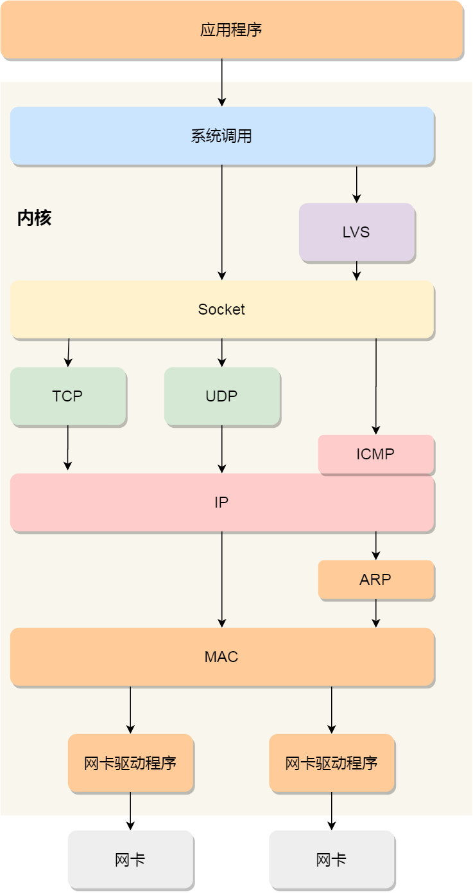
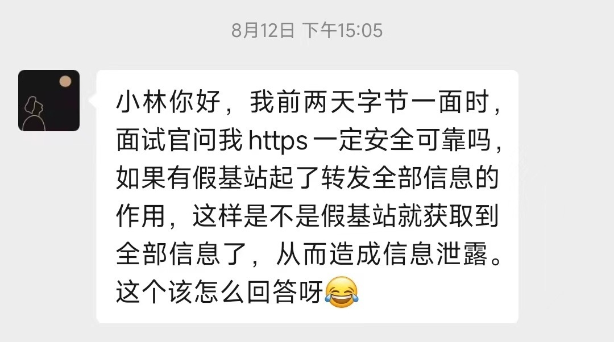
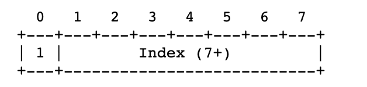
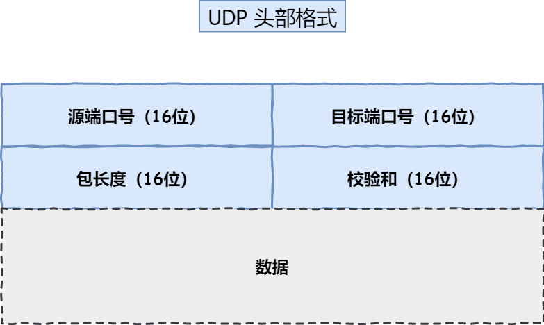
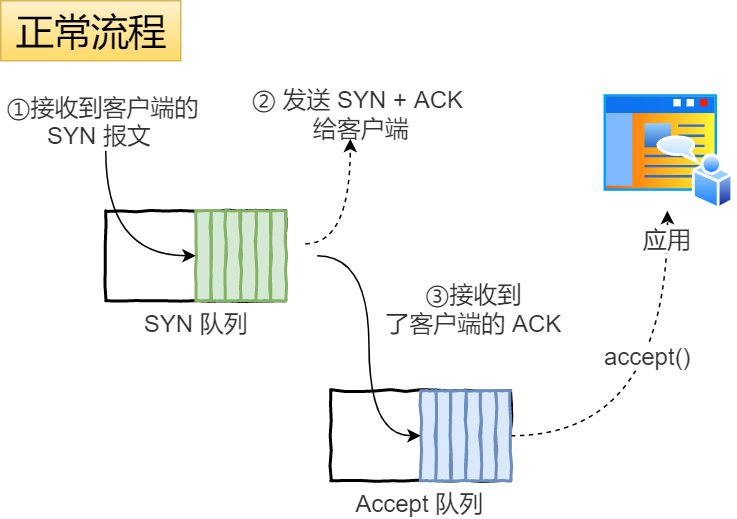
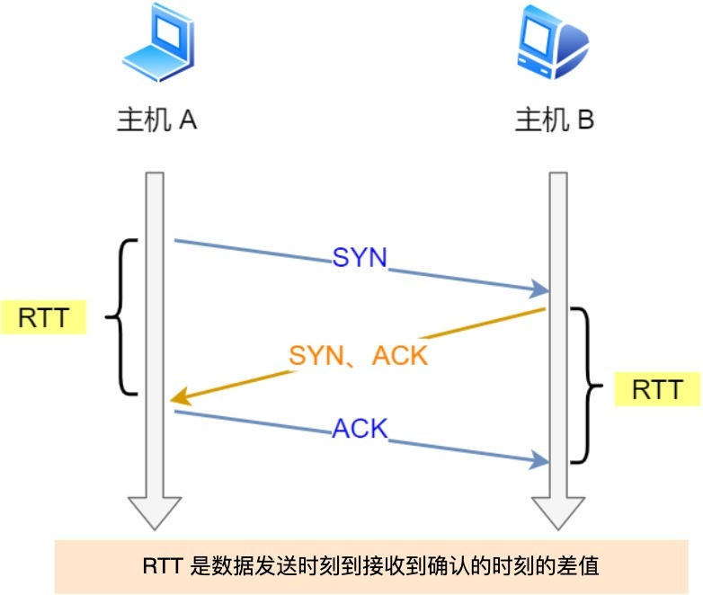
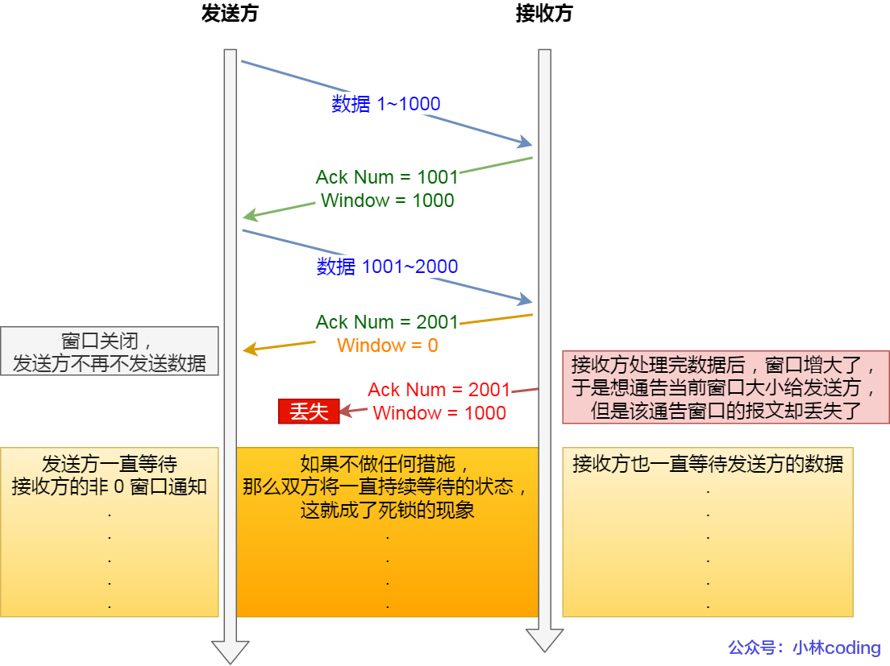
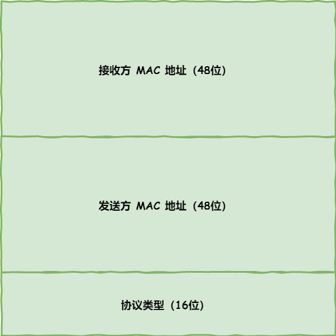

[TOC]


# 基础

### 1. TCP/IP 网络模型

      

**应用层**（消息/报文）：只专注于应用程序之间的数据解析，比如 **HTTP、FTP、DNS**。应用层是工作在用户态的，传输层及以下工作在内核态。

**传输层**（段）：只在通信双方节点（进程和进程间的）上传输，而不在路由器上处理。主要的传输协议：**TCP 和 UDP**。接收不同应用程序的数据包，**端口号区分应用程序，或者说，进程**。在 TCP 中，为保证可靠传输，会对传输失败的数据进行重传，为了防止重传很大的数据包（大小超过 **MSS（TCP 最大报文段长度）**），会将传输层的消息/报文分段成 **TCP 段**，再进行传输。

**网络层**（包）：实际的传输，包括 **寻址和路由选择**（实际传输路径规划）。最常使用 **IP 协议**，IP 协议会将传输层的报文作为数据部分，加上 IP 头组装成 IP 报文，如果 IP 报文大小超过 **MTU**（以太网中一般为 1500 字节）就会 **再次分片**，得到一个即将发送到网络的 IP 报文。**IP 协议不是一个可靠的协议。**

**网络接口层**（帧）：为网络层提供「链路级别」传输的服务，负责在以太网这样的底层网络上发送原始数据包，使用 **MAC 地址** 来标识网络上的设备。将网络层的数据封装帧头和帧尾（封装成帧），帧头中包括源 MAC 地址和目的 MAC 地址，然后在不同的 MAC 地址间传输数据。


- 应用层，负责向用户提供一组应用程序，比如 HTTP、DNS、FTP 等;
- 传输层，负责端到端的通信，比如 TCP、UDP 等；
- 网络层，负责网络包的封装、分片、路由、转发，比如 IP、ICMP 等；
- 网络接口层，负责网络包在物理网络中的传输，比如网络包的封帧、 MAC 寻址、差错检测，以及通过网卡传输网络帧等；

### 2. 键入网址到网页显示，期间发生了什么？


1. 解析 URL，生成 HTTP 请求报文
2. 查询 Web 服务器的 IP 地址
3. 委托操作系统中的协议栈打包报文并发送
4. 出网卡
5. 到交换机
6. 到路由器
7. 

#### - 解析 URL


若数据源的路径名为空，则访问根目录下事先设置的默认文件，即，`/index.html` 或者 `/default.html`。

#### - 根据 URL 的解析信息，生成 HTTP 请求信息


#### - 查询 Web 服务器域名对应的 IP 地址（DNS 查询）

DNS 保存了 Web 服务器域名和 IP 的对应关系。

域名的层级关系类似一个树状结构：（自右向左，最右省略了一个 `'.'`）

- 根 DNS 服务器（.）（跟域的 DNS 服务器信息保存在互联网中所有的 DNS 服务器中）
- 顶级域 DNS 服务器（.com）
- 权威 DNS 服务器（server.com）


客户端只要能够找到任意一台 DNS 服务器，就可以通过它找到根域 DNS 服务器，然后再一路顺藤摸瓜找到位于下层的某台目标 DNS 服务器。

##### 域名解析的工作流程

1. 浏览器会先看自身有没有对这个域名的缓存，如果有，就直接返回，如果没有，就去问操作系统，操作系统也会去看自己的缓存，如果有，就直接返回，如果没有，再去 hosts 文件看，也没有，才会去问「本地 DNS 服务器」。
2. 客户端首先会发出一个 DNS 请求，问 www.server.com 的 IP 是啥，并发给本地 DNS 服务器（也就是客户端的 TCP/IP 设置中填写的 DNS 服务器地址）。
3. 本地域名服务器收到客户端的请求后，如果缓存里的表格能找到 www.server.com，则它直接返回 IP 地址。如果没有，本地 DNS 会去问它的 **根域名服务器**：“老大， 能告诉我 www.server.com 的 IP 地址吗？” 根域名服务器是最高层次的，它不直接用于域名解析，但能指明一条道路。
4. 根 DNS 收到来自本地 DNS 的请求后，发现后置是 .com，说：“www.server.com 这个域名归 .com 区域管理”，我给你 **.com 顶级域名服务器地址** 给你，你去问问它吧。”
5. 本地 DNS 收到顶级域名服务器的地址后，发起请求问“老二， 你能告诉我 www.server.com 的 IP 地址吗？”
6. 顶级域名服务器说：“我给你负责 www.server.com 区域的权威 DNS 服务器的地址，你去问它应该能问到”。
7. 本地 DNS 于是转向问权威 DNS 服务器：“老三，www.server.com对应的IP是啥呀？” server.com 的权威 DNS 服务器，它是域名解析结果的原出处。
8. 权威 DNS 服务器查询后将对应的 IP 地址 X.X.X.X 告诉本地 DNS。
9. 本地 DNS 再将 IP 地址返回客户端，客户端和目标建立连接。


#### - 委托操作系统（协议栈）将生成的 HTTP 消息发送给 Web 服务器（封装）

通过 DNS 获取到 IP 后，就可以把 HTTP 的传输工作交给操作系统中的**协议栈**（TCP/UDP + IP）。


应用程序（浏览器）通过调用 Socket 库，来委托协议栈工作。协议栈的上半部分有两块，分别是负责收发数据的 TCP 和 UDP 协议，这两个传输协议会接受应用层的委托执行收发数据的操作。

协议栈的下面一半是用 IP 协议控制网络包收发操作，在互联网上传数据时，数据会被切分成一块块的网络包，而将网络包发送给对方的操作就是由 IP 负责的。

IP 中还包括 `ICMP` 协议和 `ARP` 协议。

- `ICMP` 用于告知网络包传送过程中产生的错误以及各种控制信息。
- `ARP` 用于根据 IP 地址查询相应的以太网 MAC 地址。

IP 下面的网卡驱动程序负责控制网卡硬件，而最下面的网卡则负责完成实际的收发操作，也就是对网线中的信号执行发送和接收操作。

#### - 网卡驱动程序和网卡

协议栈将报文封装成完整的帧（二进制信息）后，还需要借助网卡将数字信息转换为电信号，才能在物理网线上传输。网卡驱动程序控制网卡。

网卡驱动获取网络包之后，会将其 **复制** 到网卡内的缓存区中，接着会在其 **开头加上报头和起始帧分界符**，**在末尾加上用于检测错误的帧校验序列**。


- 起始帧分界符是一个用来表示包起始位置的标记
- 末尾的 `FCS`（帧校验序列）用来检查包传输过程是否有损坏

最后网卡会将包转为电信号，通过网线发送出去。

### - 交换机（离开子网）

交换机的设计是将网络包 **原样** 转发到目的地。交换机工作在 MAC 层，也称为 **二层网络设备**。

#### 交换机的包接收

- 首先，电信号到达网线接口，交换机里的模块进行接收，接下来交换机里的模块将电信号转换为数字信号。

- 然后通过包末尾的 `FCS` 校验错误，如果没问题则放到缓冲区。

- 交换机不核对 MAC 地址，直接接收所有的包并存放到缓冲区中。因此，和网卡不同，**交换机的端口不具有 MAC 地址**。计算机的网卡本身具有 MAC 地址，并通过核对收到的包的接收方 MAC 地址判断是不是发给自己的，如果不是发给自己的则丢弃。

- 交换机查询 MAC 地址表，查找要转发到哪个端口（根据接收方的 MAC 地址）

  - 交换机的 MAC 地址表主要包含两个信息：

    - 设备的 MAC 地址，

    - 该设备连接在交换机的哪个端口上。

  

- 若 MAC 地址表中差找不到该接收方的 MAC 地址，交换机无法判断应该把包转发到哪个端口，只能将包**转发到除了源端口之外的所有端口上**，无论该设备连接在哪个端口上都能收到这个包。

  - 安全问题：以太网设计只有接收方才能获取发送给它的包，其他设备自动忽略，所以这不会导致安全问题。
  - 网络堵塞：只有不在 MAC 地址表中的包才会进行这个操作，只要返回了响应包，交换机就可以将它的地址写入 MAC 地址表

- 此外，如果接收方 MAC 地址是一个 **广播地址**，那么交换机会将包发送到除源端口之外的所有端口。

  - 以下两个属于广播地址：

    - MAC 地址中的 `FF:FF:FF:FF:FF:FF`

    - IP 地址中的 `255.255.255.255`

- 在发送数据包时，如果目标主机不是本地局域网，填入的MAC地址是路由器，也就是把数据包转发给路由器，路由器一直转发下一个路由器，直到转发到目标主机的路由器，发现 IP 地址是自己局域网内的主机，就会 arp 请求获取目标主机的 MAC 地址，从而转发到这个服务器主机。

### - 路由器

#### 路由器和交换机的区别

- 因为 **路由器** 是基于 IP 设计的，俗称 **三层** 网络设备，路由器的各个端口都具有 MAC 地址和 IP 地址；
- 而 **交换机** 是基于以太网设计的，俗称 **二层** 网络设备，交换机的端口不具有 MAC 地址。

#### 路由器

- 路由器的每个端口都有它的 IP 地址和 MAC 地址，路由器的端口和网卡的性质是一样的。

#### 路由器的包接收

- 首先，电信号到达网线接口部分，路由器中的模块会将电信号转成数字信号，然后通过包末尾的 `FCS` 进行错误校验。

- 如果没问题则检查 MAC 头部中的 **接收方 MAC 地址**，看看是不是发给自己的包，如果是就放到接收缓冲区中，否则就丢弃这个包。

- 完成包接收操作之后，路由器就会 **去掉** 包开头的 MAC 头部。因为 **MAC 头部的作用就是将包送达路由器，其中的接收方 MAC 地址就是路由器端口的 MAC 地址**。

- 然后，路由器会根据 MAC 头部后方的 `IP` 头部中的内容进行包的转发操作。路由器根据 **目标 IP 地址** 查找 **路由表**，判断该转发到哪个端口。

  - 具体的工作流程：

    

    假设地址为 `10.10.1.101` 的计算机要向地址为 `192.168.1.100` 的服务器发送一个包，这个包先到达图中的路由器。

    判断转发目标的第一步，就是根据包的接收方 IP 地址查询路由表中的目标地址栏，以找到相匹配的记录。

    路由匹配和前面讲的一样，每个条目的子网掩码和 `192.168.1.100` IP 做 **& 与运算**后，得到的结果与对应条目的目标地址进行匹配，如果匹配就会作为候选转发目标，如果不匹配就继续与下个条目进行路由匹配。

    如第二条目的子网掩码 `255.255.255.0` 与 `192.168.1.100` IP 做 **& 与运算**后，得到结果是 `192.168.1.0` ，这与第二条目的目标地址 `192.168.1.0` 匹配，该第二条目记录就会被作为转发目标。

    实在找不到匹配路由时，就会选择**默认路由**，路由表中子网掩码为 `0.0.0.0` 的记录表示「默认路由」。


#### 路由器的包发送

- 首先，我们需要根据 **路由表的网关列** 判断对方的地址。

  - 如果网关是一个 IP 地址，则这个IP 地址就是我们要转发到的目标地址，**还未抵达终点**，还需继续需要路由器转发。

  - 如果网关为空，则 IP 头部中的接收方 IP 地址就是要转发到的目标地址，也是就终于找到 IP 包头里的目标地址了，说明 **已抵达终点**。

- 知道对方的 IP 地址之后，接下来需要通过 `ARP` 协议根据 IP 地址查询 MAC 地址，并将查询的结果作为接收方 MAC 地址。

  - 路由器也有 ARP 缓存，因此首先会在 ARP 缓存中查询，如果找不到则发送 ARP 查询请求。

  - 接下来是发送方 MAC 地址字段，这里填写输出端口的 MAC 地址。还有一个以太类型字段，填写 `0800` （十六进制）表示 IP 协议。

- 网络包完成后，接下来会将其转换成电信号并通过端口发送出去。这一步的工作过程和计算机也是相同的。

- 发送出去的网络包会通过 **交换机** 到达下一个路由器。由于接收方 MAC 地址就是下一个路由器的地址，所以交换机会根据这一地址将包传输到下一个路由器。

- 接下来，下一个路由器会将包转发给再下一个路由器，经过层层转发之后，网络包就到达了最终的目的地。

**在网络包传输的过程中，源 IP 和目标 IP 始终是不会变的，一直变化的是 MAC 地址，因为需要 MAC 地址在以太网内进行两个设备之间的包传输。**

#### - 目标设备对数据包的分发


数据包抵达服务器后，服务器会先扒开数据包的 MAC 头部，查看是否和服务器自己的 MAC 地址符合，符合就将包收起来。

接着继续扒开数据包的 IP 头，发现 IP 地址符合，根据 IP 头中协议项，知道自己上层是 TCP 协议。

于是，扒开 TCP 的头，里面有序列号，需要看一看这个序列包是不是我想要的，如果是就放入缓存中然后返回一个 ACK，如果不是就丢弃。TCP头部里面还有端口号， HTTP 的服务器正在监听这个端口号。

于是，服务器自然就知道是 HTTP 进程想要这个包，于是就将包发给 HTTP 进程。

服务器的 HTTP 进程看到，原来这个请求是要访问一个页面，于是就把这个网页封装在 HTTP 响应报文里。

HTTP 响应报文也需要穿上 TCP、IP、MAC 头部，不过这次是源地址是服务器 IP 地址，目的地址是客户端 IP 地址。

穿好头部衣服后，从网卡出去，交由交换机转发到出城的路由器，路由器就把响应数据包发到了下一个路由器，就这样跳啊跳。

最后跳到了客户端的城门把守的路由器，路由器扒开 IP 头部发现是要找城内的人，于是又把包发给了城内的交换机，再由交换机转发到客户端。

客户端收到了服务器的响应数据包后，同样也非常的高兴，客户能拆快递了！

于是，客户端开始扒皮，把收到的数据包的皮扒剩 HTTP 响应报文后，交给浏览器去渲染页面，一份特别的数据包快递，就这样显示出来了！

最后，客户端要离开了，向服务器发起了 TCP 四次挥手，至此双方的连接就断开了。

## 3. Linux 系统如何收发网络包

#### - Linux 网络协议栈



- 应用程序需要通过系统调用，来跟 Socket 层进行数据交互；
- Socket 层的下面就是传输层、网络层和网络接口层；
- 最下面的一层，则是网卡驱动程序和硬件网卡设备；

## ==Linux 接收网络包的流程==

网卡是计算机里的一个硬件，专门负责接收和发送网络包，当网卡接收到一个网络包后，会通过 DMA 技术，将网络包写入到指定的内存地址，也就是写入到 Ring Buffer ，这个是一个环形缓冲区，接着就会告诉操作系统这个网络包已经到达。

> 那应该怎么告诉操作系统这个网络包已经到达了呢？

最简单的一种方式就是触发中断，也就是每当网卡收到一个网络包，就触发一个中断告诉操作系统。

但是，这存在一个问题，在高性能网络场景下，网络包的数量会非常多，那么就会触发非常多的中断，要知道当 CPU 收到了中断，就会停下手里的事情，而去处理这些网络包，处理完毕后，才会回去继续其他事情，那么频繁地触发中断，则会导致 CPU 一直没完没了的处理中断，而导致其他任务可能无法继续前进，从而影响系统的整体效率。

所以为了解决频繁中断带来的性能开销，Linux 内核在 2.6 版本中引入了 **NAPI 机制**，它是混合「中断和轮询」的方式来接收网络包，它的核心概念就是**不采用中断的方式读取数据**，而是首先采用中断唤醒数据接收的服务程序，然后 `poll` 的方法来轮询数据。

因此，当有网络包到达时，会通过 DMA 技术，将网络包写入到指定的内存地址，接着网卡向 CPU 发起硬件中断，当 CPU 收到硬件中断请求后，根据中断表，调用已经注册的中断处理函数。

硬件中断处理函数会做如下的事情：

- 需要先「暂时屏蔽中断」，表示已经知道内存中有数据了，告诉网卡下次再收到数据包直接写内存就可以了，不要再通知 CPU 了，这样可以提高效率，避免 CPU 不停的被中断。
- 接着，发起「软中断」，然后恢复刚才屏蔽的中断。

至此，硬件中断处理函数的工作就已经完成。

硬件中断处理函数做的事情很少，主要耗时的工作都交给软中断处理函数了。

> 软中断的处理

内核中的 ksoftirqd 线程专门负责软中断的处理，当 ksoftirqd 内核线程收到软中断后，就会来轮询处理数据。

ksoftirqd 线程会从 Ring Buffer 中获取一个数据帧，用 sk_buff 表示，从而可以作为一个网络包交给网络协议栈进行逐层处理。

> 网络协议栈

首先，会先进入到网络接口层，在这一层会检查报文的合法性，如果不合法则丢弃，合法则会找出该网络包的上层协议的类型，比如是 IPv4，还是 IPv6，接着再去掉帧头和帧尾，然后交给网络层。

到了网络层，则取出 IP 包，判断网络包下一步的走向，比如是交给上层处理还是转发出去。当确认这个网络包要发送给本机后，就会从 IP 头里看看上一层协议的类型是 TCP 还是 UDP，接着去掉 IP 头，然后交给传输层。

传输层取出 TCP 头或 UDP 头，根据四元组「源 IP、源端口、目的 IP、目的端口」 作为标识，找出对应的 Socket，并把数据放到 Socket 的接收缓冲区。

最后，应用层程序调用 Socket 接口，将内核的 Socket 接收缓冲区的数据「拷贝」到应用层的缓冲区，然后唤醒用户进程。

至此，一个网络包的接收过程就已经结束了，你也可以从下图左边部分看到网络包接收的流程，右边部分刚好反过来，它是网络包发送的流程。


## ==[#](https://xiaolincoding.com/network/1_base/how_os_deal_network_package.html#linux-发送网络包的流程)Linux 发送网络包的流程==

如上图的右半部分，发送网络包的流程正好和接收流程相反。

首先，应用程序会调用 Socket 发送数据包的接口，由于这个是系统调用，所以会从用户态陷入到内核态中的 Socket 层，内核会申请一个内核态的 sk_buff 内存，**将用户待发送的数据拷贝到 sk_buff 内存，并将其加入到发送缓冲区**。

接下来，网络协议栈从 Socket 发送缓冲区中取出 sk_buff，并按照 TCP/IP 协议栈从上到下逐层处理。

如果使用的是 TCP 传输协议发送数据，那么**先拷贝一个新的 sk_buff 副本** ，这是因为 sk_buff 后续在调用网络层，最后到达网卡发送完成的时候，这个 sk_buff 会被释放掉。而 TCP 协议是支持丢失重传的，在收到对方的 ACK 之前，这个 sk_buff 不能被删除。所以内核的做法就是每次调用网卡发送的时候，实际上传递出去的是 sk_buff 的一个拷贝，等收到 ACK 再真正删除。

接着，对 sk_buff 填充 TCP 头。这里提一下，sk_buff 可以表示各个层的数据包，在应用层数据包叫 data，在 TCP 层我们称为 segment，在 IP 层我们叫 packet，在数据链路层称为 frame。

你可能会好奇，为什么全部数据包只用一个结构体来描述呢？协议栈采用的是分层结构，上层向下层传递数据时需要增加包头，下层向上层数据时又需要去掉包头，如果每一层都用一个结构体，那在层之间传递数据的时候，就要发生多次拷贝，这将大大降低 CPU 效率。

于是，为了在层级之间传递数据时，不发生拷贝，只用 sk_buff 一个结构体来描述所有的网络包，那它是如何做到的呢？是通过调整 sk_buff 中 `data` 的指针，比如：

- 当接收报文时，从网卡驱动开始，通过协议栈层层往上传送数据报，通过增加 skb->data 的值，来逐步剥离协议首部。
- 当要发送报文时，创建 sk_buff 结构体，数据缓存区的头部预留足够的空间，用来填充各层首部，在经过各下层协议时，通过减少 skb->data 的值来增加协议首部。

你可以从下面这张图看到，当发送报文时，data 指针的移动过程。


至此，传输层的工作也就都完成了。

然后交给网络层，在网络层里会做这些工作：选取路由（确认下一跳的 IP）、填充 IP 头、netfilter 过滤、对超过 MTU 大小的数据包进行分片。处理完这些工作后会交给网络接口层处理。

网络接口层会通过 ARP 协议获得下一跳的 MAC 地址，然后对 sk_buff 填充帧头和帧尾，接着将 sk_buff 放到网卡的发送队列中。

这一些工作准备好后，会触发「软中断」告诉网卡驱动程序，这里有新的网络包需要发送，驱动程序会从发送队列中读取 sk_buff，将这个 sk_buff 挂到 RingBuffer 中，接着将 sk_buff 数据映射到网卡可访问的内存 DMA 区域，最后触发真实的发送。

当数据发送完成以后，其实工作并没有结束，因为内存还没有清理。当发送完成的时候，网卡设备会触发一个硬中断来释放内存，主要是释放 sk_buff 内存和清理 RingBuffer 内存。

最后，当收到这个 TCP 报文的 ACK 应答时，传输层就会释放原始的 sk_buff 。

> 发送网络数据的时候，涉及几次内存拷贝操作？

第一次，调用发送数据的系统调用的时候，内核会申请一个内核态的 sk_buff 内存，将用户待发送的数据拷贝到 sk_buff 内存，并将其加入到发送缓冲区。

第二次，在使用 TCP 传输协议的情况下，从传输层进入网络层的时候，每一个 sk_buff 都会被克隆一个新的副本出来。副本 sk_buff 会被送往网络层，等它发送完的时候就会释放掉，然后原始的 sk_buff 还保留在传输层，目的是为了实现 TCP 的可靠传输，等收到这个数据包的 ACK 时，才会释放原始的 sk_buff 。

第三次，当 IP 层发现 sk_buff 大于 MTU 时才需要进行。会再申请额外的 sk_buff，并将原来的 sk_buff 拷贝为多个小的 sk_buff。

### 3. TCP 和 UDP 和 HTTP，它们之间的区别是什么？（阿里）

# HTTP

## 1. HTTP 

HTTP，**H**yperText **T**ransfer **P**rotocol，超文本传输协议，是一个在计算机世界里专门在**「两点」**之间「传输」文字、图片、音频、视频等**「超文本」**数据的「约定和规范」。

### a. HTTP 常见的状态码


- `1xx` 类状态码属于 **提示信息**，是协议处理中的一种中间状态，实际用到的比较少。

- `2xx` 类状态码表示服务器 **成功** 处理了客户端的请求。

  - 「**200 OK**」是最常见的成功状态码，表示一切正常。==如果是非 `HEAD` 请求，服务器返回的响应头都会有 body 数据。==

  - 「**204 No Content**」也是常见的成功状态码，与 200 OK 基本相同，==但响应头没有 body 数据==。

  - 「**206 Partial Content**」是应用于 HTTP **分块下载** 或 **断点续传**，表示响应返回的 body 数据并不是资源的全部，而是其中的一部分，也是服务器处理成功的状态。

- `3xx` 类状态码表示客户端请求的资源发生了变动，需要客户端用新的 URL 重新发送请求获取资源，也就是 **重定向**。

  - 「**301 Moved Permanently**」表示 **永久重定向**，说明请求的资源已经不存在了，需改用新的 URL 再次访问。

  - 「**302 Found**」表示 **临时重定向**，说明请求的资源还在，但暂时需要用另一个 URL 来访问。
  - 301 和 302 都会在响应头里使用字段 `Location`，指明后续要跳转的 URL，**浏览器会自动重定向新的 URL**。

  - 「**304 Not Modified**」不具有跳转的含义，表示资源未修改，重定向已存在的缓冲文件，也称 **缓存重定向**，也就是告诉客户端可以继续使用缓存资源，用于缓存控制。


- `4xx` 类状态码表示客户端发送的 **报文有误**，服务器无法处理，也就是错误码的含义。

  - 「**400 Bad Request**」表示客户端请求的报文有错误，但只是个笼统的错误。

  - 「**403 Forbidden**」表示服务器禁止访问资源，并不是客户端的请求出错。

  - 「**404 Not Found**」表示请求的资源在服务器上不存在或未找到，所以无法提供给客户端。


- `5xx` 类状态码表示客户端请求报文正确，但是 **服务器处理时内部发生了错误**，属于服务器端的错误码。

  - 「**500 Internal Server Error**」与 400 类型，是个笼统通用的错误码，服务器发生了什么错误，我们并不知道。

  - 「**501 Not Implemented**」表示客户端请求的功能还不支持。

  - 「**502 Bad Gateway**」通常是服务器作为网关或代理时返回的错误码，表示服务器自身工作正常，访问后端服务器发生了错误。

  - 「**503 Service Unavailable**」表示服务器当前很忙，暂时无法响应客户端。


### b. HTTP 常见字段

- *Host* 字段：客户端发送请求时，用来指定服务器域名。

- *Content-Length 字段*：服务器在返回数据时，表明本次回应的数据长度。（HTTP 协议通过设置回车符、换行符作为 **HTTP header** 的边界，通过 Content-Length 字段作为 **HTTP body** 的边界，这两个方式都是为了 **解决 TCP 的粘包问题**。）
- *Connection 字段*：最常用于客户端要求服务器使用「HTTP 长连接」机制，以便其他请求复用。
  - HTTP 长连接：只要任意一端没有明确提出断开连接，则保持 TCP 连接状态。HTTP/1.1 版本默认长连接，但为了兼容老版本的 HTTP，需要指定 `Connection` 首部字段的值为 `Keep-Alive`
- *Content-Type 字段*：服务器回应时，告诉客户端数据的格式。客户端请求的时候，可以使用 `Accept` 字段声明自己可以接受哪些数据格式。
- *Content-Encoding 字段*：说明数据的压缩方法。表示服务器返回的数据使用了什么压缩格式。客户端在请求时，用 `Accept-Encoding` 字段说明自己可以接受哪些压缩方法。

### c. GET 和 POST

#### - GET 和 POST 有什么区别？

**GET 指从服务器获取指定的资源**，这个资源可以是静态的文本、页面、图片视频等。

- GET 请求的参数位置一般写在 URL 中
- URL 规定只能支持 ASCII，所以 GET 请求的参数只允许 ASCII 字符 
- 浏览器会对 URL 的长度有限制（HTTP协议本身对 URL长度并没有做任何规定）。

比如，你打开我的文章，浏览器就会发送 GET 请求给服务器，服务器就会返回文章的所有文字及资源。


**POST 指根据请求负荷（报文body）对指定的资源做出处理**，具体的处理方式视资源类型而不同。

- POST 请求携带数据的位置一般是写在报文 body 中
- body 中的数据可以是任意格式的数据，只要客户端与服务端协商好即可
- 而且浏览器不会对 body 大小做限制

比如，你在我文章底部，敲入了留言后点击「提交」（**暗示你们留言**），浏览器就会执行一次 POST 请求，把你的留言文字放进了报文 body 里，然后拼接好 POST 请求头，通过 TCP 协议发送给服务器。


#### - GET 和 POST 方法都是安全和幂等的吗？

**安全**：请求方法不会「破坏」服务器上的资源。

**幂等**：多次执行相同的操作，结果都是「相同」的。

如果从 RFC 规范定义的语义来看：

- **GET 方法就是安全且幂等的**，因为它是「只读」操作，无论操作多少次，服务器上的数据都是安全的，且每次的结果都是相同的。所以，可以对 GET 请求的数据做 **缓存**，这个缓存可以做到浏览器本身上（彻底避免浏览器发请求），也可以做到代理上（如nginx），而且在浏览器中 GET 请求可以保存为书签。
- **POST** 因为是「新增或提交数据」的操作，会修改服务器上的资源，所以是 **不安全** 的，且多次提交数据就会创建多个资源，所以 **不是幂等** 的。所以，**浏览器一般不会缓存 POST 请求，也不能把 POST 请求保存为书签**。

但是实际过程中，开发者不一定会按照 RFC 规范定义的语义来实现 GET 和 POST 方法。比如：

- 可以用 GET 方法实现新增或删除数据的请求，这样实现的 GET 方法自然就不是安全和幂等。
- 可以用 POST 方法实现查询数据的请求，这样实现的 POST 方法自然就是安全和幂等。

## 2. HTTP 缓存技术

对于一些重复的 HTTP 请求，比如每次请求得到的数据都一样的，我们可以把这对「请求-响应」的数据 **缓存在本地**，那么下次请求的时候就可以读取本地的数据，不必再通过网络获取服务器的响应了，这样可以提高 HTTP 的性能。

### a. HTTP 缓存的实现方式？

HTTP 缓存有两种实现方式

- 强制缓存
- 协商缓存

#### - 强制缓存

强制缓存：只要 **浏览器判断** 缓存没有过期，则直接使用浏览器的本地缓存，决定是否使用缓存的主动性在于浏览器。

如下图中，返回的是 200 状态码，但在 size 项中标识的是 from disk cache，就是使用了强制缓存。


强制缓存主要是利用 HTTP 响应头部（Response Header）中的 `Cache-Control` 字段实现的，它表示资源在客户端缓存的有效期。

具体的实现流程：

- 当浏览器第一次请求访问服务器资源时，服务器会在返回这个资源的同时，在 Response 头部加上 Cache-Control，Cache-Control 中设置了过期时间大小；
- 浏览器再次请求访问服务器中的该资源时，会先 **通过请求资源的时间与 Cache-Control 中设置的过期时间大小，来计算该资源是否过期**，如果没有，则使用该缓存，否则重新请求服务器；
- 服务器再次收到请求后，会再次更新 Response 头部的 Cache-Control。

#### - ==协商缓存==

协商缓存:通过 **服务端告知**客户端是否可以使用缓存的方式。某些请求的响应码是 `304`，这个就是告诉浏览器可以使用本地缓存的资源。


上图就是一个协商缓存的过程，所以**协商缓存就是与服务端协商之后，通过协商结果来判断是否使用本地缓存**。

协商缓存可以通过请求头部中的 `If-None-Match` 字段与响应头部中的 `ETag` 字段来实现：

- 响应头部中 `Etag`：唯一标识响应资源；
- 请求头部中的 `If-None-Match`：当资源过期时，浏览器发现响应头里有 Etag，则再次向服务器发起请求时，会将请求头 If-None-Match 值设置为 Etag 的值。服务器收到请求后进行比对，如果资源没有变化返回 304，如果资源变化了返回 200。

第一种实现方式是基于时间实现的，第二种实现方式是基于一个唯一标识实现的，相对来说后者可以更加准确地判断文件内容是否被修改，避免由于时间篡改导致的不可靠问题。

如果在第一次请求资源的时候，服务端返回的 HTTP 响应头部同时有 Etag 和 Last-Modified 字段，那么客户端再下一次请求的时候，如果带上了 ETag 和 Last-Modified 字段信息给服务端，**这时 Etag 的优先级更高**，也就是服务端先会判断 Etag 是否变化了，如果 Etag 有变化就不用在判断 Last-Modified 了，如果 Etag 没有变化，然后再看 Last-Modified。

**为什么 ETag 的优先级更高？**这是因为 ETag 主要能解决 Last-Modified 几个比较难以解决的问题：

1. 在没有修改文件内容情况下文件的最后修改时间可能也会改变，这会导致客户端认为这文件被改动了，从而重新请求；
2. 可能有些文件是在秒级以内修改的，`If-Modified-Since` 能检查到的粒度是秒级的，使用 Etag就能够保证这种需求下客户端在 1 秒内能刷新多次；
3. 有些服务器不能精确获取文件的最后修改时间。

注意，**协商缓存这两个字段都需要配合强制缓存中 Cache-Control 字段来使用，只有在未能命中强制缓存的时候，才能发起带有协商缓存字段的请求**。

下图是强制缓存和协商缓存的工作流程：


当使用 ETag 字段实现的协商缓存的过程：

- 当浏览器第一次请求访问服务器资源时，服务器会在返回这个资源的同时，在 Response 头部加上 ETag 唯一标识，这个唯一标识的值是根据当前请求的资源生成的；

- 当浏览器再次请求访问服务器中的该资源时，首先会先检查强制缓存是否过期：

  - 如果没有过期，则直接使用本地缓存；
  - 如果缓存过期了，会在 Request 头部加上 If-None-Match 字段，该字段的值就是 ETag 唯一标识；

- 服务器再次收到请求后，

  会根据请求中的 If-None-Match 值与当前请求的资源生成的唯一标识进行比较

  ：

  - **如果值相等，则返回 304 Not Modified，不会返回资源**；
  - 如果不相等，则返回 200 状态码和返回资源，并在 Response 头部加上新的 ETag 唯一标识；

- 如果浏览器收到 304 的请求响应状态码，则会从本地缓存中加载资源，否则更新资源。

## 3. HTTP 特性

### a. HTTP/1.1

#### 优点

- 简单。

  - HTTP 基本的报文格式就是 `header + body`，头部信息也是 `key-value` 简单文本的形式，**易于理解**，降低了学习和使用的门槛。

- 灵活和易于扩展。

  - HTTP 协议里的各类请求方法、URI/URL、状态码、头字段等每个组成要求都没有被固定死，都允许开发人员**自定义和扩充**。

  - 同时 HTTP 由于是工作在应用层（ `OSI` 第七层），则它**下层可以随意变化**，比如：

    - HTTPS 就是在 HTTP 与 TCP 层之间增加了 SSL/TLS 安全传输层；

    - HTTP/1.1 和 HTTP/2.0 传输协议使用的是 TCP 协议，而到了 HTTP/3.0 传输协议改用了 UDP 协议。


- 应用广泛和跨平台。
  - 互联网发展至今，HTTP 的应用范围非常的广泛，从台式机的浏览器到手机上的各种 APP，从看新闻、刷贴吧到购物、理财、吃鸡，HTTP 的应用遍地开花，同时天然具有 **跨平台** 的优越性。

#### 缺点

- 无状态双刃剑

  - 无状态的**好处**，因为服务器不会去记忆 HTTP 的状态，所以不需要额外的资源来记录状态信息，这能减轻服务器的负担，能够把更多的 CPU 和内存用来对外提供服务。

  - 无状态的**坏处**，既然服务器没有记忆能力，它在完成有关联性的操作时会非常麻烦。

    - 例如登录->添加购物车->下单->结算->支付，这系列操作都要知道用户的身份才行。但服务器不知道这些请求是有关联的，每次都要问一遍身份信息。

    - 对于无状态的问题，解法方案有很多种，其中比较简单的方式用 **Cookie** 技术。`Cookie` 通过在请求和响应报文中写入 Cookie 信息来控制客户端的状态。

      相当于，**在客户端第一次请求后，服务器会下发一个装有客户信息的「小贴纸」，后续客户端请求服务器的时候，带上「小贴纸」，服务器就能认得了了**。

      

- 明文传输双刃剑
  - 明文意味着在传输过程中的信息，是可方便阅读的，比如 Wireshark 抓包都可以直接肉眼查看，为我们调试工作带了极大的便利性。
  - 但是这正是这样，HTTP 的所有信息都暴露在了光天化日下，相当于**信息裸奔**。在传输的漫长的过程中，信息的内容都毫无隐私可言，很容易就能被窃取，如果里面有你的账号密码信息，那**你号没了**。

- 不安全

  - 通信使用明文（不加密），内容可能会被窃听。比如，**账号信息容易泄漏，那你号没了。**

  - 不验证通信方的身份，因此有可能遭遇伪装。比如，**访问假的淘宝、拼多多，那你钱没了。**

  - 无法证明报文的完整性，所以有可能已遭篡改。比如，**网页上植入垃圾广告，视觉污染，眼没了。**
  - HTTP 的安全问题，可以用 **HTTPS** 的方式解决，也就是通过引入 SSL/TLS 层，使得在安全上达到了极致。


#### 性能

HTTP 协议是基于 **TCP/IP**，并且使用了「**请求 - 应答**」的通信模式，所以性能的关键就在这**两点**里。

*1. 长连接*

早期 HTTP/1.0 性能上的一个很大的问题，那就是每发起一个请求，都要新建一次 TCP 连接（三次握手），而且是串行请求，做了无谓的 TCP 连接建立和断开，增加了通信开销。

为了解决上述 TCP 连接问题，HTTP/1.1 提出了**长连接**的通信方式，也叫持久连接。这种方式的好处在于减少了 TCP 连接的重复建立和断开所造成的额外开销，减轻了服务器端的负载。

持久连接的特点是，只要任意一端没有明确提出断开连接，则保持 TCP 连接状态。


当然，如果某个 HTTP 长连接超过一定时间没有任何数据交互，服务端就会主动断开这个连接。

*2. 管道网络传输*

HTTP/1.1 采用了长连接的方式，这使得管道（pipeline）网络传输成为了可能。

即可在同一个 TCP 连接里面，客户端可以发起多个请求，只要第一个请求发出去了，不必等其回来，就可以发第二个请求出去，可以**减少整体的响应时间。**

举例来说，客户端需要请求两个资源。以前的做法是，在同一个 TCP 连接里面，先发送 A 请求，然后等待服务器做出回应，收到后再发出 B 请求。那么，管道机制则是允许浏览器同时发出 A 请求和 B 请求，如下图：


但是**服务器必须按照接收请求的顺序发送对这些管道化请求的响应**。

如果服务端在处理 A 请求时耗时比较长，那么后续的请求的处理都会被阻塞住，这称为「队头堵塞」。

所以，**HTTP/1.1 管道解决了请求的队头阻塞，但是没有解决响应的队头阻塞**。

TIP

**注意!!!**

实际上 HTTP/1.1 管道化技术不是默认开启，而且浏览器基本都没有支持，所以**后面所有文章讨论 HTTP/1.1 都是建立在没有使用管道化的前提**。大家知道有这个功能，但是没有被使用就行了。

*3. 队头阻塞*

「请求 - 应答」的模式会造成 HTTP 的性能问题。为什么呢？

因为当顺序发送的请求序列中的一个请求因为某种原因被阻塞时，在后面排队的所有请求也一同被阻塞了，会招致客户端一直请求不到数据，这也就是「**队头阻塞**」，好比上班的路上塞车。


总之 HTTP/1.1 的性能一般般，后续的 HTTP/2 和 HTTP/3 就是在优化 HTTP 的性能。

## HTTP 与 HTTPS

### [#](https://www.xiaolincoding.com/network/2_http/http_interview.html#http-与-https-有哪些区别)HTTP 与 HTTPS 有哪些区别？

- HTTP 是超文本传输协议，信息是明文传输，存在安全风险的问题。HTTPS 则解决 HTTP 不安全的缺陷，在 TCP 和 HTTP 网络层之间加入了 SSL/TLS 安全协议，使得报文能够加密传输。
- HTTP 连接建立相对简单， TCP 三次握手之后便可进行 HTTP 的报文传输。而 HTTPS 在 TCP 三次握手之后，还需进行 SSL/TLS 的握手过程，才可进入加密报文传输。
- 两者的默认端口不一样，HTTP 默认端口号是 80，HTTPS 默认端口号是 443。
- HTTPS 协议需要向 CA（证书权威机构）申请数字证书，来保证服务器的身份是可信的。

### [#](https://www.xiaolincoding.com/network/2_http/http_interview.html#https-解决了-http-的哪些问题)HTTPS 解决了 HTTP 的哪些问题？

HTTP 由于是明文传输，所以安全上存在以下三个风险：

- **窃听风险**，比如通信链路上可以获取通信内容，用户号容易没。
- **篡改风险**，比如强制植入垃圾广告，视觉污染，用户眼容易瞎。
- **冒充风险**，比如冒充淘宝网站，用户钱容易没。


HTTP**S** 在 HTTP 与 TCP 层之间加入了 `SSL/TLS` 协议，可以很好的解决了上述的风险：

- **信息加密**：交互信息无法被窃取，但你的号会因为「自身忘记」账号而没。
- **校验机制**：无法篡改通信内容，篡改了就不能正常显示，但百度「竞价排名」依然可以搜索垃圾广告。
- **身份证书**：证明淘宝是真的淘宝网，但你的钱还是会因为「剁手」而没。

可见，只要自身不做「恶」，SSL/TLS 协议是能保证通信是安全的。

> HTTPS 是如何解决上面的三个风险的？

- **混合加密**的方式实现信息的**机密性**，解决了窃听的风险。
- **摘要算法**的方式来实现**完整性**，它能够为数据生成独一无二的「指纹」，指纹用于校验数据的完整性，解决了篡改的风险。
- 将服务器公钥放入到**数字证书**中，解决了冒充的风险。

*1. 混合加密*

通过**混合加密**的方式可以保证信息的**机密性**，解决了窃听的风险。


HTTPS 采用的是**对称加密**和**非对称加密**结合的「混合加密」方式：

- 在通信建立前采用**非对称加密**的方式交换「会话秘钥」，后续就不再使用非对称加密。
- 在通信过程中全部使用**对称加密**的「会话秘钥」的方式加密明文数据。

采用「混合加密」的方式的原因：

- **对称加密**只使用一个密钥，运算速度快，密钥必须保密，无法做到安全的密钥交换。
- **非对称加密**使用两个密钥：公钥和私钥，公钥可以任意分发而私钥保密，解决了密钥交换问题但速度慢。

*2. 摘要算法 + 数字签名*

为了保证传输的内容不被篡改，我们需要对内容计算出一个「指纹」，然后同内容一起传输给对方。

对方收到后，先是对内容也计算出一个「指纹」，然后跟发送方发送的「指纹」做一个比较，如果「指纹」相同，说明内容没有被篡改，否则就可以判断出内容被篡改了。

那么，在计算机里会**用摘要算法（哈希函数）来计算出内容的哈希值**，也就是内容的「指纹」，这个**哈希值是唯一的，且无法通过哈希值推导出内容**。


通过哈希算法可以确保内容不会被篡改，**但是并不能保证「内容 + 哈希值」不会被中间人替换，因为这里缺少对客户端收到的消息是否来源于服务端的证明**。

举个例子，你想向老师请假，一般来说是要求由家长写一份请假理由并签名，老师才能允许你请假。

但是你有模仿你爸爸字迹的能力，你用你爸爸的字迹写了一份请假理由然后签上你爸爸的名字，老师一看到这个请假条，查看字迹和签名，就误以为是你爸爸写的，就会允许你请假。

那作为老师，要如何避免这种情况发生呢？现实生活中的，可以通过电话或视频来确认是否是由父母发出的请假，但是计算机里可没有这种操作。

那为了避免这种情况，计算机里会用**非对称加密算法**来解决，共有两个密钥：

- 一个是公钥，这个是可以公开给所有人的；
- 一个是私钥，这个必须由本人管理，不可泄露。

这两个密钥可以**双向加解密**的，比如可以用公钥加密内容，然后用私钥解密，也可以用私钥加密内容，公钥解密内容。

流程的不同，意味着目的也不相同：

- **公钥加密，私钥解密**。这个目的是为了**保证内容传输的安全**，因为被公钥加密的内容，其他人是无法解密的，只有持有私钥的人，才能解密出实际的内容；
- **私钥加密，公钥解密**。这个目的是为了**保证消息不会被冒充**，因为私钥是不可泄露的，如果公钥能正常解密出私钥加密的内容，就能证明这个消息是来源于持有私钥身份的人发送的。

一般我们不会用非对称加密来加密实际的传输内容，因为非对称加密的计算比较耗费性能的。

所以非对称加密的用途主要在于**通过「私钥加密，公钥解密」的方式，来确认消息的身份**，我们常说的**数字签名算法**，就是用的是这种方式，不过私钥加密内容不是内容本身，而是**对内容的哈希值加密**。


私钥是由服务端保管，然后服务端会向客户端颁发对应的公钥。如果客户端收到的信息，能被公钥解密，就说明该消息是由服务器发送的。

引入了数字签名算法后，你就无法模仿你爸爸的字迹来请假了，你爸爸手上持有着私钥，你老师持有着公钥。

这样只有用你爸爸手上的私钥才对请假条进行「签名」，老师通过公钥看能不能解出这个「签名」，如果能解出并且确认内容的完整性，就能证明是由你爸爸发起的请假条，这样老师才允许你请假，否则老师就不认。

*3. 数字证书*

前面我们知道：

- 可以通过哈希算法来保证消息的完整性；
- 可以通过数字签名来保证消息的来源可靠性（能确认消息是由持有私钥的一方发送的）；

但是这还远远不够，**还缺少身份验证的环节**，万一公钥是被伪造的呢？

还是拿请假的例子，虽然你爸爸持有私钥，老师通过是否能用公钥解密来确认这个请假条是不是来源你父亲的。

但是我们还可以自己伪造出一对公私钥啊！

你找了个夜晚，偷偷把老师桌面上和你爸爸配对的公钥，换成了你的公钥，那么下次你在请假的时候，你继续模仿你爸爸的字迹写了个请假条，然后用你的私钥做个了「数字签名」。

但是老师并不知道自己的公钥被你替换过了，所以他还是按照往常一样用公钥解密，由于这个公钥和你的私钥是配对的，老师当然能用这个被替换的公钥解密出来，并且确认了内容的完整性，于是老师就会以为是你父亲写的请假条，又允许你请假了。

好家伙，为了一个请假，真的是斗智斗勇。

后面你的老师和父亲发现了你伪造公私钥的事情后，决定重新商量一个对策来应对你这个臭家伙。

正所谓魔高一丈，道高一尺。

既然伪造公私钥那么随意，所以你爸把他的公钥注册到**警察局**，警察局用他们自己的私钥对你父亲的公钥做了个数字签名，然后把你爸爸的「个人信息 + 公钥 + 数字签名」打包成一个**数字证书，也就是说这个数字证书包含你爸爸的公钥。**

这样，你爸爸如果因为家里确实有事要向老师帮你请假的时候，不仅会用自己的私钥对内容进行签名，还会把数字证书给到老师。

老师拿到了数字证书后，**首先会去警察局验证这个数字证书是否合法**，因为数字证书里有警察局的数字签名，警察局要验证证书合法性的时候，用自己的公钥解密，如果能解密成功，就说明这个数字证书是在警察局注册过的，就认为该数字证书是合法的，然后就会把数字证书里头的公钥（你爸爸的）给到老师。

**由于通过警察局验证了数字证书是合法的，那么就能证明这个公钥就是你父亲的**，于是老师就可以安心的用这个公钥解密出请假条，如果能解密出，就证明是你爸爸写的请假条。

正是通过了一个权威的机构来证明你爸爸的身份，所以你的伪造公私钥这个小伎俩就没用了。

在计算机里，这个权威的机构就是 CA （数字证书认证机构），将服务器公钥放在数字证书（由数字证书认证机构颁发）中，只要证书是可信的，公钥就是可信的。

数字证书的工作流程，我也画了一张图，方便大家理解：


通过数字证书的方式保证服务器公钥的身份，解决冒充的风险。

### [#](https://www.xiaolincoding.com/network/2_http/http_interview.html#https-是如何建立连接的-其间交互了什么)HTTPS 是如何建立连接的？其间交互了什么？

SSL/TLS 协议基本流程：

- 客户端向服务器索要并验证服务器的公钥。
- 双方协商生产「会话秘钥」。
- 双方采用「会话秘钥」进行加密通信。

前两步也就是 SSL/TLS 的建立过程，也就是 TLS 握手阶段。

TLS 的「握手阶段」涉及**四次**通信，使用不同的密钥交换算法，TLS 握手流程也会不一样的，现在常用的密钥交换算法有两种：[RSA 算法 (opens new window)](https://xiaolincoding.com/network/2_http/https_rsa.html)和 [ECDHE 算法 (opens new window)](https://xiaolincoding.com/network/2_http/https_ecdhe.html)。

基于 RSA 算法的 TLS 握手过程比较容易理解，所以这里先用这个给大家展示 TLS 握手过程，如下图：


TLS 协议建立的详细流程：

*1. ClientHello*

首先，由客户端向服务器发起加密通信请求，也就是 `ClientHello` 请求。

在这一步，客户端主要向服务器发送以下信息：

（1）客户端支持的 TLS 协议版本，如 TLS 1.2 版本。

（2）客户端生产的随机数（`Client Random`），后面用于生成「会话秘钥」条件之一。

（3）客户端支持的密码套件列表，如 RSA 加密算法。

*2. SeverHello*

服务器收到客户端请求后，向客户端发出响应，也就是 `SeverHello`。服务器回应的内容有如下内容：

（1）确认 TLS 协议版本，如果浏览器不支持，则关闭加密通信。

（2）服务器生产的随机数（`Server Random`），也是后面用于生产「会话秘钥」条件之一。

（3）确认的密码套件列表，如 RSA 加密算法。

（4）服务器的数字证书。

*3.客户端回应*

客户端收到服务器的回应之后，首先通过浏览器或者操作系统中的 CA 公钥，确认服务器的数字证书的真实性。

如果证书没有问题，客户端会**从数字证书中取出服务器的公钥**，然后使用它加密报文，向服务器发送如下信息：

（1）一个随机数（`pre-master key`）。该随机数会被服务器公钥加密。

（2）加密通信算法改变通知，表示随后的信息都将用「会话秘钥」加密通信。

（3）客户端握手结束通知，表示客户端的握手阶段已经结束。这一项同时把之前所有内容的发生的数据做个摘要，用来供服务端校验。

上面第一项的随机数是整个握手阶段的第三个随机数，会发给服务端，所以这个随机数客户端和服务端都是一样的。

**服务器和客户端有了这三个随机数（Client Random、Server Random、pre-master key），接着就用双方协商的加密算法，各自生成本次通信的「会话秘钥」**。

*4. 服务器的最后回应*

服务器收到客户端的第三个随机数（`pre-master key`）之后，通过协商的加密算法，计算出本次通信的「会话秘钥」。

然后，向客户端发送最后的信息：

（1）加密通信算法改变通知，表示随后的信息都将用「会话秘钥」加密通信。

（2）服务器握手结束通知，表示服务器的握手阶段已经结束。这一项同时把之前所有内容的发生的数据做个摘要，用来供客户端校验。

至此，整个 TLS 的握手阶段全部结束。接下来，客户端与服务器进入加密通信，就完全是使用普通的 HTTP 协议，只不过用「会话秘钥」加密内容。

TIP

如果想深入学习基于 RSA 算法的 HTTPS 握手过程，可以看这篇，我通过抓包的方式，逐步分析每一个过程：[HTTPS RSA 握手解析(opens new window)](https://xiaolincoding.com/network/2_http/https_rsa.html)

不过，基于 RSA 算法的 HTTPS 存在「前向安全」的问题：如果服务端的私钥泄漏了，过去被第三方截获的所有 TLS 通讯密文都会被破解。

为了解决这个问题，后面就出现了 ECDHE 密钥协商算法，我们现在大多数网站使用的正是 ECDHE 密钥协商算法，关于 ECDHE 握手的过程可以看这篇文章：[HTTPS ECDHE 握手解析(opens new window)](https://xiaolincoding.com/network/2_http/https_ecdhe.html#离散对数)

> 客户端校验数字证书的流程是怎样的？

接下来，详细说一下实际中数字证书签发和验证流程。

如下图图所示，为数字证书签发和验证流程：


CA 签发证书的过程，如上图左边部分：

- 首先 CA 会把持有者的公钥、用途、颁发者、有效时间等信息打成一个包，然后对这些信息进行 Hash 计算，得到一个 Hash 值；
- 然后 CA 会使用自己的私钥将该 Hash 值加密，生成 Certificate Signature，也就是 CA 对证书做了签名；
- 最后将 Certificate Signature 添加在文件证书上，形成数字证书；

客户端校验服务端的数字证书的过程，如上图右边部分：

- 首先客户端会使用同样的 Hash 算法获取该证书的 Hash 值 H1；
- 通常浏览器和操作系统中集成了 CA 的公钥信息，浏览器收到证书后可以使用 CA 的公钥解密 Certificate Signature 内容，得到一个 Hash 值 H2 ；
- 最后比较 H1 和 H2，如果值相同，则为可信赖的证书，否则则认为证书不可信。

但事实上，证书的验证过程中**还存在一个证书信任链的问题**，因为我们向 CA 申请的证书一般不是根证书签发的，而是由中间证书签发的，比如百度的证书，从下图你可以看到，证书的层级有三级：


对于这种三级层级关系的证书的验证过程如下：

- 客户端收到 baidu.com 的证书后，发现这个证书的签发者不是根证书，就无法根据本地已有的根证书中的公钥去验证 baidu.com 证书是否可信。于是，客户端根据 baidu.com 证书中的签发者，找到该证书的颁发机构是 “GlobalSign Organization Validation CA - SHA256 - G2”，然后向 CA 请求该中间证书。
- 请求到证书后发现 “GlobalSign Organization Validation CA - SHA256 - G2” 证书是由 “GlobalSign Root CA” 签发的，由于 “GlobalSign Root CA” 没有再上级签发机构，说明它是根证书，也就是自签证书。应用软件会检查此证书有否已预载于根证书清单上，如果有，则可以利用根证书中的公钥去验证 “GlobalSign Organization Validation CA - SHA256 - G2” 证书，如果发现验证通过，就认为该中间证书是可信的。
- “GlobalSign Organization Validation CA - SHA256 - G2” 证书被信任后，可以使用 “GlobalSign Organization Validation CA - SHA256 - G2” 证书中的公钥去验证 baidu.com 证书的可信性，如果验证通过，就可以信任 baidu.com 证书。

在这四个步骤中，最开始客户端只信任根证书 GlobalSign Root CA 证书的，然后 “GlobalSign Root CA” 证书信任 “GlobalSign Organization Validation CA - SHA256 - G2” 证书，而 “GlobalSign Organization Validation CA - SHA256 - G2” 证书又信任 baidu.com 证书，于是客户端也信任 baidu.com 证书。

总括来说，由于用户信任 GlobalSign，所以由 GlobalSign 所担保的 baidu.com 可以被信任，另外由于用户信任操作系统或浏览器的软件商，所以由软件商预载了根证书的 GlobalSign 都可被信任。


操作系统里一般都会内置一些根证书，比如我的 MAC 电脑里内置的根证书有这么多：


这样的一层层地验证就构成了一条信任链路，整个证书信任链验证流程如下图所示：


最后一个问题，为什么需要证书链这么麻烦的流程？Root CA 为什么不直接颁发证书，而是要搞那么多中间层级呢？

**这是为了确保根证书的绝对安全性，将根证书隔离地越严格越好，不然根证书如果失守了，那么整个信任链都会有问题。**

### [#](https://www.xiaolincoding.com/network/2_http/http_interview.html#https-的应用数据是如何保证完整性的)HTTPS 的应用数据是如何保证完整性的？

TLS 在实现上分为**握手协议**和**记录协议**两层：

- TLS 握手协议就是我们前面说的 TLS 四次握手的过程，负责协商加密算法和生成对称密钥，后续用此密钥来保护应用程序数据（即 HTTP 数据）；
- TLS 记录协议负责保护应用程序数据并验证其完整性和来源，所以对 HTTP 数据加密是使用记录协议；

TLS 记录协议主要负责消息（HTTP 数据）的压缩，加密及数据的认证，过程如下图：


具体过程如下：

- 首先，消息被分割成多个较短的片段,然后分别对每个片段进行压缩。
- 接下来，经过压缩的片段会被**加上消息认证码（MAC 值，这个是通过哈希算法生成的），这是为了保证完整性，并进行数据的认证**。通过附加消息认证码的 MAC 值，可以识别出篡改。与此同时，为了防止重放攻击，在计算消息认证码时，还加上了片段的编码。
- 再接下来，经过压缩的片段再加上消息认证码会一起通过对称密码进行加密。
- 最后，上述经过加密的数据再加上由数据类型、版本号、压缩后的长度组成的报头就是最终的报文数据。

记录协议完成后，最终的报文数据将传递到传输控制协议 (TCP) 层进行传输。

如果你想详细了解记录协议是如何分片、压缩、计算 MAC 值、分组加密，可以看这篇：[理解SSL/TLS系列 (四) 记录协议(opens new window)](https://blog.csdn.net/zhanyiwp/article/details/105627799)

### [#](https://www.xiaolincoding.com/network/2_http/http_interview.html#https-一定安全可靠吗)HTTPS 一定安全可靠吗？

之前有读者在字节面试的时候，被问到：**HTTPS 一定安全可靠吗？**



这个问题的场景是这样的：客户端通过浏览器向服务端发起 HTTPS 请求时，被「假基站」转发到了一个「中间人服务器」，于是客户端是和「中间人服务器」完成了 TLS 握手，然后这个「中间人服务器」再与真正的服务端完成 TLS 握手。


具体过程如下：

- 客户端向服务端发起 HTTPS 建立连接请求时，然后被「假基站」转发到了一个「中间人服务器」，接着中间人向服务端发起 HTTPS 建立连接请求，此时客户端与中间人进行 TLS 握手，中间人与服务端进行 TLS 握手；
- 在客户端与中间人进行 TLS 握手过程中，中间人会发送自己的公钥证书给客户端，**客户端验证证书的真伪**，然后从证书拿到公钥，并生成一个随机数，用公钥加密随机数发送给中间人，中间人使用私钥解密，得到随机数，此时双方都有随机数，然后通过算法生成对称加密密钥（A），后续客户端与中间人通信就用这个对称加密密钥来加密数据了。
- 在中间人与服务端进行 TLS 握手过程中，服务端会发送从 CA 机构签发的公钥证书给中间人，从证书拿到公钥，并生成一个随机数，用公钥加密随机数发送给服务端，服务端使用私钥解密，得到随机数，此时双方都有随机数，然后通过算法生成对称加密密钥（B），后续中间人与服务端通信就用这个对称加密密钥来加密数据了。
- 后续的通信过程中，中间人用对称加密密钥（A）解密客户端的 HTTPS 请求的数据，然后用对称加密密钥（B）加密 HTTPS 请求后，转发给服务端，接着服务端发送 HTTPS 响应数据给中间人，中间人用对称加密密钥（B）解密 HTTPS 响应数据，然后再用对称加密密钥（A）加密后，转发给客户端。

从客户端的角度看，其实并不知道网络中存在中间人服务器这个角色。那么中间人就可以解开浏览器发起的 HTTPS 请求里的数据，也可以解开服务端响应给浏览器的 HTTPS 响应数据。相当于，中间人能够 “偷看” 浏览器与服务端之间的 HTTPS 请求和响应的数据。

但是要发生这种场景是有前提的，前提是用户点击接受了中间人服务器的证书。

中间人服务器与客户端在 TLS 握手过程中，实际上发送了自己伪造的证书给浏览器，而这个伪造的证书是能被浏览器（客户端）识别出是非法的，于是就会提醒用户该证书存在问题。


如果用户执意点击「继续浏览此网站」，相当于用户接受了中间人伪造的证书，那么后续整个 HTTPS 通信都能被中间人监听了。

所以，这其实并不能说 HTTPS 不够安全，毕竟浏览器都已经提示证书有问题了，如果用户坚决要访问，那不能怪 HTTPS ，得怪自己手贱。

另外，如果你的电脑中毒了，被恶意导入了中间人的根证书，那么在验证中间人的证书的时候，由于你操作系统信任了中间人的根证书，那么等同于中间人的证书是合法的，这种情况下，浏览器是不会弹出证书存在问题的风险提醒的。

这其实也不关 HTTPS 的事情，是你电脑中毒了才导致 HTTPS 数据被中间人劫持的。

所以，**HTTPS 协议本身到目前为止还是没有任何漏洞的，即使你成功进行中间人攻击，本质上是利用了客户端的漏洞（用户点击继续访问或者被恶意导入伪造的根证书），并不是 HTTPS 不够安全**。

> 为什么抓包工具能截取 HTTPS 数据？

很多抓包工具 之所以可以明文看到 HTTPS 数据，工作原理与中间人一致的。

对于 HTTPS 连接来说，中间人要满足以下两点，才能实现真正的明文代理:

1. 中间人，作为客户端与真实服务端建立连接这一步不会有问题，因为服务端不会校验客户端的身份；
2. 中间人，作为服务端与真实客户端建立连接，这里会有客户端信任服务端的问题，也就是服务端必须有对应域名的私钥；

中间人要拿到私钥只能通过如下方式：

1. 去网站服务端拿到私钥；
2. 去CA处拿域名签发私钥；
3. 自己签发证书，切要被浏览器信任；

不用解释，抓包工具只能使用第三种方式取得中间人的身份。

使用抓包工具进行 HTTPS 抓包的时候，需要在客户端安装 Fiddler 的根证书，这里实际上起认证中心（CA）的作用。

抓包工具能够抓包的关键是客户端会往系统受信任的根证书列表中导入抓包工具生成的证书，而这个证书会被浏览器信任，也就是抓包工具给自己创建了一个认证中心 CA，客户端拿着中间人签发的证书去中间人自己的 CA 去认证，当然认为这个证书是有效的。

> 如何避免被中间人抓取数据？

我们要保证自己电脑的安全，不要被病毒乘虚而入，而且也不要点击任何证书非法的网站，这样 HTTPS 数据就不会被中间人截取到了。

当然，我们还可以通过 **HTTPS 双向认证**来避免这种问题。

一般我们的 HTTPS 是单向认证，客户端只会验证了服务端的身份，但是服务端并不会验证客户端的身份。


如果用了双向认证方式，不仅客户端会验证服务端的身份，而且服务端也会验证客户端的身份。服务端一旦验证到请求自己的客户端为不可信任的，服务端就拒绝继续通信，客户端如果发现服务端为不可信任的，那么也中止通信。

## [#](https://www.xiaolincoding.com/network/2_http/http_interview.html#http-1-1、http-2、http-3-演变)HTTP/1.1、HTTP/2、HTTP/3 演变

### [#](https://www.xiaolincoding.com/network/2_http/http_interview.html#http-1-1-相比-http-1-0-提高了什么性能)HTTP/1.1 相比 HTTP/1.0 提高了什么性能？

HTTP/1.1 相比 HTTP/1.0 性能上的改进：

- 使用长连接的方式改善了 HTTP/1.0 短连接造成的性能开销。
- 支持管道（pipeline）网络传输，只要第一个请求发出去了，不必等其回来，就可以发第二个请求出去，可以减少整体的响应时间。

但 HTTP/1.1 还是有性能瓶颈：

- 请求 / 响应头部（Header）未经压缩就发送，首部信息越多延迟越大。只能压缩 `Body` 的部分；
- 发送冗长的首部。每次互相发送相同的首部造成的浪费较多；
- 服务器是按请求的顺序响应的，如果服务器响应慢，会招致客户端一直请求不到数据，也就是队头阻塞；
- 没有请求优先级控制；
- 请求只能从客户端开始，服务器只能被动响应。

### [#](https://www.xiaolincoding.com/network/2_http/http_interview.html#http-2-做了什么优化)HTTP/2 做了什么优化？

HTTP/2 协议是基于 HTTPS 的，所以 HTTP/2 的安全性也是有保障的。


那 HTTP/2 相比 HTTP/1.1 性能上的改进：

- 头部压缩
- 二进制格式
- 并发传输
- 服务器主动推送资源

*1. 头部压缩*

HTTP/2 会**压缩头**（Header）如果你同时发出多个请求，他们的头是一样的或是相似的，那么，协议会帮你**消除重复的部分**。

这就是所谓的 `HPACK` 算法：在客户端和服务器同时维护一张头信息表，所有字段都会存入这个表，生成一个索引号，以后就不发送同样字段了，只发送索引号，这样就**提高速度**了。

*2. 二进制格式*

HTTP/2 不再像 HTTP/1.1 里的纯文本形式的报文，而是全面采用了**二进制格式**，头信息和数据体都是二进制，并且统称为帧（frame）：**头信息帧（Headers Frame）和数据帧（Data Frame）**。


这样虽然对人不友好，但是对计算机非常友好，因为计算机只懂二进制，那么收到报文后，无需再将明文的报文转成二进制，而是直接解析二进制报文，这**增加了数据传输的效率**。

比如状态码 200 ，在 HTTP/1.1 是用 '2''0''0' 三个字符来表示（二进制：00110010 00110000 00110000），共用了 3 个字节，如下图


在 HTTP/2 对于状态码 200 的二进制编码是 10001000，只用了 1 字节就能表示，相比于 HTTP/1.1 节省了 2 个字节，如下图：


Header: :status: 200 OK 的编码内容为：1000 1000，那么表达的含义是什么呢？



1. 最前面的 1 标识该 Header 是静态表中已经存在的 KV。（至于什么是静态表，可以看这篇：[HTTP/2 牛逼在哪？ (opens new window)](https://xiaolincoding.com/network/2_http/http2.html)）
2. 在静态表里，“:status: 200 ok” 静态表编码是 8，二进制即是 1000。

因此，整体加起来就是 1000 1000。

*3. 并发传输*

我们都知道 HTTP/1.1 的实现是基于请求-响应模型的。同一个连接中，HTTP 完成一个事务（请求与响应），才能处理下一个事务，也就是说在发出请求等待响应的过程中，是没办法做其他事情的，如果响应迟迟不来，那么后续的请求是无法发送的，也造成了**队头阻塞**的问题。

而 HTTP/2 就很牛逼了，引出了 Stream 概念，多个 Stream 复用在一条 TCP 连接。


从上图可以看到，1 个 TCP 连接包含多个 Stream，Stream 里可以包含 1 个或多个 Message，Message 对应 HTTP/1 中的请求或响应，由 HTTP 头部和包体构成。Message 里包含一条或者多个 Frame，Frame 是 HTTP/2 最小单位，以二进制压缩格式存放 HTTP/1 中的内容（头部和包体）。

**针对不同的 HTTP 请求用独一无二的 Stream ID 来区分，接收端可以通过 Stream ID 有序组装成 HTTP 消息，不同 Stream 的帧是可以乱序发送的，因此可以并发不同的 Stream ，也就是 HTTP/2 可以并行交错地发送请求和响应**。

比如下图，服务端**并行交错地**发送了两个响应： Stream 1 和 Stream 3，这两个 Stream 都是跑在一个 TCP 连接上，客户端收到后，会根据相同的 Stream ID 有序组装成 HTTP 消息。


*4、服务器推送*

HTTP/2 还在一定程度上改善了传统的「请求 - 应答」工作模式，服务端不再是被动地响应，可以**主动**向客户端发送消息。

客户端和服务器**双方都可以建立 Stream**， Stream ID 也是有区别的，客户端建立的 Stream 必须是奇数号，而服务器建立的 Stream 必须是偶数号。

比如下图，Stream 1 是客户端向服务端请求的资源，属于客户端建立的 Stream，所以该 Stream 的 ID 是奇数（数字 1）；Stream 2 和 4 都是服务端主动向客户端推送的资源，属于服务端建立的 Stream，所以这两个 Stream 的 ID 是偶数（数字 2 和 4）。


再比如，客户端通过 HTTP/1.1 请求从服务器那获取到了 HTML 文件，而 HTML 可能还需要依赖 CSS 来渲染页面，这时客户端还要再发起获取 CSS 文件的请求，需要两次消息往返，如下图左边部分：


如上图右边部分，在 HTTP/2 中，客户端在访问 HTML 时，服务器可以直接主动推送 CSS 文件，减少了消息传递的次数。

> HTTP/2 有什么缺陷？

HTTP/2 通过 Stream 的并发能力，解决了 HTTP/1 队头阻塞的问题，看似很完美了，但是 HTTP/2 还是存在“队头阻塞”的问题，只不过问题不是在 HTTP 这一层面，而是在 TCP 这一层。

**HTTP/2 是基于 TCP 协议来传输数据的，TCP 是字节流协议，TCP 层必须保证收到的字节数据是完整且连续的，这样内核才会将缓冲区里的数据返回给 HTTP 应用，那么当「前 1 个字节数据」没有到达时，后收到的字节数据只能存放在内核缓冲区里，只有等到这 1 个字节数据到达时，HTTP/2 应用层才能从内核中拿到数据，这就是 HTTP/2 队头阻塞问题。**


举个例子，如下图：


图中发送方发送了很多个 packet，每个 packet 都有自己的序号，你可以认为是 TCP 的序列号，其中 packet 3 在网络中丢失了，即使 packet 4-6 被接收方收到后，由于内核中的 TCP 数据不是连续的，于是接收方的应用层就无法从内核中读取到，只有等到 packet 3 重传后，接收方的应用层才可以从内核中读取到数据，这就是 HTTP/2 的队头阻塞问题，是在 TCP 层面发生的。

所以，一旦发生了丢包现象，就会触发 TCP 的重传机制，这样在一个 TCP 连接中的**所有的 HTTP 请求都必须等待这个丢了的包被重传回来**。

TIP

如果想更进一步了解 HTTP/2 协议，可以看我这篇文章：[HTTP/2 牛逼在哪？(opens new window)](https://xiaolincoding.com/network/2_http/http2.html)

### [#](https://www.xiaolincoding.com/network/2_http/http_interview.html#http-3-做了哪些优化)HTTP/3 做了哪些优化？

前面我们知道了 HTTP/1.1 和 HTTP/2 都有队头阻塞的问题：

- HTTP/1.1 中的管道（ pipeline）虽然解决了请求的队头阻塞，但是**没有解决响应的队头阻塞**，因为服务端需要按顺序响应收到的请求，如果服务端处理某个请求消耗的时间比较长，那么只能等响应完这个请求后， 才能处理下一个请求，这属于 HTTP 层队头阻塞。
- HTTP/2 虽然通过多个请求复用一个 TCP 连接解决了 HTTP 的队头阻塞 ，但是**一旦发生丢包，就会阻塞住所有的 HTTP 请求**，这属于 TCP 层队头阻塞。

HTTP/2 队头阻塞的问题是因为 TCP，所以 **HTTP/3 把 HTTP 下层的 TCP 协议改成了 UDP！**


UDP 发送是不管顺序，也不管丢包的，所以不会出现像 HTTP/2 队头阻塞的问题。大家都知道 UDP 是不可靠传输的，但基于 UDP 的 **QUIC 协议** 可以实现类似 TCP 的可靠性传输。

QUIC 有以下 3 个特点。

- 无队头阻塞
- 更快的连接建立
- 连接迁移

*1、无队头阻塞*

QUIC 协议也有类似 HTTP/2 Stream 与多路复用的概念，也是可以在同一条连接上并发传输多个 Stream，Stream 可以认为就是一条 HTTP 请求。

QUIC 有自己的一套机制可以保证传输的可靠性的。**当某个流发生丢包时，只会阻塞这个流，其他流不会受到影响，因此不存在队头阻塞问题**。这与 HTTP/2 不同，HTTP/2 只要某个流中的数据包丢失了，其他流也会因此受影响。

所以，QUIC 连接上的多个 Stream 之间并没有依赖，都是独立的，某个流发生丢包了，只会影响该流，其他流不受影响。


*2、更快的连接建立*

对于 HTTP/1 和 HTTP/2 协议，TCP 和 TLS 是分层的，分别属于内核实现的传输层、openssl 库实现的表示层，因此它们难以合并在一起，需要分批次来握手，先 TCP 握手，再 TLS 握手。

HTTP/3 在传输数据前虽然需要 QUIC 协议握手，但是这个握手过程只需要 1 RTT，握手的目的是为确认双方的「连接 ID」，连接迁移就是基于连接 ID 实现的。

但是 HTTP/3 的 QUIC 协议并不是与 TLS 分层，而是 QUIC 内部包含了 TLS，它在自己的帧会携带 TLS 里的“记录”，再加上 QUIC 使用的是 TLS/1.3，因此仅需 1 个 RTT 就可以「同时」完成建立连接与密钥协商，如下图：


甚至，在第二次连接的时候，应用数据包可以和 QUIC 握手信息（连接信息 + TLS 信息）一起发送，达到 0-RTT 的效果。

如下图右边部分，HTTP/3 当会话恢复时，有效负载数据与第一个数据包一起发送，可以做到 0-RTT（下图的右下角）：


*3、连接迁移*

基于 TCP 传输协议的 HTTP 协议，由于是通过四元组（源 IP、源端口、目的 IP、目的端口）确定一条 TCP 连接。


那么**当移动设备的网络从 4G 切换到 WIFI 时，意味着 IP 地址变化了，那么就必须要断开连接，然后重新建立连接**。而建立连接的过程包含 TCP 三次握手和 TLS 四次握手的时延，以及 TCP 慢启动的减速过程，给用户的感觉就是网络突然卡顿了一下，因此连接的迁移成本是很高的。

而 QUIC 协议没有用四元组的方式来“绑定”连接，而是通过**连接 ID** 来标记通信的两个端点，客户端和服务器可以各自选择一组 ID 来标记自己，因此即使移动设备的网络变化后，导致 IP 地址变化了，只要仍保有上下文信息（比如连接 ID、TLS 密钥等），就可以“无缝”地复用原连接，消除重连的成本，没有丝毫卡顿感，达到了**连接迁移**的功能。

所以， QUIC 是一个在 UDP 之上的**伪** TCP + TLS + HTTP/2 的多路复用的协议。

QUIC 是新协议，对于很多网络设备，根本不知道什么是 QUIC，只会当做 UDP，这样会出现新的问题，因为有的网络设备是会丢掉 UDP 包的，而 QUIC 是基于 UDP 实现的，那么如果网络设备无法识别这个是 QUIC 包，那么就会当作 UDP包，然后被丢弃。

HTTP/3 现在普及的进度非常的缓慢，不知道未来 UDP 是否能够逆袭 TCP。

TIP

如果想更进一步了解 HTTP/3 和 QUIC 协议，可以看我这两篇文章：

- [HTTP/3 强势来袭(opens new window)](https://xiaolincoding.com/network/2_http/http3.html)
- [如何基于 UDP 协议实现可靠传输？](https://xiaolincoding.com/network/3_tcp/quic.html)

## 读者问答

> 读者问：“https 和 http 相比，就是传输的内容多了对称加密，可以这么理解吗？”

1. 建立连接时候：https 比 http多了 TLS 的握手过程；
2. 传输内容的时候：https 会把数据进行加密，通常是对称加密数据；

> 读者问：“ 我看文中 TLS 和 SSL 没有做区分，这两个需要区分吗？”

这两实际上是一个东西。

SSL 是洋文 “*Secure Sockets Layer*” 的缩写，中文叫做「安全套接层」。它是在上世纪 90 年代中期，由网景公司设计的。

到了1999年，SSL 因为应用广泛，已经成为互联网上的事实标准。IETF 就在那年把 SSL 标准化。标准化之后的名称改为 TLS（是 “*Transport Layer Security*” 的缩写），中文叫做 「传输层安全协议」。

很多相关的文章都把这两者并列称呼（SSL/TLS），因为这两者可以视作同一个东西的不同阶段。

> 读者问：“为啥 SSL 的握手是 4 次？”

SSL/TLS 1.2 需要 4 握手，需要 2 个 RTT 的时延，我文中的图是把每个交互分开画了，实际上把他们合在一起发送，就是 4 次握手：


另外， SSL/TLS 1.3 优化了过程，只需要 1 个 RTT 往返时延，也就是只需要 3 次握手：


# TCP

## 1. TCP 基本认识

### a. 什么是 TCP 协议

TCP 是 **面向连接的**、**可靠的**、**基于字节流的** 传输层通信协议。


- **面向连接**：一定是「一对一」才能连接，不能像 UDP 协议可以一个主机同时向多个主机发送消息；
- **可靠的**：无论的网络链路中出现了怎样的链路变化，TCP 都可以 **保证一个报文一定能够到达接收端**；
- **字节流**：用户消息通过 TCP 协议传输时，消息可能会被操作系统「分组」成多个的 TCP 报文，如果接收方的程序如果不知道「消息的边界」，是无法读出一个有效的用户消息的。并且 TCP 报文是「有序的」，当「前一个」TCP 报文没有收到的时候，即使它先收到了后面的 TCP 报文，那么也不能扔给应用层去处理，同时对「重复」的 TCP 报文会自动丢弃。

### b. TCP 和 UDP 的区别有哪些？分别的应用场景是？

#### - UDP 头部格式（8 字节，64 位）



- 目标和源端口：告诉 UDP 协议应该把报文发给哪个进程。
- 包长度：保存了 UDP 首部的长度跟数据的长度之和。
- 校验和：为了提供可靠的 UDP 首部和数据而设计，防止收到在网络传输中受损的 UDP 包。

#### - TCP 和 UDP 区别

*1. 连接*

- TCP 是面向连接的传输层协议，传输数据前先要建立连接。
- UDP 是不需要连接，即刻传输数据。

*2. 服务对象*

- TCP 是一对一的两点服务，即一条连接只有两个端点。
- UDP 支持一对一、一对多、多对多的交互通信

*3. 可靠性*

- TCP 是可靠交付数据的，数据可以无差错、不丢失、不重复、按序到达。
- UDP 是 **尽最大努力交付**，不保证可靠交付数据。

*4. 拥塞控制、流量控制*

- **TCP 有拥塞控制和流量控制机制**，保证数据传输的安全性。
- UDP 则没有，即使网络非常拥堵了，也不会影响 UDP 的发送速率。

*5. 首部开销*

- TCP 首部长度较长，会有一定的开销，首部在没有使用「选项」字段时是 `20` 个字节，如果使用了「选项」字段则会变长的。
- UDP 首部只有 8 个字节，并且是固定不变的，开销较小。

*6. 传输方式*

- TCP 是流式传输，没有边界，但保证顺序和可靠。
- UDP 是一个包一个包的发送，是有边界的，但可能会丢包和乱序。

*7. 分片不同*

- TCP 的数据大小如果大于 MSS 大小，则会在传输层进行分片，目标主机收到后，也同样在传输层组装 TCP 数据包，如果中途丢失了一个分片，只需要传输丢失的这个分片。
- UDP 的数据大小如果大于 MTU 大小，则会在 IP 层进行分片，目标主机收到后，在 IP 层组装完数据，接着再传给传输层。

#### - TCP 和 UDP 应用场景

TCP 是面向连接，能保证数据的可靠性交付，常用于：

- `FTP` 文件传输；
- HTTP / HTTPS；

UDP 面向无连接，它可以随时发送数据，再加上 UDP 本身的处理既简单又高效，常用于：

- 包总量较少的通信，如 `DNS` 、`SNMP` 等；
- 视频、音频等多媒体通信；
- 广播通信；

#### - 为什么 UDP 头部没有「首部长度」字段，而 TCP 头部有「首部长度」字段呢？

因为 TCP 有**可变长**的「选项」字段，而 UDP 头部长度则是**不会变化**的，无需多一个字段去记录 UDP 的首部长度。

#### - TCP 是如何计算负载数据长度？


其中 IP 总长度 和 IP 首部长度，在 IP 首部格式是已知的。TCP 首部长度，则是在 TCP 首部格式已知的，所以就可以求得 TCP 数据的长度。

#### TCP 和 UDP 可以使用同一个端口吗？

可以。

在传输层中，需要通过端口进行寻址，来识别同一计算机中同时通信的不同应用程序。

TCP 和 UDP 在内核中是两个完全独立的软件模块。当主机收到数据包后，可以在 IP 包头的「协议号」字段知道该数据包是 TCP/UDP，所以可以根据这个信息确定送给哪个模块（TCP/UDP）处理，送给 TCP/UDP 模块的报文根据「端口号」确定送给哪个应用程序处理。因此，TCP/UDP 各自的端口号也相互独立，如 TCP 有一个 80 号端口，UDP 也可以有一个 80 号端口，二者并不冲突。


### c. 什么是 TCP 连接

建立一个 TCP 连接是需要客户端与服务端达成三个信息的共识：

- **Socket**：由 **IP 地址** 和 **端口号** 组成
- **序列号**：用来解决乱序问题等
- **窗口大小**：用来做流量控制

#### 如何唯一确定一个 TCP 连接？

TCP 四元组可以唯一的确定一个连接，四元组包括如下：

- 源地址
- 源端口
- 目的地址
- 目的端口


源地址和目的地址的字段（32 位）是在 IP 头部中，作用是通过 IP 协议发送报文给对方主机。

源端口和目的端口的字段（16 位）是在 TCP 头部中，作用是告诉 TCP 协议应该把报文发给哪个进程。

#### 服务端的 TCP 最大连接数是多少？

服务端通常固定在某个本地端口上监听，等待客户端的连接请求。

因此，**仅有客户端 IP 和端口是可变的**，其理论值计算公式如下:


对 IPv4，客户端的 IP 数最多为 `2` 的 `32` 次方，客户端的端口数最多为 `2` 的 `16` 次方，也就是服务端单机最大 TCP 连接数，约为 `2` 的 `48` 次方。

但是，服务端最大并发 TCP 连接数远不能达到理论上限，会受以下因素影响：

- 文件描述符限制，**每个 TCP 连接都是一个文件**，如果文件描述符被占满了，会发生 Too many open files。Linux 对可打开的文件描述符的数量分别作了三个方面的限制：
  - **系统级**：当前系统可打开的最大数量，通过 `cat /proc/sys/fs/file-max` 查看；
  - **用户级**：指定用户可打开的最大数量，通过 `cat /etc/security/limits.conf` 查看；
  - **进程级**：单个进程可打开的最大数量，通过 `cat /proc/sys/fs/nr_open` 查看；
- **内存限制**，每个 TCP 连接都要占用一定内存，操作系统的内存是有限的，如果内存资源被占满后，会发生 OOM。

#### 如何查看 TCP 的连接状态？

TCP 的连接状态查看，在 Linux 可以通过 `netstat -napt` 命令查看。


### d. TCP 头格式


- **源端口号** 和 **目标端口**：数据包的起点和终点。

- **序号序列号**：在建立连接时生成的随机数，通过 SYN 包传给接收端主机，每发送一次数据，就「累加」一次该「数据字节数」的大小。用来 **解决网络包乱序问题**。

- **确认应答号**：：指下一次「期望」收到的数据的序列号，发送端收到这个确认应答以后可以认为在这个序号以前的数据都已经被正常接收。用来 **解决丢包的问题**。

- **控制位**：
  - *ACK*：该位为 `1` 时，「确认应答」的字段变为有效，TCP 规定除了最初建立连接时的 `SYN` 包之外该位必须设置为 `1` 。

  - *RST*：该位为 `1` 时，表示 TCP 连接中出现异常必须强制断开连接。
  - *SYN*：该位为 `1` 时，表示希望建立连接，并在其「序列号」的字段进行序列号初始值的设定。
  - *FIN*：该位为 `1` 时，**表示今后不会再有数据发送**，希望断开连接。当通信结束希望断开连接时，通信双方的主机之间就可以相互交换 `FIN` 位为 1 的 TCP 段。

- **窗口大小**。TCP 要做 **流量控制**，通信双方各声明一个窗口（缓存大小），标识自己当前能够的处理能力。

### e. 为什么要 TCP 协议？TCP 在哪一层？

`IP` 层是「不可靠」的，它不保证网络包的交付、不保证网络包的按序交付、也不保证网络包中的数据的完整性。如果需要保障网络数据包的可靠性，那么就需要由上层（传输层）的 `TCP` 协议来负责。

## 2. TCP 三次握手

三次握手的过程：

- 一开始，客户端和服务端都处于 `CLOSE` 状态。先是服务端主动监听某个端口，处于 `LISTEN` 状态

  

- 客户端会随机初始化序号（`client_isn`），将此序号置于 TCP 首部的「序号」字段中，同时把 `SYN` 标志位置为 `1`，表示 `SYN` 报文。接着把 **第一个 SYN 报文** 发送给服务端，表示向服务端发起连接，该报文 **不包含应用层数据**，之后客户端处于 `SYN-SENT` 状态。

  

- 服务端收到客户端的 `SYN` 报文后，首先服务端也随机初始化自己的序号（`server_isn`），将此序号填入 TCP 首部的「序号」字段中，其次把 TCP 首部的「确认应答号」字段填入 `client_isn + 1`, 接着把 `SYN` 和 `ACK` 标志位置为 `1`。最后把该报文发给客户端，**该报文也不包含应用层数据**，之后服务端处于 `SYN-RCVD` 状态。

  

- 客户端收到服务端报文后，还要向服务端回应最后一个应答报文，首先该应答报文 TCP 首部 `ACK` 标志位置为 `1` ，其次「确认应答号」字段填入 `server_isn + 1` ，最后把报文发送给服务端，这次报文 **可以携带客户到服务端的数据**，之后客户端处于 `ESTABLISHED` 状态。**（第三次握手可以携带数据）**

  

- 服务端收到客户端的应答报文后，也进入 `ESTABLISHED` 状态。一旦完成三次握手，双方都处于 `ESTABLISHED` 状态，此时连接就已建立完成，客户端和服务端就可以相互发送数据了。

### a. 为什么是三次握手？不是两次、四次？

三次握手才能保证双方具有接收和发送的能力。换句话说，三次握手才可以初始化 Socket、序列号和窗口大小并建立 TCP 连接。

#### ①：避免历史连接

我们考虑一个场景，客户端先发送了 SYN（seq = 90）报文，然后客户端宕机了，而且这个 SYN 报文还被网络阻塞了，服务端并没有收到，接着客户端重启后，又重新向服务端建立连接，发送了 SYN（seq = 100）报文（*注意！不是重传 SYN，重传的 SYN 的序列号是一样的*）。

**客户端连续发送多次 SYN（都是同一个四元组）建立连接的报文**，在 **网络拥堵** 情况下：

- 一个「旧 SYN 报文」比「最新的 SYN」 报文早到达了服务端，那么此时服务端就会回一个 `SYN + ACK` 报文给客户端，此报文中的确认号是 91（90+1）。
- 客户端收到后，发现自己期望收到的确认号应该是 100 + 1，而不是 90 + 1，于是就会回 RST 报文。
- 服务端收到 RST 报文后，就会释放连接。
- 后续最新的 SYN 抵达了服务端后，客户端与服务端就可以正常的完成三次握手了。


##### **- 如果服务端在收到 RST报文之前先收到了新的 SYN 报文，会发生什么？**

当服务端第一次收到 SYN 报文，也就是收到 「旧 SYN 报文」时，就会回复 `SYN + ACK` 报文给客户端，此报文中的确认号是 91（90+1）。

然后这时再收到「新 SYN 报文」时，就会回 Challenge Ack 报文给客户端，这个 ack 报文并不是确认收到「新 SYN 报文」的，而是 **上一次的 ack 确认号**，也就是91（90+1）。所以客户端收到此 ACK 报文时，发现自己期望收到的确认号应该是 101，而不是 91，于是就会 **回 RST 报文**。

##### - 为什么 TCP 两次握手为什么无法阻止历史连接呢？

在两次握手的情况下，**服务端没有中间状态给客户端来阻止历史连接**，导致服务端可能建立一个历史连接，造成资源浪费。

服务端在收到 SYN 报文后，就进入 ESTABLISHED 状态，意味着这时可以给对方发送数据，但是客户端此时还没有进入 ESTABLISHED 状态，假设这次是历史连接，客户端判断到此次连接为历史连接，那么就会回 RST 报文来断开连接，而服务端在第一次握手的时候就进入 ESTABLISHED 状态，所以 **它在接收到 RST 报文之前是可以在这个历史连接上发送数据的，这就会浪费服务端的资源。**


要解决这种现象，就要 **在建立连接之前，阻止掉历史连接**，这样就不会造成资源浪费，而要实现这个功能，就需要三次握手。

##### - 第三次握手发送的 ACK 报文如果带有数据，那该报文的丢失会导致连接失败吗？

不会。即使服务端还是在 syn_received 状态，收到了客户端发送的数据，还是可以建立连接的，并且还可以正常收到这个数据包。因为 **数据报文中有 ack 标识位，也有确认号**，这个确认号就是确认收到了第二次握手。


#### ②：同步双方初始序列号

序列号在 TCP 连接中占据着非常重要的作用，所以当客户端发送携带「初始序列号」的 `SYN` 报文的时候，需要服务端回一个 `ACK` 应答报文，表示客户端的 SYN 报文已被服务端成功接收，那当服务端发送「初始序列号」给客户端的时候，依然也要得到客户端的应答回应，**这样一来一回，才能确保双方的初始序列号能被可靠的同步。**

##### - 序列号的作用

- 接收方可以 **去除重复的数据**；
- 接收方可以根据数据包的序列号 **按序接收**；
- 可以标识发送出去的数据包中， 哪些是已经被对方收到的（通过 ACK 报文中的序列号知道）；

##### - 为什么不用二次、四次握手同步序列号？

四次握手其实也能够可靠的同步双方的初始化序号，但由于 **第二步和第三步可以优化成一步**，所以就成了「三次握手」。


两次握手 **只保证了一方的初始序列号能被对方成功接收**，没办法保证双方的初始序列号都能被确认接收。

#### ③：避免资源浪费

如果只有「两次握手」，当客户端发生的 `SYN` 报文在网络中阻塞，客户端没有接收到 `ACK` 报文，就会重新发送 `SYN` ，**由于没有第三次握手，服务端不清楚客户端是否收到了自己回复的 `ACK` 报文，所以服务端每收到一个 `SYN` 就只能先主动建立一个连接**，，那么服务端在收到请求后就会 **建立多个冗余的无效链接，造成不必要的资源浪费。**


### b. 第一次握手丢失会发生什么？

当客户端想和服务端建立 TCP 连接的时候，首先第一个发的就是 SYN 报文，然后进入到 `SYN_SENT` 状态。

在这之后，如果客户端迟迟收不到服务端的 SYN-ACK 报文（第二次握手），就会触发**「超时重传」**机制，**重传 SYN 报文**，而且 **重传的 SYN 报文的序列号都是一样的**。

超时时间由内核决定。在 Linux 里，客户端的 **SYN 报文最大重传次数** 由 `tcp_syn_retries`内核参数控制，这个参数是可以自定义的，默认值一般是 5。

```shell
# cat /proc/sys/net/ipv4/tcp_syn_retries
5
```

通常，**每次超时的时间是上一次的 2 倍**。当第五次超时重传后，会继续等待 32 秒，如果服务端仍然没有回应 ACK，客户端就不再发送 SYN 包，然后断开 TCP 连接。

所以，总耗时是 1+2+4+8+16+32=63 秒，大约 1 分钟左右。

**实战：服务端（192.168.12.36），客户端（192.168.12.37）**


超时重传 5 次，并且每次超时时间 RTO **翻倍上涨**，当超过最大重传次数后，客户端不再发送 SYN 包。

把 `tcp_syn_retries` 设置为 2 次：

```bash
$ echo 2 > /proc/sys/net/ipv4/tcp_syn_retries
```


### c. 第二次握手丢失会发生什么？

当服务端收到客户端的第一次握手后，就会回 SYN-ACK 报文给客户端，这个就是第二次握手，此时服务端会进入 `SYN_RCVD` 状态。

因为第二次握手报文里是包含对客户端的第一次握手的 ACK 确认报文，所以，如果客户端迟迟没有收到第二次握手，那么客户端就觉得可能自己的 SYN 报文（第一次握手）丢失了，于是 **客户端就会触发超时重传机制，重传 SYN 报文**。

然后，因为第二次握手中包含服务端的 SYN 报文，所以当客户端收到后，需要给服务端发送 ACK 确认报文（第三次握手），服务端才会认为该 SYN 报文被客户端收到了。那么，如果第二次握手丢失了，服务端就收不到第三次握手，于是 **服务端这边会触发超时重传机制，重传 SYN-ACK 报文**。

在 Linux 下，SYN-ACK 报文的最大重传次数由 `tcp_synack_retries`内核参数决定，默认值是 5。

```shell
# cat /proc/sys/net/ipv4/tcp_synack_retries
5
```

因此，**当第二次握手丢失了，客户端和服务端都会重传**：

- 客户端会重传 SYN 报文，也就是第一次握手，最大重传次数由 `tcp_syn_retries`内核参数决定；
- 服务端会重传 SYN-ACK 报文，也就是第二次握手，最大重传次数由 `tcp_synack_retries` 内核参数决定。

**实战：服务端（192.168.12.36），客户端（192.168.12.37）**


- 客户端发起 SYN 后，由于没有收到服务端的 SYN、ACK 包，触发超时重传机制。
- 服务端收到客户的 SYN 包后，就会回 SYN、ACK 包，但是一直没有收到服务端的 ACK 包，触发超时重传机制。服务端在超时后，重传了 SYN、ACK 包，接着一会，客户端超时重传的 SYN 包又抵达了服务端，服务端收到后，然后回了 SYN、ACK 包。**但是SYN、ACK包的重传定时器并没有重置，还持续在重传，因为第二次握手在没收到第三次握手的 ACK 确认报文时，会继续重传，直到达到重传到最大次数。**
- 最后，客户端 SYN 超时重传次数达到了 5 次（tcp_syn_retries 默认值 5 次），就不再继续发送 SYN 包了。

所以，**当第二次握手的 SYN、ACK 丢包时，客户端会超时重发 SYN 包，服务端也会超时重传 SYN、ACK 包。**

TCP 第二次握手 SYN、ACK 包的最大重传次数是通过 `tcp_synack_retries` 内核参数限制的，其默认值如下：

```bash
$ cat /proc/sys/net/ipv4/tcp_synack_retries
5
```

### d. 第三次握手丢失会发生什么？

客户端收到服务端的 SYN-ACK 报文后，就会给服务端回一个 ACK 报文，也就是第三次握手，此时客户端状态进入到 `ESTABLISH` 状态。

因为这个第三次握手的 ACK 是对第二次握手的 SYN 的确认报文，所以当第三次握手丢失了，如果服务端那一方迟迟收不到这个确认报文，就会触发超时重传机制，**服务端重传 SYN-ACK 报文**，直到收到第三次握手，或者达到最大重传次数。

注意，**ACK 报文是不会有重传的，当 ACK 丢失了，就由对方重传对应的报文**。

**实战：服务端（192.168.12.36），客户端（192.168.12.37）**

由于服务端收不到第三次握手的 ACK 包，所以一直处于 `SYN_RECV` 状态：


而客户端是已完成 TCP 连接建立，处于 `ESTABLISHED` 状态：


过了 1 分钟后，观察发现服务端的 TCP 连接不见了：


过了 30 分钟，客户端依然还是处于 `ESTABLISHED` 状态：


接着，在刚才客户端建立的 telnet 会话，输入 123456 字符，进行发送：


持续「好长」一段时间，客户端的 telnet 才断开连接：


两个疑点：

- 为什么服务端原本处于 `SYN_RECV` 状态的连接，过 1 分钟后就消失了？（超时重传 5 次后断开）
- 为什么客户端 telnet 输入 123456 字符后，过了好长一段时间，telnet 才断开连接？（超时重传 15 次后断开）

用 Wireshark 分析数据包：


- 客户端发送 SYN 包给服务端，服务端收到后，回了 SYN、ACK 包给客户端，此时服务端的 TCP 连接处于 `SYN_RECV` 状态；
- 客户端收到服务端的 SYN、ACK 包后，给服务端回了个 ACK 包，此时客户端的 TCP 连接处于 `ESTABLISHED` 状态；
- 由于服务端没有收到客户端的 ACK 包，所以触发了超时重传机制，服务端超时重传了 SYN、ACK 包，重传了 5 次后，即超过 tcp_synack_retries 的值，主动终止 TCP 连接，而此时客户端依然处于 `ESTABLISHED` 状态；
- 但是客户端发送的数据报文不会被服务端接受。客户端由于一直收不到数据报文的确认报文，所以触发超时重传，在重传了 15 次后，客户端断开连接。

**TCP 建立连接后的数据包传输，最大超时重传次数是由 `tcp_retries2` 指定，默认值是 15 次，**如下：

```text
$ cat /proc/sys/net/ipv4/tcp_retries2
15
```

#### - TCP 的保活机制（如果客户端不发送数据，什么时候才会断开处于 ESTABLISHED 状态的连接？）

**保活机制**：定义一个时间段，在这个时间段内，如果没有任何连接相关的活动，TCP 保活机制会开始作用，每隔一个时间间隔，发送一个**「探测报文」**，该探测报文包含的数据非常少，如果连续几个探测报文都没有得到响应，则认为当前的 TCP 连接已经死亡，系统内核将错误信息通知给上层应用程序。

在 Linux 内核可以有对应的参数可以设置保活时间、保活探测的次数、保活探测的时间间隔，以下都为默认值：

```text
net.ipv4.tcp_keepalive_time=7200
net.ipv4.tcp_keepalive_intvl=75  
net.ipv4.tcp_keepalive_probes=9
```

- tcp_keepalive_time=7200：表示保活时间是 7200 秒（2小时），也就 2 小时内如果没有任何连接相关的活动，则会 **启动保活机制**。
- tcp_keepalive_intvl=75：表示每次检测间隔 75 秒；
- tcp_keepalive_probes=9：表示检测 9 次无响应，认为对方是不可达的，从而中断本次的连接。

也就是说 **在 Linux 系统中，最少需要经过 2 小时 11 分 15 秒才可以发现一个「死亡」连接。**


### e. ==TCP 三次握手中的两个队列==

#### - 半连接队列和全连接队列

Linux 内核会在 TCP 三次握手时维护两个队列：

- **半连接队列**，也称 SYN 队列；
- **全连接队列**，也称 accept 队列；

服务端收到客户端发起的 SYN 请求后，内核会把该连接 **存储到半连接队列**，并向客户端响应 SYN+ACK。

接着客户端会返回 ACK，服务端收到第三次握手的 ACK 后，内核会把该连接 **从半连接队列移除**，然后 **创建新的完全的连接，并将其添加到 accept 队列**。

等待进程 **调用 accept 函数** 时把连接取出来。



**不管是半连接队列还是全连接队列，都有最大长度限制，超过限制时，内核默认会直接丢弃，这样就会出现服务端请求数量上不去的现象。**

虽然都叫**队列**，但其实**全连接队列（icsk_accept_queue）是个链表**，而**半连接队列（syn_table）是个哈希表**。


### [#](https://xiaolincoding.com/network/3_tcp/tcp_no_accpet.html#为什么半连接队列要设计成哈希表)为什么半连接队列要设计成哈希表

先对比下**全连接里队列**，他本质是个链表，因为也是线性结构，说它是个队列也没毛病。它里面放的都是已经建立完成的连接，这些连接正等待被取走。而服务端取走连接的过程中，并不关心具体是哪个连接，只要是个连接就行，所以直接从队列头取就行了。这个过程算法复杂度为`O(1)`。

而**半连接队列**却不太一样，因为队列里的都是不完整的连接，嗷嗷等待着第三次握手的到来。那么现在有一个第三次握手来了，则需要从队列里把相应IP端口的连接取出，**如果半连接队列还是个链表，那我们就需要依次遍历，才能拿到我们想要的那个连接，算法复杂度就是O(n)。**

而如果将半连接队列设计成哈希表，那么查找半连接的算法复杂度就回到`O(1)`了。

因此出于效率考虑，全连接队列被设计成链表，而半连接队列被设计为哈希表。

### [#](https://xiaolincoding.com/network/3_tcp/tcp_no_accpet.html#怎么观察两个队列的大小)怎么观察两个队列的大小

#### [#](https://xiaolincoding.com/network/3_tcp/tcp_no_accpet.html#查看全连接队列)查看全连接队列

```shell
# ss -lnt
State      Recv-Q Send-Q     Local Address:Port           Peer Address:Port
LISTEN     0      128        127.0.0.1:46269              *:*              
```

通过`ss -lnt`命令，可以看到全连接队列的大小，其中`Send-Q`是指全连接队列的最大值，可以看到我这上面的最大值是`128`；`Recv-Q`是指当前的全连接队列的使用值，我这边用了`0`个，也就是全连接队列里为空，连接都被取出来了。

当上面`Send-Q`和`Recv-Q`数值很接近的时候，那么全连接队列可能已经满了。可以通过下面的命令查看是否发生过队列**溢出**。

```shell
# netstat -s | grep overflowed
    4343 times the listen queue of a socket overflowed
```

上面说明发生过`4343次`全连接队列溢出的情况。这个查看到的是**历史发生过的次数**。

如果配合使用`watch -d` 命令，可以自动每`2s`间隔执行相同命令，还能高亮显示变化的数字部分，如果溢出的数字不断变多，说明**正在发生**溢出的行为。

```shell
# watch -d 'netstat -s | grep overflowed'
Every 2.0s: netstat -s | grep overflowed                                
Fri Sep 17 09:00:45 2021

    4343 times the listen queue of a socket overflowed
```

#### [#](https://xiaolincoding.com/network/3_tcp/tcp_no_accpet.html#查看半连接队列)查看半连接队列

半连接队列没有命令可以直接查看到，但因为半连接队列里，放的都是`SYN_RECV`状态的连接，那可以通过统计处于这个状态的连接的数量，间接获得半连接队列的长度。

```shell
# netstat -nt | grep -i '127.0.0.1:8080' | grep -i 'SYN_RECV' | wc -l
0
```

注意半连接队列和全连接队列都是挂在某个`Listen socket`上的，我这里用的是`127.0.0.1:8080`，大家可以替换成自己想要查看的**IP端口**。

可以看到我的机器上的半连接队列长度为`0`，这个很正常，**正经连接谁会没事老待在半连接队列里。**

当队列里的半连接不断增多，最终也是会发生溢出，可以通过下面的命令查看。

```shell
# netstat -s | grep -i "SYNs to LISTEN sockets dropped" 
    26395 SYNs to LISTEN sockets dropped
```

可以看到，我的机器上一共发生了`26395`次半连接队列溢出。同样建议配合`watch -d` 命令使用。

```shell
# watch -d 'netstat -s | grep -i "SYNs to LISTEN sockets dropped"'
Every 2.0s: netstat -s | grep -i "SYNs to LISTEN sockets dropped"       
Fri Sep 17 08:36:38 2021

    26395 SYNs to LISTEN sockets dropped
```

### [#](https://xiaolincoding.com/network/3_tcp/tcp_no_accpet.html#全连接队列满了会怎么样)全连接队列满了会怎么样？

如果队列满了，服务端还收到客户端的第三次握手ACK，默认当然会丢弃这个ACK。

但除了丢弃之外，还有一些附带行为，这会受 `tcp_abort_on_overflow` 参数的影响。

```shell
# cat /proc/sys/net/ipv4/tcp_abort_on_overflow
0
```

- `tcp_abort_on_overflow`设置为 0，全连接队列满了之后，会丢弃这个第三次握手ACK包，并且开启定时器，重传第二次握手的SYN+ACK，如果重传超过一定限制次数，还会把对应的**半连接队列里的连接**给删掉。


- `tcp_abort_on_overflow`设置为 1，全连接队列满了之后，就直接发RST给客户端，效果上看就是连接断了。

这个现象是不是很熟悉，服务端**端口未监听**时，客户端尝试去连接，服务端也会回一个RST。这两个情况长一样，所以客户端这时候收到RST之后，其实无法区分到底是**端口未监听**，还是**全连接队列满了**。


### [#](https://xiaolincoding.com/network/3_tcp/tcp_no_accpet.html#半连接队列要是满了会怎么样)半连接队列要是满了会怎么样

**一般是丢弃**，但这个行为可以通过 `tcp_syncookies` 参数去控制。但比起这个，更重要的是先了解下半连接队列为什么会被打满。

首先我们需要明白，一般情况下，半连接的"生存"时间其实很短，只有在第一次和第三次握手间，如果半连接都满了，说明服务端疯狂收到第一次握手请求，如果是线上游戏应用，能有这么多请求进来，那说明你可能要富了。但现实往往比较骨感，你可能遇到了**SYN Flood攻击**。

所谓**SYN Flood攻击**，可以简单理解为，攻击方模拟客户端疯狂发第一次握手请求过来，在服务端憨憨地回复第二次握手过去之后，客户端死活不发第三次握手过来，这样做，可以把服务端半连接队列打满，从而导致正常连接不能正常进来。


那这种情况怎么处理？有没有一种方法可以**绕过半连接队列**？

有，上面提到的`tcp_syncookies`派上用场了。

```shell
# cat /proc/sys/net/ipv4/tcp_syncookies
1
```

当它被设置为1的时候，客户端发来**第一次握手**SYN时，服务端**不会将其放入半连接队列中**，而是直接生成一个`cookies`，这个`cookies`会跟着**第二次握手**，发回客户端。客户端在发**第三次握手**的时候带上这个`cookies`，服务端验证到它就是当初发出去的那个，就会建立连接并放入到全连接队列中。可以看出整个过程不再需要半连接队列的参与。


#### [#](https://xiaolincoding.com/network/3_tcp/tcp_no_accpet.html#会有一个cookies队列吗)会有一个cookies队列吗

生成是`cookies`，保存在哪呢？**是不是会有一个队列保存这些cookies？**

我们可以反过来想一下，如果有`cookies`队列，那它会跟半连接队列一样，到头来，还是会被**SYN Flood 攻击**打满。

实际上`cookies`并不会有一个专门的队列保存，它是通过**通信双方的IP地址端口、时间戳、MSS**等信息进行**实时计算**的，保存在**TCP报头**的`seq`里。


当服务端收到客户端发来的第三次握手包时，会通过seq还原出**通信双方的IP地址端口、时间戳、MSS**，验证通过则建立连接。

#### [#](https://xiaolincoding.com/network/3_tcp/tcp_no_accpet.html#cookies方案为什么不直接取代半连接队列)cookies方案为什么不直接取代半连接队列？

目前看下来`syn cookies`方案省下了半连接队列所需要的队列内存，还能解决 **SYN Flood攻击**，那为什么不直接取代半连接队列？

凡事皆有利弊，`cookies`方案虽然能防 **SYN Flood攻击**，但是也有一些问题。因为服务端并不会保存连接信息，所以如果传输过程中数据包丢了，也不会重发第二次握手的信息。

另外，编码解码`cookies`，都是比较**耗CPU**的，利用这一点，如果此时攻击者构造大量的**第三次握手包（ACK包）**，同时带上各种瞎编的`cookies`信息，服务端收到`ACK包`后**以为是正经cookies**，憨憨地跑去解码（**耗CPU**），最后发现不是正经数据包后才丢弃。

这种通过构造大量`ACK包`去消耗服务端资源的攻击，叫**ACK攻击**，受到攻击的服务器可能会因为**CPU资源耗尽**导致没能响应正经请求。


#### - 什么是 SYN 攻击？

假设攻击者短时间 **伪造不同 IP 地址** 的 **`SYN` 报文**，服务端每接收到一个 `SYN` 报文，就进入`SYN_RCVD` 状态，但服务端发送出去的 `ACK + SYN` 报文，无法得到未知 IP 主机的 `ACK` 应答，久而久之就会 **占满服务端的半连接队列**，使得服务端不能为正常用户服务。


正常流程：

- 当服务端接收到客户端的 SYN 报文时，会创建一个半连接的对象，然后将其加入到内核的「 SYN 队列」；
- 接着发送 SYN + ACK 给客户端，等待客户端回应 ACK 报文；
- 服务端接收到 ACK 报文后，从「 SYN 队列」取出一个半连接对象，然后创建一个新的连接对象放入到「 Accept 队列」；
- 应用通过调用 `accpet()` socket 接口，从「 Accept 队列」取出连接对象。

SYN 攻击方式最直接的表现就会把 TCP 半连接队列打满，这样 **当 TCP 半连接队列满了，后续再在收到 SYN 报文就会丢弃**，导致客户端无法和服务端建立连接。

#### - 如何防御 SYN 攻击？

① 增大半连接队列

② 开启 tcp_syncookies 功能

**开启 syncookies 功能就可以在不使用 SYN 半连接队列的情况下成功建立连接**。

syncookies 的工作原理：服务器根据当前状态计算出一个值，放在己方发出的 SYN+ACK 报文中发出，当客户端返回 ACK 报文时，取出该值验证，如果合法，就认为连接建立成功，如下图所示。


③ 减少 SYN+ACK 重传次数

当服务端受到 SYN 攻击时，就会有大量处于 SYN_RECV 状态的 TCP 连接，处于这个状态的 TCP 会重传 SYN+ACK ，当重传超过次数达到上限后，就会断开连接。

针对 SYN 攻击的场景，我们可以减少 SYN+ACK 的重传次数，以加快处于 SYN_RECV 状态的 TCP 连接断开。

### f. 为什么每次建立 TCP 连接时，初始化的序列号都要求不一样呢？

**主要原因**：防止历史报文被下一个相同四元组的连接接收。

如果是正常的四次挥手，由于 `TIME_WAIT` 状态会持续 2 MSL 时长，**历史报文会在下一个连接之前就会自然消失**。 但是，我们并不能保证每次连接都能通过四次挥手来正常关闭连接。

假设每次建立连接，客户端和服务端的初始化序列号都是从 0 开始：

- 客户端和服务端建立一个 TCP 连接，在客户端发送数据包被网络阻塞了，然后超时重传了这个数据包，而此时服务端设备断电重启了，之前与客户端建立的连接就消失了，于是在收到客户端的数据包的时候就会发送 RST 报文。
- 紧接着，客户端又与服务端建立了与上一个连接相同四元组的连接；
- 在新连接建立完成后，上一个连接中被网络阻塞的数据包正好抵达了服务端，刚好该数据包的序列号正好是在服务端的接收窗口内，所以该数据包会被服务端正常接收，就会造成数据错乱。

所以，如果每次建立连接，客户端和服务端的初始化序列号都是一样的话，很容易出现历史报文被下一个相同四元组的连接接收的问题。

即使客户端和服务端的初始化序列号不一样，也会存在收到历史报文的可能。但是，如果每次建立连接客户端和服务端的初始化序列号都「不一样」，就有大概率因为历史报文的序列号「不在」对方接收窗口，从而很大程度上避免历史报文。


#### - 序列号的初始化

RFC793 提到初始化序列号 ISN 随机生成算法：ISN = M + F(localhost, localport, remotehost, remoteport)。

- M是一个计时器，这个计时器每隔 4 微秒加1。
- F 是一个 Hash 算法，根据源IP、目的IP、源端口、目的端口生成一个随机数值，要保证 hash 算法不能被外部轻易推算得出。

可以看到，**随机数是会基于时钟计时器递增的，基本不可能会随机成一样的初始化序列号。**

#### - 序列号随机生成，能完全避免接收历史报文吗？

客户端和服务端初始化序列号都随机生成，很大程度上避免接收历史报文，但不能完全避免。

序列号是一个 32 位的无符号数，**在到达 4G 之后再循环回到 0**。初始化序列号可被视为一个 32 位的计数器，该计数器的数值每 4 微秒加 1，循环一次需要 4.55 小时。**序列号和初始化序列号并不是无限递增的，会发生回绕为初始值的情况，这意味着无法根据序列号来判断新老数据**。

#### - TCP 时间戳 - 防回绕算法 PAWS

为了解决这个问题，就需要有  **TCP 时间戳**。tcp_timestamps 参数是默认开启的，开启了 tcp_timestamps 参数，TCP 头部就会使用时间戳选项，它有两个好处，**一个是便于精确计算 RTT ，另一个是能防止序列号回绕（PAWS）**。

试看下面的示例，假设 TCP 的发送窗口是 1 GB，并且使用了时间戳选项，发送方会为每个 TCP 报文分配时间戳数值，我们假设每个报文时间加 1，然后使用这个连接传输一个 6GB 大小的数据流。


32 位的序列号在时刻 D 和 E 之间回绕。假设在时刻B有一个报文丢失并被重传，又假设这个报文段在网络上绕了远路并在时刻 F 重新出现。如果 TCP 无法识别这个绕回的报文，那么数据完整性就会遭到破坏。

使用时间戳选项能够有效的防止上述问题，如果丢失的报文会在时刻 F 重新出现，由于它的时间戳为 2，小于最近的有效时间戳（5 或 6），因此 **防回绕序列号算法（PAWS）**会将其丢弃。

防回绕序列号算法 **要求连接双方维护最近一次收到的数据包的时间戳（Recent TSval）**，每收到一个新数据包都会读取数据包中的时间戳值跟 Recent TSval 值做比较，**如果发现收到的数据包中时间戳不是递增的，则表示该数据包是过期的，就会直接丢弃这个数据包**。

**时间戳的大小是 32 bit，所以理论上也是有回绕的可能性的。**

时间戳回绕的速度只与对端主机时钟频率有关。Linux 以本地时钟计数（jiffies）作为时间戳的值，不同的增长时间会有不同的问题：

- 如果时钟计数加 1 需要1ms，则需要约 24.8 天才能回绕一半，只要报文的生存时间小于这个值的话判断新旧数据就不会出错。
- 如果时钟计数提高到 1us 加1，则回绕需要约71.58分钟才能回绕，这时问题也不大，因为网络中旧报文几乎不可能生存超过70分钟，只是如果70分钟没有报文收发则会有一个包越过 PAWS（这种情况会比较多见，相比之下 24 天没有数据传输的TCP连接少之又少），但除非这个包碰巧是序列号回绕的旧数据包而被放入接收队列（太巧了吧），否则也不会有问题；
- 如果时钟计数提高到 0.1 us 加 1 回绕需要 7 分钟多一点，这时就可能会有问题了，连接如果 7 分钟没有数据收发就会有一个报文越过 PAWS，对于TCP连接而言这么短的时间内没有数据交互太常见了吧！这样的话会频繁有包越过 PAWS 检查，从而使得旧包混入数据中的概率大大增加；

**解决时间戳回绕的问题的方案：**

1. 增加时间戳的大小，由 32 bit 扩大到 64bit。这样虽然可以在能够预见的未来解决时间戳回绕的问题，但会导致新旧协议兼容性问题，像现在的IPv4与IPv6一样
2. 将一个与时钟频率无关的值作为时间戳，时钟频率可以增加但时间戳的增速不变。随着时钟频率的提高，TCP在相同时间内能够收发的包也会越来越多。如果时间戳的增速不变，则会有越来越多的报文使用相同的时间戳。这种趋势到达一定程度则时间戳就会失去意义，除非在可预见的未来这种情况不会发生。

### g. SYN 报文什么时候情况下会被丢弃？

① TCP 两个队列满了（半连接队列和全连接队列），造成 SYN 报文被丢弃

② 开启 tcp_tw_recycle 参数，并且在 NAT 环境下，造成 SYN 报文被丢弃

#### - 半连接队列满了

当服务器遭受 SYN 攻击，就有可能导致 **TCP 半连接队列满了**，这时后面来的 syn 包都会被丢弃。

但是，**如果开启了 syncookies 功能，即使半连接队列满了，也不会丢弃syn 包**。

#### - 全连接队列满了

在服务端并发处理大量请求时，如果 **TCP accpet 队列过小**，或者 **应用程序调用 `accept()` 不及时**，就会造成 accpet 队列满了 ，这时后续的连接就会被丢弃，这样就会出现服务端请求数量上不去的现象。

### h. 已建立连接的TCP，收到SYN会发生什么？

一个已经建立的 TCP 连接，客户端中途宕机了，而服务端此时也没有数据要发送，一直处于 Established 状态，客户端恢复后，向服务端建立连接，此时服务端会怎么处理？

这个问题关键要看客户端发送的 SYN 报文中的源端口是否和上一次连接的源端口相同。

**1. 客户端的 SYN 报文里的端口号与历史连接不相同**

如果客户端恢复后发送的 SYN 报文中的源端口号跟上一次连接的源端口号不一样，此时服务端会认为是新的连接要建立，于是就会通过三次握手来建立新的连接。

那旧连接里处于 Established 状态的服务端最后会怎么样呢？

如果服务端发送了数据包给客户端，由于客户端的连接已经被关闭了，此时客户的内核就会回 **RST 报文**，服务端收到后就会释放连接。

如果服务端一直没有发送数据包给客户端，在超过一段时间后，**TCP 保活机制** 就会启动，检测到客户端没有存活后，接着服务端就会释放掉该连接。

**2. 客户端的 SYN 报文里的端口号与历史连接相同**

如果客户端恢复后，发送的 SYN 报文中的源端口号跟上一次连接的源端口号一样，也就是处于 Established 状态的服务端收到了这个 SYN 报文。


处于 Established 状态的服务端，如果收到了客户端的 SYN 报文（此时的 SYN 报文序列号跟之前的不同，因为 SYN 报文的初始化序列号其实是一个随机数），会回复一个携带了正确序列号和确认号的 ACK 报文，这个 ACK 被称之为 Challenge ACK。

接着，客户端收到这个 Challenge ACK，发现确认号（ack num）并不是自己期望收到的，于是就会回 RST 报文，服务端收到后，就会释放掉该连接。

#### - 如何关闭一个 TCP 连接？

①直接杀死进程

- 在 **客户端** 杀掉进程的话，就会发送 FIN 报文，来断开这个客户端进程与服务端建立的所有 TCP 连接，这种方式影响范围只有这个客户端进程所建立的连接，而其他客户端或进程不会受影响。
- 而在 **服务端** 杀掉进程影响就大了，此时所有的 TCP 连接都会被关闭，服务端无法继续提供访问服务。

②伪造一个四元组相同的 RST 报文，同时确保序列号是对方期望的

如果 RST 报文的序列号不是对方期望收到的序列号，这个 RST 报文会被对方丢弃的，就达不到关闭的连接的效果。


所以，**要伪造一个能关闭 TCP 连接的 RST 报文，必须同时满足「四元组相同」和「序列号是对方期望的」这两个条件。**

直接伪造符合预期的序列号是比较困难，因为如果一个正在传输数据的 TCP 连接，序列号都是时刻都在变化，**但可以在已建立 TCP 连接的两端中通过发送 SYN 报文获取 `Chanllege ACK` ，以此获取对方下一次期望的序列号**。然后用这个确认号作为 RST 报文的序列号，发送给服务端，此时服务端会认为这个 RST 报文里的序列号是合法的，于是就会释放连接！

killcx 工具就是这个原理：它伪造客户端发送 SYN 报文，服务端收到后就会回复一个携带了正确「序列号和确认号」的 ACK 报文（Challenge ACK），然后就可以利用这个 ACK 报文里面的信息，伪造两个 RST 报文：

- 用 Challenge ACK 里的确认号伪造 RST 报文发送给服务端，服务端收到 RST 报文后就会释放连接。
- 用 Challenge ACK 里的序列号伪造 RST 报文发送给客户端，客户端收到 RST 也会释放连接。


## 3. TCP 四次挥手

**双方都可以主动断开连接**，断开连接后主机中的「资源」将被释放，四次挥手的过程：

- 客户端若打算关闭连接，会发送一个 `FIN` 报文，之后客户端进入 `FIN_WAIT_1` 状态。
- 服务端收到该报文后，**内核** 会向客户端发送 `ACK` 应答报文，接着服务端进入 `CLOSE_WAIT` 状态。
- 客户端收到服务端的 `ACK` 应答报文后，之后进入 `FIN_WAIT_2` 状态。
- **等服务端处理完数据后**，服务端会 **调用 close 函数**，向客户端发送 `FIN` 报文，之后服务端进入 `LAST_ACK` 状态。
- 客户端收到服务端的 `FIN` 报文后，回一个 `ACK` 应答报文，之后进入 `TIME_WAIT` 状态
- 服务端收到了 `ACK` 应答报文后，就进入了 `CLOSE` 状态，至此服务端完成连接关闭。
- 客户端在经过 **`2MSL`** 时间后，自动进入 `CLOSE` 状态，至此客户端完成连接关闭。

每个方向都需要 **一个 FIN 和一个 ACK**。**主动关闭连接的那方才有 TIME_WAIT 状态。**


### a. 为什么需要四次挥手？

关闭连接时，客户端向服务端发送 `FIN` 包，仅仅 **表示客户端不再发送数据了**，**但是还能接收数据**。

服务端收到客户端的 `FIN` 报文时，先回一个 `ACK` 应答报文，而 **服务端可能还有数据需要处理和发送**。等 **服务端不再发送数据** 时，才发送 `FIN` 报文给客户端来表示同意现在关闭连接。

### b. 第一次挥手丢失会发生什么？

当客户端（主动关闭方）向服务端发送 FIN 报文后进入到 `FIN_WAIT_1` 状态。

正常情况下，如果能及时收到服务端（被动关闭方）的 ACK，则会很快变为 `FIN_WAIT2` 状态。

如果第一次挥手丢失了，那么客户端迟迟收不到被动方的 ACK 的话，也就会触发 **超时重传机制**，**重传 FIN 报文**，重发次数由 `tcp_orphan_retries` 参数控制。

当客户端重传 FIN 报文的次数超过 `tcp_orphan_retries` 后，就不再发送 FIN 报文，**并直接进入到 `close` 状态**。

### c. 第二次挥手丢失会发生什么？

如果服务端的第二次挥手丢失了，客户端就会触发超时重传机制，**重传 FIN 报文**，直到收到服务端的第二次挥手，或者达到最大的重传次数。

### d. 第三次挥手丢失了，会发生什么？

服务端此时为 `CLOSE_WAIT` 状态，它表示 **等待应用进程调用 close 函数关闭连接。**此时内核是没有权利替代进程关闭连接，**必须由进程主动调用 close 函数来触发服务端发送 FIN 报文**。

服务端处于 CLOSE_WAIT 状态时，调用了 close 函数，内核就会发出 FIN 报文，同时连接进入 LAST_ACK 状态，等待客户端返回 ACK 来确认连接关闭。

如果迟迟收不到这个 ACK，服务端就会 **重发 FIN 报文**，重发次数仍然由 `tcp_orphan_retrie`s 参数控制，**与客户端重发 FIN 报文的重传次数控制方式一样**。

如果客户端是调用 **close 函数** 关闭 TCP 连接的，那么客户端会在进入到 `FIN_WAIT2` 状态的一段时间后，直接关闭 TCP 连接，也就是转换到 `CLOSE` 状态。

### e. 第四次挥手丢失会发生什么？

服务端（被动关闭方）没有收到 ACK 报文前，还是处于 `LAST_ACK` 状态。，并且，服务端会 **重发 FIN 报文**，重发次数仍然由前面介绍过的 `tcp_orphan_retries` 参数控制。

此时客户端连接进入 `TIME_WAIT` 状态。在 Linux 系统，TIME_WAIT 状态会持续 2MSL 后才会进入关闭状态。

所以，客户端在收到第三次挥手后，就会进入 TIME_WAIT 状态，开启时长为 2MSL 的定时器，**如果途中再次收到第三次挥手（FIN 报文）后，就会重置定时器，当等待 2MSL 时长后，客户端就会断开连接。**

### f. 为什么需要 TIME_WAIT 状态？为什么 TIME_WAIT 等待的时间是 2MSL？

#### - 报文最大生存时间 MSL

`MSL` 是 Maximum Segment Lifetime，**报文最大生存时间**，它是任何报文在网络上存在的最长时间，超过这个时间报文将被丢弃。

TCP 报文基于是 IP 协议的，而 IP 头中有一个 `TTL` 字段，是 IP 数据报 **可以经过的最大路由数**，每经过一个处理他的路由器此值就减 1，当此值为 0 则数据报将被丢弃，同时发送 ICMP 报文通知源主机。

所以 **MSL 应该要大于等于 TTL 消耗为 0 的时间**，才能确保报文已被自然消亡。

**TTL 的值一般是 64，Linux 将 MSL 设置为 30 秒，意味着 Linux 认为数据报文经过 64 个路由器的时间不会超过 30 秒。**

`TIME_WAIT`  的时间设置在 Linux 内核代码里的名称为 TCP_TIMEWAIT_LEN：

```c
#define TCP_TIMEWAIT_LEN (60*HZ) /* how long to wait to destroy TIME-WAIT 
                                    state, about 60 seconds  */
```

如果要修改 TIME_WAIT 的时间长度，只能修改 Linux 内核代码里 TCP_TIMEWAIT_LEN 的值，并 **重新编译 Linux 内核。**

#### ①：保证当前连接中的数据包全都消失。防止历史连接中的数据，被后面相同四元组的连接错误的接收

由于序列号会出现回绕现象，所以历史报文可能的序列号可能会在新的 TCP 连接的窗口中。假设 TIME-WAIT 没有等待时间或时间过短：

- 服务端在关闭连接之前发送的 `SEQ = 301` 报文，被网络延迟了。
- 接着，**服务端以相同的四元组重新打开了新连接**，前面被延迟的 `SEQ = 301` 这时抵达了客户端，而且该数据报文的序列号刚好在客户端接收窗口内，因此客户端会正常接收这个数据报文，但是这个数据报文是上一个连接残留下来的，这样就产生数据错乱等严重的问题。


为了防止历史连接中的数据，被后面相同四元组的连接错误的接收，TCP 设计了 TIME_WAIT 状态，状态会持续 `2MSL` 时长，这个时间 **足以让两个方向上的数据包都被丢弃，使得原来连接的数据包在网络中都自然消失，再出现的数据包一定都是新建立连接所产生的。**

为什么不是 4 或者 8 MSL 的时长呢？你可以想象一个丢包率达到百分之一的糟糕网络，**连续两次丢包的概率只有万分之一，这个概率实在是太小了，忽略它比解决它更具性价比。**

#### ②：保证「被动关闭连接」的一方，能被正确的关闭

TIME-WAIT 作用是 **等待足够的时间以确保最后的 ACK 能让被动关闭方接收，从而帮助其正常关闭。**

如果客户端（主动关闭方）最后一次 ACK 报文（第四次挥手）在网络中丢失了，那么按照 TCP 可靠性原则，服务端（被动关闭方）会重发 FIN 报文。

假设客户端没有 TIME_WAIT 状态，而是在发完最后一次回 ACK 报文就直接进入 CLOSE 状态，如果该 ACK 报文丢失了，服务端则重传的 FIN 报文，而这时客户端已经进入到关闭状态了，在收到服务端重传的 FIN 报文后，就会回 RST 报文。


服务端收到这个 RST 并将其解释为一个错误（Connection reset by peer），这对于一个可靠的协议来说不是一个优雅的终止方式。

为了防止这种情况出现，客户端必须等待足够长的时间，确保服务端能够收到 ACK，如果服务端没有收到 ACK，那么就会触发 TCP 重传机制，服务端会重新发送一个 FIN，这样一去一来刚好两个 MSL 的时间。


`2MSL` 的时间是从 **客户端接收到 FIN 后发送 ACK 开始计时的**。如果在 TIME-WAIT 时间内，因为客户端的 ACK 没有传输到服务端，客户端又接收到了服务端重发的 FIN 报文，那么 **2MSL 时间将重新计时**。

### g. TIME_WAIT 过多有什么危害？

危害有两种：

- 占用系统资源，比如文件描述符、内存资源、CPU 资源、线程资源等；
- 占用端口资源，端口资源也是有限的，一般可以开启的端口为 `32768～61000`，也可以通过 `net.ipv4.ip_local_port_range`参数指定范围。

**如果客户端（主动发起关闭连接方）的 TIME_WAIT 状态过多**，占满了所有端口资源，那么就 **无法对「目的 IP+ 目的 PORT」都一样的服务端发起连接** 了。

**如果服务端（主动发起关闭连接方）的 TIME_WAIT 状态过多**，并不会导致端口资源受限，但是 TCP 连接过多，会占用系统资源，比如文件描述符、内存资源、CPU 资源、线程资源等。**如果服务端要避免过多的 TIME_WAIT 状态的连接，就永远不要主动断开连接，让客户端去断开，由分布在各处的客户端去承受 TIME_WAIT**。

### h. 服务器出现大量 TIME_WAIT 状态的原因有哪些？/ 服务器主动断开连接的场景有哪些？

**TIME_WAIT 状态是主动关闭连接方才会出现的状态**，如果服务器出现大量的 TIME_WAIT 状态的 TCP 连接，说明服务器主动断开了很多 TCP 连接。

**什么场景下服务端会主动断开连接呢？**

- ①HTTP 没有使用长连接
- ②HTTP 长连接超时
- ③HTTP 长连接的请求数量达到上限

#### ①HTTP 没有使用长连接，客户端和服务端没有都开启 HTTP Keep-Alive

HTTP 长连接（Keep-Alive）机制在 HTTP/1.0 中默认是关闭的，如果浏览器要开启 Keep-Alive，它必须在请求的 header 中添加：

```text
Connection: Keep-Alive
```

然后当服务器收到请求，作出回应的时候，它也被添加到响应中 header 里：

```text
Connection: Keep-Alive
```

这样做，TCP 连接就不会中断，而是保持连接。当客户端发送另一个请求时，它会使用同一个 TCP 连接。这一直继续到客户端或服务器端提出断开连接。

**从 HTTP/1.1 开始， 默认开启了 Keep-Alive**，现在大多数浏览器都默认是使用 HTTP/1.1，所以 Keep-Alive 都是默认打开的。一旦客户端和服务端达成协议，那么长连接就建立好了。

如果要关闭 HTTP Keep-Alive，需要在 HTTP 请求或者响应的 header 里添加 `Connection:close` 信息，也就是说，**只要客户端和服务端任意一方的 HTTP header 中有 `Connection:close` 信息，那么就无法使用 HTTP 长连接的机制**。

关闭 HTTP 长连接机制后，每次请求都要经历这样的过程：建立 TCP -> 请求资源 -> 响应资源 -> 释放连接，那么此方式就是 **HTTP 短连接**：


在 RFC 文档中，并没有明确由谁来关闭连接，**请求和响应的双方都可以主动关闭 TCP 连接。**不过，**根据大多数 Web 服务的实现，不管哪一方禁用了 HTTP Keep-Alive，都是由服务端主动关闭连接**，那么此时服务端上就会出现 TIME_WAIT 状态的连接。

##### 为什么不管哪一方禁用了 HTTP Keep-Alive，都是由服务端主动关闭连接？

- 当客户端禁用了 HTTP Keep-Alive，这时候 HTTP 请求的 header 就会有 `Connection:close` 信息，这时服务端在发完 HTTP 响应后，就会主动关闭连接。因为HTTP 是请求-响应模型，发起方一直是客户端，HTTP Keep-Alive 的初衷是为客户端后续的请求重用连接，如果我们在某次 HTTP 请求-响应模型中，请求的 header 定义了 `connection：close` 信息，**那不再重用这个连接的时机就只有在服务端了**，所以我们在 HTTP 请求-响应这个周期的「末端」关闭连接是合理的。
- ==当客户端开启了 HTTP Keep-Alive，而服务端禁用了 HTTP Keep-Alive，这时服务端在发完 HTTP 响应后，服务端也会主动关闭连接。因为在服务端主动关闭连接的情况下，**只要调用一次 close() 就可以释放连接**，剩下的工作由内核 TCP 栈直接进行了处理，整个过程只有一次 syscall；如果是要求客户端关闭，则服务端在写完最后一个 response 之后需要把这个 socket 放入 readable 队列，调用 select / epoll 去等待事件；然后调用一次 read() 才能知道连接已经被关闭，这是两次 syscall，多一次用户态程序被激活执行，而且 socket 保持时间也会更长。==

因此，**当服务端出现大量的 TIME_WAIT 状态连接的时候，可以排查下是否客户端和服务端都开启了 HTTP Keep-Alive**，针对这个场景下，解决的方式也很简单，让客户端和服务端都开启 HTTP Keep-Alive 机制。

#### ②HTTP 长连接超时

如果使用了 HTTP 长连接，如果客户端完成一个 HTTP 请求后，就不再发起新的请求，此时这个 TCP 连接会一直占用资源，所以为了避免资源浪费的情况，web 服务软件一般都会提供一个参数，用来指定 HTTP 长连接的超时时间。

假设设置了 HTTP 长连接的超时时间是 60 秒，nginx 就会启动一个「定时器」，**如果客户端在完后一个 HTTP 请求后，在 60 秒内都没有再发起新的请求，定时器的时间一到，nginx 就会触发回调函数来关闭该连接，那么此时服务端上就会出现 TIME_WAIT 状态的连接**。


当服务端出现大量 TIME_WAIT 状态的连接时，如果现象是有大量的客户端建立完 TCP 连接后，很长一段时间没有发送数据，那么大概率就是因为 HTTP 长连接超时，导致服务端主动关闭连接，产生大量处于 TIME_WAIT 状态的连接。可以往 **网络问题** 的方向排查，比如是否是因为网络问题，导致客户端发送的数据一直没有被服务端接收到，以至于 HTTP 长连接超时。

#### ③HTTP 长连接的请求数量达到上限

Web 服务端通常会有个参数，来定义一条 HTTP 长连接上最大能处理的请求数量，当超过最大限制时，就会主动关闭连接，那么此时服务端上就会出现 TIME_WAIT 状态的连接。针对这个场景下，解决的方式也很简单，调大 nginx 的 keepalive_requests 参数就行。

### i. ==服务器出现大量 CLOSE_WAIT 状态的原因有哪些？==

CLOSE_WAIT 状态是「被动关闭方」才会有的状态，而且如果**「被动关闭方」没有调用 close 函数关闭连接**，那么就无法发出 FIN 报文，从而无法使得 CLOSE_WAIT 状态的连接转变为 LAST_ACK 状态。所以，**当服务端出现大量 CLOSE_WAIT 状态的连接的时候，说明服务端的程序没有调用 close 函数关闭连接**。

那什么情况会导致服务端的程序没有调用 close 函数关闭连接？这时候通常需要排查代码。

我们先来分析一个普通的 TCP 服务端的流程：

1. 创建服务端 socket，bind 绑定端口、listen 监听端口
2. 将服务端 socket 注册到 epoll
3. epoll_wait 等待连接到来，连接到来时，调用 accpet 获取已连接的 socket
4. 将已连接的 socket 注册到 epoll
5. epoll_wait 等待事件发生
6. 对方连接关闭时，我方调用 close

可能导致服务端没有调用 close 函数的原因，如下。

**第一个原因**：第 2 步没有做，没有将服务端 socket 注册到 epoll，这样有新连接到来时，服务端没办法感知这个事件，也就无法获取到已连接的 socket，那服务端自然就没机会对 socket 调用 close 函数了。

不过这种原因发生的概率比较小，这种属于明显的代码逻辑 bug，在前期 read view 阶段就能发现的了。

**第二个原因**： 第 3 步没有做，有新连接到来时没有调用 accpet 获取该连接的 socket，导致当有大量的客户端主动断开了连接，而服务端没机会对这些 socket 调用 close 函数，从而导致服务端出现大量 CLOSE_WAIT 状态的连接。

发生这种情况可能是因为服务端在执行 accpet 函数之前，代码卡在某一个逻辑或者提前抛出了异常。

**第三个原因**：第 4 步没有做，通过 accpet 获取已连接的 socket 后，没有将其注册到 epoll，导致后续收到 FIN 报文的时候，服务端没办法感知这个事件，那服务端就没机会调用 close 函数了。

发生这种情况可能是因为服务端在将已连接的 socket 注册到 epoll 之前，代码卡在某一个逻辑或者提前抛出了异常。之前看到过别人解决 close_wait 问题的实践文章，感兴趣的可以看看：[一次 Netty 代码不健壮导致的大量 CLOSE_WAIT 连接原因分析(opens new window)](https://mp.weixin.qq.com/s?__biz=MzU3Njk0MTc3Ng==&mid=2247486020&idx=1&sn=f7cf41aec28e2e10a46228a64b1c0a5c&scene=21#wechat_redirect)

**第四个原因**：第 6 步没有做，当发现客户端关闭连接后，服务端没有执行 close 函数，可能是因为代码漏处理，或者是在执行 close 函数之前，代码卡在某一个逻辑，比如发生死锁等等。

可以发现，**当服务端出现大量 CLOSE_WAIT 状态的连接的时候，通常都是代码的问题，这时候我们需要针对具体的代码一步一步的进行排查和定位，主要分析的方向就是服务端为什么没有调用 close**。

## 4. 针对 TCP 如何 Socket 编程？

### a. Socket 通信流程

- 服务端和客户端初始化 `socket`，得到文件描述符；
- 服务端调用 `bind`，将 socket 绑定在指定的 IP 地址和端口;
- 服务端调用 `listen`，进行监听；
- 服务端调用 `accept`，等待客户端连接；
- 客户端调用 `connect`，向服务端的地址和端口发起连接请求；
- 服务端 `accept` 返回用于传输的 `socket` 的文件描述符；
- 客户端调用 `write` 写入数据；服务端调用 `read` 读取数据；
- 客户端断开连接时，会调用 `close`，那么 **服务端 `read` 读取数据的时候，就会读取到 `EOF`**，待处理完数据后，服务端调用 `close`，表示连接关闭。


### b. listen 时候参数 backlog 的意义？

```c
int listen (int socketfd, int backlog)
```

- 参数一 socketfd 为 socketfd 文件描述符
- 参数二 backlog，这参数在历史版本有一定的变化

在早期 Linux 内核 backlog 是 SYN 队列大小，也就是未完成的队列大小。

在 Linux 内核 2.2 之后，backlog 变成 accept 队列，也就是已完成连接建立的队列长度，所以 **现在通常认为 backlog 是 accept 队列**。

**但是上限值是内核参数 somaxconn 的大小，也就说 accpet 队列长度 = min(backlog, somaxconn)。**


### c. `accept` 发生在三次握手的哪一步？`connect` 发生在三次握手的哪一步？

客户端 `connect` 成功返回是在 **第二次握手**，服务端 `accept` 成功返回是在 **三次握手成功之后**。

### d. 客户端调用 close ，连接是断开的流程是什么？

客户端主动调用了 `close`：

- 客户端调用 `close`，表明客户端没有数据需要发送了，则此时会向服务端发送 FIN 报文，进入 `FIN_WAIT_1` 状态；
- 服务端接收到了 FIN 报文，**TCP 协议栈会为 FIN 包插入一个文件结束符 `EOF` 到接收缓冲区中，应用程序可以通过 `read` 调用来感知这个 FIN 包。**这个 `EOF` 会被放在已排队等候的其他已接收的数据之后，这就意味着服务端需要处理这种异常情况，因为 EOF 表示在该连接上再无额外数据到达。此时，服务端进入 `CLOSE_WAIT` 状态；
- 接着，当处理完数据后，自然就会 **读到 `EOF`**，于是 **服务端调用 `close` 关闭它的套接字**，这会使得服务端发出一个 FIN 包，之后处于 `LAST_ACK` 状态；
- 客户端接收到服务端的 FIN 包，并发送 ACK 确认包给服务端，此时客户端将进入 `TIME_WAIT` 状态；
- 服务端收到 ACK 确认包后，就进入了最后的 `CLOSE` 状态；
- 客户端经过 `2MSL` 时间之后，也进入 `CLOSE` 状态；


### e. 没有 accept，能建立 TCP 连接吗？

**可以**。`accpet` 系统调用并不参与 TCP 三次握手过程，它只是负责从 TCP 全连接队列取出一个已经建立连接的 socket，用户层通过 `accpet` 系统调用拿到已经建立连接的 socket，就可以对该 socket 进行读写操作了。

**在服务端执行 `accept()` 前，如果客户端发送消息给服务端，服务端是能够正常回复 ack 确认包的。**


服务端先对 socket 执行 `bind` 方法可以绑定监听端口，然后执行 `listen方法` 后，进入监听（`LISTEN`）状态。**内核会为每一个处于 `LISTEN` 状态的 `socket` 分配半连接队列和全连接队列。**


- **半连接队列（SYN队列）**，服务端收到 **第一次握手** 后，会将 `sock` 加入到这个队列中，队列内的 `sock` 都处于 `SYN_RECV` 状态。
- **全连接队列（ACCEPT队列）**，在服务端收到 **第三次握手** 后，会将半连接队列的 `sock` 取出，放到全连接队列中。队列里的 `sock` 都处于  `ESTABLISHED` 状态。**执行 `accept()` 只是为了从全连接队列里取出一条连接。**

### f. ==没有listen，能建立连接吗？==

正常的客户端-服务端连接中，没有 `listen`，是不能建立连接的。服务端如果只 `bind` 了 IP 地址和端口，而没有调用 `listen` 的话，然后客户端对服务端发起了连接建立，**服务端会回 RST 报文**。

但是，存在没有 listen 也能建立连接的情况：

- 客户端实现 **TCP自连接**；
- 两个客户端同时向对方发出请求建立连接（**TCP同时打开**）。

这两个情况都有个共同点，**没有服务端参与，也就是没有 listen，就能 TCP 建立连接。**

服务端执行 `listen` 方法时，内核会创建半连接队列和全连接队列。**三次握手的过程中会在这两个队列中暂存连接信息。**因为客户端没有执行 `listen`，所以客户端不存在这两个队列。

**但内核还有个 全局hash表，用于存放 `sock` 连接的信息。**

在 TCP 自连接的情况中，客户端在 `connect` 方法时，最后会将自己的连接信息放入到这个 **全局hash表** 中，然后将信息发出，消息在经过回环地址重新回到 TCP 传输层的时候，就会根据 IP + 端口信息，再一次从这个 **全局hash** 中取出信息。于是握手包一来一回，最后成功建立连接。

TCP 同时打开的情况也类似，只不过从一个客户端变成了两个客户端而已。

### - TCP 分割数据

如果 HTTP 请求消息比较长，超过了 `MSS` 的长度，这时 TCP 就需要把 HTTP 的数据拆解成一块块的数据发送，而不是一次性发送所有数据。


- `MTU`：一个网络包的最大长度，以太网中一般为 `1500` 字节。
- `MSS`：除去 IP 和 TCP 头部之后，一个网络包所能容纳的 TCP 数据的最大长度。

数据会被以 `MSS` 的长度为单位进行拆分，拆分出来的每一块数据都会被放进单独的网络包中。也就是在每个被拆分的数据加上 TCP 头信息，然后交给 IP 模块来发送数据。


#### - 既然 IP 层会分片，为什么 TCP 层还需要 MSS 呢？

我们先来认识下 MTU 和 MSS


- `MTU`：一个网络包的最大长度，以太网中一般为 `1500` 字节；
- `MSS`：除去 IP 和 TCP 头部之后，一个网络包所能容纳的 TCP 数据的最大长度；

如果在 TCP 的整个报文（头部 + 数据）交给 IP 层进行分片，会有什么异常呢？

当 IP 层有一个超过 `MTU` 大小的数据（TCP 头部 + TCP 数据）要发送，那么 IP 层就要进行分片，把数据分片成若干片，保证每一个分片都小于 MTU。把一份 IP 数据报进行分片以后，由目标主机的 IP 层来进行重新组装后，再交给上一层 TCP 传输层。

这看起来井然有序，但这存在隐患的，**那么当如果一个 IP 分片丢失，整个 IP 报文的所有分片都得重传**。

因为 IP 层本身没有超时重传机制，它由传输层的 TCP 来负责超时和重传。

当某一个 IP 分片丢失后，接收方的 IP 层就无法组装成一个完整的 TCP 报文（头部 + 数据），也就无法将数据报文送到 TCP 层，所以接收方不会响应 ACK 给发送方，因为发送方迟迟收不到 ACK 确认报文，所以会触发超时重传，就会重发「整个 TCP 报文（头部 + 数据）」。

因此，可以得知由 IP 层进行分片传输，是非常没有效率的。

所以，为了达到最佳的传输效能 TCP 协议在**建立连接的时候通常要协商双方的 MSS 值**，当 TCP 层发现数据超过 MSS 时，则就先会进行分片，当然由它形成的 IP 包的长度也就不会大于 MTU ，自然也就不用 IP 分片了。


经过 TCP 层分片后，如果一个 TCP 分片丢失后，**进行重发时也是以 MSS 为单位**，而不用重传所有的分片，大大增加了重传的效率。

### - TCP 报文生成

TCP 协议里面会有两个端口，一个是浏览器监听的端口（通常是随机生成的），一个是 Web 服务器监听的端口（HTTP 默认端口号是 `80`， HTTPS 默认端口号是 `443`）。

在双方建立了连接后，TCP 报文中的数据部分就是存放 HTTP 头部 + 数据，组装好 TCP 报文之后，就需交给下面的网络层处理。

至此，网络包的报文如下图。


## 5. TCP 重传、滑动窗口、流量控制、拥塞控制

###  a. 重传机制

 TCP 针对数据包丢失的情况，会用 **重传机制** 解决。

常见的重传机制：

- 超时重传
- 快速重传
- SACK
- D-SACK

#### - 超时重传

超时重传：在发送数据时，设定一个定时器，当超过指定的时间后，没有收到对方的 `ACK` 确认应答报文，就会重发该数据。

TCP 会在以下两种情况发生超时重传：

- 数据包丢失
- 确认应答丢失


##### RTT 往返时延

`RTT` ：**数据发送时刻到接收到确认的时刻的差值**，也就是包的往返时间。




##### 超时重传时间 RTO 应该怎么设置？

超时重传时间， `RTO` （Retransmission Timeout 超时重传时间）。

假设在重传的情况下，超时时间 `RTO` 「较长或较短」：

- 当超时时间 **RTO 较大 **时，重发就慢，丢了老半天才重发，没有效率，性能差；
- 当超时时间 **RTO 较小 **时，会导致可能并没有丢就重发，于是重发的就快，会增加网络拥塞，导致更多的超时，更多的超时导致更多的重发。


根据上述的两种情况，可以得知，**超时重传时间 RTO 的值应该略大于报文往返 RTT 的值**。


但是，实际上**「报文往返 RTT 的值」是经常变化的**，因为我们的网络也是时常变化的。也就因为「报文往返 RTT 的值」 是经常波动变化的，所以**「超时重传时间 RTO 的值」是一个动态变化的值**。

如果超时重发的数据，再次超时的时候，又需要重传的时候，TCP 的策略是 **超时间隔加倍**。也就是每当遇到一次超时重传的时候，都会 **将下一次超时时间间隔设为先前值的两倍**。两次超时，就说明网络环境差，不宜频繁反复发送。

超时触发重传存在的问题是，超时周期可能相对较长。

#### - 快速重传 - 解决超时重发的时间等待

**快速重传（Fast Retransmit）** 不以时间为驱动，而是以数据驱动重传。

发送方发出 1，2，3，4，5 份数据：

- 第一份 Seq1 先送到了，于是就 Ack 回 2；
- 结果 Seq2 因为某些原因没收到，Seq3 到达了，于是还是 Ack 回 2；
- 后面的 Seq4 和 Seq5 都到了，但还是 Ack 回 2，因为 Seq2 还是没有收到；
- **发送端收到了三个 Ack = 2 的确认，知道了 Seq2 还没有收到，就会在定时器过期之前，重传丢失的 Seq2。**
- 最后，收到了 Seq2，此时因为 Seq3，Seq4，Seq5 都收到了，于是 Ack 回 6 。

所以，快速重传的工作方式是 **当收到三个相同的 ACK 报文时，会在定时器过期之前，重传丢失的报文段**。


快速重传机制解决了超时时间的问题，但是它存在新的问题：**重传的时候，是重传一个，还是重传所有的。**

举个例子，假设发送方发了 6 个数据，编号的顺序是 Seq1 ~ Seq6 ，但是 Seq2、Seq3 都丢失了，那么接收方在收到 Seq4、Seq5、Seq6 时，都是回复 ACK2 给发送方，但是发送方并不清楚这连续的 ACK2 是接收方收到哪个报文而回复的， 那是选择重传 Seq2 一个报文，还是重传 Seq2 之后已发送的所有报文呢（Seq2、Seq3、 Seq4、Seq5、 Seq6） 呢？

- 如果只选择重传 Seq2 一个报文，那么重传的效率很低。因为对于丢失的 Seq3 报文，还得在后续收到三个重复的 ACK3 才能触发重传。
- 如果选择重传 Seq2 之后已发送的所有报文，虽然能同时重传已丢失的 Seq2 和 Seq3 报文，但是 Seq4、Seq5、Seq6 的报文是已经被接收过了，对于重传 Seq4 ～Seq6 折部分数据相当于做了一次无用功，浪费资源。

为了解决不知道该重传哪些 TCP 报文，于是就有 `SACK` 方法。

#### - SACK 方法 - 解决快速重传不知道该重传哪些 TCP 报文的问题

`SACK`（ Selective Acknowledgment）， 选择性确认。

在 TCP 头部「选项」字段里加一个 `SACK` 的东西，它 **可以将已收到的数据的信息发送给「发送方」**，这样发送方就可以知道哪些数据收到了，哪些数据没收到，知道了这些信息，就可以 **只重传丢失的数据**。

如下图，发送方收到了三次同样的 ACK 确认报文，于是就会触发快速重发机制，通过 `SACK` 信息发现只有 `200~299` 这段数据丢失，则重发时，就只选择了这个 TCP 段进行重复。


如果要支持 `SACK`，必须双方都要支持。

### b. 滑动窗口

窗口是操作系统开辟的一个缓存空间，发送方主机在等到确认应答返回之前，必须在缓冲区中保留已发送的数据。如果按期收到确认应答，此时数据就可以从缓存区清除。

假设窗口大小为 `3` 个 TCP 段，那么发送方就可以「连续发送」 `3` 个 TCP 段，并且 **中途若有 ACK 丢失，可以通过「下一个确认应答进行确认」**。如下图：


图中的 ACK 600 确认应答报文丢失，也没关系，因为可以通过下一个确认应答进行确认，只要发送方收到了 ACK 700 确认应答，就意味着 700 之前的所有数据「接收方」都收到了。这个模式就叫 **累计确认** 或者 **累计应答**。

TCP 头里有一个字段 `Window` 表示窗口大小。这个字段是 **接收端告诉发送端自己还有多少缓冲区可以接收数据**。于是发送端就可以根据这个接收端的处理能力来发送数据，而不会导致接收端处理不过来。

所以，**通常窗口的大小由接收方的窗口大小决定**。

发送方发送的数据大小不能超过接收方的窗口大小，否则接收方就无法正常接收到数据。

#### - 发送方的滑动窗口

发送方的窗口可以根据处理的情况分成四个部分，其中深蓝色方框是发送窗口，紫色方框是可用窗口：


- \#1 是已发送并收到 ACK确认的数据：1~31 字节
- \#2 是已发送但未收到 ACK确认的数据：32~45 字节
- \#3 是未发送但总大小在接收方处理范围内（接收方还有空间）：46~51字节
- \#4 是未发送但总大小超过接收方处理范围（接收方没有空间）：52字节以后

在下图，当发送方把数据「全部」都一下发送出去后，可用窗口的大小就为 0 了，表明可用窗口耗尽，**在没收到 ACK 确认之前是法继续发送数据**。


在下图，当收到之前发送的数据 `32~36` 字节的 ACK 确认应答后，如果发送窗口的大小没有变化，则**滑动窗口往右边移动 5 个字节，因为有 5 个字节的数据被应答确认**，接下来 `52~56` 字节又变成了可用窗口，那么后续也就可以发送 `52~56` 这 5 个字节的数据了。


**滑动窗口的具体实现：**

TCP 滑动窗口方案使用 **三个指针** 来跟踪在四个传输类别中的每一个类别中的字节。其中两个指针是 **绝对指针（指特定的序列号）**，一个是 **相对指针（需要做偏移）**。


- `SND.WND`：表示发送窗口的大小（大小是由接收方指定的）；
- `SND.UNA`（*Send Unacknoleged*）：是一个绝对指针，它指向的是已发送但未收到确认的第一个字节的序列号，也就是 #2 的第一个字节。
- `SND.NXT`：也是一个绝对指针，它指向未发送但可发送范围的第一个字节的序列号，也就是 #3 的第一个字节。
- 指向 #4 的第一个字节是个相对指针，它需要 `SND.UNA` 指针加上 `SND.WND` 大小的偏移量，就可以指向 #4 的第一个字节了。
- 可用窗口大小 = SND.WND -（SND.NXT - SND.UNA）

#### - 接收方的滑动窗口

接收方的窗口相对简单一些，根据处理的情况划分成三个部分：

- \#1 + #2 是已成功接收并确认的数据（等待应用进程读取）；
- \#3 是未收到数据但可以接收的数据；
- \#4 未收到数据并不可以接收的数据；


其中三个接收部分，使用两个指针进行划分:

- `RCV.WND`：表示接收窗口的大小，它会通告给发送方。
- `RCV.NXT`：是一个指针，它指向期望从发送方发送来的下一个数据字节的序列号，也就是 #3 的第一个字节。
- 指向 #4 的第一个字节是个相对指针，它需要 `RCV.NXT` 指针加上 `RCV.WND` 大小的偏移量，就可以指向 #4 的第一个字节了。

#### - 接收窗口和发送窗口的大小是相等的吗？

并不是完全相等，接收窗口的大小是**约等于**发送窗口的大小的。

因为滑动窗口并不是一成不变的。比如，当接收方的应用进程读取数据的速度非常快的话，这样的话接收窗口可以很快的就空缺出来。那么新的接收窗口大小，是通过 TCP 报文中的 Windows 字段来告诉发送方。那么这个传输过程是存在时延的，所以接收窗口和发送窗口是约等于的关系。

------

### c. 流量控制

流量控制：「发送方」根据「接收方」的实际接收能力控制发送的数据量，避免接收方处理不过来，导致大量数据包重发。

假设以下场景：

- 客户端是接收方，服务端是发送方
- 假设接收窗口和发送窗口相同，都为 `200`
- 假设两个设备在整个传输过程中都保持相同的窗口大小，不受外界影响

**流量控制的过程：**

1. 客户端向服务端发送请求数据报文。本次例子是把服务端作为发送方，所以没有画出服务端的接收窗口。
2. 服务端收到请求报文后，发送确认报文和 80 字节的数据，于是可用窗口 `Usable` 减少为 120 字节，同时 `SND.NXT` 指针也向右偏移 80 字节后，指向 321，**这意味着下次发送数据的时候，序列号是 321。**
3. 客户端收到 80 字节数据后，于是接收窗口往右移动 80 字节，`RCV.NXT` 也就指向 321，**这意味着客户端期望的下一个报文的序列号是 321**，接着发送确认报文给服务端。
4. 服务端再次发送了 120 字节数据，于是可用窗口耗尽为 0，服务端无法再继续发送数据。
5. 客户端收到 120 字节的数据后，于是接收窗口往右移动 120 字节，`RCV.NXT` 也就指向 441，接着发送确认报文给服务端。
6. 服务端收到对 80 字节数据的确认报文后，`SND.UNA` 指针往右偏移后指向 321，于是可用窗口 `Usable` 增大到 80。
7. 服务端收到对 120 字节数据的确认报文后，`SND.UNA` 指针往右偏移后指向 441，于是可用窗口 `Usable` 增大到 200。
8. 服务端可以继续发送了，于是发送了 160 字节的数据后，`SND.NXT` 指向 601，于是可用窗口 `Usable` 减少到 40。
9. 客户端收到 160 字节后，接收窗口往右移动了 160 字节，`RCV.NXT` 也就是指向了 601，接着发送确认报文给服务端。
10. 服务端收到对 160 字节数据的确认报文后，发送窗口往右移动了 160 字节，于是 `SND.UNA` 指针偏移了 160 后指向 601，可用窗口 `Usable` 也就增大至了 200。


### d. 操作系统缓冲区与滑动窗口的关系

前面的流量控制例子，我们假定了发送窗口和接收窗口是不变的，但是实际上，发送窗口和接收窗口中所存放的字节数，都是放在操作系统内存缓冲区中的，而操作系统的缓冲区，会 **被操作系统调整**。

#### - 当应用程序没有及时读取缓存时，发送窗口和接收窗口的变化

考虑以下场景：

- 客户端作为发送方，服务端作为接收方，发送窗口和接收窗口初始大小为 `360`；
- 服务端非常的繁忙，当收到客户端的数据时，应用层不能及时读取数据。
- 最后窗口都收缩为 0 了，发生了窗口关闭。当发送方可用窗口变为 0 时，发送方实际上会 **定时发送窗口探测报文**，以便知道接收方的窗口是否发生了改变。


#### - 操作系统缩减缓冲区大小导致数据包丢失

当服务端系统资源非常紧张的时候，操作系统可能会直接减少了接收缓冲区大小，这时应用程序又无法及时读取缓存数据，那么这时候就有严重的事情发生了，会出现数据包丢失的现象。

**为了防止这种情况发生，TCP 规定是不允许同时减少缓存又收缩窗口的，而是采用先收缩窗口，过段时间再减少缓存，这样就可以避免了丢包情况。**


### e. 窗口关闭的风险和解决办法

**如果窗口大小为 0 时，就会阻止发送方给接收方传递数据，直到窗口变为非 0 为止，这就是窗口关闭。**

接收方向发送方通告窗口大小时，是通过 `ACK` 报文来通告的。

那么，当发生窗口关闭时，接收方处理完数据后，会向发送方通告一个窗口非 0 的 ACK 报文，如果这个通告窗口的 ACK 报文在网络中丢失了，就会导致发送方一直等待接收方的非 0 窗口通知，接收方也一直等待发送方的数据，如不采取措施，这种相互等待的过程，会造成了死锁的现象。




为了解决这个问题，TCP 为每个连接设有一个持续定时器，**只要 TCP 连接一方收到对方的零窗口通知，就启动持续计时器。**

如果持续计时器超时，就会发送 **窗口探测 ( Window probe ) 报文**，而 **对方在确认这个探测报文时，给出自己现在的接收窗口大小**。


- 如果接收窗口仍然为 0，那么收到这个报文的一方就会重新启动持续计时器；
- 如果接收窗口不是 0，那么死锁的局面就可以被打破了。

窗口探测的次数一般为 3 次，每次大约 30-60 秒（不同的实现可能会不一样）。如果 3 次过后接收窗口还是 0 的话，有的 TCP 实现就会发 `RST` 报文来中断连接。

### f. 糊涂窗口综合症和解决办法

如果接收方太忙了，来不及取走接收窗口里的数据，那么就会导致发送方的发送窗口越来越小。

到最后，**如果接收方腾出几个字节并告诉发送方现在有几个字节的窗口，而发送方会义无反顾地发送这几个字节，这就是糊涂窗口综合症**。

要知道，我们的 `TCP + IP` 头有 `40` 个字节，为了传输那几个字节的数据，要搭上这么大的开销，这太不经济了。

考虑场景：

接收方的窗口大小是 360 字节，但接收方由于某些原因陷入困境，假设接收方的应用层读取的能力如下：

- 接收方每接收 3 个字节，应用程序就只能从缓冲区中读取 1 个字节的数据；
- 在下一个发送方的 TCP 段到达之前，应用程序还从缓冲区中读取了 40 个额外的字节；


可以发现窗口不断减少了，并且发送的数据都是比较小的了。

所以，糊涂窗口综合症的现象是可以发生在发送方和接收方：

- 接收方可以通告一个小的窗口
- 而发送方可以发送小数据

于是，要解决糊涂窗口综合症，就要同时解决上面两个问题就可以了：

- 让接收方不通告小窗口给发送方

  当「窗口大小」小于 min( MSS，缓存空间/2 ) ，也就是小于 MSS 与 1/2 缓存大小中的最小值时，就会向发送方通告窗口为 `0`，也就阻止了发送方再发数据过来。

  等到接收方处理了一些数据后，窗口大小 >= MSS，或者接收方缓存空间有一半可以使用，就可以把窗口打开让发送方发送数据过来。

- 让发送方避免发送小数据

  发送方使用 Nagle 算法，该算法的思路是 **延时处理**，只有满足下面两个条件中的任意一个条件，才可以发送数据：

  - 条件一：要等到窗口大小 >= `MSS` 并且 数据大小 >= `MSS`；

  - 条件二：收到之前发送数据的 `ack` 回包；

只要上面两个条件都不满足，发送方一直在囤积数据，直到满足上面的发送条件。

Nagle 伪代码如下：

```c
if 有数据要发送 {
    if 可用窗口大小 >= MSS and 可发送的数据 >= MSS {
    	立刻发送MSS大小的数据
    } else {
        if 有未确认的数据 {
            将数据放入缓存等待接收ACK
        } else {
            立刻发送数据
        }
    }
}
```

如果接收方不能满足「不通告小窗口给发送方」，那么即使开了 Nagle 算法，也无法避免糊涂窗口综合症，因为如果 **对端 ACK 回复很快** 的话（达到 Nagle 算法的条件二），Nagle 算法就不会拼接太多的数据包，这种情况下依然会有小数据包的传输，网络总体的利用率依然很低。所以，**接收方得满足「不通告小窗口给发送方」+ 发送方开启 Nagle 算法，才能避免糊涂窗口综合症**。

另外，Nagle 算法默认是打开的，如果对于一些需要小数据包交互的场景的程序，比如，telnet 或 ssh 这样的交互性比较强的程序，则需要关闭 Nagle 算法。

------

### g. 拥塞控制

**拥塞控制**：避免「发送方」的数据填满整个网络。

一般来说，计算机网络都处在一个共享的环境。因此也有可能会 **因为其他主机之间的通信使得网络拥堵**。

在网络出现拥堵时，如果继续发送大量数据包，可能会导致 **数据包时延、丢失** 等，这时 TCP 就会重传数据，但是一重传就会导致网络的负担更重，于是会导致更大的延迟以及更多的丢包，这个情况就会进入恶性循环被不断地放大。

所以，TCP 不能忽略网络上发生的事，它被设计成一个无私的协议，**当网络发送拥塞时，TCP 会自我牺牲，降低发送的数据量**。

为了在「发送方」调节所要发送数据的量，定义了一个叫做「**拥塞窗口**」的概念。

**拥塞窗口 cwnd** 是发送方维护的一个的状态变量，它会根据 **网络的拥塞程度动态变化**。

我们在前面提到过发送窗口 `swnd` 和接收窗口 `rwnd` 是约等于的关系，那么由于加入了拥塞窗口的概念后，此时发送窗口的值是swnd = min(cwnd, rwnd)，也就是拥塞窗口和接收窗口中的最小值。

拥塞窗口 `cwnd` 变化的规则：

- 只要网络中没有出现拥塞，`cwnd` 就会增大；
- 但网络中出现了拥塞，`cwnd` 就减少；

#### - 怎么知道当前网络是否出现了拥塞？

只要「发送方」没有在规定时间内接收到 ACK 应答报文，也就是**发生了超时重传，就会认为网络出现了拥塞。**

#### - 拥塞控制控制算法

##### 慢启动

TCP 在刚建立连接完成后，首先是有个慢启动的过程，也就是 **一点一点的提高发送数据包的数量**。

慢启动的算法记住一个规则就行：**当发送方每收到一个 ACK，拥塞窗口 cwnd 的大小就会加 1。**

这里假定拥塞窗口 `cwnd` 和发送窗口 `swnd` 相等，下面举个栗子：

- 连接建立完成后，一开始初始化 `cwnd = 1`，表示可以传一个 `MSS` 大小的数据。
- 当收到一个 ACK 确认应答后，cwnd 增加 1，于是一次能够发送 2 个
- 当收到 2 个的 ACK 确认应答后， cwnd 增加 2，于是就可以比之前多发2 个，所以这一次能够发送 4 个
- 当这 4 个的 ACK 确认到来的时候，每个确认 cwnd 增加 1， 4 个确认 cwnd 增加 4，于是就可以比之前多发 4 个，所以这一次能够发送 8 个。

慢启动算法的变化过程如下图：


可以看出慢启动算法，发包的个数是 **指数性的增长**。

###### 慢启动增长的上限

有一个叫 **慢启动门限** `ssthresh` （slow start threshold）状态变量。一般来说 `ssthresh` 的大小是 `65535` 字节。

- 当 `cwnd` < `ssthresh` 时，使用慢启动算法。
- 当 `cwnd` >= `ssthresh` 时，就会使用「拥塞避免算法」。

##### 拥塞避免算法

当拥塞窗口 `cwnd` 「超过」慢启动门限 `ssthresh` 就会进入拥塞避免算法。

那拥塞避免算法的规则：**每当收到一个 ACK 时，cwnd 增加 1/cwnd。**

接上前面的慢启动的栗子，现假定 `ssthresh` 为 `8`：

- 当 8 个 ACK 应答确认到来时，每个确认增加 1/8，8 个 ACK 确认 cwnd 一共增加 1，于是这一次能够发送 9 个 `MSS` 大小的数据，变成了 **线性增长。**

拥塞避免算法的变化过程如下图：


所以，我们可以发现，拥塞避免算法就是将原本慢启动算法的指数增长变成了线性增长，还是增长阶段，但是增长速度缓慢了一些。

就这么一直增长着后，网络就会慢慢进入了拥塞的状况了，于是就会出现丢包现象，这时就需要对丢失的数据包进行重传。

**当触发了重传机制，也就进入了「拥塞发生算法」。**

##### 拥塞发生

当网络出现拥塞，也就是会发生数据包重传，重传机制主要有两种：

- 超时重传
- 快速重传

###### 发生超时重传的拥塞发生算法

当发生了「超时重传」，则就会使用拥塞发生算法。

这个时候，ssthresh 和 cwnd 的值会发生变化：

- `ssthresh` 设为 `cwnd/2`，
- `cwnd` 重置为 `1` （是恢复为 cwnd 初始化值，我这里假定 cwnd 初始化值 1）

然后重新开始慢启动，慢启动是会突然减少数据流的，但是这种方式太激进了，反应也很强烈，会造成 **网络卡顿**。


###### 发生快速重传的拥塞发生算法

还有更好的方式，前面我们讲过「快速重传算法」。当接收方发现丢了一个中间包的时候，发送三次前一个包的 ACK，于是发送端就会快速地重传，不必等待超时再重传。

TCP 认为这种情况不严重，因为大部分没丢，只丢了一小部分，则 `ssthresh` 和 `cwnd` 变化如下：

- `cwnd = cwnd/2` ，也就是设置为原来的一半;
- `ssthresh = cwnd`;
- 进入快速恢复算法

##### ==快速恢复==

快速重传和快速恢复算法一般同时使用，快速恢复算法是认为，你还能收到 3 个重复 ACK 说明网络也不那么糟糕，所以没有必要像 `RTO` 超时那么强烈。

正如前面所说，进入快速恢复之前，`cwnd` 和 `ssthresh` 已被更新了：

- `cwnd = cwnd/2` ，也就是设置为原来的一半;
- `ssthresh = cwnd`;

然后，进入快速恢复算法如下：

- 拥塞窗口 `cwnd = ssthresh + 3` （ 3 的意思是确认有 3 个数据包被收到了）；
- 重传丢失的数据包；
- 如果再收到重复的 ACK，那么 cwnd 增加 1；
- 如果收到新数据的 ACK 后，把 cwnd 设置为第一步中的 ssthresh 的值，原因是该 ACK 确认了新的数据，说明从 duplicated ACK 时的数据都已收到，该恢复过程已经结束，可以回到恢复之前的状态了，也即再次进入拥塞避免状态；

快速恢复算法的变化过程如下图：


也就是没有像「超时重传」一夜回到解放前，而是还在比较高的值，后续呈线性增长。

TIP

很多人问题，快速恢复算法过程中，为什么收到新的数据后，cwnd 设置回了 ssthresh ？

我在评论区看到@[muum641651 (opens new window)](https://github.com/muum641651)回答的不错，这里贴出来给大家。

我的理解是：

1. 在快速恢复的过程中，首先 ssthresh = cwnd/2，然后 cwnd = ssthresh + 3，表示网络可能出现了阻塞，所以需要减小 cwnd 以避免，加 3 代表快速重传时已经确认接收到了 3 个重复的数据包；
2. 随后继续重传丢失的数据包，如果再收到重复的 ACK，那么 cwnd 增加 1。加 1 代表每个收到的重复的 ACK 包，都已经离开了网络。这个过程的目的是尽快将丢失的数据包发给目标。
3. 如果收到新数据的 ACK 后，把 cwnd 设置为第一步中的 ssthresh 的值，恢复过程结束。

**首先，快速恢复是拥塞发生后慢启动的优化，其首要目的仍然是降低 cwnd 来减缓拥塞，所以必然会出现 cwnd 从大到小的改变。**

**其次，过程2（cwnd逐渐加1）的存在是为了尽快将丢失的数据包发给目标，从而解决拥塞的根本问题（三次相同的 ACK 导致的快速重传），所以这一过程中 cwnd 反而是逐渐增大的。**

## 6. TCP 细节

### a. TCP 实战抓包分析

#### - 常用的网络抓包和分析工具 tcpdump 和 Wiresharp

##### tcpdump 和 Wireshark 有什么区别？

- tcpdump 仅支持命令行格式使用，常用在 Linux 服务器中抓取和分析网络包。
- Wireshark 除了可以抓包外，还提供了可视化分析网络包的图形页面。

Wiresharp 可以直接在 Windows 上抓包和分析。

在 Linux 服务器上，可以先用 tcpdump 命令抓包，再把抓包的文件拖到 Windows 电脑上用 Wireshark 可视化分析。

##### tcpdump 指令参数


在工作中 tcpdump 只是用来抓取数据包，不用来分析数据包，而是把 tcpdump 抓取的数据包保存成 pcap 后缀的文件，接着用 Wireshark 工具进行数据包分析。

##### tcpdump 在 Linux 下如何抓包？

假设要抓取下面的 ping 的数据包（从 eth1 网口发出 3 个 ICMP 协议的数据包）：


使用 tcpdump 抓包，指定网口和数据包协议类型和 IP：


tcpdump 的输出格式：


从 tcpdump 抓取的 icmp 数据包分析 `icmp echo` 的交互过程：

- 首先发送方发起了 `ICMP echo request` 请求报文，接收方收到后回了一个 `ICMP echo reply` 响应报文，之后 `seq` 是递增的。

##### Wireshark 工具如何分析数据包？

先用 tcpdump 指令，把抓取的数据包保存到 ping.pcap 文件中：


再用 Wireshark 打开 ping.pcap 文件：


接在网络包列表中选择某一个网络包后，在其下面的网络包详情中，**可以更清楚的看到，这个网络包在协议栈各层的详细信息**。比如，以编号 1 的网络包为例子：


从 ping 的例子中，我们可以看到网络分层就像有序的分工，每一层都有自己的责任范围和信息，上层协议完成工作后就交给下一层，最终形成一个完整的网络包。


------

#### - TCP 三次握手和四次挥手

本次例子，我们将要访问的 http://192.168.3.200 服务端。在客户端用 tcpdump 命令抓取数据包后，客户端连接服务端，得到的 http.pcap 文件，用 Wireshark 打开。


Wireshark 可以用时序图的方式显示数据包交互的过程（Wireshark 默认显示序列号 seq 的相对值，而非绝对值）：


##### ==为什么抓到的 TCP 挥手是三次，而不是书上说的四次？==

当服务端在 TCP 挥手过程中，**「没有数据要发送」**并且**「开启了 TCP 延迟确认机制」**，那么第二和第三次挥手就会合并传输，出现了三次挥手。

但通常情况下，服务器端收到客户端的 `FIN` 后，很可能还没发送完数据，所以就会先回复客户端一个 `ACK` 包，稍等一会儿，完成所有数据包的发送后，才会发送 `FIN` 包，也就是四次挥手。

------

### b. ==TCP 快速建立连接==

客户端在向服务端发起 HTTP GET 请求时，一个完整的交互过程，需要 2.5 个 RTT 的时延。

由于第三次握手是可以携带数据的，这时如果在第三次握手发起 HTTP GET 请求，需要 2 个 RTT 的时延。

但是在下一次（不是同个 TCP 连接的下一次）发起 HTTP GET 请求时，经历的 RTT 也是一样，如下图：


在 Linux 3.7 内核版本中，提供了 TCP Fast Open 功能，这个功能可以减少 TCP 连接建立的时延。

- 在第一次建立连接的时候，**服务端在第二次握手产生一个 `Cookie` （已加密）并通过 SYN、ACK 包一起发给客户端**，于**是客户端就会缓存这个 `Cookie`**，所以第一次发起 HTTP Get 请求的时候，还是需要 2 个 RTT 的时延；
- 在下次请求的时候，客户端在 SYN 包带上 `Cookie` 发给服务端，就提前可以跳过三次握手的过程，因为 `Cookie` 中维护了一些信息，**服务端可以从 `Cookie` 获取 TCP 相关的信息**，这时发起的 HTTP GET 请求就只需要 1 个 RTT 的时延；

注：客户端在请求并存储了 Fast Open Cookie 之后，可以不断重复 TCP Fast Open **直至服务器认为 Cookie 无效（通常为过期）**


在下图，数据包 7 号，客户端发起了第二次 TCP 连接时，SYN 包会携带 Cooike，并且长度为 5 的 **数据**。

服务端收到后，校验 Cooike 合法，于是就回了 SYN、ACK 包，并且确认应答收到了客户端的数据包，ACK = 5 + 1 = 6


------

### c. TCP 重复确认和快速重传

当接收方收到乱序数据包时，会发送重复的 ACK，以便告知发送方要重发该数据包，**当发送方收到 3 个重复 ACK 时，就会触发快速重传，立刻重发丢失数据包。**


TCP 重复确认和快速重传的一个案例，用 Wireshark 分析，显示如下：


- 数据包 1 期望的下一个数据包 Seq 是 1，但是数据包 2 发送的 Seq 却是 10945，说明收到的是乱序数据包，于是回了数据包 3 ，还是同样的 Seq = 1，Ack = 1，这表明是重复的 ACK；
- 数据包 4 和 6 依然是乱序的数据包，于是依然回了重复的 ACK；
- 当对方收到三次重复的 ACK 后，于是就快速重传了 Seq = 1 、Len = 1368 的数据包 8；
- 当收到重传的数据包后，发现 Seq = 1 是期望的数据包，于是就发送了个确认收到快速重传的 ACK

注意：快速重传和重复 ACK 标记信息是 Wireshark 的功能，非数据包本身的信息。

以上案例在 TCP 三次握手时协商开启了**选择性确认 SACK**，因此一旦数据包丢失并收到重复 ACK ，即使在丢失数据包之后还成功接收了其他数据包，也只需要重传丢失的数据包。**如果不启用 SACK，就必须重传丢失包之后的每个数据包。**

### d. TCP 延迟确认

TCP 延迟确认的策略：

- 当有响应数据要发送时，ACK 会随着响应数据一起立刻发送给对方
- 当没有响应数据要发送时，ACK 将会延迟一段时间，以等待是否有响应数据可以一起发送
- 如果在延迟等待发送 ACK 期间，对方的第二个数据报文又到达了，这时就会立刻发送 ACK

### e. 如何理解是 TCP 面向字节流协议？和 UDP 是面向报文的协议有什么区别？

之所以说 **TCP 是面向字节流的协议**，**UDP 是面向报文的协议**，是因为操作系统对 TCP 和 UDP 协议的 **发送方的机制不同**。

#### - 为什么 UDP 是面向报文的协议？

当用户消息通过 UDP 协议传输时，**操作系统不会对消息进行拆分**，在组装好 UDP 头部后就交给网络层来处理，所以发出去的 UDP 报文中的数据部分就是完整的用户消息，也就是 **每个 UDP 报文就是一个用户消息的边界**，这样接收方在接收到 UDP 报文后，读一个 UDP 报文就能读取到完整的用户消息。

操作系统在收到 UDP 报文后，会将其插入到队列里，**队列里的每一个元素就是一个 UDP 报文**，这样当用户调用 recvfrom() 系统调用读数据的时候，就会从队列里取出一个数据，然后从内核里拷贝给用户缓冲区。


#### - 为什么 TCP 是面向字节流的协议？

当用户消息通过 TCP 协议传输时，**消息可能会被操作系统分组成多个的 TCP 报文**，也就是一个完整的用户消息被拆分成多个 TCP 报文进行传输。不能 UDP 那样，一个 UDP 报文就能代表一个完整的用户消息。

举个例子：发送方准备发送 「Hi.」和「I am Xiaolin」这两个消息。

发送方在调用 send 函数后，数据并不会马上被发送，而是进入操作系统内核的协议栈中。真正的发送时机，取决于 **发送窗口**、**拥塞窗口** 以及 **当前发送缓冲区的大小** 等条件。实际的发送很有可能是这几种情况：

①两个消息被分到同一个 TCP 报文：


②「I am Xiaolin」的部分随 「Hi」 在一个 TCP 报文中发送出去：


③「Hi.」 的一部分随 TCP 报文被发送出去，另一部分和 「I am Xiaolin」 一起随另一个 TCP 报文发送出去：


当两个消息的某个部分内容被分到同一个 TCP 报文时，就是我们常说的 TCP 粘包问题，这时接收方不知道消息的边界的话，是无法读出有效的消息。

要解决这个问题，要交给 **应用程序**。

#### - 什么是粘包问题？如何解决粘包问题？

因为 TCP 是面向字节流的协议，所以两个消息的某个部分可能会被分到同一个 TCP 报文中，此时接收方无法从这个报文中获取用户消息的边界，也就无法提取有效的用户信息。

**解决粘包的三种常用的分包的方式：**

- 固定长度的消息
  - 每个消息固定长度，比如 64 字节。接收方一接收满 64 个字节就认为这是一个完整且有效的消息。
  - 灵活性不高。
- 特殊字符作为边界
  - 在两个用户消息之间插入一个特殊字符串。
  - 如果用户消息中存在这个特殊字符串，要对它转义。
- 自定义消息结构
  - 将包分为包头和数据，其中包头大小固定，且其中存在一个字段说明数据的长度。

HTTP 协议通过设置回车符、换行符作为 **HTTP header** 的边界，通过 Content-Length 字段作为 **HTTP body** 的边界，这两个方式都是为了 **解决 TCP 的粘包问题**。

### f. 四次挥手中收到乱序的 FIN 包会如何处理？/ 在 FIN_WAIT_2 状态下如何处理收到的乱序 FIN 报文？

如果 shutdown 关闭了读方向，那么在收到对方发来的数据包，则会回复 RST 报文。

如果 shutdown 只关闭了写方向，也就是客户端不再发送数据了。那么，**在 FIN_WAIT_2 状态时，客户端如果收到乱序的 FIN 报文，就会将 FIN 报文加入到「乱序队列」，并不会like进入到 TIME_WAIT 状态。**

**等再次收到前面被网络延迟的数据包时，会判断乱序队列有没有数据，然后会检测乱序队列中是否有可用的数据，如果能在乱序队列中找到与当前报文的序列号保持的顺序的报文，就会看该报文是否有 FIN 标志，如果发现有 FIN 标志，这时才会进入 TIME_WAIT 状态。**


### g. 在 TIME_WAIT 状态的 TCP 连接，收到 SYN 后会发生什么？


针对这个问题，**关键是要看 SYN 的「序列号和时间戳」是否合法**，因为处于 TIME_WAIT 状态的连接收到 SYN 后，会判断 SYN 的「序列号和时间戳」是否合法，然后根据判断结果的不同做不同的处理。

- **合法 SYN**：客户端的 SYN 的「序列号」比服务端「期望下一个收到的序列号」要**大**，**并且** SYN 的「时间戳」比服务端「最后收到的报文的时间戳」要**大**。
- **非法 SYN**：客户端的 SYN 的「序列号」比服务端「期望下一个收到的序列号」要**小**，**或者** SYN 的「时间戳」比服务端「最后收到的报文的时间戳」要**小**。

上面 SYN 合法判断是基于双方都开启了 TCP 时间戳机制的场景，如果双方都没有开启 TCP 时间戳机制，则 SYN 合法判断如下：

- **合法 SYN**：客户端的 SYN 的「序列号」比服务端「期望下一个收到的序列号」要**大**。
- **非法 SYN**：客户端的 SYN 的「序列号」比服务端「期望下一个收到的序列号」要**小**。

#### - 收到合法 SYN

如果处于 TIME_WAIT 状态的连接收到「合法的 SYN 」后，**就会重用此四元组连接，跳过 2MSL 而转变为 SYN_RECV 状态，接着就能进行建立连接过程**。

用下图作为例子，双方都启用了 TCP 时间戳机制，TSval 是发送报文时的时间戳：


上图中，在收到第三次挥手的 FIN 报文时，会记录该报文的 TSval （21），用 ts_recent 变量保存。然后会计算下一次期望收到的序列号，本次例子下一次期望收到的序列号就是 301，用 rcv_nxt 变量保存。

处于 TIME_WAIT 状态的连接收到 SYN 后，**因为 SYN 的 seq（400） 大于 rcv_nxt（301），并且 SYN 的 TSval（30） 大于 ts_recent（21），所以是一个「合法的 SYN」，于是就会重用此四元组连接，跳过 2MSL 而转变为 SYN_RECV 状态，接着就能进行建立连接过程。**

#### - 收到非法的 SYN

如果处于 TIME_WAIT 状态的连接收到「非法的 SYN 」后，就会 **再回复一个第四次挥手的 ACK 报文，客户端收到后，发现并不是自己期望收到确认号（ack num），就回 RST 报文给服务端**。

用下图作为例子，双方都启用了 TCP 时间戳机制，TSval 是发送报文时的时间戳：


上图中，在收到第三次挥手的 FIN 报文时，会记录该报文的 TSval （21），用 ts_recent 变量保存。然后会计算下一次期望收到的序列号，本次例子下一次期望收到的序列号就是 301，用 rcv_nxt 变量保存。

处于 TIME_WAIT 状态的连接收到 SYN 后，**因为 SYN 的 seq（200） 小于 rcv_nxt（301），所以是一个「非法的 SYN」，就会再回复一个与第四次挥手一样的 ACK 报文，客户端收到后，发现并不是自己期望收到确认号，就回 RST 报文给服务端**。**服务端在收到 RST 报文后，可以选择丢弃还是直接断开连接。**

### h. 如果已经建立了连接，一端断电或者一端进程崩溃，会发生什么？

#### - 两端的 TCP 连接不存在数据交互

##### TCP 的 Keepalive 打开

TCP 的 Keepalive 就是 TCP 的保活机制。

如果两端的 TCP 连接一直没有数据交互，达到了触发 TCP 保活机制的条件，那么内核里的 TCP 协议栈就会发送探测报文。

- 如果对端程序是正常工作的。当 TCP 保活的探测报文发送给对端, 对端会正常响应，这样 **TCP 保活时间会被重置**，等待下一个 TCP 保活时间的到来。
- 如果对端主机崩溃，或对端由于其他原因导致报文不可达。当 TCP 保活的探测报文发送给对端后，石沉大海，没有响应，连续几次，达到保活探测次数后，**TCP 会报告该 TCP 连接已经死亡**。

所以，TCP 保活机制可以在双方没有数据交互的情况，通过探测报文，来确定对方的 TCP 连接是否存活。

##### TCP 的 Keepalive 不打开，客户端崩溃

客户端主机崩溃了，服务端是**无法感知到的**，在加上服务端没有开启 TCP keepalive，又没有数据交互的情况下，**服务端的 TCP 连接将会一直处于 ESTABLISHED 连接状态**，直到服务端重启进程。

所以，我们可以得知一个点，在没有使用 TCP 保活机制且双方不传输数据的情况下，一方的 TCP 连接处在 ESTABLISHED 状态，并不代表另一方的连接还一定正常。

##### TCP 的 Keepalive 不打开，服务端进程崩溃

TCP 的连接信息是由内核维护的，所以当服务端的进程崩溃后，内核需要回收该进程的所有 TCP 连接资源，于是内核会发送第一次挥手 FIN 报文，后续的挥手过程也都是在内核完成，并不需要进程的参与，所以即使服务端的进程退出了，还是能与客户端完成 TCP 四次挥手的过程。

所以，即使没有开启 TCP keepalive，且双方也没有数据交互的情况下，如果其中一方的进程发生了崩溃，这个过程操作系统是可以感知的到的，于是就会发送 FIN 报文给对方，然后与对方进行 TCP 四次挥手。

#### - 两端的 TCP 连接存在数据交互

##### 客户端崩溃，迅速重启

在客户端主机宕机后，服务端向客户端发送的报文会得不到任何的响应，在一定时长后，服务端就会触发**超时重传**机制，重传未得到响应的报文。

服务端重传报文的过程中，客户端主机重启完成后，客户端的内核就会接收重传的报文，然后根据报文的信息传递给对应的进程：

- 如果客户端主机上 **没有** 进程绑定该 TCP 报文的目标端口号，那么客户端内核就会 **回复 RST 报文，重置该 TCP 连接**；
- 如果客户端主机上 **有** 进程绑定该 TCP 报文的目标端口号，由于客户端主机重启后，**之前的 TCP 连接的数据结构已经丢失了**，客户端内核里协议栈会发现找不到该 TCP 连接的 socket 结构体，于是就会 **回复 RST 报文，重置该 TCP 连接**。

所以，**只要有一方重启完成后，收到之前 TCP 连接的报文，都会回复 RST 报文，以断开连接**。

##### 客户端崩溃，不重启

服务端超时重传报文的次数达到一定阈值后，内核就会判定出该 TCP 有问题，然后通过 Socket 接口告诉应用程序该 TCP 连接出问题了，于是服务端的 TCP 连接就会断开。

### i. 如果已经建立了连接，但是拔掉网线会发生什么？

客户端拔掉网线后，并不会直接影响 TCP 连接状态。所以，拔掉网线后，TCP 连接是否还会存在，关键要看拔掉网线之后，有没有进行数据传输。

有数据传输的情况：

- 在客户端拔掉网线后，如果服务端发送了数据报文，那么在服务端重传次数没有达到最大值之前，客户端就插回了网线，那么双方原本的 TCP 连接还是能正常存在，就好像什么事情都没有发生。
- 在客户端拔掉网线后，如果服务端发送了数据报文，在客户端插回网线之前，服务端重传次数达到了最大值时，服务端就会断开 TCP 连接。等到客户端插回网线后，向服务端发送了数据，因为服务端已经断开了与客户端相同四元组的 TCP 连接，所以就会回 RST 报文，客户端收到后就会断开 TCP 连接。至此， 双方的 TCP 连接都断开了。

没有数据传输的情况：

- 如果双方都没有开启 TCP keepalive 机制，那么在客户端拔掉网线后，如果客户端一直不插回网线，那么客户端和服务端的 TCP 连接状态将会一直保持存在。
- 如果双方都开启了 TCP keepalive 机制，那么在客户端拔掉网线后，如果客户端一直不插回网线，TCP keepalive 机制会探测到对方的 TCP 连接没有存活，于是就会断开 TCP 连接。而如果在 TCP 探测期间，客户端插回了网线，那么双方原本的 TCP 连接还是能正常存在。

### j. ==HTTPS 中 TLS 和 TCP 能同时握手吗？==

**一般情况下，不管 TLS 握手次数如何，都得先经过 TCP 三次握手后才能进行**，因为 HTTPS 都是基于 TCP 传输协议实现的，得先建立完可靠的 TCP 连接才能做 TLS 握手的事情。

> 那面试官说的这句「HTTPS 中的 TLS 握手过程可以同时进行三次握手」对不对呢？

这个场景是可能发生的，但是需要在特定的条件下才可能发生，**如果没有说任何前提条件，说这句话就是在耍流氓。**

那到底什么条件下，这个场景才能发生呢？需要下面这两个条件同时满足才可以：

- **客户端和服务端都开启了 TCP Fast Open 功能，且 TLS 版本是 1.3；**
- **客户端和服务端已经完成过一次通信。**

那具体怎么做到的呢？我们先了解些 TCP Fast Open 功能和 TLSv1.3 的特性。

##### [#](https://www.xiaolincoding.com/network/3_tcp/tcp_tls.html#tcp-fast-open)TCP Fast Open

> 我们先来了解下什么是 TCP Fast Open？

常规的情况下，如果要使用 TCP 传输协议进行通信，则客户端和服务端通信之前，先要经过 TCP 三次握手后，建立完可靠的 TCP 连接后，客户端才能将数据发送给服务端。

其中，TCP 的第一次和第二次握手是不能够携带数据的，而 TCP 的第三次握手是可以携带数据的，因为这时候客户端的 TCP 连接状态已经是 ESTABLISHED，表明客户端这一方已经完成了 TCP 连接建立。


就算客户端携带数据的第三次握手在网络中丢失了，客户端在一定时间内没有收到服务端对该数据的应答报文，就会触发超时重传机制，然后客户端重传该携带数据的第三次握手的报文，直到重传次数达到系统的阈值，客户端就会销毁该 TCP 连接。

说完常规的 TCP 连接后，我们再来看看 TCP Fast Open。

TCP Fast Open 是为了绕过 TCP 三次握手发送数据，在 Linux 3.7 内核版本之后，提供了 TCP Fast Open 功能，这个功能可以减少 TCP 连接建立的时延。

要使用 TCP Fast Open 功能，客户端和服务端都要同时支持才会生效。

不过，开启了 TCP Fast Open 功能，**想要绕过 TCP 三次握手发送数据，得建立第二次以后的通信过程。**

在客户端首次建立连接时的过程，如下图：


具体介绍：

- 客户端发送 SYN 报文，该报文包含 Fast Open 选项，且该选项的 Cookie 为空，这表明客户端请求 Fast Open Cookie；
- 支持 TCP Fast Open 的服务器生成 Cookie，并将其置于 SYN-ACK 报文中的 Fast Open 选项以发回客户端；
- 客户端收到 SYN-ACK 后，本地缓存 Fast Open 选项中的 Cookie。

所以，第一次客户端和服务端通信的时候，还是需要正常的三次握手流程。随后，客户端就有了 Cookie 这个东西，它可以用来向服务器 TCP 证明先前与客户端 IP 地址的三向握手已成功完成。

对于客户端与服务端的后续通信，客户端可以在第一次握手的时候携带应用数据，从而达到绕过三次握手发送数据的效果，整个过程如下图：


我详细介绍下这个过程：

- 客户端发送 SYN 报文，该报文可以携带「应用数据」以及此前记录的 Cookie；
- 支持 TCP Fast Open 的服务器会对收到 Cookie 进行校验：如果 Cookie 有效，服务器将在 SYN-ACK 报文中对 SYN 和「数据」进行确认，服务器随后将「应用数据」递送给对应的应用程序；如果 Cookie 无效，服务器将丢弃 SYN 报文中包含的「应用数据」，且其随后发出的 SYN-ACK 报文将只确认 SYN 的对应序列号；
- **如果服务器接受了 SYN 报文中的「应用数据」，服务器可在握手完成之前发送「响应数据」，这就减少了握手带来的 1 个 RTT 的时间消耗**；
- 客户端将发送 ACK 确认服务器发回的 SYN 以及「应用数据」，但如果客户端在初始的 SYN 报文中发送的「应用数据」没有被确认，则客户端将重新发送「应用数据」；
- 此后的 TCP 连接的数据传输过程和非 TCP Fast Open 的正常情况一致。

所以，如果客户端和服务端同时支持 TCP Fast Open 功能，那么在完成首次通信过程后，后续客户端与服务端 的通信则可以绕过三次握手发送数据，这就减少了握手带来的 1 个 RTT 的时间消耗。

##### [#](https://www.xiaolincoding.com/network/3_tcp/tcp_tls.html#tlsv1-3)TLSv1.3

> 说完 TCP Fast Open，再来看看 TLSv1.3。

在最开始的时候，我也提到 TLSv1.3 握手过程只需 1-RTT 的时间，它到整个握手过程，如下图：


TCP 连接的第三次握手是可以携带数据的，如果客户端在第三次握手发送了 TLSv1.3 第一次握手数据，是不是就表示「*HTTPS 中的 TLS 握手过程可以同时进行三次握手*」？。

不是的，因为服务端只有在收到客户端的 TCP 的第三次握手后，才能和客户端进行后续 TLSv1.3 握手。

TLSv1.3 还有个更厉害到地方在于**会话恢复**机制，在**重连 TLvS1.3 只需要 0-RTT**，用“pre_shared_key”和“early_data”扩展，在 TCP 连接后立即就建立安全连接发送加密消息，过程如下图：


##### [#](https://www.xiaolincoding.com/network/3_tcp/tcp_tls.html#tcp-fast-open-tlsv1-3)TCP Fast Open + TLSv1.3

在前面我们知道，客户端和服务端同时支持 TCP Fast Open 功能的情况下，**在第二次以后到通信过程中，客户端可以绕过三次握手直接发送数据，而且服务端也不需要等收到第三次握手后才发送数据。**

如果 HTTPS 的 TLS 版本是 1.3，那么 TLS 过程只需要 1-RTT。

**因此如果「TCP Fast Open + TLSv1.3」情况下，在第二次以后的通信过程中，TLS 和 TCP 的握手过程是可以同时进行的。**

**如果基于 TCP Fast Open 场景下的 TLSv1.3 0-RTT 会话恢复过程，不仅 TLS 和 TCP 的握手过程是可以同时进行的，而且 HTTP 请求也可以在这期间内一同完成。**

### k. ==TCP 协议有什么缺陷？==

- 很难升级。TCP 协议是在内核中实现的，应用程序只能使用不能修改，要想升级 TCP 协议，只能升级内核。
- 建立连接增加数据传输的延迟。现在大多数网站都是使用 HTTPS 的，这意味着在 TCP 三次握手之后，还需要经过 TLS 四次握手后，才能进行 HTTP 数据的传输，这在一定程序上增加了数据传输的延迟。
  - TCP 三次握手的延迟被 TCP Fast Open （快速打开）这个特性解决了，这个特性可以在「第二次建立连接」时减少 TCP 连接建立的时延。
  - 但是它需要服务端和客户端的操作系统同时支持才能体验到，而 TCP Fast Open 是在 2013 年提出的，所以市面上依然有很多老式的操作系统不支持，而升级操作系统是很麻烦的事情，因此 TCP Fast Open 很难被普及开来。
- TCP 头部无法加密。针对 HTTPS 来说，TLS 是在应用层实现的握手，而 TCP 是在内核实现的握手，这两个握手过程是无法结合在一起的，总是得先完成 TCP 握手，才能进行 TLS 握手。也正是 TCP 是在内核实现的，所以 TLS 是无法对 TCP 头部加密的，这意味着 TCP 的序列号都是明文传输，所以就存安全的问题。
- TCP 存在队头阻塞问题。TCP 是字节流协议，**TCP 层必须保证收到的字节数据是完整且有序的**，如果序列号较低的 TCP 段在网络传输中丢失了，即使序列号较高的 TCP 段已经被接收了，应用层也无法从内核中读取到这部分数据。
- 网络迁移需要重新建立 TCP 连接。

### l. 多个 TCP 服务进程可以绑定同一个端口吗？

**如果两个 TCP 服务进程同时绑定的 IP 地址和端口都相同，那么执行 bind() 时候就会出错，错误是“Address already in use”**。

注意，如果 TCP 服务进程 A 绑定的地址是 0.0.0.0 和端口 8888，而如果 TCP 服务进程 B 绑定的地址是 192.168.1.100 地址（或者其他地址）和端口 8888，那么执行 bind() 时候也会出错。

这是因为 0.0.0.0 地址比较特殊，代表任意地址，意味着绑定了 0.0.0.0 地址，相当于把主机上的所有 IP 地址都绑定了。

### m. ==4.18重启 TCP 服务进程时，为什么会有“Address in use”的报错信息？==

当我们重启 TCP 服务进程的时候，意味着通过服务器端发起了关闭连接操作，于是就会经过四次挥手，而对于主动关闭方，会在 TIME_WAIT 这个状态里停留一段时间，这个时间大约为 2MSL。

**当 TCP 服务进程重启时，服务端会出现 TIME_WAIT 状态的连接，TIME_WAIT 状态的连接使用的 IP+PORT 仍然被认为是一个有效的 IP+PORT 组合，相同机器上不能够在该 IP+PORT 组合上进行绑定，那么执行 bind() 函数的时候，就会返回了 Address already in use 的错误**。

而等 TIME_WAIT 状态的连接结束后，重启 TCP 服务进程就能成功。

........

### ==用了 TCP 协议，数据一定不会丢吗？==

### ==4.22 TCP 四次挥手，可以变成三次吗？==

### ==TCP 序列号和确认号是如何变化的？==

## 7. ==TCP 的优化==

#### - ==TCP 三次握手的性能提升==

##### 客户端优化

###### ① SYN_SENT 状态的优化

客户端作为主动发起连接方，首先它将发送 SYN 包，于是客户端的连接就会处于 `SYN_SENT` 状态。

客户端在等待服务端回复的 ACK 报文，正常情况下，服务器会在几毫秒内返回 SYN+ACK ，客户端在接收到 SYN+ACK 报文后，就会从 `SYN_SENT` 状态转换到 `ESTABLISHED` 状态。 

但如果客户端长时间没有收到 SYN+ACK 报文，则会重发 SYN 包，**重发的次数由 tcp_syn_retries 参数控制**，默认是 5 次。5 次超时重传后，如果服务端仍然没有回应 ACK，客户端就会终止三次握手。

由于每次超时的时间是上一次的 2 倍，所以五次超时重传总耗时为 1+2+4+8+16+32=63 秒，大约 1 分钟左右。

所以，可以根据网络的稳定性和目标服务器的繁忙程度修改 SYN 的重传次数，调整客户端的三次握手时间上限。比如内网中通讯时，就可以适当调低重试次数，尽快把错误暴露给应用程序。

##### 服务端优化 -  `SYN_RCV` 的优化

当服务端收到 SYN 包后，服务端会立马回复 SYN+ACK 包，表明确认收到了客户端的序列号，同时也把自己的序列号发给对方。

此时，服务端出现了新连接，状态是 `SYN_RCV`。在这个状态下，Linux 内核就会建立一个「半连接队列」来维护「未完成」的握手信息，当半连接队列溢出后，服务端就无法再建立新的连接。

如果服务器没有收到 ACK，就会重发 SYN+ACK 报文，同时一直处于 SYN_RCV 状态。

当网络繁忙、不稳定时，报文丢失就会变严重，此时应该调大重发次数。反之则可以调小重发次数。**修改重发次数的方法是，调整 tcp_synack_retries 参数**：


tcp_synack_retries 的默认重试次数是 5 次，与客户端重传 SYN 类似，它的重传会经历 1、2、4、8、16 秒，最后一次重传后会继续等待 32 秒，如果服务端仍然没有收到 ACK，才会关闭连接，故共需要等待 63 秒。

服务器收到 ACK 后连接建立成功，此时，内核会把连接从半连接队列移除，然后创建新的完全的连接，并将其添加到 accept 队列，等待进程调用 accept 函数时把连接取出来。

如果进程不能及时地调用 accept 函数，就会造成 accept 队列（也称全连接队列）溢出，最终导致建立好的 TCP 连接被丢弃。


> accept 队列已满，只能丢弃连接吗？

丢弃连接只是 Linux 的默认行为，我们还可以选择向客户端发送 RST 复位报文，告诉客户端连接已经建立失败。打开这一功能需要将 tcp_abort_on_overflow 参数设置为 1。


tcp_abort_on_overflow 共有两个值分别是 0 和 1，其分别表示：

- 0 ：如果 accept 队列满了，那么 server 扔掉 client 发过来的 ack ；
- 1 ：如果 accept 队列满了，server 发送一个 `RST` 包给 client，表示废掉这个握手过程和这个连接；

如果要想知道客户端连接不上服务端，是不是服务端 TCP 全连接队列满的原因，那么可以把 tcp_abort_on_overflow 设置为 1，这时如果在客户端异常中可以看到很多 `connection reset by peer` 的错误，那么就可以证明是由于服务端 TCP 全连接队列溢出的问题。

通常情况下，应当把 tcp_abort_on_overflow 设置为 0，因为这样更有利于应对突发流量。

举个例子，当 accept 队列满导致服务器丢掉了 ACK，与此同时，客户端的连接状态却是 ESTABLISHED，客户端进程就在建立好的连接上发送请求。只要服务器没有为请求回复 ACK，客户端的请求就会被多次「重发」。**如果服务器上的进程只是短暂的繁忙造成 accept 队列满，那么当 accept 队列有空位时，再次接收到的请求报文由于含有 ACK，仍然会触发服务器端成功建立连接。**


所以，tcp_abort_on_overflow 设为 0 可以提高连接建立的成功率，只有你非常肯定 TCP 全连接队列会长期溢出时，才能设置为 1 以尽快通知客户端。

> 如何调整 accept 队列的长度呢？

accept 队列的长度取决于 somaxconn 和 backlog 之间的最小值，也就是 min(somaxconn, backlog)，其中：

- somaxconn 是 Linux 内核的参数，默认值是 128，可以通过 `net.core.somaxconn` 来设置其值；
- backlog 是 `listen(int sockfd, int backlog)` 函数中的 backlog 大小；

Tomcat、Nginx、Apache 常见的 Web 服务的 backlog 默认值都是 511。

> 如何查看服务端进程 accept 队列的长度？

可以通过 `ss -ltn` 命令查看：


- Recv-Q：当前 accept 队列的大小，也就是当前已完成三次握手并等待服务端 `accept()` 的 TCP 连接；
- Send-Q：accept 队列最大长度，上面的输出结果说明监听 8088 端口的 TCP 服务，accept 队列的最大长度为 128；

> 如何查看由于 accept 连接队列已满，而被丢弃的连接？

当超过了 accept 连接队列，服务端则会丢掉后续进来的 TCP 连接，丢掉的 TCP 连接的个数会被统计起来，我们可以使用 netstat -s 命令来查看：


上面看到的 41150 times ，表示 accept 队列溢出的次数，注意这个是累计值。可以隔几秒钟执行下，如果这个数字一直在增加的话，说明 accept 连接队列偶尔满了。

如果持续不断地有连接因为 accept 队列溢出被丢弃，就应该调大 backlog 以及 somaxconn 参数。

##### 如何绕过三次握手？

以上我们只是在对三次握手的过程进行优化，接下来我们看看如何绕过三次握手发送数据。

三次握手建立连接造成的后果就是，HTTP 请求必须在一个 RTT（从客户端到服务器一个往返的时间）后才能发送。


在 Linux 3.7 内核版本之后，提供了 TCP Fast Open 功能，这个功能可以减少 TCP 连接建立的时延。

> 接下来说说，TCP Fast Open 功能的工作方式。


在客户端首次建立连接时的过程：

1. 客户端发送 SYN 报文，该报文包含 Fast Open 选项，且该选项的 Cookie 为空，这表明客户端请求 Fast Open Cookie；
2. 支持 TCP Fast Open 的服务器生成 Cookie，并将其置于 SYN-ACK 数据包中的 Fast Open 选项以发回客户端；
3. 客户端收到 SYN-ACK 后，本地缓存 Fast Open 选项中的 Cookie。

所以，第一次发起 HTTP GET 请求的时候，还是需要正常的三次握手流程。

之后，如果客户端再次向服务器建立连接时的过程：

1. 客户端发送 SYN 报文，该报文包含「数据」（对于非 TFO 的普通 TCP 握手过程，SYN 报文中不包含「数据」）以及此前记录的 Cookie；
2. 支持 TCP Fast Open 的服务器会对收到 Cookie 进行校验：如果 Cookie 有效，服务器将在 SYN-ACK 报文中对 SYN 和「数据」进行确认，服务器随后将「数据」递送至相应的应用程序；如果 Cookie 无效，服务器将丢弃 SYN 报文中包含的「数据」，且其随后发出的 SYN-ACK 报文将只确认 SYN 的对应序列号；
3. 如果服务器接受了 SYN 报文中的「数据」，服务器可在握手完成之前发送「数据」，**这就减少了握手带来的 1 个 RTT 的时间消耗**；
4. 客户端将发送 ACK 确认服务器发回的 SYN 以及「数据」，但如果客户端在初始的 SYN 报文中发送的「数据」没有被确认，则客户端将重新发送「数据」；
5. 此后的 TCP 连接的数据传输过程和非 TFO 的正常情况一致。

所以，之后发起 HTTP GET 请求的时候，可以绕过三次握手，这就减少了握手带来的 1 个 RTT 的时间消耗。

开启了 TFO 功能，cookie 的值是存放到 TCP option 字段里的：


注：客户端在请求并存储了 Fast Open Cookie 之后，可以不断重复 TCP Fast Open 直至服务器认为 Cookie 无效（通常为过期）。

> Linux 下怎么打开 TCP Fast Open 功能呢？

在 Linux 系统中，可以通过**设置 tcp_fastopn 内核参数，来打开 Fast Open 功能**：


tcp_fastopn 各个值的意义:

- 0 关闭
- 1 作为客户端使用 Fast Open 功能
- 2 作为服务端使用 Fast Open 功能
- 3 无论作为客户端还是服务器，都可以使用 Fast Open 功能

**TCP Fast Open 功能需要客户端和服务端同时支持，才有效果。**

### [#](https://www.xiaolincoding.com/network/3_tcp/tcp_optimize.html#小结)小结

本小结主要介绍了关于优化 TCP 三次握手的几个 TCP 参数。


> 客户端的优化

当客户端发起 SYN 包时，可以通过 `tcp_syn_retries` 控制其重传的次数。

> 服务端的优化

当服务端 SYN 半连接队列溢出后，会导致后续连接被丢弃，可以通过 `netstat -s` 观察半连接队列溢出的情况，如果 SYN 半连接队列溢出情况比较严重，可以通过 `tcp_max_syn_backlog、somaxconn、backlog` 参数来调整 SYN 半连接队列的大小。

服务端回复 SYN+ACK 的重传次数由 `tcp_synack_retries` 参数控制。如果遭受 SYN 攻击，应把 `tcp_syncookies` 参数设置为 1，表示仅在 SYN 队列满后开启 syncookie 功能，可以保证正常的连接成功建立。

服务端收到客户端返回的 ACK，会把连接移入 accpet 队列，等待进行调用 accpet() 函数取出连接。

可以通过 `ss -lnt` 查看服务端进程的 accept 队列长度，如果 accept 队列溢出，系统默认丢弃 ACK，如果可以把 `tcp_abort_on_overflow` 设置为 1 ，表示用 RST 通知客户端连接建立失败。

如果 accpet 队列溢出严重，可以通过 listen 函数的 `backlog` 参数和 `somaxconn` 系统参数提高队列大小，accept 队列长度取决于 min(backlog, somaxconn)。

> 绕过三次握手

TCP Fast Open 功能可以绕过三次握手，使得 HTTP 请求减少了 1 个 RTT 的时间，Linux 下可以通过 `tcp_fastopen` 开启该功能，同时必须保证服务端和客户端同时支持。

------

#### - TCP 四次挥手的性能提升

客户端和服务端双方都可以主动断开连接，**通常先关闭连接的一方称为主动方，后关闭连接的一方称为被动方。**

**四次挥手过程只涉及了两种报文：FIN 和 ACK**。

- 谁发出 FIN 报文，就表示它将不会再发送任何数据，关闭这一方向上的传输通道；
- ACK 就是确认的意思，用来通知对方：你方的发送通道已经关闭；

### [#](https://www.xiaolincoding.com/network/3_tcp/tcp_optimize.html#主动方的优化)主动方的优化

关闭连接的方式通常有两种，分别是 RST 报文关闭和 FIN 报文关闭。

如果进程收到 RST 报文，就直接关闭连接了，不需要走四次挥手流程，是一个暴力关闭连接的方式。

安全关闭连接的方式必须通过四次挥手，它由进程调用 `close` 和 `shutdown` 函数发起 FIN 报文（shutdown 参数须传入 SHUT_WR 或者 SHUT_RDWR 才会发送 FIN）。

> 调用 close 函数和 shutdown 函数有什么区别？

调用了 close 函数意味着完全断开连接，**完全断开不仅指无法传输数据，而且也不能发送数据。 此时，调用了 close 函数的一方的连接叫做「孤儿连接」，如果你用 netstat -p 命令，会发现连接对应的进程名为空。**

使用 close 函数关闭连接是不优雅的。于是，就出现了一种优雅关闭连接的 `shutdown` 函数，**它可以控制只关闭一个方向的连接**：


第二个参数决定断开连接的方式，主要有以下三种方式：

- SHUT_RD(0)：**关闭连接的「读」这个方向**，如果接收缓冲区有已接收的数据，则将会被丢弃，并且后续再收到新的数据，会对数据进行 ACK，然后悄悄地丢弃。也就是说，对端还是会接收到 ACK，在这种情况下根本不知道数据已经被丢弃了。
- SHUT_WR(1)：**关闭连接的「写」这个方向**，这就是常被称为「半关闭」的连接。如果发送缓冲区还有未发送的数据，将被立即发送出去，并发送一个 FIN 报文给对端。
- SHUT_RDWR(2)：相当于 SHUT_RD 和 SHUT_WR 操作各一次，**关闭套接字的读和写两个方向**。

close 和 shutdown 函数都可以关闭连接，但这两种方式关闭的连接，不只功能上有差异，控制它们的 Linux 参数也不相同。

> FIN_WAIT1 状态的优化

主动方发送 FIN 报文后，连接就处于 FIN_WAIT1 状态，正常情况下，如果能及时收到被动方的 ACK，则会很快变为 FIN_WAIT2 状态。

但是当迟迟收不到对方返回的 ACK 时，连接就会一直处于 FIN_WAIT1 状态。此时，**内核会定时重发 FIN 报文，其中重发次数由 tcp_orphan_retries 参数控制**（注意，orphan 虽然是孤儿的意思，该参数却不只对孤儿连接有效，事实上，它对所有 FIN_WAIT1 状态下的连接都有效），默认值是 0。


你可能会好奇，这 0 表示几次？**实际上当为 0 时，特指 8 次**，从下面的内核源码可知：


如果 FIN_WAIT1 状态连接很多，我们就需要考虑降低 tcp_orphan_retries 的值，当重传次数超过 tcp_orphan_retries 时，连接就会直接关闭掉。

对于普遍正常情况时，调低 tcp_orphan_retries 就已经可以了。如果遇到恶意攻击，FIN 报文根本无法发送出去，这由 TCP 两个特性导致的：

- 首先，TCP 必须保证报文是有序发送的，FIN 报文也不例外，当发送缓冲区还有数据没有发送时，FIN 报文也不能提前发送。
- 其次，TCP 有流量控制功能，当接收方接收窗口为 0 时，发送方就不能再发送数据。所以，当攻击者下载大文件时，就可以通过接收窗口设为 0 ，这就会使得 FIN 报文都无法发送出去，那么连接会一直处于 FIN_WAIT1 状态。

解决这种问题的方法，是**调整 tcp_max_orphans 参数，它定义了「孤儿连接」的最大数量**：


当进程调用了 `close` 函数关闭连接，此时连接就会是「孤儿连接」，因为它无法再发送和接收数据。Linux 系统为了防止孤儿连接过多，导致系统资源长时间被占用，就提供了 `tcp_max_orphans` 参数。如果孤儿连接数量大于它，新增的孤儿连接将不再走四次挥手，而是直接发送 RST 复位报文强制关闭。

> FIN_WAIT2 状态的优化

当主动方收到 ACK 报文后，会处于 FIN_WAIT2 状态，就表示主动方的发送通道已经关闭，接下来将等待对方发送 FIN 报文，关闭对方的发送通道。

这时，**如果连接是用 shutdown 函数关闭的，连接可以一直处于 FIN_WAIT2 状态，因为它可能还可以发送或接收数据。但对于 close 函数关闭的孤儿连接，由于无法再发送和接收数据，所以这个状态不可以持续太久，而 tcp_fin_timeout 控制了这个状态下连接的持续时长**，默认值是 60 秒：


它意味着对于孤儿连接（调用 close 关闭的连接），如果在 60 秒后还没有收到 FIN 报文，连接就会直接关闭。

这个 60 秒不是随便决定的，它与 TIME_WAIT 状态持续的时间是相同的，后面我们再来说说为什么是 60 秒。

> TIME_WAIT 状态的优化

TIME_WAIT 是主动方四次挥手的最后一个状态，也是最常遇见的状态。

当收到被动方发来的 FIN 报文后，主动方会立刻回复 ACK，表示确认对方的发送通道已经关闭，接着就处于 TIME_WAIT 状态。在 Linux 系统，TIME_WAIT 状态会持续 60 秒后才会进入关闭状态。

TIME_WAIT 状态的连接，在主动方看来确实快已经关闭了。然后，被动方没有收到 ACK 报文前，还是处于 LAST_ACK 状态。如果这个 ACK 报文没有到达被动方，被动方就会重发 FIN 报文。重发次数仍然由前面介绍过的 tcp_orphan_retries 参数控制。

TIME-WAIT 的状态尤其重要，主要是两个原因：

- 防止历史连接中的数据，被后面相同四元组的连接错误的接收；
- 保证「被动关闭连接」的一方，能被正确的关闭；

*原因一：防止历史连接中的数据，被后面相同四元组的连接错误的接收*

TIME-WAIT 的一个作用是**防止收到历史数据，从而导致数据错乱的问题。**

假设 TIME-WAIT 没有等待时间或时间过短，被延迟的数据包抵达后会发生什么呢？


- 如上图：
  - 服务端在关闭连接之前发送的 `SEQ = 301` 报文，被网络延迟了。
  - 接着，服务端以相同的四元组重新打开了新连接，前面被延迟的 `SEQ = 301` 这时抵达了客户端，而且该数据报文的序列号刚好在客户端接收窗口内，因此客户端会正常接收这个数据报文，但是这个数据报文是上一个连接残留下来的，这样就产生数据错乱等严重的问题。

为了防止历史连接中的数据，被后面相同四元组的连接错误的接收，因此 TCP 设计了 TIME_WAIT 状态，状态会持续 `2MSL` 时长，这个时间**足以让两个方向上的数据包都被丢弃，使得原来连接的数据包在网络中都自然消失，再出现的数据包一定都是新建立连接所产生的。**

*原因二：保证「被动关闭连接」的一方，能被正确的关闭*

在 RFC 793 指出 TIME-WAIT 另一个重要的作用是：

*TIME-WAIT - represents waiting for enough time to pass to be sure the remote TCP received the acknowledgment of its connection termination request.*

也就是说，TIME-WAIT 作用是**等待足够的时间以确保最后的 ACK 能让被动关闭方接收，从而帮助其正常关闭。**

如果客户端（主动关闭方）最后一次 ACK 报文（第四次挥手）在网络中丢失了，那么按照 TCP 可靠性原则，服务端（被动关闭方）会重发 FIN 报文。

假设客户端没有 TIME_WAIT 状态，而是在发完最后一次回 ACK 报文就直接进入 CLOSED 状态，如果该 ACK 报文丢失了，服务端则重传的 FIN 报文，而这时客户端已经进入到关闭状态了，在收到服务端重传的 FIN 报文后，就会回 RST 报文。


服务端收到这个 RST 并将其解释为一个错误（Connection reset by peer），这对于一个可靠的协议来说不是一个优雅的终止方式。

为了防止这种情况出现，客户端必须等待足够长的时间，确保服务端能够收到 ACK，如果服务端没有收到 ACK，那么就会触发 TCP 重传机制，服务端会重新发送一个 FIN，这样一去一来刚好两个 MSL 的时间。


客户端在收到服务端重传的 FIN 报文时，TIME_WAIT 状态的等待时间，会重置回 2MSL。

我们再回过头来看看，为什么 TIME_WAIT 状态要保持 60 秒呢？

这与孤儿连接 FIN_WAIT2 状态默认保留 60 秒的原理是一样的，**因为这两个状态都需要保持 2MSL 时长。MSL 全称是 Maximum Segment Lifetime，它定义了一个报文在网络中的最长生存时间**（报文每经过一次路由器的转发，IP 头部的 TTL 字段就会减 1，减到 0 时报文就被丢弃，这就限制了报文的最长存活时间）。

为什么是 2 MSL 的时长呢？这其实是相当于**至少允许报文丢失一次**。比如，若 ACK 在一个 MSL 内丢失，这样被动方重发的 FIN 会在第 2 个 MSL 内到达，TIME_WAIT 状态的连接可以应对。

为什么不是 4 或者 8 MSL 的时长呢？你可以想象一个丢包率达到百分之一的糟糕网络，连续两次丢包的概率只有万分之一，这个概率实在是太小了，忽略它比解决它更具性价比。

**因此，TIME_WAIT 和 FIN_WAIT2 状态的最大时长都是 2 MSL，由于在 Linux 系统中，MSL 的值固定为 30 秒，所以它们都是 60 秒。**

> TIME_WAIT 状态优化方式一

**Linux 提供了 tcp_max_tw_buckets 参数，当 TIME_WAIT 的连接数量超过该参数时，新关闭的连接就不再经历 TIME_WAIT 而直接关闭：**


当服务器的并发连接增多时，相应地，同时处于 TIME_WAIT 状态的连接数量也会变多，此时就应当调大 `tcp_max_tw_buckets` 参数，减少不同连接间数据错乱的概率。tcp_max_tw_buckets 也不是越大越好，毕竟系统资源是有限的。

> TIME_WAIT 状态优化方式二

**有一种方式可以在建立新连接时，复用处于 TIME_WAIT 状态的连接，那就是打开 tcp_tw_reuse 参数。但是需要注意，该参数是只用于客户端（建立连接的发起方），因为是在调用 connect() 时起作用的，而对于服务端（被动连接方）是没有用的。**


网上很多博客都说在服务端开启 tcp_tw_reuse 参数来优化 TCP，我信你个鬼，糟老头坏的很！**tcp_tw_reuse 只作用在 connect 函数，也就是客户端，跟服务端一毛关系的没有**。

tcp_tw_reuse 从协议角度理解是安全可控的，可以复用处于 TIME_WAIT 的端口为新的连接所用。

什么是协议角度理解的安全可控呢？主要有两点：

- 只适用于连接发起方，也就是 C/S 模型中的客户端；
- 对应的 TIME_WAIT 状态的连接创建时间超过 1 秒才可以被复用。

使用这个选项，还有一个前提，需要打开对 TCP 时间戳的支持（对方也要打开 ）：


由于引入了时间戳，它能带来了些好处：

- 我们在前面提到的 2MSL（TIME_WAIT状态的持续时间） 问题就不复存在了，因为重复的数据包会因为时间戳过期被自然丢弃；
- 同时，它还可以防止序列号绕回，也是因为重复的数据包会由于时间戳过期被自然丢弃；

时间戳是在 TCP 的选项字段里定义的，开启了时间戳功能，在 TCP 报文传输的时候会带上发送报文的时间戳。


另外，老版本的 Linux 还提供了 `tcp_tw_recycle` 参数，但是当开启了它，允许处于 TIME_WAIT 状态的连接被快速回收，但是有个**大坑**。

开启了 recycle 和 timestamps 选项，就会开启一种叫 per-host 的 PAWS（判断TCP 报文中时间戳是否是历史报文） 机制，**per-host 是对「对端 IP 做 PAWS 检查」**，而非对「IP + 端口」四元组做 PAWS 检查。

如果客户端网络环境是用了 NAT 网关，那么客户端环境的每一台机器通过 NAT 网关后，都会是相同的 IP 地址，在服务端看来，就好像只是在跟一个客户端打交道一样，无法区分出来。

Per-host PAWS 机制利用 TCP option 里的 timestamp 字段的增长来判断串扰数据，而 timestamp 是根据客户端各自的 CPU tick 得出的值。

当客户端 A 通过 NAT 网关和服务器建立 TCP 连接，然后服务器主动关闭并且快速回收 TIME-WAIT 状态的连接后，**客户端 B 也通过 NAT 网关和服务器建立 TCP 连接，注意客户端 A 和 客户端 B 因为经过相同的 NAT 网关，所以是用相同的 IP 地址与服务端建立 TCP 连接，如果客户端 B 的 timestamp 比 客户端 A 的 timestamp 小，那么由于服务端的 per-host 的 PAWS 机制的作用，服务端就会丢弃客户端主机 B 发来的 SYN 包**。

因此，tcp_tw_recycle 在使用了 NAT 的网络下是存在问题的，如果它是对 TCP 四元组做 PAWS 检查，而不是对「相同的 IP 做 PAWS 检查」，那么就不会存在这个问题了。

网上很多博客都说开启 tcp_tw_recycle 参数来优化 TCP，我信你个鬼，糟老头坏的很！

所以，不建议设置为 1 ，在 Linux 4.12 版本后，Linux 内核直接取消了这一参数，建议关闭它：


> TIME_WAIT 状态优化方式三

我们可以在程序中设置 socket 选项，来设置调用 close 关闭连接行为。


如果 `l_onoff` 为非 0， 且 `l_linger` 值为 0，**那么调用 close 后，会立该发送一个 RST 标志给对端，该 TCP 连接将跳过四次挥手，也就跳过了 TIME_WAIT 状态，直接关闭。**

这种方式只推荐在客户端使用，服务端千万不要使用。因为服务端一调用 close，就发送 RST 报文的话，客户端就总是看到 TCP 连接错误 “connnection reset by peer”。

### [#](https://www.xiaolincoding.com/network/3_tcp/tcp_optimize.html#被动方的优化)被动方的优化

当被动方收到 FIN 报文时，内核会自动回复 ACK，同时连接处于 CLOSE_WAIT 状态，顾名思义，它表示等待应用进程调用 close 函数关闭连接。

内核没有权利替代进程去关闭连接，因为如果主动方是通过 shutdown 关闭连接，那么它就是想在半关闭连接上接收数据或发送数据。因此，Linux 并没有限制 CLOSE_WAIT 状态的持续时间。

当然，大多数应用程序并不使用 shutdown 函数关闭连接。所以，**当你用 netstat 命令发现大量 CLOSE_WAIT 状态。就需要排查你的应用程序，因为可能因为应用程序出现了 Bug，read 函数返回 0 时，没有调用 close 函数。**

处于 CLOSE_WAIT 状态时，调用了 close 函数，内核就会发出 FIN 报文关闭发送通道，同时连接进入 LAST_ACK 状态，等待主动方返回 ACK 来确认连接关闭。

如果迟迟收不到这个 ACK，内核就会重发 FIN 报文，重发次数仍然由 tcp_orphan_retries 参数控制，这与主动方重发 FIN 报文的优化策略一致。

还有一点我们需要注意的，**如果被动方迅速调用 close 函数，那么被动方的 ACK 和 FIN 有可能在一个报文中发送，这样看起来，四次挥手会变成三次挥手，这只是一种特殊情况，不用在意。**

> 如果连接双方同时关闭连接，会怎么样？

由于 TCP 是双全工的协议，所以是会出现两方同时关闭连接的现象，也就是同时发送了 FIN 报文。

此时，上面介绍的优化策略仍然适用。两方发送 FIN 报文时，都认为自己是主动方，所以都进入了 FIN_WAIT1 状态，FIN 报文的重发次数仍由 tcp_orphan_retries 参数控制。


接下来，**双方在等待 ACK 报文的过程中，都等来了 FIN 报文。这是一种新情况，所以连接会进入一种叫做 CLOSING 的新状态，它替代了 FIN_WAIT2 状态**。接着，双方内核回复 ACK 确认对方发送通道的关闭后，进入 TIME_WAIT 状态，等待 2MSL 的时间后，连接自动关闭。

### [#](https://www.xiaolincoding.com/network/3_tcp/tcp_optimize.html#小结-2)小结

针对 TCP 四次挥手的优化，我们需要根据主动方和被动方四次挥手状态变化来调整系统 TCP 内核参数。


> 主动方的优化

主动发起 FIN 报文断开连接的一方，如果迟迟没收到对方的 ACK 回复，则会重传 FIN 报文，重传的次数由 `tcp_orphan_retries` 参数决定。

当主动方收到 ACK 报文后，连接就进入 FIN_WAIT2 状态，根据关闭的方式不同，优化的方式也不同：

- 如果这是 close 函数关闭的连接，那么它就是孤儿连接。如果 `tcp_fin_timeout` 秒内没有收到对方的 FIN 报文，连接就直接关闭。同时，为了应对孤儿连接占用太多的资源，`tcp_max_orphans` 定义了最大孤儿连接的数量，超过时连接就会直接释放。
- 反之是 shutdown 函数关闭的连接，则不受此参数限制；

当主动方接收到 FIN 报文，并返回 ACK 后，主动方的连接进入 TIME_WAIT 状态。这一状态会持续 1 分钟，为了防止 TIME_WAIT 状态占用太多的资源，`tcp_max_tw_buckets` 定义了最大数量，超过时连接也会直接释放。

当 TIME_WAIT 状态过多时，还可以通过设置 `tcp_tw_reuse` 和 `tcp_timestamps` 为 1 ，将 TIME_WAIT 状态的端口复用于作为客户端的新连接，注意该参数只适用于客户端。

> 被动方的优化

被动关闭的连接方应对非常简单，它在回复 ACK 后就进入了 CLOSE_WAIT 状态，等待进程调用 close 函数关闭连接。因此，出现大量 CLOSE_WAIT 状态的连接时，应当从应用程序中找问题。

当被动方发送 FIN 报文后，连接就进入 LAST_ACK 状态，在未等到 ACK 时，会在 `tcp_orphan_retries` 参数的控制下重发 FIN 报文。

------

### [#](https://www.xiaolincoding.com/network/3_tcp/tcp_optimize.html#tcp-传输数据的性能提升)TCP 传输数据的性能提升

在前面介绍的是三次握手和四次挥手的优化策略，接下来主要介绍的是 TCP 传输数据时的优化策略。

TCP 连接是由内核维护的，内核会为每个连接建立内存缓冲区：

- 如果连接的内存配置过小，就无法充分使用网络带宽，TCP 传输效率就会降低；
- 如果连接的内存配置过大，很容易把服务器资源耗尽，这样就会导致新连接无法建立；

因此，我们必须理解 Linux 下 TCP 内存的用途，才能正确地配置内存大小。

### [#](https://www.xiaolincoding.com/network/3_tcp/tcp_optimize.html#滑动窗口是如何影响传输速度的)滑动窗口是如何影响传输速度的？

TCP 会保证每一个报文都能够抵达对方，它的机制是这样：报文发出去后，必须接收到对方返回的确认报文 ACK，如果迟迟未收到，就会超时重发该报文，直到收到对方的 ACK 为止。

**所以，TCP 报文发出去后，并不会立马从内存中删除，因为重传时还需要用到它。**

由于 TCP 是内核维护的，所以报文存放在内核缓冲区。如果连接非常多，我们可以通过 free 命令观察到 `buff/cache` 内存是会增大。

如果 TCP 是每发送一个数据，都要进行一次确认应答。当上一个数据包收到了应答了， 再发送下一个。这个模式就有点像我和你面对面聊天，你一句我一句，但这种方式的缺点是效率比较低的。


所以，这样的传输方式有一个缺点：数据包的**往返时间越长，通信的效率就越低**。

**要解决这一问题不难，并行批量发送报文，再批量确认报文即可。**


然而，这引出了另一个问题，发送方可以随心所欲的发送报文吗？**当然这不现实，我们还得考虑接收方的处理能力。**

当接收方硬件不如发送方，或者系统繁忙、资源紧张时，是无法瞬间处理这么多报文的。于是，这些报文只能被丢掉，使得网络效率非常低。

**为了解决这种现象发生，TCP 提供一种机制可以让「发送方」根据「接收方」的实际接收能力控制发送的数据量，这就是滑动窗口的由来。**

接收方根据它的缓冲区，可以计算出后续能够接收多少字节的报文，这个数字叫做接收窗口。当内核接收到报文时，必须用缓冲区存放它们，这样剩余缓冲区空间变小，接收窗口也就变小了；当进程调用 read 函数后，数据被读入了用户空间，内核缓冲区就被清空，这意味着主机可以接收更多的报文，接收窗口就会变大。

因此，接收窗口并不是恒定不变的，接收方会把当前可接收的大小放在 TCP 报文头部中的**窗口字段**，这样就可以起到窗口大小通知的作用。

发送方的窗口等价于接收方的窗口吗？如果不考虑拥塞控制，发送方的窗口大小「约等于」接收方的窗口大小，因为窗口通知报文在网络传输是存在时延的，所以是约等于的关系。


从上图中可以看到，窗口字段只有 2 个字节，因此它最多能表达 65535 字节大小的窗口，也就是 64KB 大小。

这个窗口大小最大值，在当今高速网络下，很明显是不够用的。所以后续有了扩充窗口的方法：**在 TCP 选项字段定义了窗口扩大因子，用于扩大 TCP 通告窗口，其值大小是 2^14，这样就使 TCP 的窗口大小从 16 位扩大为 30 位（2^16 \* 2^ 14 = 2^30），所以此时窗口的最大值可以达到 1GB。**


Linux 中打开这一功能，需要把 tcp_window_scaling 配置设为 1（默认打开）：


要使用窗口扩大选项，通讯双方必须在各自的 SYN 报文中发送这个选项：

- 主动建立连接的一方在 SYN 报文中发送这个选项；
- 而被动建立连接的一方只有在收到带窗口扩大选项的 SYN 报文之后才能发送这个选项。

这样看来，只要进程能及时地调用 read 函数读取数据，并且接收缓冲区配置得足够大，那么接收窗口就可以无限地放大，发送方也就无限地提升发送速度。

**这是不可能的，因为网络的传输能力是有限的，当发送方依据发送窗口，发送超过网络处理能力的报文时，路由器会直接丢弃这些报文。因此，缓冲区的内存并不是越大越好。**

### [#](https://www.xiaolincoding.com/network/3_tcp/tcp_optimize.html#如何确定最大传输速度)如何确定最大传输速度？

在前面我们知道了 TCP 的传输速度，受制于发送窗口与接收窗口，以及网络设备传输能力。其中，窗口大小由内核缓冲区大小决定。如果缓冲区与网络传输能力匹配，那么缓冲区的利用率就达到了最大化。

问题来了，如何计算网络的传输能力呢？

相信大家都知道网络是有「带宽」限制的，带宽描述的是网络传输能力，它与内核缓冲区的计量单位不同:

- 带宽是单位时间内的流量，表达是「速度」，比如常见的带宽 100 MB/s；
- 缓冲区单位是字节，当网络速度乘以时间才能得到字节数；

这里需要说一个概念，就是带宽时延积，它决定网络中飞行报文的大小，它的计算方式：


比如最大带宽是 100 MB/s，网络时延（RTT）是 10ms 时，意味着客户端到服务端的网络一共可以存放 100MB/s * 0.01s = 1MB 的字节。

这个 1MB 是带宽和时延的乘积，所以它就叫「带宽时延积」（缩写为 BDP，Bandwidth Delay Product）。同时，这 1MB 也表示「飞行中」的 TCP 报文大小，它们就在网络线路、路由器等网络设备上。如果飞行报文超过了 1 MB，就会导致网络过载，容易丢包。

**由于发送缓冲区大小决定了发送窗口的上限，而发送窗口又决定了「已发送未确认」的飞行报文的上限。因此，发送缓冲区不能超过「带宽时延积」。**

发送缓冲区与带宽时延积的关系：

- 如果发送缓冲区「超过」带宽时延积，超出的部分就没办法有效的网络传输，同时导致网络过载，容易丢包；
- 如果发送缓冲区「小于」带宽时延积，就不能很好的发挥出网络的传输效率。

所以，发送缓冲区的大小最好是往带宽时延积靠近。

### [#](https://www.xiaolincoding.com/network/3_tcp/tcp_optimize.html#怎样调整缓冲区大小)怎样调整缓冲区大小？

在 Linux 中发送缓冲区和接收缓冲都是可以用参数调节的。设置完后，Linux 会根据你设置的缓冲区进行**动态调节**。

> 调节发送缓冲区范围

先来看看发送缓冲区，它的范围通过 tcp_wmem 参数配置；


上面三个数字单位都是字节，它们分别表示：

- 第一个数值是动态范围的最小值，4096 byte = 4K；
- 第二个数值是初始默认值，16384 byte ≈ 16K；
- 第三个数值是动态范围的最大值，4194304 byte = 4096K（4M）；

**发送缓冲区是自行调节的**，当发送方发送的数据被确认后，并且没有新的数据要发送，就会把发送缓冲区的内存释放掉。

> 调节接收缓冲区范围

而接收缓冲区的调整就比较复杂一些，先来看看设置接收缓冲区范围的 tcp_rmem 参数：


上面三个数字单位都是字节，它们分别表示：

- 第一个数值是动态范围的最小值，表示即使在内存压力下也可以保证的最小接收缓冲区大小，4096 byte = 4K；
- 第二个数值是初始默认值，87380 byte ≈ 86K；
- 第三个数值是动态范围的最大值，6291456 byte = 6144K（6M）；

**接收缓冲区可以根据系统空闲内存的大小来调节接收窗口：**

- 如果系统的空闲内存很多，就可以自动把缓冲区增大一些，这样传给对方的接收窗口也会变大，因而提升发送方发送的传输数据数量；
- 反之，如果系统的内存很紧张，就会减少缓冲区，这虽然会降低传输效率，可以保证更多的并发连接正常工作；

发送缓冲区的调节功能是自动开启的，**而接收缓冲区则需要配置 tcp_moderate_rcvbuf 为 1 来开启调节功能**：


> 调节 TCP 内存范围

接收缓冲区调节时，怎么知道当前内存是否紧张或充分呢？这是通过 tcp_mem 配置完成的：


上面三个数字单位不是字节，而是「页面大小」，1 页表示 4KB，它们分别表示：

- 当 TCP 内存小于第 1 个值时，不需要进行自动调节；
- 在第 1 和第 2 个值之间时，内核开始调节接收缓冲区的大小；
- 大于第 3 个值时，内核不再为 TCP 分配新内存，此时新连接是无法建立的；

一般情况下这些值是在系统启动时根据系统内存数量计算得到的。根据当前 tcp_mem 最大内存页面数是 177120，当内存为 (177120 * 4) / 1024K ≈ 692M 时，系统将无法为新的 TCP 连接分配内存，即 TCP 连接将被拒绝。

> 根据实际场景调节的策略

在高并发服务器中，为了兼顾网速与大量的并发连接，**我们应当保证缓冲区的动态调整的最大值达到带宽时延积，而最小值保持默认的 4K 不变即可。而对于内存紧张的服务而言，调低默认值是提高并发的有效手段。**

同时，如果这是网络 IO 型服务器，那么，**调大 tcp_mem 的上限可以让 TCP 连接使用更多的系统内存，这有利于提升并发能力**。需要注意的是，tcp_wmem 和 tcp_rmem 的单位是字节，而 tcp_mem 的单位是页面大小。而且，**千万不要在 socket 上直接设置 SO_SNDBUF 或者 SO_RCVBUF，这样会关闭缓冲区的动态调整功能。**

### [#](https://www.xiaolincoding.com/network/3_tcp/tcp_optimize.html#小结-3)小结

本节针对 TCP 优化数据传输的方式，做了一些介绍。


TCP 可靠性是通过 ACK 确认报文实现的，又依赖滑动窗口提升了发送速度也兼顾了接收方的处理能力。

可是，默认的滑动窗口最大值只有 64 KB，不满足当今的高速网络的要求，要想提升发送速度必须提升滑动窗口的上限，在 Linux 下是通过设置 `tcp_window_scaling` 为 1 做到的，此时最大值可高达 1GB。

滑动窗口定义了网络中飞行报文的最大字节数，当它超过带宽时延积时，网络过载，就会发生丢包。而当它小于带宽时延积时，就无法充分利用网络带宽。因此，滑动窗口的设置，必须参考带宽时延积。

内核缓冲区决定了滑动窗口的上限，缓冲区可分为：发送缓冲区 tcp_wmem 和接收缓冲区 tcp_rmem。

Linux 会对缓冲区动态调节，我们应该把缓冲区的上限设置为带宽时延积。发送缓冲区的调节功能是自动打开的，而接收缓冲区需要把 tcp_moderate_rcvbuf 设置为 1 来开启。其中，调节的依据是 TCP 内存范围 tcp_mem。

但需要注意的是，如果程序中的 socket 设置 SO_SNDBUF 和 SO_RCVBUF，则会关闭缓冲区的动态整功能，所以不建议在程序设置它俩，而是交给内核自动调整比较好。

有效配置这些参数后，既能够最大程度地保持并发性，也能让资源充裕时连接传输速度达到最大值。

------

参考资料：

[1] 系统性能调优必知必会.陶辉.极客时间.

[2] 网络编程实战专栏.盛延敏.极客时间.

[3] http://www.blogjava.net/yongboy/archive/2013/04/11/397677.html

[4] http://blog.itpub.net/31559359/viewspace-2284113/

[5] https://blog.51cto.com/professor/1909022

[6] https://vincent.bernat.ch/en/blog/2014-tcp-time-wait-state-linux

------

### [#](https://www.xiaolincoding.com/network/3_tcp/tcp_optimize.html#读者问答)读者问答

> 读者问：“小林，请教个问题，somaxconn和backlog是不是都是指的是accept队列？然后somaxconn是内核参数，backlog是通过系统调用间隔地修改somaxconn，比如Linux中listen()函数？”

两者取最小值才是 accpet 队列。

> 读者问：“小林，还有个问题要请教下，“如果 accept 队列满了，那么 server 扔掉 client 发过来的 ack”，也就是说该TCP连接还是位于半连接队列中，没有丢弃吗？”

1. 当 accept 队列满了，后续新进来的syn包都会被丢失
2. 我文章的突发流量例子是，那个连接进来的时候 accept 队列还没满，但是在第三次握手的时候，accept 队列突然满了，就会导致 ack 被丢弃，就一直处于半连接队列。


# IP重传机制

TCP 实现可靠传输的方式之一，是通过序列号与确认应答。

在 TCP 中，当发送端的数据到达接收主机时，接收端主机会返回一个确认应答消息，表示已收到消息。


但在错综复杂的网络，并不一定能如上图那么顺利能正常的数据传输，万一数据在传输过程中丢失了呢？

所以 TCP 针对数据包丢失的情况，会用**重传机制**解决。

接下来说说常见的重传机制：

- 超时重传
- 快速重传
- SACK
- D-SACK

### [#](https://xiaolincoding.com/network/3_tcp/tcp_feature.html#超时重传)超时重传

重传机制的其中一个方式，就是在发送数据时，设定一个定时器，当超过指定的时间后，没有收到对方的 `ACK` 确认应答报文，就会重发该数据，也就是我们常说的**超时重传**。

TCP 会在以下两种情况发生超时重传：

- 数据包丢失
- 确认应答丢失


> 超时时间应该设置为多少呢？

我们先来了解一下什么是 `RTT`（Round-Trip Time 往返时延），从下图我们就可以知道：


`RTT` 指的是**数据发送时刻到接收到确认的时刻的差值**，也就是包的往返时间。

超时重传时间是以 `RTO` （Retransmission Timeout 超时重传时间）表示。

假设在重传的情况下，超时时间 `RTO` 「较长或较短」时，会发生什么事情呢？


上图中有两种超时时间不同的情况：

- 当超时时间 **RTO 较大**时，重发就慢，丢了老半天才重发，没有效率，性能差；
- 当超时时间 **RTO 较小**时，会导致可能并没有丢就重发，于是重发的就快，会增加网络拥塞，导致更多的超时，更多的超时导致更多的重发。

精确的测量超时时间 `RTO` 的值是非常重要的，这可让我们的重传机制更高效。

根据上述的两种情况，我们可以得知，**超时重传时间 RTO 的值应该略大于报文往返 RTT 的值**。


至此，可能大家觉得超时重传时间 `RTO` 的值计算，也不是很复杂嘛。

好像就是在发送端发包时记下 `t0` ，然后接收端再把这个 `ack` 回来时再记一个 `t1`，于是 `RTT = t1 – t0`。没那么简单，**这只是一个采样，不能代表普遍情况**。

实际上「报文往返 RTT 的值」是经常变化的，因为我们的网络也是时常变化的。也就因为「报文往返 RTT 的值」 是经常波动变化的，所以「超时重传时间 RTO 的值」应该是一个**动态变化的值**。

我们来看看 Linux 是如何计算 `RTO` 的呢？

估计往返时间，通常需要采样以下两个：

- 需要 TCP 通过采样 RTT 的时间，然后进行加权平均，算出一个平滑 RTT 的值，而且这个值还是要不断变化的，因为网络状况不断地变化。
- 除了采样 RTT，还要采样 RTT 的波动范围，这样就避免如果 RTT 有一个大的波动的话，很难被发现的情况。

RFC6289 建议使用以下的公式计算 RTO：


其中 `SRTT` 是计算平滑的RTT ，`DevRTR` 是计算平滑的RTT 与 最新 RTT 的差距。

在 Linux 下，**α = 0.125，β = 0.25， μ = 1，∂ = 4**。别问怎么来的，问就是大量实验中调出来的。

如果超时重发的数据，再次超时的时候，又需要重传的时候，TCP 的策略是**超时间隔加倍。**

也就是**每当遇到一次超时重传的时候，都会将下一次超时时间间隔设为先前值的两倍。两次超时，就说明网络环境差，不宜频繁反复发送。**

超时触发重传存在的问题是，超时周期可能相对较长。那是不是可以有更快的方式呢？

于是就可以用「快速重传」机制来解决超时重发的时间等待。

### [#](https://xiaolincoding.com/network/3_tcp/tcp_feature.html#快速重传)快速重传

TCP 还有另外一种**快速重传（Fast Retransmit）机制**，它**不以时间为驱动，而是以数据驱动重传**。

快速重传机制，是如何工作的呢？其实很简单，一图胜千言。


在上图，发送方发出了 1，2，3，4，5 份数据：

- 第一份 Seq1 先送到了，于是就 Ack 回 2；
- 结果 Seq2 因为某些原因没收到，Seq3 到达了，于是还是 Ack 回 2；
- 后面的 Seq4 和 Seq5 都到了，但还是 Ack 回 2，因为 Seq2 还是没有收到；
- **发送端收到了三个 Ack = 2 的确认，知道了 Seq2 还没有收到，就会在定时器过期之前，重传丢失的 Seq2。**
- 最后，收到了 Seq2，此时因为 Seq3，Seq4，Seq5 都收到了，于是 Ack 回 6 。

所以，快速重传的工作方式是当收到三个相同的 ACK 报文时，会在定时器过期之前，重传丢失的报文段。

快速重传机制只解决了一个问题，就是超时时间的问题，但是它依然面临着另外一个问题。就是**重传的时候，是重传一个，还是重传所有的问题。**

举个例子，假设发送方发了 6 个数据，编号的顺序是 Seq1 ~ Seq6 ，但是 Seq2、Seq3 都丢失了，那么接收方在收到 Seq4、Seq5、Seq6 时，都是回复 ACK2 给发送方，但是发送方并不清楚这连续的 ACK2 是接收方收到哪个报文而回复的， 那是选择重传 Seq2 一个报文，还是重传 Seq2 之后已发送的所有报文呢（Seq2、Seq3、 Seq4、Seq5、 Seq6） 呢？

- 如果只选择重传 Seq2 一个报文，那么重传的效率很低。因为对于丢失的 Seq3 报文，还得在后续收到三个重复的 ACK3 才能触发重传。
- 如果选择重传 Seq2 之后已发送的所有报文，虽然能同时重传已丢失的 Seq2 和 Seq3 报文，但是 Seq4、Seq5、Seq6 的报文是已经被接收过了，对于重传 Seq4 ～Seq6 折部分数据相当于做了一次无用功，浪费资源。

可以看到，不管是重传一个报文，还是重传已发送的报文，都存在问题。

为了解决不知道该重传哪些 TCP 报文，于是就有 `SACK` 方法。

### [#](https://xiaolincoding.com/network/3_tcp/tcp_feature.html#sack-方法)SACK 方法

还有一种实现重传机制的方式叫：`SACK`（ Selective Acknowledgment）， **选择性确认**。

这种方式需要在 TCP 头部「选项」字段里加一个 `SACK` 的东西，它**可以将已收到的数据的信息发送给「发送方」**，这样发送方就可以知道哪些数据收到了，哪些数据没收到，知道了这些信息，就可以**只重传丢失的数据**。

如下图，发送方收到了三次同样的 ACK 确认报文，于是就会触发快速重发机制，通过 `SACK` 信息发现只有 `200~299` 这段数据丢失，则重发时，就只选择了这个 TCP 段进行重复。


如果要支持 `SACK`，必须双方都要支持。在 Linux 下，可以通过 `net.ipv4.tcp_sack` 参数打开这个功能（Linux 2.4 后默认打开）。

### [#](https://xiaolincoding.com/network/3_tcp/tcp_feature.html#duplicate-sack)Duplicate SACK

Duplicate SACK 又称 `D-SACK`，其主要**使用了 SACK 来告诉「发送方」有哪些数据被重复接收了。**

下面举例两个栗子，来说明 `D-SACK` 的作用。

*栗子一号：ACK 丢包*


- 「接收方」发给「发送方」的两个 ACK 确认应答都丢失了，所以发送方超时后，重传第一个数据包（3000 ~ 3499）
- **于是「接收方」发现数据是重复收到的，于是回了一个 SACK = 3000~3500**，告诉「发送方」 3000~3500 的数据早已被接收了，因为 ACK 都到了 4000 了，已经意味着 4000 之前的所有数据都已收到，所以这个 SACK 就代表着 `D-SACK`。
- 这样「发送方」就知道了，数据没有丢，是「接收方」的 ACK 确认报文丢了。

*栗子二号：网络延时*


- 数据包（1000~1499） 被网络延迟了，导致「发送方」没有收到 Ack 1500 的确认报文。
- 而后面报文到达的三个相同的 ACK 确认报文，就触发了快速重传机制，但是在重传后，被延迟的数据包（1000~1499）又到了「接收方」；
- **所以「接收方」回了一个 SACK=1000~1500，因为 ACK 已经到了 3000，所以这个 SACK 是 D-SACK，表示收到了重复的包。**
- 这样发送方就知道快速重传触发的原因不是发出去的包丢了，也不是因为回应的 ACK 包丢了，而是因为网络延迟了。

可见，`D-SACK` 有这么几个好处：

1. 可以让「发送方」知道，是发出去的包丢了，还是接收方回应的 ACK 包丢了;
2. 可以知道是不是「发送方」的数据包被网络延迟了;
3. 可以知道网络中是不是把「发送方」的数据包给复制了;

在 Linux 下可以通过 `net.ipv4.tcp_dsack` 参数开启/关闭这个功能（Linux 2.4 后默认打开）。

------

## [#](https://xiaolincoding.com/network/3_tcp/tcp_feature.html#滑动窗口)滑动窗口

> 引入窗口概念的原因

我们都知道 TCP 是每发送一个数据，都要进行一次确认应答。当上一个数据包收到了应答了， 再发送下一个。

这个模式就有点像我和你面对面聊天，你一句我一句。但这种方式的缺点是效率比较低的。

如果你说完一句话，我在处理其他事情，没有及时回复你，那你不是要干等着我做完其他事情后，我回复你，你才能说下一句话，很显然这不现实。


所以，这样的传输方式有一个缺点：数据包的**往返时间越长，通信的效率就越低**。

为解决这个问题，TCP 引入了**窗口**这个概念。即使在往返时间较长的情况下，它也不会降低网络通信的效率。

那么有了窗口，就可以指定窗口大小，窗口大小就是指**无需等待确认应答，而可以继续发送数据的最大值**。

窗口的实现实际上是操作系统开辟的一个缓存空间，发送方主机在等到确认应答返回之前，必须在缓冲区中保留已发送的数据。如果按期收到确认应答，此时数据就可以从缓存区清除。

假设窗口大小为 `3` 个 TCP 段，那么发送方就可以「连续发送」 `3` 个 TCP 段，并且中途若有 ACK 丢失，可以通过「下一个确认应答进行确认」。如下图：


图中的 ACK 600 确认应答报文丢失，也没关系，因为可以通过下一个确认应答进行确认，只要发送方收到了 ACK 700 确认应答，就意味着 700 之前的所有数据「接收方」都收到了。这个模式就叫**累计确认**或者**累计应答**。

> 窗口大小由哪一方决定？

TCP 头里有一个字段叫 `Window`，也就是窗口大小。

**这个字段是接收端告诉发送端自己还有多少缓冲区可以接收数据。于是发送端就可以根据这个接收端的处理能力来发送数据，而不会导致接收端处理不过来。**

所以，通常窗口的大小是由接收方的窗口大小来决定的。

发送方发送的数据大小不能超过接收方的窗口大小，否则接收方就无法正常接收到数据。

> 发送方的滑动窗口

我们先来看看发送方的窗口，下图就是发送方缓存的数据，根据处理的情况分成四个部分，其中深蓝色方框是发送窗口，紫色方框是可用窗口：


- \#1 是已发送并收到 ACK确认的数据：1~31 字节
- \#2 是已发送但未收到 ACK确认的数据：32~45 字节
- \#3 是未发送但总大小在接收方处理范围内（接收方还有空间）：46~51字节
- \#4 是未发送但总大小超过接收方处理范围（接收方没有空间）：52字节以后

在下图，当发送方把数据「全部」都一下发送出去后，可用窗口的大小就为 0 了，表明可用窗口耗尽，在没收到 ACK 确认之前是无法继续发送数据了。


在下图，当收到之前发送的数据 `32~36` 字节的 ACK 确认应答后，如果发送窗口的大小没有变化，则**滑动窗口往右边移动 5 个字节，因为有 5 个字节的数据被应答确认**，接下来 `52~56` 字节又变成了可用窗口，那么后续也就可以发送 `52~56` 这 5 个字节的数据了。


> 程序是如何表示发送方的四个部分的呢？

TCP 滑动窗口方案使用三个指针来跟踪在四个传输类别中的每一个类别中的字节。其中两个指针是绝对指针（指特定的序列号），一个是相对指针（需要做偏移）。


- `SND.WND`：表示发送窗口的大小（大小是由接收方指定的）；
- `SND.UNA`（*Send Unacknoleged*）：是一个绝对指针，它指向的是已发送但未收到确认的第一个字节的序列号，也就是 #2 的第一个字节。
- `SND.NXT`：也是一个绝对指针，它指向未发送但可发送范围的第一个字节的序列号，也就是 #3 的第一个字节。
- 指向 #4 的第一个字节是个相对指针，它需要 `SND.UNA` 指针加上 `SND.WND` 大小的偏移量，就可以指向 #4 的第一个字节了。

那么可用窗口大小的计算就可以是：

**可用窗口大小 = SND.WND -（SND.NXT - SND.UNA）**

> 接收方的滑动窗口

接下来我们看看接收方的窗口，接收窗口相对简单一些，根据处理的情况划分成三个部分：

- \#1 + #2 是已成功接收并确认的数据（等待应用进程读取）；
- \#3 是未收到数据但可以接收的数据；
- \#4 未收到数据并不可以接收的数据；


其中三个接收部分，使用两个指针进行划分:

- `RCV.WND`：表示接收窗口的大小，它会通告给发送方。
- `RCV.NXT`：是一个指针，它指向期望从发送方发送来的下一个数据字节的序列号，也就是 #3 的第一个字节。
- 指向 #4 的第一个字节是个相对指针，它需要 `RCV.NXT` 指针加上 `RCV.WND` 大小的偏移量，就可以指向 #4 的第一个字节了。

> 接收窗口和发送窗口的大小是相等的吗？

并不是完全相等，接收窗口的大小是**约等于**发送窗口的大小的。

因为滑动窗口并不是一成不变的。比如，当接收方的应用进程读取数据的速度非常快的话，这样的话接收窗口可以很快的就空缺出来。那么新的接收窗口大小，是通过 TCP 报文中的 Windows 字段来告诉发送方。那么这个传输过程是存在时延的，所以接收窗口和发送窗口是约等于的关系。

------

## [#](https://xiaolincoding.com/network/3_tcp/tcp_feature.html#流量控制)流量控制

发送方不能无脑的发数据给接收方，要考虑接收方处理能力。

如果一直无脑的发数据给对方，但对方处理不过来，那么就会导致触发重发机制，从而导致网络流量的无端的浪费。

为了解决这种现象发生，**TCP 提供一种机制可以让「发送方」根据「接收方」的实际接收能力控制发送的数据量，这就是所谓的流量控制。**

下面举个栗子，为了简单起见，假设以下场景：

- 客户端是接收方，服务端是发送方
- 假设接收窗口和发送窗口相同，都为 `200`
- 假设两个设备在整个传输过程中都保持相同的窗口大小，不受外界影响


根据上图的流量控制，说明下每个过程：

1. 客户端向服务端发送请求数据报文。这里要说明下，本次例子是把服务端作为发送方，所以没有画出服务端的接收窗口。
2. 服务端收到请求报文后，发送确认报文和 80 字节的数据，于是可用窗口 `Usable` 减少为 120 字节，同时 `SND.NXT` 指针也向右偏移 80 字节后，指向 321，**这意味着下次发送数据的时候，序列号是 321。**
3. 客户端收到 80 字节数据后，于是接收窗口往右移动 80 字节，`RCV.NXT` 也就指向 321，**这意味着客户端期望的下一个报文的序列号是 321**，接着发送确认报文给服务端。
4. 服务端再次发送了 120 字节数据，于是可用窗口耗尽为 0，服务端无法再继续发送数据。
5. 客户端收到 120 字节的数据后，于是接收窗口往右移动 120 字节，`RCV.NXT` 也就指向 441，接着发送确认报文给服务端。
6. 服务端收到对 80 字节数据的确认报文后，`SND.UNA` 指针往右偏移后指向 321，于是可用窗口 `Usable` 增大到 80。
7. 服务端收到对 120 字节数据的确认报文后，`SND.UNA` 指针往右偏移后指向 441，于是可用窗口 `Usable` 增大到 200。
8. 服务端可以继续发送了，于是发送了 160 字节的数据后，`SND.NXT` 指向 601，于是可用窗口 `Usable` 减少到 40。
9. 客户端收到 160 字节后，接收窗口往右移动了 160 字节，`RCV.NXT` 也就是指向了 601，接着发送确认报文给服务端。
10. 服务端收到对 160 字节数据的确认报文后，发送窗口往右移动了 160 字节，于是 `SND.UNA` 指针偏移了 160 后指向 601，可用窗口 `Usable` 也就增大至了 200。

### [#](https://xiaolincoding.com/network/3_tcp/tcp_feature.html#操作系统缓冲区与滑动窗口的关系)操作系统缓冲区与滑动窗口的关系

前面的流量控制例子，我们假定了发送窗口和接收窗口是不变的，但是实际上，发送窗口和接收窗口中所存放的字节数，都是放在操作系统内存缓冲区中的，而操作系统的缓冲区，会**被操作系统调整**。

当应用进程没办法及时读取缓冲区的内容时，也会对我们的缓冲区造成影响。

> 那操作系统的缓冲区，是如何影响发送窗口和接收窗口的呢？

*我们先来看看第一个例子。*

当应用程序没有及时读取缓存时，发送窗口和接收窗口的变化。

考虑以下场景：

- 客户端作为发送方，服务端作为接收方，发送窗口和接收窗口初始大小为 `360`；
- 服务端非常的繁忙，当收到客户端的数据时，应用层不能及时读取数据。


根据上图的流量控制，说明下每个过程：

1. 客户端发送 140 字节数据后，可用窗口变为 220 （360 - 140）。
2. 服务端收到 140 字节数据，**但是服务端非常繁忙，应用进程只读取了 40 个字节，还有 100 字节占用着缓冲区，于是接收窗口收缩到了 260 （360 - 100）**，最后发送确认信息时，将窗口大小通告给客户端。
3. 客户端收到确认和窗口通告报文后，发送窗口减少为 260。
4. 客户端发送 180 字节数据，此时可用窗口减少到 80。
5. 服务端收到 180 字节数据，**但是应用程序没有读取任何数据，这 180 字节直接就留在了缓冲区，于是接收窗口收缩到了 80 （260 - 180）**，并在发送确认信息时，通过窗口大小给客户端。
6. 客户端收到确认和窗口通告报文后，发送窗口减少为 80。
7. 客户端发送 80 字节数据后，可用窗口耗尽。
8. 服务端收到 80 字节数据，**但是应用程序依然没有读取任何数据，这 80 字节留在了缓冲区，于是接收窗口收缩到了 0**，并在发送确认信息时，通过窗口大小给客户端。
9. 客户端收到确认和窗口通告报文后，发送窗口减少为 0。

可见最后窗口都收缩为 0 了，也就是发生了窗口关闭。当发送方可用窗口变为 0 时，发送方实际上会定时发送窗口探测报文，以便知道接收方的窗口是否发生了改变，这个内容后面会说，这里先简单提一下。

*我们先来看看第二个例子。*

当服务端系统资源非常紧张的时候，操作系统可能会直接减少了接收缓冲区大小，这时应用程序又无法及时读取缓存数据，那么这时候就有严重的事情发生了，会出现数据包丢失的现象。


说明下每个过程：

1. 客户端发送 140 字节的数据，于是可用窗口减少到了 220。
2. **服务端因为现在非常的繁忙，操作系统于是就把接收缓存减少了 120 字节，当收到 140 字节数据后，又因为应用程序没有读取任何数据，所以 140 字节留在了缓冲区中，于是接收窗口大小从 360 收缩成了 100**，最后发送确认信息时，通告窗口大小给对方。
3. 此时客户端因为还没有收到服务端的通告窗口报文，所以不知道此时接收窗口收缩成了 100，客户端只会看自己的可用窗口还有 220，所以客户端就发送了 180 字节数据，于是可用窗口减少到 40。
4. 服务端收到了 180 字节数据时，**发现数据大小超过了接收窗口的大小，于是就把数据包丢失了。**
5. 客户端收到第 2 步时，服务端发送的确认报文和通告窗口报文，尝试减少发送窗口到 100，把窗口的右端向左收缩了 80，此时可用窗口的大小就会出现诡异的负值。

所以，如果发生了先减少缓存，再收缩窗口，就会出现丢包的现象。

**为了防止这种情况发生，TCP 规定是不允许同时减少缓存又收缩窗口的，而是采用先收缩窗口，过段时间再减少缓存，这样就可以避免了丢包情况。**

### [#](https://xiaolincoding.com/network/3_tcp/tcp_feature.html#窗口关闭)窗口关闭

在前面我们都看到了，TCP 通过让接收方指明希望从发送方接收的数据大小（窗口大小）来进行流量控制。

**如果窗口大小为 0 时，就会阻止发送方给接收方传递数据，直到窗口变为非 0 为止，这就是窗口关闭。**

> 窗口关闭潜在的危险

接收方向发送方通告窗口大小时，是通过 `ACK` 报文来通告的。

那么，当发生窗口关闭时，接收方处理完数据后，会向发送方通告一个窗口非 0 的 ACK 报文，如果这个通告窗口的 ACK 报文在网络中丢失了，那麻烦就大了。


这会导致发送方一直等待接收方的非 0 窗口通知，接收方也一直等待发送方的数据，如不采取措施，这种相互等待的过程，会造成了死锁的现象。

> TCP 是如何解决窗口关闭时，潜在的死锁现象呢？

为了解决这个问题，TCP 为每个连接设有一个持续定时器，**只要 TCP 连接一方收到对方的零窗口通知，就启动持续计时器。**

如果持续计时器超时，就会发送**窗口探测 ( Window probe ) 报文**，而对方在确认这个探测报文时，给出自己现在的接收窗口大小。


- 如果接收窗口仍然为 0，那么收到这个报文的一方就会重新启动持续计时器；
- 如果接收窗口不是 0，那么死锁的局面就可以被打破了。

窗口探测的次数一般为 3 次，每次大约 30-60 秒（不同的实现可能会不一样）。如果 3 次过后接收窗口还是 0 的话，有的 TCP 实现就会发 `RST` 报文来中断连接。

### [#](https://xiaolincoding.com/network/3_tcp/tcp_feature.html#糊涂窗口综合症)糊涂窗口综合症

如果接收方太忙了，来不及取走接收窗口里的数据，那么就会导致发送方的发送窗口越来越小。

到最后，**如果接收方腾出几个字节并告诉发送方现在有几个字节的窗口，而发送方会义无反顾地发送这几个字节，这就是糊涂窗口综合症**。

要知道，我们的 `TCP + IP` 头有 `40` 个字节，为了传输那几个字节的数据，要搭上这么大的开销，这太不经济了。

就好像一个可以承载 50 人的大巴车，每次来了一两个人，就直接发车。除非家里有矿的大巴司机，才敢这样玩，不然迟早破产。要解决这个问题也不难，大巴司机等乘客数量超过了 25 个，才认定可以发车。

现举个糊涂窗口综合症的栗子，考虑以下场景：

接收方的窗口大小是 360 字节，但接收方由于某些原因陷入困境，假设接收方的应用层读取的能力如下：

- 接收方每接收 3 个字节，应用程序就只能从缓冲区中读取 1 个字节的数据；
- 在下一个发送方的 TCP 段到达之前，应用程序还从缓冲区中读取了 40 个额外的字节；


每个过程的窗口大小的变化，在图中都描述的很清楚了，可以发现窗口不断减少了，并且发送的数据都是比较小的了。

所以，糊涂窗口综合症的现象是可以发生在发送方和接收方：

- 接收方可以通告一个小的窗口
- 而发送方可以发送小数据

于是，要解决糊涂窗口综合症，就要同时解决上面两个问题就可以了：

- 让接收方不通告小窗口给发送方
- 让发送方避免发送小数据

> 怎么让接收方不通告小窗口呢？

接收方通常的策略如下:

当「窗口大小」小于 min( MSS，缓存空间/2 ) ，也就是小于 MSS 与 1/2 缓存大小中的最小值时，就会向发送方通告窗口为 `0`，也就阻止了发送方再发数据过来。

等到接收方处理了一些数据后，窗口大小 >= MSS，或者接收方缓存空间有一半可以使用，就可以把窗口打开让发送方发送数据过来。

> 怎么让发送方避免发送小数据呢？

发送方通常的策略如下:

使用 Nagle 算法，该算法的思路是延时处理，只有满足下面两个条件中的任意一个条件，才可以发送数据：

- 条件一：要等到窗口大小 >= `MSS` 并且 数据大小 >= `MSS`；
- 条件二：收到之前发送数据的 `ack` 回包；

只要上面两个条件都不满足，发送方一直在囤积数据，直到满足上面的发送条件。

Nagle 伪代码如下：

```c
if 有数据要发送 {
    if 可用窗口大小 >= MSS and 可发送的数据 >= MSS {
    	立刻发送MSS大小的数据
    } else {
        if 有未确认的数据 {
            将数据放入缓存等待接收ACK
        } else {
            立刻发送数据
        }
    }
}
```

注意，如果接收方不能满足「不通告小窗口给发送方」，那么即使开了 Nagle 算法，也无法避免糊涂窗口综合症，因为如果对端 ACK 回复很快的话（达到 Nagle 算法的条件二），Nagle 算法就不会拼接太多的数据包，这种情况下依然会有小数据包的传输，网络总体的利用率依然很低。

所以，**接收方得满足「不通告小窗口给发送方」+ 发送方开启 Nagle 算法，才能避免糊涂窗口综合症**。

另外，Nagle 算法默认是打开的，如果对于一些需要小数据包交互的场景的程序，比如，telnet 或 ssh 这样的交互性比较强的程序，则需要关闭 Nagle 算法。

可以在 Socket 设置 `TCP_NODELAY` 选项来关闭这个算法（关闭 Nagle 算法没有全局参数，需要根据每个应用自己的特点来关闭）

```c
setsockopt(sock_fd, IPPROTO_TCP, TCP_NODELAY, (char *)&value, sizeof(int));
```

------

## [#](https://xiaolincoding.com/network/3_tcp/tcp_feature.html#拥塞控制)拥塞控制

> 为什么要有拥塞控制呀，不是有流量控制了吗？

前面的流量控制是避免「发送方」的数据填满「接收方」的缓存，但是并不知道网络的中发生了什么。

一般来说，计算机网络都处在一个共享的环境。因此也有可能会因为其他主机之间的通信使得网络拥堵。

**在网络出现拥堵时，如果继续发送大量数据包，可能会导致数据包时延、丢失等，这时 TCP 就会重传数据，但是一重传就会导致网络的负担更重，于是会导致更大的延迟以及更多的丢包，这个情况就会进入恶性循环被不断地放大....**

所以，TCP 不能忽略网络上发生的事，它被设计成一个无私的协议，当网络发送拥塞时，TCP 会自我牺牲，降低发送的数据量。

于是，就有了**拥塞控制**，控制的目的就是**避免「发送方」的数据填满整个网络。**

为了在「发送方」调节所要发送数据的量，定义了一个叫做「**拥塞窗口**」的概念。

> 什么是拥塞窗口？和发送窗口有什么关系呢？

**拥塞窗口 cwnd**是发送方维护的一个的状态变量，它会根据**网络的拥塞程度动态变化的**。

我们在前面提到过发送窗口 `swnd` 和接收窗口 `rwnd` 是约等于的关系，那么由于加入了拥塞窗口的概念后，此时发送窗口的值是swnd = min(cwnd, rwnd)，也就是拥塞窗口和接收窗口中的最小值。

拥塞窗口 `cwnd` 变化的规则：

- 只要网络中没有出现拥塞，`cwnd` 就会增大；
- 但网络中出现了拥塞，`cwnd` 就减少；

> 那么怎么知道当前网络是否出现了拥塞呢？

其实只要「发送方」没有在规定时间内接收到 ACK 应答报文，也就是**发生了超时重传，就会认为网络出现了拥塞。**

> 拥塞控制有哪些控制算法？

拥塞控制主要是四个算法：

- 慢启动
- 拥塞避免
- 拥塞发生
- 快速恢复

### [#](https://xiaolincoding.com/network/3_tcp/tcp_feature.html#慢启动)慢启动

TCP 在刚建立连接完成后，首先是有个慢启动的过程，这个慢启动的意思就是一点一点的提高发送数据包的数量，如果一上来就发大量的数据，这不是给网络添堵吗？

慢启动的算法记住一个规则就行：**当发送方每收到一个 ACK，拥塞窗口 cwnd 的大小就会加 1。**

这里假定拥塞窗口 `cwnd` 和发送窗口 `swnd` 相等，下面举个栗子：

- 连接建立完成后，一开始初始化 `cwnd = 1`，表示可以传一个 `MSS` 大小的数据。
- 当收到一个 ACK 确认应答后，cwnd 增加 1，于是一次能够发送 2 个
- 当收到 2 个的 ACK 确认应答后， cwnd 增加 2，于是就可以比之前多发2 个，所以这一次能够发送 4 个
- 当这 4 个的 ACK 确认到来的时候，每个确认 cwnd 增加 1， 4 个确认 cwnd 增加 4，于是就可以比之前多发 4 个，所以这一次能够发送 8 个。

慢启动算法的变化过程如下图：


可以看出慢启动算法，发包的个数是**指数性的增长**。

> 那慢启动涨到什么时候是个头呢？

有一个叫慢启动门限 `ssthresh` （slow start threshold）状态变量。

- 当 `cwnd` < `ssthresh` 时，使用慢启动算法。
- 当 `cwnd` >= `ssthresh` 时，就会使用「拥塞避免算法」。

### [#](https://xiaolincoding.com/network/3_tcp/tcp_feature.html#拥塞避免算法)拥塞避免算法

前面说道，当拥塞窗口 `cwnd` 「超过」慢启动门限 `ssthresh` 就会进入拥塞避免算法。

一般来说 `ssthresh` 的大小是 `65535` 字节。

那么进入拥塞避免算法后，它的规则是：**每当收到一个 ACK 时，cwnd 增加 1/cwnd。**

接上前面的慢启动的栗子，现假定 `ssthresh` 为 `8`：

- 当 8 个 ACK 应答确认到来时，每个确认增加 1/8，8 个 ACK 确认 cwnd 一共增加 1，于是这一次能够发送 9 个 `MSS` 大小的数据，变成了**线性增长。**

拥塞避免算法的变化过程如下图：


所以，我们可以发现，拥塞避免算法就是将原本慢启动算法的指数增长变成了线性增长，还是增长阶段，但是增长速度缓慢了一些。

就这么一直增长着后，网络就会慢慢进入了拥塞的状况了，于是就会出现丢包现象，这时就需要对丢失的数据包进行重传。

当触发了重传机制，也就进入了「拥塞发生算法」。

### [#](https://xiaolincoding.com/network/3_tcp/tcp_feature.html#拥塞发生)拥塞发生

当网络出现拥塞，也就是会发生数据包重传，重传机制主要有两种：

- 超时重传
- 快速重传

这两种使用的拥塞发送算法是不同的，接下来分别来说说。

> 发生超时重传的拥塞发生算法

当发生了「超时重传」，则就会使用拥塞发生算法。

这个时候，ssthresh 和 cwnd 的值会发生变化：

- `ssthresh` 设为 `cwnd/2`，
- `cwnd` 重置为 `1` （是恢复为 cwnd 初始化值，我这里假定 cwnd 初始化值 1）

> 怎么查看系统的 cwnd 初始化值？

Linux 针对每一个 TCP 连接的 cwnd 初始化值是 10，也就是 10 个 MSS，我们可以用 ss -nli 命令查看每一个 TCP 连接的 cwnd 初始化值，如下图


拥塞发生算法的变化如下图：


接着，就重新开始慢启动，慢启动是会突然减少数据流的。这真是一旦「超时重传」，马上回到解放前。但是这种方式太激进了，反应也很强烈，会造成网络卡顿。

就好像本来在秋名山高速漂移着，突然来个紧急刹车，轮胎受得了吗。。。

> 发生快速重传的拥塞发生算法

还有更好的方式，前面我们讲过「快速重传算法」。当接收方发现丢了一个中间包的时候，发送三次前一个包的 ACK，于是发送端就会快速地重传，不必等待超时再重传。

TCP 认为这种情况不严重，因为大部分没丢，只丢了一小部分，则 `ssthresh` 和 `cwnd` 变化如下：

- `cwnd = cwnd/2` ，也就是设置为原来的一半;
- `ssthresh = cwnd`;
- 进入快速恢复算法

### [#](https://xiaolincoding.com/network/3_tcp/tcp_feature.html#快速恢复)快速恢复

快速重传和快速恢复算法一般同时使用，快速恢复算法是认为，你还能收到 3 个重复 ACK 说明网络也不那么糟糕，所以没有必要像 `RTO` 超时那么强烈。

正如前面所说，进入快速恢复之前，`cwnd` 和 `ssthresh` 已被更新了：

- `cwnd = cwnd/2` ，也就是设置为原来的一半;
- `ssthresh = cwnd`;

然后，进入快速恢复算法如下：

- 拥塞窗口 `cwnd = ssthresh + 3` （ 3 的意思是确认有 3 个数据包被收到了）；
- 重传丢失的数据包；
- 如果再收到重复的 ACK，那么 cwnd 增加 1；
- 如果收到新数据的 ACK 后，把 cwnd 设置为第一步中的 ssthresh 的值，原因是该 ACK 确认了新的数据，说明从 duplicated ACK 时的数据都已收到，该恢复过程已经结束，可以回到恢复之前的状态了，也即再次进入拥塞避免状态；

快速恢复算法的变化过程如下图：


也就是没有像「超时重传」一夜回到解放前，而是还在比较高的值，后续呈线性增长。

TIP

很多人问题，快速恢复算法过程中，为什么收到新的数据后，cwnd 设置回了 ssthresh ？

我在评论区看到@[muum641651 (opens new window)](https://github.com/muum641651)回答的不错，这里贴出来给大家。

我的理解是：

1. 在快速恢复的过程中，首先 ssthresh = cwnd/2，然后 cwnd = ssthresh + 3，表示网络可能出现了阻塞，所以需要减小 cwnd 以避免，加 3 代表快速重传时已经确认接收到了 3 个重复的数据包；
2. 随后继续重传丢失的数据包，如果再收到重复的 ACK，那么 cwnd 增加 1。加 1 代表每个收到的重复的 ACK 包，都已经离开了网络。这个过程的目的是尽快将丢失的数据包发给目标。
3. 如果收到新数据的 ACK 后，把 cwnd 设置为第一步中的 ssthresh 的值，恢复过程结束。

**首先，快速恢复是拥塞发生后慢启动的优化，其首要目的仍然是降低 cwnd 来减缓拥塞，所以必然会出现 cwnd 从大到小的改变。**

**其次，过程2（cwnd逐渐加1）的存在是为了尽快将丢失的数据包发给目标，从而解决拥塞的根本问题（三次相同的 ACK 导致的快速重传），所以这一过程中 cwnd 反而是逐渐增大的。**

CP 模块在执行连接、收发、断开等各阶段操作时，都需要委托 IP 模块将数据封装成 **网络包** 发送给通信对象。

> IP 包头格式

我们先看看 IP 报文头部的格式：


- **源地址 IP** 和 **目标地址 IP**：

  - 源地址 IP，即是客户端输出的 IP 地址；

  - 目标地址，即通过 DNS 域名解析得到的 Web 服务器 IP。

- **协议号**：因为 HTTP 是经过 TCP 传输的，所以在 IP 包头的**协议号**，要填写为 `06`（十六进制），表示协议为 TCP。

> 假设客户端有多个网卡，就会有多个 IP 地址，那 IP 头部的源地址应该选择哪个 IP 呢？

当存在多个网卡时，在填写源地址 IP 时，就需要判断到底应该填写哪个地址。**这个判断相当于在多块网卡中判断应该使用哪个一块网卡来发送包。**这个时候就需要根据 **路由表** 规则，来判断哪一个网卡作为源地址 IP。

在 Linux 操作系统，我们可以使用 `route -n` 命令查看当前系统的路由表。


举个例子，根据上面的路由表，我们假设 Web 服务器的目标地址是 `192.168.10.200`。


1. 首先先和第一条目的子网掩码（`Genmask`）进行 **与运算**，得到结果为 `192.168.10.0`，但是第一个条目的 `Destination` 是 `192.168.3.0`，两者不一致所以匹配失败。
2. 再与第二条目的子网掩码进行 **与运算**，得到的结果为 `192.168.10.0`，与第二条目的 `Destination 192.168.10.0` 匹配成功，所以将使用 `eth1` 网卡的 IP 地址作为 IP 包头的源地址。

那么假设 Web 服务器的目标地址是 `10.100.20.100`，那么依然依照上面的路由表规则判断，判断后的结果是和第三条目匹配。

第三条目比较特殊，它目标地址和子网掩码都是 `0.0.0.0`，这表示 **默认网关**，如果其他所有条目都无法匹配，就会自动匹配这一行。并且后续就把包发给路由器，`Gateway` 即是路由器的 IP 地址。

> IP 报文生成

至此，网络包的报文如下图。


# IP

## Ping

Ping 是基于 ICMP 协议工作的。

### ICMP 协议

ICMP 全称是 **Internet Control Message Protocol**，也就是**互联网控制报文协议**。

`ICMP` 主要的功能包括：**确认 IP 包是否成功送达目标地址、报告发送过程中 IP 包被废弃的原因和改善网络设置等。**

在 `IP` 通信中如果某个 `IP` 包因为某种原因未能达到目标地址，那么这个具体的原因将**由 ICMP 负责通知**。


如上图例子，主机 `A` 向主机 `B` 发送了数据包，由于某种原因，途中的路由器 `2` 未能发现主机 `B` 的存在，这时，路由器 `2` 就会向主机 `A` 发送一个 `ICMP` 目标不可达数据包，说明发往主机 `B` 的包未能成功。

ICMP 的这种通知消息会使用 `IP` 进行发送 。

因此，从路由器 `2` 返回的 ICMP 包会按照往常的路由控制先经过路由器 `1` 再转发给主机 `A` 。收到该 ICMP 包的主机 `A` 则分解 ICMP 的首部和数据域以后得知具体发生问题的原因。

> ICMP 包头格式

ICMP 报文是封装在 IP 包里面，它工作在网络层，是 IP 协议的助手。


ICMP 包头的**类型**字段，大致可以分为两大类：

- 一类是用于诊断的查询消息，也就是「**查询报文类型**」
- 另一类是通知出错原因的错误消息，也就是「**差错报文类型**」


## [#](https://www.xiaolincoding.com/network/4_ip/ping.html#查询报文类型)查询报文类型

> 回送消息 —— 类型 `0` 和 `8`

**回送消息**用于进行通信的主机或路由器之间，判断所发送的数据包是否已经成功到达对端的一种消息，`ping` 命令就是利用这个消息实现的。


可以向对端主机发送**回送请求**的消息（`ICMP Echo Request Message`，类型 `8`），也可以接收对端主机发回来的**回送应答**消息（`ICMP Echo Reply Message`，类型 `0`）。


相比原生的 ICMP，这里多了两个字段：

- **标识符**：用以区分是哪个应用程序发 ICMP 包，比如用进程 `PID` 作为标识符；
- **序号**：序列号从 `0` 开始，每发送一次新的回送请求就会加 `1`， 可以用来确认网络包是否有丢失。

在**选项数据**中，`ping` 还会存放发送请求的时间值，来计算往返时间，说明路程的长短。

## [#](https://www.xiaolincoding.com/network/4_ip/ping.html#差错报文类型)差错报文类型

接下来，说明几个常用的 ICMP 差错报文的例子：

- 目标不可达消息 —— 类型 为 `3`
- 原点抑制消息 —— 类型 `4`
- 重定向消息 —— 类型 `5`
- 超时消息 —— 类型 `11`

> 目标不可达消息（Destination Unreachable Message） —— 类型为 `3`

IP 路由器无法将 IP 数据包发送给目标地址时，会给发送端主机返回一个**目标不可达**的 ICMP 消息，并在这个消息中显示不可达的具体原因，原因记录在 ICMP 包头的**代码**字段。

由此，根据 ICMP 不可达的具体消息，发送端主机也就可以了解此次发送**不可达的具体原因**。

举例 6 种常见的目标不可达类型的**代码**：


- 网络不可达代码为 `0`
- 主机不可达代码为 `1`
- 协议不可达代码为 `2`
- 端口不可达代码为 `3`
- 需要进行分片但设置了不分片位代码为 `4`

为了给大家说清楚上面的目标不可达的原因，**小林牺牲自己给大家送 5 次外卖。**

为什么要送外卖？别问，问就是为 `35` 岁的老林做准备 ...


#### [#](https://www.xiaolincoding.com/network/4_ip/ping.html#a-网络不可达代码为-0)a. 网络不可达代码为 0

*外卖版本：*

小林第一次送外卖时，小区里只有 A 和 B 区两栋楼，但送餐地址写的是 C 区楼，小林表示头上很多问号，压根就没这个地方。

*正常版本：*

IP 地址是分为网络号和主机号的，所以当路由器中的路由器表匹配不到接收方 IP 的网络号，就通过 ICMP 协议以**网络不可达**（`Network Unreachable`）的原因告知主机。

自从不再有网络分类以后，网络不可达也渐渐不再使用了。

#### [#](https://www.xiaolincoding.com/network/4_ip/ping.html#b-主机不可达代码为-1)b. 主机不可达代码为 1

*外卖版本：*

小林第二次送外卖时，这次小区有 5 层楼高的 C 区楼了，找到地方了，但送餐地址写的是 C 区楼 601 号房 ，说明找不到这个房间。

*正常版本：*

当路由表中没有该主机的信息，或者该主机没有连接到网络，那么会通过 ICMP 协议以**主机不可达**（`Host Unreachable`）的原因告知主机。

#### [#](https://www.xiaolincoding.com/network/4_ip/ping.html#c-协议不可达代码为-2)c. 协议不可达代码为 2

*外卖版本：*

小林第三次送外卖时，这次小区有 C 区楼，也有 601 号房，找到地方了，也找到房间了，但是一开门人家是外国人说的是英语，我说的是中文！语言不通，外卖送达失败~

*正常版本：*

当主机使用 TCP 协议访问对端主机时，能找到对端的主机了，可是对端主机的防火墙已经禁止 TCP 协议访问，那么会通过 ICMP 协议以**协议不可达**的原因告知主机。

#### [#](https://www.xiaolincoding.com/network/4_ip/ping.html#d-端口不可达代码为-3)d. 端口不可达代码为 3

*外卖版本：*

小林第四次送外卖时，这次小区有 C 区楼，也有 601 号房，找到地方了，也找到房间了，房间里的人也是说中文的人了，但是人家说他要的不是外卖，而是快递。。。

*正常版本：*

当主机访问对端主机 8080 端口时，这次能找到对端主机了，防火墙也没有限制，可是发现对端主机没有进程监听 8080 端口，那么会通过 ICMP 协议以**端口不可达**的原因告知主机。

#### [#](https://www.xiaolincoding.com/network/4_ip/ping.html#e-需要进行分片但设置了不分片位代码为-4)e. 需要进行分片但设置了不分片位代码为 4

*外卖版本：*

小林第五次送外卖时，这次是个吃播博主点了 100 份外卖，但是吃播博主要求一次性要把全部外卖送达，小林的一台电动车装不下呀，这样就没办法送达了。

*正常版本：*

发送端主机发送 IP 数据报时，将 IP 首部的**分片禁止标志位**设置为`1`。根据这个标志位，途中的路由器遇到超过 MTU 大小的数据包时，不会进行分片，而是直接抛弃。

随后，通过一个 ICMP 的不可达消息类型，**代码为 4** 的报文，告知发送端主机。

> 原点抑制消息（ICMP Source Quench Message） —— 类型 `4`

在使用低速广域线路的情况下，连接 WAN 的路由器可能会遇到网络拥堵的问题。

`ICMP` 原点抑制消息的目的就是**为了缓和这种拥堵情况**。

当路由器向低速线路发送数据时，其发送队列的缓存变为零而无法发送出去时，可以向 IP 包的源地址发送一个 ICMP **原点抑制消息**。

收到这个消息的主机借此了解在整个线路的某一处发生了拥堵的情况，从而增大 IP 包的传输间隔，减少网络拥堵的情况。

然而，由于这种 ICMP 可能会引起不公平的网络通信，一般不被使用。

> 重定向消息（ICMP Redirect Message） —— 类型 `5`

如果路由器发现发送端主机使用了「不是最优」的路径发送数据，那么它会返回一个 ICMP **重定向消息**给这个主机。

在这个消息中包含了**最合适的路由信息和源数据**。这主要发生在路由器持有更好的路由信息的情况下。路由器会通过这样的 ICMP 消息告知发送端，让它下次发给另外一个路由器。

好比，小林本可以过条马路就能到的地方，但小林不知道，所以绕了一圈才到，后面小林知道后，下次小林就不会那么**傻**再绕一圈了。

> 超时消息（ICMP Time Exceeded Message） —— 类型 `11`

IP 包中有一个字段叫做 `TTL` （`Time To Live`，生存周期），它的**值随着每经过一次路由器就会减 1，直到减到 0 时该 IP 包会被丢弃。**

此时，路由器将会发送一个 ICMP **超时消息**给发送端主机，并通知该包已被丢弃。

设置 IP 包生存周期的主要目的，是为了在路由控制遇到问题发生循环状况时，避免 IP 包无休止地在网络上被转发。


此外，有时可以用 TTL 控制包的到达范围，例如设置一个**较小的 TTL 值**。

------

## [#](https://www.xiaolincoding.com/network/4_ip/ping.html#ping-查询报文类型的使用)ping —— 查询报文类型的使用

接下来，我们重点来看 `ping` 的**发送和接收过程**。

同个子网下的主机 A 和 主机 B，主机 A 执行`ping` 主机 B 后，我们来看看其间发送了什么？


ping 命令执行的时候，源主机首先会构建一个 **ICMP 回送请求消息**数据包。

ICMP 数据包内包含多个字段，最重要的是两个：

- 第一个是**类型**，对于回送请求消息而言该字段为 `8`；
- 另外一个是**序号**，主要用于区分连续 ping 的时候发出的多个数据包。

每发出一个请求数据包，序号会自动加 `1`。为了能够计算往返时间 `RTT`，它会在报文的数据部分插入发送时间。


然后，由 ICMP 协议将这个数据包连同地址 192.168.1.2 一起交给 IP 层。IP 层将以 192.168.1.2 作为**目的地址**，本机 IP 地址作为**源地址**，**协议**字段设置为 `1` 表示是 `ICMP` 协议，再加上一些其他控制信息，构建一个 `IP` 数据包。


接下来，需要加入 `MAC` 头。如果在本地 ARP 映射表中查找出 IP 地址 192.168.1.2 所对应的 MAC 地址，则可以直接使用；如果没有，则需要发送 `ARP` 协议查询 MAC 地址，获得 MAC 地址后，由数据链路层构建一个数据帧，目的地址是 IP 层传过来的 MAC 地址，源地址则是本机的 MAC 地址；还要附加上一些控制信息，依据以太网的介质访问规则，将它们传送出去。


主机 `B` 收到这个数据帧后，先检查它的目的 MAC 地址，并和本机的 MAC 地址对比，如符合，则接收，否则就丢弃。

接收后检查该数据帧，将 IP 数据包从帧中提取出来，交给本机的 IP 层。同样，IP 层检查后，将有用的信息提取后交给 ICMP 协议。

主机 `B` 会构建一个 **ICMP 回送响应消息**数据包，回送响应数据包的**类型**字段为 `0`，**序号**为接收到的请求数据包中的序号，然后再发送出去给主机 A。


在规定的时候间内，源主机如果没有接到 ICMP 的应答包，则说明目标主机不可达；如果接收到了 ICMP 回送响应消息，则说明目标主机可达。

此时，源主机会检查，用当前时刻减去该数据包最初从源主机上发出的时刻，就是 ICMP 数据包的时间延迟。

针对上面发送的事情，总结成了如下图：


当然这只是最简单的，同一个局域网里面的情况。如果跨网段的话，还会涉及网关的转发、路由器的转发等等。

但是对于 ICMP 的头来讲，是没什么影响的。会影响的是根据目标 IP 地址，选择路由的下一跳，还有每经过一个路由器到达一个新的局域网，需要换 MAC 头里面的 MAC 地址。

说了这么多，可以看出 ping 这个程序是**使用了 ICMP 里面的 ECHO REQUEST（类型为 8 ） 和 ECHO REPLY （类型为 0）**。

## [#](https://www.xiaolincoding.com/network/4_ip/ping.html#traceroute-差错报文类型的使用)traceroute —— 差错报文类型的使用

有一款充分利用 ICMP **差错报文类型**的应用叫做 `traceroute`（在UNIX、MacOS中是这个命令，而在Windows中对等的命令叫做 tracert ）。

*1. traceroute 作用一*

traceroute 的第一个作用就是**故意设置特殊的 TTL，来追踪去往目的地时沿途经过的路由器。**

traceroute 的参数指向某个**目的 IP 地址**：

```bash
traceroute 192.168.1.100
```

> 这个作用是如何工作的呢？

它的原理就是利用 IP 包的**生存期限** 从 `1` 开始按照顺序递增的同时发送 **UDP 包**，强制接收 **ICMP 超时消息**的一种方法。

比如，将 TTL 设置 为 `1`，则遇到第一个路由器，就牺牲了，接着返回 ICMP 差错报文网络包，类型是**时间超时**。

接下来将 TTL 设置为 `2`，第一个路由器过了，遇到第二个路由器也牺牲了，也同时返回了 ICMP 差错报文数据包，如此往复，直到到达目的主机。

这样的过程，traceroute 就可以拿到了所有的路由器 IP。

当然有的路由器根本就不会返回这个 ICMP，所以对于有的公网地址，是看不到中间经过的路由的。

> 发送方如何知道发出的 UDP 包是否到达了目的主机呢？

traceroute 在发送 `UDP` 包时，会填入一个**不可能的端口号**值作为 UDP 目标端口号：33434。然后对于每个下一个探针，它都会增加一个，这些端口都是通常认为不会被使用，不过，没有人知道当某些应用程序监听此类端口时会发生什么。

当目的主机，收到 UDP 包后，会返回 ICMP 差错报文消息，但这个差错报文消息的类型是「**端口不可达**」。

所以，**当差错报文类型是端口不可达时，说明发送方发出的 UDP 包到达了目的主机。**

*2. traceroute 作用二*

traceroute 还有一个作用是**故意设置不分片，从而确定路径的 MTU**。

> 这么做是为了什么？

这样做的目的是为了**路径MTU发现**。

因为有的时候我们并不知道路由器的 `MTU` 大小，以太网的数据链路上的 `MTU` 通常是 `1500` 字节，但是非以太网的 `MTU` 值就不一样了，所以我们要知道 `MTU` 的大小，从而控制发送的包大小。


它的工作原理如下：

首先在发送端主机发送 `IP` 数据报时，将 `IP` 包首部的**分片禁止标志位设置为 1**。根据这个标志位，途中的路由器不会对大数据包进行分片，而是将包丢弃。

随后，通过一个 ICMP 的不可达消息将**数据链路上 MTU 的值**一起给发送主机，不可达消息的类型为「**需要进行分片但设置了不分片位**」。

发送主机端每次收到 ICMP 差错报文时就**减少**包的大小，以此来定位一个合适的 `MTU` 值，以便能到达目标主机。

------

参考资料：

[1] 竹下隆史.图解TCP/IP.人民邮电出版社.

[2] 刘超.趣谈网络协议.极客时间.

------

## [#](https://www.xiaolincoding.com/network/4_ip/ping.html#读者问答)读者问答

> 读者问：“有个问题就是A的icmp到了B后，B为啥会自动给A一个回执0？这是操作系统的底层设计吗？”

你说的“回执0”是指 ICMP 类型为 0 吗？如果是的话，那么 B 收到 A 的回送请求（类型为8） ICMP 报文，B 主机操作系统协议栈发现是个回送请求 ICMP 报文，那么协议栈就会组装一个回送应答（类型为0）的 icmp 回应给 A。

# MAC

生成了 IP 头部之后，接下来网络包还需要在 IP 头部的前面加上 **MAC 头部**。

> MAC 包头格式

MAC 头部是以太网使用的头部，它包含了接收方和发送方的 MAC 地址等信息。



在 MAC 包头里需要**发送方 MAC 地址**和**接收方目标 MAC 地址**，用于**两点之间的传输**。

一般在 TCP/IP 通信里，MAC 包头的**协议类型**只使用：

- `0800` ： IP 协议
- `0806` ： ARP 协议

> MAC 发送方和接收方如何确认?

**发送方**的 MAC 地址获取就比较简单了，MAC 地址是在网卡生产时写入到 ROM 里的，只要将这个值读取出来写入到 MAC 头部就可以了。

**接收方**的 MAC 地址就有点复杂了，只要告诉以太网对方的 MAC 的地址，以太网就会帮我们把包发送过去，那么很显然这里应该填写对方的 MAC 地址。

所以先得搞清楚应该把包发给谁，这个只要查一下**路由表**就知道了。在路由表中找到相匹配的条目，然后把包发给 `Gateway` 列中的 IP 地址就可以了。

> 既然知道要发给谁，按如何获取对方的 MAC 地址呢？

不知道对方 MAC 地址？不知道就喊呗。

此时就需要 `ARP` 协议帮我们找到路由器的 MAC 地址。


ARP 协议会在以太网中以**广播**的形式，对以太网所有的设备喊出：“这个 IP 地址是谁的？请把你的 MAC 地址告诉我”。

然后就会有人回答：“这个 IP 地址是我的，我的 MAC 地址是 XXXX”。

如果对方和自己处于同一个子网中，那么通过上面的操作就可以得到对方的 MAC 地址。然后，我们将这个 MAC 地址写入 MAC 头部，MAC 头部就完成了。

> 好像每次都要广播获取，这不是很麻烦吗？

放心，在后续操作系统会把本次查询结果放到一块叫做 **ARP 缓存**的内存空间留着以后用，不过缓存的时间就几分钟。

也就是说，在发包时：

- 先查询 ARP 缓存，如果其中已经保存了对方的 MAC 地址，就不需要发送 ARP 查询，直接使用 ARP 缓存中的地址。
- 而当 ARP 缓存中不存在对方 MAC 地址时，则发送 ARP 广播查询。

> 查看 ARP 缓存内容

在 Linux 系统中，我们可以使用 `arp -a` 命令来查看 ARP 缓存的内容。


> MAC 报文生成

至此，网络包的报文如下图。

