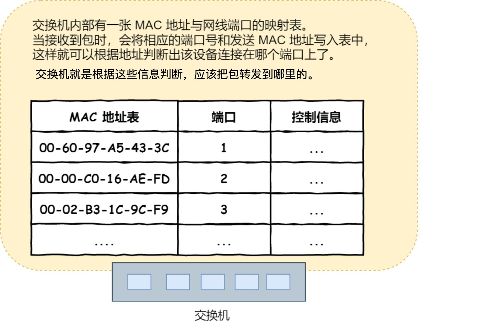
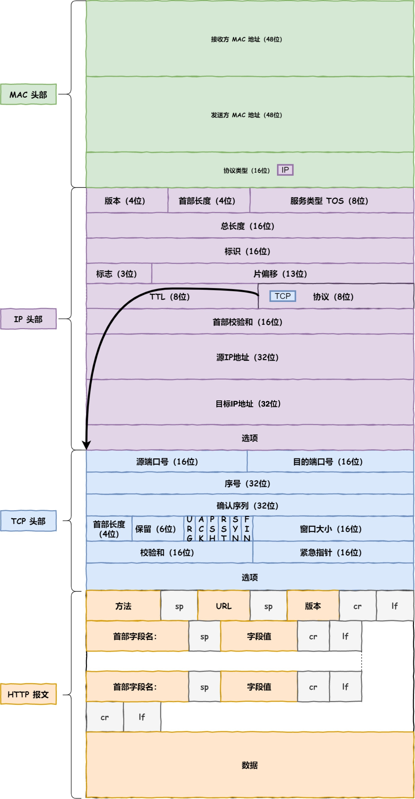

# 基础

### 1. TCP/IP 网络模型

      

**应用层**（消息/报文）：只专注于应用程序之间的数据解析，比如 **HTTP、FTP、DNS**。应用层是工作在用户态的，传输层及以下工作在内核态。

**传输层**（段）：只在通信双方节点（进程和进程间的）上传输，而不在路由器上处理。主要的传输协议：**TCP 和 UDP**。接收不同应用程序的数据包，**端口号区分应用程序，或者说，进程**。在 TCP 中，为保证可靠传输，会对传输失败的数据进行重传，为了防止重传很大的数据包（大小超过 **MSS（TCP 最大报文段长度）**），会将传输层的消息/报文分段成 **TCP 段**，再进行传输。

**网络层**（包）：实际的传输，包括 **寻址和路由选择**（实际传输路径规划）。最常使用 **IP 协议**，IP 协议会将传输层的报文作为数据部分，加上 IP 头组装成 IP 报文，如果 IP 报文大小超过 **MTU**（以太网中一般为 1500 字节）就会 **再次分片**，得到一个即将发送到网络的 IP 报文。**IP 协议不是一个可靠的协议。**

**网络接口层**（帧）：为网络层提供「链路级别」传输的服务，负责在以太网这样的底层网络上发送原始数据包，使用 **MAC 地址** 来标识网络上的设备。将网络层的数据封装帧头和帧尾（封装成帧），帧头中包括源 MAC 地址和目的 MAC 地址，然后在不同的 MAC 地址间传输数据。

- 应用层，负责向用户提供一组应用程序，比如 HTTP、DNS、FTP 等;
- 传输层，负责端到端的通信，比如 TCP、UDP 等；
- 网络层，负责网络包的封装、分片、路由、转发，比如 IP、ICMP 等；
- 网络接口层，负责网络包在物理网络中的传输，比如网络包的封帧、 MAC 寻址、差错检测，以及通过网卡传输网络帧等；

### 2. 键入网址到网页显示，期间发生了什么？

1. 解析 URL，生成 HTTP 请求报文
2. 查询 Web 服务器的 IP 地址
3. 委托操作系统中的协议栈打包报文并发送
4. 出网卡
5. 到交换机
6. 到路由器
7. 

#### - 解析 URL

若数据源的路径名为空，则访问根目录下事先设置的默认文件，即，`/index.html` 或者 `/default.html`。

#### - 根据 URL 的解析信息，生成 HTTP 请求信息

#### - 查询 Web 服务器域名对应的 IP 地址（DNS 查询）

DNS 保存了 Web 服务器域名和 IP 的对应关系。

域名的层级关系类似一个树状结构：（自右向左，最右省略了一个 `'.'`）

- 根 DNS 服务器（.）（跟域的 DNS 服务器信息保存在互联网中所有的 DNS 服务器中）
- 顶级域 DNS 服务器（.com）
- 权威 DNS 服务器（server.com）

客户端只要能够找到任意一台 DNS 服务器，就可以通过它找到根域 DNS 服务器，然后再一路顺藤摸瓜找到位于下层的某台目标 DNS 服务器。

##### 域名解析的工作流程

1. 浏览器会先看自身有没有对这个域名的缓存，如果有，就直接返回，如果没有，就去问操作系统，操作系统也会去看自己的缓存，如果有，就直接返回，如果没有，再去 hosts 文件看，也没有，才会去问「本地 DNS 服务器」。
2. 客户端首先会发出一个 DNS 请求，问 www.server.com 的 IP 是啥，并发给本地 DNS 服务器（也就是客户端的 TCP/IP 设置中填写的 DNS 服务器地址）。
3. 本地域名服务器收到客户端的请求后，如果缓存里的表格能找到 www.server.com，则它直接返回 IP 地址。如果没有，本地 DNS 会去问它的 **根域名服务器**：“老大， 能告诉我 www.server.com 的 IP 地址吗？” 根域名服务器是最高层次的，它不直接用于域名解析，但能指明一条道路。
4. 根 DNS 收到来自本地 DNS 的请求后，发现后置是 .com，说：“www.server.com 这个域名归 .com 区域管理”，我给你 **.com 顶级域名服务器地址** 给你，你去问问它吧。”
5. 本地 DNS 收到顶级域名服务器的地址后，发起请求问“老二， 你能告诉我 www.server.com 的 IP 地址吗？”
6. 顶级域名服务器说：“我给你负责 www.server.com 区域的权威 DNS 服务器的地址，你去问它应该能问到”。
7. 本地 DNS 于是转向问权威 DNS 服务器：“老三，www.server.com对应的IP是啥呀？” server.com 的权威 DNS 服务器，它是域名解析结果的原出处。
8. 权威 DNS 服务器查询后将对应的 IP 地址 X.X.X.X 告诉本地 DNS。
9. 本地 DNS 再将 IP 地址返回客户端，客户端和目标建立连接。

#### - 委托操作系统（协议栈）将生成的 HTTP 消息发送给 Web 服务器（封装）

通过 DNS 获取到 IP 后，就可以把 HTTP 的传输工作交给操作系统中的**协议栈**（TCP/UDP + IP）。

应用程序（浏览器）通过调用 Socket 库，来委托协议栈工作。协议栈的上半部分有两块，分别是负责收发数据的 TCP 和 UDP 协议，这两个传输协议会接受应用层的委托执行收发数据的操作。

协议栈的下面一半是用 IP 协议控制网络包收发操作，在互联网上传数据时，数据会被切分成一块块的网络包，而将网络包发送给对方的操作就是由 IP 负责的。

IP 中还包括 `ICMP` 协议和 `ARP` 协议。

- `ICMP` 用于告知网络包传送过程中产生的错误以及各种控制信息。
- `ARP` 用于根据 IP 地址查询相应的以太网 MAC 地址。

IP 下面的网卡驱动程序负责控制网卡硬件，而最下面的网卡则负责完成实际的收发操作，也就是对网线中的信号执行发送和接收操作。

#### - 网卡驱动程序和网卡

协议栈将报文封装成完整的帧（二进制信息）后，还需要借助网卡将数字信息转换为电信号，才能在物理网线上传输。网卡驱动程序控制网卡。

网卡驱动获取网络包之后，会将其 **复制** 到网卡内的缓存区中，接着会在其 **开头加上报头和起始帧分界符**，**在末尾加上用于检测错误的帧校验序列**。

- 起始帧分界符是一个用来表示包起始位置的标记
- 末尾的 `FCS`（帧校验序列）用来检查包传输过程是否有损坏

最后网卡会将包转为电信号，通过网线发送出去。

### - 交换机（离开子网）

交换机的设计是将网络包 **原样** 转发到目的地。交换机工作在 MAC 层，也称为 **二层网络设备**。

#### 交换机的包接收

- 首先，电信号到达网线接口，交换机里的模块进行接收，接下来交换机里的模块将电信号转换为数字信号。

- 然后通过包末尾的 `FCS` 校验错误，如果没问题则放到缓冲区。

- 交换机不核对 MAC 地址，直接接收所有的包并存放到缓冲区中。因此，和网卡不同，**交换机的端口不具有 MAC 地址**。计算机的网卡本身具有 MAC 地址，并通过核对收到的包的接收方 MAC 地址判断是不是发给自己的，如果不是发给自己的则丢弃。

- 交换机查询 MAC 地址表，查找要转发到哪个端口（根据接收方的 MAC 地址）

  - 交换机的 MAC 地址表主要包含两个信息：

    - 设备的 MAC 地址，

    - 该设备连接在交换机的哪个端口上。

  

- 若 MAC 地址表中差找不到该接收方的 MAC 地址，交换机无法判断应该把包转发到哪个端口，只能将包**转发到除了源端口之外的所有端口上**，无论该设备连接在哪个端口上都能收到这个包。

  - 安全问题：以太网设计只有接收方才能获取发送给它的包，其他设备自动忽略，所以这不会导致安全问题。
  - 网络堵塞：只有不在 MAC 地址表中的包才会进行这个操作，只要返回了响应包，交换机就可以将它的地址写入 MAC 地址表

- 此外，如果接收方 MAC 地址是一个 **广播地址**，那么交换机会将包发送到除源端口之外的所有端口。

  - 以下两个属于广播地址：

    - MAC 地址中的 `FF:FF:FF:FF:FF:FF`

    - IP 地址中的 `255.255.255.255`

- 在发送数据包时，如果目标主机不是本地局域网，填入的MAC地址是路由器，也就是把数据包转发给路由器，路由器一直转发下一个路由器，直到转发到目标主机的路由器，发现 IP 地址是自己局域网内的主机，就会 arp 请求获取目标主机的 MAC 地址，从而转发到这个服务器主机。

### - 路由器

#### 路由器和交换机的区别

- 因为 **路由器** 是基于 IP 设计的，俗称 **三层** 网络设备，路由器的各个端口都具有 MAC 地址和 IP 地址；
- 而 **交换机** 是基于以太网设计的，俗称 **二层** 网络设备，交换机的端口不具有 MAC 地址。

#### 路由器

- 路由器的每个端口都有它的 IP 地址和 MAC 地址，路由器的端口和网卡的性质是一样的。

#### 路由器的包接收

- 首先，电信号到达网线接口部分，路由器中的模块会将电信号转成数字信号，然后通过包末尾的 `FCS` 进行错误校验。

- 如果没问题则检查 MAC 头部中的 **接收方 MAC 地址**，看看是不是发给自己的包，如果是就放到接收缓冲区中，否则就丢弃这个包。

- 完成包接收操作之后，路由器就会 **去掉** 包开头的 MAC 头部。因为 **MAC 头部的作用就是将包送达路由器，其中的接收方 MAC 地址就是路由器端口的 MAC 地址**。

- 然后，路由器会根据 MAC 头部后方的 `IP` 头部中的内容进行包的转发操作。路由器根据 **目标 IP 地址** 查找 **路由表**，判断该转发到哪个端口。

  - 具体的工作流程：

    

    假设地址为 `10.10.1.101` 的计算机要向地址为 `192.168.1.100` 的服务器发送一个包，这个包先到达图中的路由器。

    判断转发目标的第一步，就是根据包的接收方 IP 地址查询路由表中的目标地址栏，以找到相匹配的记录。

    路由匹配和前面讲的一样，每个条目的子网掩码和 `192.168.1.100` IP 做 **& 与运算**后，得到的结果与对应条目的目标地址进行匹配，如果匹配就会作为候选转发目标，如果不匹配就继续与下个条目进行路由匹配。

    如第二条目的子网掩码 `255.255.255.0` 与 `192.168.1.100` IP 做 **& 与运算**后，得到结果是 `192.168.1.0` ，这与第二条目的目标地址 `192.168.1.0` 匹配，该第二条目记录就会被作为转发目标。

    实在找不到匹配路由时，就会选择**默认路由**，路由表中子网掩码为 `0.0.0.0` 的记录表示「默认路由」。

#### 路由器的包发送

- 首先，我们需要根据 **路由表的网关列** 判断对方的地址。

  - 如果网关是一个 IP 地址，则这个IP 地址就是我们要转发到的目标地址，**还未抵达终点**，还需继续需要路由器转发。

  - 如果网关为空，则 IP 头部中的接收方 IP 地址就是要转发到的目标地址，也是就终于找到 IP 包头里的目标地址了，说明 **已抵达终点**。

- 知道对方的 IP 地址之后，接下来需要通过 `ARP` 协议根据 IP 地址查询 MAC 地址，并将查询的结果作为接收方 MAC 地址。

  - 路由器也有 ARP 缓存，因此首先会在 ARP 缓存中查询，如果找不到则发送 ARP 查询请求。

  - 接下来是发送方 MAC 地址字段，这里填写输出端口的 MAC 地址。还有一个以太类型字段，填写 `0800` （十六进制）表示 IP 协议。

- 网络包完成后，接下来会将其转换成电信号并通过端口发送出去。这一步的工作过程和计算机也是相同的。

- 发送出去的网络包会通过 **交换机** 到达下一个路由器。由于接收方 MAC 地址就是下一个路由器的地址，所以交换机会根据这一地址将包传输到下一个路由器。

- 接下来，下一个路由器会将包转发给再下一个路由器，经过层层转发之后，网络包就到达了最终的目的地。

**在网络包传输的过程中，源 IP 和目标 IP 始终是不会变的，一直变化的是 MAC 地址，因为需要 MAC 地址在以太网内进行两个设备之间的包传输。**

#### - 目标设备对数据包的分发

数据包抵达服务器后，服务器会先扒开数据包的 MAC 头部，查看是否和服务器自己的 MAC 地址符合，符合就将包收起来。

接着继续扒开数据包的 IP 头，发现 IP 地址符合，根据 IP 头中协议项，知道自己上层是 TCP 协议。

于是，扒开 TCP 的头，里面有序列号，需要看一看这个序列包是不是我想要的，如果是就放入缓存中然后返回一个 ACK，如果不是就丢弃。TCP头部里面还有端口号， HTTP 的服务器正在监听这个端口号。

于是，服务器自然就知道是 HTTP 进程想要这个包，于是就将包发给 HTTP 进程。

服务器的 HTTP 进程看到，原来这个请求是要访问一个页面，于是就把这个网页封装在 HTTP 响应报文里。

HTTP 响应报文也需要穿上 TCP、IP、MAC 头部，不过这次是源地址是服务器 IP 地址，目的地址是客户端 IP 地址。

穿好头部衣服后，从网卡出去，交由交换机转发到出城的路由器，路由器就把响应数据包发到了下一个路由器，就这样跳啊跳。

最后跳到了客户端的城门把守的路由器，路由器扒开 IP 头部发现是要找城内的人，于是又把包发给了城内的交换机，再由交换机转发到客户端。

客户端收到了服务器的响应数据包后，同样也非常的高兴，客户能拆快递了！

于是，客户端开始扒皮，把收到的数据包的皮扒剩 HTTP 响应报文后，交给浏览器去渲染页面，一份特别的数据包快递，就这样显示出来了！

最后，客户端要离开了，向服务器发起了 TCP 四次挥手，至此双方的连接就断开了。

## 3. Linux 系统如何收发网络包

#### - Linux 网络协议栈

- 应用程序需要通过系统调用，来跟 Socket 层进行数据交互；
- Socket 层的下面就是传输层、网络层和网络接口层；
- 最下面的一层，则是网卡驱动程序和硬件网卡设备；

## ==Linux 接收网络包的流程==

网卡是计算机里的一个硬件，专门负责接收和发送网络包，当网卡接收到一个网络包后，会通过 DMA 技术，将网络包写入到指定的内存地址，也就是写入到 Ring Buffer ，这个是一个环形缓冲区，接着就会告诉操作系统这个网络包已经到达。

> 那应该怎么告诉操作系统这个网络包已经到达了呢？

最简单的一种方式就是触发中断，也就是每当网卡收到一个网络包，就触发一个中断告诉操作系统。

但是，这存在一个问题，在高性能网络场景下，网络包的数量会非常多，那么就会触发非常多的中断，要知道当 CPU 收到了中断，就会停下手里的事情，而去处理这些网络包，处理完毕后，才会回去继续其他事情，那么频繁地触发中断，则会导致 CPU 一直没完没了的处理中断，而导致其他任务可能无法继续前进，从而影响系统的整体效率。

所以为了解决频繁中断带来的性能开销，Linux 内核在 2.6 版本中引入了 **NAPI 机制**，它是混合「中断和轮询」的方式来接收网络包，它的核心概念就是**不采用中断的方式读取数据**，而是首先采用中断唤醒数据接收的服务程序，然后 `poll` 的方法来轮询数据。

因此，当有网络包到达时，会通过 DMA 技术，将网络包写入到指定的内存地址，接着网卡向 CPU 发起硬件中断，当 CPU 收到硬件中断请求后，根据中断表，调用已经注册的中断处理函数。

硬件中断处理函数会做如下的事情：

- 需要先「暂时屏蔽中断」，表示已经知道内存中有数据了，告诉网卡下次再收到数据包直接写内存就可以了，不要再通知 CPU 了，这样可以提高效率，避免 CPU 不停的被中断。
- 接着，发起「软中断」，然后恢复刚才屏蔽的中断。

至此，硬件中断处理函数的工作就已经完成。

硬件中断处理函数做的事情很少，主要耗时的工作都交给软中断处理函数了。

> 软中断的处理

内核中的 ksoftirqd 线程专门负责软中断的处理，当 ksoftirqd 内核线程收到软中断后，就会来轮询处理数据。

ksoftirqd 线程会从 Ring Buffer 中获取一个数据帧，用 sk_buff 表示，从而可以作为一个网络包交给网络协议栈进行逐层处理。

> 网络协议栈

首先，会先进入到网络接口层，在这一层会检查报文的合法性，如果不合法则丢弃，合法则会找出该网络包的上层协议的类型，比如是 IPv4，还是 IPv6，接着再去掉帧头和帧尾，然后交给网络层。

到了网络层，则取出 IP 包，判断网络包下一步的走向，比如是交给上层处理还是转发出去。当确认这个网络包要发送给本机后，就会从 IP 头里看看上一层协议的类型是 TCP 还是 UDP，接着去掉 IP 头，然后交给传输层。

传输层取出 TCP 头或 UDP 头，根据四元组「源 IP、源端口、目的 IP、目的端口」 作为标识，找出对应的 Socket，并把数据放到 Socket 的接收缓冲区。

最后，应用层程序调用 Socket 接口，将内核的 Socket 接收缓冲区的数据「拷贝」到应用层的缓冲区，然后唤醒用户进程。

至此，一个网络包的接收过程就已经结束了，你也可以从下图左边部分看到网络包接收的流程，右边部分刚好反过来，它是网络包发送的流程。

## ==[#](https://xiaolincoding.com/network/1_base/how_os_deal_network_package.html#linux-发送网络包的流程)Linux 发送网络包的流程==

如上图的右半部分，发送网络包的流程正好和接收流程相反。

首先，应用程序会调用 Socket 发送数据包的接口，由于这个是系统调用，所以会从用户态陷入到内核态中的 Socket 层，内核会申请一个内核态的 sk_buff 内存，**将用户待发送的数据拷贝到 sk_buff 内存，并将其加入到发送缓冲区**。

接下来，网络协议栈从 Socket 发送缓冲区中取出 sk_buff，并按照 TCP/IP 协议栈从上到下逐层处理。

如果使用的是 TCP 传输协议发送数据，那么**先拷贝一个新的 sk_buff 副本** ，这是因为 sk_buff 后续在调用网络层，最后到达网卡发送完成的时候，这个 sk_buff 会被释放掉。而 TCP 协议是支持丢失重传的，在收到对方的 ACK 之前，这个 sk_buff 不能被删除。所以内核的做法就是每次调用网卡发送的时候，实际上传递出去的是 sk_buff 的一个拷贝，等收到 ACK 再真正删除。

接着，对 sk_buff 填充 TCP 头。这里提一下，sk_buff 可以表示各个层的数据包，在应用层数据包叫 data，在 TCP 层我们称为 segment，在 IP 层我们叫 packet，在数据链路层称为 frame。

你可能会好奇，为什么全部数据包只用一个结构体来描述呢？协议栈采用的是分层结构，上层向下层传递数据时需要增加包头，下层向上层数据时又需要去掉包头，如果每一层都用一个结构体，那在层之间传递数据的时候，就要发生多次拷贝，这将大大降低 CPU 效率。

于是，为了在层级之间传递数据时，不发生拷贝，只用 sk_buff 一个结构体来描述所有的网络包，那它是如何做到的呢？是通过调整 sk_buff 中 `data` 的指针，比如：

- 当接收报文时，从网卡驱动开始，通过协议栈层层往上传送数据报，通过增加 skb->data 的值，来逐步剥离协议首部。
- 当要发送报文时，创建 sk_buff 结构体，数据缓存区的头部预留足够的空间，用来填充各层首部，在经过各下层协议时，通过减少 skb->data 的值来增加协议首部。

你可以从下面这张图看到，当发送报文时，data 指针的移动过程。

至此，传输层的工作也就都完成了。

然后交给网络层，在网络层里会做这些工作：选取路由（确认下一跳的 IP）、填充 IP 头、netfilter 过滤、对超过 MTU 大小的数据包进行分片。处理完这些工作后会交给网络接口层处理。

网络接口层会通过 ARP 协议获得下一跳的 MAC 地址，然后对 sk_buff 填充帧头和帧尾，接着将 sk_buff 放到网卡的发送队列中。

这一些工作准备好后，会触发「软中断」告诉网卡驱动程序，这里有新的网络包需要发送，驱动程序会从发送队列中读取 sk_buff，将这个 sk_buff 挂到 RingBuffer 中，接着将 sk_buff 数据映射到网卡可访问的内存 DMA 区域，最后触发真实的发送。

当数据发送完成以后，其实工作并没有结束，因为内存还没有清理。当发送完成的时候，网卡设备会触发一个硬中断来释放内存，主要是释放 sk_buff 内存和清理 RingBuffer 内存。

最后，当收到这个 TCP 报文的 ACK 应答时，传输层就会释放原始的 sk_buff 。

> 发送网络数据的时候，涉及几次内存拷贝操作？

第一次，调用发送数据的系统调用的时候，内核会申请一个内核态的 sk_buff 内存，将用户待发送的数据拷贝到 sk_buff 内存，并将其加入到发送缓冲区。

第二次，在使用 TCP 传输协议的情况下，从传输层进入网络层的时候，每一个 sk_buff 都会被克隆一个新的副本出来。副本 sk_buff 会被送往网络层，等它发送完的时候就会释放掉，然后原始的 sk_buff 还保留在传输层，目的是为了实现 TCP 的可靠传输，等收到这个数据包的 ACK 时，才会释放原始的 sk_buff 。

第三次，当 IP 层发现 sk_buff 大于 MTU 时才需要进行。会再申请额外的 sk_buff，并将原来的 sk_buff 拷贝为多个小的 sk_buff。

### 3. TCP 和 UDP 和 HTTP，它们之间的区别是什么？（阿里）

# TCP

- **源端口号** 和 **目标端口** 号是不可少的，如果没有这两个端口号，数据就不知道应该发给哪个应用。

- **序号**，这个是为了 **解决包乱序的问题**。

- **确认号**，目的是确认发出去对方是否有收到。如果没有收到就应该重新发送，直到送达，这个是为了 **解决丢包的问题**。

- **状态位**。例如 `SYN` 是发起一个连接，`ACK` 是回复，`RST` 是重新连接，`FIN` 是结束连接等。TCP 是面向连接的，因而双方要维护连接的状态，这些带状态位的包的发送，会引起双方的状态变更。

- **窗口大小**。TCP 要做 **流量控制**，通信双方各声明一个窗口（缓存大小），标识自己当前能够的处理能力，别发送的太快，撑死我，也别发的太慢，饿死我。

除了做流量控制以外，TCP还会做**拥塞控制**，对于真正的通路堵车不堵车，它无能为力，唯一能做的就是控制自己，也即控制发送的速度。不能改变世界，就改变自己嘛。

### a. 三次握手

在 HTTP 传输数据之前，首先需要 TCP 建立连接，TCP 连接的建立，通常称为**三次握手**。

这个所谓的「连接」，只是双方计算机里维护一个状态机，在连接建立的过程中，双方的状态变化时序图就像这样。

- 一开始，客户端和服务端都处于 `CLOSED` 状态。先是服务端主动监听某个端口，处于 `LISTEN` 状态。
- 然后客户端主动发起连接 `SYN`，之后处于 `SYN-SENT` 状态。
- 服务端收到发起的连接，返回 `SYN`，并且 `ACK` 客户端的 `SYN`，之后处于 `SYN-RCVD` 状态。
- 客户端收到服务端发送的 `SYN` 和 `ACK` 之后，发送对 `SYN` 确认的 `ACK`，之后处于 `ESTABLISHED` 状态，因为它一发一收成功了。
- 服务端收到 `ACK` 的 `ACK` 之后，处于 `ESTABLISHED` 状态，因为它也一发一收了。

所以三次握手目的是**保证双方都有发送和接收的能力**。

> 如何查看 TCP 的连接状态？

TCP 的连接状态查看，在 Linux 可以通过 `netstat -napt` 命令查看。

> TCP 分割数据

如果 HTTP 请求消息比较长，超过了 `MSS` 的长度，这时 TCP 就需要把 HTTP 的数据拆解成一块块的数据发送，而不是一次性发送所有数据。

- `MTU`：一个网络包的最大长度，以太网中一般为 `1500` 字节。
- `MSS`：除去 IP 和 TCP 头部之后，一个网络包所能容纳的 TCP 数据的最大长度。

数据会被以 `MSS` 的长度为单位进行拆分，拆分出来的每一块数据都会被放进单独的网络包中。也就是在每个被拆分的数据加上 TCP 头信息，然后交给 IP 模块来发送数据。

> TCP 报文生成

TCP 协议里面会有两个端口，一个是浏览器监听的端口（通常是随机生成的），一个是 Web 服务器监听的端口（HTTP 默认端口号是 `80`， HTTPS 默认端口号是 `443`）。

在双方建立了连接后，TCP 报文中的数据部分就是存放 HTTP 头部 + 数据，组装好 TCP 报文之后，就需交给下面的网络层处理。

至此，网络包的报文如下图。

# IP

CP 模块在执行连接、收发、断开等各阶段操作时，都需要委托 IP 模块将数据封装成 **网络包** 发送给通信对象。

> IP 包头格式

我们先看看 IP 报文头部的格式：

- **源地址 IP** 和 **目标地址 IP**：

  - 源地址 IP，即是客户端输出的 IP 地址；

  - 目标地址，即通过 DNS 域名解析得到的 Web 服务器 IP。

- **协议号**：因为 HTTP 是经过 TCP 传输的，所以在 IP 包头的**协议号**，要填写为 `06`（十六进制），表示协议为 TCP。

> 假设客户端有多个网卡，就会有多个 IP 地址，那 IP 头部的源地址应该选择哪个 IP 呢？

当存在多个网卡时，在填写源地址 IP 时，就需要判断到底应该填写哪个地址。**这个判断相当于在多块网卡中判断应该使用哪个一块网卡来发送包。**这个时候就需要根据 **路由表** 规则，来判断哪一个网卡作为源地址 IP。

在 Linux 操作系统，我们可以使用 `route -n` 命令查看当前系统的路由表。

举个例子，根据上面的路由表，我们假设 Web 服务器的目标地址是 `192.168.10.200`。

1. 首先先和第一条目的子网掩码（`Genmask`）进行 **与运算**，得到结果为 `192.168.10.0`，但是第一个条目的 `Destination` 是 `192.168.3.0`，两者不一致所以匹配失败。
2. 再与第二条目的子网掩码进行 **与运算**，得到的结果为 `192.168.10.0`，与第二条目的 `Destination 192.168.10.0` 匹配成功，所以将使用 `eth1` 网卡的 IP 地址作为 IP 包头的源地址。

那么假设 Web 服务器的目标地址是 `10.100.20.100`，那么依然依照上面的路由表规则判断，判断后的结果是和第三条目匹配。

第三条目比较特殊，它目标地址和子网掩码都是 `0.0.0.0`，这表示 **默认网关**，如果其他所有条目都无法匹配，就会自动匹配这一行。并且后续就把包发给路由器，`Gateway` 即是路由器的 IP 地址。

> IP 报文生成

至此，网络包的报文如下图。

# MAC

生成了 IP 头部之后，接下来网络包还需要在 IP 头部的前面加上 **MAC 头部**。

> MAC 包头格式

MAC 头部是以太网使用的头部，它包含了接收方和发送方的 MAC 地址等信息。

在 MAC 包头里需要**发送方 MAC 地址**和**接收方目标 MAC 地址**，用于**两点之间的传输**。

一般在 TCP/IP 通信里，MAC 包头的**协议类型**只使用：

- `0800` ： IP 协议
- `0806` ： ARP 协议

> MAC 发送方和接收方如何确认?

**发送方**的 MAC 地址获取就比较简单了，MAC 地址是在网卡生产时写入到 ROM 里的，只要将这个值读取出来写入到 MAC 头部就可以了。

**接收方**的 MAC 地址就有点复杂了，只要告诉以太网对方的 MAC 的地址，以太网就会帮我们把包发送过去，那么很显然这里应该填写对方的 MAC 地址。

所以先得搞清楚应该把包发给谁，这个只要查一下**路由表**就知道了。在路由表中找到相匹配的条目，然后把包发给 `Gateway` 列中的 IP 地址就可以了。

> 既然知道要发给谁，按如何获取对方的 MAC 地址呢？

不知道对方 MAC 地址？不知道就喊呗。

此时就需要 `ARP` 协议帮我们找到路由器的 MAC 地址。

ARP 协议会在以太网中以**广播**的形式，对以太网所有的设备喊出：“这个 IP 地址是谁的？请把你的 MAC 地址告诉我”。

然后就会有人回答：“这个 IP 地址是我的，我的 MAC 地址是 XXXX”。

如果对方和自己处于同一个子网中，那么通过上面的操作就可以得到对方的 MAC 地址。然后，我们将这个 MAC 地址写入 MAC 头部，MAC 头部就完成了。

> 好像每次都要广播获取，这不是很麻烦吗？

放心，在后续操作系统会把本次查询结果放到一块叫做 **ARP 缓存**的内存空间留着以后用，不过缓存的时间就几分钟。

也就是说，在发包时：

- 先查询 ARP 缓存，如果其中已经保存了对方的 MAC 地址，就不需要发送 ARP 查询，直接使用 ARP 缓存中的地址。
- 而当 ARP 缓存中不存在对方 MAC 地址时，则发送 ARP 广播查询。

> 查看 ARP 缓存内容

在 Linux 系统中，我们可以使用 `arp -a` 命令来查看 ARP 缓存的内容。

> MAC 报文生成

至此，网络包的报文如下图。

