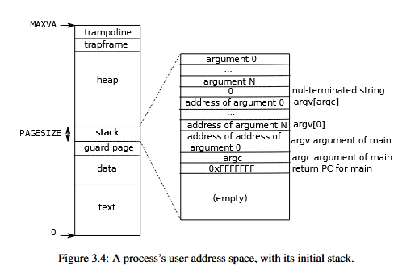

https://blog.csdn.net/weixin_42246291/article/details/129318984

选一个自己觉得收获最大的项目介绍一下

3、在项目中遇到哪些困难，又是如何解决的

4、项目还有哪些可以优化的地方

毕业课题，先介绍项目的主要内容，然后目前所做出的成果，以及国内外的研究现状，项目的创新点以及缺陷

2、除了毕业课题，为什么做了另外两个项目

3、介绍内存池和web服务器项目，然后问项目实现的方法以及缺陷等等，问得很深

在做项目的时候有没有遇到什么问题？


# WebServer

## 线程池相关

###### **a. 手写线程池**

```c++
#ifndef THREADPOOL_H
#define THREADPOOL_H

#include <list>
#include <cstdio>
#include <exception>
#include <pthread.h>
#include "locker.h"

// 线程池类，将它定义为模板类是为了代码复用，模板参数T是任务类
template<typename T>
class threadpool {
public:
    /*thread_number是线程池中线程的数量，max_requests是请求队列中最多允许的、等待处理的请求的数量*/
    threadpool(int thread_number = 8, int max_requests = 10000);
    ~threadpool();
    bool append(T* request);

private:
    /*工作线程运行的函数，它不断从工作队列中取出任务并执行之*/
    static void* worker(void* arg);
    void run();

private:
    // 线程的数量
    int m_thread_number;  
    
    // 描述线程池的数组，大小为m_thread_number    
    pthread_t * m_threads;

    // 请求队列中最多允许的、等待处理的请求的数量  
    int m_max_requests; 
    
    // 请求队列
    std::list< T* > m_workqueue;  

    // 保护请求队列的互斥锁
    locker m_queuelocker;   

    // 是否有任务需要处理
    sem m_queuestat;

    // 是否结束线程          
    bool m_stop;                    
};

template< typename T >
threadpool< T >::threadpool(int thread_number, int max_requests) : 
        m_thread_number(thread_number), m_max_requests(max_requests), 
        m_stop(false), m_threads(NULL) {

    if((thread_number <= 0) || (max_requests <= 0) ) {
        throw std::exception();
    }

    m_threads = new pthread_t[m_thread_number];
    if(!m_threads) {
        throw std::exception();
    }

    // 创建thread_number 个线程，并将他们设置为脱离线程。
    for ( int i = 0; i < thread_number; ++i ) {
        printf( "create the %dth thread\n", i);
        if(pthread_create(m_threads + i, NULL, worker, this ) != 0) {
            delete [] m_threads;
            throw std::exception();
        }
        
        if( pthread_detach( m_threads[i] ) ) {
            delete [] m_threads;
            throw std::exception();
        }
    }
}

template< typename T >
threadpool< T >::~threadpool() {
    delete [] m_threads;
    m_stop = true;
}

template< typename T >
bool threadpool< T >::append( T* request )
{
    // 操作工作队列时一定要加锁，因为它被所有线程共享。
    m_queuelocker.lock();
    if ( m_workqueue.size() > m_max_requests ) {
        m_queuelocker.unlock();
        return false;
    }
    m_workqueue.push_back(request);
    m_queuelocker.unlock();
    m_queuestat.post();
    return true;
}

template< typename T >
void* threadpool< T >::worker( void* arg )
{
    threadpool* pool = ( threadpool* )arg;
    pool->run();
    return pool;
}

template< typename T >
void threadpool< T >::run() {

    while (!m_stop) {
        m_queuestat.wait();
        m_queuelocker.lock();
        if ( m_workqueue.empty() ) {
            m_queuelocker.unlock();
            continue;
        }
        T* request = m_workqueue.front();
        m_workqueue.pop_front();
        m_queuelocker.unlock();
        if ( !request ) {
            continue;
        }
        request->process();
    }

}

#endif
```

**b. 线程的同步机制有哪些？**

锁、信号量、条件变量。

**c. 线程池中的工作线程是一直等待吗？**

是的。线程池类中维护了一个请求队列，用来存储需要工作线程处理和响应的请求。线程池中还维护了互斥锁和信号量，来避免多工作线程对请求队列的读取冲突。没有获取请求队列互斥锁的工作线程会被阻塞，而获取了互斥锁的工作线程，在请求队列为空时，会直接释放锁。所以在请求队列中没有请求时，线程池中的线程会一直请求获取锁，而获取到锁的工作线程会因为没有请求而释放锁。当请求队列中有请求时，获取锁的线程会从请求队列中获取请求，而在这期间，其他工作队列是阻塞的。

```cpp
template<typename T>
void threadpool<T>::run()
{
    while(true)
    {
        m_queuestat.wait();
        m_queuelocker.lock();
        if(m_workqueue.empty())
        {
            m_queuelocker.unlock();
            continue;
        }
        T * request = m_workqueue.front();
        m_workqueue.pop_front();
        m_queuelocker.unlock();

        if(!request)
        {
            continue;
        }

        request->process();     // 执行任务
    }
}
```

**<u>*这里可以优化用条件变量来处理。*</u>**

**d. 你的线程池工作线程处理完一个任务后的状态是什么？**

工作线程一直在循环获取请求队列的互斥锁，获取了互斥锁后，如果有请求，则读取请求并处理，如果没有请求，则释放互斥锁并继续循环尝试获取锁。所以工作线程在处理完一个任务后会继续循环尝试获取锁，在获取锁之前会被阻塞。

```c++
template<typename T>
void threadpool<T>::run()
{
    while(true)
    {
        m_queuestat.wait();
        m_queuelocker.lock();
        if(m_workqueue.empty())
        {
            m_queuelocker.unlock();
            continue;
        }
        T * request = m_workqueue.front();
        m_workqueue.pop_front();
        m_queuelocker.unlock();

        if(!request)
        {
            continue;
        }

        request->process();     // 执行任务
    }
}
```

**e. 如果同时1000个客户端进行访问请求，线程数不多，怎么能及时响应处理每一个呢？**

我使用的是线程池，线程池中的工作线程在没有请求时一直阻塞，而在有请求时通过请求队列获取请求。所以不存在线程的创建和销毁这种开销很大的阶段，所以可以大大地提高服务器的性能，实现高并发的响应。

**f. 如果一个客户请求需要占用线程很久的时间，会不会影响接下来的客户请求呢，有什么好的策略呢?**

会。可以设置一个超时时间，从工作线程处理请求开始计时，一旦线程处理完一个请求就重置计时器，一旦超时就让内核发送信号给线程，让线程放弃该请求的处理，转去处理请求队列中的其他请求。

**并发模型相关**

- 简单说一下服务器使用的并发模型？
- reactor、proactor、主从reactor模型的区别？
- 你用了epoll，说一下为什么用epoll，还有其他复用方式吗？区别是什么？

## HTTP报文解析相关

#### 1. 为什么要用状态机？

如果是直接面向报文解析过程解析的话，逻辑会很冗余，因为你要在每一个函数中处理所有可能出现的状态，状态一多就容易遗漏。而如果将整一个报文解析过程抽象成几个状态之间的逻辑关系，那就只要实现状态到状态之间的转换，不容易遗漏情况，同时逻辑有很清晰。

#### 2. 状态机的转移图

主状态机

从状态机

#### 3. HTTP 报文解析流程

主函数 `process`

a. 首先 `process_read` 读取 HTTP 报文，并解析，返回解析结果

b. 如果解析结果为数据读取不完全，则将该连接的 `sockfd` 重新添加到 `epoll` 监听的事件中，等待下一次事件。

c. **==根据报文解析的结果，`process_write` 生成响应报文，将其写入写缓冲区==**。

d. **==如果响应报文生成的过程中出现了问题，那么 `process` 直接关闭连接==**。

e. 最后将连接的 `sockfd` 的写事件添加到 `epoll` 的监听事件中，`epoll` 在监听到事件后，会调用 `write` 函数，向客户端发送响应报文。


读取报文并解析 `process_read`：HTTP_STATUS 的转换，通过 `parse_line` 每次获取一行

`CHECK_STATE_REQUESTLINE` - `CHECK_STATE_HEADER` - `CHECK_STATE_CONTENT`

`CHECK_STATE_REQUESTLINE` :

`parse_request_line` 解析请求行，解析成功则转到  `CHECK_STATE_HEADER`

 `CHECK_STATE_HEADER`：

`parse_headers` 解析请求头，如果存在 `Content-Length` 字段，则需要转到 `CHECK_STATE_CONTENT`

`CHECK_STATE_CONTENT`：

`parse_content` 仅获取请求数据，根据 `Content-Length` 字段的值判断获取的长度


- ==https协议为什么安全？==
- ==https的ssl连接过程==
- ==GET和POST的区别==

## 定时器相关

#### 为什么要用定时器？

用信号可以异步实现清理非活跃连接的功能，可以和主进程解耦。当进程收到信号时，操作系统会中断当前进程，转而进入信号处理函数执行操作，然后再返回到当前进程。

为了避免信号处理函数执行时间过长，项目中，信号处理函数仅仅发送信号通知主进程，然后让主进程来执行信号处理函数。

为了统一和简单实现，利用管道来发送信号，这样就可以把管道注册到 epoll 中，让 epoll 来监听信号事件。

将管道设置为非阻塞态，避免管道满导致信号处理函数阻塞。

#### 说一下定时器的工作原理

定时器类中包括了连接信息（客户端 socket，定时器）、定时事件（回调函数）、定时器超时时间。

#### 最小堆优化？说一下时间复杂度和工作原理

## 压测相关

- 服务器并发量测试过吗？怎么测试的？
- 

#### webbench是什么？介绍一下原理

父进程fork若干个子进程，每个子进程在用户要求时间或默认的时间内对目标web循环发出实际访问请求，父子进程通过管道进行通信，子进程通过管道写端向父进程传递在若干次请求访问完毕后记录到的总信息，父进程通过管道读端读取子进程发来的相关信息，子进程再时间到后结束，父进程在所有子进程退出后统计并给用户显示最后的测试结果，然后退出。

在你模拟高并发请求的时候，你是怎么样在短时间内产生大量的请求的？

## 其他

- 为什么要做这样一个项目？
- 介绍下你的项目
- 你的项目解决了哪些其他同类项目没有解决的问题？
- 说一下前端发送请求后，服务器处理的过程，中间涉及哪些协议？

## 信号

```cpp
#include <signal.h>
```

```cpp
struct sigaction {
    void     (*sa_handler)(int);    // 函数指针，指向信号处理函数
    void     (*sa_sigaction)(int, siginfo_t *, void *);     // 不常用
    sigset_t   sa_mask;     // 临时阻塞信号集，在 sigaction 函数执行过程中，临时阻塞某些信号。
    int        sa_flags;    //若为 0，表示用 sa_handler 进行信号处理动作；若为 SA_SIGINFO，表示用 sa_sigaction 进行信号处理动作。
    void     (*sa_restorer)(void);  // 已废弃
};
```

```cpp
int sigemptyset(sigset_t *set);
/*
  参数：
    - set：传出参数。需要操作的阻塞信号集。（sigset_t 本质上是一个 long 类型的数，位图存储每个信号）
  返回值：
    - 调用成功返回 0；调用失败返回 -1。
  作用：
    - 清空阻塞信号集，将阻塞信号集中的所有的标志位置为 0。
*/

int sigfillset(sigset_t *set); 	// 信号处理函数执行期间，阻塞所有信号
/*
  参数：
    - set：传出参数。需要操作的阻塞信号集。（sigset_t 本质上是一个 long 类型的数，位图存储每个信号）
  返回值：
    - 调用成功返回 0；调用失败返回 -1。
  作用：
    - 将阻塞信号集中的所有的标志位置为 1。阻塞所有信号，即不处理任何未决信号。
*/

int sigaddset(sigset_t *set, int signum);
/*
  参数：
    - set：传出参数。需要操作的阻塞信号集。（sigset_t 本质上是一个 long 类型的数，位图存储每个信号）
    - signum：需要操作的信号。

  返回值：
    - 调用成功返回 0；调用失败返回 -1。

  作用：
    - 设置阻塞信号集中的某一个信号对应的标志位为 1。
*/

int sigdelset(sigset_t *set, int signum);
/*
  参数：
    - set：传出参数。需要操作的阻塞信号集。（sigset_t 本质上是一个 long 类型的数，位图存储每个信号）
    - signum：需要操作的信号。

  返回值：
    - 调用成功返回 0；调用失败返回 -1。

  作用：
    - 设置阻塞信号集中的某一个信号对应的标志位为 0。
*/
int sigismember(const sigset_t *set, int signum);
/*
  参数：
    - set：需要查询的阻塞信号集。（sigset_t 本质上是一个 long 类型的数，位图存储每个信号）
    - signum：需要查询的信号。

  返回值：
    - 返回 1：signum 被阻塞；
    - 返回 0：signum 没有被阻塞；
    - 返回 -1：调用失败

  作用：
    - 设查询某个信号是否被阻塞。
*/
```


```cpp
int sigaction(int signum, const struct sigaction *act, struct sigaction *oldact);
/*
  参数：
    - signum：要捕捉的信号或宏。
    - act：捕捉信号后的处理动作。
    - oldact：调用之前对该信号的处理动作，一般不使用，传入 NULL。

  返回值：
    - 调用成功，返回 0；调用失败，返回 -1，并设置 errno。

  作用：
    - 信号捕捉。改变信号捕捉后的处理动作。
*/
```

```cpp
#include <signal.h>
#include <stdio.h>
#include <stdlib.h>
#include <sys/time.h>   // setitimer 头文件

void myAlarm(int num)
{
    printf("Caught signal %d\n", num);
    printf("xixixixixi\n");
    return;
}
int main()
{   
    // 注册信号捕捉函数
    struct sigaction my_sigaction;
    my_sigaction.sa_flags = 0;
    my_sigaction.sa_handler = myAlarm;
    sigemptyset(&my_sigaction.sa_mask);     // 清空临时阻塞信号集
    sigaction(SIGALRM, &my_sigaction, NULL);


    struct itimerval new_value;

    // 设置开始的延时
    new_value.it_value.tv_sec = 3;
    new_value.it_value.tv_usec = 0;

    // 设置间隔
    new_value.it_interval.tv_sec = 2;
    new_value.it_interval.tv_usec = 0;

    int ret = setitimer(ITIMER_REAL, &new_value, NULL);
    if(ret == -1)
    {
        perror("setitimer");
        exit(0);
    }
    printf("定时器开始了...\n");

    // getchar();   sigaction 函数不能用 getchar() 函数实现进程阻塞 - https://blog.csdn.net/fan_Mk/article/details/123638182 默认的 sa_flags 会中断 I/O
    while(1);
    
    return 0;
}
```

# 6.S081

## 系统调用

sysinfo 

- 获取空闲内存大小：xv6 维护了一个空闲页链表，所以对于空闲内存大小的计算，可以直接计算这个空闲页链表的长度。

- 获取内核中正在执行的进程数量：xv6 中所有的进程状态都由一个进程数组存储，因此只要遍历这个进程数组，同级处于执行态的进程的数量即可。

但需要注意的是，内核空间中的数据是没有办法直接被用户进程读取的。所以在调用系统调用时，用户进程需要向内核传入保存返回信息的地址，已经用户的页表，才能使内核在内核态中得知，到底要将这两个信息存储在哪个物理地址中。

## 实现内核态对用户传入地址的解引用

xv6 默认实现的是一个全局的内核页表，以及每个进程自己的进程页表。也就是说，不论是什么进程陷入到内核态，用的都是全局的内核页表，这就会导致内核无法根据用户进程的虚拟地址访问真实的物理内存。同时，这会导致在陷入到内核态后，进程和进程之间的隔离性变弱，也就是说，A 进程可以通过访问非法内存而访问到 B 进程内核栈的信息。

因此，要将全局内核页表拷贝到每一个用户进程页表中，所以在用户进程的 PCB 中再增加一个内核页表信息，并且将全局内核页表的映射信息全部添加到用户进程私有的内核页表中，主要包括了硬件虚拟地址和内核栈。


这样，在上下文切换的时候，可以直接切换成用户进程私有的内核页表。


需要注意的是，在进程结束的时候，对于他的内核页表来说，不能直接释放他所有的物理页，而只是放他的内核栈所在的物理页。


## Traps 陷入内核态

**用户态如何陷入内核态？用户什么时候会陷入内核态？**

用户态和内核态切换的场景：

- 调用系统调用
- 出现缺页错误、除 0 等异常
- 触发中断

用户态切换内核态时需要保护的现场和切换的值：

- 保存用户进程的寄存器
- 保存程序计数器的值
- 切换模式为 supervisor mode
- 切换到内核页表
- 切换到内核栈

陷入的流程：

① 保护现场，保护在 `trapframe` 陷入页中。（虽然转换到了内核页表，但是所有进程 `trapframe` 的虚拟地址都是一样的，所以依旧可以访问）

② 修改程序计数器，使下一条指令为处理陷入函数的入口地址（xv6 将处理函数 `usertrap` 保存在 trampoline 跳板页中）

③ 进入陷入处理函数，根据 `sscause` 寄存器的值，选择合适的处理流程。

栈里的数据是以栈帧为单位的，每执行一次函数调用就会生成一个栈帧，栈帧中包括了返回地址、函数传入参数、调用函数中的局部变量等。

**报警器 ALARM 的实现**

a. 在用户区定义调用系统调用 `sys_sigalarm` 的接口 `sigalarm`，其中需要传入报警处理函数的指针，报警的间隔时间。在进程 PCB 中增加一个变量，当前经过的 CPU 时钟数

b. 在内核态实现系统调用 `sys_sigalarm`，读取寄存器获取报警处理函数指针和报警的间隔时间。

c. 在陷入处理函数中，每进行一次 CPU 时钟滴答，就将CPU 时钟滴答数和报警的间隔时间比较，如果已经达到报警间隔，执行报警处理函数，并重置 CPU 时钟滴答数。

d. 在执行报警处理函数的时候，需要屏蔽这期间出现的报警。所有再维护一个变量，标记此时是否在报警中，如果在报警中，则不触发报警处理函数。

e. 由于报警处理函数是用户传入的，其中可能会存在恶意信息破坏内核，所以在跳转到报警处理函数之前，先拷贝一份内核的寄存器信息等 alarm_trampoline ，在完成报警处理函数后，根据之前的 trampoline 恢复现场。

## Lazy Allocation 延时分配

**为什么要实现 Lazy Allocaton ？如何实现 Lazy Allocaton ？**

进程的虚拟内存空间分布包括数据段、代码段、栈、堆。



进程在运行时会请求加大堆内存，最直接的方法是 eager allocation，也就是进程一请求，内核就分配新的内存页。但是如果进程请求的空间较大，内核分配效率也就会低，这会影响整个进程的执行效率。另外，进程在申请内存的时候，往往会申请比实际需要的更大的空间，这会导致一定的空间浪费。

而利用页错误可以巧妙地实现页的延时分配，进而提高系统性能以及内存的利用率。

具体来说的话，首先进程的 PCB 中记录了栈顶和进程大小。在延时分配中，当进程申请分配新的页时，内核只修改进程大小，而不实际分配页。当某条指令访存一个非法内存时，可以通过判断这个内存地址是不是在栈顶之上，并且在进程大小之中，如果是的话，就说明这是进程之前请求申请的空间，那么，此时进行页分配。

a. 在进程调用系统调用 `sys_sbrk()`(kernel/sys_proc.c) 函数时，不实际分配内存页，仅修改堆的大小，并返回堆以前的大小。

```cpp
uint64
sys_sbrk(void)
{
  int addr;
  int n;

  if(argint(0, &n) < 0)
    return -1;
  
  addr = myproc()->sz;
  // lazy allocation
  myproc()->sz += n;

  return addr;
}
```

b. 在出现缺页错误时，分配页，并且重新执行指令。

发生页错误后，操作系统会陷入内核态，处理页错误的函数是 `usertrap()`(kernel/trap.c)。

①  `usertrap()` 首先会根据 `r_scause()`的值判断是什么错误，如果 `r_scause() == 13 || r_scause() == 15`，则是页错误。

② `r_stval()` 存储了出错的虚拟地址，判断这个虚拟地址是否在 **栈空间之上，进程大小之下**，如果是，则说明此时需要惰性分配。

③ 调用 `kalloc()` 函数分配新的内存页，并且将映射添加到当前进程的页表中。

```cpp
  uint64 cause = r_scause();
  if(cause == 8) {
    ...
  } else if((which_dev = devintr()) != 0) {
    // ok
  } else if(cause == 13 || cause == 15) {
    // 处理页面错误
    uint64 fault_va = r_stval();  // 产生页面错误的虚拟地址
    char* pa;                     // 分配的物理地址
    if(PGROUNDUP(p->trapframe->sp) - 1 < fault_va && fault_va < p->sz &&
      (pa = kalloc()) != 0) {
        memset(pa, 0, PGSIZE);
        if(mappages(p->pagetable, PGROUNDDOWN(fault_va), PGSIZE, (uint64)pa, PTE_R | PTE_W | PTE_X | PTE_U) != 0) {
          kfree(pa);
          p->killed = 1;
        }
    } else {
      // printf("usertrap(): out of memory!\n");
      p->killed = 1;
    }
  } else {
    ...
  }
```

*c. 除此之外，修改 `uvmunmap()` 函数。进程可能存在申请增加了堆内存，但是有部分内存一直没有使用，进程就退出了。那么在回收进程资源时，也就是遍历进程大小，并解映射时会出现没有映射的页表，需要修改 `uvmunmap()` 函数，防止这种情况导致内核崩溃。

```cpp
void
uvmunmap(pagetable_t pagetable, uint64 va, uint64 npages, int do_free)
{
  uint64 a;
  pte_t *pte;

  if((va % PGSIZE) != 0)
    panic("uvmunmap: not aligned");

  for(a = va; a < va + npages*PGSIZE; a += PGSIZE){
    if((pte = walk(pagetable, a, 0)) == 0)
    {
      continue;   // 跳过没有映射物理页的虚拟地址
      // panic("uvmunmap: walk");
    } 
    if((*pte & PTE_V) == 0)
    {
      continue;   // lazy allocation 忽略无效页表项
      // panic("uvmunmap: not mapped");
    }
      
    if(PTE_FLAGS(*pte) == PTE_V)
      panic("uvmunmap: not a leaf");
    if(do_free){
      uint64 pa = PTE2PA(*pte);
      kfree((void*)pa);
    }
    *pte = 0;
  }
}
```

d. 处理进程请求缩减堆内存。在页表中解除映射即可。

```cpp
uint64
sys_sbrk(void)
{
  int addr;
  int n;

  if(argint(0, &n) < 0)
    return -1;

  addr = myproc()->sz;
  
  if(n <= 0 && myproc()->sz + n >= 0)
  {
    // 缩减 heap
    myproc()->sz = uvmdealloc(myproc()->pagetable, myproc()->sz, myproc()->sz + n);
  }
  else if(n > 0)
  {
    myproc()->sz += n;
  }
  // if(growproc(n) < 0)
  //   return -1;
  return addr;  // 返回旧的大小
}

uint64
uvmdealloc(pagetable_t pagetable, uint64 oldsz, uint64 newsz)
{
  if(newsz >= oldsz)
    return oldsz;

  if(PGROUNDUP(newsz) < PGROUNDUP(oldsz)){
    int npages = (PGROUNDUP(oldsz) - PGROUNDUP(newsz)) / PGSIZE;
    uvmunmap(pagetable, PGROUNDUP(newsz), npages, 1);
  }

  return newsz;
}
```

e. 处理 fork() 时的父子内存复制

```cpp
int
uvmcopy(pagetable_t old, pagetable_t new, uint64 sz)
{
  ...
  for(i = 0; i < sz; i += PGSIZE){
    if((pte = walk(old, i, 0)) == 0)
      continue;
    if((*pte & PTE_V) == 0)
      continue;
    ...
  }
  ...
}
```

f. 调用系统调用时，页错误的地址可能作为参数传入，比如 read/write，所以在执行系统调用前，要先为传入参数分配页。

```cpp
int
argaddr(int n, uint64 *ip)
{
  *ip = argraw(n);
  struct proc* p = myproc();

  // 处理向系统调用传入lazy allocation地址的情况
  if(walkaddr(p->pagetable, *ip) == 0) {
    if(PGROUNDUP(p->trapframe->sp) - 1 < *ip && *ip < p->sz) {
      char* pa = kalloc();
      if(pa == 0)
        return -1;
      memset(pa, 0, PGSIZE);

      if(mappages(p->pagetable, PGROUNDDOWN(*ip), PGSIZE, (uint64)pa, PTE_R | PTE_W | PTE_X | PTE_U) != 0) {
        kfree(pa);
        return -1;
      }
    } else {
      return -1;
    }
  }

  return 0;
}
```

 ## Copy on Write Fork 写时拷贝

**为什么要实现 Copy on Write Fork？如何实现Copy on Write Fork ？**

创建子进程时，子进程要拷贝父进程的资源，如果父进程很大，拷贝需要花费很多时间。另外，现在一般在创建子进程后，都会覆盖子进程的代码段，实现其他功能，所以父进程的拷贝就没有用了。因此引入了写时拷贝。

写时拷贝是指，创建子进程时，子进程不深拷贝父进程，而是设置子进程的 pte 指向父进程的物理页，并且禁用父子进程对物理页的写权限。

当父子进程有其一对某一页做了修改时，会触发页错误，此时就可以进行写时拷贝。而为了区分是写时拷贝还是访问只读内存，需要在 pte 中增加一个标记为标记是否为写时拷贝。

在父进程或者子进程对某一页进行了修改后，子进程才被适配实际的物理页，并且拷贝父进程对应物理页的内容，重新执行指令。

由于一个物理页可能会有多个进程共用，所以要为每一个物理页维护一个引用数，只有当引用数为 0 时，这个物理页才能被释放。

a. 增加写时拷贝标记位，和物理页引用数数据结构。**注意：多进程并发时，可能导致物理页的引用数冲突，所以要为物理页的引用数添加自旋锁。**

```cpp
// kernel/riscv.h
#define PTE_COW (1L << 8)   // COW

// kalloc.c
struct stru_ref {
  struct spinlock lock;   // 必须要有锁，否则在多进程释放物理页时，引用数会出错
  int cnt[PHYSTOP / PGSIZE];  // 记录每个物理页的引用数
} ref;

// kalloc.c
void
kinit()
{
  initlock(&ref.lock, "ref");
  initlock(&kmem.lock, "kmem");
  freerange(end, (void*)PHYSTOP);
}
void
freerange(void *pa_start, void *pa_end)
{
  char *p;
  p = (char*)PGROUNDUP((uint64)pa_start);
  for(; p + PGSIZE <= (char*)pa_end; p += PGSIZE)
  {
    acquire(&ref.lock);
    ref.cnt[(uint64)p / PGSIZE] = 1;   // 初始化为 1，因为 init 的时候每一页都要进行 kfree，kfree 会减 1
    release(&ref.lock);
    kfree(p);
  }
}
void ref_add(uint64 pa)
{
  if(((uint64)pa % PGSIZE)  !=0 || (char*)pa < end || pa >= PHYSTOP) 
    return;
  acquire(&ref.lock);
  ref.cnt[pa / PGSIZE]++; 	// 原子操作
  release(&ref.lock);
}
void ref_sub(uint64 pa)
{
  if(((uint64)pa % PGSIZE) != 0 || (char*)pa < end || pa >= PHYSTOP) 
    return;
  acquire(&ref.lock);
  ref.cnt[pa / PGSIZE]--; 	// 原子操作
  release(&ref.lock);
}

int get_ref_cnt(uint64 pa)
{
  if((char*)pa < end || pa >= PHYSTOP) 
    return -1;
  return ref.cnt[pa / PGSIZE];
}
```

b. 创建子进程时，子进程的 pte 指向父进程的物理页，而不分配新物理页，同时，将父子进程的权限都设置为不可写，并添加写时拷贝标记。此外，还有更新物理页的引用数。（遍历父进程的虚拟地址页，把每一页和其对应物理地址都添加到子进程的页表中）

```cpp
// vm.c
int
uvmcopy(pagetable_t old, pagetable_t new, uint64 sz)
{
  pte_t *pte;
  uint64 pa, i;
  uint flags;

  for(i = 0; i < sz; i += PGSIZE){
    if((pte = walk(old, i, 0)) == 0)
      panic("uvmcopy: pte should exist");
    if((*pte & PTE_V) == 0)
      panic("uvmcopy: page not present");

    // 为子进程创建引用父进程物理页的 pte，并将父子进程 pte 都修改为只读，并增加 cow 标记
    pa = PTE2PA(*pte);  // 父进程的物理页地址（不包含标记，只有 12 位 0 表示页首）
    flags = PTE_FLAGS(*pte);  // 父进程 pte 对应标记
    if(flags & PTE_W)   // 仅修改父进程能写的物理页
    {
      flags = (flags & (~PTE_W)) | PTE_COW;   // 只读，cow 标记
      *pte = PA2PTE(pa) | flags;  // 新的 *pte 内容
    }
    if(mappages(new, i, PGSIZE, (uint64)pa, flags) != 0)  // 为子进程增加 pte
    {
      goto err;
    }
    ref_add((uint64)pa); 	// 添加引用数
  }
  return 0;

 err:
  uvmunmap(new, 0, i / PGSIZE, 1);
  return -1;
}
```

c. 在触发页错误后，根据写时拷贝标记位判断是否进行写时拷贝：分配新的物理页，复制父进程物理页，弃用旧 pte，添加新 pte。如果物理页为一个进程独有，即引用数为 1，则将权限修改为可写且非写时拷贝。此外，更新物理页的引用数。

```cpp
else if(r_scause() == 13 || r_scause() == 15) {
    // 在发生页错误时，首先判断是不是 COW
    uint64 fault_va = r_stval();  // 出错的虚拟地址
    // printf("is_cow...\n");
    if(is_cow_page(p->pagetable, fault_va) != 0)
    {
      p->killed = -1;
      goto nxt;
    }
    // 处理 COW：分配新物理页，拷贝旧物理页，重新执行指令
    // printf("to handle cow...\n");
    if(kalloc_cow(p->pagetable, fault_va) == 0)
    {
      p->killed = -1;
      goto nxt;
    }
    // printf("finish handle cow!\n");
  }

// vm.c
int is_cow_page(pagetable_t pagetable, uint64 va)
{
  if(va >= MAXVA)
    return -1;
  pte_t *pte;
  // uint64 pa;
  uint flags;
  if((pte = walk(pagetable, va, 0)) == 0)
    panic("is_cow_page: pte should exist");
  if((*pte & PTE_V) == 0)
    panic("is_cow_page: page not present");

  // pa = PTE2PA(*pte);  // 物理页地址（不包含标记，只有 12 位 0 表示页首）
  flags = PTE_FLAGS(*pte);  // pte 对应标记
  if(flags & PTE_COW) return 0;
  return -1;
}

uint64 kalloc_cow(pagetable_t pagetable, uint64 va)
{
  va = PGROUNDDOWN(va);
  pte_t* pte = walk(pagetable, va, 0);  // pte 项
  uint64 pa = PTE2PA(*pte);  // 引用的物理页地址

  // 如果只有一个进程在引用，直接修改引用物理页为可写非 cow 即可
  if(get_ref_cnt(pa) == 1)
  {
    *pte = (*pte | PTE_W) & (~PTE_COW);
    return pa;
  }
  else
  {
    // 多个进程引用该页，分配新物理页并深拷贝
    char* mem;
    if((mem = kalloc()) == 0)
    {
      return 0;
    }
    memmove(mem, (char*)pa, PGSIZE);

    // 废弃旧 pte，增加新 pte
    uint flags;
    *pte &= (~PTE_V);
    flags = PTE_FLAGS(*pte);
    if(mappages(pagetable, va, PGSIZE, (uint64)mem, (flags & (~PTE_COW)) | PTE_W ) != 0)
    {
      kfree(mem);   // 映射失败，释放新开辟的物理页空间
      *pte |= PTE_V;
      return 0;
    }
    // 旧物理页引用数 -1
    kfree((char*)PGROUNDDOWN(pa));
    // printf("%p, ref:%d\n", (uint64)pa / PGSIZE, ref[(uint64)pa / PGSIZE]);
    return (uint64)mem;
  }
}
```

d. 在释放物理页函数中，要判断物理页的引用数是否为 0，若不是，则不能释放物理页。

```cpp
void
kfree(void *pa)
{
  struct run *r;

  if(((uint64)pa % PGSIZE) != 0 || (char*)pa < end || (uint64)pa >= PHYSTOP)
    panic("kfree");

  // 更新物理页的引用数
  ref_sub((uint64)pa);
  // printf("%p, ref:%d\n", (uint64)pa / PGSIZE, ref[(uint64)pa / PGSIZE]);

  if(get_ref_cnt((uint64)pa) > 0)
  {
    return;
  }
  // Fill with junk to catch dangling refs.
  memset(pa, 1, PGSIZE);

  r = (struct run*)pa;

  acquire(&kmem.lock);
  r->next = kmem.freelist;
  kmem.freelist = r;
  release(&kmem.lock);
}
```
